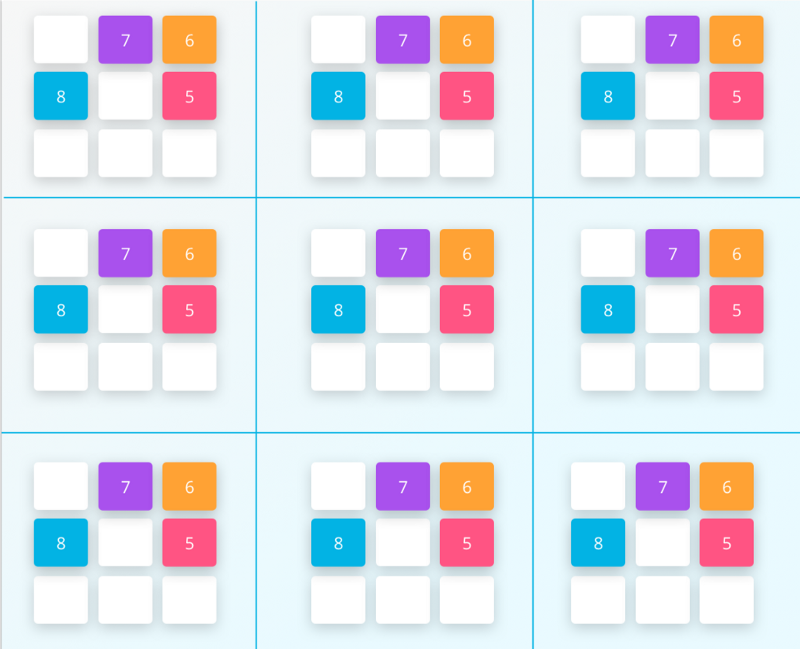
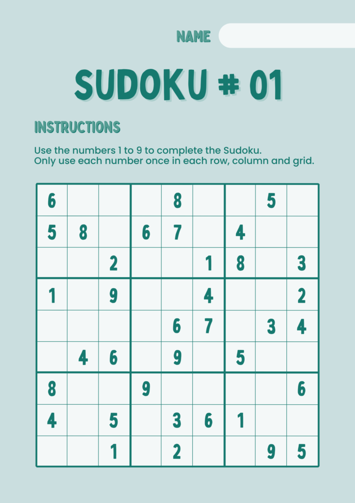

I recently came across Peter Norvig’s <a href="http://www.norvig.com/sudoku.html" rel="noopener" target="_blank">Solving Every Sudoku Puzzle</a>. I was impressed with his concise and beautiful Sudoku Solver Python code that solves any Sudoku puzzles systematically.

However, some people may struggle to understand the concise code and cannot appreciate the beauty. I will break down his article and explain the code step-by-step.

**Note**: the original article by Peter uses Python 2, but I’m using Python 3 in this article. In some places, I changed the indentation of Peter’s code, but I did not alter his program logic.

## The Rule of Sudoku

If you are unfamiliar with Sudoku, I recommend visiting [Sudoku Dragon](http://www.sudokudragon.com/sudoku.htm) and reading their Sudoku rule description.

Peter gives a beautiful summary of its rule in one sentence.

> A puzzle is solved if the squares in each unit are filled with a permutation of the digits 1 to 9.

It may not be obvious at first glance if you don’t know what **squares** and **units** are.

### Squares

> A Sudoku puzzle is a grid of 81 squares; the majority of enthusiasts label the columns 1–9, the rows A-I, and call a collection of nine squares (column, row, or box) a _unit_.

```
A1 A2 A3| A4 A5 A6| A7 A8 A9
B1 B2 B3| B4 B5 B6| B7 B8 B9
C1 C2 C3| C4 C5 C6| C7 C8 C9
--------+---------+---------
D1 D2 D3| D4 D5 D6| D7 D8 D9
E1 E2 E3| E4 E5 E6| E7 E8 E9
F1 F2 F3| F4 F5 F6| F7 F8 F9
--------+---------+---------
G1 G2 G3| G4 G5 G6| G7 G8 G9
H1 H2 H3| H4 H5 H6| H7 H8 H9
I1 I2 I3| I4 I5 I6| I7 I8 I9
```

So, C2 is a square at the intersection of the third row (which is C) and the second column (which is 2).

### The digits, rows and cols

Peter defines digits, rows, and cols as strings.

```python
digits   = '123456789'
rows     = 'ABCDEFGHI'
cols     = digits
```

A string can be treated as a list of characters, and you can access each element using for loop.

```python
for a in digits:
    print(a)
```

It should output the below:

```bash
1
2
3
4
5
6
7
8
9
```

You might be wondering why Peter defines `cols = digits`. Why do we need two names for the same thing? After all, they are both the same character sequence. It will be clear as you read further in his program. You will appreciate that Peter uses digits and cols appropriately for better readability.

For now, just remember the following. When you see digits in his code, you should consider them a list of digits from ‘1’ to ‘9’. When you see cols, you should consider it a list of column identifiers from ‘1’ to ‘9’. Both are exactly the same values, but their semantics are different.

### The cross&nbsp;function

A list of squares can be composed in the following code:

```python
squares = []
for a in rows:
    for b in cols:
        squares.append(a+b)
```

In the above code, `a+b` is not a mathematical operation. It is a string concatenation operation. The character from a and the character from b are concatenated (i.e. joined). For example, when `a=’A’` and `b=’1'`, `a+b` yields `‘A1’`.

```python
> print(squares)

['A1', 'A2', 'A3', 'A4', 'A5', 'A6', 'A7', 'A8', 'A9', 'B1', 'B2', 'B3', 'B4', 'B5', 'B6', 'B7', 'B8', 'B9', 'C1', 'C2', 'C3', 'C4', 'C5', 'C6', 'C7', 'C8', 'C9', 'D1', 'D2', 'D3', 'D4', 'D5', 'D6', 'D7', 'D8', 'D9', 'E1', 'E2', 'E3', 'E4', 'E5', 'E6', 'E7', 'E8', 'E9', 'F1', 'F2', 'F3', 'F4', 'F5', 'F6', 'F7', 'F8', 'F9', 'G1', 'G2', 'G3', 'G4', 'G5', 'G6', 'G7', 'G8', 'G9', 'H1', 'H2', 'H3', 'H4', 'H5', 'H6', 'H7', 'H8', 'H9', 'I1', 'I2', 'I3', 'I4', 'I5', 'I6', 'I7', 'I8', 'I9']
```

We can use the list comprehension technique to make it more concise.

```python
squares = [a+b for a in rows for b in cols]
```

Finally, the below shows Peter’s code. He defines a function `` cross `` to make the code more readable.

```python
def cross(A, B):
    "Cross product of elements in A and elements in B."
    return [a+b for a in A for b in B]

squares = cross(rows, cols)
```

Therefore, the function `` cross `` generates all cross products of characters from rows and cols. The `` squares `` variable points to a list of all the 81 squares.

### Unit List

> Every square has exactly 3 units

There are 81 squares on the Sudoku board and each square has exactly 3 units (no less, no more).

For example, the 3 units of the square C2 are shown below:

__The column-unit of C2__

<pre><code>
    A2    |          |
    B2    |          |
    <strong>C2</strong>    |          |
----------+----------+---------
    D2    |          |
    E2    |          |
    F2    |          |
----------+----------+---------
    G2    |          |
    H2    |          |
    I2    |          |
</code></pre>

__The row-unit of C2__

<pre><code>
          |          |
          |          |
 C1 <strong>C2</strong> C3 | C4 C5 C6 | C7 C8 C9
----------+----------+---------
          |          |
          |          |
          |          |
----------+----------+---------
          |          |
          |          |
          |          |
</code></pre>

__The box unit of C2__

<pre><code>
 A1 A2 A3 |          |
 B1 B2 B3 |          |
 C1 <strong>C2</strong> C3 |          |
----------+----------+---------
          |          |
          |          |
          |          |
----------+----------+---------
          |          |
          |          |
          |          |
</code></pre>

The column, the row, and the box (3x3 area) that contains square C2 are the 3 units of square C2. 

In total, there are 27 units on the Sudoku board. They are 9 column units, 9 row units, and 9 box units.

We can use the function `` cross `` to generate the 9 column units:

```python
> [cross(rows, c) for c in cols]

[['A1', 'B1', 'C1', 'D1', 'E1', 'F1', 'G1', 'H1', 'I1'],
 ['A2', 'B2', 'C2', 'D2', 'E2', 'F2', 'G2', 'H2', 'I2'],
 ['A3', 'B3', 'C3', 'D3', 'E3', 'F3', 'G3', 'H3', 'I3'],
 ['A4', 'B4', 'C4', 'D4', 'E4', 'F4', 'G4', 'H4', 'I4'],
 ['A5', 'B5', 'C5', 'D5', 'E5', 'F5', 'G5', 'H5', 'I5'],
 ['A6', 'B6', 'C6', 'D6', 'E6', 'F6', 'G6', 'H6', 'I6'],
 ['A7', 'B7', 'C7', 'D7', 'E7', 'F7', 'G7', 'H7', 'I7'],
 ['A8', 'B8', 'C8', 'D8', 'E8', 'F8', 'G8', 'H8', 'I8'],
 ['A9', 'B9', 'C9', 'D9', 'E9', 'F9', 'G9', 'H9', 'I9']]
```

Similarly, we can generate the 9 row units:

```python
> [cross(r, cols) for r in rows]

[['A1', 'A2', 'A3', 'A4', 'A5', 'A6', 'A7', 'A8', 'A9'],
 ['B1', 'B2', 'B3', 'B4', 'B5', 'B6', 'B7', 'B8', 'B9'],
 ['C1', 'C2', 'C3', 'C4', 'C5', 'C6', 'C7', 'C8', 'C9'],
 ['D1', 'D2', 'D3', 'D4', 'D5', 'D6', 'D7', 'D8', 'D9'],
 ['E1', 'E2', 'E3', 'E4', 'E5', 'E6', 'E7', 'E8', 'E9'],
 ['F1', 'F2', 'F3', 'F4', 'F5', 'F6', 'F7', 'F8', 'F9'],
 ['G1', 'G2', 'G3', 'G4', 'G5', 'G6', 'G7', 'G8', 'G9'],
 ['H1', 'H2', 'H3', 'H4', 'H5', 'H6', 'H7', 'H8', 'H9'],
 ['I1', 'I2', 'I3', 'I4', 'I5', 'I6', 'I7', 'I8', 'I9']]
```

For the 9 box units, we break rows and cols into 3 groups and generate cross products.

```python
> [cross(rs, cs) for rs in ('ABC','DEF','GHI') for cs in ('123','456','789')]

[['A1', 'A2', 'A3', 'B1', 'B2', 'B3', 'C1', 'C2', 'C3'],
 ['A4', 'A5', 'A6', 'B4', 'B5', 'B6', 'C4', 'C5', 'C6'],
 ['A7', 'A8', 'A9', 'B7', 'B8', 'B9', 'C7', 'C8', 'C9'],
 ['D1', 'D2', 'D3', 'E1', 'E2', 'E3', 'F1', 'F2', 'F3'],
 ['D4', 'D5', 'D6', 'E4', 'E5', 'E6', 'F4', 'F5', 'F6'],
 ['D7', 'D8', 'D9', 'E7', 'E8', 'E9', 'F7', 'F8', 'F9'],
 ['G1', 'G2', 'G3', 'H1', 'H2', 'H3', 'I1', 'I2', 'I3'],
 ['G4', 'G5', 'G6', 'H4', 'H5', 'H6', 'I4', 'I5', 'I6'],
 ['G7', 'G8', 'G9', 'H7', 'H8', 'H9', 'I7', 'I8', 'I9']]
```

We combine all 3 groups of the units into one list. Peter defines `unitlist` as follows:

```python
unitlist = ([cross(rows, c) for c in cols] +
            [cross(r, cols) for r in rows] +
            [cross(rs, cs) for rs in ('ABC','DEF','GHI') for cs in ('123','456','789')])
```

Let’s see the number of units:

```python
> print(len(unitlist))

27
```

We know that there are 3 units for each square. This can be expressed in a Python dictionary as follows:

```python
units = {}
for s in squares:
    for u in unitlist:
        if s in u:
            if s not in units:
                units[s] = []
            units[s].append(u)
```

This dictionary uses square values as keys and a list of units as values. For example, the 3 units of ‘C2’ can be accessed as follows:

```python
> units['C2']

[['A2', 'B2', 'C2', 'D2', 'E2', 'F2', 'G2', 'H2', 'I2'],
 ['C1', 'C2', 'C3', 'C4', 'C5', 'C6', 'C7', 'C8', 'C9'],
 ['A1', 'A2', 'A3', 'B1', 'B2', 'B3', 'C1', 'C2', 'C3']]
```

Peter uses much more concise code to achieve the same.

```python
units = dict((s, [u for u in unitlist if s in u]) for s in squares)
```

### The Rule of Sudoku (Once&nbsp;Again)

Now that you know __squares__ and __units__, we are ready to appreciate Peter’s definition of the Sudoku rule:

>　A puzzle is solved if the squares in each unit are filled with a permutation of the digits 1 to 9.

If it is not yet very clear, you should really visit [Sudoku Dragon](http://www.sudokudragon.com/sudoku.htm) and read their description of the Sudoku rule. Otherwise, it will not make any sense to read what comes after here.

### Peers

There is one more terminology we need to introduce before talking about Peter’s Sudoku Solver. It’s called __peers__.

Let me give an example first. The peers of `C2` are all squares in the related 3 units except for `C2` itself.

```python
C2_peers = set()         # keep unique values using set

for unit in units['C2']: # the 3 units of C2:
    for square in unit:  # all squares in the current unit
        if square != 'C2':
            C2_peers.add(square)</code></pre>
```

Let’s examine the values of C2_peers:

```python
> print(C2_peers)

{'E2', 'C7', 'A3', 'D2', 'C1', 'A2', 'B3', 'A1', 'G2', 'I2', 'C5', 'C4', 'H2', 'C3', 'B1', 'B2', 'C9', 'C6', 'F2', 'C8'}
```

We can store all peers for all squares in a Python dictionary as follows:

```python
peers = {}
for s in squares:
    unit_set = set()
    for unit in units[s]:
        for square in unit:
            if square != s:
                unit_set.add(square)
    peers[s] = unit_set
```

For example, all peers of `C2` can be accessed as follows:

```python
> print(peers['C2'])

{'E2', 'C7', 'A3', 'D2', 'C1', 'A2', 'B3', 'A1', 'G2', 'I2', 'C5', 'C4', 'H2', 'C3', 'B1', 'B2', 'C9', 'C6', 'F2', 'C8'}
```

The above code has 3 `for-loop` statements. Can we simplify this using Python’s built-in function?

The answer is yes but you need to know how the Python list addition works. Let’s take a look at the following example.

```python
> a = [1, 2, 3]
> b = [4, 3, 6]
>
> a+b

[1, 2, 3, 4, 3, 6]
```

The addition of two Python lists is a combined list. Now, the same thing can be achieved using the built-in function sum.

```python
> sum([a, b], [])

[1, 2, 3, 4, 3, 6]
```

The function `sum` takes two arguments. The first argument is an iterable object, and the second argument is the initial value. The function `sum` will use the second value as the initial value and append each element of the first argument to it. For more details, please refer to the Python online documentation: [https://docs.python.org/3/library/functions.html#sum](https://docs.python.org/3/library/functions.html\#sum).</a>

The same result can be achieved by the following:

```python
> [] + a + b

[1, 2, 3, 4, 3, 6]
```

But using the function `sum` is more convenient when you have a list of items.

You might have noticed that there are two '3's in the combined list. This was deliberate. We can use a `` set `` object to have unique values.

```python
> set(sum([a, b], []))

{1, 2, 3, 4, 6}
```

Suppose you want to remove 4 from this set, you can subtract a set that contains only 4.

```python
> set(sum([a, b], [])) - set([4])

{1, 2, 3, 6}
```

Now, we are ready to simplify the 3 `for-loop` operations into one statement. Peter uses the following statement to express all peers for all squares in a dictionary.

```python
peers = dict((s, set(sum(units[s],[]))-set([s])) for s in squares)
```

Note: `units[s]` returns a list of 3 units, each of which is a list of squares. The sum function will combine all 3 unit lists into one list, which is a list of all squares in the 3 units. Using set, we keep the unique square values excluding the original square that is used to fetch all 3 units. Finally, the list of squares is stored in the dictionary using the original square as the key.

```python
> print(peers['C2'])

{'B3', 'A2', 'A1', 'G2', 'C5', 'H2', 'B2', 'E2', 'C7', 'D2', 'C1', 'A3', 'I2', 'C4', 'C3', 'B1', 'C9', 'C6', 'F2', 'C8'}
```

Each square has exactly 20 peers.

### Unit Testing Squares, Units and Peers

After defining squares, units, and peers, Peter tests the values.

```python
def test():
    "A set of unit tests."
    assert len(squares) == 81
    assert len(unitlist) == 27
    assert all(len(units[s]) == 3 for s in squares)
    assert all(len(peers[s]) == 20 for s in squares)
    assert units['C2'] == [
      ['A2', 'B2', 'C2', 'D2', 'E2', 'F2', 'G2', 'H2', 'I2'],
      ['C1', 'C2', 'C3', 'C4', 'C5', 'C6', 'C7', 'C8', 'C9'],
      ['A1', 'A2', 'A3', 'B1', 'B2', 'B3', 'C1', 'C2', 'C3']]
    assert peers['C2'] == set(
      ['A2', 'B2', 'D2', 'E2', 'F2', 'G2', 'H2', 'I2',
       'C1', 'C3', 'C4', 'C5', 'C6', 'C7', 'C8', 'C9',
       'A1', 'A3', 'B1', 'B3'])
    print('All tests pass.')
```

Let’s run the test.

```python
> test()

All tests pass.
```

## Initial Representation of Sudoku&nbsp;Puzzle

Peter’s Sudoku Solver accepts the various representations as input.

The following string is one such example:

```python
"4.....8.5.3..........7......2.....6.....8.4......1.......6.3.7.5..2.....1.4......"
```

The first 9 characters make up the first row, the second 9 characters make up the second row, and so on. All dots are interpreted as empty squares.

Below is another representation:

```python
"""
400000805
030000000
000700000
020000060
000080400
000010000
000603070
500200000
104000000"""
```

Here, all zero characters are interpreted as empty squares. New lines are ignored.

Below is yet another example:

```python
"""
4 . . |. . . |8 . 5
. 3 . |. . . |. . .
. . . |7 . . |. . .
------+------+------
. 2 . |. . . |. 6 .
. . . |. 8 . |4 . .
. . . |. 1 . |. . .
------+------+------
. . . |6 . 3 |. 7 .
5 . . |2 . . |. . .
1 . 4 |. . . |. . .
"""
```

Anything other than ‘0’, ‘1’, ‘2’, ‘3’, ‘4’, ‘5’, ‘6’, ‘7’, ‘8’, ‘9’ and ‘.’ are ignored such as ‘|’ and ‘+’.

Suppose we want to parse the following initial values stored in grid1:

```python
grid1 = """
4 . . |. . . |8 . 5
. 3 . |. . . |. . .
. . . |7 . . |. . .
------+------+------
. 2 . |. . . |. 6 .
. . . |. 8 . |4 . .
. . . |. 1 . |. . .
------+------+------
. . . |6 . 3 |. 7 .
5 . . |2 . . |. . .
1 . 4 |. . . |. . .
"""
```

The following will extract only the values we need.

```python
grid1_chars = []

for c in grid1:
    if c in digits or c in '0.':
        grid1_chars.append(c)

assert len(grid1_chars) == 81
```

Let’s examine the grid1\_chars:

```python
> print(grid1_chars)
['4', '.', '.', '.', '.', '.', '8', '.', '5', '.', '3', '.', '.', '.', '.', '.', '.', '.', '.', '.', '.', '7', '.', '.', '.', '.', '.', '.', '2', '.', '.', '.', '.', '.', '6', '.', '.', '.', '.', '.', '8', '.', '4', '.', '.', '.', '.', '.', '.', '1', '.', '.', '.', '.', '.', '.', '.', '6', '.', '3', '.', '7', '.', '5', '.', '.', '2', '.', '.', '.', '.', '.', '1', '.', '4', '.', '.', '.', '.', '.', '.']
```

Then, we can store the values in a dictionary using each square as a key and the corresponding value in char values as a value.

```python
grid1_values = {}

for k, v in zip(squares, grid1_chars):
    grid1_values[k] = v
```

`zip` here takes two lists and creates iterable tuples. For more details, please refer to the Python online documentation: [https://docs.python.org/3/library/functions.html#zip](https://docs.python.org/3/library/functions.html\#zip).

Peter put all the above into a function as follows:

```python
def grid_values(grid):
    "Convert grid into a dict of {square: char} with '0' or '.' for empties."
    chars = [c for c in grid if c in digits or c in '0.']
    assert len(chars) == 81
    return dict(zip(squares, chars))</code></pre>
```

For example, you can call it like below:

```python
> grid1_values = grid_values(grid1)
>
> grid1_values['A1']

'4'
```

## Constraint Propagation

Knowing initial values for all squares (a digit value or an empty value), we can apply constraints to each square by eliminating impossible values for them. Peter lists two simple rules:

> \(1\) If a square has only one possible value, then eliminate that value from the square’s peers. \
  \(2\) If a unit has only one possible place for a value, then put the value there.

Let’s take one step back and imagine that we don’t know the initial values. In this case, all squares can potentially have any digits. We can express this state as follows:

```python
values = dict((s, digits) for s in squares)
```

`values` is a dictionary that associates each square to all digit values (‘123456789’). As soon as we know the initial values, we can eliminate impossible values from other squares.

As an example of strategy (1), ‘A1’ is ‘4’ in grid1\_values. That means ‘A1’ can only have ‘4’ as its value, and we can remove ‘4’ from its peers.

As an example of strategy (2), as none of A2 through I2 except ‘F2’ has ‘4’ as a possible value in grid1\_values, ‘4’ must belong to ‘F2’ and we can eliminate ‘4’ from the peers of ‘F2’.

So, while we assign initial values for each square, we also eliminate them from the peers.

> This process is called constraint propagation.

### The parse_grid function

The outcome of this parsing process leaves only possible values for each square. Peter defines a function to handle this as follows:

```python
def parse_grid(grid):
    """Convert grid to a dict of possible values, {square: digits}, or
    return False if a contradiction is detected."""
    ## To start, every square can be any digit; then assign values from the grid.
    values = dict((s, digits) for s in squares)
    for s,d in grid_values(grid).items():
        if d in digits and not assign(values, s, d):
            return False ## (Fail if we can't assign d to square s.)
    return values
```

In the above function,

*   values are given digits as the initial value in a dictionary where each square is used as a key.
*   The given grid contains the initial representation of Sudoku puzzle.
*   We use grid\_values function to extract only relevant values (digits, ‘0’ and ‘.’).
*   For each square with initial digit value, we call the assign function to assign the value to the square while eliminating it from the peers
*   If something goes wrong in the assign function, it returns False to signify the failure
*   If no errors, the function returns the values dictionary back to the caller

The assign function is not yet defined here. Other than that, the parse\_grid function should be self-explanatory if you read it line by line.

### The assign functions

The function assign(values, s, d) updates the incoming values by eliminating the other values than d from the square s calling the function to eliminate(values, s, d).

If any `eliminate` call returns False, the function `assign` returns False indicating that there is a contradiction.

```python
def assign(values, s, d):
    """Eliminate all the other values (except d) from values[s] and propagate.
    Return values, except return False if a contradiction is detected."""
    other_values = values[s].replace(d, '')
    if all(eliminate(values, s, d2) for d2 in other_values):
        return values
    else:
        return False
```

### The eliminate function

So what does the eliminate function do?

*   It removes the given value d from values\[s\] which is a list of potential values for s.
*   If there is no values left in values\[s\] (that is we don’t have any potential value for that square), returns False
*   When there is only one potential value for s, it removes the value from all the peers of s (the value is for s and the peers can not have it to satisfy the Sudoku rule) __&lt;== strategy (1)__
*   Make sure the given value d has a place elsewhere (i.e., if no square has d as a potential value, we can not solve the puzzle). If this test fails, it returns False
*   Where there is only one place for the value d, remove it from the peers __&lt;== strategy (2)__

The function is a bit lengthy but if you have followed the discussion so far, you should be able to understand it.

```python
def eliminate(values, s, d):
    """Eliminate d from values[s]; propagate when values or places &lt;= 2.
    Return values, except return False if a contradiction is detected."""
    if d not in values[s]:
        return values ## Already eliminated
    values[s] = values[s].replace(d,'')

    ## (1) If a square s is reduced to one value d2, then eliminate d2 from the peers.
    if len(values[s]) == 0:
        return False ## Contradiction: removed last value
    elif len(values[s]) == 1:
        d2 = values[s]
        if not all(eliminate(values, s2, d2) for s2 in peers[s]):
            return False

    ## (2) If a unit u is reduced to only one place for a value d, then put it there.
    for u in units[s]:
        dplaces = [s for s in u if d in values[s]]
        if len(dplaces) == 0:
            return False ## Contradiction: no place for this value
        elif len(dplaces) == 1:
            # d can only be in one place in unit; assign it there
            if not assign(values, dplaces[0], d):
                return False
    return values
```

### The display function

By calling parse\_grid, we know what are the potential values for each square. Naturally, we want to display the result.

```python
def display(values):
    "Display these values as a 2-D grid."
    width = 1+max(len(values[s]) for s in squares)
    line = '+'.join(['-'*(width*3)]*3)
    for r in rows:
        print(''.join(values[r+c].center(width)+('|' if c in '36' else '') for c in cols))
        if r in 'CF':
            print(line)
    print()
```

I’m not going to explain the details of this function. If you are curious, play with it by changing here and there, and you’ll know how it works.

Below is an example output.

```python
> grid2 = '4.....8.5.3..........7......2.....6.....8.4......1.......6.3.7.5..2.....1.4......'

> display(parse_grid(grid2))

   4      1679   12679  |  139     2369    269   |   8      1239     5
 26789     3    1256789 | 14589   24569   245689 | 12679    1249   124679
  2689   15689   125689 |   7     234569  245689 | 12369   12349   123469
------------------------+------------------------+------------------------
  3789     2     15789  |  3459   34579    4579  | 13579     6     13789
  3679   15679   15679  |  359      8     25679  |   4     12359   12379
 36789     4     56789  |  359      1     25679  | 23579   23589   23789
------------------------+------------------------+------------------------
  289      89     289   |   6      459      3    |  1259     7     12489
   5      6789     3    |   2      479      1    |   69     489     4689
   1      6789     4    |  589     579     5789  | 23569   23589   23689
```

So, for example, the square `C2` has `15689` as a list of possible values.

Can we enhance the eliminate function further to remove more values by implementing strategies like the [naked twins](http://www.sudokudragon.com/sudokustrategy.htm)?

It’s possible to pursue that route. But Peter says otherwise:

> Coding up strategies like this is a possible route, but would require hundreds of lines of code (there are dozens of these strategies), and we’d never be sure if we could solve every puzzle.

## Search

So, what is the alternative to solving every Sudoku puzzle?

> The other route is to search for a solution: to systematically try all possibilities until we hit one that works. The code for this is less than a dozen lines…

Sounds nice. But…Peter continues:

> …we run another risk: that it might take forever to run. Consider that in the grid2 above, A2 has 4 possibilities (1679) and A3 has 5 possibilities (12679); together that’s 20, and if we keep multiplying, we get 4.62838344192 × 1038 possibilities for the whole puzzle.

Peter further explains his search algorithm:

*   first make sure we haven’t already found a solution or a contradiction, and if not,
*   choose one unfilled square and consider all its possible values.
*   One at a time, try assigning the square each value, and searching from the resulting position.

> we search for a value d such that we can successfully search for a solution from the result of assigning square s to d. If the search leads to an failed position, go back and consider another value of d. This is a recursive search, and we call it a depth-first search because we (recursively) consider all possibilities under values[s] = d before we consider a different value for s.

Finally, Peter explains how to choose which square to start exploring which is called __variable ordering__:

> we will use a common heuristic called minimum remaining values, which means that we choose the (or one of the) square with the minimum number of possible values. Why? Consider grid2 above. Suppose we chose B3 first. It has 7 possibilities (1256789), so we’d expect to guess wrong with probability 6/7. If instead we chose G2, which only has 2 possibilities (89), we’d expect to be wrong with probability only 1/2. Thus we choose the square with the fewest possibilities and the best chance of guessing right.

For __value ordering__ (Which digit do we try first for the square?), Peter says:

> we won’t do anything special; we’ll consider the digits in numeric order.

The following sections explain Peter’s search algorithm.

### The solve function

```python
def solve(grid):
    return search(parse_grid(grid))</code></pre>
```

The solve function parses the initial representation and calls the search function.

### The search&nbsp;function

```python
def search(values):
    "Using depth-first search and propagation, try all possible values."
    if values is False:
        return False ## Failed earlier
    if all(len(values[s]) == 1 for s in squares):
        return values ## Solved!
    ## Chose the unfilled square s with the fewest possibilities
    n,s = min((len(values[s]), s) for s in squares if len(values[s]) &gt; 1)
    return some(search(assign(values.copy(), s, d)) for d in values[s])</code></pre>
```

*   If every square has exactly one value, the puzzle is solved.
*   Select a square with minimum number of potential values, and call assign to eliminate a potential value from the peers
*   Call the search function recursively by passing the values after the above elimination

Note: values are copied and passed down to the `assign` call to avoid book-keeping complexity.

If one of the attempts succeeds, we solved the puzzle. To check this, the function some is used.

```python
def some(seq):
    "Return some element of seq that is true."
    for e in seq:
        if e: return e
    return False</code></pre>
```

That’s all. We have a Solver that works for any Sudoku.

## The Complete Solver Code

For your reference, I put Peter’s complete Sudoku Solver code here.

```python
def cross(A, B):
    "Cross product of elements in A and elements in B."
    return [a+b for a in A for b in B]

digits   = '123456789'
rows     = 'ABCDEFGHI'
cols     = digits
squares  = cross(rows, cols)
unitlist = ([cross(rows, c) for c in cols] +
            [cross(r, cols) for r in rows] +
            [cross(rs, cs) for rs in ('ABC','DEF','GHI') for cs in ('123','456','789')])
units = dict((s, [u for u in unitlist if s in u])
             for s in squares)
peers = dict((s, set(sum(units[s],[]))-set([s]))
             for s in squares)

def parse_grid(grid):
    """Convert grid to a dict of possible values, {square: digits}, or
    return False if a contradiction is detected."""
    ## To start, every square can be any digit; then assign values from the grid.
    values = dict((s, digits) for s in squares)
    for s,d in grid_values(grid).items():
        if d in digits and not assign(values, s, d):
            return False ## (Fail if we can't assign d to square s.)
    return values

def grid_values(grid):
    "Convert grid into a dict of {square: char} with '0' or '.' for empties."
    chars = [c for c in grid if c in digits or c in '0.']
    assert len(chars) == 81
    return dict(zip(squares, chars))

def assign(values, s, d):
    """Eliminate all the other values (except d) from values[s] and propagate.
    Return values, except return False if a contradiction is detected."""
    other_values = values[s].replace(d, '')
    if all(eliminate(values, s, d2) for d2 in other_values):
        return values
    else:
        return False

def eliminate(values, s, d):
    """Eliminate d from values[s]; propagate when values or places &lt;= 2.
    Return values, except return False if a contradiction is detected."""
    if d not in values[s]:
        return values ## Already eliminated
    values[s] = values[s].replace(d,'')
    ## (1) If a square s is reduced to one value d2, then eliminate d2 from the peers.
    if len(values[s]) == 0:
        return False ## Contradiction: removed last value
    elif len(values[s]) == 1:
        d2 = values[s]
        if not all(eliminate(values, s2, d2) for s2 in peers[s]):
            return False
    ## (2) If a unit u is reduced to only one place for a value d, then put it there.
    for u in units[s]:
        dplaces = [s for s in u if d in values[s]]
        if len(dplaces) == 0:
            return False ## Contradiction: no place for this value
        elif len(dplaces) == 1:
            # d can only be in one place in unit; assign it there
            if not assign(values, dplaces[0], d):
                return False
    return values

def solve(grid): return search(parse_grid(grid))

def search(values):
    "Using depth-first search and propagation, try all possible values."
    if values is False:
        return False ## Failed earlier
    if all(len(values[s]) == 1 for s in squares):
        return values ## Solved!
    ## Chose the unfilled square s with the fewest possibilities
    n,s = min((len(values[s]), s) for s in squares if len(values[s]) &gt; 1)
    return some(search(assign(values.copy(), s, d))
           for d in values[s])

def some(seq):
    "Return some element of seq that is true."
    for e in seq:
        if e: return e
    return False</code></pre>
```

There are results reported in the article which show how well it works.

## Why?

In the end, Peter explains why he did this project:

> As computer security expert Ben Laurie has stated, Sudoku is “a denial of service attack on human intellect”. Several people I know (including my wife) were infected by the virus, and I thought maybe this would demonstrate that they didn’t need to spend any more time on Sudoku.

## Conclusion

I hope this article finds some use for people having a hard time understanding Peter Norvig’s Sudoku solver article which is an excellent one but requires the reader to have a certain level of Python mastery.

{width="50%"}

## References

- [Solving Every Sudoku Puzzle](http://norvig.com/sudoku.html) \
  Peter Norvig
- [Solving Any Sudoku Puzzle](https://github.com/norvig/pytudes/blob/main/ipynb/Sudoku.ipynb) \
  Peter Norvig’s Python notebook