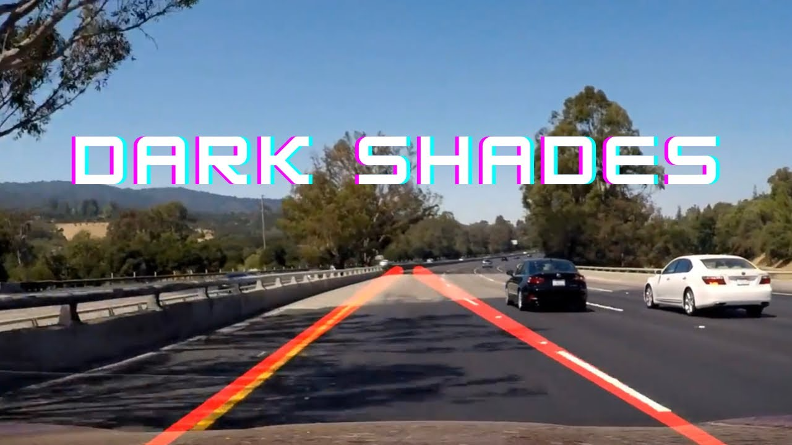

I used Python and OpenCV to detect lane lines in the road images in this project. The source codes are available on [my Github](https://github.com/naokishibuya/car-finding-lane-lines).

<iframe width="560" height="315" src="https://www.youtube.com/embed/HTPEWC-fjCQ" title="YouTube video player" frameborder="0" allow="accelerometer; autoplay; clipboard-write; encrypted-media; gyroscope; picture-in-picture; web-share" allowfullscreen></iframe>

We use the following techniques:

- Color Selection
- Canny Edge Detection
- Region of Interest Selection
- Hough Transform Line Detection

Finally, I applied all the techniques to process video clips to find lane lines.

## Test Images for Lane Detection

Below are the test images:

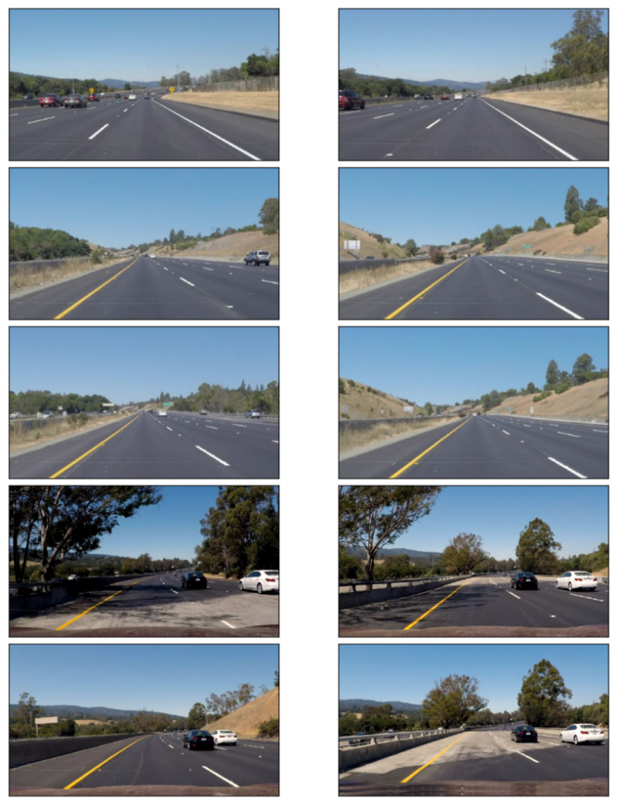

I use these images to test my pipeline (a series of image processing) to find lane lines on the road.

The lines are in white or yellow. A white lane is a series of alternating dots and short lines, which we must detect as one line.

## Color Selection

### RGB Color Space

The images are in RGB color space. Let’s try selecting only yellow and white colors in the images using the RGB channels (ref: [RGB Color Code Chart](http://www.rapidtables.com/web/color/RGB_Color.html)).

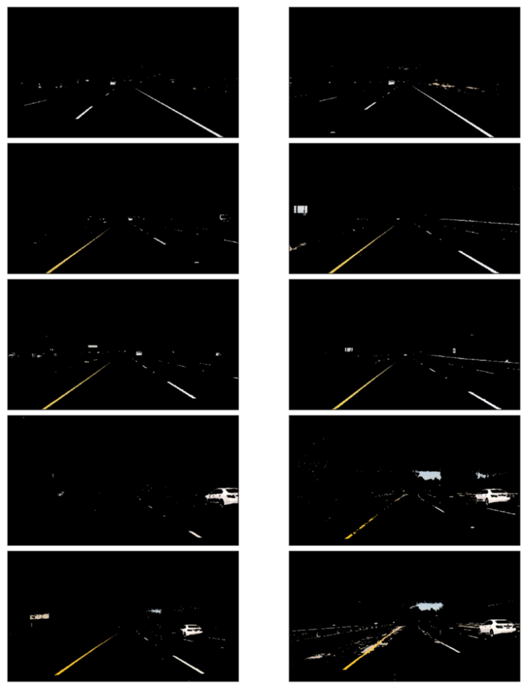

It looks pretty good except for the two, in which the yellow lines are unclear due to the dark shade from the tree on the left.

### HSL and HSV Color Space

Using `cv2.cvtColor`, we can convert RGB images into different color spaces — for example, [HSL and HSV color space](https://en.wikipedia.org/wiki/HSL_and_HSV).

](images/hsl-hsv.png)

### HSV Color Space

How does it look when we convert RGB images into HSV color space?

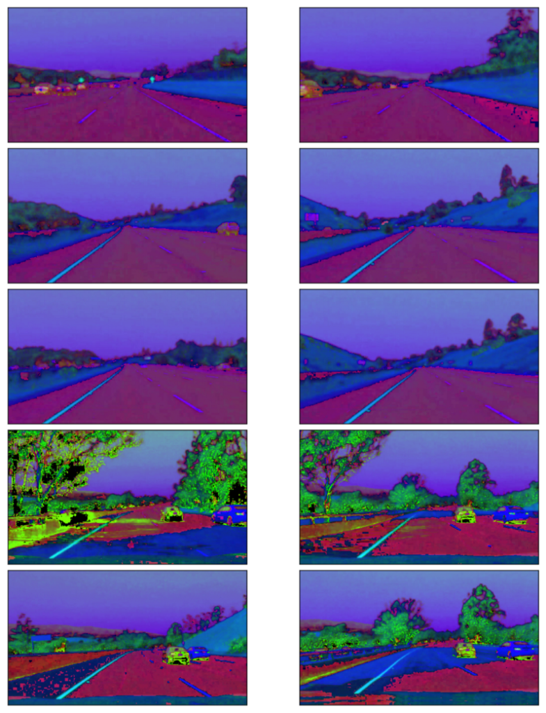

The yellow lines, including those under the shades, are apparent, but the white lines are less clear.

### HSL Color Space

How does it look when we convert RGB images into HSL color space?

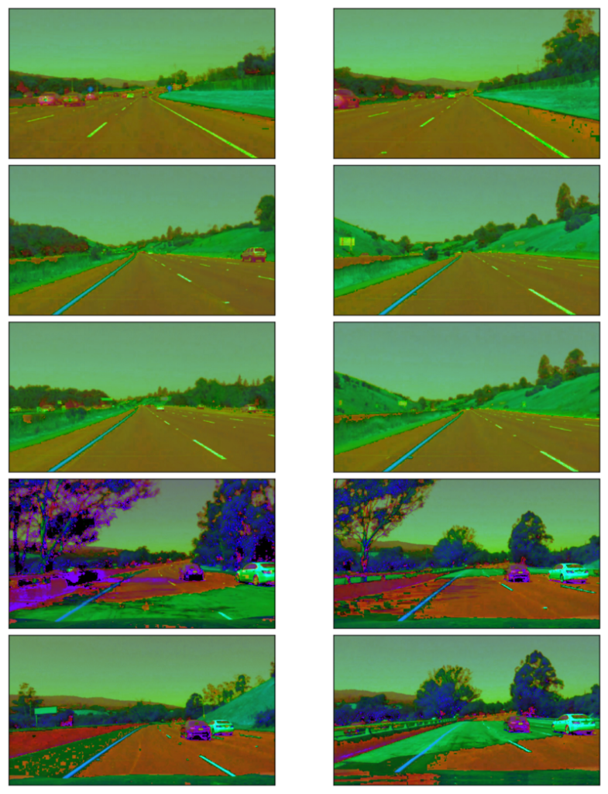

Both the white and yellow lines are recognizable. Also, the yellow lines under the shades are clear.

Let’s build a filter to select those white and yellow lines. I want to select a particular range of each channel (Hue, Saturation, and Light).

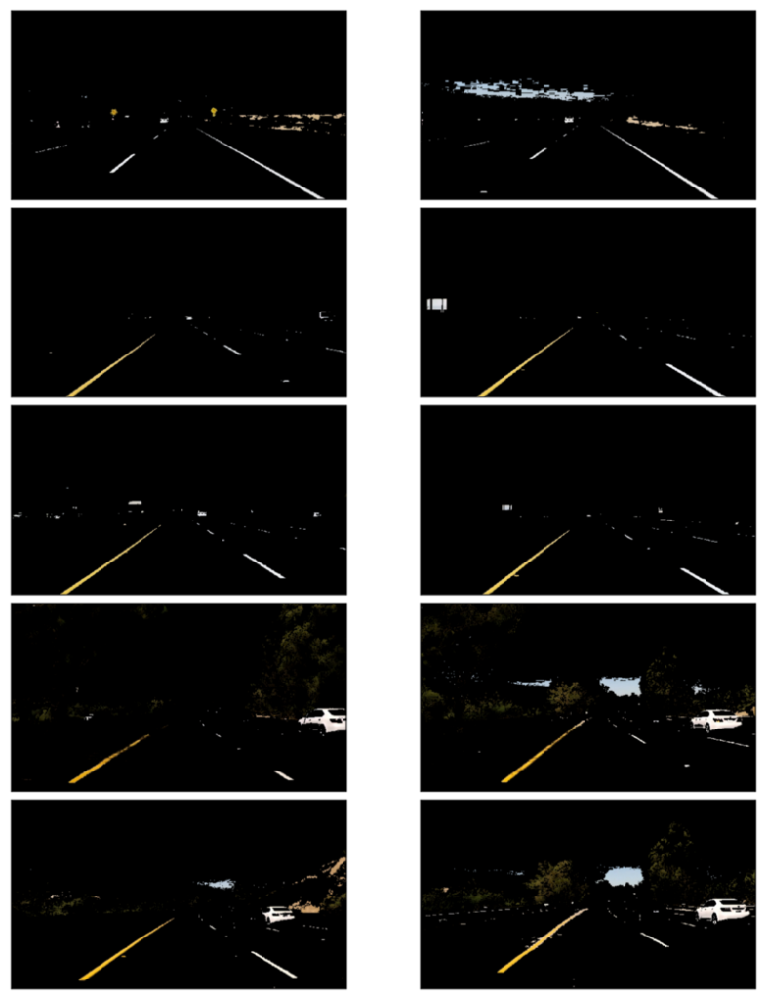

For the white color,

- I chose high **Light** value.
- I did not filter **Hue**, **Saturation** values.

For the yellow color,

- I chose **Hue** around 30 to choose the yellow color.
- I chose relatively high **Saturation** to exclude yellow hills

The combined mask filters the yellow and white lines very clearly.

## Canny Edge Detection

John F. Canny developed the Canny edge detector in 1986.

We want to detect edges to find straight lines, especially lane lines. For this,

- Convert images into grayscale
- Smooth out rough lines
- Find edges

Let’s take a look at each step in detail.

Note: [Canny Edge Detection Wikipedia](https://en.wikipedia.org/wiki/Canny_edge_detector) has an excellent detailed description.

### Gray Scaling

We should convert the images into gray-scaled ones to detect shapes (edges) in the images. That is because the Canny edge detection measures the magnitude of pixel intensity changes or gradients. We'll discuss more on this later.

Here, I’m converting the white and yellow line images from above into grayscale for edge detection.

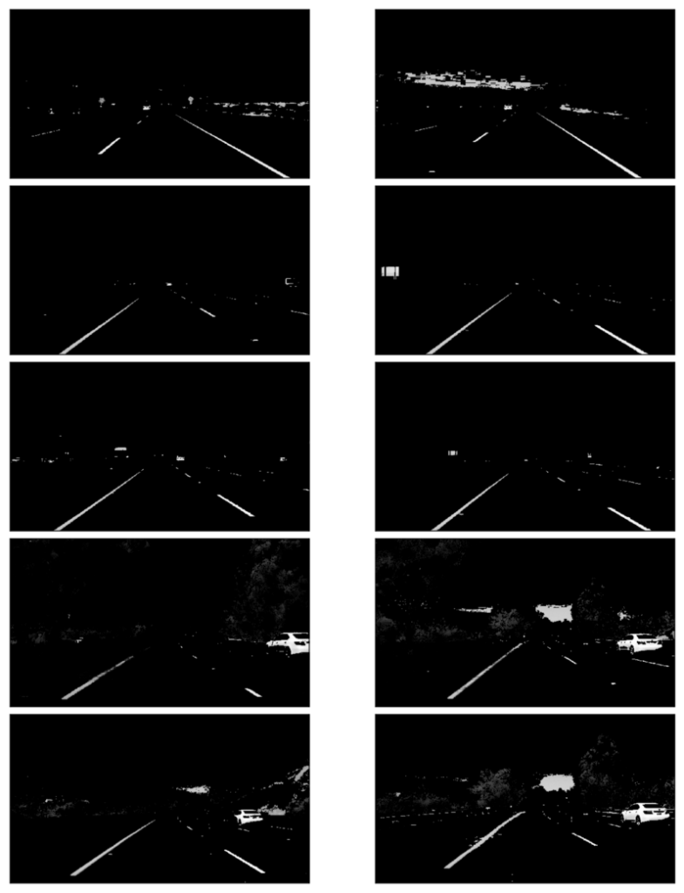

### Gaussian Smoothing (Gaussian Blur)

When there is an edge (i.e., a line), the pixel intensity changes rapidly (i.e., from 0 to 255), which we want to detect. But before doing so, we should make the edges smoother. As you can see, the above images have many rough edges, which cause many noisy edges to be detected.

I applied [Gaussian Blur](https://en.wikipedia.org/wiki/Gaussian_blur) to make the edges smoother.

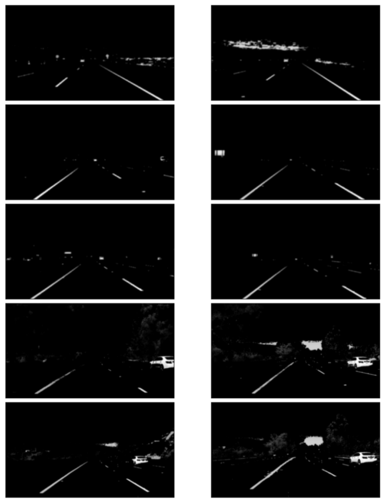

### Edge Detection

I’m using a technique called Canny edge detection which uses the fact that edges have high gradients (how sharply the image changes — for example, dark to white).

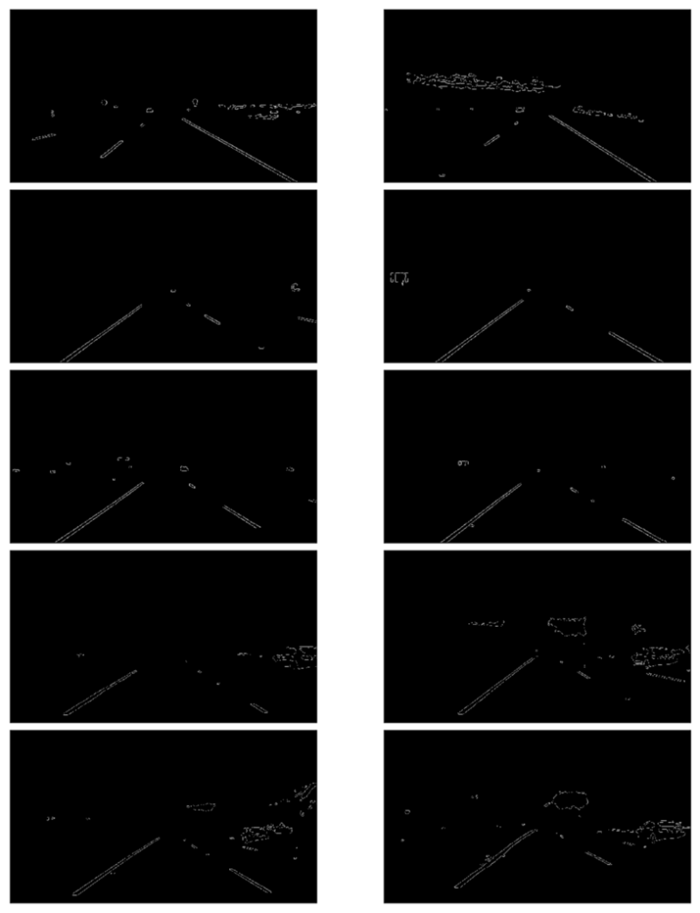

## Region of Interest Selection

We don’t need to check the sky and the hills when finding lane lines.

Roughly speaking, we are interested in the area surrounded by the red lines below:

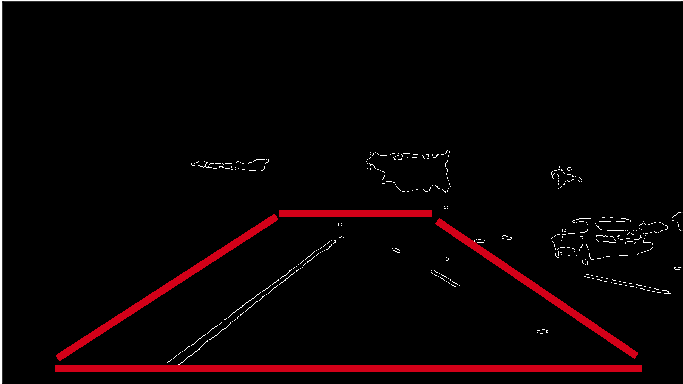

Excluding everything except for the region of interest:

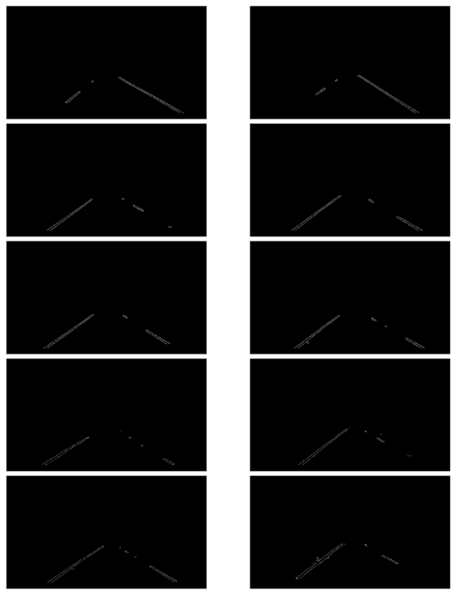

Now we have lane lines, but we need to recognize those two lines: the left lane and the right lane.

## Hough Transform Line Detection

I’m using [Hough Line Transform](https://en.wikipedia.org/wiki/Hough_transform) to detect lines in the edge images.

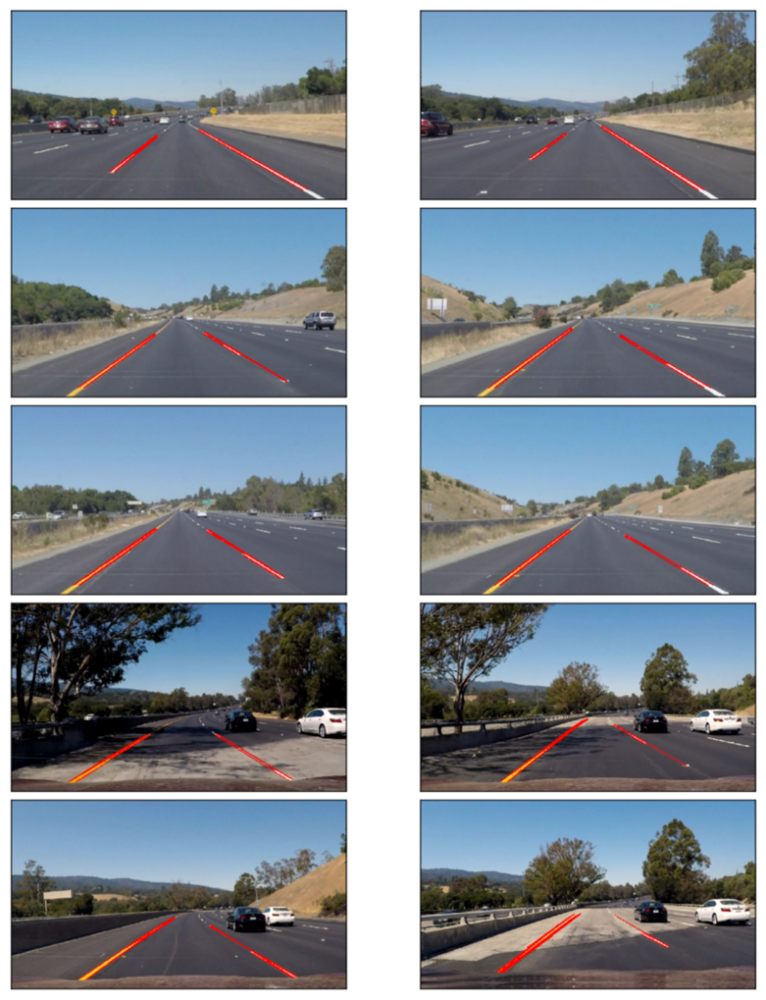

### Averaging and Extrapolating Lines

There are multiple lines detected for a lane line. We should come up with an average line for that.

Also, some lane lines are only partially recognized. We should extrapolate the line to cover the full lane line length.

We want two lane lines: one for the left and the other for the right. The left lane should have a positive slope, and the right lane should have a negative slope. Therefore, we’ll collect positive and negative slope lines separately and take averages.

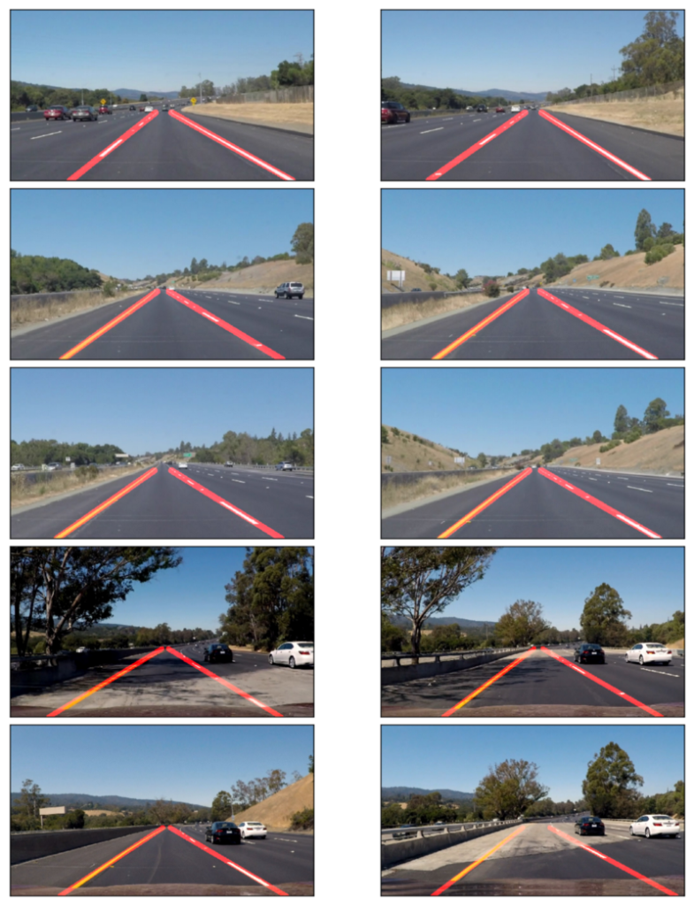

## Video Clips

Finally, I’m drawing the lane lines on the video clips. When doing this, I’m calculating the average lane lines across multiple video image frames to make it smoother (i.e., not bumpy / jumping around).

<iframe width="560" height="315" src="https://www.youtube.com/embed/lc1QNDvjReA" title="YouTube video player" frameborder="0" allow="accelerometer; autoplay; clipboard-write; encrypted-media; gyroscope; picture-in-picture; web-share" allowfullscreen></iframe>

<iframe width="560" height="315" src="https://www.youtube.com/embed/lvLLalGfy9M" title="YouTube video player" frameborder="0" allow="accelerometer; autoplay; clipboard-write; encrypted-media; gyroscope; picture-in-picture; web-share" allowfullscreen></iframe>

<iframe width="560" height="315" src="https://www.youtube.com/embed/HTPEWC-fjCQ" title="YouTube video player" frameborder="0" allow="accelerometer; autoplay; clipboard-write; encrypted-media; gyroscope; picture-in-picture; web-share" allowfullscreen></iframe>

## Conclusion

The project was successful. The video images clearly show that it correctly detected the lane lines, and the processing was smooth.

However, it only detects straight-lane lines. It is an advanced topic to handle curved lanes (or the curvature of lanes). We’ll need to use perspective transformation and poly-fitting lane lines rather than straight lines.

The lanes near the car are mostly straight in the images. The curvature appears at a further distance unless it’s a steep curve. So, this basic lane-finding technique is still handy.

Another thing is that it won’t work for steep (up or down) roads because we assume the region of interest mask from the center of the image.

We first need to detect the horizontal line (between the sky and the earth) for steep roads to tell where the lines should extend.

## References

- [Car Finding Lane Lines Github](https://github.com/naokishibuya/car-finding-lane-lines)
- [RGB Color Code Chart](http://www.rapidtables.com/web/color/RGB_Color.html)
- [HSL and HSV Color Code](https://commons.wikimedia.org/wiki/File:Hsl-hsv_models.svg) \
  Wikipedia
- [Hough Line Transform](https://en.wikipedia.org/wiki/Hough_transform) \
  Wikipedia
- [Canny Edge Detection](https://en.wikipedia.org/wiki/Canny_edge_detector) \
  Wikipedia
- [Gaussian Blur](https://en.wikipedia.org/wiki/Gaussian_blur) \
  Wikipedia
- [Udacity Self-Driving Car Engineer](https://www.udacity.com/drive) \
  Udacity
