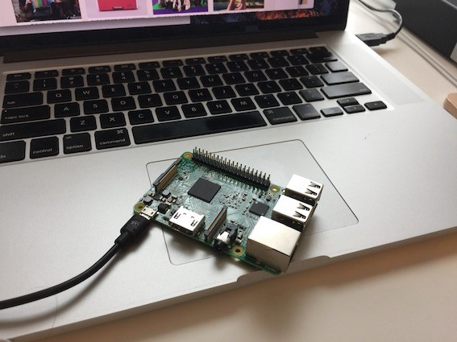

## Motivation

Raspberry Pi is a small computer on which you can install OS (i.e., Linux). In other words, it has no pre-installed OS. You’ll need to install it yourself if you want it to do something useful.

I think it’s fun to do that, but it was a bit tricky for the first time. So, my motivation in this article is to explain how to set up Raspbian — a Debian-based Linux distribution customized for Rasberry Pi in the following four simple steps:

1. What you need (hardware)
2. Make an OS installer on a micro SD card using SDFormatter and NOOBS
3. Boot and install Raspbian (Debian Linux customized for Raspberry Pi)
4. Setup VNC for accessing Raspbian from your computer

## What you need (hardware)

I’m assuming you have a computer with Windows, Linux, or macOS and an SD card reader attached or built-in to your computer. Other than that, you’ll, at minimum, need the following:

- Raspberry Pi 3
- Micro SD (with a full-size SD adapter)
- Monitor (or TV) with an HDMI cable
- Power Supply with a micro USB cable
- USB Keyboard and USB Mouse

Let’s look at each component in detail but focus only on what we need to know.

### Raspberry Pi 3

As mentioned earlier, Raspberry Pi is a computer, and it has the following interfaces:

- 1 Micro SD card slot (on the back side) for storage (OS, programs, etc.)
- 1 HDMI port (for monitor)
- 1 Micro USB Power Supply Slot (for power)
- 4 USB ports (for keyboard, mouse, etc)

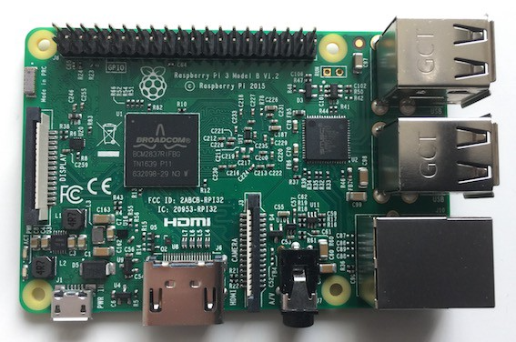

There are different packages of Raspberry Pi, some of which with extra stuff like a touch screen and expansion board. You can also buy a plastic protector so that you won’t touch the electrical components while connecting cables and avoid dust accumulating on your Raspberry Pi.

So, you’ll need to shop around to see what you want. You can buy it online from Amazon or eBay or go to physical shops to check it out. I bought it from the [element14](https://export.farnell.com/) online store, a barebone Raspberry Pi 3.

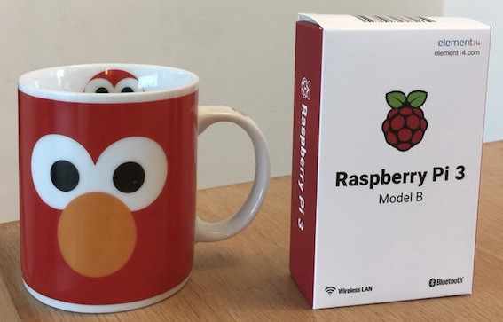

The cup on the left is for size comparison (not part of the Raspberry Pi 3 package, in case you are wondering).

### Micro SD (with a full-size SD adapter)

The micro SD is where you install OS and all the software. 8 GB is the minimum size required. Mine is 64GB. But there is a catch when you format an SD card with more than 32GB (details on this later).

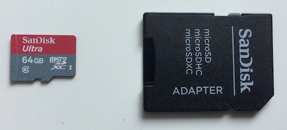

As mentioned earlier, you’ll need an SD card reader connected or built-in to your computer. My Mac Book Pro from 2012 has a built-in SD card reader. But if your computer does not have one, you’ll need an external SD card reader connected to your computer. Later, we’ll format the SD card and install software on it.

### Monitor (or TV) with an HDMI cable

I don’t have an external computer monitor at home, so I used a TV with HDMI slots. I have spare HDMI cables at home, so I used one of them.

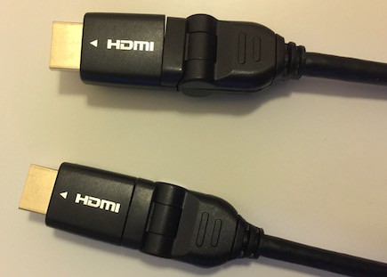

### Power Supply with a micro USB cable

I have a box full of unwanted cables at home in which I found Micro USB cables.

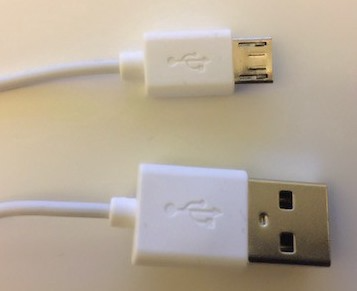

I also had a power adapter with a USB interface. If not, I could plug the normal USB side into my Mac Book Pro or an external battery power bank for my mobile phone. As long as you can take the power supply from there, it’s ok.

Note: It should be a 5-volt 1 amp power supply. Usually, a power adapter has a seal with those details. Look for the “output” section.

### USB Keyboard and USB Mouse

Any keyboard and mouse will do as long as they have a USB interface. I used a Logitech USB keyboard and mouse.

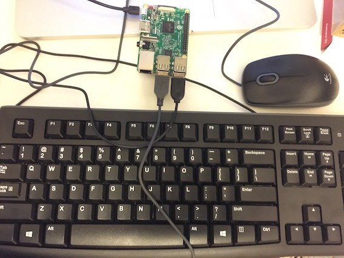

But don’t hook up any cables yet. We need to make an OS installer on a micro SD card to boot up your Raspberry Pi 3.

## Make an OS installer on the micro SD card

Raspberry Pi 3 uses a micro SD card for storage (OS, libraries, and user programs). You need at least 8 GB of storage on your micro SD card. If you do, place your micro SD card into the full-sized adapter and stick it into the SD card reader (built-in or attached to your computer).

Then, all you need is the following two steps to make a bootable OS installation disk.

- Format your micro SD card (FAT format)
- Download and copy the NOOBS files to your micro SD card

### Format your micro SD card (FAT format)

- SDFormatter (if your micro SD card is 32GB or less)

[SDFormatter](https://www.sdcard.org/downloads/) is a tool available from the [SD Association](https://www.sdcard.org/index.html). You can use it to format your micro SD card to FAT format if it’s 32 GB or less.

Otherwise, it will use the **exFAT** format, which **does not work** with Raspberry Pi (i.e., it will not boot up).

More details are available [here](https://www.raspberrypi.org/documentation/installation/sdxc_formatting.md) from the Raspberry Pi website.

- Other formatting tools (if your micro SD card is more than 32GB)

As my micro SD card is 64GB, I used Disk Utility, one of the standard tools available on macOS, to format it with the FAT format.

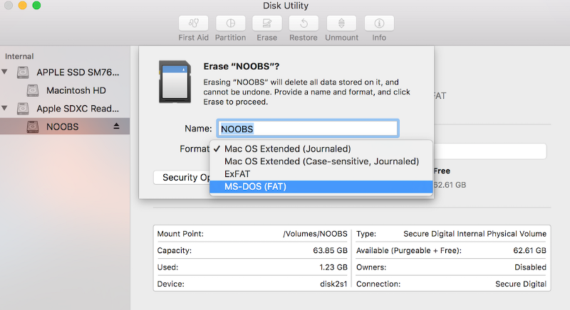

I named my micro SD card NOOBS. Yours may have a different name.

### Download and copy the NOOBS files to your micro SD card

- Download NOOBS (**N**ew **O**ut **O**f **B**ox **S**oftware)

NOOBS is available for download from [here](https://www.raspberrypi.org/downloads/noobs/) on the Raspberry Pi website. Download it and then extract it.

- Copy the NOOBS files to your micro SD card

All you need is to copy the contents of the extracted folder (not the folder itself) to your micro SD card.

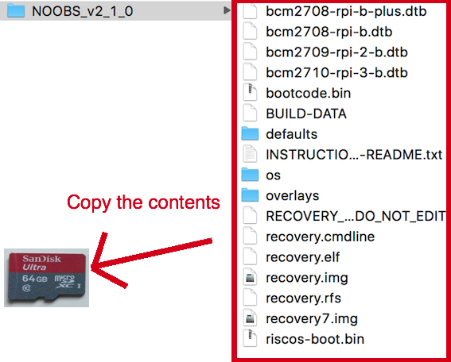

Once again, you must copy the folder's contents (but not the folder itself) to your FAT-formatted micro SD card.

Once the copy is complete, safely remove the SD card from your computer (or your SD card reader). Now, we are ready to boot Raspberry Pi 3.

## Boot and install Raspbian

Raspbian = Raspberry Pi + Debian Linux. It’s a customized Linux for Raspberry Pi based on the Debian Linux distribution.

### Boot Raspbian

Using the micro SD card, we will boot up your Raspberry Pi 3.

First, be careful not to touch any parts of Raspberry Pi 3. As mentioned earlier, you might want to put on a plastic protector before you begin this phase.

Ready? Place your micro SD card (formatted with the NOOBS files copied on it) into Raspberry Pi 3’s micro SD card slot.

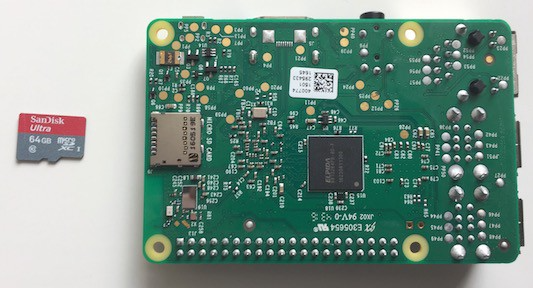

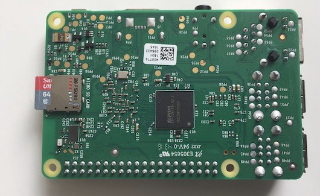

There won’t be any clicking sound or anything while attaching the micro SD card to Raspberry Pi 3. If it looks like the above image, it should be ok.

Now, connect all your cables:

- HDMI cable
- USD Keyboard and mouse
- Micro USB Power Supply Slot (but read the below before you do).

You might have noticed that Raspberry Pi has no power-on button. It will start booting as soon you connect it to a power supply via your micro USB power supply cable.

In my place, the power source on the wall has a power-on button. So, I left it turned off before connecting the power cable to Raspberry Pi 3. Once connected, I ensured that Raspberry Pi was not touching other metals or things that could carry electricity. After that, I turned the power on (on the wall).

Note: you can also use a mobile power bank to supply electricity to Raspberry Pi or connect it to your computer’s USB port.

If all is good, you should start seeing the Raspberry Pi start-up screen on your monitor (or TV).

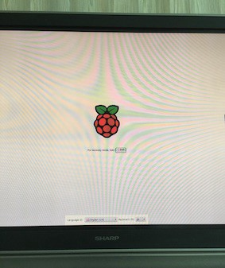

### Installing Raspbian

It asks you which software you want to install. You see only Raspbian by default, which is fine for our purpose.

If you specify your wifi details in the Wifi networks section, you’ll get more choices, as shown below:

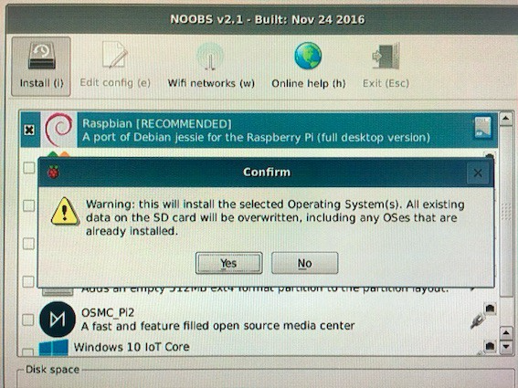

But we only need Raspbian for now. So, we continue with the default choice. The installation process will take a while.

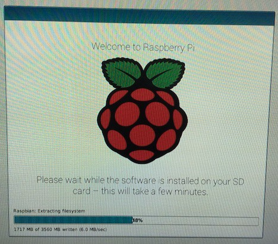

It shows you some of the feature highlights on Raspbian, so you want to watch it at least once. Once it’s complete, you have Raspbian on your Raspberry Pi 3!

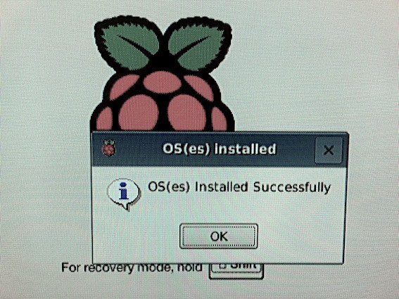

It’s a fully functional Linux with a nice desktop screen.

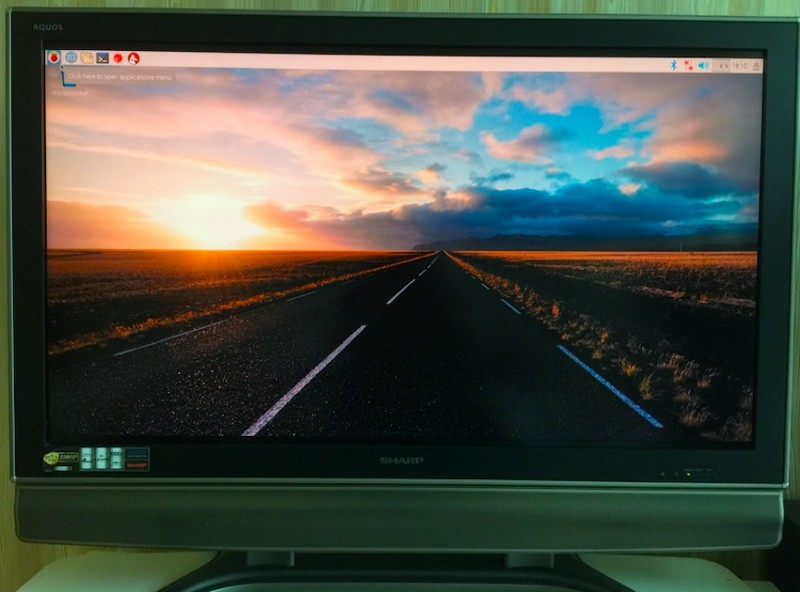

You should enjoy this moment of triumph and explore the menu items and tools. There are default Python packages as well.

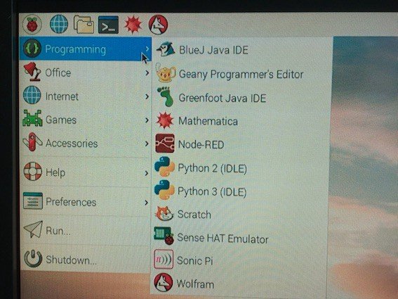

### Wifi

You should set up Wifi connection by clicking the icon on the top right corner with two red `X` on the left side of the speaker volume icon.

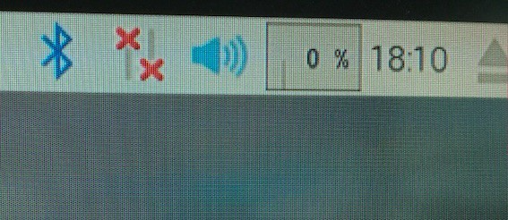

Then, you can use Chromium to browse the internet.

## VNC for accessing Raspbian from your computer

This step is optional. I find it helpful to access Raspberry Pi from my main computer (Mac Book Pro).

To set this up, you run a VNC server on Raspbian and a VNC client on your computer.

### Run a VNC server on Raspbian

First of all, make sure Raspbian connects to the Wifi network that your computer uses. Then, follow the below steps.

Raspbian has a VNC server built-in. All you need to do is:

- Go to Preferences > Raspberry Pi Configuration

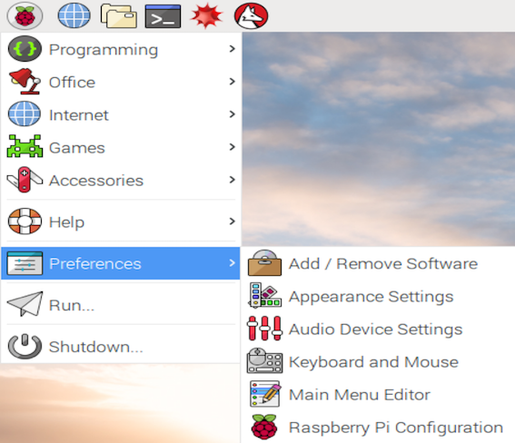

Enable VNC and press OK.

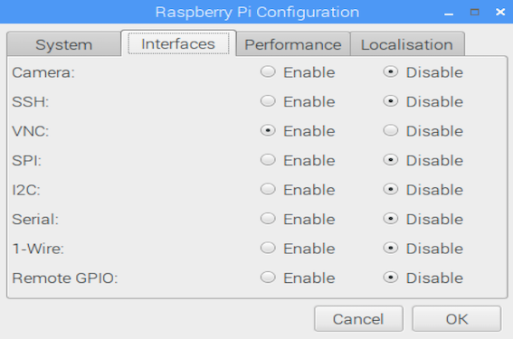

If you prefer using the terminal, you can issue the following command:

```bash
sudo raspi-config
```

Then, choose 7 **Advanced Options**, then enable **P3 VNC**.

Once VNC is enabled, click the VNC icon and find out the address of the VNC server. It’s 10.0.1.7, which I need for my VNC client to connect to the server.

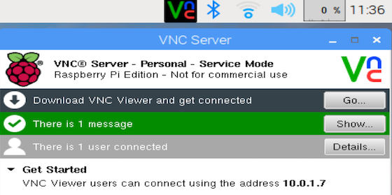

### Run a VNC client on your computer

I’m using the Real VNC client. You can download it from [here](https://www.realvnc.com/download/vnc/). Follow the instruction to install it on your computer (in my case Mac Book Pro).

Start your Real VNC client, enter the server IP address (in my case, it’s 10.0.1.7), and press enter. You must confirm the identity of the VNC server. Once you acknowledge that, your computer should connect to the remote Raspberry Pi.

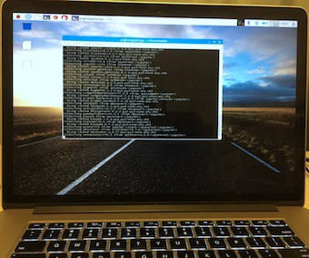

Look carefully. It’s not macOS, but Raspbian is showing on my Mac Book Pro screen in full-screen mode. You may want to change the resolution used by Raspbian (on the server side).

Run the following command to enter the config screen.

```bash
raspi-config
```

Choose **7 Advance Options** > **5 Resolution** to choose the resolution you like. It requires a reboot.

You can also adjust the screen size of the VNC client in the setting panel, which appears when you hover your mouse pointer over the top middle part of the VNC client screen.

On a separate note, I’m taking the power supply from my Mac Book Pro. So, with VNC set up, I need neither a separate monitor, an HDMI cable, a keyboard, nor a mouse to use Raspbian.

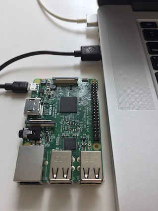

## Conclusion

If you have followed the steps until here, you should have a fully working Linux running on your Raspberry Pi.

Now, you stand in front of infinite possibilities. I’ll leave you here until we come across again.

## References

- [Raspberry Pi 3 for the Second Time](/blog/2019-08-05-raspberry-pi-3-for-the-second-time/)
- [Raspberry Pi 3 B, Raspberry Pi](https://www.raspberrypi.org/products/raspberry-pi-3-model-b/)
- [SD Card Formatter](https://www.sdcard.org/downloads/)
- [Formatting an SDXC card, Raspberry Pi](https://www.raspberrypi.org/documentation/installation/sdxc_formatting.md)
- [Introduction to NOOBS, Raspberry Pi](https://www.raspberrypi.org/blog/introducing-noobs/)
- [Raspbian Quick Start Guide, Raspberry Pi](https://www.raspberrypi.org/learning/software-guide/quickstart/)
- [Real VNC client](https://www.realvnc.com/download/vnc/)
