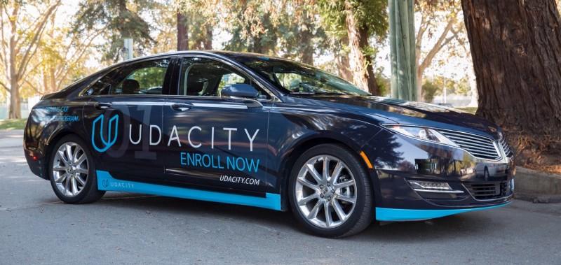

Udacity recently made its self-driving car simulator source code available on [GitHub](https://github.com/udacity/self-driving-car-sim), which they originally built to teach their [Self-Driving Car Engineer Nanodegree](https://www.udacity.com/course/self-driving-car-engineer-nanodegree--nd013) students.

Now, anybody can use the valuable tool to train their machine learning models to clone driving behavior.

In this article, I’ll explain:

- What you can do with it
- How to set up the simulator
- Deep Learning driver example

## What You Can Do with it?

You can manually drive a car to generate training data, or your machine learning model can autonomously drive for testing.

On the main screen of the simulator, you can choose a scene and a mode.

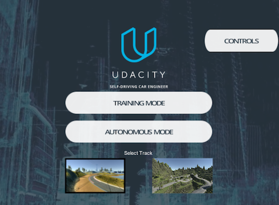

First, you choose a scene by clicking one of the scene pictures. The above is selecting the lakeside scene (the left).

Next, choose the **Training Mode** or **Autonomous Mode**. When you click one of the mode buttons, a car appears at the start position.

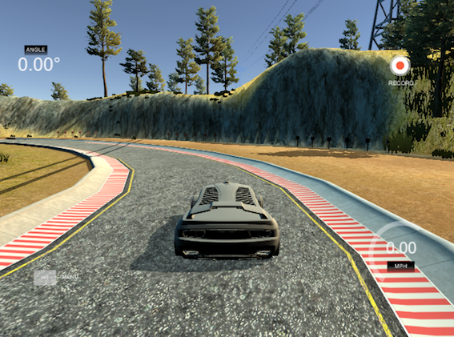

### Training Mode

In the training mode, you drive the car manually to record the driving behavior. You can use the recorded images to train your machine-learning model.

To drive the car, use the following keys:

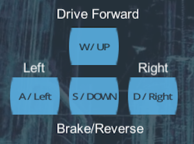

If you like using a mouse to direct the car, you can do so by dragging:

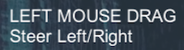

Press `R` on your keyboard to start recording your driving behavior.

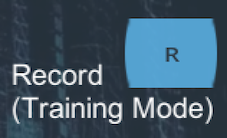

You can press `R` again to stop the recording.

Finally, use `ESC` to exit the training mode.


You can see the driving instructions any time by clicking the **CONTROLS** button in the top right of the main screen.

### Autonomous Mode

In the autonomous mode, you are testing your machine learning model to see how well your model can drive the car without dropping off the road or falling into the lake.

<iframe width="560" height="315" src="https://www.youtube.com/embed/hTPADovdyfA" title="YouTube video player" frameborder="0" allow="accelerometer; autoplay; clipboard-write; encrypted-media; gyroscope; picture-in-picture; web-share" allowfullscreen></iframe>

Although the driving in the above video may not be the best possible, it is pretty rewarding to watch a trained model autonomously driving the car without going off the road.

Technically, the simulator acts as a server from which your program can connect and receive a stream of image frames.

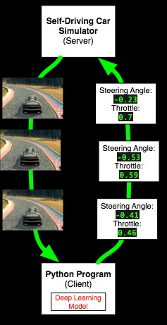

For example, your Python program can use a machine learning model to process the road images, predict the best driving instructions, and send them back to the server.

Each driving instruction contains a steering angle and an acceleration throttle, which changes the car’s direction and speed (via acceleration). As this happens, your program will receive new image frames in real-time.

## How to Set Up the Simulator

You’ll need the following:

- Unity Game Engine
- Git LFS
- Udacity Self-Driving Car Simulator Github

### Unity

They use Unity (a game development environment) to build the Udacity self-driving car simulator.

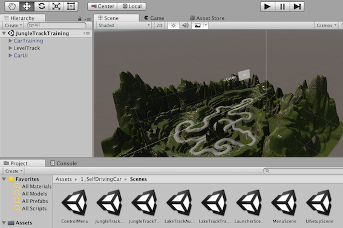

You can install it as follows:

- Go to [https://unity3d.com](https://unity3d.com) and download the Unity installer. Choose the right version for your license requirement. The Personal version works fine with the Udacity simulator.
- Start the installer. It will download the necessary components and begin the installation process.
- Follow the instruction to install Unity on your computer.

### Git LFS

The Udacity self-driving car simulator uses Git LFS to manage large files.

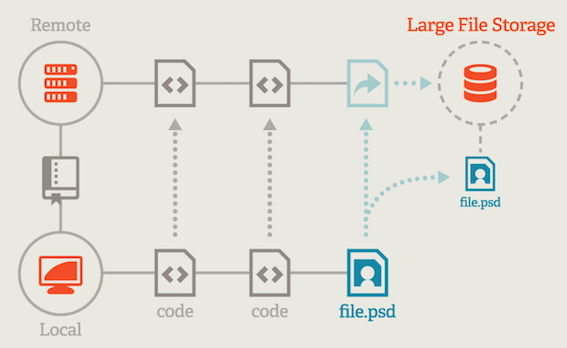

The above image is from [https://git-lfs.github.com](https://git-lfs.github.com). Below is a quote from the site:

<blockquote>
Git Large File Storage (LFS) replaces large files such as audio samples, videos, datasets, and graphics with text pointers inside Git, while storing the file contents on a remote server like GitHub.com or GitHub Enterprise.
</blockquote>

For macOS, you can use `brew` to install it:

```bash
brew install git-lfs
```

Once installed, you need to enable it for Git on your machine.

```bash
git lfs install
```

For Windows and Linux, please see [https://git-lfs.github.com](https://git-lfs.github.com) for details.

Note: I’m assuming you already have the `git` command in your environment. If not, please follow [the instruction](https://help.github.com/articles/set-up-git/) to install `git` before installing `git-lft`.

### Udacity Self-Driving Car Simulator Github

This GitHub project contains a Unity project for building the simulator.

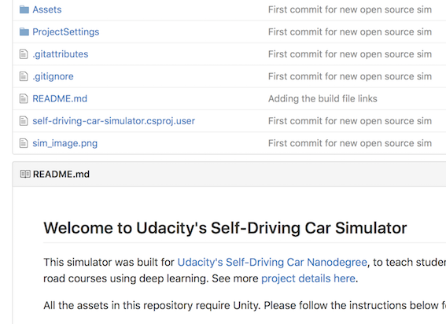

- Open a terminal on your computer and clone the self-driving car GitHub project:

```bash
git clone https://github.com/udacity/self-driving-car-sim.git
```

That’s it for preparation.

## Quick Start

Let’s build the self-driving car simulator.

In Unity,

- Go to **File > Open Project** to open the self-driving-car-sim folder
- Go to **File > Build Settings** to open the build setting window

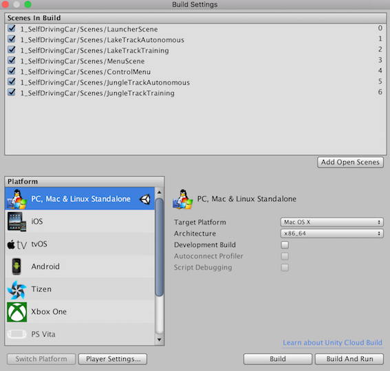

- Choose the right platform for your computer and then press the **Build** button
- Specify the location and name of the generated executable file
- Double-click the executable file to start the simulator.

## Modifying the Scenes in the Simulator

If you want to modify the scenes in the simulator, you’ll need to dive deep into the Unity projects and rebuild the project to generate a new executable file.

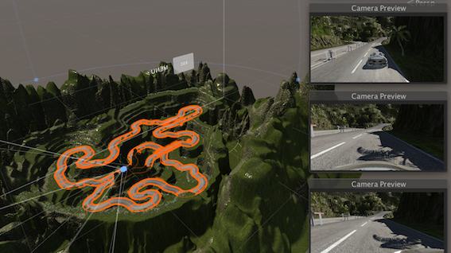

For this, I suggest you first read the README.md in the [Self-Driving Car Simulator GitHub](https://github.com/udacity/self-driving-car-sim) to learn how to navigate the Unity project.

For more details on Unity, please visit [https://unity3d.com](https://unity3d.com).

## Deep Learning Driver Example

You can try a predefined model to see how a deep learning model drives autonomously.

- Open a terminal, then execute the following command to clone the project to your computer.

```bash
git clone https://github.com/naokishibuya/car-behavioral-cloning.git
```

- Create a Python environment used by the model using `conda`:

```bash
cd car-behavioral-cloning
conda env create -f environments.xml
```

- Activate the Python environment used by the model

```bash
source activate car-behavioral-cloning
```

- Double-click your simulator executable to show the start-up screen

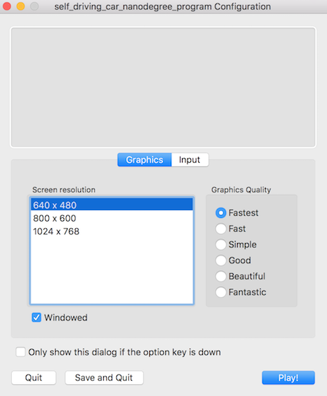

- Choose **640 x 480** screen resolution and the **Fastest** graphics quality (making sure it works with the lowest requirements)
- Press the **Play!** button


- Choose the lakeside track (on the left)
- Click the **Autonomous Mode** button

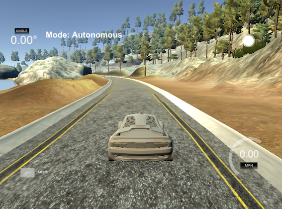

- Go back to the terminal and run the pre-trained model by the following command

```bash
python drive.py model.h5
```

You can choose a different image quality in the simulator startup screen to see how it affects the car’s driving.

The `README.md` has more details about the Deep Learning model. You can modify the model parameters and train them to generate different model files using the saved train data from the Training Mode.

Enjoy!

<iframe width="560" height="315" src="https://www.youtube.com/embed/mZOc-zrbnR8" title="YouTube video player" frameborder="0" allow="accelerometer; autoplay; clipboard-write; encrypted-media; gyroscope; picture-in-picture; web-share" allowfullscreen></iframe>

## References

- [Udacity open sources its self-driving car simulator for anyone to use (Tech Crunch)](https://techcrunch.com/2017/02/08/udacity-open-sources-its-self-driving-car-simulator-for-anyone-to-use/)
- [Udacity Releases Self-Driving Car Simulator Source Code (Campus Technology)](https://campustechnology.com/articles/2017/02/09/udacity-releases-self-driving-car-simulator-source-code.aspx?admgarea=news)
- [Self-Driving Car Engineer Project 3: Use Deep Learning to Clone Driving Behavior (Udacity)](https://github.com/udacity/CarND-Behavioral-Cloning-P3)
- [Deep Learning Example (GitHub)](https://github.com/naokishibuya/car-behavioral-cloning)
