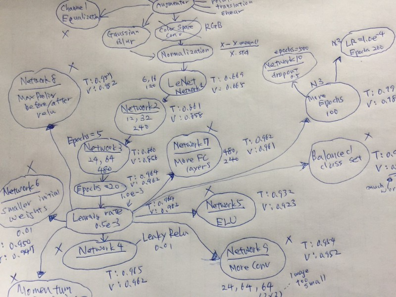

The first time I tried training a convolutional neural network, I lost track of what changes made the network better or worse. I was overwhelmed by the number of decisions I had to make and the infinite possibilities I had to explore.

I now use pipelines to experiment with different scenarios and mind maps to see what I have tried and what else I can try.

In this article, I will talk about how I use pipelines and mind maps for training convolutional neural networks, using [the German Traffic Sign classification](http://benchmark.ini.rub.de/?section=gtsrb&amp;subsection=dataset) project as an example.

The sections are as follows:

- Exploratory data analysis for pipeline
- Choosing a network architecture
- Experimenting with preprocessing
- Experimenting with network design
- Mind map and continuous improvement

## Exploratory Data Analysis for Pipeline

I do the exploratory data analysis solely to develop a pipeline plan. Let’s quickly look at the process in three steps:

- Understand the project objectives
- Perform data analysis for pipeline ideas
- Prepare train and validation set

### The Project Objective

The objective is to classify the traffic sign images from [the German Traffic Sign classification](http://benchmark.ini.rub.de/?section=gtsrb&amp;subsection=dataset) into predefined classes.

Visualization helps me to understand what I’m dealing with intuitively.

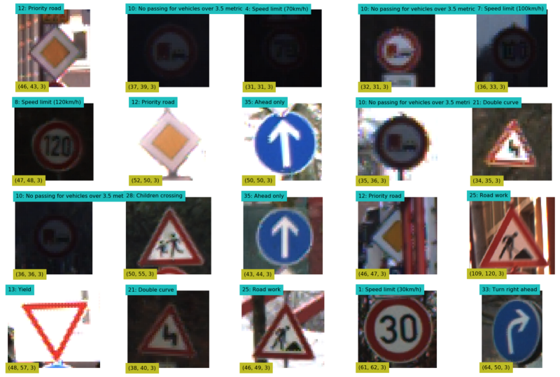

I printed the label and shape for each of the randomly selected images. The images come in different sizes.

### Data Analysis for Pipeline Ideas

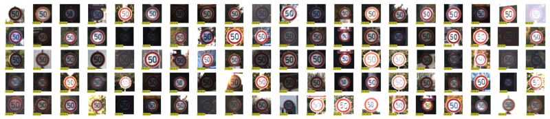

**Analysis**:

- The images are in different sizes
- The image brightness is fairly random
- The images may be slightly rotated
- The images may not be facing straight
- The images may not be exactly centered
- The class distribution is skewed

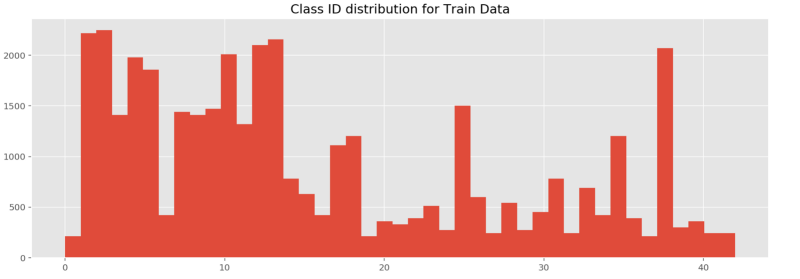

**Ideas for Pipeline**:

- Resize all images into the same shape
- Image augmentation to compensate for minor classes
- Data normalization
- Experiment with different color spaces

The list doesn’t have to be perfect. I can have as many pipeline objects as I want later.

### Pipeline Plan

This image is my pipeline plan. It has two meanings.

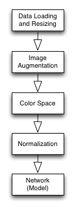

First of all, it tells me what I have done and what I need to do. Next, it’s a blueprint for the actual Pipeline object that I will build.

### Train and Validation Data Split

Out of the 39,209 training images, I reserved 8,000 (20%) for validation. I did this before applying augmentation so the validation set only has original images.

That’s it for the exploratory data analysis.

### Why Not More Exploratory Data Analysis?

Some people may find it odd that I don’t spend more time on exploratory data analysis.

It is because there is no end to it. If I immediately work on ideas as they pop up, I let random thoughts control my progress. I could easily spend days without producing results, which can be very discouraging.

Once I build the first pipeline working, I can experiment more systematically with ideas and quantitatively measure the effectiveness of changes. I want to finish the **initial** exploratory data analysis as quickly as possible.

## Choosing a Network Architecture

I worked on the model first.

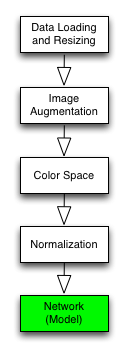

### How to Choose a Network Architecture

**Pre-trained Model**

The first choice should be a pre-trained network that works for the same problem (i.e., traffic sign classification). I could apply [Transfer Learning](https://blog.keras.io/building-powerful-image-classification-models-using-very-little-data.html) to reuse the pre-trained model for my project. It would save a lot of time.

**Well-known Model**

The next choice is to find a well-known model built for a similar purpose and adapt it to my project. Good network architecture is challenging to come up with. So, this can save a lot of time, too.

**Build from Scratch**

The last resort is to build a network from scratch, which can be very time-consuming and risky (i.e., I may not be able to complete the project on time).

### My Choice: LeNet

I chose to use [LeNet](http://yann.lecun.com/exdb/lenet/) by Yann LeCun. It is a convolutional neural network designed to recognize visual patterns directly from pixel images with minimal preprocessing. It can handle hand-written characters very well.

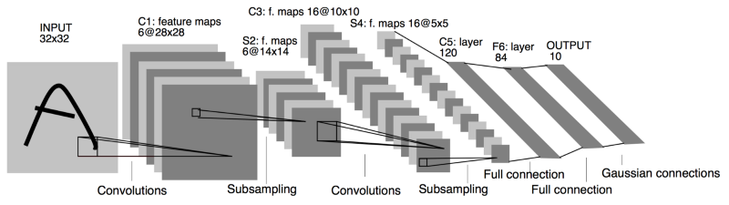

Source: [http://yann.lecun.com/exdb/publis/pdf/lecun-98.pdf](http://yann.lecun.com/exdb/publis/pdf/lecun-98.pdf)

**Network 1**

I adapted LeNet to this project which became the network, the first component in my pipeline.

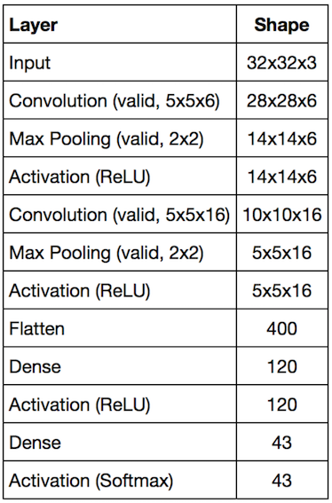

**Implementation**

I built pipelines using Tensorflow and [Scikit-Learn’s Pipeline framework](http://scikit-learn.org/stable/modules/pipeline.html).

First, I wrote a simple class to build a convolutional neural network like the below easily:

```python
network1 = (NeuralNetwork()
           .input([32, 32, 3])
           .conv([5, 5, 6])
           .max_pool()
           .relu()
           .conv([5, 5, 16])
           .max_pool()
           .relu()
           .flatten()
           .dense(120)
           .relu()
           .dense(43))
```

Such a class was critical for me as I planned to make many network objects with various configurations.

Once I create a network object, I use Scikit-Learn’s Pipeline framework to make my network object an estimator (more on this later).

## Experimenting with Preprocessing

### Loading and Resizing Data

I defined a transformer object to handle the image loading and resizing.

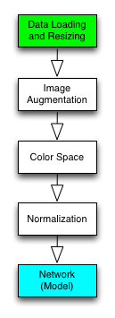

Then, I created a new Pipeline object that combined the transformer (loader) and the estimator (network1).

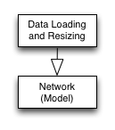

```python
pipeline = make_pipeline(transformer, estimator)
```

I can put as many transformer objects as possible into a Pipeline object.

```python
pipeline = make_pipeline(trans1, trans2, trans3, estimator)
```

I can train and evaluate the Pipeline object.

```python
# training with train set
pipeline.fit(X_train, y_train)

# accuracy with validation set
score = pipeline.score(X_eval, y_eval)
```

For the first pipeline, I used five epochs (50,000 randomly selected samples per epoch) for training.

The network will likely see the same images more than once, which can cause overfitting. I will address that with augmentation later on.

I calculate the evaluation score on the 8,000 validation set.

```
# Accuracy 
0 Train: 0.841 Evaluation: 0.822
1 Train: 0.939 Evaluation: 0.916
2 Train: 0.955 Evaluation: 0.932
3 Train: 0.891 Evaluation: 0.866
4 Train: 0.948 Evaluation: 0.925
```

This bare-bone pipeline is already performing well, which is encouraging.

It seems overfitting, but I could improve it by adding regularization. Should I do that now?

<blockquote>
No, I should not. Not now.
</blockquote>

If I change the network while building the preprocessing, it will be harder to see what affects which. It is where I used to lose track of changes and improvements.

I should note down my observations for later review and move on.

### Image Augmentation

Generating more image variation is essential, especially for the minor classes.

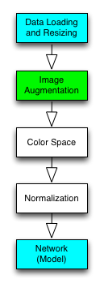

I wrote the following functions:

- random brightness adjustment
- random small rotation
- random small translation
- random small shear

I tested with the training images:

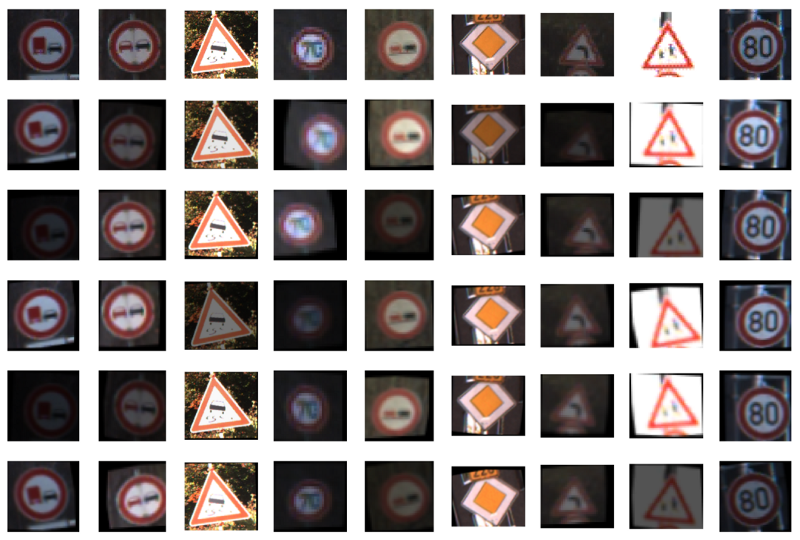

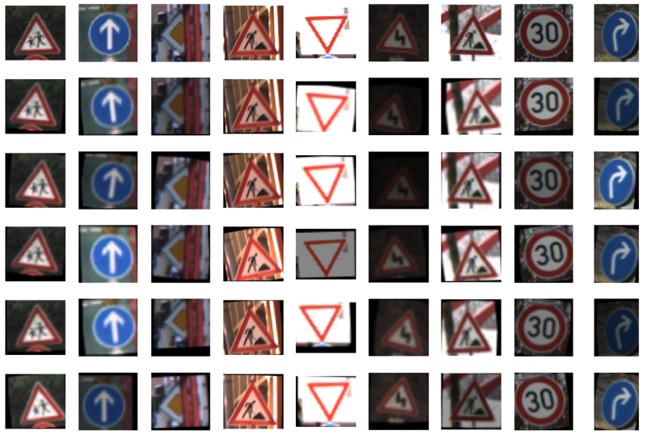

Then, I made a new Pipeline object for training and validation.

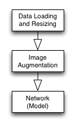

```
0 Train: 0.199 Evaluation: 0.204
1 Train: 0.464 Evaluation: 0.460
2 Train: 0.574 Evaluation: 0.572
3 Train: 0.633 Evaluation: 0.628
4 Train: 0.674 Evaluation: 0.675
```

There is no overfitting, but the performance is much worse. I might have done the augmentation incorrectly.

That pushed me to think: “How much rotation should I have applied? 10 or 15? How much has brightness changed? etc., etc.”

Can I experiment with different values?

<blockquote>
Yes, I can.
</blockquote>

It is ok for me to play with the parameters as long as I’m not changing anything in the other boxes of the pipeline plan.

I should examine the result more closely. The training accuracy was similar to the validation accuracy. It indicates these two sets are not entirely different.

Moreover, the worse performance shouldn’t be surprising since the model must learn from more training images. The augmentation exposed the weakness of the pipeline, the model, or both.

The reason for the bad performance is somewhere else.

### Data Normalization

The pipeline objects tested so far did not have any data normalization.

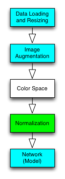

Any machine learning lecturer will tell you: you need to do data normalization before feeding data into your model. But how so?

I wanted to measure how much improvement those normalizations can bring.

- x — 127.5
- x/127.5–1.0
- x/255.0–0.5
- x — x.mean()
- (x — x.mean())/x.std()

I created a new Pipeline object for each case.

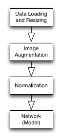

Below is 5th epoch result for each case:

```
                        Train, Eval
x - 127.5             : 0.790, 0.782
x/127.5 - 1.0         : 0.849, 0.844
x/255.0 - 0.5         : 0.813, 0.812
x - x.mean()          : 0.820, 0.820
(x - x.mean())/x.std(): 0.909, 0.900
```

`(x - x.mean())/x.std()` is the winner. It’s nice to see normalization made such a huge difference.

### Color Space Conversion

The images are loaded in RGB format, but many color spaces exist.

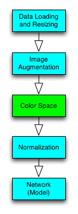

I created one Pipeline object for each color space. I used OpenCV function (`cvtColor`) to convert RGB images into other color spaces.

Note: Grayscale images have only one channel, which requires the input shape of the input layer to be changed as follows:

```python
gray_net = (NeuralNetwork()
           .input([32, 32, 1]) # 1 ch
           .conv([5, 5, 6])
           .max_pool()
           .relu()
           .conv([5, 5, 16])
           .max_pool()
           .relu()
           .flatten()
           .dense(120)
           .relu()
           .dense(43))
```

The following are the 5-th epoch results:

```
Gray: Train: 0.903, Validation: 0.901
HSV : Train: 0.785, Validation: 0.777
HLS : Train: 0.770, Validation: 0.768
Lab : Train: 0.848, Validation: 0.844
Luv : Train: 0.844, Validation: 0.838
XYZ : Train: 0.909, Validation: 0.899
Yrb : Train: 0.839, Validation: 0.838
YUV : Train: 0.841, Validation: 0.834
```

The Grayscale and XYZ performed about the same as RGB (no conversion). The rest was worse. So, I decided to continue with RGB.

### Ready to Move On

I completed all the boxes in the pipeline plan.

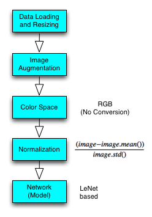

In doing so, I made four different Pipeline objects:

```
load,estimate
load,augment,estimate
load,augment,normalize,estimate
load,augment,color,normalize,estimate
```

I’ll use the third pipeline to experiment more with the network design.

## Experimenting with Network Design

### Network 2

My second network has more filters and neurons.

```python
network2 = NeuralNetwork()
            .input([32, 32, 3])
            .conv([5, 5, 12]) # doubled
            .max_pool()
            .relu()
            .conv([5, 5, 32]) # doubled
            .max_pool()
            .relu()
            .flatten()
            .dense(240) # doubled
            .relu()
            .dense(43)
```

The performance is much better than the first network.

```
0 Train: 0.853 Evaluation: 0.844
1 Train: 0.908 Evaluation: 0.908
2 Train: 0.937 Evaluation: 0.937
3 Train: 0.957 Evaluation: 0.954
4 Train: 0.951 Evaluation: 0.949
```

I plotted the learning curve.

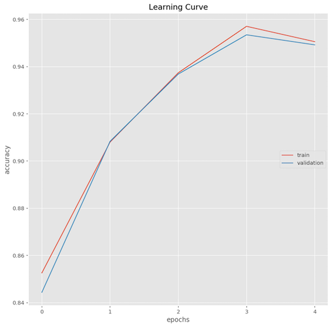

I do this for almost all networks I tried. It’s insightful to see how the learning curve differs for various network configurations.

As this is a classification problem, checking the confusion matrix could also be helpful.

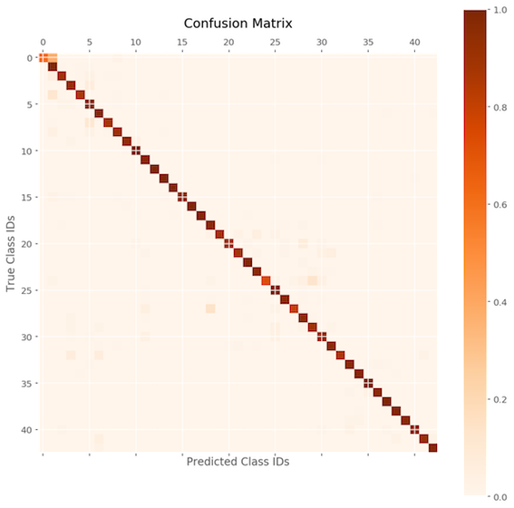

The performance is good across the board, but some are less so. The details for each class are as follows:

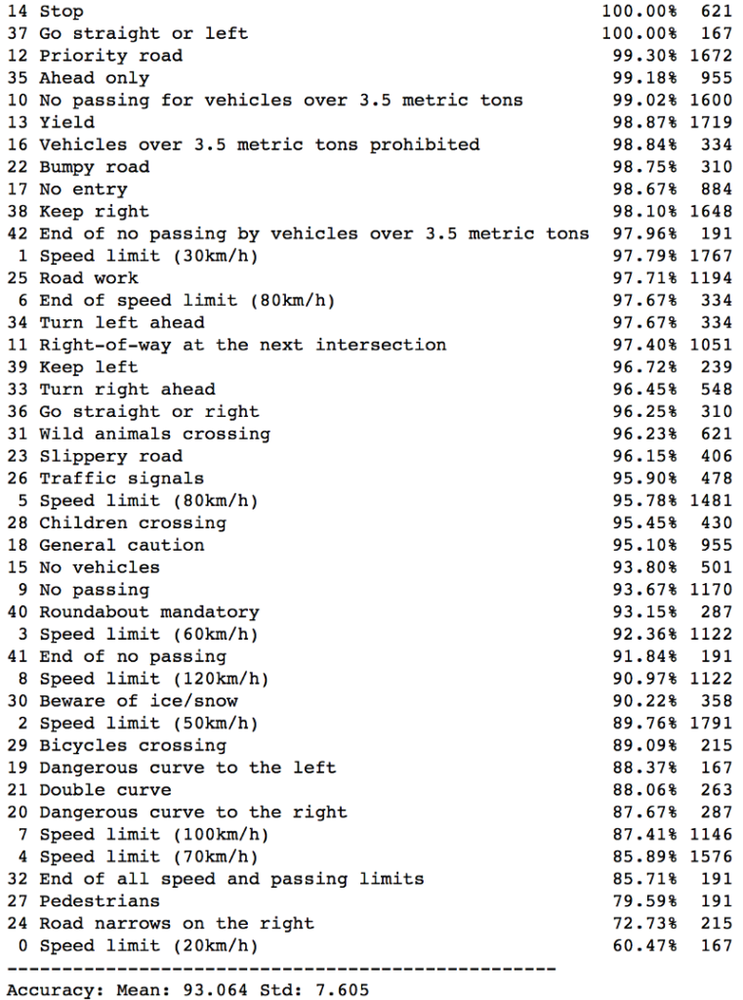

I asked questions like:

- Is it overfitting? (Train vs. validation accuracy)
- Should I increase the number of epochs? (learning curve still increasing?)
- Should I change the learning rate? (Learning curve stop increasing?)
- What else can I do?

### Network 3, 4, 5, 6, 7, 8, 9, 10 and More

I kept creating new network objects to try out different network configurations.

- More convolutional layers and filters
- More fully connected (dense) layers and neurons
- More epochs (up to 500)
- Smaller learning rate (down to 1.0e-4)
- Smaller weight initialization
- Leaky ReLU activation
- ELU (Exponential Linear Unit) activation
- Switch from AdamOptimizer to MomentumOptimizer
- Use the max pooling before and after the activation
- Balanced class distribution in training images
- And more

Each network object is trained and evaluated using a pipeline object. I also check the learning curve and confusion matrix for each pipeline. I noted down my observations for each case.

For more details, please see the Jupyter Notebook on [my Github](https://github.com/naokishibuya/car-traffic-sign-classification).

## Mind Map and Continuous Improvement

As I experimented with more and more ideas, it became harder and harder for me to remember what I had tried.

<blockquote>
What changes made the network better or worse?
</blockquote>

After working on the project for over a few days, I asked this question too often as I had to scroll up and down in my Jupyter Notebook to find answers.

### Mind Map for the Rescue

I decided to draw a graph of the critical things I tried.


I could quickly look up what I had tried and brainstorm what else I may try.

As of this writing, I re-looked at the map and found it funny that my brain started telling me that I should’ve also tried this and that. It’s a powerful tool.

### Mind Map for Exploration

If an idea is working, I keep expanding on it. It’s like a greedy search algorithm or DFS ([depth-first search](https://en.wikipedia.org/wiki/Depth-first_search)), but it’s more freestyle than that.

When I scrapped an idea, I marked them with “X”. It’s usually because of a lousy performance result.

I find it helpful to keep track of “T” (training accuracy) and “V” (validation accuracy) next to the network name. I can see how each network is doing and check where overfitting happens.

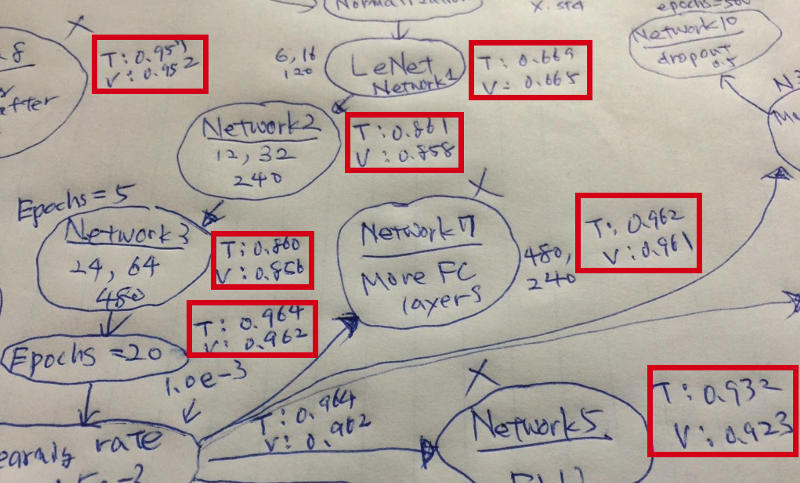

### Mind Map is just a Tool

I don’t need to keep updating the mind map. When I feel lost or need some direction, I update it, look at it and let my mind speak.

I don’t need to make it look beautiful. It’s just a map showing where I am.

I don’t need to put all the experiments on a map. I just put the ones around the most successful path. Sometimes, I shortened it by combining multiple changes. It gives me more space to grow ideas. It’s better to keep the map on one sheet of paper for a glance.

It’s a tool, not the purpose.

I use it to find information quickly and get some inspiration.

## Conclusion

I’ve finished the project, but it’s far from the end.

I still find many scenarios I haven’t tried in the mind map. I could go back and do more experiments thanks to the pipeline mechanism.

If I want to replace the network with a completely new architecture like [GoogLeNet](https://research.google.com/pubs/pub43022.html), I can do so by using a new Pipeline object and drawing a new mind map around that network. I’m not stuck with one particular network architecture.

I’m in control of pipelines and mind maps.

That’s it for now. I hope you find it useful.

## References

- [German Traffic Sign Benchmarks](http://benchmark.ini.rub.de/?section=gtsrb&subsection=dataset)
- [The PPM format (Portable Pixmap, P6)](http://en.wikipedia.org/wiki/Netpbm_format)
- [LeNet Demo (Yann LeCun)](http://yann.lecun.com/exdb/lenet/)
- [Gradient-Based Learning Applied to Document Recognition (Yann LeCun)](http://yann.lecun.com/exdb/publis/pdf/lecun-98.pdf)
- [My GitHub for German Traffic Sign Classifier](https://github.com/naokishibuya/car-traffic-sign-classification)
- [Udacity: Self-Driving Car Engineer: Traffic Sign Classifier Project](https://github.com/udacity/CarND-Traffic-Sign-Classifier-Project)
