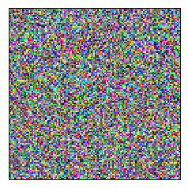
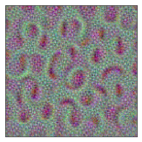
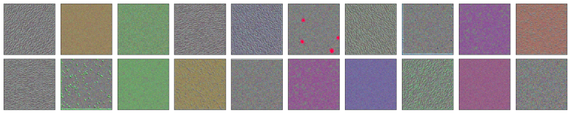
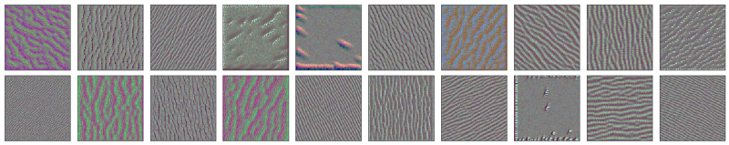
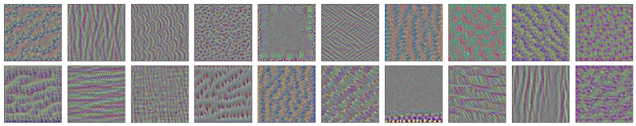
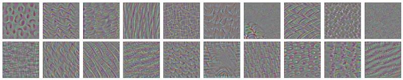
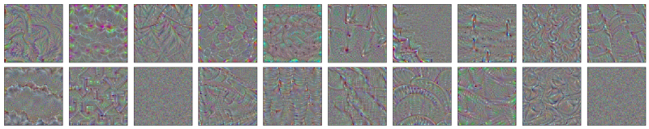
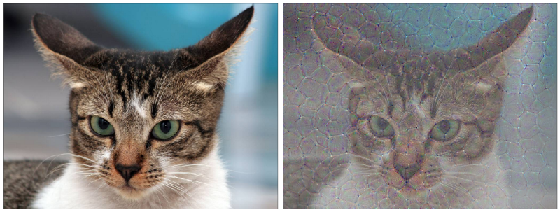

A convolutional neural network typically has multiple convolutional layers (hence, the name). Conceptually, we understand each convolutional layer extracts spatial features from its inputs. The earlier layer detects low-level features like color, texture, lines, curves, etc. Later layers detect higher abstraction like eyes, tail, etc.

But we can’t see them visually. Or can we?

In this article, I demonstrate using a pre-trained convolutional neural network to see what input images strongly activate filters in convolutional layers.

[This notebook code](https://github.com/naokishibuya/deep-learning/blob/master/python/visualizing_convolutional_layers.ipynb) is based mainly on the blog article [How convolutional neural networks see the world](https://blog.keras.io/how-convolutional-neural-networks-see-the-world.html) by Francois Chollet.

## VGG 16

I use the pre-trained VGG16 available in Keras. The details of VGG 16 are in Very Deep Convolutional Networks for Large-Scale Image Recognition by Karen Simonyan and Andrew Zisserman.

Let’s examine the available convolutional layers.

```python
import numpy as np
import keras.backend as K
from keras.applications.vgg16 import VGG16

# include_top=False means we do not include the last dense layers
# and uses only convolutional layers
model = VGG16(include_top=False) 
model.summary()
```

This gives the following output:

```
_________________________________________________________________
Layer (type)                 Output Shape              Param #   
=================================================================
input_1 (InputLayer)         (None, None, None, 3)     0         
_________________________________________________________________
block1_conv1 (Conv2D)        (None, None, None, 64)    1792      
_________________________________________________________________
block1_conv2 (Conv2D)        (None, None, None, 64)    36928     
_________________________________________________________________
block1_pool (MaxPooling2D)   (None, None, None, 64)    0         
_________________________________________________________________
block2_conv1 (Conv2D)        (None, None, None, 128)   73856     
_________________________________________________________________
block2_conv2 (Conv2D)        (None, None, None, 128)   147584    
_________________________________________________________________
block2_pool (MaxPooling2D)   (None, None, None, 128)   0         
_________________________________________________________________
block3_conv1 (Conv2D)        (None, None, None, 256)   295168    
_________________________________________________________________
block3_conv2 (Conv2D)        (None, None, None, 256)   590080    
_________________________________________________________________
block3_conv3 (Conv2D)        (None, None, None, 256)   590080    
_________________________________________________________________
block3_pool (MaxPooling2D)   (None, None, None, 256)   0         
_________________________________________________________________
block4_conv1 (Conv2D)        (None, None, None, 512)   1180160   
_________________________________________________________________
block4_conv2 (Conv2D)        (None, None, None, 512)   2359808   
_________________________________________________________________
block4_conv3 (Conv2D)        (None, None, None, 512)   2359808   
_________________________________________________________________
block4_pool (MaxPooling2D)   (None, None, None, 512)   0         
_________________________________________________________________
block5_conv1 (Conv2D)        (None, None, None, 512)   2359808   
_________________________________________________________________
block5_conv2 (Conv2D)        (None, None, None, 512)   2359808   
_________________________________________________________________
block5_conv3 (Conv2D)        (None, None, None, 512)   2359808   
_________________________________________________________________
block5_pool (MaxPooling2D)   (None, None, None, 512)   0         
=================================================================
Total params: 14,714,688
Trainable params: 14,714,688
Non-trainable params: 0
```

The output shapes all begin with (None, None, None). It is because we didn’t specify the input shape. In other words, the model can handle any image shape.

The last dimension of each output shape is the number of filters (channels). For example, the layer **block5_conv1** has 512 filters (indexed from 0 to 511).

## A Random Image as Input

Typically, the input to the VGG16 model is an image to classify, such as cats and dogs. However, we use a randomly generated noise image and feed it to the VGG16 model to calculate filter activations and their gradients.

```python
def make_random_image(height=128, width=128, mean=127, std=10):
    return np.random.normal(loc=mean, scale=std, size=(height, width, 3))
```

Let’s generate a random image:

```python
random_img = make_random_image()

plt.imshow(random_img)
plt.xticks([])
plt.yticks([])
plt.show()
```



## Nudge the Image to Strongly Activate the Filter

We can calculate the activations of a filter with a random image. Most likely, the activations are not very strong.

However, we adjust the image data using the gradients to strengthen the activations. In other words, we nudge the input image pixel values to increase the activation using the gradients as our guide. A gradient ascent process maximizes activation by adjusting the input image.

After some repetition of this process, the output tells us what kind of image triggers the filter to activate strongly, through which we can have some insight into what kind of things the filter detects.

```python
def layer_image(model, layer_name, filter_index, input_img,  
                steps=20, step_size=1.0):
    layer = find_layer(model, layer_name)

    # we want to maximize the mean activation of the filter 
    activation = K.mean(layer.output[:, :, :, filter_index])

    # the gradients of the activations of the filter of the layer
    grads = K.gradients(activation, model.input)[0]

    # normalize the gradients to avoid very small/large gradients
    grads /= K.sqrt(K.mean(K.square(grads))) + 1e-5

    # calculate the mean activation and the gradients 
    calculate = K.function([model.input], [activation, grads])

    # adjust input image suitable for the calculate function
    input_img = np.copy(input_img)    # make a copy 
    input_img = np.float64(input_img) # float type
    input_data = input_img.reshape((1, *input_img.shape)) 

    # nudge the image data with the gradients
    for i in range(steps):
        _, grads_value = calculate([input_data])
        input_data += grads_value * step_size
    result = input_data[0]

    return as_image(result)
```

Please see the [notebook](https://github.com/naokishibuya/deep-learning/blob/master/python/visualizing_convolutional_layers.ipynb) available on my GitHub.

For example, the first filter of the **block4_conv1** layer generated the following image:

```python
result = layer_image(model, 
                     layer_name='block4_conv1', 
                     filter_index=0, 
                     input_img=random_img)

plt.figure(figsize=(15,5))
plt.imshow(result)
plt.xticks([])
plt.yticks([])
plt.show()
```



Does it seem the filter likes an arc shape?

Let’s pick some layers to examine generated images. I will use the first 20 filters of each convolutional layer as examples:

**block1_conv1**

It is the first layer in VGG16. It seems to detect colors and textures. I do not see many shapes here.



**block2_conv2**

These filters show directional things.



**block3_conv3**

I see more shapes and patterns here. They are a higher level of abstraction than the previous two examples.



**block4_conv1**

We can observe more complex shapes here.



**block5_conv1**

Even more complex shapes are here.



## How about a cat?

What do we get if we throw a cat into this experiment and let a filter nudge the image?

It is a similar idea from [Inceptionism: Going Deeper into Neural Networks](https://research.googleblog.com/2015/06/inceptionism-going-deeper-into-neural.html).

I used the first filter in the **block5_conv3** layer on a cat image from [Dogs vs. Cats Redux: Kernels Edition](https://www.kaggle.com/c/dogs-vs-cats-redux-kernels-edition).



Did the filter detect the cat was angry? Probably not.

## References

- [Very Deep Convolutional Networks for Large-Scale Image Recognition](https://arxiv.org/abs/1409.1556) \
  Karen Simonyan, Andrew Zisserman
- [How convolutional neural networks see the world](https://blog.keras.io/how-convolutional-neural-networks-see-the-world.html) \
  Francois Chollet
- [Inceptionism: Going Deeper into Neural Networks](https://research.googleblog.com/2015/06/inceptionism-going-deeper-into-neural.html) \
  Alexander Mordvintsev, Christopher Olah and Mike Tyka
- [Dogs vs. Cats Redux: Kernels Edition](https://www.kaggle.com/c/dogs-vs-cats-redux-kernels-edition)
