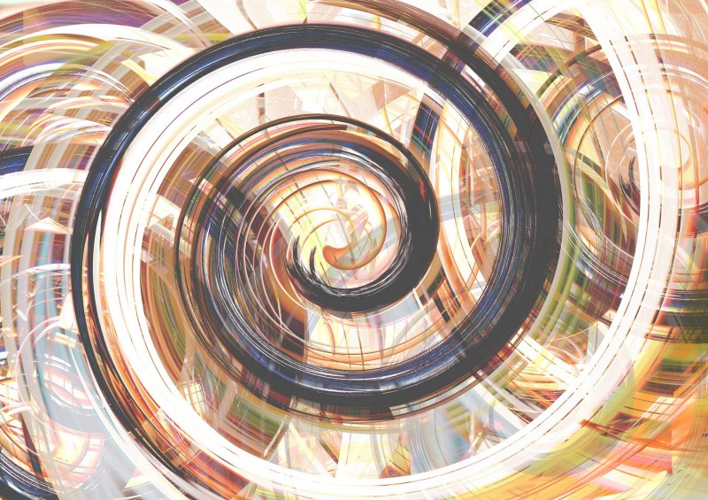
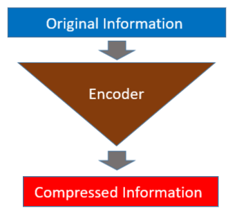
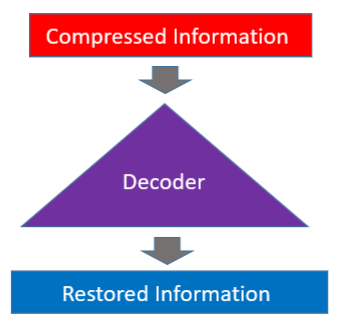
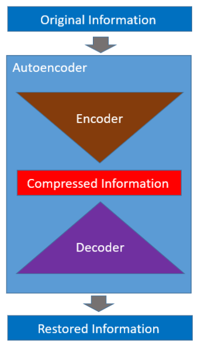
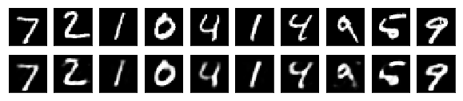
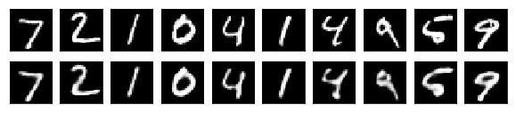
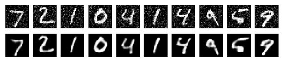

## A Quick Introduction to Autoencoder

An autoencoder has two parts: an encoder and a decoder. The encoder reduces the dimensions of input data so that the original information is in a compressed form.



The decoder restores the original information from the compressed data.



The autoencoder is a neural network that learns to encode and decode automatically (hence, the name).



Once learning is complete, we can use the encoder and decoder independently. So, an autoencoder can compress and decompress information. Then, can we replace the zip and unzip command with it?

Not quite.

Autoencoders are data-specific and won't work well on completely unseen data structures. For example, an autoencoder trained with numbers does not work on alphabets.

Another limitation is that the compression by an autoencoder is lossy. As such, it does not perfectly restore the original information.

Then, what can we do with it?

Autoencoders can be helpful for different things. In this article, I show you how to use an autoencoder for image noise reduction.

NB: The code in this article is based on Building Autoencoders in Keras by Francois Chollet and Autoencoder Examples by Udacity. The notebook code is available on [my Github](https://github.com/naokishibuya/deep-learning/blob/master/python/autoencoder_noise_reduction.ipynb).

## MNIST

We use [MNIST](http://yann.lecun.com/exdb/mnist/), which is a well-known database of handwritten digits. Keras has MNIST dataset utility. We can download the data as follows:

```python
(X_train, _), (X_test, _) = keras.datasets.mnist.load_data()
```

The shape of each image is 28x28, and there is no color information.

```python
X_train[0].shape
```

```
(28, 28)
```

The below shows the first ten images from the MNIST database.


## Simple Autoencoder

We start with a simple autoencoder based on a fully connected layer. One hidden layer handles the encoding, and the output layer handles the decoding.

We flatten each input image to an array of 784 (=28×28) data points, which is then compressed into 32 data points by the fully connected layer.

```python
inputs  = Input(shape=(784,))           # 28*28 flatten
enc_fc  = Dense( 32, activation='relu') # to 32 data points
encoded = enc_fc(inputs)
```

Then, we decode the encoded data to the original 784 data points. The sigmoid will return values between 0 and 1 for each pixel (intensity).

```python
dec_fc  = Dense(784, activation='sigmoid') # to 784 data points
decoded = dec_fc(encoded)
```

This whole processing becomes the trainable autoencoder model.

```python
autoencoder = Model(inputs, decoded)
autoencoder.compile(optimizer='adam', loss='binary_crossentropy')
```

The autoencoder network compresses and decompresses. So, what’s the point? We talk about that later on.

We preprocess the MNIST image data to normalize pixel values between 0 and 1.

```python
def preprocess(x):
    x = x.astype('float32') / 255.
    return x.reshape(-1, np.prod(x.shape[1:])) # flatten

X_train = preprocess(X_train)
X_test  = preprocess(X_test)
```

We also split the train data into train and validation sets.

```python
# also create a validation set for training
X_train, X_valid = train_test_split(X_train, test_size=500)
```

We train the autoencoder, which compresses the input image and then restores it to the original size. As such, our training and label data are the same image data.

```python
autoencoder.fit(X_train, X_train, # data and label are the same
                epochs=50, 
                batch_size=128, 
                validation_data=(X_valid, X_valid))
```

By training an autoencoder, we are training both the encoder and the decoder at the same time.

We can build an encoder and use it to compress MNIST digit images.

```python
encoder = Model(inputs, encoded)
X_test_encoded = encoder.predict(X_test)
```

We can confirm that the 784-pixel data points are now compressed into 32.

```python
X_test_encoded[0].shape
```

```
(32,)
```

Let’s also build a decoder to decompress the compressed image to the original image size. The decoder takes 32 data points as its input (encoded data size).

```python
decoder_inputs = Input(shape=(32,))
decoder = Model(decoder_inputs, dec_fc(decoder_inputs))

# decode the encoded test data
X_test_decoded = decoder.predict(X_test_encoded)
```

The result is as follows. The first row has the original images. The second row has the restored images.



As can be seen, the decoded images do not completely restore the original image.

## Convolutional Autoencoder

We could add more layers to make the network deeper to improve performance. But since we are working on images, we could use a convolutional neural network to improve the quality of compression and decompression.

```python
def make_convolutional_autoencoder():
    # encoding
    inputs = Input(shape=(28, 28, 1))
    x = Conv2D(16, 3, activation='relu', padding='same')(inputs)
    x = MaxPooling2D(padding='same')(x)
    x = Conv2D( 8, 3, activation='relu', padding='same')(x)
    x = MaxPooling2D(padding='same')(x)
    x = Conv2D( 8, 3, activation='relu', padding='same')(x)
    encoded = MaxPooling2D(padding='same')(x)    

    # decoding
    x = Conv2D( 8, 3, activation='relu', padding='same')(encoded)
    x = UpSampling2D()(x)
    x = Conv2D( 8, 3, activation='relu', padding='same')(x)
    x = UpSampling2D()(x)
    x = Conv2D(16, 3, activation='relu')(x) # <= padding='valid'!
    x = UpSampling2D()(x)
    decoded = Conv2D(1, 3, activation='sigmoid', padding='same')(x)

    # autoencoder
    autoencoder = Model(inputs, decoded)
    autoencoder.compile(optimizer='adam', 
                        loss='binary_crossentropy')
    return autoencoder

# create a convolutional autoencoder
autoencoder = make_convolutional_autoencoder()
```

Let’s examine the layers of the convolutional autoencoder.

```
Layer (type)                 Output Shape              Param #   
=================================================================
input_3 (InputLayer)         (None, 28, 28, 1)         0         
_________________________________________________________________
conv2d_1 (Conv2D)            (None, 28, 28, 16)        160       
_________________________________________________________________
max_pooling2d_1 (MaxPooling2 (None, 14, 14, 16)        0         
_________________________________________________________________
conv2d_2 (Conv2D)            (None, 14, 14, 8)         1160      
_________________________________________________________________
max_pooling2d_2 (MaxPooling2 (None, 7, 7, 8)           0         
_________________________________________________________________
conv2d_3 (Conv2D)            (None, 7, 7, 8)           584       
_________________________________________________________________
max_pooling2d_3 (MaxPooling2 (None, 4, 4, 8)           0         
_________________________________________________________________
conv2d_4 (Conv2D)            (None, 4, 4, 8)           584       
_________________________________________________________________
up_sampling2d_1 (UpSampling2 (None, 8, 8, 8)           0         
_________________________________________________________________
conv2d_5 (Conv2D)            (None, 8, 8, 8)           584       
_________________________________________________________________
up_sampling2d_2 (UpSampling2 (None, 16, 16, 8)         0         
_________________________________________________________________
conv2d_6 (Conv2D)            (None, 14, 14, 16)        1168      
_________________________________________________________________
up_sampling2d_3 (UpSampling2 (None, 28, 28, 16)        0         
_________________________________________________________________
conv2d_7 (Conv2D)            (None, 28, 28, 1)         145       
=================================================================
Total params: 4,385
Trainable params: 4,385
Non-trainable params: 0
_________________________________________________________________
```

The `UpSampling2D` will repeat the rows and columns twice. It is effectively reversing the effect of the `MaxPooling2D`.

In short, the `UpSampling2D` is doubling the height and width.

```
(4,4) => (8,8) => (16,16)
```

If you look closely, you may have noticed that the `conv2d_13` (Conv2D) uses the `padding='valid'` that reduces the height and width to (14,14) so that we can up-sample again to (28,28), which is the original size of MNIST images.

Now, we reshape the image data to the format the convolutional autoencoder expects for training.

```python
# reshape the flattened images to 28x28 with 1 channel
X_train = X_train.reshape(-1, 28, 28, 1)
X_valid = X_valid.reshape(-1, 28, 28, 1)
X_test  = X_test.reshape(-1, 28, 28, 1)

autoencoder.fit(X_train, X_train, 
                epochs=50, 
                batch_size=128, 
                validation_data=(X_valid, X_valid))
```

We want to see the quality of compression/decompression, for which we do not need to build separate encoder and decoder models. So, we simply feed-forward test images to see what the restored digits look like.

```python
X_test_decoded = autoencoder.predict(X_test)
```



Although imperfect, the restored digits look better than the ones restored by the simple autoencoder.

## What about the Noise Reduction?

Let’s try the noise reduction effect using the convolutional autoencoder. We add random noises to the MINST image data and use them as input for training.

```python
def add_noise(x, noise_factor=0.2):
    x = x + np.random.randn(*x.shape) * noise_factor
    x = x.clip(0., 1.)
    return x

X_train_noisy = add_noise(X_train)
X_valid_noisy = add_noise(X_valid)
X_test_noisy  = add_noise(X_test)
```

We train a new autoencoder with the noisy data as input and the original data as expected output.

```python
autoencoder = make_convolutional_autoencoder()
autoencoder.fit(X_train_noisy, X_train, 
                epochs=50, 
                batch_size=128, 
                validation_data=(X_valid_noisy, X_valid))
```

During the training, the autoencoder learns to extract essential features from input images and ignores the image noises because the labels have no noise.

Let’s pass the noisy test images to the autoencoder to see the restored images.

```python
X_test_decoded = autoencoder.predict(X_test_noisy)
```



Not bad, right?

## References

- [Building Autoencoders in Keras](https://blog.keras.io/building-autoencoders-in-keras.html) \
  Francois Chollet
- [Autoencoder Example in Tensorflow, Udacity](https://github.com/udacity/deep-learning/tree/master/autoencoder)
- [MNIST dataset](http://yann.lecun.com/exdb/mnist/) \
  Yann LeCun
- [GAN (Generative Adversarial Network): Simple Implementation with PyTorch](/blog/2022-04-21-gangenerative-adversarial-network-simple-implementation-with-pytorch/)
