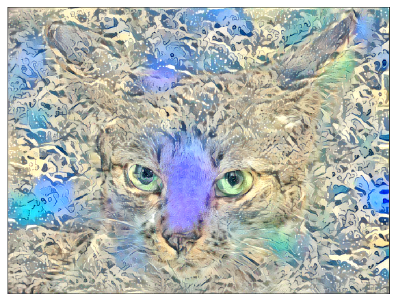

## Artistic Style Transfer

The idea of artistic style transfer is to apply one image's style to another while keeping the original image content recognizable, using convolutional layers to extract critical features. This article explains how to do the artistic style transfer step by step. The code is based on [Francois Chollet’s Neural Style Transfer notebook code](https://keras.io/examples/generative/neural_style_transfer/).

We use the following libraries:

```python
import numpy as np
import scipy as sp
import keras
import keras.backend as K
import matplotlib.pyplot as plt
from tqdm import tqdm
%matplotlib inline
```

## Content (Original) Image

We load the original image (which I obtained from [Kaggle](https://www.kaggle.com/c/dogs-vs-cats-redux-kernels-edition)).

```python
cat_img = plt.imread('../images/cat.835.jpg') 
```

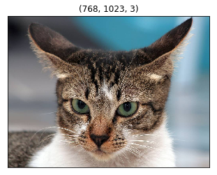

## Style Image

We load the style image: [The Great Wave Off Kanagawa by Hokusai Katsushika](https://en.wikipedia.org/wiki/The_Great_Wave_off_Kanagawa).

```python
hokusai_img = plt.imread(
    '../images/Tsunami_by_hokusai_19th_century.jpg')
```

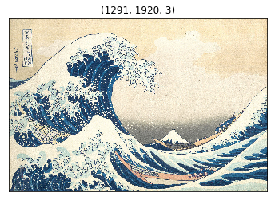

The image size of the style image is different from the content image. As we perform a feature-by-feature comparison, we need to resize the style image to the same as the content image size.

```python
TARGET_SIZE = cat_img.shape[:2]
hokusai_img = sp.misc.imresize(hokusai_img, TARGET_SIZE)
```

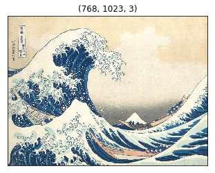

## VGG 16 model and 3 Inputs

We use [VGG16](https://arxiv.org/abs/1409.1556). It is pre-trained and available in Keras. We need to prepare input into the format expected by VGG16.

```python
from keras.applications.vgg16 import preprocess_input

def preprocess(img):
    img = img.copy()    
    img = img.astype('float64')
    # into a record
    img = np.expand_dims(img, axis=0)
    return preprocess_input(img)
```

We need three inputs:

- the content input has the preprocessed content image data
- the style input has the preprocessed style image data
- the generated input initially has the content image data and will be iteratively updated to apply the style from the style input

```python
def make_inputs(content_img, style_img):
    content_input   = K.constant(preprocess(content_img))
    style_input     = K.constant(preprocess(style_img))
    generated_input = K.placeholder(content_input.shape)  
    return content_input, style_input, generated_input
```

We concatenate the three inputs into one input tensor and give it to the VGG16 model.

```python
content_input, style_input, generated_input = make_inputs(
    cat_img, hokusai_img)

input_tensor = K.concatenate(
    [content_input, style_input, generated_input], axis=0)
```

The `input_tensor`'s shape is (3, height, width, channels, or filters).

- `input_tensor[0]` holds the `content_input`
- `input_tensor[1]` holds the `style_input`
- `input_tensor[2]` holds the `generated_input`

We generate the `generated_input` by manipulating the copy of the content image (i.e., cat image) to have the style image's style (i.e., Hokusai).

The VGG16 model takes `input_tensor` as input. The `include_top` is set to `False` as we are only interested in the convolutional layers, which are the feature extraction layers.

```python
from keras.applications.vgg16 import VGG16

model = VGG16(input_tensor=input_tensor, 
              include_top=False)
```

We are ready to feed-forward these three inputs in VGG16 and then compare generated feature values by using multiple cost functions so that we can adjust the generated image input to apply the style while keeping the content intact.

```python
model.summary()
```

The available convolutional layers are below:

```
_________________________________________________________________
Layer (type)                 Output Shape              Param #   
=================================================================
input_1 (InputLayer)         (None, None, None, 3)     0         
_________________________________________________________________
block1_conv1 (Conv2D)        (None, None, None, 64)    1792      
_________________________________________________________________
block1_conv2 (Conv2D)        (None, None, None, 64)    36928     
_________________________________________________________________
block1_pool (MaxPooling2D)   (None, None, None, 64)    0         
_________________________________________________________________
block2_conv1 (Conv2D)        (None, None, None, 128)   73856     
_________________________________________________________________
block2_conv2 (Conv2D)        (None, None, None, 128)   147584    
_________________________________________________________________
block2_pool (MaxPooling2D)   (None, None, None, 128)   0         
_________________________________________________________________
block3_conv1 (Conv2D)        (None, None, None, 256)   295168    
_________________________________________________________________
block3_conv2 (Conv2D)        (None, None, None, 256)   590080    
_________________________________________________________________
block3_conv3 (Conv2D)        (None, None, None, 256)   590080    
_________________________________________________________________
block3_pool (MaxPooling2D)   (None, None, None, 256)   0         
_________________________________________________________________
block4_conv1 (Conv2D)        (None, None, None, 512)   1180160   
_________________________________________________________________
block4_conv2 (Conv2D)        (None, None, None, 512)   2359808   
_________________________________________________________________
block4_conv3 (Conv2D)        (None, None, None, 512)   2359808   
_________________________________________________________________
block4_pool (MaxPooling2D)   (None, None, None, 512)   0         
_________________________________________________________________
block5_conv1 (Conv2D)        (None, None, None, 512)   2359808   
_________________________________________________________________
block5_conv2 (Conv2D)        (None, None, None, 512)   2359808   
_________________________________________________________________
block5_conv3 (Conv2D)        (None, None, None, 512)   2359808   
_________________________________________________________________
block5_pool (MaxPooling2D)   (None, None, None, 512)   0         
=================================================================
Total params: 14,714,688
Trainable params: 14,714,688
Non-trainable params: 0
_________________________________________________________________
```

## Content Loss Function

We pick one of the higher layers for the representation of the content of the image, such as shapes. We want to keep the generated image close to the content image. In other words, we want the generated image to have the same content (i.e., shapes) as the original image.

We define a cost function to keep the content similarity between the content image and the generated image. The content cost is the sum of the generated and content features squared differences.

```python
def calc_content_loss(layer_dict, content_layer_names):
    loss = 0
    for name in content_layer_names:
        layer = layer_dict[name]
        content_features   = layer.output[0, :, :, :]  
        generated_features = layer.output[2, :, :, :]  
        loss += K.sum(K.square(
            generated_features - content_features)) 
    return loss / len(content_layer_names)
```

Let’s use **block5_conv2** as the content representation.

```python
layer_dict = {layer.name:layer for layer in model.layers}
content_loss = calc_content_loss(layer_dict, ['block5_conv2'])
```

## Style Loss Function

### Gram Matrix

This is the most challenging part of style transfer. We use the Gram matrix to define the style loss function, which may not be so intuitive for everyone (not to me, anyhow).

Suppose a matrix $C$ contains $n$ column vectors $c_1, c_2, \dots, c_n$. The Gram matrix of C is a transposed matrix of $C$ multiplied by $C$, an $n \times n$ matrix. A Gram matrix tells us how column vectors are related to each other. Say, if two vectors have a positive dot product, they point in a similar direction. If the dot product is zero, they are orthogonal. If it is negative, they point in opposite directions.

We use the Gram matrix to see how each filter within a layer relates to the other filters.

For example, the **block1_conv1** layer has 64 filters. We flatten all 64 filters (matrices) into 64 vectors: $v_1, v_2, \dots, v_64$. Then, we calculate the dot products of every combination of the vectors. Each dot product tells us how strongly the filter combination (i.e., their activations) is related. It produces a Gram matrix of size 64 by 64.

```python
def gram_matrix(x):    
    features = K.batch_flatten(K.permute_dimensions(x, (2, 0, 1))) 
    gram = K.dot(features, K.transpose(features)) 
    return gram
```

When a style image goes through VGG16 convolutional layers, each layer produces a list of feature matrices. For example, **block1_conv1** produces 64 matrices, each of which is a feature matrix produced by applying a convolution operation on the input image. The same goes for the generated image.

In short, each layer contains a list of feature matrices. We say we have style features in each layer for the style image, and for the generated image, we have generated features in each layer. They are nothing but a list of matrices generated as part of activations for each filter in each layer.

When style features and generated features have similar Gram matrices, they have similar styles because the Gram matrices are generated from the flattened vectors of feature matrices. If they have similar Gram matrices, the filters have similar relationships in the same layers.

So, we calculate two Gram matrixes for each layer: one for the style features and the other for the generated features, and calculate the sum of the squared differences (with some denominators to adjust the values).

For example, in the **block1_conv1** layer, we calculate one Gram matrix for the style features and another Gram matrix for the generated features. We calculate the sum of the squared element-wise differences between the two Gram matrices (divided by a denominator that depends on the size of the feature matrices). It tells us how similar the style and general features are in the **block1_conv1** layer.

```python
def get_style_loss(style_features, generated_features):
    S = gram_matrix(style_features)
    G = gram_matrix(generated_features)
    channels = 3
    size = TARGET_SIZE[0]*TARGET_SIZE[1]
    denom = (4. * (channels**2) * (size**2))
    return K.sum(K.square(S - G)) / denom
```

We choose a list of layers as the representatives of the image style. Then, we calculate the Gram matrices for each layer: one for the style filters and one for the generated filters. We add them up to calculate the style loss.

```python
def calc_style_loss(layer_dict, style_layer_names):
    loss = 0
    for name in style_layer_names:
        layer = layer_dict[name]
        style_features     = layer.output[1,:,:,:] 
        generated_features = layer.output[2,:,:,:] 
        loss += get_style_loss(style_features, generated_features) 
    return loss / len(style_layer_names)
```

If the style loss is low, the two images have a similar style.

```python
style_loss = calc_style_loss(
    layer_dict,
    ['block1_conv1',
     'block2_conv1',
     'block3_conv1',
     'block4_conv1', 
     'block5_conv1'])
```

### Variation Loss Function

We want to make the generated image somewhat smooth and not jagged. The variation loss is defined based on the difference between the neighboring pixel values to avoid sudden jumps in pixel values.

```python
def calc_variation_loss(x):
    row_diff = K.square(x[:,:-1,:-1,:] - x[:,1:  , :-1,:])
    col_diff = K.square(x[:,:-1,:-1,:] - x[:, :-1,1:  ,:])
    return K.sum(K.pow(row_diff + col_diff, 1.25))
```

We calculate the total variation loss from the generated image.

```python
variation_loss = calc_variation_loss(generated_input)
```

### Nudge the Image

Based on the combination of the three loss values, we calculate the gradients to nudge the image to reduce the overall cost. As a result, the generated image keeps the content image while applying the style of the style image.

```python
loss = 0.8 * content_loss + \
       1.0 * style_loss   + \
       0.1 * variation_loss

grads = K.gradients(loss, generated_input)[0]
calculate = K.function([generated_input], [loss, grads])
generated_data = preprocess(cat_img)

# nudge the image using the gradients
for i in tqdm(range(10)):
    _, grads_value = calculate([generated_data])
    generated_data -= grads_value * 0.001
```

To display the generated image, we need to reverse the preprocessing.

```python
def deprocess(img):
    img = img.copy()            # Don't mess the original data.
    img = img[0]                # An image out of the record.    
    img[:,:,0] += 103.939       # VGG16 average color values
    img[:,:,1] += 116.779
    img[:,:,2] += 123.68      
    img = img[:,:,::-1]         # BGR -> RGB
    img = np.clip(img, 0, 255)  
    return img.astype('uint8')  # convert o uin8 
```

Now, we are ready to show the generated image.

```python
generated_image = deprocess(generated_data)

plt.figure(figsize=(10,20))
plt.imshow(generated_image)
plt.xticks([])
plt.yticks([])
plt.show()
```

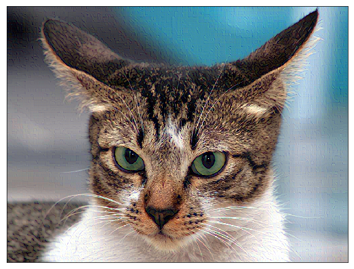

The effect is not that obvious here. We should play with the hyperparameters.

### Experiments with hyperparameters

Let’s put it all together in one function so that we can do some experiments. Please see the [Github](https://github.com/naokishibuya/deep-learning/blob/master/python/artistic_style_transfer.ipynb) for the actual code details.

```python
def transfer_style(
    content_img,
    style_img,
    content_layer_names,
    style_layer_names,
    content_loss_ratio,
    style_loss_ratio,
    variation_loss_ratio,
    start_img=None,
    steps=10,
    learning_rate=0.001,
    show_generated_image=True,
    figsize=(10,20)):
    ...
```

### Only the Style Cost

Let’s use only the style cost function.

```python
transfer_style(
    cat_img, 
    hokusai_img, 
    ['block5_conv2'], 
    ['block1_conv1',
     'block2_conv1',
     'block3_conv1',
     'block4_conv1', 
     'block5_conv1'],
    content_loss_ratio=0.0, 
    style_loss_ratio=1.0, 
    variation_loss_ratio=0.0,
    steps=100,
    learning_rate=0.01);
```

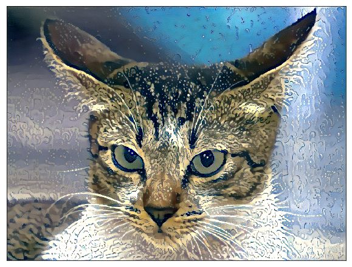

Does the cat look soaked entirely? Or behind a wet glass window? Something waterly for sure.

### Adding the Content Loss

A bit too much of a melting look? Let’s add the content loss to avoid deformation.

```python
transfer_style(
    cat_img, 
    hokusai_img,
    ['block5_conv2'],
    ['block1_conv1',
     'block2_conv1',
     'block3_conv1',
     'block4_conv1',
     'block5_conv1'],
    content_loss_ratio=1.0,
    style_loss_ratio=1.0,
    variation_loss_ratio=0.0,
    steps=100,
    learning_rate=0.01);
```


### Adding the Variation Loss

Let’s add variation loss to smooth the image like a paint drawing.

```python
transfer_style(
    cat_img,
    hokusai_img,
    ['block5_conv2'],
    ['block1_conv1',
     'block2_conv1',
     'block3_conv1',
     'block4_conv1',
     'block5_conv1'],
    content_loss_ratio=1.0,
    style_loss_ratio=1.0,
    variation_loss_ratio=0.7,
    steps=100,
    learning_rate=0.01);
```

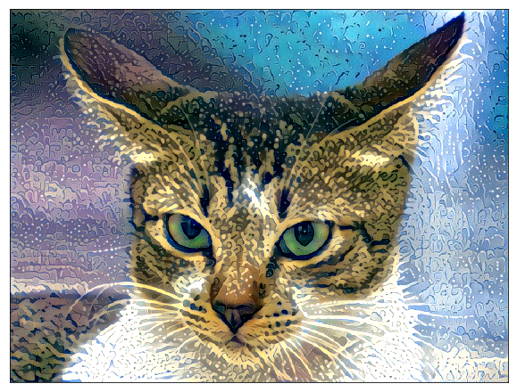

Predicting the generated image's appearance before running the experiments is challenging. If you play with the hyperparameters, be careful not to make them too big, which may make the pixel values too small and make the picture completely black.

### How about Dancing Men Style?

In case you are wondering, I drew this image for my SoundCloud music [“Hey Man!”](https://soundcloud.com/naoki_shibuya/hey-man). Let’s use it as the style image.

```python
dancing_men_img = plt.imread('../images/dancing_men.png')

dancing_men_img = sp.misc.imresize(dancing_men_img, TARGET_SIZE)
```

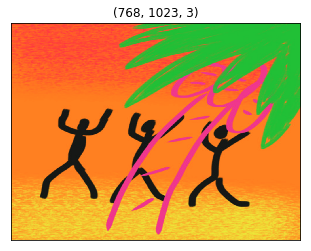

I chose the lower layers as the style, thinking that the color and texture would be captured there. I adjusted other parameters so that it would not go completely black.

```python
transfer_style(
    cat_img, 
    dancing_men_img,
    ['block5_conv1'], 
    ['block1_conv2',
     'block2_conv2',
     'block3_conv3'],
    content_loss_ratio=0.1, 
    style_loss_ratio=1.0, 
    variation_loss_ratio=0.1,
    steps=100,
    learning_rate=0.001);
```

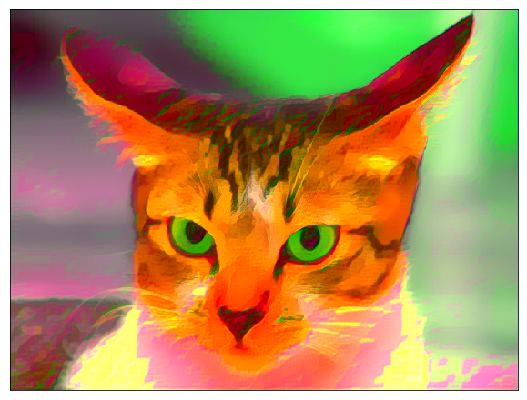

The cat looks angrier. Well, it wasn’t as interesting as I was hoping. I guess the choice of the style image is quite important.

### Start with Noise Image

One more experiment — instead of starting with the content image, let’s start with a noise image.

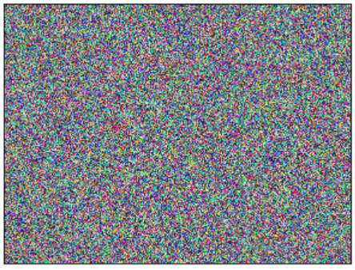

Seeing any shape from the content image will take longer, but the result is interesting.

```python
transfer_style(
    cat_img, 
    dancing_men_img,
    ['block5_conv3'], 
    ['block1_conv2',
     'block2_conv2',
     'block3_conv3',
     'block4_conv3', 
     'block5_conv3'],
    content_loss_ratio=1.0, 
    style_loss_ratio=0.05,
    variation_loss_ratio=0.01,
    start_img=random_img,
    steps=5000,
    learning_rate=0.03);
```

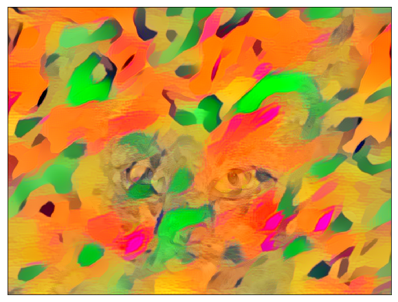

Here is another one with Hokusai style.

```python
transfer_style(
    cat_img,
    hokusai_img,
    ['block5_conv2'],
    ['block1_conv1',
     'block2_conv1',
     'block3_conv1',
     'block4_conv1',
     'block5_conv1'],
    content_loss_ratio=1.0,
    style_loss_ratio=0.05,
    variation_loss_ratio=0.01,
    start_img=random_img,
    steps=5000,
    learning_rate=0.03);
```


I am pretty happy with this artistic result. What do you think?

## References

- [Do Filters Dream of Convolutional Cats?](/blog/2017-10-26-do-filters-dream-of-convolutional-cats/)
- [Neural Style Transfer](https://keras.io/examples/generative/neural_style_transfer/) \
  Francois Chollet
- [Dogs vs. Cats Redux: Kernels Edition](https://www.kaggle.com/c/dogs-vs-cats-redux-kernels-edition)
- [The Great Wave Off Kanagawa](https://en.wikipedia.org/wiki/The_Great_Wave_off_Kanagawa) \
  Hokusai Katsushika
- [Very Deep Convolutional Networks for Large-Scale Image Recognition](https://arxiv.org/abs/1409.1556) \
  Karen Simonyan, Andrew Zisserman
