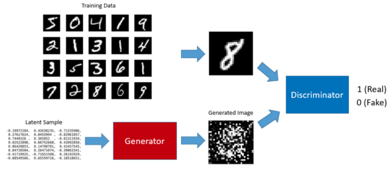
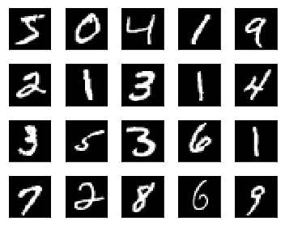
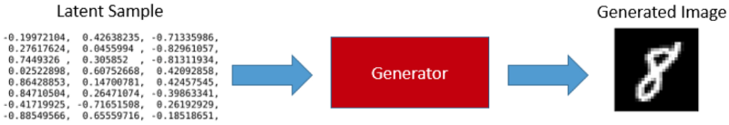
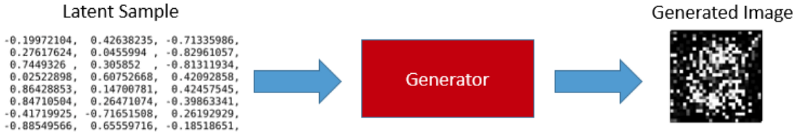
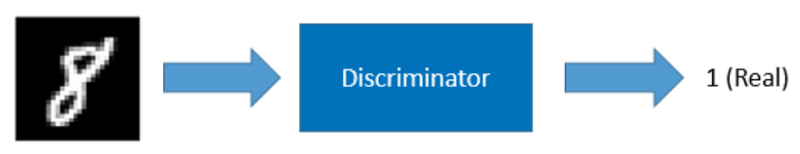
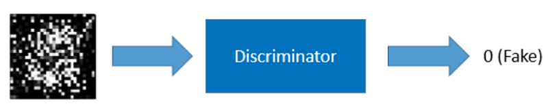
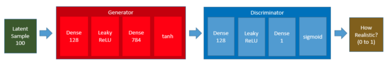
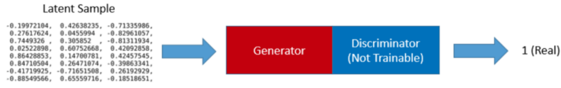
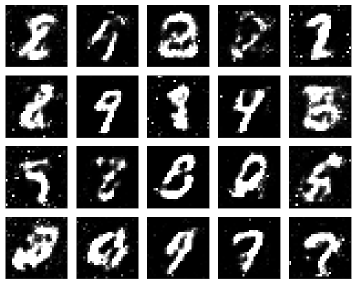
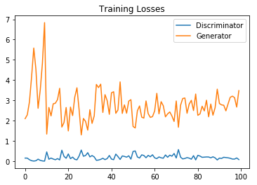

If you see the above image that does not make much sense, this article is for you. I explain how GANs (Generative Adversarial Networks) work using a simple project that generates hand-written digit images.

I used Keras on TensorFlow, and the notebook code is available on [my Github](https://github.com/naokishibuya/deep-learning/blob/master/python/gan_mnist.ipynb).

## Background

[GAN (Generative Adversarial Network)](https://arxiv.org/abs/1406.2661) is a framework proposed by Ian Goodfellow, Yoshua Bengio, and others in 2014.

We can train a GAN to generate images from random noises. For example, we can train a GAN to generate digit images that look like handwritten ones from [MNIST](http://yann.lecun.com/exdb/mnist/) database.



A GAN has two parts: the generator that generates images and the discriminator that classifies real and fake images.

## The Generator

The input to the generator is a series of randomly generated numbers called **latent samples**. Once trained, the generator can produce digit images from latent samples.



Our generator is a simple fully-connected network that takes a latent sample (100 randomly generated numbers) and produces 784 data points which we can reshape into a 28 x 28 digit image which is the size used by all MNIST digit images.

```python
generator = Sequential([
    Dense(128, input_shape=(100,)),
    LeakyReLU(alpha=0.01),
    Dense(784),
    Activation('tanh')
], name='generator')
```

The summary output is as follows:

```
_________________________________________________________________
Layer (type)                 Output Shape              Param #   
=================================================================
dense_1 (Dense)              (None, 128)               12928     
_________________________________________________________________
leaky_re_lu_1 (LeakyReLU)    (None, 128)               0         
_________________________________________________________________
dense_2 (Dense)              (None, 784)               101136    
_________________________________________________________________
activation_1 (Activation)    (None, 784)               0         
=================================================================
Total params: 114,064
Trainable params: 114,064
Non-trainable params: 0
_________________________________________________________________
```

We use the **tanh** activation, which [How to Train a GAN? Tips and tricks to make GANs work](https://github.com/soumith/ganhacks) recommends. It also means we must rescale the MNIST images between -1 and 1. More details are on [my Github](https://github.com/naokishibuya/deep-learning/blob/master/python/gan_mnist.ipynb).

## How to Train the Generator?

Without training, the generator produces garbage images only.



To train the generator, we need to train a GAN. Before talking about GAN, we shall discuss the discriminator.

## The Discriminator

The discriminator is a classifier trained using supervised learning. It classifies whether an image is real (1) or not (0).

We train the discriminator using both the MNIST images and the generated images.

If the input image is from the MNIST database, the discriminator should classify it as real.



If the input image is from the generator, the discriminator should classify it as fake.



The discriminator is also a simple fully-connected neural network.

```python
discriminator = Sequential([
    Dense(128, input_shape=(784,)),
    LeakyReLU(alpha=0.01),
    Dense(1),
    Activation('sigmoid')
], name='discriminator')
```

The summary output is as follows:

```
_________________________________________________________________
Layer (type)                 Output Shape              Param #   
=================================================================
dense_3 (Dense)              (None, 128)               100480    
_________________________________________________________________
leaky_re_lu_2 (LeakyReLU)    (None, 128)               0         
_________________________________________________________________
dense_4 (Dense)              (None, 1)                 129       
_________________________________________________________________
activation_2 (Activation)    (None, 1)                 0         
=================================================================
Total params: 100,609
Trainable params: 100,609
Non-trainable params: 0
_________________________________________________________________
```

The last activation is **sigmoid** to tell us the probability of whether the input image is real or not. So, the output can be any value between 0 and 1.

## The GAN

We connect the generator and the discriminator to produce a GAN.



Keras has an easy way to connect two models as follows:

```python
gan = Sequential([
    generator,
    discriminator
])

gan.summary()
```

The structure of the network is shown below:

```
Layer (type)                 Output Shape              Param #   
=================================================================
generator (Sequential)       (None, 784)               114064    
_________________________________________________________________
discriminator (Sequential)   (None, 1)                 100609    
=================================================================
Total params: 214,673
Trainable params: 214,673
Non-trainable params: 0
_________________________________________________________________
```

Now that we know the generator, the discriminator, and the GAN, we shall discuss how to train the generator.

## Training the GAN means Training the Generator

When we feed a latent sample to the GAN, the generator internally produces a digit image, which the discriminator receives for classification. If the generator does a good job, the discriminator returns a value close to 1 (high probability of the image being real).

We feed latent samples to the GAN while setting the expected outcome (label) to 1 (real) as we expect the generator to produce a realistic image and the discriminator to say it is real or close to real.

However, the generator initially produces garbage images, and the loss value is high. So, the back-propagation updates the generator’s weights to produce more realistic images as the training continues, which is how we train the generator via training the GAN.

There is one catch in training the generator via the GAN. We do not want the discriminator’s weights to be affected because we are using the discriminator as merely a classifier.

For this reason, we set the discriminator non-trainable during the generator training.


## The Train Loop

Let’s not forget that we must train the discriminator to do an excellent job as a classifier of real and fake images.

We train the discriminator and the generator in turn in a loop as follows:

Step 1) Set the discriminator trainable

Step 2) Train the discriminator with the real MNIST digit images and the images generated by the generator to classify the real and fake images.


Step 3) Set the discriminator non-trainable

Step 4) Train the generator as part of the GAN. We feed latent samples into the GAN, let the generator produce digit images, and use the discriminator to classify the image.



Ideally, The loop should continue until they are trained well and can not be improved any further.

## But does it work?

The result of the simple GAN is not outstanding. Some of them look pretty good, but others are not.



As it turns out, training a GAN requires many hacks as per [How to Train a GAN? Tips and tricks to make GANs work](https://github.com/soumith/ganhacks), such as label smoothing and other techniques.

There are all sorts of empirical quirks. If I train the discriminator much faster than the generator, the generator gives up learning. In some cases, the generator learns to deceive the discriminator and makes the discriminator unable to learn to classify correctly.

I tried different hacks, and the below plot of the loss values is what I could achieve after about one-day of experiments (complete details on [my Github](https://github.com/naokishibuya/deep-learning/blob/master/python/gan_mnist.ipynb)).

{width="75%"}

The generator should have lower loss values than the above. I believe we can improve the performance if we use more complex networks like [DCGAN](https://arxiv.org/pdf/1511.06434v2.pdf) (Deep Convolutional GAN).

This article uses the simple GAN example to show how GAN works in principle. Once you know, it should be easier to understand other GAN articles and implementations.

Moreover, there are many kinds of GANs ([the whole list](https://github.com/wiseodd/generative-models)), and people are inventing new types of GANs as we speak. So, GANs do work, and many people are researching GANs.

## References

- [GAN (Generative Adversarial Network): Simple Implementation with PyTorch](/blog/2022-04-21-gangenerative-adversarial-network-simple-implementation-with-pytorch/)
- [Generative Adversarial Networks](https://arxiv.org/abs/1406.2661) \
  Ian J. Goodfellow, Jean Pouget-Abadie, Mehdi Mirza, Bing Xu, David Warde-Farley, Sherjil Ozair, Aaron Courville, Yoshua Bengio
- [GAN MNIST Example in TensorFlow, Udacity](https://github.com/udacity/deep-learning/tree/master/gan_mnist) \
- [MNIST dataset](http://yann.lecun.com/exdb/mnist/) \
  Yann LeCun
- [How to Train a GAN? Tips and tricks to make GANs work](https://github.com/soumith/ganhacks) \
  Soumith Chintala, Emily Denton, Martin Arjovsky, Michael Mathieu \
  Facebook AI Research
- [Generative Models](https://github.com/wiseodd/generative-models) \
  Agustinus Kristiadi
