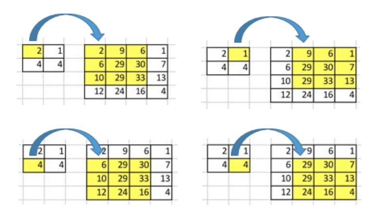

If you’ve heard about the transposed convolution and got confused about its meaning, this article is for you.

The content of this article is as follows:

- The Need for Up-sampling
- Why Transposed Convolution?
- Convolution Operation
- Going Backward
- Convolution Matrix
- Transposed Convolution Matrix
- Summary

The notebook is available on my [GitHub](https://github.com/naokishibuya/deep-learning/blob/master/python/transposed_convolution.ipynb).

## The Need for Up-sampling

Using neural networks to generate images usually involves up-sampling from low resolution to high resolution.

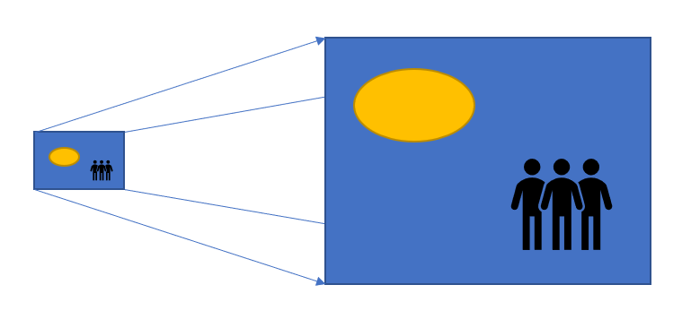

There are various methods to conduct up-sampling operations:

- Nearest neighbor interpolation
- Bi-linear interpolation
- Bi-cubic interpolation

All these methods involve some interpolation method we must choose when deciding on network architecture. It is like manual feature engineering, and there is nothing that the network can learn.

## Why Transposed Convolution?

We can use the transposed convolution if we want our network to learn how to up-sample optimally. It does not use a predefined interpolation method. It has learnable parameters.

It is helpful to understand the transposed convolution concept as essential papers and projects use it, such as:

- the generator in [DCGAN](https://arxiv.org/pdf/1511.06434v2.pdf) takes randomly sampled values to produce a full-size image.
- semantic segmentation uses convolutional layers to extract features in the encoder. Then it restores the original image size in the decoder to classify every pixel in the original image.

FYI — the transposed convolution is also known as:

- Fractionally-strided convolution
- Deconvolution

We will only use the word **transposed convolution** in this article, but you may notice alternative names in other articles.

## Convolution Operation

Let’s use a simple example to explain how convolution operation works. Suppose we have a 4x4 matrix and apply a convolution operation with a 3 x 3 kernel, with no padding and a stride of 1. As shown further below, the output is a 2x2 matrix.

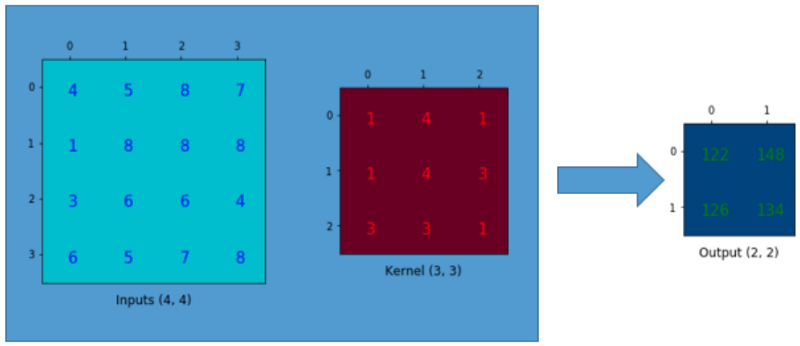

The convolution operation calculates the sum of the element-wise multiplication between the input and kernel matrices. We can do this only four times since we have no padding and a stride of 1. Hence, the output matrix is 2x2.

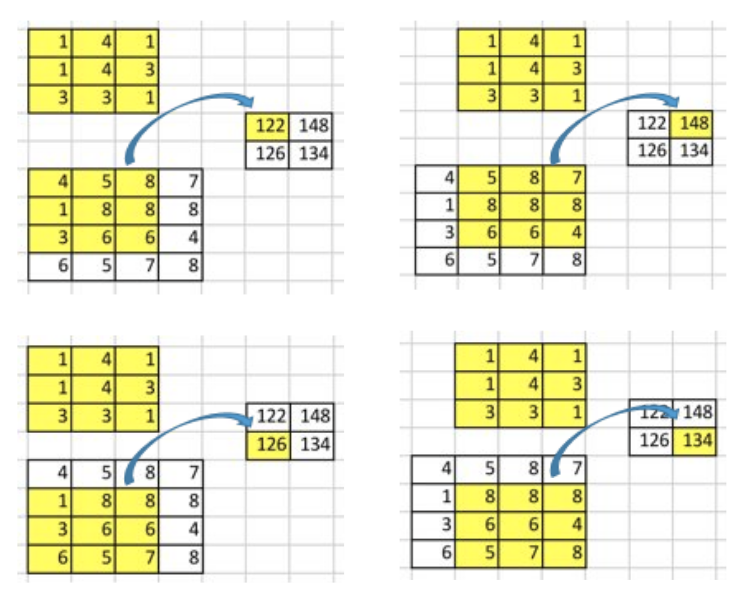

A critical point of such convolution operation is that positional connectivity exists between input and output values.

For example, the input matrix's top left values affect the output matrix's top left value.

We use the 3 x 3 kernel to connect the nine input matrix values to one output matrix value. **A convolution operation forms a many-to-one relationship**. Let’s keep this in mind as we need it later on.

## Going Backward

Now, suppose we want to go in the other direction. We want to associate one value in a matrix with nine values in another. It’s a one-to-many relationship. It is like going backward in convolution operation, which is the core idea of **transposed convolution**.

For example, we up-sample a 2x2 matrix to a 4x4 matrix. The operation maintains the 1-to-9 relationship.

But how do we perform such an operation?

To talk about how we need to define the **convolution matrix** and the **transposed convolution matrix**.

## Convolution Matrix

We can express a convolution operation using a matrix. It is a kernel matrix rearranged so that we can use matrix multiplication to conduct convolution operations.

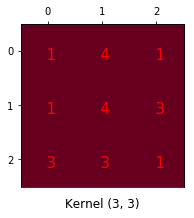

We rearrange the 3x3 kernel into a 4x16 matrix as below:

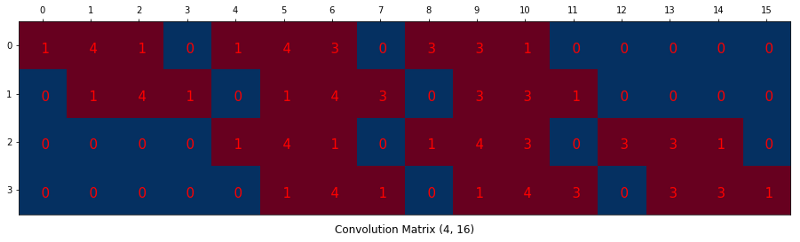

It is a convolution matrix. Each row defines one convolution operation. If you do not see it, the below diagram may help. Each row of the convolution matrix is just a rearranged kernel matrix with zero padding in different places.

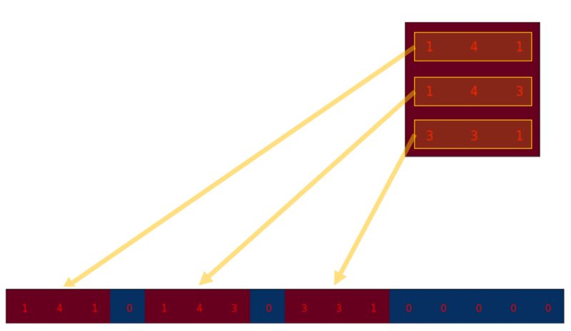

To use it, we flatten the input matrix (4x4) into a column vector (16x1).

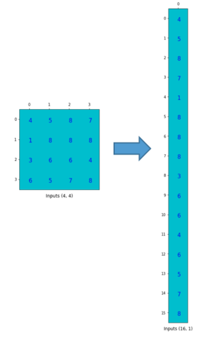

We can matrix-multiply the 4x16 convolution matrix with the 16x1 input matrix (16-dimensional column vector).

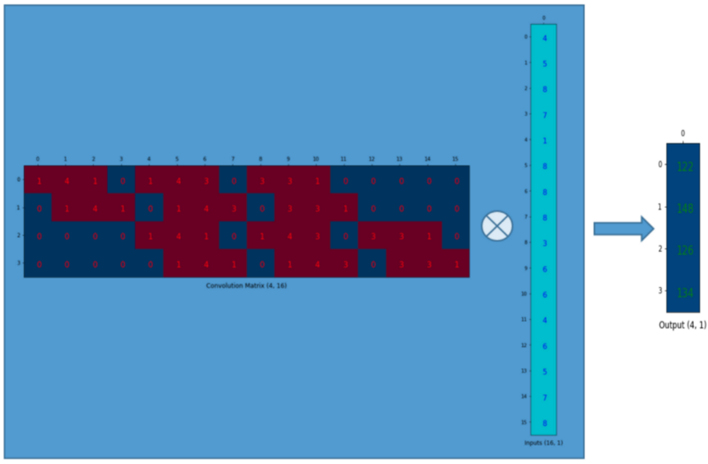

The output 4x1 matrix can be reshaped into a 2x2 matrix, giving us the same result.

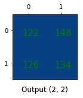

In short, a convolution matrix is nothing but rearranged kernel weights, and we can express a convolution operation using the convolution matrix.

So what?

The point is that with the convolution matrix, you can go from 16 (4x4) to 4 (2x2) because the convolution matrix is 4x16. Then, if you have a 16x4 matrix, you can go from 4 (2x2) to 16 (4x4).

Confused?

Please read on.

## Transposed Convolution Matrix

We want to go from 4 (2x2) to 16 (4x4). So, we use a 16x4 matrix. But there is one more thing here. We want to maintain the 1-to-9 relationship.

Suppose we transpose the convolution matrix C (4x16) to C.T (16x4). We can matrix-multiply C.T (16x4) with a column vector (4x1) to generate an output matrix (16x1). The transposed matrix connects one value to 9 values in the output.

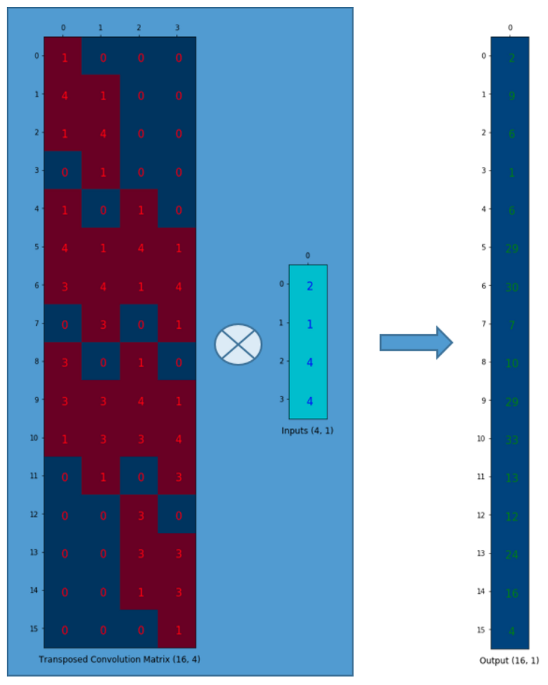

We can reshape the output into 4x4.

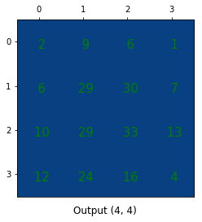

We have up-sampled a smaller matrix (2x2) into a larger one (4x4). The transposed convolution maintains the 1 to 9 relationship because of the way it lays out the weights.

NB: the actual weight values in the matrix do not come from the original convolution matrix. What’s important is that the weight layout is the same as the transpose of the convolution matrix shape.

## Summary

The transposed convolution operation forms the same connectivity as the regular convolution but in the backward direction.

We can use it to conduct up-sampling. Moreover, the weights in the transposed convolution are learnable. So we do not need a predefined interpolation method.

Even though it is called the _transposed_ convolution, it does not mean we take some existing convolution matrix and use the transposed version. The main point is that the association between the input and the output is handled backward compared with a standard convolution matrix (one-to-many rather than many-to-one association).

As such, the transposed convolution is not a convolution. But we can emulate the transposed convolution using a convolution. We up-sample the input by adding zeros between the values in the input matrix so that the direct convolution produces the same effect as the transposed convolution. You may find some article that explains the transposed convolution in this way. However, it is less efficient due to the need to add zeros to up-sample the input before the convolution.

**One caution**: the transposed convolution is the cause of the checkerboard artifacts in generated images. [This article](https://distill.pub/2016/deconv-checkerboard/) recommends an up-sampling operation (i.e., an interpolation method) followed by a convolution operation to reduce such issues. If your main objective is generating images without such artifacts, it is worth reading the paper to learn more.

## References

- [A guide to convolution arithmetic for deep learning](https://arxiv.org/abs/1603.07285) \
  Vincent Dumoulin, Francesco Visin
- [Unsupervised Representation Learning with Deep Convolutional Generative Adversarial Networks](https://arxiv.org/pdf/1511.06434v2.pdf) \
  Alec Radford, Luke Metz, Soumith Chintala
- [Fully Convolutional Networks for Semantic Segmentation](https://arxiv.org/abs/1411.4038) \
  Jonathan Long, Evan Shelhamer, Trevor Darrell
- [Deconvolution and Checkerboard Artifacts](https://distill.pub/2016/deconv-checkerboard/) \
  Augustus Odena, Vincent Dumoulin, Chris Olah
