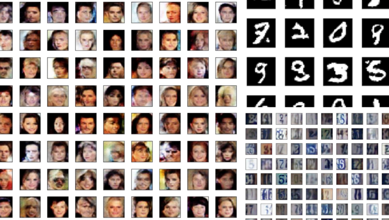
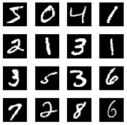
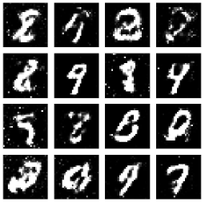
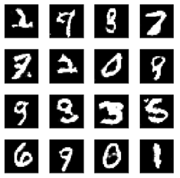
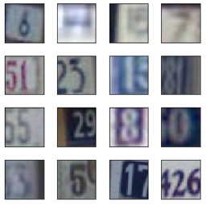
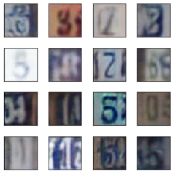
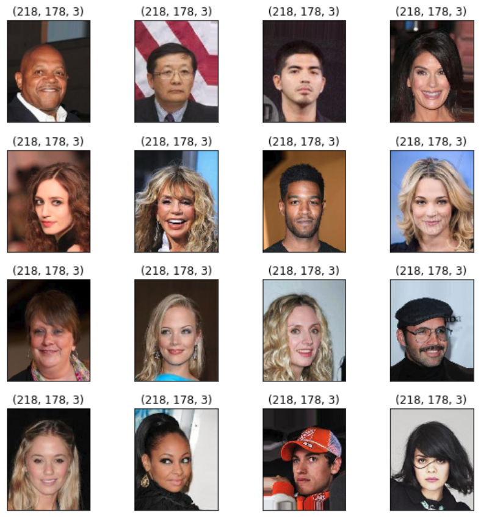
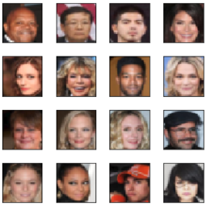
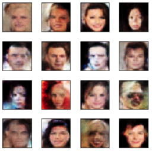

This article shows Deep Convolutional GAN (Generative Adversarial Networks) — a.k.a DCGAN examples using different image data sets such as [MNIST](http://yann.lecun.com/exdb/mnist/), [SVHN](http://ufldl.stanford.edu/housenumbers/), and [CelebA](http://mmlab.ie.cuhk.edu.hk/projects/CelebA.html).

## DCGAN with MNIST



In [Understanding Generative Adversarial Networks](/blog/2017-11-03-understanding-generative-adversarial-networks/), I used a simple GAN to generate images, and the results were merely good enough to prove the concept.



Below, I used DCGAN to generate the images. There are much fewer noises, and the shapes are better.



## The Difference between the Simple GAN and the DCGAN

The generator of the simple GAN is a simple fully-connected network.

```python
generator = Sequential([
        Dense(128, input_shape=(100,)),
        LeakyReLU(alpha=0.01),
        Dense(784),        
        Activation('tanh')
    ], name='generator')
```

The generator of the DCGAN uses [the transposed convolution technique](/blog/2017/2017-11-14-up-sampling-with-transposed-convolution/) to perform up-sampling of 2D image size.

```python
generator = Sequential([
    # Layer 1
    Dense(784, input_shape=(100,)),
    Reshape(target_shape=(7, 7, 16)),
    BatchNormalization(),
    LeakyReLU(alpha=0.01),

    # Layer 2
    Conv2DTranspose(32, kernel_size=5, strides=2, padding='same'), 
    BatchNormalization(),
    LeakyReLU(alpha=0.01),

    # Layer 3
    Conv2DTranspose(1, kernel_size=5, strides=2, padding='same'),
    Activation('tanh')
])
```

[Notebook on GitHub](https://github.com/naokishibuya/deep-learning/blob/master/python/dcgan_mnist.ipynb)

We can roughly consider the transposed convolution as a reverse operation of regular convolution. The generator network summary below shows that the multiple transposed convolutions increase the image size.

```
Layer (type)                 Output Shape              Param #   
=================================================================
dense_7 (Dense)              (None, 784)               79184     
_________________________________________________________________
reshape_5 (Reshape)          (None, 7, 7, 16)          0         
_________________________________________________________________
batch_normalization_7 (Batch (None, 7, 7, 16)          64        
_________________________________________________________________
leaky_re_lu_5 (LeakyReLU)    (None, 7, 7, 16)          0         
_________________________________________________________________
conv2d_transpose_4 (Conv2DTr (None, 14, 14, 32)        12832     
_________________________________________________________________
batch_normalization_8 (Batch (None, 14, 14, 32)        128       
_________________________________________________________________
leaky_re_lu_6 (LeakyReLU)    (None, 14, 14, 32)        0         
_________________________________________________________________
conv2d_transpose_5 (Conv2DTr (None, 28, 28, 1)         801       
_________________________________________________________________
activation_3 (Activation)    (None, 28, 28, 1)         0         
=================================================================
Total params: 93,009
Trainable params: 92,913
Non-trainable params: 96
_________________________________________________________________
```

The final image shape is 28x28 with one channel, the same as the original MNIST digit image size.

FYI — my article [Up-sampling with Transposed Convolution](/blog/2017/2017-11-14-up-sampling-with-transposed-convolution/) details the concept of transposed convolution.

## DCGAN with SVHN



This DCGAN example uses [The Street View House Numbers (SVHN) Dataset](http://ufldl.stanford.edu/housenumbers/).

The generated images look pretty decent. If these images are mixed with the authentic SVHN images, I cannot tell which ones are which (I am not a good discriminator).



The generator has three transposed convolution layers.

```python
generator = Sequential([
    # Layer 1
    Dense(4*4*512, input_shape=(100,)),
    Reshape(target_shape=(4, 4, 512)),
    BatchNormalization(),
    LeakyReLU(alpha=0.2),

    # Layer 2
    Conv2DTranspose(256, kernel_size=5, strides=2, padding='same'),
    BatchNormalization(),
    LeakyReLU(alpha=0.2),

    # Layer 3
    Conv2DTranspose(128, kernel_size=5, strides=2, padding='same'),
    BatchNormalization(),
    LeakyReLU(alpha=0.2),

    # Layer 4
    Conv2DTranspose(3, kernel_size=5, strides=2, padding='same'),
    Activation('tanh')
])
```

This network was much more challenging to train. No wonder why GANs are notorious for being very hard to train.

[My notebook on GitHub](https://github.com/naokishibuya/deep-learning/blob/master/python/dcgan_svhn.ipynb) contains a few training scenarios with various hyperparameters. I experimented with the learning rate, the leaky ReLU’s alpha, and the Adam optimizer’s momentum coefficient (beta 1). Adding / removing the batch normalization, and e.t.c.

I learned some hyper-parameter tuning ideas from [How to Train a GAN? Tips and tricks to make GANs work](https://github.com/soumith/ganhacks). There is a presentation by the author on YouTube which I recommend watching before reading [the paper](https://github.com/soumith/ganhacks).

<iframe width="560" height="315" src="https://www.youtube.com/embed/X1mUN6dD8uE" title="YouTube video player" frameborder="0" allow="accelerometer; autoplay; clipboard-write; encrypted-media; gyroscope; picture-in-picture; web-share" allowfullscreen></iframe>

## DCGAN with CelebA



The last (but not least) example uses the [Large-scale Celeb Faces Attributes (CelebA) Dataset](http://mmlab.ie.cuhk.edu.hk/projects/CelebA.html).

I decided to resize the images to 32 x 32 as training the network took too long.



The generated images look a bit Frankenstein-ish. But look, it’s generating faces from random noises. Isn’t that something?



This generator network has a similar capacity to the SVHN example.

One thing I did differently was that I used a different kernel weight initializer as suggested in [How to Train a GAN? Tips and tricks to make GANs work](https://github.com/soumith/ganhacks). It seems to have improved the quality of images, but it is not clear by how much. In any case, the result was good enough to prove that it works. If you play with GANs, you may also experiment with the initializers.

```python
from keras.initializers import RandomNormal

generator = Sequential([
    # Layer 1
    Dense(4*4*512, input_shape=(100,), 
          kernel_initializer=RandomNormal(stddev=0.02)),
    Reshape(target_shape=(4, 4, 512)),
    BatchNormalization(),
    LeakyReLU(alpha=0.2),

    # Layer 2
    Conv2DTranspose(256, kernel_size=5, strides=2, padding='same', 
                    kernel_initializer=RandomNormal(stddev=0.02)), 
    BatchNormalization(),
    LeakyReLU(alpha=0.2),

    # Layer 3
    Conv2DTranspose(128, kernel_size=5, strides=2, padding='same', 
                    kernel_initializer=RandomNormal(stddev=0.02)),
    BatchNormalization(),
    LeakyReLU(alpha=0.2),

    # Layer 4
    Conv2DTranspose(3, kernel_size=5, strides=2, padding='same', 
                    kernel_initializer=RandomNormal(stddev=0.02)),
    Activation('tanh')
])
```

[Notebook on GitHub](https://github.com/naokishibuya/deep-learning/blob/master/python/dcgan_celeba.ipynb)

## Conclusion

The concept of GANs is not that hard to understand (i.e., [Understanding Generative Adversarial Networks](/blog/2017/2017-11-03-understanding-generative-adversarial-networks/)). But implementing them to produce quality images can be tricky. So I recommend anybody who wants better insights into GANs to make their hands dirty and tweak parameters.

It takes a long time to train deep networks with tons of images. So, I hope this article and [my notebooks on GitHub](https://github.com/udacity/deep-learning) can provide insights without sweat and tears.

## References

- [Generative Adversarial Networks](https://arxiv.org/abs/1406.2661) \
  Ian J. Goodfellow, Jean Pouget-Abadie, Mehdi Mirza, Bing Xu, David Warde-Farley, Sherjil Ozair, Aaron Courville, Yoshua Bengio
- [Unsupervised Representation Learning with Deep Convolutional Generative Adversarial Networks](https://arxiv.org/pdf/1511.06434.pdf) \
  Alec Radford & Luke Metz (Indico Research), Soumith Chintala (Facebook AI Research)
- [How to Train a GAN? Tips and tricks to make GANs work](https://github.com/soumith/ganhacks) \
  Soumith Chintala, Emily Denton, Martin Arjovsky, Michael Mathieu \
  Facebook AI Research \
  [YouTube](https://www.youtube.com/watch?v=X1mUN6dD8uE)
- [Udacity Deep Learning Nanodegree GitHub](https://github.com/udacity/deep-learning)
- [MNIST dataset](http://yann.lecun.com/exdb/mnist/) \
  Yann LeCun
- [The Street View House Numbers (SVHN) Dataset, Stanford](http://ufldl.stanford.edu/housenumbers/)
- [Large-scale CelebFaces Attributes (CelebA) Dataset](http://mmlab.ie.cuhk.edu.hk/projects/CelebA.html) \
  Ziwei Liu, Ping Luo, Xiaogang Wang, Xiaoou Tang Multimedia Laboratory, The Chinese University of Hong Kong
