Is it a disorder, uncertainty, or surprise?

The idea of entropy is confusing at first because people use so many different words to describe it: disorder, uncertainty, surprise, unpredictability, amount of information, and so on. If you’ve got confused with the word “entropy”, you are in the right place. I am going to demystify it for you.

## Who Invented Entropy and&nbsp;Why?

In 1948, Claude Shannon introduced the concept of information entropy in his paper "[A Mathematical Theory of Communication](http://math.harvard.edu/~ctm/home/text/others/shannon/entropy/entropy.pdf)".

)](images/Claude_Shannon.png)

Shannon sought a way to efficiently send messages without losing any information.

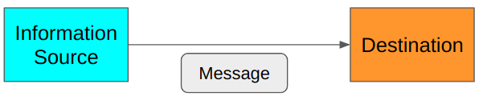{width="80%"}

Shannon measured the efficiency in terms of average message length. Therefore, he was thinking about how to encode the original message into the smallest possible data structure. At the same time, he required that there should be no information loss. As such, the decoder at the destination must be able to restore the original message losslessly.

Shannon defined entropy as the smallest possible average size of lossless encoding of the messages sent from the source to the destination. He showed how to calculate entropy, which is valuable for using the communication channel efficiently.

The above definition of entropy might not be evident to you now. We shall see many examples to learn what it means to efficiently and losslessly send messages.

## How to Make Efficient and Lossless Encoding?

Suppose you want to send a message from Tokyo to New York regarding Tokyo’s weather today.

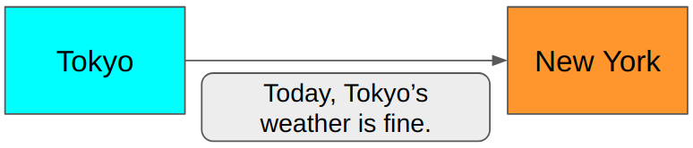{width="80%"}

Is this efficient?

In this scenario, the sender in Tokyo and the receiver in New York both know that they only communicate about today’s weather in Tokyo. So, we don’t need to send the words like `Today`, `Tokyo’s`, and `weather`. We need to say `Fine` or `Not fine`, and that’s it.

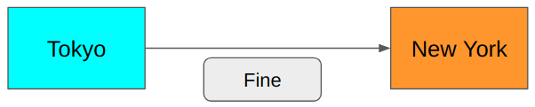{width="80%"}

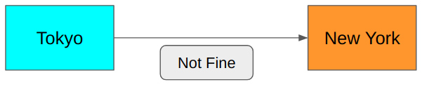{width="80%"}

It is much shorter. Can we do better?

You bet. Because we only need to say `yes` or `no`, which is binary. We need precisely 1 bit to encode the above messages. 0 for `Fine` and 1 for `Not fine`.

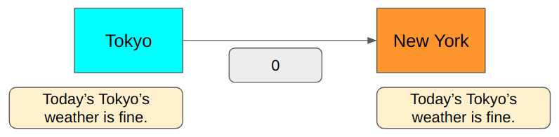

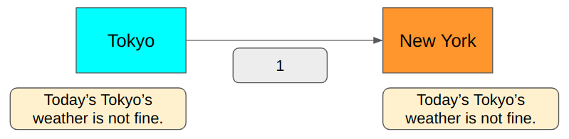

Is this lossless?

Yes, we can encode and decode the message without losing any information since we only have two possible message types: `Fine` and `Not fine`.

But if we also want to talk about `Cloudy` or `Rainy`, the 1-bit encoding won’t cover all cases.

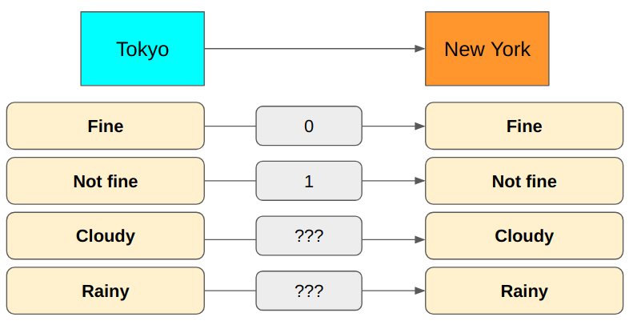

How about using 2 bits instead?

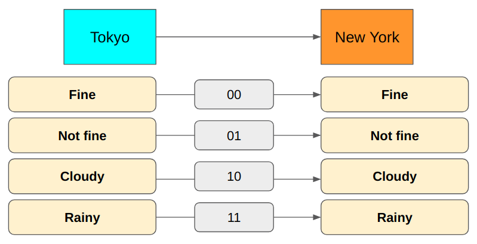

Now we can express all cases. It requires only 2 bits to send the messages.

But there is something wrong with this approach. Semantically, `Cloudy` and `Rainy` are `Not fine`. It seems `Not fine` is redundant. Let’s remove it.

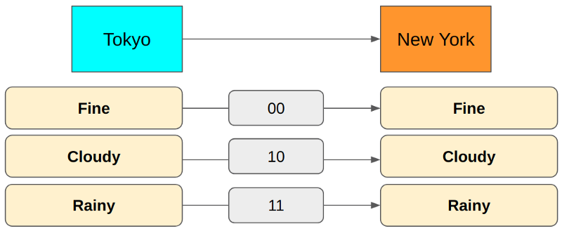

In the above encoding, `Fine` is 00, but we don’t need the second zero. When the first bit is zero, we already know it is `Fine` because both `Cloudy` and `Rainy` start with 1.

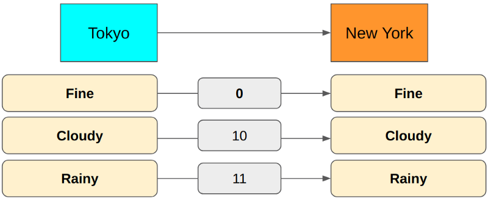

The first bit indicates `Fine or not` in the above encoding. The second bit indicates `Cloudy or Rainy`.

But there is a problem. It can snow in Tokyo, and we cannot communicate with such weather. What do we do?

We could add a third bit for `Rainy` and `Snow` cases.

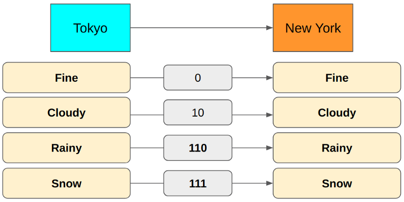

We changed `Rainy` from 11 to 110 and added `Snow` as 111 because 110 distinctly differs from 111, but 11 is ambiguous when multiple encodings are transmitting one after another.

For example, if we use 11 for `Rainy` and 111 for `Snow`, a 5-bit value of 11111 could mean either `Rainy, Snow` or `Snow, Rainy`. Because of this, we use 110 for `Rainy` so that we can use 110111 for `Rainy, Snow` and 111110 for `Snow, Rainy`. There is no ambiguity.

So, the encoding now uses the first bit for `Fine or not`, the second for `Cloudy or others`, and the third for `Rain or snow`.

For example, 010110111 means `Fine, Cloudy, Rainy, Snow`. 110010111 means `Rainy, Fine, Cloudy, Snow`. Once again, there is no ambiguity. It is lossless, and it looks pretty efficient.

Tokyo has more weather conditions than just those four cases, but let’s keep the problem simple for now.

So, are we done?

Not quite — we want to know whether we’ve achieved the smallest possible average encoding size using the above lossless encoding. How do we calculate the average encoding size anyway?

## How to Calculate Average Encoding&nbsp;Size

Let’s suppose Tokyo sends weather messages to New York often (say, every hour) using the lossless encoding we’ve discussed.

We can accumulate weather report data to know the probability distribution of message types sent from Tokyo to New York.

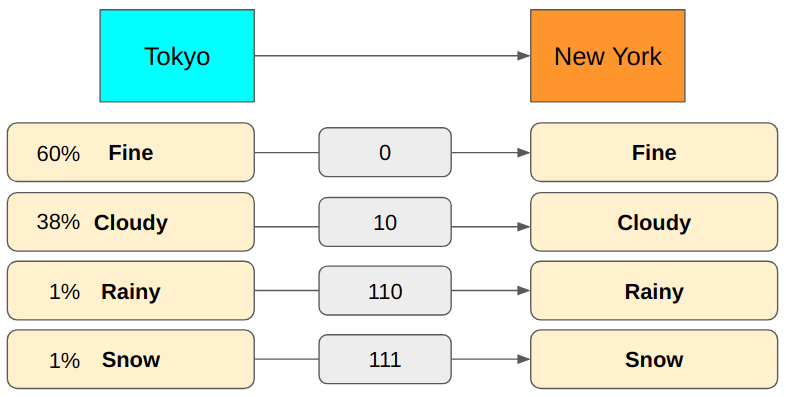

Then, we can calculate the average number of bits used to send messages from Tokyo to New York.

$$
(0.6 \times 1 \text{bit})+(0.38 \times 2 \text{bits})+(0.01 \times 3 \text{bits})+(0.01 \times 3 \text{bits}) = 1.42 \text{bits}
$$

So, with the above encoding, we use 1.42 bits on average per message. As you can see, the average number of bits depends on the probability distribution and the message encoding (how many bits we use for each message type).

For example, the average encoding size will be very different if we have more rain and snow in Tokyo.

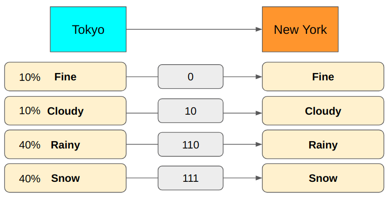

$$
(0.1 \times 1 \text{bit})+(0.1 \times 2 \text{bits})+(0.4 \times 3 \text{bits})+(0.4 \times 3 \text{bits}) = 2.7 \text{bits}
$$

We would use 2.7 bits to encode messages on average. We could reduce the average encoding size by changing the encoding to use fewer bits for `Rainy` and `Snow`.

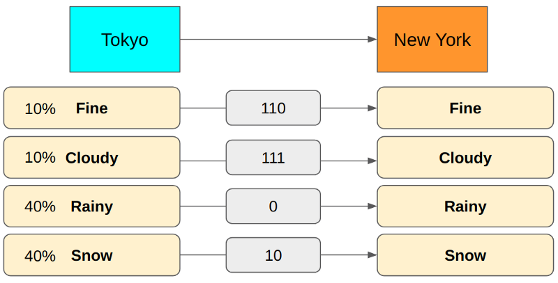

The above encoding requires 1.8 bits on average, much smaller than the previous encoding yields.

Although this encoding yields a smaller average encoding size, we lose the nice semantic meaning we had in the previous encoding scheme (i.e., the first bit for `Fine or not`, the second for, etc.). It’s ok since we are only concerned with the average encoding size and worry about neither the semantics nor the ease of decoding.

We now know how to calculate an average encoding size. But how do we know if our encoding is the best one that achieves the smallest average encoding size?

## Finding the Smallest Average Encoding&nbsp;Size

Let’s suppose we have the following probability distribution. How do we calculate the minimum lossless encoding size for each message type?

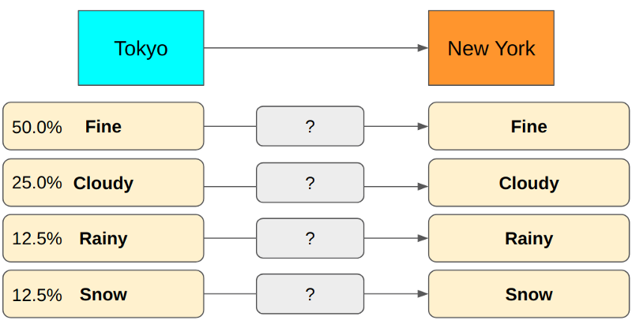

What is the minimum required encoding size for `Rainy`? How many bits should we use?

Suppose we use 1 bit to encode `Rainy` so 0 means `Rainy`. In this case, we would have to use at least 2 bits for other message types to make the whole encoding unambiguous. It is not optimal as message types like `Fine` and `Cloudy` happen more frequently. We should reserve 1-bit encoding for them to make the average encoding size smaller. Hence, we should use more than 1 bit for `Rainy` as it occurs much less frequently.

As an example shown below, the encoding is unambiguous. Still, the average size is not a theoretical minimum because we use more bits for frequent message types like `Fine` and `Cloudy`.

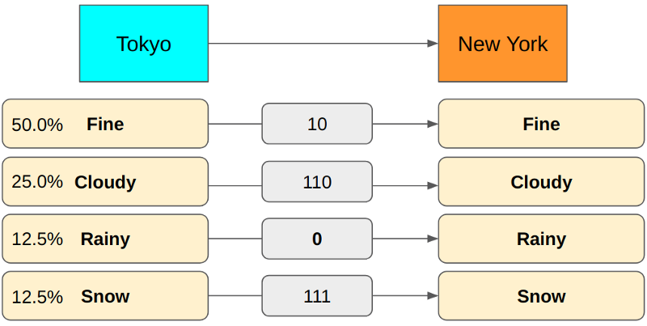

How about using 2 bits for `Rainy`? Let’s swap the encoding between `Rainy` and `Fine`.

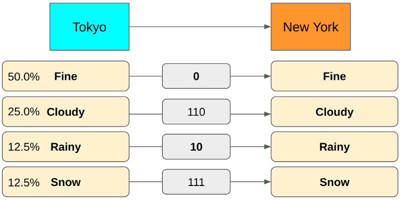

This encoding has the same problem as the previous one because we use more bits for more frequent message types (`Cloudy`).

If you use 3 bits for `Rainy`, we can achieve the minimum encoding size on average.

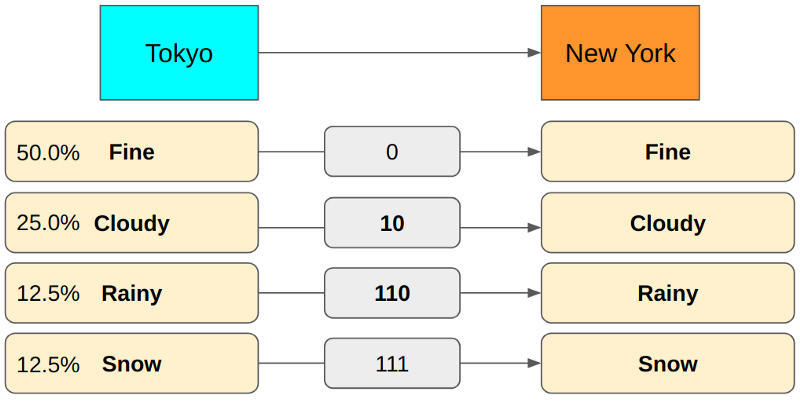

If we use 4 bits for `Rainy`, our encoding becomes redundant. So, using 3 bits is the correct encoding for `Rainy`. It’s all good. However, finding the correct encoding size involves too many trials and errors.

Given a probability distribution, is there any easy way to calculate the smallest possible average size of lossless encoding of the messages sent from the source to the destination? In other words, how do we calculate entropy?

## How to Calculate Entropy

Suppose we have eight message types, each happening with equal probability ($\frac{1}{8} = 12.5%$). What is the minimum number of bits we need to encode them without any ambiguity?

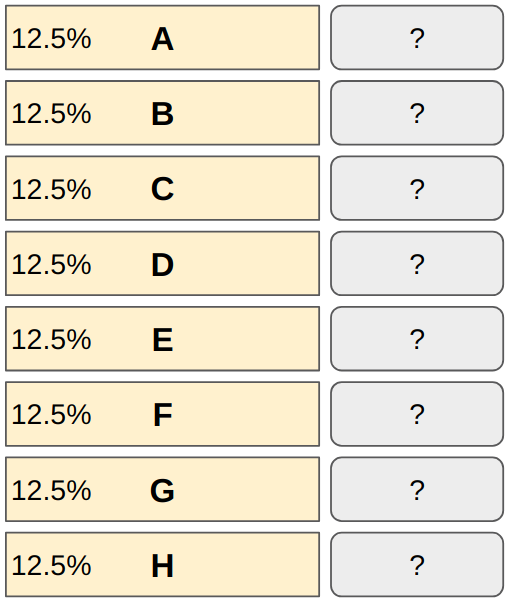

How many bits do we need to encode eight different values?

1 bit can encode 0 or 1 (2 values). Adding another bit doubles the capacity since $2 \text{ bits} = 2 \times 2 = 4$ values (00, 01, 10, and 11). So, eight different values require $3 \text{ bits} = 2 \times 2 \times 2 = 8$ (000, 001, 010, 011, 100, 101, 110 and 111).

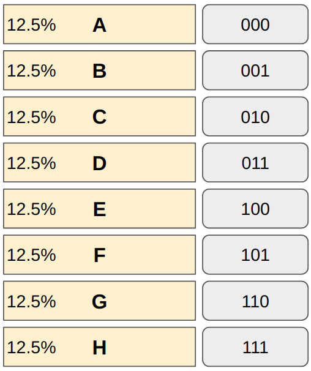

We can not reduce any bit from any of the message types. If we do, it will cause ambiguity. Also, we don’t need more than 3 bits to encode eight different values.

In general, when we need N different values expressed in bits, we need

$$
\log_2 N
$$

bits, and we don’t need more than this.

For example,

$$
\log_2 8 = \log_2 2^3 = 3 \text{ bits}
$$

In other words, if a message type happens 1 out of N times, the above formula gives the minimum size required. As $P=\frac{1}{N}$ is the probability of the message, the same thing can be expressed as:

$$
\log_2 N = -\log_2 \frac{1}{N} = -\log_2 P
$$

Let’s combine this knowledge with how we calculate the minimum average encoding size (in bits), which is entropy:

$$
\text{Entropy} = -\sum\limits_i P(i) \log_2 P(i)
$$

P(i) is the probability of i-th message type. You may need to sit back and reflect on the simplicity and beauty of this formula. There is no magic. We are merely calculating the average encoding size for each message type using the minimum encoding size.

Let’s analyze an example using the weather reporting scenario to solidify our understanding.

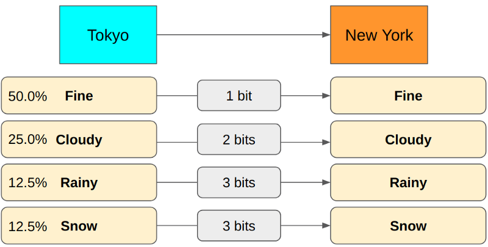

$$
\begin{aligned}
P(\text{Fine}) &= 0.5 \\
-\log_2 P(\text{Fine}) &= -\log_2 0.5 = -\log_2 1/2 = \log_2 2 = 1 \text{ bit} \\
\\
P(\text{Cloudy}) &= 0.25 \\
-\log_2 P(\text{Cloudy}) &= -\log_2 0.25 = -\log_2 1/4 = \log_2 4 = 2 \text{ bits} \\
\\
P(\text{Rainy}) &= 0.125 \\
-\log_2 P(\text{Rainy}) &= -\log_2 0.125 = -\log_2 1/8 = \log_2 8 = 3 \text{ bits} \\
\\
P(\text{Snow}) &= 0.125 \\
-\log_2 P(\text{Snow}) &= -\log_2 0.125 = -\log_2 1/8 = \log_2 8 = 3 \text{ bits}
\end{aligned}
$$

So, the entropy is:

$$
(0.5 \times 1 \text{bit})+(0.25 \times 2 \text{bits})+(0.125 \times 3 \text{bits})+(0.125 \times 3 \text{bits}) = 1.75 \text{bits}
$$

## What About Those Analogies?

There are a lot of analogies used for entropy: disorder, uncertainty, surprise, unpredictability, amount of information, and so on.

If entropy is high (encoding size is big on average), we have many message types with small probabilities. Hence, whenever a new message arrives, you’d expect a different type than previous messages. You may see it as a disorder or uncertainty, or unpredictability.

When a message type with a much smaller probability than other message types happens, it appears as a surprise because, on average, you’d expect other, more frequently sent message types.

Also, a rare message type has more information than more frequent message types because it eliminates a lot of other probabilities and tells us more specific information.

In the weather scenario, by sending `Rainy`, which happens 12.5% of the time, we reduce the uncertainty by 87.5% of the probability distribution (`Fine`, `Cloudy`, `Snow`) provided we had no information before. If we sent `Fine` (50%) instead, we would reduce the uncertainty by 50%.

If the entropy is high, the average encoding size is significant, which means each message tends to have more (specific) information. Again, this is why high entropy is associated with disorder, uncertainty, surprise, unpredictability, and amount of information.

Low entropy means that we often receive more predictable information, which means less disorder, uncertainty, surprise, predictability, and less (specific) information.

I hope these analogies are no longer confusing for you.

## References

- [The Mathematical Theory of Communication. 1963.](http://math.harvard.edu/~ctm/home/text/others/shannon/entropy/entropy.pdf) \
  Shannon, C. E.
- [Entropy (Information theory)](https://en.wikipedia.org/wiki/Entropy_(information_theory)) \
  Wikipedia
- [A Short Introduction to Entropy, Cross-Entropy and KL-Divergence](https://www.youtube.com/watch?v=ErfnhcEV1O8) \
  Aurélien Géron
