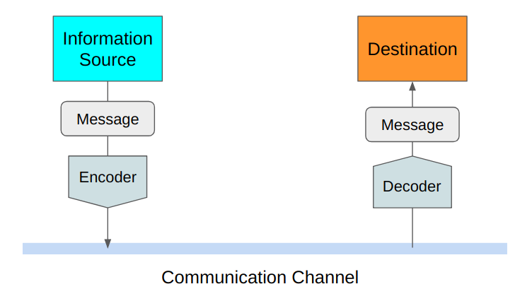
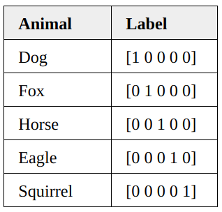

_What is it? Is there any relation to the entropy concept? Why is it used for classification loss? What about the binary cross-entropy?_

Some of us might have used cross-entropy for calculating classification losses and wondered why we use the natural logarithm. Some might have seen the binary cross-entropy and wondered whether it fundamentally differs from the cross-entropy. If so, reading this article should help to demystify those questions.

The word “cross-entropy” has “cross” and “entropy” in it, and it helps to understand the “entropy” part to understand the “cross” part.

So, let’s review the entropy formula.

## Review of Entropy&nbsp;Formula

[The previous article](/blog/2018/2018-07-24-entropy-demystified/) should help you understand the entropy concept in case you are not already familiar with it.

[Claude Shannon](https://en.wikipedia.org/wiki/Claude_Shannon) defined the entropy to calculate the minimum encoding size as he was looking for a way to efficiently send messages without losing any information.

As we will see below, there are various ways of expressing entropy.

The entropy of a probability distribution is as follows:

$$
\text{Entropy} = - \sum\limits_i P(i) \log P(i)
$$

We assume that we know the probability $P$ for each $i$. The term $i$ indicates a discrete event that could mean different things depending on the scenario you are dealing with.

For continuous variables, we can be write it using the integral form:

$$
\text{Entropy} = - \int P(x) \log P(x) dx
$$

Here, $x$ is a continuous variable, and $P(x)$ is the probability density function.

In both discrete and continuous variable cases, we are calculating the expectation (average) of the negative log probability, which is the theoretical minimum encoding size of the information from the event $x$.

So, the above formula can be re-written in the expectation form as follows:

$$
\text{Entropy} = \mathbb{E}_{x \sim P} \left[ - \log P(x) \right]
$$

$x \sim P$ means we calculate the expectation with the probability distribution $P$.

We can write the entropy using $H$ as follows:

$$
H(P) = \mathbb{E}_{x \sim P} \left[ -\log P(x) \right]
$$

People use all these notations interchangeably, and we see them used in different places when we read articles and papers that use entropy concepts.

In short, the entropy tells us the theoretical minimum average encoding size for events that follow a particular probability distribution.

As long as we know the probability distribution of anything, we can calculate its entropy.

We cannot calculate the entropy if we do not know the probability distribution. So, we would need to estimate the probability distribution.

However, what does it mean to estimate the entropy?

Also, how accurate would that be?

Answering these questions gets us to the cross-entropy concept.

## Estimating Entropy

Let’s assume we are reporting Tokyo’s weather to New York and want to encode the message into the smallest possible size. We do not know the distribution of the weather before it happens. For the sake of discussion, let’s assume we can find it out after observing the weather in Tokyo for some time.

We do not initially know the probability distribution of Tokyo’s weather, so we estimate it as $Q$ to calculate the encoding size for transmitting our weather report from Tokyo to New York.

Using the estimated probability distribution $Q$, the estimated entropy would be:

$$
\text{EstimatedEntropy} = \mathbb{E}_{x \sim Q}\left[ -\log Q(x) \right]
$$

If $Q$ is close to the real probability distribution, the above estimation tells us the smallest average encoding size.

However, there are two kinds of uncertainty involved in the estimation formula.

As indicated by $x \sim Q$, we are using the estimated probability distribution $Q$ to calculate the expectation, which would differ from the actual probability distribution $P$.

Moreover, we estimate the minimum encoding size as $-\log Q$, which we calculate based on the estimated probability distribution $Q$. Hence, it will not be 100% accurate.

The estimated probability distribution $Q$ affects the expectation and encoding size estimation. Therefore, the estimated entropy can be very wrong.

Alternatively, it can be close to the real entropy by coincidence because $Q$ affects both the expectation calculation and the encoding size estimation.

So, comparing the estimated entropy with the real entropy may not mean anything.

Like Claude Shannon, our main concern is making the encoding size as small as possible. So, we want to compare our encoding size with the theoretical minimum encoding size based on entropy.

Suppose we have the real distribution $P$ after observing the weather in Tokyo for some period. We can calculate the realized average encoding size using the probability distribution $P$ and the actual encoding size (based on $Q$) used during the weather reporting.

It is called the cross-entropy between $P$ and $Q$, which we can compare with the entropy.

$$
\begin{aligned}
\text{CrossEntropy} &= \mathbb{E}_{x \sim P} \left[ -\log Q(x) \right] \\\\
     \text{Entropy} &= \mathbb{E}_{x \sim P} \left[ -\log P(x) \right]
\end{aligned}
$$

We are comparing apple to apple as we use the same true distribution for both expectation calculations. We are comparing the theoretical minimum and actual encoding used in weather reporting.

In short, we are cross-checking the encoding size, which is what “cross” means in cross-entropy.

## Cross-entropy ≥ Entropy

Commonly, we express the cross-entropy H as follows:

$$
H(P, Q) = \mathbb{E}_{x \sim P} \left[ -\log Q(x) \right]
$$

$H(P, Q)$ means that we calculate the expectation using $P$ and the encoding size using $Q$. As such, $H(P, Q)$ and $H(Q, P)$ is not necessarily the same except when $Q=P$, in which case $H(P, Q) = H(P, P) = H(P)$ and it becomes the entropy itself.

This point is subtle but essential. For the expectation, we should use the true probability $P$ as that tells the distribution of events. For the encoding size, we should use $Q$ as that is used to encode messages.

Since the entropy is the theoretical minimum average size, the cross-entropy is higher than or equal to the entropy but not less than that.

In other words, if our estimate is perfect, $Q = P$ and, hence, $H(P, Q)=H(P)$. Otherwise, $H(P, Q) > H(P)$.

I hope the connection between hentropy and cross-entropy should be clear. Let’s talk about why we use cross-entropy for the classification loss function.

## Cross-Entropy as a Loss&nbsp;Function

Let’s say we have a dataset of animal images with five different animals. Each image has only one animal in it.

](images/animals.png)

Each image is labeled with the corresponding animal using the one-hot encoding.

We can treat one-hot encoding as a probability distribution for each image. Let’s see a few examples.

The probability distribution of the first image being a dog is 1.0 (=100%).

$$
\begin{aligned}
&P_1(\text{dog})      &= 1 \\
&P_1(\text{fox})      &= 0 \\
&P_1(\text{horse})    &= 0 \\
&P_1(\text{eagle})    &= 0 \\
&P_1(\text{squirrel}) &= 0
\end{aligned}
$$

For the second image, the label tells us that it is a fox with 100% certainty.

$$
\begin{aligned}
&P_1(\text{dog})      &= 0 \\
&P_1(\text{fox})      &= 1 \\
&P_1(\text{horse})    &= 0 \\
&P_1(\text{eagle})    &= 0 \\
&P_1(\text{squirrel}) &= 0
\end{aligned}
$$

and so on.

As such, the entropy of each image is zero.

$$
\begin{aligned}
H(P_1) &= 0 \\
H(P_2) &= 0 \\
H(P_3) &= 0 \\
H(P_4) &= 0 \\
H(P_5) &= 0
\end{aligned}
$$

In other words, one-hot encoded labels tell us what animal each image has with 100% certainty. It is not like the first image can be a dog for 90% and a cat for 10%. It is always a dog, and there will be no surprise.

Let’s say we have a machine-learning model that classifies those images. When we have not adequately trained the model, it may classify the first image (dog) as follows:

$$
Q_1 = \begin{bmatrix}
0.4 & 0.3 & 0.05 & 0.05 & 0.2
\end{bmatrix}
$$

The model says the first image is 40% for a dog, 30% for a fox, 5% for a horse, 5% for an eagle, and 20% for a squirrel. This estimation is not very precise or confident about what animal the first image has.

In contrast, the below label gives us the exact distribution of the first image’s animal class. It tells us it is a dog with 100% certainty.

$$
P_1 = \begin{bmatrix}
1 & 0 & 0 & 0 & 0
\end{bmatrix}
$$

So, how well was the model’s prediction? We can calculate the cross-entropy as follows:

$$
\begin{aligned}
H(P_1, Q_1) &= -\sum\limits_i P_1(i) \log Q_1(i) \\
& = -(1 \, \log\, 0.4 \quad + \\
&\qquad\ \ 0\, \log\, 0.3  \quad + \\
&\qquad\ \ 0\, \log\, 0.05 \ \ + \\
&\qquad\ \ 0\, \log\, 0.05 \ \ + \\
&\qquad\ \ 0\, \log\, 0.2) \\
&= - \log\, 0.4 \\
&\approx 0.916
\end{aligned}
$$

The value is higher than the zero entropy of the label, but we do not have an intuitive sense of what this value means. So, let’s see another cross-entropy value for comparison.

After the model is well-trained, it may produce the following prediction for the first image.

$$
Q_1 = \begin{bmatrix}
0.98 & 0.01 & 0 & 0 & 0.01
\end{bmatrix}
$$

As seen below, the cross-entropy is much lower than before.

$$
\begin{aligned}
H(P_1, Q_1) &= -\sum\limits_i P_1(i) \log Q_1(i) \\
& = -(1 \, \log\, 0.98 \ + \\
&\qquad\ \ 0\, \log\, 0.01 \ + \\
&\qquad\ \ 0\, \log\, 0 \quad\ \  + \\
&\qquad\ \ 0\, \log\, 0 \quad\ \ + \\
&\qquad\ \ 0\, \log\, 0.01) \\
&= - \log\, 0.98 \\
&\approx 0.02
\end{aligned}
$$

The cross-entropy compares the model’s prediction with the label, which is the true probability distribution. The cross-entropy goes down as the prediction gets more and more accurate. It becomes zero if the prediction is perfect. As such, cross-entropy can be a loss function to train a classification model.

## Notes on Nats vs.&nbsp;Bits

In machine learning, we use **base e** instead of **base 2** for multiple reasons (one of them being the ease of calculating the derivative).

The change of the logarithm base does not cause any problem since it changes the magnitude only.

$$
\log_2 x = \frac{\log_e x}{\log_e 2}
$$

For example, using the cross-entropy as a classification cost function still makes sense as we only care about reducing it by training the model better and better.

As a side note, the information unit with the **base e** logarithm is **nats**, whereas the information unit with the **base 2** logarithm is called **bits**. **1 nat** information comes from an event with 1/e probability.

$$
\begin{aligned}
1 &= -\log P \\
\therefore P &= \frac{1}{e}
\end{aligned}
$$

The __base e__ logarithms are less intuitive than the __base 2__ logarithms. The amount of information in 1 bit comes from an event with 1/2 probability. If we can encode a piece of information in 1 bit, one such message can reduce 50% uncertainty. The same analogy is not easy to make with __base e__, which is why the __base 2__ logarithm is often used to explain the information entropy concept. However, the machine learning application uses the __base e__ logarithm for implementation convenience.

## Binary Cross-Entropy

We can use binary cross-entropy for binary classification where we have yes/no answers. For example, there are only dogs or cats in the images.

For the binary classifications, the cross-entropy formula contains only two probabilities:

$$
\begin{aligned}
H(P, Q) &= -\sum\limits_{i=(\text{cat,dog})} P(i) \log Q(i) \\\\
&= -P(\text{cat}) \log Q(\text{cat}) - P(\text{cat}) \log Q(\text{dog})
\end{aligned}
$$

Using the following relationship:

$$
P(\text{dog}) = 1 - P(\text{cat})
$$

, we can write the cross-entropy as follows:

$$
H(P, Q) = -P(\text{cat}) \log Q(\text{cat}) - (1 - P(\text{cat})) \log(1 - Q(\text{cat}))
$$

We can further simplify it by changing the symbols slightly:

$$
\begin{aligned}
P &= P(\text{cat}) \\
\hat{P} &= Q(\text{cat})
\end{aligned}
$$

Then, the binary cross-entropy formula becomes:

$$
\text{BinaryCrossEntropy} = -P \log \hat{P} - (1 - P) \log(1 - \hat{P})
$$

, which may look more familiar to some of us.

In short, the binary cross-entropy is a cross-entropy with two classes. Other than that, they are the same concept.

Now that we know the concepts well, the entropy of the cross-entropy concept should be zero for all of us.

## References

- [Information Entropy](https://en.wikipedia.org/wiki/Entropy_(information_theory)) \
  Wikipedia
- [Cross-entropy](https://en.wikipedia.org/wiki/Cross_entropy) \
  Wikipedia
- [A Short Introduction to Entropy, Cross-Entropy, and KL-Divergence](https://www.youtube.com/watch?v=ErfnhcEV1O8) \
  Aurélien Géron
