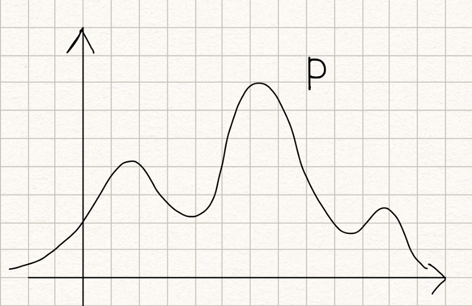
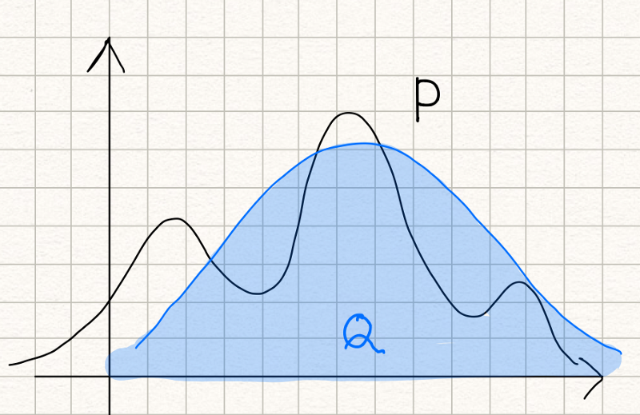
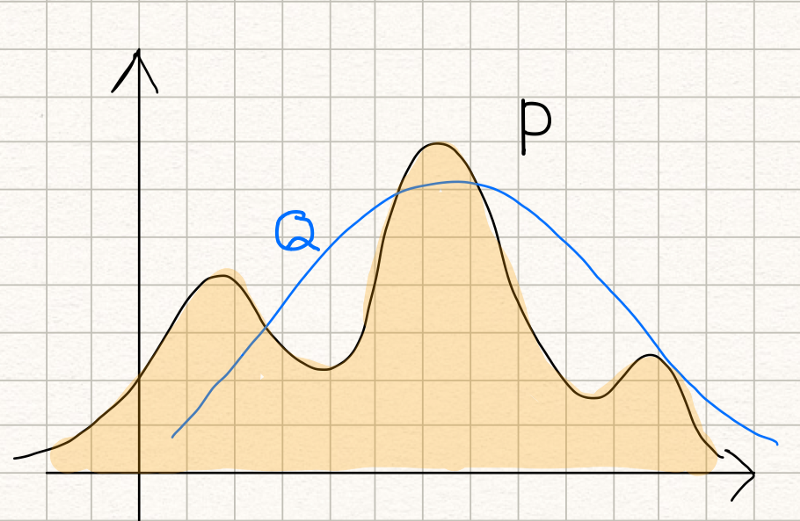

_What does KL stand for? Is it a distance measure? What does it mean to measure the similarity of two probability distributions?_

If you want to intuitively understand the KL divergence, you are in the right place. I’ll demystify it for you.

As I will explain from the information theory point of view, knowing the entropy and the cross-entropy concepts is required to apprehend this article thoroughly. If you are not familiar with them, you may want to read the following two articles: one for the [entropy](/blog/2018/2018-07-24-entropy-demystified/) and the other for the [cross-entropy](/blog/2018/2018-10-28-cross-entropy-demystified/).

If you are ready, read on.

## What does KL stand&nbsp;for?

KL in the KL divergence stands for __Kullback-Leibler__, which represents the following two people:

)](images/Solomon_Kullback.png)

)](images/Richard_Leibler.png)

They introduced the concept of the KL divergence in 1951 ([Wikipedia](https://en.wikipedia.org/wiki/Kullback%E2%80%93Leibler_divergence)).

## What is the KL divergence?

The KL divergence tells us how well the probability distribution $Q$ approximates the probability distribution $P$ by calculating the cross-entropy minus the entropy.

$$
D_{KL}(P \| Q) = H(P, Q) - H(P)
$$

As a reminder, I put the cross-entropy and the entropy formula below:

$$
\begin{aligned}
H(P, Q) &= \mathbb{E}_{x \sim P}[ -\log Q(x)] \\
   H(P) &= \mathbb{E}_{x \sim P}[ -\log P(x)] \\
\end{aligned}
$$

The KL divergence can also be expressed in the expectation form as follows:

$$
\begin{aligned}
D_{KL}(P \| Q) &= \mathbb{E}_{x \sim P}[ -\log Q(x)] - \mathbb{E}_{x \sim P}[ -\log P(x)] \\\\
&= \mathbb{E}_{x \sim P}[ -\log Q(x) - (-\log P(x)) ] \\\\
&= \mathbb{E}_{x \sim P}[ -\log Q(x) + \log P(x) ] \\\\
&= \mathbb{E}_{x \sim P}[ \log P(x) -\log Q(x) ] \\\\
&= \mathbb{E}_{x \sim P}\left[ \log \frac{P(x)}{Q(x)} \right]
\end{aligned}
$$

The expectation formula can be expressed in the discrete summation form or the continuous integration form:

$$
\begin{aligned}
D_{KL}(P \| Q) &= \sum\limits_i P(i) \log \frac{P(i)}{Q(i)} \\\\
D_{KL}(P \| Q) &= \int P(x) \log \frac{P(x)}{Q(x)} dx
\end{aligned}
$$

So, what does it measure? It measures the similarity (or dissimilarity) between two probability distributions.

If so, is it a distance measure?

To answer this question, let’s see a few more characteristics of the KL divergence.

## The KL divergence is non-negative

The KL divergence is non-negative. An intuitive proof is that:

- If $P = Q$, the KL divergence is zero as: $\log \frac{P}{Q} = \log 1 = 0$
- If $P \ne Q$, the KL divergence is positive because the entropy is the minimum average lossless encoding size.

So, the KL divergence is a non-negative value that indicates how close two probability distributions are.

It does sound like a distance measure, doesn’t it? But it is not.

## The KL divergence is asymmetric

The KL divergence is not symmetric:

$$
D_{KL}(P \| Q) \ne D_{KL}(Q \| P)
$$

We can deduce the above from the fact that the cross-entropy is asymmetric. The cross-entropy $H(P, Q)$ uses the probability distribution $P$ to calculate the expectation. The cross-entropy $H(Q, P)$ uses the probability distribution $Q$ to calculate the expectation.

So, it cannot be a distance measure, as any distance measure should be symmetric.

This asymmetric nature of the KL divergence is a crucial aspect. Let’s look at two examples to understand it intuitively.

Suppose we have a probability distribution $P$ which looks like the below:

Now, we want to approximate it with a normal distribution $Q$ as below:

The KL divergence measures inefficiency in using the probability distribution $Q$ to approximate the true probability distribution $P$.

$$
D_{KL}(P \| Q) = \mathbb{E}_{x \sim P} \left[ \log \frac{P(x)}{Q(x)} \right]
$$

If we swap _P_ and _Q_, it means that we use the probability distribution _P_ to approximate the normal distribution _Q_, and it’d look like the below:

$$
D_{KL}(Q \| P) = \mathbb{E}_{x \sim Q} \left[ \log \frac{Q(x)}{P(x)} \right]
$$

Both cases measure the similarity between $P$ and $Q$, but the result could be entirely different, and both are valid.

## Modeling a true distribution

By approximating a probability distribution with a well-known distribution like the normal distribution, binomial distribution, etc., we are modeling the true distribution with a known one.

This is when we are using the below formula:

$$
D_{KL}(P \| Q) = \mathbb{E}_{x \sim P} \left[ \log \frac{P(x)}{Q(x)} \right]
$$

Calculating the KL divergence, we can find the model (the distribution and the parameters) that fits the true distribution well.

## Variational Auto-encoder

An example of using the below formula is the variational auto-encoder.

$$
D_{KL}(Q \| P) = \mathbb{E}_{x \sim Q} \left[ \log \frac{Q(x)}{P(x)} \right]
$$

I will lightly touch on this topic here as it requires much more explanation for people unfamiliar with the variational auto-encoder.

The KL divergence is used to force the distribution of latent variables to be normal so that we can sample latent variables from the normal distribution. As such, it is included in the loss function to improve the similarity between the distribution of latent variables and the normal distribution.

I've written an article on VAE in details [here](/blog/2023/2023-08-23-vae-2013/).

## A Few Mathy&nbsp;Points

The term $p \log p$ becomes zero when $p$ goes to zero.

$$
\lim\limits_{p \rightarrow 0} p \log p = 0
$$

It is defined as infinity where $P > 0$ but $Q=0$.

$$
D_{KL}(P \| Q) = \infty \quad (\text{where } P > 0 \text{ but } Q = 0)
$$

A more rigor proof of the KL divergence being non-negative is as follows:

$$
\begin{aligned}
D_{KL}(P \| Q) &= \mathbb{E}_{x \sim P}\left[ \log \frac{P(x)}{Q(x)} \right] \\
&= \mathbb{E}_{x \sim P}\left[ -\log \frac{Q(x)}{P(x)} \right]
\end{aligned}
$$

Since $-\log$ is a convex function, we can apply Jensen’s inequality:

$$
\begin{aligned}
D_{KL}(P \| Q) &\ge -\log \left(\mathbb{E}_{x \sim P}\left[ \frac{Q(x)}{P(x)} \right] \right) \\
&= -\log \left( \int P(x) \frac{Q(x)}{P(x)} dx \right) \\
&= -\log \left( \int Q(x) dx \right) \\
&= -\log(1) \\
&= 0
\end{aligned}
$$

## Likelihood Ratio

Another way to describe the KL divergence from a probabilistic perspective is to use the following likelihood ratio.

$$
\frac{P(x)}{Q(x)}
$$

If you are interested in this approach, I recommend the article by Marko Cotra (the link in the references section below).

---

That is all for now. I hope this article is helpful to you.

## References

- [VAE: Variational Auto-Encoder (2013)](/blog/2023/2023-08-23-vae-2013/)
- [Cross-Entropy Demystified](/blog/2018/2018-10-28-cross-entropy-demystified/)
- [Entropy Demystified](/blog/2018/2018-07-24-entropy-demystified/)
- [Kullback Leibler divergence](https://en.wikipedia.org/wiki/Kullback%E2%80%93Leibler_divergence) \
  Wikipedia
- [CS412 Fall 2008. Introduction to Data Warehousing and Data Mining](http://hanj.cs.illinois.edu/cs412/bk3/KL-divergence.pdf) \
  Jiawei Han
- [ECE 830 Fall 2011 Statistical Signal Processing](http://nowak.ece.wisc.edu/ece830/ece830_fall11_lecture7.pdf) \
  Robert Nowak
- [Making sense of the Kullback–Leibler (KL) Divergence](https://medium.com/@cotra.marko/making-sense-of-the-kullback-leibler-kl-divergence-b0d57ee10e0a) \
  Marko Cotra
- [A Short Introduction to Entropy, Cross-Entropy, and KL-Divergence](https://www.youtube.com/watch?v=ErfnhcEV1O8) \
  Aurélien Géron
