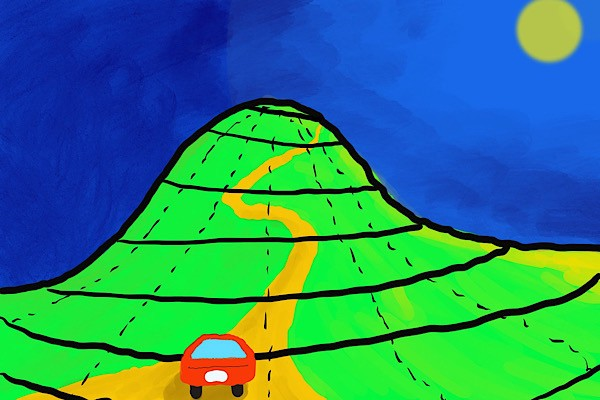
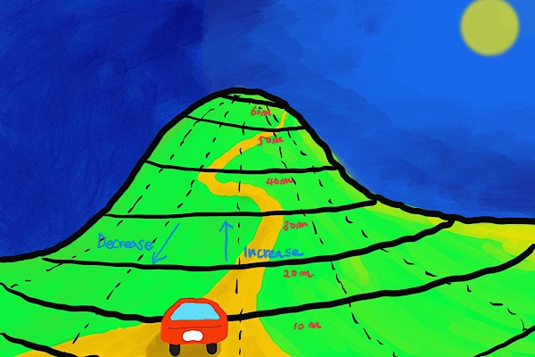
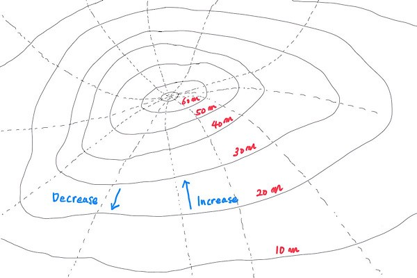
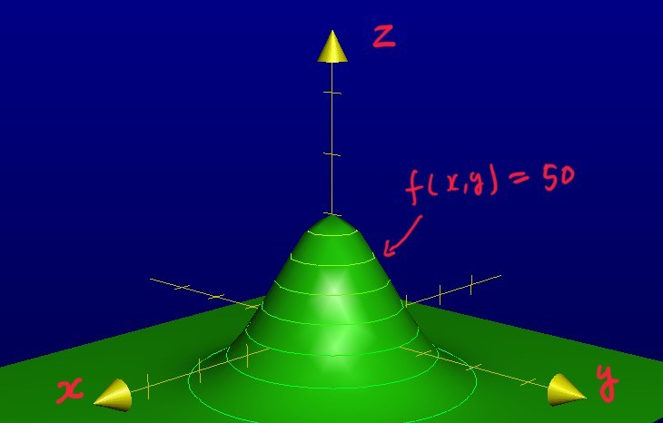
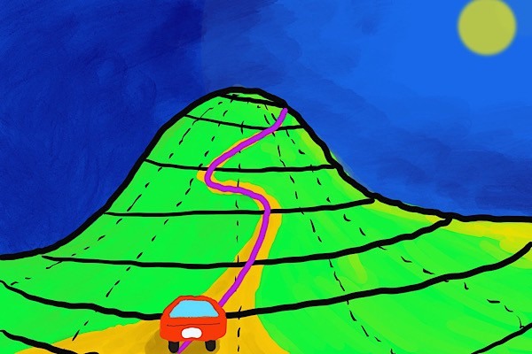
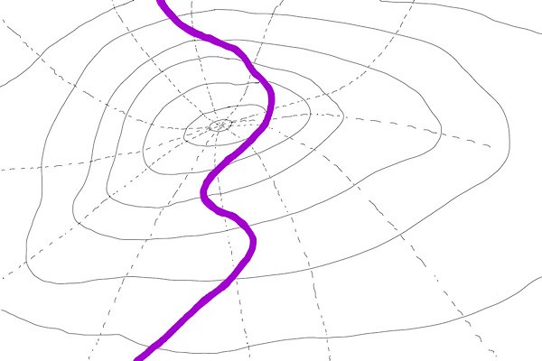
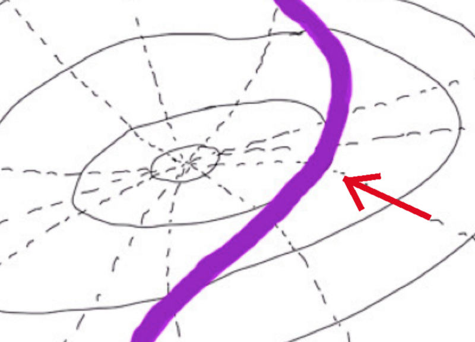
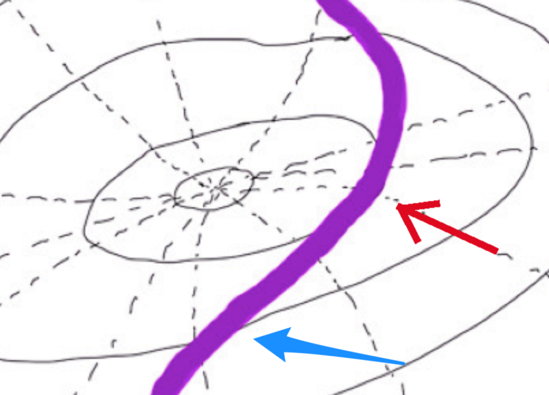

## Introduction

Have you ever wondered what constrained optimization problems are?

Often, the word __constrained optimization__ is used as everyone knows what it is.

But it may not be so apparent for people who have not been exposed to such terminology before.

If you like to understand constrained optimization and how to approach such problems, you are in the right place.

I’ll demystify it for you.

## What is a constrained optimization problem?

Suppose you are driving a car on a mountain road. You want to climb as high as possible to view the moon better. But you don’t want to go off-road and cannot fly to the moon.

So, we aim for the highest position while satisfying the constraint that the car must be on the road.

First and foremost, this is an optimization problem.

An optimization problem can be either maximization or minimization, depending on how we formulate the problem.

Since we are maximizing the car's height (altitude) position, our problem can be called an optimization problem.

Next, the problem has a constraint that we must satisfy.

In this example problem, the car must be on the road, which is a constraint (a condition we must satisfy).

We are optimizing (maximizing) the height position of the car with the constraint that the car must be on the road.

As such, this is an example of a constrained optimization problem.

But how do we tackle such problems?

## Contour lines — equal height locations

Where is the highest position on the road?

To estimate the answer, let’s draw contour lines to see where the highest road position might be.

The thick black horizontal lines in the picture indicate equal height locations called contour lines.

There is a constant height difference between the neighboring contour lines for ease of viewing.

To make it clear, let’s draw heights (meters) in red:

The dotted vertical lines indicate the direction the height increases or decreases.

The blue arrows show the direction of the height changes:

In 2D, it would look like the following.

## Contour line equation

Now that we know what contour lines look like, let’s mathematically define them.

Let $f(x, y)$ be a function that returns the height in meters for a given location $(x, y)$.

$$
f(x, y) \rightarrow \text{height } (m) \text{ of the location } (x, y)
$$

The height of a contour line is constant. For example, a contour line with 50 meters in height satisfies the following equation.

$$
f(x, y) = 50
$$

When mathematically defined, there can be infinite numbers of contours. For example, a contour can be for $f(x, y) = 10.15$m.

In general, $f(x, y) = H$ where $H$ is the height position of the contour.

As such, there is no rule that a constant height difference must separate the nearest contours. It was easier to see in the picture by separating neighboring contours by the constant height difference.

As our objective is to find the highest contour on the road, we need to define what it means to be on the road mathematically.

## The constraint — the car must be on the road

Let us also draw a road line, which tells us where we can be.

In 2D bird view, it looks like the below. The road is missing the highest peak of the mountain.

For simplicity, we assume that the car is a point $(x, y)$ on the 2D map and the road is a smooth line.

As such, the constraint can be defined "the distance from the car position (x, y) to the road line must be zero".

Let’s express the constraint with a function that returns the distance from the road to a position $(x, y)$.

$$
g(x, y) = \text{the distance from } (x, y) \text{ to the road}
$$

Now, we can express the constraint as follows:

$$
g(x, y) = 0
$$

More generally, we can express a constraint as a function that returns a constant $C$ (in the above example, $C = 0$).

$$
g(x, y) = C
$$

However, we can always rewrite it by moving the constant to the left-hand side of the equation.

$$
g(x, y) - C = 0
$$

Therefore, using $g(x, y) = 0$ won’t lose any generality in the solution.

## The constrained optimization in math

Our constrained optimization problem is to maximize the function $f(x, y)$, while satisfying the constraint $g(x, y) = 0$.

$$
\text{maximize } f(x, y) \text{ subject to } g(x, y) = 0
$$

In some other scenarios, an optimization could be a minimization problem.

$$
\text{minimize } f(x, y) \text{ subject to } g(x, y) = 0
$$

The word `extremum` means either maximum or minimum.

Therefore, constrained optimization is to find an extremum of a function while satisfying one or more constraints.

I hope that the meaning of constrained optimization is clear to you now.

Lastly, let’s get some intuition on how to solve the constrained optimization problem.

## Intuition on how to solve the constrained optimization problem

Intuitively, we know that the maximum height while on the road is given at the position indicated by the red arrow in the diagram below.

{width="60%"}

For a position $(x, y)$ to be a candidate for an extremum, the road and contour lines must be parallel at that point.

If they are not in parallel, $f(x, y)$ can still increase or decrease along the road, meaning we are not yet at an extremum.

For example, the point indicated by the blue arrow is a case where the road and the contour are not parallel.

{width="60%"}

So, finding such a position $(x, y)$ where the road and contour lines are parallel is required.

To solve this mathematically, we need the concept of the Lagrange multiplier.

If interested, please read [this article](/blog/2020-10-04-lagrange-multiplier-demystified/) on the Lagrange multiplier.

## References

- [Lagrange Multiplier Demystified](/blog/2020-10-04-lagrange-multiplier-demystified/)
- [Constrained optimization introduction](https://www.khanacademy.org/math/multivariable-calculus/applications-of-multivariable-derivatives/lagrange-multipliers-and-constrained-optimization/v/constrained-optimization-introduction) \
  Khan Academy
