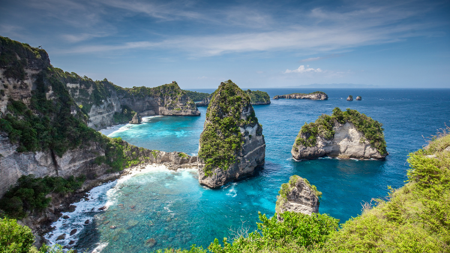

## Understanding why it works

Have you ever wondered why we use the Lagrange multiplier to solve constrained optimization problems?

Is it just a clever technique?

Since it is straightforward to use, we learn it like basic arithmetic by practicing it until we can do it by heart.

But have you ever wondered why it works? Does it always work? If not, why not?

If you want to know the answers to these questions, you are in the right place.

I’ll demystify it for you.

## An example constrained optimization problem

If you are unfamiliar with constrained optimizations, I have written [an article](/blog/2020-10-04-constrained-optimization-demystified/) that explains them. Otherwise, please read on.

Suppose we have a mountain that looks like the one below:

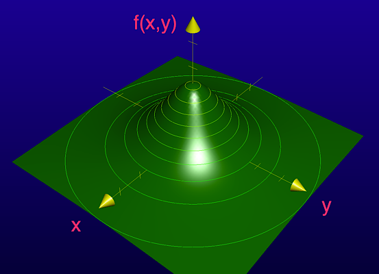

The height of a location (x, y) is given as follows (in kilometers):

$$
f(x, y) = \frac{10}{x^2 + y^2 + 3}
$$

Further, suppose the mountain has an eruption:

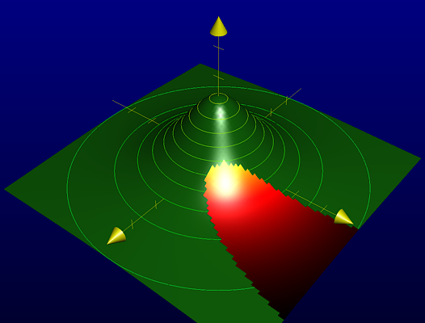

From the top, it looks like the one below:

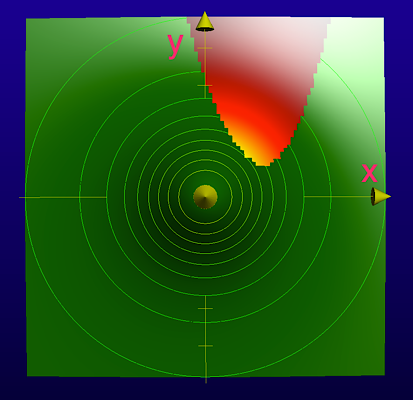

The eruption area is given as follows:

$$
y \ge x^2 - 3x + 3
$$

That means the edge of the eruption is given as follows:

$$
y = x^2 - 3x + 3
$$

So, the edge looks like this.

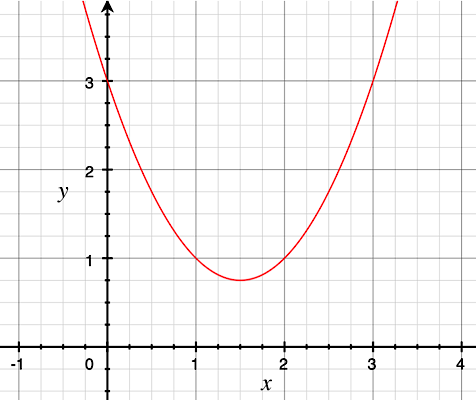

Suppose we want to know the highest position of the eruption on this mountain.

That means the highest position must be on the edge line of the eruption, which we can express as follows:

$$
g(x, y) = y - x^2 + 3x - 3 = 0
$$

Any location $(x, y)$ that satisfies $g(x, y)=0$ is on the edge of the eruption.

Therefore, the constrained optimization problem is to find the maximum $f(x, y)$ satisfying $g(x, y) = 0$.

## Intuition on how to solve the constrained optimization problem

Intuitively, we know that the maximum height of the eruption is around where the blue arrow indicates.

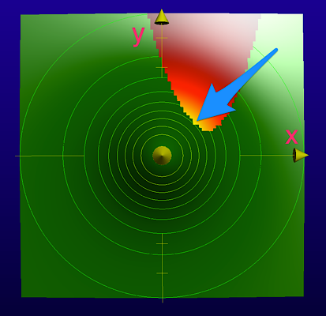

We are looking for the highest contour line that touches the edge of the eruption.

Let’s define the contour line equation:

$$
f(x, y) = H
$$

$H$ is a constant value indicating the height of the contour.

For a given value of $H$, a set of $(x, y)$ values satisfies $f(x, y) = H$.

The gradient of $f(x, y)$ indicates the direction where the height increases perpendicular to the contour line.

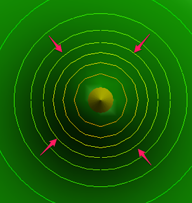

The gradient is a vector of partial derivatives.

$$
\text{grad } f(x, y) = \left( \frac{\partial f}{\partial x}, \frac{\partial f}{\partial y} \right)
$$

Similarly, the gradient of $g(x, y)$ is perpendicular to the edge of the eruption area.

$$
\text{grad } g(x, y) = \left( \frac{\partial g}{\partial x}, \frac{\partial g}{\partial y} \right)
$$

The highest contour line that touches the edge of the eruption must have the gradient of $f(x, y)$ in parallel to the gradient of $g(x, y)$.

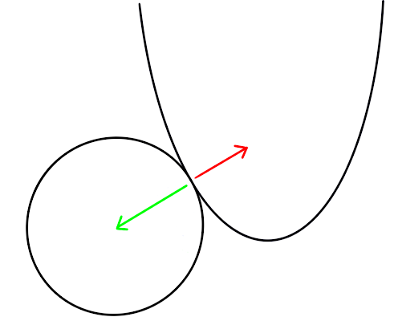

If the gradient of the contour line is not parallel with the gradient of the eruption edge, some eruption areas will be higher than the contour line.

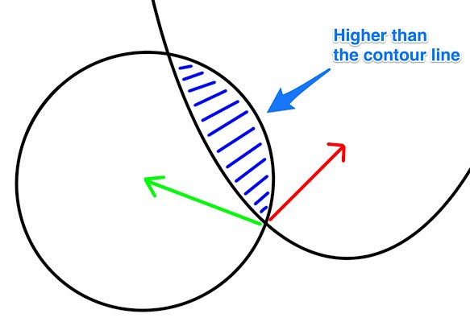

So, we need to find such a point $(x, y)$ where the gradient of $f(x, y)$ is in parallel to the gradient of $g(x, y)$.

## The Lagrange multiplier and the Lagrangian

Let’s put our objective into a mathematical formula.

The gradient of $f(x, y)$ and the gradient of $g(x, y)$ should be in parallel, but they may have different sizes and directions.

$$
\text{grad } f(x, y) = \lambda \, \text{grad } g(x, y)
$$

This $\lambda$ is called the Lagrange multiplier after the name of the mathematician who introduced the Lagrangian mechanics in 1788.

](images/Lagrange.jpeg)

At this stage, we don’t know the value of $\lambda$, which could be anything like 2.5, -1, or else. It just signifies the fact that the two gradients must be in parallel.

We can rearrange the equation as follows:

$$
\text{grad } { f(x, y) - \lambda \, g(x, y) } = 0
$$

The zero here means the vector with zeros: $(0,0)$.

And we call the inside of the curly brackets the Lagrangian $L$.

$$
L = f(x, y) - \lambda \, g(x, y)
$$

So, we are saying that the following is the required condition.

$$
\text{grad } L = 0
$$

The gradient of the Lagrangian gives us two equations.

$$
\begin{aligned}
\frac{\partial f}{\partial x} - \lambda \, \frac{\partial g}{\partial x} &= 0 \\\\
\frac{\partial f}{\partial y} - \lambda \, \frac{\partial g}{\partial y} &= 0 
\end{aligned}
$$

But we have three unknowns $x$, $y$, and $\lambda$. How can we solve these equations?

Actually, we have one more equation: $g(x, y) = 0$.

So, we can solve the three equations to find the highest location $(x, y)$ that satisfies the constraint.

The problem now becomes an arithmetic exercise.

The answer is $f(x, y) = 2$ where $x = 1$ and $y = 1$.

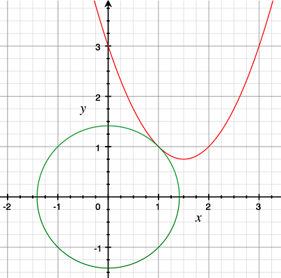

You can verify the values with the equations.

Also, $\lambda = -4/5$, which means these gradients are in the opposite directions as expected.

All in all, the Lagrange multiplier helps solve constraint optimization problems.

We find the point $(x, y)$, where the gradient of the function we are optimizing and the gradient of the constraint function are in parallel using the multiplier $\lambda$.

In summary, we followed the steps below:

- Identify the function to optimize (maximize or minimize): $f(x, y)$
- Identify the function for the constraint: $g(x, y) = 0$
- Define the Lagrangian $L = f(x, y) - \lambda \, g(x, y)$
- Solve $\text{grad } L = 0$ satisfying the constraint

It’s as mechanical as the above, and you now know why it works.

But there are a few more things to mention.

## When it does not work

I made a few assumptions while explaining the Lagrange multiplier.

First of all, I assumed all functions have gradients (the first derivatives), which means the functions $f(x, y)$ and $g(x, y)$ are continuous and smooth.

Second, I also assume that $f(x, y)$ has the second derivative to check whether the solution $(x, y)$ is the maximum.

These two assumptions are valid in this example, but in real problems, you should check that to use the Lagrange multiplier to solve your constraint optimization problem.

Third, I simplified the question so that we only need to deal with one maximum.

In other words, the shape of the mountain is defined such that there is only one solution to the constrained optimization problem.

In real-life problems, the mountain could have more complicated shapes with multiple peaks and valleys.

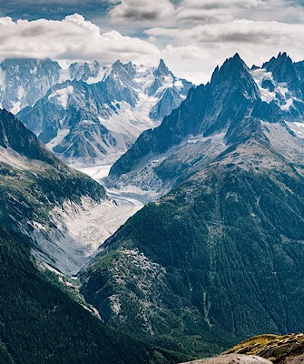

In such a case, we’d need to deal with the global optimization problem (i.e., multiple local maxima).

Instead, the example in this article only deals with one local maximum (the global maximum).

I hope that your understanding of the Lagrange multiplier is optimal now.

## References

- [Maxima, minima, and saddle points](https://www.khanacademy.org/math/multivariable-calculus/applications-of-multivariable-derivatives/optimizing-multivariable-functions/a/maximums-minimums-and-saddle-points) \
  Khan Academy
- [Joseph-Louis Lagrange](https://en.wikipedia.org/wiki/Joseph-Louis_Lagrange) \
  Wikipedia
- [On the Genesis of the Lagrange Multipliers](http://abel.math.harvard.edu/~knill/teaching/summer2014/exhibits/lagrange/genesis_lagrangemultpliers.pdf) \
  P. Bussotti
- [A Simple Explanation of Why Lagrange Multipliers Works](https://medium.com/@andrew.chamberlain/a-simple-explanation-of-why-lagrange-multipliers-works-253e2cdcbf74) \
  Andrew Chamberlain
