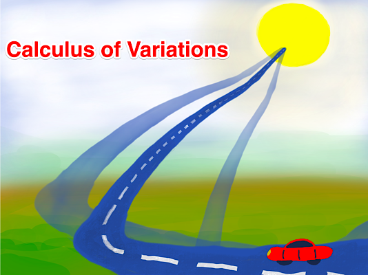
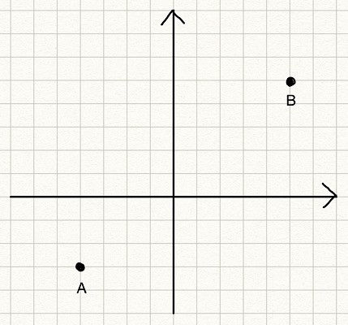
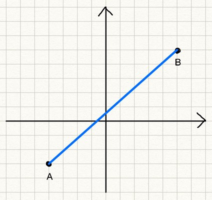
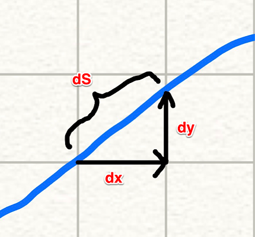
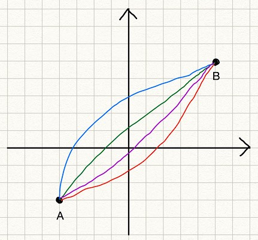
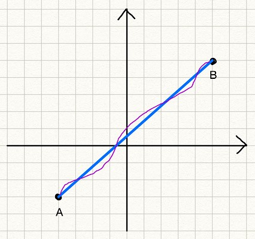

## How to Derive the Euler-Lagrange Equation

We use the calculus of variations to optimize __functionals__.

You read it right: functionals, not functions.

But what are functionals? What does a functional look like?

Moreover, there is a thing called the __Euler-Lagrange equation__.

What is it? How is it useful?

How do we derive such an equation?

You are in the right place if you have any of the above questions.

I’ll demystify it for you.

## The Shortest Path Problem

Suppose we want to find the shortest path from point $A$ to point $B$.

If there is no obstacle, the answer should be a straight line from $A$ to $B$.

But for now, let’s forget that we know the answer.

Instead, let’s frame the problem into an optimization problem and mathematically show that the straight line is the answer.

Doing so lets us understand what functionals and variations are and how to derive the Euler-Lagrange equation to solve the optimization problem.

---

Before finding the shortest path, we need to be able to calculate the length of a path from $A$ to $B$.

As the famous Chinese proverb says, “A journey of a thousand miles begins with a single step”.

So, let’s calculate the length of a small passage and integrate it from $A$ to $B$.

As shown in the above diagram, a small passage can be approximated by a straight line.

$$
dS = \sqrt{dx^2 + dy^2}
$$

So, the total length of a path can be calculated by the following integration:

$$
\begin{aligned}
S &= \int_A^B dS \\  
&= \int_A^B \sqrt{dx^2 + dy^2}   
\end{aligned}
$$

Since $A$ and $B$ are fixed points, let’s define them as $A = (x_1, y_1)$ and $B = (x_2, y_2)$.

$$
\begin{aligned}  
S &= \int_A^B \sqrt{dx^2 + dy^2} \\
&= \int_{(x_1, y_1)}^{(x_2, y_2)} \sqrt{dx^2 + dy^2} \\
&= \int_{x_1}^{x_2} \sqrt{1 + \left( \frac{dy}{dx} \right)^2} dx  
\end{aligned}
$$

In the last step, $y_1$ and $y_2$ are dropped as they are determined by $x_1$ and $x_2$.

So, we are integrating the square root from $x_1$ until $x_2$.

Now we know how to calculate the length of a path from $A$ to $B$.

We will find the $y = f(x)$ that minimizes the path length $S$.

## What is a functional?

We know that the $y = f(x)$ is a straight line between $A$ and $B$, but let’s still forget that for now.

Instead, we consider many potential solution lines from $A$ to $B$.

The blue line is $y = \text{blue\_line}(x)$. The red line is $y = \text{red\_line}(x)$. And so on.

But having a function name for each line is too tedious, so we call them collectively $y = y(x)$. We think of $y = y(x)$ as any line between $A$ and $B$, which could be the blue or red lines (or else). We can calculate the length of any line (given a particular $y(x)$) using the formula $S$.

In other words, $S$ takes an instance of $y(x)$ and returns the length of the line. So, $S$ maps a function $y(x)$ to a value. We call $S$ a __functional__, which is a function of functions. A functional is written with square brackets like $S[y]$, which means the functional $S$ takes a function $y$ and returns a value.

If we talk about functions of functions like this general, there could be too many kinds of functionals, many of which may not be that useful. Since functional optimization originates from Physics, which deals with positions and velocities, the following general form is very common, and they have many applications (not only in Physics but also in machine learning).

$$
J[y] = \int_{x_1}^{x_2} L(x, y(x), y'(x))dx
$$

$J[y]$ is a functional that takes a function $y$. 

- $J$ integrates $L$ from $x_1$ until $x_2$. 
- $L$ is a function of $x$, $y$, and $y'$. 
- $y'$ is the derivative of $y$ in terms of $x$. $y' = \frac{dy}{dx}$

The above may look too abstract. Let’s apply it to our shortest path problem. For the shortest path problem, $L$ is defined as follows:

$$
L(x, y(x), y'(x)) = \sqrt{1 + \left( \frac{dy}{dx} \right)^2}
$$

We integrate $L$ between $x_1$ and $x_2$ to get the path length.

$$
S[y] = \int_{x_1}^{x_2} L(x, y, y') \, dx = \int_{x_1}^{x_2} \sqrt{ 1 + \left(\frac{dy}{dx}\right)^2 } \, dx
$$

In the shortest path problem, $L$ does not include $x$ and $y$ but only $y'$.

That is ok.

The point is that if we can solve the optimization problem for the general form of functionals, we can solve many problems, including the shortest path problem.

## Functional variations

Before attempting to solve the general form of functionals, let’s think about how to solve the shortest path problem. How about we generate many random functions and evaluate the path length to find the shortest path?

We can map each path to a path length value using the functional $S$. The question is how to know whether we find the shortest path. 

We can take an alternative approach since we know the shortest path exists. We start with the shortest path and slightly modify it to see what kind of condition is required for the shortest path.

Let’s call the shortest path function $f(x)$ that minimizes $S$. Here, we write $f(x)$ instead of $y(x)$. The function $f(x)$ is the solution function to our problem, and $y(x)$ is a candidate function that may or may not solve our problem, like the blue and red lines. When we give $y(x)$ or $f(x)$ to $S$, we write like $S[y]$ and $S[f]$ respectively.

- $S[y]$ gives the path length following $y(x)$ from $A$ to $B$.
- $S[f]$ gives the path length following $f(x)$ from $A$ to $B$ which is the shortest path length.

If we add an arbitrary function $\eta(x)$ (eta of x) to $f(x)$, the following relationship is asserted:

$$
S[f] \le S[f + \epsilon \eta]
$$

The term $\epsilon \eta$ is called a __variation__ of the function $f$, which is denoted as follows:

$$
\delta f = \epsilon \eta
$$

$\epsilon$ (epsilon) is a small number, so the variation is also small. We analyze how the functional changes when we move $\epsilon$ towards zero. 

Let’s apply a variation to the shortest path to make it more concrete. In the below diagram, 

- The blue straight line is the shortest path $y = f(x)$. 
- The purple line is an example of a variation $\epsilon\eta$ added to $f$.

$$
y = f(x) + \epsilon \eta(x)
$$

$S[f + \epsilon\eta]$ gives the length of the path given by the function $f + \epsilon\eta$. Since $S[f]$ is the shortest path length, the relationship $S[f] \le S[f + \epsilon\eta]$ is true for any variation. When $\epsilon$ goes to zero, the purple line becomes the same as the blue line as the variation vanishes.

Also, note that $\eta(x)$ must be zero at the point $A$ and $B$ since any variation must include the point $A$ and $B$. (Remember we are looking for the shortest line from $A$ to $B$). So, $\eta(x_1) = 0$ and $\eta(x_2) = 0$.

Why do we think about the variation?

The reason is that the variation makes the __functional__ optimization into a __function__ optimization, which we know how to solve.

If we look at $S[f + \epsilon\eta]$ very closely, we can see that it depends only on $\epsilon$.

- $f(x)$ is the function that gives the minimum path line, which is fixed.
- $\eta(x)$ is an arbitrary function that is fixed for a particular variation.

Therefore, the only variable in $S[f + \epsilon\eta]$ is $\epsilon$. In other words, $S[f + \epsilon\eta]$ is a function of $\epsilon$. So, let’s write it as $S(\epsilon)$.

$$
S[f + \delta f] = S[f + \epsilon \eta] = S(\epsilon)
$$

$S(\epsilon)$ is the function of $\epsilon$ that returns the path length for the function $y$ that is the solution function $f$ plus a variation $\epsilon\eta$. We just need to solve the minimization problem for the function $S(\epsilon)$. Conveniently, we also know that $S$ becomes the minimum when $\epsilon$ goes to zero.

So, the derivative of $S$ with $\epsilon$ should be zero when $\epsilon = 0$.

$$
S'(0) = \frac{dS}{d\epsilon}\Bigg\vert_{\epsilon = 0} = 0
$$

Here, the apostrophe ($'$) is for the derivative of $S$ by $\epsilon$.

In case it’s not clear, an apostrophe is used when we calculate the derivative of a function by the only independent variable. Since $\epsilon$ is the only independent variable of $S$ in this context, the apostrophe here means the derivative of $S$ by $\epsilon$.

Let’s go back to the general form to reiterate all the points we’ve discussed so far and derive the Euler-Lagrange equation to solve the optimization problem.

## The Euler-Lagrange equation

The general form of functionals we are dealing with is as follows:

$$
J[y] = \int_{x_1}^{x_2} L(x, y(x), y'(x)) dx
$$

- We say the function $f$ minimizes $J$. As such, $J[f]$ is the minimum value of the functional $J$.
- We define $y = f + \epsilon\eta$ to mean we add a variation to the solution function.
- Any $y$ should satisfy the boundary conditions:   
  - $\eta(x_1) = 0$ 
  - $\eta(x_2) = 0$

Since $J[f]$ is the minimum (constant) and $\eta$ is an arbitrary function of $x$ which is fixed for a particular variation, we can define $J[y]$ as a function of $\epsilon$:

$$
J[y] = J[f + \delta f] = J[f + \epsilon\eta] = \Phi(\epsilon)
$$

We’ve successfully converted the general form of functionals into a function of $\epsilon$. This function of $\epsilon$ is at minimum when $\epsilon = 0$. In other words, the first derivative of it becomes zero at $\epsilon = 0$.

$$
\Phi'(0) = \frac{d\Phi}{d\epsilon}\Bigg\vert_{\epsilon = 0} = 0
$$

So far, we reinforced the same idea from the shortest path problem for the general form of functionals. Now, we are going to solve it for the general form of functionals to derive the Euler-Lagrange equation.

By substituting $J[y]$ into the above equation:

$$
\begin{aligned}
\Phi'(0) &= \frac{d\Phi}{d\epsilon}\Bigg\vert_{\epsilon=0} \\\\  
 &= \frac{dJ[y]}{d\epsilon}\Bigg\vert_{\epsilon=0} \\\\  
 &= \int_{x_1}^{x_2} \frac{dL}{d\epsilon}\Bigg\vert_{\epsilon=0} dx \\\\  
 &= 0
\end{aligned}
$$

Let’s calculate the total derivative of $L(x, y, y')$ by $\epsilon$.

$$\frac{dL}{d\epsilon} = \frac{\partial L}{\partial x} \frac{dx}{d\epsilon} + \frac{\partial L}{\partial y} \frac{dy}{d\epsilon} + \frac{\partial L}{\partial y'} \frac{dy'}{d\epsilon}$$

The first term is zero since $x$ has no dependency on $\epsilon$.

$$\frac{dL}{d\epsilon} = \frac{\partial L}{\partial y} \frac{dy}{d\epsilon} + \frac{\partial L}{\partial y'} \frac{dy'}{d\epsilon}$$

- $y = f + \epsilon\eta$ and $y' = f' + \epsilon\eta'$.
- $f$, $f'$, $\eta$, and $\eta'$ have no dependency on $\epsilon$.

So, the total derivative of $L$ by $\epsilon$ is as follows:

$$
\begin{aligned}
\frac{dL}{d\epsilon} &= \frac{\partial L}{\partial y} \frac{dy}{d\epsilon} + \frac{\partial L}{\partial y'} \frac{dy'}{d\epsilon} \\\\  
 &=\frac{\partial L}{\partial y} \eta + \frac{\partial L}{\partial y'} \eta'  
\end{aligned}
$$

When $\epsilon = 0$, $y = f$ and $y' = f'$:

$$\frac{dL}{d\epsilon}\Bigg\vert_{\epsilon = 0} = \frac{\partial L}{\partial f} \eta + \frac{\partial L}{\partial f'}\eta'$$

Substituting this into the equation $\Phi'(0)=0$:

$$
\begin{aligned}
\Phi'(0) &= \int_{x_1}^{x_2} \frac{dL}{d\epsilon}\Bigg\vert_{\epsilon = 0} dx \\\\  
 &= \int_{x_1}^{x_2} \left( \frac{\partial L}{\partial f} \eta + \frac{\partial L}{\partial f'} \eta' \right) dx \\\\
 &= \int_{x_1}^{x_2} \frac{\partial L}{\partial f} \eta dx + \int_{x_1}^{x_2} \frac{\partial L}{\partial f'} \eta' dx
\end{aligned}
$$

In the second term, we have $\eta'$. As $\eta$ is an arbitrary function, we cannot calculate $\eta'$. Let’s eliminate $\eta'$ by applying integration by parts on the second term.

$$\int_{x_1}^{x_2} \frac{\partial L}{\partial f'} \eta' dx = \frac{\partial L}{\partial f'} \eta \Bigg\vert_{x_1}^{x_2} - \int_{x_1}^{x_2} \left( \frac{d}{dx} \frac{\partial L}{\partial f'} \right) \eta dx$$

The first term is zero due to the boundary conditions: $\eta(x_1) = 0$ and $\eta(x_2) = 0$.

$$\int_{x_1}^{x_2} \frac{\partial L}{\partial f'} \eta' dx = \,\, - \int_{x_1}^{x_2} \left( \frac{d}{dx} \frac{\partial L}{\partial f'} \right) \eta dx$$

Therefore,

$$\begin{aligned}
\Phi'(0) &= \int_{x_1}^{x_2} \frac{\partial L}{\partial f} \eta dx \, - \int_{x_1}^{x_2} \left( \frac{d}{dx} \frac{\partial L}{\partial f'} \right) \eta dx \\\\  
 &= \int_{x_1}^{x_2} \left( \frac{\partial L}{\partial f} \, - \frac{d}{dx} \frac{\partial L}{\partial f'} \right) \eta dx  
\end{aligned}
$$

As $\eta(x)$ is an arbitrary function, the term in the brackets must be zero to satisfy the equation $\Phi'(0)=0$.

$$\frac{\partial L}{\partial f} - \frac{d}{dx} \frac{\partial L}{\partial f'} = 0$$

This is called the __Euler-Lagrange equation__, which is the condition that must be satisfied for the optimal function $f$ of the general form of functionals.

## Solving the shortest path problem

Let’s solve the shortest path problem using the Euler-Lagrange equation.

$$
L(x, y(x), y'(x)) = \sqrt{1 + \left( \frac{dy}{dx} \right)^2}
$$

As mentioned before, $y'$ is the derivative of $y$ in terms of $x$.

$$
y' = \frac{dy}{dx}
$$

Now, we say $y = f(x)$ is the function that minimizes the path length from $A$ to $B$.

So, we think of $f$ instead of $y$ in $L$.

$$
L(x, f(x), f'(x)) = \sqrt{1 + \left( \frac{df}{dx} \right)^2} = \sqrt{1 + f'^2}
$$

This $f$ must satisfy the Euler-Lagrange equation.

Let’s solve the Euler-Lagrange equation for the shortest path problem.

$$
\frac{\partial L}{\partial f} \, - \frac{d}{dx} \frac{\partial L}{\partial f'} = 0
$$

Since $f$ does not appear in $L$, the first term is zero.

$$
\frac{\partial L}{\partial f} = 0
$$

As such, the second term is also zero.

$$
\begin{aligned}  
\frac{d}{dx} \frac{\partial L}{\partial f'} &= \frac{d}{dx} \frac{\partial \sqrt{1+f'^2}}{\partial f'} \\\\  
 &= \frac{d}{dx} \frac{f'}{\sqrt{1 + f'^2}} \\\\  
 & = 0  
\end{aligned}
$$

We integrate the above by $x$:

$$
\frac{f'}{\sqrt{1+f'^2}} = C
$$

$C$ is a constant value. This means $f'$ is also a constant value. It can be shown by taking the square of both sides and re-arrange the equation:

$$
\frac{f'^2}{1+f'^2} = C^2 \rightarrow f'^2 = \frac{C^2}{1-C^2}
$$

Let $f' = a$ and we get $f(x) = ax + b$ which is a straight line.

Voilà!

If we put the boundary conditions $f(x_1) = y_1$ and $f(x_2) = y_2$, we get the values for $a$ and $b$.

$$
y = \frac{y_2 - y_1}{x_2 - x_1} (x - x_1) + y_1
$$

## Last but not least

The essential idea of the calculus of variations is to make a functional into a function of $\epsilon$ by adding the variation $\epsilon\eta$ to the optimal function $f$ so that the problem of __functional__ optimization becomes a __function__ optimization problem.

We derived the Euler-Lagrange equation for the general form of functionals, which must be satisfied for solution functions. Mathematically speaking, the Euler-Lagrange equation is not a sufficient condition for the functional minimum or maximum. It just tells us the solution function makes the functional stationary.

However, in many problems, we know the solution would give the functional minimum or maximum. In the shortest path problem, the maximum is unlimited, so we know the solution to the Euler-Lagrange equation gives the minimum function.

In case we want to check if the solution function is for the maximum or minimum, we need to calculate the second derivative of $\Phi(\epsilon)$ by $\epsilon$ for $\epsilon = 0$ where $y = f + \epsilon\eta$.

Let’s do this for the shortest path problem:

$$
S(\epsilon) = \int_{x_1}^{x_2} \sqrt{1+{y'}^2}dx \quad\text{ where }\quad y' = f' + \epsilon\eta'
$$

The first derivative of $S(\epsilon)$ with $\epsilon$:

$$\begin{aligned}
\frac{dS(\epsilon)}{d\epsilon} &= \int_{x_1}^{x_2} \frac{d}{d\epsilon} \sqrt{1 + y'^2} dx \\\\  
 &= \int_{x_1}^{x_2} \frac{\eta' y'}{\sqrt{1 + y'^2}} dx  
\end{aligned}
$$

The second derivative of $S(\epsilon)$ with $\epsilon$:

$$
\begin{aligned}
\frac{d^2 S(\epsilon)}{d \epsilon^2} &= \int_{x_1}^{x_2} \left( \frac{\eta'^2}{\sqrt{1+y'^2}} \, - \frac{\eta'^2 y'^2}{(1 + y'^2)^{\frac{3}{2}}} \right) dx \\\\  
&= \int_{x_1}^{x_2} \frac{\eta'^2}{\sqrt{1 + y'^2}} \left( 1 \, - \frac{y'^2}{1 + y'^2} \right) dx \\\\  
&= \int_{x_1}^{x_2} \frac{\eta'^2}{\sqrt{1 + y'^2}} \left( \frac{1}{1 + y'^2} \right) dx  
\end{aligned}$$

This is a positive value, so we know the Euler-Lagrange equation for the shortest path problem gives the minimum function. In theory, we should check the value of the second derivative when $\epsilon = 0$ because we are talking about the local minimum/maximum around the range expressed by $\epsilon$.

When $\epsilon = 0$, $y = f$:

$$
\frac{d^2 S(\epsilon)}{d \epsilon^2}\Bigg\vert_{\epsilon = 0} = \int_{x_1}^{x_2} \frac{\eta'^2}{\sqrt{1 + f'^2}} \left( \frac{1}{1 + f'^2} \right) dx > 0
$$

The solution function (the straight line) given by the Euler-Lagrange equation for the shortest path problem gives the minimum of the functional $S$.

Lastly, I assumed all the derivatives are possible in this article. For example, $y(x)$ and $\eta(x)$ must be differentiable by $x$.

I hope you have a clearer idea about the calculus of variations now.

## References

- [Constrained Optimization Demystified](/blog/2020/2020-10-04-constrained-optimization-demystified/)
- [Introduction to Calculus of Variations (Faculty of Khan)](https://youtu.be/6HeQc7CSkZs)
