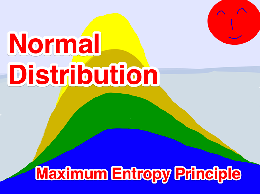
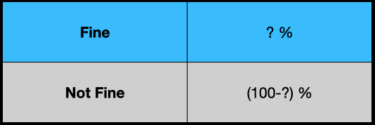
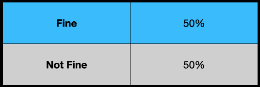
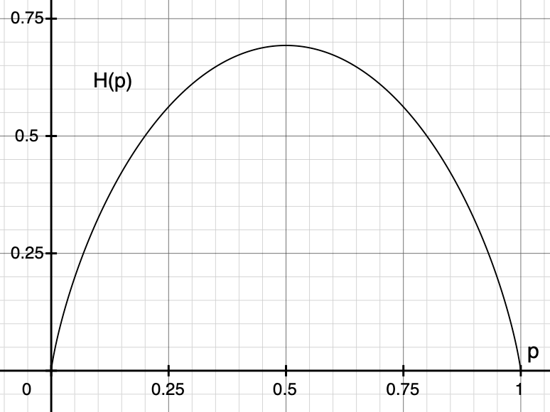

Have you ever wondered why we often use the normal distribution?

How do we derive it anyway?

Why do many probability distributions have the exponential term?

Are they related to each other?

If any of the above questions make you wonder, you are in the right place.

I will demystify it for you.

## Fine or Not Fine

Suppose we want to predict if the weather of a place is fine or not.

However, we have no information about the place.

We don’t know if it’s in Japan, the US, or a country on a planet in a galaxy far, far away.

How can we develop a probability distribution model to predict the probability of “Fine”?

We don’t want to introduce bias or assumption into our weather model since we know nothing about the weather.

We want to be honest.

So, our model should reflect that we are entirely ignorant about the weather.

What kind of probability distribution should we use?

Should we use the normal distribution?

Not really — we don’t have the mean and standard deviation of the weather, so we cannot use the normal distribution.

As we don’t know anything, we can only randomly guess, can’t we?

That’d be like a coin flip, right?

## Maximum Ignorance and Honesty

Given that we have no information, our most unassuming model is a coin flip.

So, it’s the uniform distribution.

Although this keeps us honest, it would not be a very accurate weather model because the uniform distribution is entirely ignorant.

We could use a different probability distribution if we have some weather information.

For example, if we know the mean and standard deviation, we could use the normal distribution, which would be more beneficial than random guesses by the uniform distribution.

In other words, when we use a particular probability distribution (other than the uniform distribution) for the weather, we claim that we have some information about the weather.

If we claim that we have some information without proof or statistics, we would be dishonest, and no one should ever believe our predictions.

So, we should use a distribution expressing what we know and don’t know.

By using the uniform distribution, we tell the world that we are maximally ignorant about the weather and we are sincere.

The question is how to express what we’ve said in mathematics.

That is where the concept of [information entropy](/blog/2018/2018-07-24-entropy-demystified/) comes in.

## Maximum Entropy Distribution with no Information

The information entropy is the measure of uncertainty.

Higher entropy means that we are less sure about what will happen next.

As such, we should maximize the entropy of our probability distribution as long as all required conditions (constraints) are satisfied.

This way, we remove any unsupported assumptions from our distribution and keep ourselves honest.

---

Let’s look at an example by maximizing the entropy of our weather model.

Below is the entropy of our weather model.

$$
H = -P_F \,\log P_F - P_{NF} \,\log P_{NF}
$$

$F$ stands for “Fine” and $NF$ stands for “Not Fine”.

We know nothing about the probability distribution of the weather except that the total probability must sum up to 1.

$$
P_F + P_{NF} = 1
$$

It is the only constraint since we know nothing about the weather distribution.

We will maximize the entropy of the probability distribution while satisfying the constraint.

It is a constrained optimization that we can solve using the Lagrange multiplier.

Let’s define the Lagrangian using the Lagrange multiplier $\lambda$.

$$
L = H - \lambda (P_F + P_{NF} - 1)
$$

We find the maximum of $L$ where the gradient of $L$ is stationary.

The gradient of $L$ is a vector of partial derivatives.

$$
\text{grad } L = \left( \frac{\partial L}{\partial P_F}, \frac{\partial L}{\partial P_{NF}} \right) = 0
$$

Here, $\boldsymbol{0}$ is a vector like $(0, 0)$.

So, we have two equations to solve.

$$
\begin{aligned}
\frac{\partial L}{\partial P_F} &= - \log P_F - 1 - \lambda = 0 \\\\
\frac{\partial L}{\partial P_{NF}} &= - \log P_{NF} - 1 - \lambda = 0
\end{aligned}
$$

Solving these equations, we know both probabilities are the same.

$$
\begin{aligned}
P_F &= e^{-1-\lambda} \\
\\
P_{NF} &= e^{-1-\lambda}
\end{aligned}
$$

We can use the constraint to eliminate the Lagrange multiplier $\lambda$.

$$
\begin{aligned}
P_F + P_{NF} &= e^{-1-\lambda} + e^{-1-\lambda} = 1 \\
\\
\therefore P_F &= P_{NF} = 0.5
\end{aligned}
$$

The “Fine” and “Not Fine” probabilities are both 0.5.

So, our model (the probability distribution) of the weather is a uniform distribution.

Let’s plot the entropy and visually confirm that $p=0.5$ gives the maximum.

$$
H(p) = -p \log p - (1-p) \log (1-p)
$$

The diagram below shows that our probability distribution's entropy becomes the maximum at $p=0.5$.

In summary, we have derived the uniform distribution by maximizing the entropy of our probability distribution for which we have no specific information.

We call the approach __the principle of maximum entropy__ which states the following:

<blockquote>
The probability distribution which best represents the current state of knowledge is the one with the largest entropy, in the context of precisely stated prior data (such as a proposition that expresses testable information).
<cite>[Principle of maximum entropy (Wikipedia)](https://en.wikipedia.org/wiki/Principle_of_maximum_entropy)</cite>
</blockquote>

In slightly more plain English, if we maximize the entropy of our distribution while satisfying all constraints we know, the probability distribution becomes the honest representation of our knowledge.

## Many Discrete Outcomes

We can apply the maximum entropy principle to the probability distribution with more outcomes.

Let’s extend our model to $N$ outcomes (i.e., we have $N$ possible weather scenarios).

$$
\begin{aligned}
&\sum\limits_{i=1}^N P_i = 1 \\\\
&H = -\sum\limits_{i=1}^N P_i \log P_i \\\\
&L = H - \lambda \left( \sum\limits_{i=1}^N P_i - 1 \right)
\end{aligned}
$$

Like the previous section, we calculate the partial derivative of $L$ by $P_i$ and set it to zero to find the value of $P_i$ that maximizes the entropy.

$$
\frac{\partial L}{\partial P_i} = - \log P_i - 1 - \lambda = 0
$$

Solving the above for $P_i$:

$$
P_i = e^{-1-\lambda}
$$

Once again, all $P_i$ have the same value.

There are $N$ possible states, and the total probability sums up to 1.

As such, the uniform distribution is given below:

$$
P_i = \frac{1}{N}
$$

## Continuous Outcomes

Let’s apply the principle of maximum entropy to a continuous distribution.

Let’s say $x$ represents a temperature value, and $p(x)$ is a probability density function of the temperature value.

As before, we can define the sum of total probability, the entropy, and the Lagrange function.

$$
\begin{aligned}
& \int_a^b p(x) dx = 1 \\
& H = -\int_a^b p(x) \log p(x) dx \\
& L = H - \lambda \left( \int_a^b p(x) dx - 1 \right)
\end{aligned}
$$

$a$ and $b$ are the minimum and maximum temperatures, respectively.

We want to know what kind of $p(x)$ gives the maximum entropy.

However, $p(x)$ is a function, which means $L$ is a "functional" that is a function of functions.

We can optimize a functional using the Euler-Lagrange equation from the calculus of variations.

In calculus of variations, we optimize the following form of functionals using the Euler-Lagrange equation.

$$
L[y] = \int_a^b F(x, y, y') dx
$$

The square brackets mean $L$ is a functional that accepts a function $y$.

All you need to do is to solve the following Euler-Lagrange equation to find the optimal function $y$.

$$
\frac{\partial F}{\partial y} - \frac{d}{dx} \frac{\partial F}{\partial y'} = 0
$$

So, let’s put our Lagrangian in the same form.

$$
L[p] = \int_a^b \left\{ -p \log p - \lambda \left( p - \frac{1}{b-a} \right) \right\} dx
$$

The last term $-\\frac{1}{b-a}$ is there because I moved $-1$ into the integral.

We could ignore the last term in this example since we will calculate the partial derivative by $p$. As a result, the last term becomes zero anyway. But I left it there so that you know why it goes away. Later, I will ignore such terms.

Let’s put the contents of the curly brackets as $F$.

$$
F(x, p, p') = -p \log p - \lambda \left( p - \frac{1}{b-a} \right)
$$

$p'$ is the derivative of $p$ by $x$ but there is no $p'$ in this $F$, which makes the calculation easier.

We are ready to solve the Euler-Lagrange equation for $F$:

$$
\frac{\partial F}{\partial p} - \frac{d}{dx} \frac{\partial F}{\partial p'} = 0
$$

We can ignore the second term as there is no $p'$ in $F$.

Therefore, we are solving the following equation:

$$
\frac{\partial}{\partial p} \left\{ -p \log p - \lambda \left( p - \frac{1}{b-a} \right) \right\} = 0
$$

As a result, we obtain the following:

$$
\begin{aligned}
-\log p(x) - 1 - \lambda &= 0 \\
p(x) &= e^{-1-\lambda}
\end{aligned}
$$

Using the sum of probability, we eliminate $\lambda$.

$$
\begin{aligned}
\int_a^b p(x) dx &= 1 \\
\int_a^b e^{-1-\lambda} dx &= 1 \\
e^{-1-\lambda} \int_a^b dx &= 1 \\
e^{-1-\lambda} = \frac{1}{b-a}
\end{aligned}
$$

Once again, the maximum entropy distribution without any extra information is the uniform distribution.

$$
p(x) = \frac{1}{b-a}
$$

But the uniform distribution is not that useful for predicting the temperature.

We need to incorporate more information to have a better weather forecast model.

## The Maximum Entropy Distribution with the Mean and Standard Deviation

If we know the mean and standard deviation of the temperature, what would be the maximum entropy distribution?

You’ve probably guessed it — it’s the normal distribution.

Let’s do some math exercises. The formulas for the total probability and the entropy remain the same as before.

$$
\begin{aligned}
& \int_{-\infty}^{\infty} p(x) dx = 1 \\
& H = -\int_{-\infty}^{\infty} p(x) \log p(x) dx
\end{aligned}
$$

This time, we know more information about the distribution. Namely, the mean and standard deviation:

$$
\begin{aligned}
& \mu = \int_{-\infty}^{\infty} p(x) x dx \\
& \sigma^2 = \int_{-\infty}^{\infty} p(x) (x - \mu)^2 dx
\end{aligned}
$$

We can use them as additional constraints while maximizing the entropy. For each constraint, we add a Lagrange multiplier.

$$
\begin{aligned}
L = H & - \lambda_0 \left( \int_{-\infty}^\infty p(x)dx - 1 \right) \\
      & - \lambda_1 \left( \int_{-\infty}^\infty p(x)(x - \mu)^2 dx - \sigma^2 \right)
\end{aligned}
$$

The last term includes both the mean and standard deviation in the constraint.

The Lagrangian functional is as follows:

$$
L[p] = \int_{-\infty}^{\infty} \left\{ -p \log p - \lambda_0 p - \lambda_1\, p(x-\mu)^2 \right\} dx
$$

This time, I ignored the terms that will become zero due to the partial derivative by $p$.

So, we will apply the Euler-Lagrange equation to the following:

$$
F(x, p, p') = -p \log p - \lambda_0 \, p - \lambda_1 \, p(x-\mu)^2
$$

As a reminder, this is the Euler-Lagrange equation.

$$
\frac{\partial F}{\partial p} - \frac{d}{dx} \frac{\partial F}{\partial p'} = 0
$$

The second term is zero since we do not have $p'$ in $F$.

So, we only calculate the partial derivative of $F$ by $p$.

$$
\begin{aligned}
- \log p(x) - 1 - \lambda_0 - \lambda_1 (x - \mu)^2 &= 0 \\
\log p(x) &= -1 - \lambda_0 - \lambda_1 (x - \mu)^2 \\
p(x)  &= e^{ -1 - \lambda_0 - \lambda_1 (x - \mu)^2}
\end{aligned}
$$

Then, we ensure $p(x)$ satisfies all the constraints to eliminate the Lagrange multipliers.

The total probability must add up to 1.

$$
\int_{-\infty}^{\infty} p(x) dx = \int_{-\infty}^{\infty} e^{-1 -\lambda_0 -\lambda_1 (x - \mu)^2} dx = 1
$$

We define a new variable $z$ as follows:

$$
z = \sqrt{\lambda_1} (x - \mu)
$$

So, $dz$ is as follows:

$$
dz = \sqrt{\lambda_1} dx
$$

We substitute $z$ and $dz$ into the above integral:

$$
\begin{aligned}
\int_{-\infty}^{\infty} e^{-1 -\lambda_0 -z^2} \frac{1}{\sqrt{\lambda_1}} dz &= \frac{e^{-1 - \lambda_0}}{\sqrt{\lambda_1}} \int_{-\infty}^{\infty} e^{-z^2} dz \\
&= e^{-1-\lambda_0} \sqrt{\frac{\pi}{\lambda_1}}
\end{aligned}
$$

The last integral is [the Gaussian integral](https://en.wikipedia.org/wiki/Gaussian_integral), giving the square root of $\pi$.

So, we have the following equation:

$$
\begin{aligned}
\int_{-\infty}^{\infty} p(x) dx &= e^{-1-\lambda_0} \sqrt{\frac{\pi}{\lambda_1}} \\
&= 1
\end{aligned}
$$

Therefore, we have the relationship between $\lambda_0$ and $\lambda_1$.

$$
e^{-1-\lambda_0} = \sqrt{\frac{\lambda_1}{\pi}}
$$

The standard deviation can be calculated as follows:

$$
\sigma^2 = \int_{-\infty}^{\infty} p(x) (x - \mu)^2 dx = \int_{-\infty}^{\infty} e^{-1-\lambda_0-\lambda_1(x-\mu)^2} (x-\mu)^2 dx
$$

We can eliminate $\lambda_0$ term:

$$
\sigma^2 = \sqrt{\frac{\lambda_1}{\pi}} \int_{-\infty}^{\infty} e^{-\lambda_1(x - \mu)^2} (x-\mu)^2 dx
$$

Once again, we use the following substitution:

$$
z = \sqrt{\lambda_1}(x - \mu)
$$

So, the standard deviation formula can be simplified:

$$
\begin{aligned}
\sigma^2 &= \sqrt{\frac{\lambda_1}{\pi}} \int_{-\infty}^{\infty} e^{-z^2} \frac{z^2}{\lambda_1} \frac{dz}{\sqrt{\lambda_1}} \\
&= \frac{1}{\lambda_1 \sqrt{\pi}} \int_{-\infty}^{\infty} e^{-z^2} z^2 dz
\end{aligned}
$$

The integral can be calculated using the integral by parts along with the Gaussian integral.

$$
\begin{aligned}
\int_{-\infty}^{\infty} z^2 e^{-z^2} dz &= \int_{-\infty}^{\infty} z(z e^{-z^2}) dz \\
&= \left[ z\left(-\frac{1}{2} e^{-z^2} \right) \right]_{-\infty}^\infty - \int_{-\infty}^{\infty} - \frac{1}{2} e^{-z^2} dz
\end{aligned}
$$

The first term becomes zero as the exponential of $z^2$ grows faster than $z$ when $z$ goes to the negative infinity or the positive infinity.

The second term is the Gaussian integral (the square root of $\pi$) divided by $2$.

All in all:

$$
\begin{aligned}
\sigma^2 &= \frac{1}{\lambda_1 \sqrt{\pi}} \int_{-\infty}^{\infty} e^{-z^2} z^2 dz \\
&= \frac{1}{\lambda_1 \sqrt{\pi}} \frac{\sqrt{\pi}}{2} \\
&= \frac{1}{2\lambda_1}
\end{aligned}
$$

As a result, $\lambda_1$ is determined.

$$
\lambda_1 = \frac{1}{2\sigma^2}
$$

Also, $\lambda_0$ is determined:

$$
\begin{aligned}
e^{-1-\lambda_0} &= \sqrt{\frac{\lambda_1}{\pi}} \\
&= \frac{1}{\sqrt{2\pi\sigma^2}}
\end{aligned}
$$

Finally, $p(x)$ becomes the following:

$$
\begin{aligned}
p(x) &= e^{-1-\lambda_0-\lambda_1(x-\mu)^2} \\
&= \frac{1}{\sqrt{2\pi\sigma^2}} e^{-\frac{(x-\mu)^2}{2\sigma^2}}
\end{aligned}
$$

We see that the normal distribution is the maximum entropy distribution when we only know the mean and standard deviation of the data set.

---

It makes sense why people often use the normal distribution as it is pretty easy to estimate the mean and standard deviation of any data set given enough samples.

That doesn’t mean that the true probability distribution is the normal distribution. It just means that our model (probability distribution) reflects what we know and don’t — the mean, standard deviation, and nothing else.

If the normal distribution can explain the real data well, likely, the true distribution does not have any more specific conditions. For example, we may be dealing with noise or errors.

Suppose the normal distribution doesn’t explain the real data well. In that case, we may need to find out more specific information about the distribution so that we can incorporate it into our model, which may not be so easy depending on the data set you are dealing with.

So, what other distributions can we derive using the maximum entropy principle?

## Maximum Entropy Probability Distributions

It turns out there are many such distributions.

Wikipedia has a table of maximum entropy probability distributions and corresponding maximum entropy constraints.

](images/maximum-entropy-distributions.jpeg)

Many distributions have the exponential term because the entropy maximization process may or may not eliminate the exponential.

## Regularization with the Maximum Entropy

In deep learning, you might have seen that some loss function includes negative entropy. As the loss function is minimized, the entropy is maximized.

Adding the maximum entropy term in the loss function helps to avoid unsupported assumptions creep in, so it’s a form of regularization.

## Final Thoughts…

Once upon a time, when I was studying the subject of probability and statistics, our teacher told us to get used to the normal distribution.

We learned how to use the Normal distribution table, how to interpret the standard deviation, and other stuff.

Eventually, it became second nature, and I stopped asking myself why the math looked so weird.

I bet many students did the same, and their life also went on.

Later in life, I encountered the maximum entropy concept while reading a reinforcement learning paper.

So, I went down the rabbit hole and found the wonderland where all those weird probability distribution formulas no longer look weird.

I hope you are in the wonderland now.

## References

- [Maximum entropy probability distribution](https://en.wikipedia.org/wiki/Maximum_entropy_probability_distribution) \
  Wikipedia
- [Deriving probability distributions using the Principle of Maximum Entropy](https://sgfin.github.io/2017/03/16/Deriving-probability-distributions-using-the-Principle-of-Maximum-Entropy/) \
  Sam Finlayson
