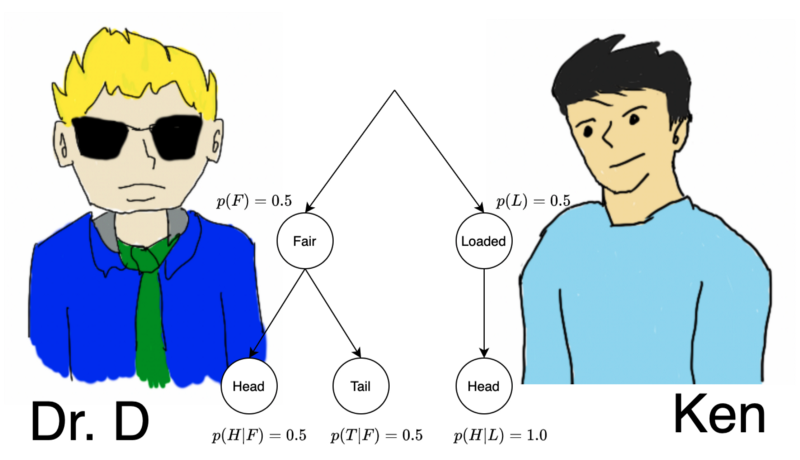
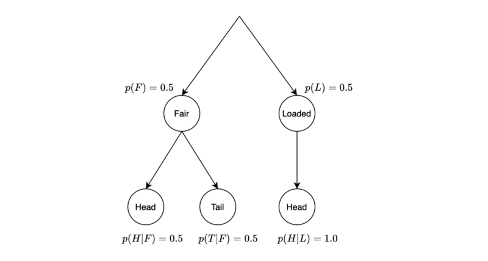

## Do we need the Bayes theorem?

Can we do everything with the conditionals and marginals?

This is a fictional story of a high school student Ken, and his math teacher Dr. Demystifier (Dr. D). Ken has just learned the Bayes theorem but was utterly mystified by the formula, unaware of its use.

They will discuss the following topics:

- Bayes Theorem Derivation
- Belief Update Once
- Belief Update Twice
- Belief Update Forever

## Bayes Theorem Derivation

Ken asked Dr. D, “May I ask a question about the Bayes theorem?”

Dr. D nodded and said, “Please do”.

Ken continued, “The Bayes theorem says:

$$
P(z|x) = \frac{P(x|z)P(z)}{P(x)}
$$

I know how to derive it using the conditional probabilities, which we define using the joint probabilities:

$$
\begin{aligned}
P(z|x) &= \frac{P(x, z)}{P(x)} \\\\
P(x|z) &= \frac{P(x, z)}{P(z)}
\end{aligned}
$$

We can re-arrange them to derive the following equality:

$$
P(x,z) = P(z|x)P(x) = P(x|z)P(z)
$$

Re-arranging them further yields the Bayes theorem:

$$
P(z|x) = \frac{P(x|z)P(z)}{P(x)}
$$

It seems pretty straightforward, yet I am not very sure how it is useful”.

Dr. D kept his mouth shut, staring at Ken’s face through his pair of sunglasses. He seemed to be deep in thought, and Ken knew that Dr. D would come up with a question to let him realize how to make the best use of the Bayes theorem. However, waiting felt lasting forever, like the heavy rain before a baseball match in his childhood memory.

## Belief Update&nbsp;Once

Dr. D opened his mouth, “I have two coins. One coin is fair, and the other is loaded. The fair coin flips to the head with a 50% chance. The loaded coin flips to the head 100% of the time. Suppose you randomly pick one of them, toss it, and the tail shows up. Can you tell me whether it’s a fair coin?”.

Ken immediately answered, “Yes, it’s the fair coin because the loaded one cannot show the tail”.

Dr. D asked another question, “If it was the head, can you tell me if it’s a fair coin?”

Ken answered, “No, I cannot because both coins can flip to the head. But I can say it is more likely to be the loaded one”.

Ken drew a diagram explaining his reasoning.

The probability that we have the loaded coin given the head is the following conditional probability:

$$
P(L|H) = \frac{P(H,L)}{P(H)}
$$

So, we need to calculate the marginal probability of the head.

$$
P(H) = P(H, F) + P(H, L)
$$

Note: the word marginal means we eliminate a variable from the probability function by summing over the variable. In this example, we eliminate the variable that indicates the coin is fair or loaded.

The joint probability of the head (H) and the fair coin (F) is 0.25.

$$
P(H, F) = P(H|F)P(F) = 0.5 \times 0.5 = 0.25
$$

The joint probability of the head (H) and the loaded coin (L) is 0.5.

$$
P(H,L) = P(H|L)P(L) = 1.0 \times 0.5 = 0.5
$$

So, the marginal probability of the head is 0.75.

$$
P(H) = P(H, F) + P(H, L) = 0.25 + 0.5 = 0.75
$$

The conditional probability of the loaded coin given the head is ⅔.

$$
P(L|H) = \frac{P(H, L)}{P(H)} = \frac{0.5}{0.75} = \frac{2}{3} = 0.6\dot{6}
$$

Ken explained, “Prior to the first flip of the coin, the probability of having the loaded coin was ½. After observing the head from the first flip, our belief that we have the loaded coin has increased from ½ to ⅔”.

Dr. D nodded to each equation Ken drew and said, “Excellent! You’ve already used the Bayes theorem while deriving the conditional probability of the loaded coin given the head”. Dr. D added another equation.

$$
P(L|H) = \frac{P(H, L)}{P(H)} = \frac{P(H|L)P(L)}{P(H)}
$$

Ken looked at the equation and then said, “I didn’t directly use the Bayes theorem, but I was doing the same calculation. So, it seems to me that we don’t need the Bayes theorem. We only need to know the joint probability, conditional probability, and marginal probability”.

Dr. D agreed with Ken, “Yes, you’re right. You didn’t need the Bayes theorem. So far, so good”.

Ken assumed that Dr. D was just making sure of Ken’s understanding of the basic concepts related to the Bayes theorem.

## Belief Update&nbsp;Twice

Dr. D said, “Suppose we flip the same coin again and observe the tail, what would be the probability that we’ve picked up the fair coin?”

Ken answered, “That’d be 100% (fair coin) since the loaded one can not flip to the tail”.

“Great!” Dr. D continued, “If it was the head, what would be the probability that we had picked up the loaded one?”

Ken said, “Sure, I can handle this one, too”. He started to explain his steps:

We need to calculate the conditional probability of the loaded coin after observing the head twice in a row.

$$
P(L|HH) = \frac{P(HH,L)}{P(HH)}
$$

The marginal probability of observing the head twice is:

$$
\begin{aligned}
P(HH) &= P(HH,F) + P(HH,L) \\
&= P(HH|F)P(F) + P(HH|L)P(L) \\
&= P(H|F)P(H|F)P(F) + P(H|L)P(H|L)P(L) \\
&= 0.5 \times 0.5 \times 0.5 + 1.0 \times 1.0 \times 0.5 \\
&= 0.125 + 0.5 \\
&= 0.625
\end{aligned}
$$

Note: the following is true because every flip is an independent event.

$$
\begin{aligned}
P(HH|F) &= P(H|F)P(H|F) \\
P(HH|L) &= P(H|L)P(H|L)
\end{aligned}
$$

The conditional probability of the loaded coin given the head twice in a row is:

$$
\begin{aligned}
P(L|HH) &= \frac{P(HH,L)}{P(HH)} \\
&= \frac{0.5}{0.625} \\
&= 0.8
\end{aligned}
$$

Ken concluded, “The probability that we have picked up the loaded coin is now 0.8 after having seen the head twice in a row”.

## Belief Update&nbsp;Forever

Dr. D said, “Excellent again! Let’s flip the coin for the third time”.

Ken started doubting Dr. D. “Why is he asking the same thing again? What is the purpose of these repeated questions? If we kept going like this, I would need to calculate $P(L|HHHHHHH\dots)$. What is the purpose of all the repetitions... repetitions... repetitions... ah...”. He realized something and started explaining his thought.

Prior to the first flip, the probability of the loaded coin was ½. Post observing the head from the first flip, the conditional probability of the loaded coin became ⅔.

$$
P(L|H) = \frac{P(H,L)}{P(H)} = \frac{0.5}{0.75} = \frac{2}{3} = 0.6\dot{6}
$$

Then, Dr. D drew another equation:

$$
P(L|H) = \frac{P(H,L)}{P(H)} = \frac{P(H|L)P(L)}{P(H)}
$$

So, we could’ve calculated the same thing with the Bayes theorem.

$$
\begin{aligned}
P(L|H) &= \frac{P(H,L)}{P(H)} \\ 
&= \frac{P(H|L)P(L)}{P(H)} \\
&= \frac{1.0 \times 0.5}{0.75} \\
&= \frac{0.5}{0.75} \\
&= \frac{2}{3} \\
&= 0.6\dot{6}
\end{aligned}
$$

We call the conditional probability that we picked the loaded coin given the first flip the posterior probability (or just the posterior). It is ⅔ given the first flip (the head), so we believe that the probability of having the loaded coin is ⅔.

When we flip the coin for the second time, our prior belief is the posterior belief from the first flip. Namely,

$$
\begin{aligned}
P(L) &= \frac{2}{3} \\
P(F) &= 1 - P(L) = \frac{1}{3}
\end{aligned}
$$

Then, we can also update the marginal probability of the head using the updated priors:

$$
\begin{aligned}
P(H) &= P(H|F)P(F) + P(H|L)P(L) \\
&= 0.5 \times \frac{1}{3} + 1.0 \times \frac{2}{3} \\
&= \frac{5}{6}
\end{aligned}
$$

After observing the second flip (the head), we again update our belief of the loaded coin using the Bayes theorem:

$$
\begin{aligned}
P(L|H) &= \frac{P(H|L)P(L)}{P(H)} \\
&= \frac{1.0 \times \frac{2}{3}}{\frac{5}{6}} \\
&= 0.8
\end{aligned}
$$

Repeating the same process, the posterior beliefs after the second flip become the prior beliefs for the third flip:

$$
\begin{aligned}
P(L) &= 0.8 \\
P(F) &= 0.2
\end{aligned}
$$

We also update the marginal probability of the head:

$$
\begin{aligned}
P(H) &= P(H|F)P(F) + P(H|L)P(L) \\
&= 0.5 \times 0.2 + 1.0 \times 0.8 \\
&= 0.9
\end{aligned}
$$

After the third flip (the head), the posterior belief of the loaded coin is:

$$
\begin{aligned}
P(L|H) &= \frac{P(H|L)P(L)}{P(H)} \\
&= \frac{1.0 \times 0.8}{0.9} \\
&= \frac{8}{9}
\end{aligned}
$$

If we keep getting the head, our belief of the loaded coin goes higher and higher, meaning that we believe more and more that the coin is loaded. But if we get the tail once, it becomes zero because the loaded coin has zero chance of the tail.

$$
\begin{aligned}
P(L|T) &= \frac{P(T|L)P(L)}{P(T)} \\
&= \frac{0 \times P(L)}{P(T)} \\
&= 0
\end{aligned}
$$

Instead, our belief in the fair coin would be 100% due to the tail showing up.

$$
\begin{aligned}
P(F|T) &= \frac{P(T|F)P(F)}{P(T)} \\
&= \frac{P(T|F)P(F)}{P(T|F)P(F) + P(T|L)P(L)} \\
&= \frac{P(T|F)P(F)}{P(T|F)P(F) + 0 \times P(L)} \\
= 1
\end{aligned}
$$

We just need more observations to keep updating our beliefs.

Ken told Dr. D, “I can do this forever, thanks to the Bayes theorem!”

Dr. D smiled.

## References

- [Bayes Theorem](https://en.wikipedia.org/wiki/Bayes%27_theorem) \
  Wikipedia
