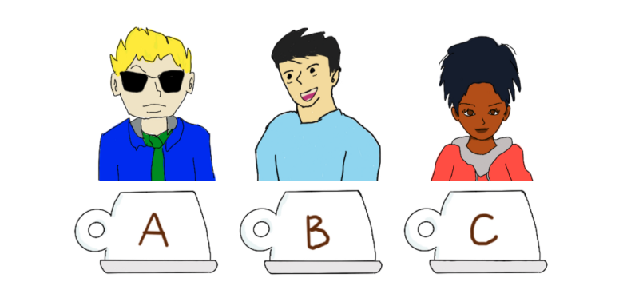
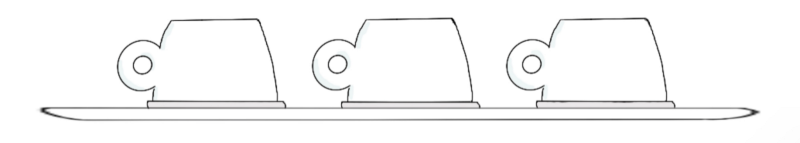
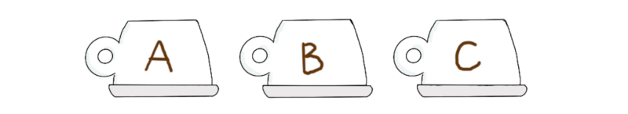
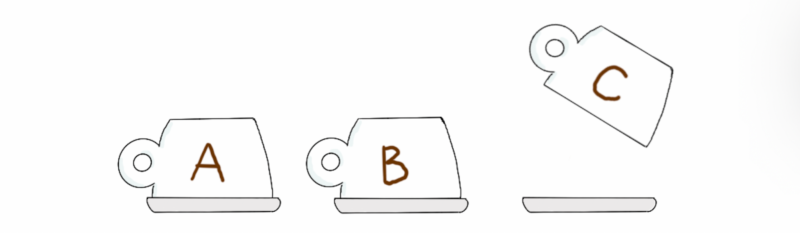
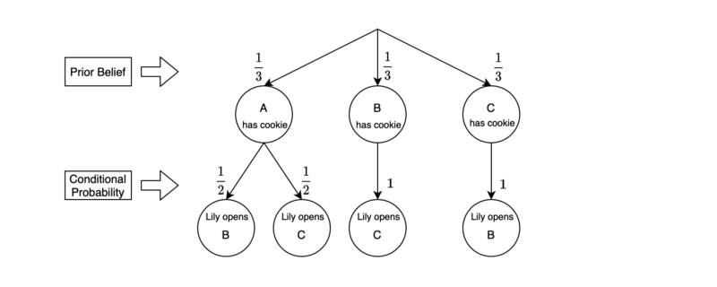
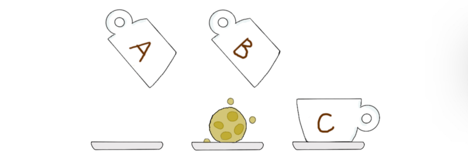

[Previously](/blog/2021-07-20-bayes-theorem-demystified/), a high school student Ken, and his math teacher Dr. Demystifier (Dr. D), discussed the Bayes theorem. This time, Lily — a friend of both Ken and Dr. D — challenges them with the Monty Hall problem.

They will discuss the following topics:

- Monty Hall Problem
- Bayesian Solution
- Subjective Prior Belief

## Monty Hall Problem

Ken went to a cafe near his high school to buy lunch. He ordered a tall cappuccino and a tuna sandwich and stood by the coffee machine, hearing the sound of steam coming out as if from a bull’s nostrils.

Lily — a barista at the cafe — was making the drink for Ken. He knew her, so he waved at her. She smiled in return. She was a student at a university close to there.

Dr. D entered the shop. He looked at Ken and gave him a Vulcan salute 🖖.

Lily watched Ken’s hand transform into a double-fingered victory sign, so she realized Dr. D was in the shop. Lily thought, “Today is the day!”.

Dr. D said hello to a cafe staff, handed over his coffee tumbler, and walked over to Ken. The cafe staff knew what Dr. D wanted.

Lily passed the tall cappuccino to Ken and told him, “I have something for you. I’ll have a break soon, so why don’t you sit down and wait for me a while?”

Ken sat at the nearby table and chatted with Dr. D, who was waiting for his tumbler filled with coffee.

After a while, Lily came to Ken holding a tray with three cups on it — all upside down.

Ken wondered what was going on. Lily smiled and said, “As a staff, I’m entitled to have one cookie of my choice every day. But today I don’t feel like one. So if you’d like a cookie, I can give you mine for being a nice friend”.

Ken said, “Wow, thanks. That’s very kind of you”. But he thought there must be a reason behind the offer since Lily always liked to give him tough math questions. “So, what’s the catch?”

“Hahaha”, Lily laughed. “You know me too well, Ken. You can have my cookie if you win this game”.

Lily explained the rule. “A cookie is in one of the cups. Let’s call them A, B, and C. You choose one, and you’ll have what’s inside. How does that sound?”

Ken said, “Sure. I have nothing to lose. I’ll pick cup A”.

Lily smiled, “Great”. Then, she paused and appeared to be in two minds.

Dr. D was carefully watching this event, now holding and sipping from his tumbler.

Eventually, Lily said, “I’ll open cup C”. She opened cup C, and there was nothing.

Ken said, “OK, so the cookie must be either in cup A or B. I have a 50% chance of winning”.

Dr. D’s right eyebrow moved up.

Lily told Ken, “I’ll give you a chance to change your mind. Do you want to choose cup B instead?”

“Well, …”, Ken said, looking at cups A and B. “Do I need to? I have the same chance of winning with either cup”.

Dr. D said to himself in a whisper, “This is the Monty Hall problem”. He asked Ken, “You might want to check if your belief has changed after observing the empty cup C?”.

Ken suppressed the urge to say “No” and wondered: “Intuitively, there is a 50–50 chance of winning, but….”

“This is a challenge from Lily — it mustn’t be that easy”, he thought. “OK, let’s work on it!”.

## Bayesian Solution

Ken took out a pen and a notebook from his bag and started drawing a diagram and equations:

The initial prior probability for each of the three cups to have a cookie inside is 1/3:

$$
\begin{aligned}
P(\text{A has cookie}) = P(A) = \frac{1}{3} \\
P(\text{B has cookie}) = P(B) = \frac{1}{3} \\
P(\text{C has cookie}) = P(C) = \frac{1}{3}
\end{aligned}
$$

Note: we removed “has cookie” from the notation to keep it simple.

These priors should be reasonable because we don’t have any specific information about where the cookie is.

Lily would open cup B or C depending on where the cookie is as we have chosen cup A.

If the cookie were in cup A, Lily would open either cup B or C randomly.

$$
\begin{aligned}
P(\text{Lily opens B|A has cookie}) = P(\neg B|A) = \frac{1}{2} \\
P(\text{Lily opens C|A has cookie}) = P(\neg C|A) = \frac{1}{2}
\end{aligned}
$$

Note: we denoted that “Lily opens B” using the math symbol for “not B” since she will open it only if “cup B has no cookie”. The same goes for cup C.

If the cookie were in cup B, Lily could only open cup C.

$$
P(\text{Lily opens C|B has cookie}) = P(\neg C|B) = 1
$$

Lily opened cup C, and there was nothing in it.

Given all these priors and observations, we want to calculate the probability of cup A having the cookie. In other words, we update __the posterior probability of A having the cookie__ after observing the empty cup C.

We can write the update equation using the Bayes theorem:

$$
P(A|\neg C) = \frac{P(\neg C|A)P(A)}{P(\neg C)}
$$

The marginal probability (the denominator) is:

$$
\begin{aligned}
P(\neg C) &= P(\neg C|A) P(A) + P(\neg C| B)P(B) \\
&= \frac{1}{2} \times \frac{1}{3} + 1 \times \frac{1}{3} \\
&= \frac{1}{2}
\end{aligned}
$$

Therefore, the posterior probabilities given the empty cup C are:

$$
P(A|\neg C) = \dfrac{\frac{1}{2} \times \frac{1}{3}}{\frac{1}{2}} = \frac{1}{3}
$$

$$
P(B|\neg C) = \frac{2}{3}
$$

The posterior beliefs say:

- Cup A has the same chance of having the cookie as before
- Cup B has twice more chance than cup A.

## Subjective Prior Belief

Dr. D and Lily both sat at the table, watching Ken derive the posterior probability.

She asked Ken, “So, you’ve made a decision?”

Ken said promptly, “Yes, I’d like to choose cup B instead”.

Lily asked, “That is your final answer?”

When Ken was about to say “Yes”, Dr. D interrupted and said, “You’ve done well using the Bayes theorem”.

Then, Dr. D looked straight into Lily’s eyes through his sunglasses as if reading her mind. “You also played well, Lily”, said Dr. D. “But there was one thing…

I noticed that you had a moment of indecision before opening cup C, which would only happen if cup A had the cookie. Only if both cups B and C were empty, you had to decide which one to open. Given this information, our belief should now be that cup A has the cookie!

Bayes theorem helps update probability, but it can drive our belief in the wrong direction if our assumption or model is false.

We must take all available information to form our subjective prior belief”.

“All the math was unnecessary?” Ken looked at Lily and asked, “So, cup A is the answer?”

Lily’s facial expression remained plain. “Well, you have to commit your answer first, and then I’ll tell you the truth”.

Dr. D said, “The only explanation for Lily’s behavior is that cup A has the cookie. But ultimately, you should be the judge, Ken”.

Ken nodded in agreement and said, “My final answer is cup A. Please open it now”.

“No more ifs or buts, OK?” Lily asked both of them. They nodded in sync.

Lily opened both cups A and B simultaneously, and cup B had the cookie!

Ken made a face that he couldn’t believe what he had just seen.

Lily took the cookie, gave it to Ken, and said, “You did well and deserve it anyways”.

Ken thanked Lily and waited for an explanation.

Lily cleared her throat with a light cough, sounding like a great professor commencing a great lecture.

She said, “The cookie was inside cup B all the time. When Ken chose cup A, I had no choice but open cup C. With the empty cup C, Ken would discover that cup B had a higher chance than cup A.

So I had to change his assumption or model to drive him to the wrong conclusion. You know we are playing a game, after all.

You’ll need to feed the opponent with misleading evidence to win a game like this one.

I pretended I was in two minds before opening cup C, hoping you’d notice, Dr. D.

In other words, I was playing with you the whole time”, Lily winked at him. “Gotcha!”

Dr. D’s right eyebrow moved up sky-high.

## References

- [Monty Hall Problem](https://en.wikipedia.org/wiki/Monty_Hall_problem) \
  Wikipedia