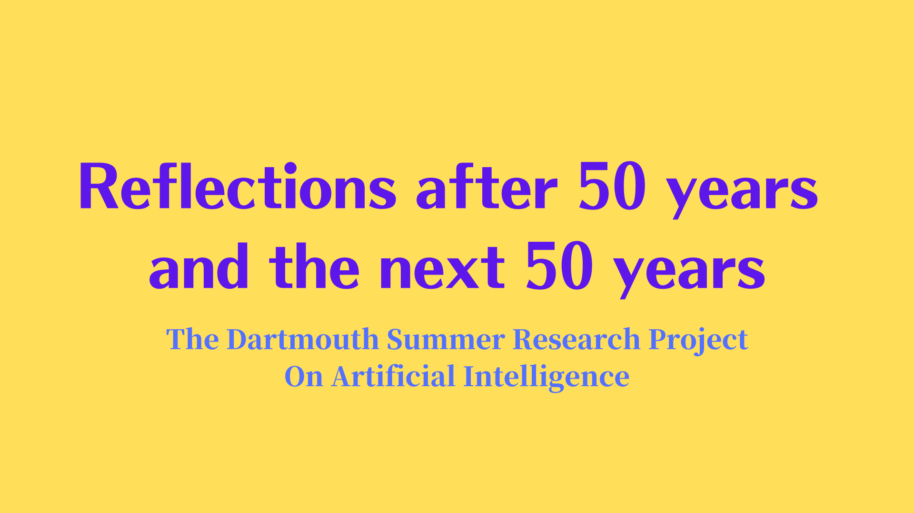
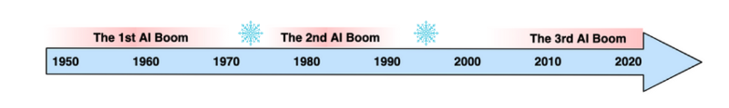
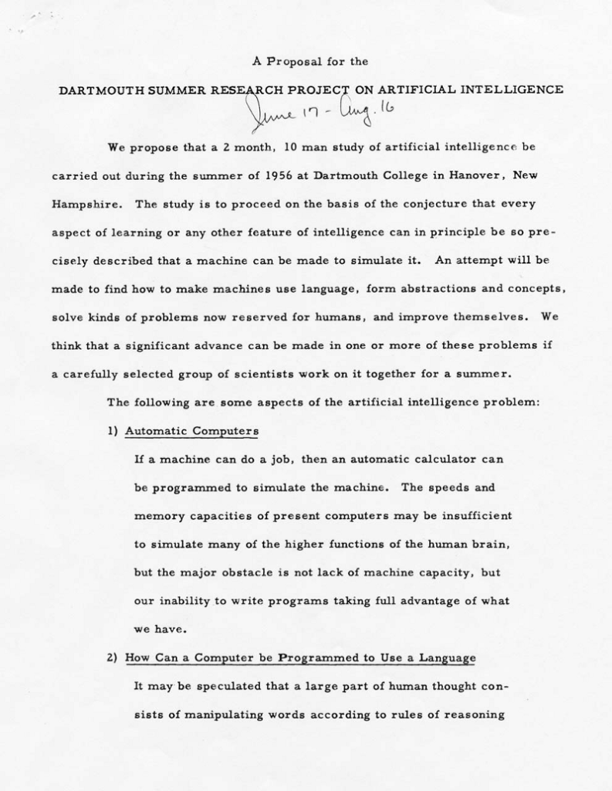

## What happened in the first AI boom? How did it end, and why?

“Artificial Intelligence” is a catch-all term for anything related to …wait for it… “Artificial Intelligence”.

Joking aside, John McCarthy kept the term broad when proposing a summer research project to discuss “thinking machines”.

In 1955, various research directions existed for controlling machines. For example, there were [automata theories](https://en.wikipedia.org/wiki/Cybernetics). However, they aimed at a specific approach to machine behavior and did not directly address machine intelligence.

After all, what we now call “Artificial Intelligence” was still a brand new area of research. John McCarthy felt that researchers needed to collaborate and solidify the direction of the field. He wanted a group of researchers to be in one place and discuss for two months during the summer in Hanover, New Hampshire.

Today, it is known as [the Dartmouth conference](https://en.wikipedia.org/wiki/Dartmouth_workshop), which started AI as a field.

In this article, we will discuss the following:

- The First AI Boom
- Fantastic Four
- Workshop Proposal
- Reflections After 50 Years
- The First AI Winter

## The First AI Boom

In human history, we had three AI booms.

The first AI boom started around the mid-1950s. Researchers were using search-based algorithms to solve problems with clearly defined goals. The boom eventually ended around the mid-1970s due to disappointments in what AI could deliver, triggering an AI winter.

The second AI boom happened around the 1980s. Expert systems became popular during this period. How to represent knowledge was a big theme at that time. However, the AI enthusiasm cooled down, and another AI winter occurred.

We are currently in the third AI boom. Deep learning had a breakthrough in learning complex structures and features from a large amount of data. AI has already superseded human capability in tasks such as image classification and board games.

---

The definitions of these three AI booms may differ depending on whom you ask. But it is a fact that people went through periods of AI enthusiasm and disappointment.

So, how enthusiastic were people about AI during the first AI boom?

Many good ideas from the period still have an impact to this date.

In 1956, the Dartmouth Summer Research Project happened. It coined “Artificial Intelligence” and started AI as a field.

In 1958, [Frank Rosenblatt](https://en.wikipedia.org/wiki/Frank_Rosenblatt) developed the [Perceptron](https://en.wikipedia.org/wiki/Perceptron), a neural network for supervised binary classification problems.

The New York Times reported the Perceptron to be:

<blockquote>
Rosenblatt’s claims drew keen interest from reporters and the nascent computing community. “NEW NAVY DEVICE LEARNS BY DOING: Psychologist Shows Embryo of Computer Designed to Read and Grow Wiser,” a New York Times headline read. The New Yorker wrote: “Indeed, it strikes us as the first serious rival to the human brain ever devised.”
<cite>[Professor’s perceptron paved the way for AI – 60 years too soon](https://news.cornell.edu/stories/2019/09/professors-perceptron-paved-way-ai-60-years-too-soon)</cite>
</blockquote>

In 1964, [Joseph Weizenbaum<](https://en.wikipedia.org/wiki/Joseph_Weizenbaum) developed a chatbot called [ELIZA](https://en.wikipedia.org/wiki/ELIZA). It can process natural language inputs and replies like a psychotherapist. Many people thought they were having an honest conversation with ELIZA. A version of ELIZA still exists in the GNU emacs that you can invoke by typing `M-x doctor`.

In 1970, [Marvin Minsky](https://en.wikipedia.org/wiki/Marvin_Minsky) told Life Magazine:

<blockquote>
“In from three to eight years, we will have a machine with the general intelligence of an average human being”.
<cite>[History of artificial intelligence: the optimism - Wikipedia](https://en.wikipedia.org/wiki/History_of_artificial_intelligence#The_optimism)</cite>
</blockquote>

Although Marvin Minsky believed he got misquoted, it is clear that there were high expectations around AI.

[DARPA](https://en.wikipedia.org/wiki/DARPA) invested considerable money into AI research during the first AI boom.

With such enthusiasm, people were optimistic about AI for about 20 years.

However, the boom came to an end. Some believe it was partially due to Marvin Minsky, which we’ll discuss later in this article.

Let’s revisit the 1950s and discuss the four people who proposed the Dartmouth Summer Research Project.

## Fantastic Four

### John McCarthy

Earlier in his life, John McCarthy was a student at Caltech and attended a lecture by [John von Neumann](https://en.wikipedia.org/wiki/John_von_Neumann). The great computer scientist inspired John McCarthy in what he would undertake as a researcher.

In 1951, John McCarthy earned his Ph.D. in mathematics from Princeton University.

In 1955, John McCarthy was a young assistant professor of mathematics at Dartmouth College. He was researching the theory of Turing machines and the use of languages by machines.

He came up with the idea of organizing a brainstorming session on thinking machines, potentially making significant progress in some areas.

However, it was probably not easy for him to obtain funding for a two-month conference with a group of well-known scientists.

A few years later, John McCarthy designed the programming language [LISP](https://en.wikipedia.org/wiki/Lisp_%28programming_language%29), which still has many fans to this date. In 1971, he even won the [Turing Award](https://en.wikipedia.org/wiki/Turing_Award).

However, in 1955, he needed senior scientists to support the idea.

### Marvin Minsky

John McCarthy discussed his idea with Marvin Minsky, a young scientist at Harvard University.

In 1954, Marvin Minsky completed his Ph.D. in mathematics from Princeton University with a dissertation titled: “Neural Nets and the Brain Model Problem”.

In later years, Marvin Minsky also became successful as a scientist. He was an adviser on Stanley Kubrick’s 1968 movie [2001: A Space Odyssey](https://en.wikipedia.org/wiki/2001:_A_Space_Odyssey_%28film%29). He won the Turing Award in 1969.

But in 1955, two young scientists needed financial support to organize a conference with a significant objective, aiming to clarify and develop ideas around intelligent machines.

### Nathaniel Rochester

[Nathaniel Rochester](https://en.wikipedia.org/wiki/Nathaniel_Rochester_%28computer_scientist%29) was a co-designer for the [IBM 701](https://en.wikipedia.org/wiki/IBM_701) — the first mass-produced scientific computer (mainframe). He also wrote the first symbolic assembler, so machine codes were no longer pure numbers or punch codes.

At IBM, he organized a group to study pattern recognition, information theory, neural networks, etc. The group was using IBM 704 to simulate the behavior of neural networks.

John McCarthy happened to work at IBM, so John McCarthy and Marvin Minsky approached Nathaniel Rochester.

### Claude Shannon

[Claude Shannon](https://en.wikipedia.org/wiki/Claude_Shannon) was well-known for his founding work on information theory.

In 1943, [Alan Turing](https://en.wikipedia.org/wiki/Alan_Turing) visited Bell Labs. He showed the [universal Turing machine](https://en.wikipedia.org/wiki/Universal_Turing_machine) paper published in 1936, which left a big impression on Claude Shannon. The theory of Turing machines became one of his research topics.

In 1948, he published an article called “A Mathematical Theory of Communication” that explains [information entropy](../2018-07-24-entropy-demystified/) amongst other related concepts.

In 1955, John McCarthy and Claude Shannon co-edited Annals of Mathematics Study on “The Theory of Automata”.

John McCarthy and Marvin Minsky approached Claude Shannon.

## Workshop Proposal

In 1955, John McCarthy, Marvin Minsky, Nathaniel Rochester, and Claude Shannon proposed the Dartmouth summer research project to secure funding from the Rockefeller Foundation.

In the proposal, John McCarthy coined the term “Artificial Intelligence”. It was an intentionally generic term. He didn’t want to tie the conference to specific technology or authority.

Rather, he wanted researchers to collaborate under the shared vision that it would be possible to define intelligence in a way a machine can simulate it:

<blockquote>
The study is to proceed on the basis of the conjecture that every aspect of learning or any other feature of intelligence can in principle be so precisely described that a machine can be made to simulate it.
<cite>[A Proposal for the Dartmouth Summer Research Project on Artificial Intelligence](https://ojs.aaai.org//index.php/aimagazine/article/view/1904)</cite>
</blockquote>

They wanted to find out how a machine could solve problems and improve themselves like humans were able to:

<blockquote>
An attempt will be made to find how to make machines use language, form abstractions and concepts, solve kinds of problems now reserved for humans, and improve themselves.<cite>[A Proposal for the Dartmouth Summer Research Project on Artificial Intelligence](https://ojs.aaai.org//index.php/aimagazine/article/view/1904)</cite>
</blockquote>

They were optimistic about how much they could achieve within two months:

<blockquote>
We think that a significant advance can be made in one or more of these problems if a carefully selected group of scientists work on it together for a summer.
<cite>[A Proposal for the Dartmouth Summer Research Project on Artificial Intelligence](https://ojs.aaai.org//index.php/aimagazine/article/view/1904)</cite>
</blockquote>

They claimed to discuss the following artificial intelligence problems:

1.   Automatic Computers
2.   How Can a Computer be Programmed to Use a Language
3.   Neuron Nets
4.   Theory of the Size of a Calculation
5.   Self-Improvement
6.   Abstractions
7.   Randomness and Creativity

The proposal contained sections for the four proposers, explaining what they would research during the two months.

Claude Shannon proposed two topics that he wanted to explore. The first one concerns the application of information theory concepts to computing machines:

<blockquote>
A basic problem in information theory is that of transmitting information reliably over a noisy channel. An analogous problem in computing machines is that of reliable computing using unreliable elements.
<cite>[A Proposal for the Dartmouth Summer Research Project on Artificial Intelligence](https://ojs.aaai.org//index.php/aimagazine/article/view/1904)</cite>
</blockquote>

The second topic is to study how a machine can adapt to environments:

<blockquote>
I propose to study the synthesis of brain models by the parallel development of a series of matched (theoretical) environments and corresponding brain models which adapt to them. The emphasis here is on clarifying the environmental model, and representing it as a mathematical structure.
<cite>[A Proposal for the Dartmouth Summer Research Project on Artificial Intelligence](https://ojs.aaai.org//index.php/aimagazine/article/view/1904)</cite>
</blockquote>

Claude Shannon wanted to improve automata by using a brain model that can adapt to the environment to perform more complex activities.

---

Marvin Minsky mentioned that training a machine is not a difficult thing:

<blockquote>
It is not difficult to design a machine which exhibits the following type of learning. The machine is provided with input and output channels and an internal means of providing varied output responses to inputs in such a way that the machine may be “trained” by a “trial and error” process to acquire one of a range of input-output functions.
<cite>[A Proposal for the Dartmouth Summer Research Project on Artificial Intelligence](https://ojs.aaai.org//index.php/aimagazine/article/view/1904)</cite>
</blockquote>

It sounded like he already foresaw beyond supervised learning and did not think it would work for complex environments. Instead, he aimed to have a machine that could build up an internal model of the environment so that it could explore and imagine what would happen:

<blockquote>
If it were given a problem, it could first explore solutions within the internal abstract model of the environment and then attempt external experiments. Because of this preliminary internal study, these external experiments would appear to be rather clever, and the behavior would have to be regarded as rather “imaginative”
<cite>[A Proposal for the Dartmouth Summer Research Project on Artificial Intelligence](https://ojs.aaai.org//index.php/aimagazine/article/view/1904)</cite>
</blockquote>

---

Nathaniel Rochester thought the process of invention or discovery required randomness:

<blockquote>
…the engine which should simulate the environment at first fails to simulate correctly. Therefore, it is necessary to try various modifications of the engine until one is found that makes it do what is needed.
<cite>[A Proposal for the Dartmouth Summer Research Project on Artificial Intelligence](https://ojs.aaai.org//index.php/aimagazine/article/view/1904)</cite>
</blockquote>

He had rather long descriptions of his proposals. So, I listed some interesting paragraphs below:

<blockquote>
So far the nearest practical approach using this method in machine solution of problems is an extension of the Monte Carlo method.
<cite>[A Proposal for the Dartmouth Summer Research Project on Artificial Intelligence](https://ojs.aaai.org//index.php/aimagazine/article/view/1904)</cite>
</blockquote>

<blockquote>
For the machine, randomness will probably be needed to overcome the shortsightedness and prejudices of the programmer.
Perhaps the mechanism of the brain is such that a slight error in reasoning introduces randomness in just the right way. Perhaps the mechanism that controls serial order in behavior guides the random factor so as to improve the efficiency of imaginative processes over pure randomness.
<em>In a single sentence the problem is: how can I make a machine which will exhibit originality in its solution of problems?</em>
<cite>[A Proposal for the Dartmouth Summer Research Project on Artificial Intelligence](https://ojs.aaai.org//index.php/aimagazine/article/view/1904)</cite>
</blockquote>

---

John McCarthy had a similar thought as Nathaniel Rochester in that simple trial and error methods would not lead them to artificial intelligence:

<blockquote>
It seems clear that the direct application of trial and error methods to the relation between sensory data and motor activity will not lead to any very complicated behavior. Rather it is necessary for the trial and error methods to be applied at a higher level of abstraction.
<cite>[A Proposal for the Dartmouth Summer Research Project on Artificial Intelligence](https://ojs.aaai.org//index.php/aimagazine/article/view/1904)</cite>
</blockquote>

He paid attention to the fact that the use of language helped the human mind to deal with complicated phenomena:

<blockquote>
It therefore seems to be desirable to attempt to construct an artificial language which a computer can be programmed to use on problems requiring conjecture and self-reference.
<cite>[A Proposal for the Dartmouth Summer Research Project on Artificial Intelligence](https://ojs.aaai.org//index.php/aimagazine/article/view/1904)</cite>
</blockquote>

He wanted to design such a language:

<blockquote>
I hope to try to formulate a language having these properties and in addition to contain the notions of physical object, event, etc., with the hope that using this language it will be possible to program a machine to learn to play games well and do other tasks.
<cite>[A Proposal for the Dartmouth Summer Research Project on Artificial Intelligence](https://ojs.aaai.org//index.php/aimagazine/article/view/1904)</cite>
</blockquote>

---

Their proposed budget was $13,500 in total.

](images/estimated-expenses.png)

The Rockefeller Foundation granted funding of $7,500, and the Dartmouth Summer Research Project occurred in 1956.

According to [Wikipedia](https://en.wikipedia.org/wiki/Dartmouth_workshop), the following people attended the conference:

1.   [Ray Solomonoff](https://en.wikipedia.org/wiki/Ray_Solomonoff)
2.   [Marvin Minsky](https://en.wikipedia.org/wiki/Marvin_Minsky)
3.   [John McCarthy](https://en.wikipedia.org/wiki/John_McCarthy_%28computer_scientist%29)
4.   [Claude Shannon](https://en.wikipedia.org/wiki/Claude_Shannon)
5.   [Trenchard More](https://en.wikipedia.org/wiki/Trenchard_More)
6.   [Nat Rochester](https://en.wikipedia.org/wiki/Nathaniel_Rochester_%28computer_scientist%29)
7.   [Oliver Selfridge](https://en.wikipedia.org/wiki/Oliver_Selfridge)
8.   [Julian Bigelow](https://en.wikipedia.org/wiki/Julian_Bigelow)
9.   [W. Ross Ashby](https://en.wikipedia.org/wiki/W._Ross_Ashby)
10.   [W.S. McCulloch](https://en.wikipedia.org/wiki/W.S._McCulloch)
11.   [Abraham Robinson](https://en.wikipedia.org/wiki/Abraham_Robinson)
12.   Tom Etter
13.   [John Nash](https://en.wikipedia.org/wiki/John_Forbes_Nash_Jr.)
14.   [David Sayre](https://en.wikipedia.org/wiki/David_Sayre)
15.   [Arthur Samuel](https://en.wikipedia.org/wiki/Arthur_Samuel)
16.   [Kenneth R. Shoulders](https://en.wikipedia.org/wiki/Kenneth_R._Shoulders)
17.   Shoulders’ friend
18.   Alex Bernstein
19.   [Herbert Simon](https://en.wikipedia.org/wiki/Herbert_A._Simon)
20.   [Allen Newell](https://en.wikipedia.org/wiki/Allen_Newell)

## Reflections After 50 Years

](images/dartmouth-memorial.png)

In 2006, 50 years after the conference, AI researchers gathered at Dartmouth College to assess how far AI had progressed and where AI was going. The event is called the AI@50 event.

During the 50 years, they experienced the first AI boom, the first AI winter, the second AI boom, and the second AI winter. However, people had not yet fully acknowledged the third AI boom at the time of AI@50.

In 2006, Geoffrey Hinton developed deep belief networks (DBN) that stacked the restricted Boltzmann machine (RBM). However, they were still away from what we today call “deep learning”.

---

In the AI@50 event, they asked John McCarthy and Marvin Minsky to give some recollections.

John McCarthy reflected that he was disappointed that papers in automata studies did not touch the possibilities of computers possessing intelligence. He wanted to direct researchers toward machine intelligence and proposed the Dartmouth conference.

However, he said that the research collaboration did not happen as expected. The attendees of the 1956 conference did not turn up at the same time, and most of them maintained their research agenda.

On a positive note, he mentioned the critical research developments that occurred then, such as [Logic Theorist](https://en.wikipedia.org/wiki/Logic_Theorist) by [Allen Newell](https://en.wikipedia.org/wiki/Allen_Newell), [Cliff Shaw](https://en.wikipedia.org/wiki/Cliff_Shaw), and [Herbert Simon](https://en.wikipedia.org/wiki/Herbert_A._Simon). It was the first program to perform automatic reasoning and could prove mathematical theorems.

I want to note that after the Dartmouth conference, John McCarthy continued his aspiration to create a language for artificial intelligence. In 1960, he published [a paper](http://www-formal.stanford.edu/jmc/recursive.pdf) on the LISP language that he designed with the help of Nathaniel Rochester. He developed LISP for [Advice Taker](https://en.wikipedia.org/wiki/Advice_taker) to make logical deductions on IBM 704.

They asked John McCarthy to project 2056, and he provided his view that human-level AI will be possible but will not appear by 2056.

---

They asked Marvin Minsky the same question about 2056.

<blockquote>
Minsky thought what is needed for significant future progress is a few bright researchers pursuing their own good ideas, not doing what their advisors have done.
<cite>[The Dartmouth College Artificial Intelligence Conference: The Next Fifty Years](https://ojs.aaai.org//index.php/aimagazine/article/view/1911)</cite>
</blockquote>

Marvin Minsky reflected on why he discontinued the neural nets work:

<blockquote>
Marvin Minsky commented that, although he had been working on neural nets for his dissertation a few years prior to the 1956 project, he discontinued this earlier work because he became convinced that advances could be made with other approaches using computers.
<cite>[The Dartmouth College Artificial Intelligence Conference: The Next Fifty Years](https://ojs.aaai.org//index.php/aimagazine/article/view/1911)</cite>
</blockquote>

He worried that people were pursuing only what was trendy then.

<blockquote>
Minsky expressed the concern that too many in AI today try to do what is popular and publish only successes. He argued that AI can never be a science until it publishes what fails as well as what succeeds.
<cite>[The Dartmouth College Artificial Intelligence Conference: The Next Fifty Years](https://ojs.aaai.org//index.php/aimagazine/article/view/1911)</cite>
</blockquote>

I can understand his sentiment. At the same time, I wonder whether the third AI boom would have happened much earlier if he had stuck with neural networks.

## The First AI Winter

In 1969, Marvin Minsky and [Seymour Papert](https://en.wikipedia.org/wiki/Seymour_Papert) published a book: [Perceptrons: an introduction to computational geometry](https://en.wikipedia.org/wiki/Perceptrons_%28book%29), which pointed out the limitations of the neural net-based approach and directed AI research toward more symbolic systems, which ended up not progressing well.

It is said that this contributed to slowing down the first AI boom, triggering the first AI winter.

<blockquote>
It is claimed that pessimistic predictions made by the authors were responsible for a change in the direction of research in AI, concentrating efforts on so-called “symbolic” systems, a line of research that petered out and contributed to the so-called [AI winter](https://en.wikipedia.org/wiki/AI_winter)…
<cite>[Perceptrons - Wikipedia](https://en.wikipedia.org/wiki/Perceptrons_%28book%29)</cite>
</blockquote>

However, the main reason was probably that the boom pushed researchers to make unrealistic promises:

<blockquote>
AI researcher [Hans Moravec](https://en.wikipedia.org/wiki/Hans_Moravec) blamed the crisis on the unrealistic predictions of his colleagues: “Many researchers were caught up in a web of increasing exaggeration. Their initial promises to DARPA had been much too optimistic. Of course, what they delivered stopped considerably short of that. But they felt they couldn’t in their next proposal promise less than in the first one, so they promised more.”
<cite>[AI winter — Wikipedia](https://en.wikipedia.org/wiki/AI_winter#DARPA%27s_early_1970s_funding_cuts)</cite>
</blockquote>

In 1973, the [Lighthill report](https://en.wikipedia.org/wiki/Lighthill_report) and DARPA’s own study found that most AI research was unlikely to produce anything useful, and DARPA stopped funding unless the project could promise specific outcomes in the foreseeable and near future. Most AI funding dried up by 1974.

---

And we are in the middle of the third AI boom, and as such, we should ask ourselves a question: are we repeating history?

## References

- [A Proposal for the Dartmouth Summer Research Project on Artificial Intelligence (August 31, 1955)](https://ojs.aaai.org//index.php/aimagazine/article/view/1904) \
  J. McCarthy, Dartmouth College, M. L. Minsky, Harvard University, N. Rochester, I.B.M. Corporation, C.E. Shannon, Bell Telephone Laboratories
- [Recursive Functions of Symbolic Expressions and Their Computation by Machine, Part I](http://www-formal.stanford.edu/jmc/recursive.pdf) \
  J. McCarthy, MIT, Cambridge (April 1960)
- [The Dartmouth College Artificial Intelligence Conference: The Next Fifty Years (December 15, 2006)](https://ojs.aaai.org/index.php/aimagazine/article/view/1911) \
  James H. Moor, Dartmouth College
- [Dartmouth workshop, Wikipedia](https://en.wikipedia.org/wiki/Dartmouth_workshop)
