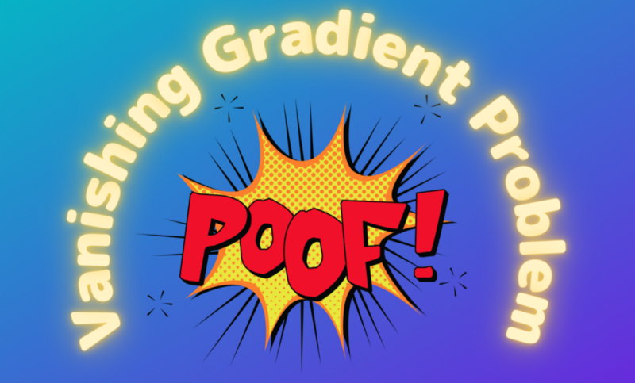

## How Activation Functions Have Evolved

What is the vanishing gradient problem? It is one of the most critical problems in the history of deep learning development. Let's understand why it's crucial and what efforts were made to solve the problem.

We often attribute the success of deep learning algorithms to increased computing power. The fact that we can calculate the gradients of deep neural networks so fast made it much more practical to train our models using the backpropagation algorithm.

In supervised learning, we identify how each weight in a network contributes to the final loss by using chains of gradients. Once we calculate a partial derivative of the final loss per weight, we can adjust each weight to reduce their contribution to the loss value. We repeat this process to minimize the loss from the network prediction.

However, in the early years of deep learning research, scientists found it challenging to backpropagate gradients from the final loss through multiple layers to the earlier network layers.

They found that gradients were vanishing.

The key to the problem was what kind of activation functions to use. Some activation functions can not produce large enough gradients, and the chaining of derivatives makes their slopes smaller and smaller as backpropagation goes through more and more layers.

This article discusses the following activation functions and how they work.

- Sigmoid
- Hyperbolic Tangent
- ReLU (Rectified Linear Unit)
- LReLU (Leaky ReLU)
- PReLU (Parametric ReLU)
- RReLU (Randomized ReLU)
- ELU (Exponential Linear Unit)

At the end, I will touch on activations within RNN and LSTM cells.

Activation functions evolved through the history of researchers fighting against the vanishing gradient problem.

## Sigmoid

The sigmoid function looks like the below:

$$
\sigma(x) = \frac{1}{1 + e^{-x}}
$$

At first glance, it might make us wonder why the function looks like that.

The easiest way to understand the sigmoid function is to think about a logistic regression problem, where we want to determine if something is true or false given a list of input features.

Let’s call that “something” as y and the probability of y as $P(y)$.

The range of $P(y)$ is $[0, 1]$, which is troublesome because we must make sure our prediction falls between 0 and 1 (both sides inclusive).

Instead, we can think of the odds of $y$, which we calculate as follows:

$$
\text{odds}(y) = \frac{P(y)}{1 - P(y)}
$$

The odds value tells us the ratio of $y$ being true versus $y$ being false. If $y$ being true has a high chance, the odds value is high (the numerator is closer to 1, and the denominator is near 0).

The odds can span between 0 to positive infinity, so there is less boundary restriction. However, it is still troublesome because we have to make sure our prediction must be 0 or positive.

Let’s take a logarithm of the odds, which we call logit:

$$
\text{logit}(y) = \log \frac{P(y)}{1 - P(y)}
$$

The logit spans from negative infinity to positive infinity. So, it is unbounded, and we have nothing extra to make sure.

Now, let’s assume we want to perform linear regression using a list of input features:

$$
x_1, \ x_2, \ \dots, \ x_n
$$

So, we are predicting the logits of y with the input features. We can write the problem as below:

$$
\text{logit}(y) = w_0 + w_1 x_1 + w_2 x_2 + \dots + w_n x_n
$$

We may solve this analytically or use gradient descents by adjusting the weights.

Once we finalize our weights, we can find out the probability of y from the logits:

$$
\begin{aligned}
\log \frac{P(y)}{1 - P(y)} &= \text{logit}(y) \\\\
\frac{P(y)}{1 - P(y)} &= e^{\text{logit}(y)} \\\\
P(y) &= e^{\text{logit}(y)}(1 - P(y)) \\\\
P(y)( 1 + e^{\text{logit}(y)} ) &= e^{\text{logit}(y)} \\\\
P(y) &= \frac{e^{\text{logit}(y)}}{1 + e^{\text{logit}(y)}} \\\\
P(y) &= \frac{1}{1 + e^{-\text{logit}(y)}} \\\\
P(y) &= \frac{1}{1 + e^{-(w_0 + w_1 x_1 + w_2 x_2 + \dots + w_n x_n)}} \\\\
P(y) &= \sigma(w_0 + w_1 x_1 + w_2 x_2 + \dots + w_n x_n)
\end{aligned}
$$

So, this is how the sigmoid function appears. We calculate the probability using the sigmoid function with a weighted sum of features as input.

The sigmoid function has the following shape:

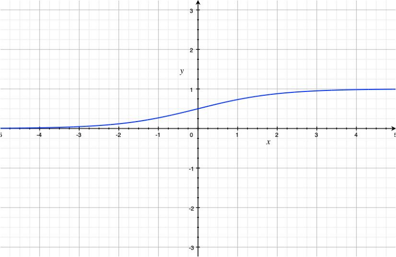

A single-layer (no hidden layer) neural network can use the sigmoid function in the output layer to perform logistic regression.

However, since the sigmoid function gave non-linear output, researchers tried using it for hidden layers of deeper neural networks.

Note: we need non-linear activation in hidden layers because the network can collapse into one linear layer. Having non-linearity makes layers produce more complex features.

The problem with using the sigmoid function as an activation function is its small derivative.

We can calculate the derivative of the sigmoid as follows:

$$
\frac{d}{dx} \sigma(x) = \frac{d}{dx} \frac{1}{1 + e^{-x}}
$$

Let’s define z as below:

$$
z = 1 + e^{-x}
$$

So, the sigmoid becomes:

$$
\sigma(x) = \frac{1}{z}
$$

Now, we continue with the derivative calculation:

$$
\begin{aligned}
\frac{d}{dx} \frac{1}{1 + e^{-x}} &= \frac{d}{dx} \frac{1}{z} \\\\
&= \frac{-1}{z^2}\frac{dz}{dx} \\\\
&= \frac{-1}{z^2}\frac{d(1 + e^{-x})}{dx} \\\\
&= \frac{-1}{z^2}(-e^{-x}) \\\\
&= \frac{1}{z^2}(e^{-x}) \\\\
&= \frac{1}{z^2}(z - 1) \\\\
&= \frac{1}{z}\frac{z - 1}{z} \\\\
&= \frac{1}{z}(1 - \frac{1}{z}) \\\\
&= \sigma(x) (1 - \sigma(x))
\end{aligned}
$$

The below graph is a plot of the derivative of the sigmoid function.

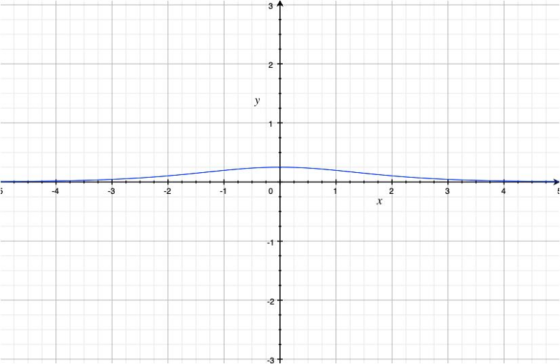

The maximum derivative of the sigmoid function is 0.25 at x=0.

We may use the sigmoid function in the last (output) layer for calculating the probability. Yet, we want a different activation function for hidden layers that can produce larger derivative values.

## Hyperbolic Tangent

In the early 1990s, Yann Le Cunn used the hyperbolic tangent function.

The hyperbolic tangent function is defined as follows:

$$
\tanh(x) = \frac{e^x - e^{-x}}{e^x + e^{-x}}
$$

The graph of the hyperbolic tangent looks as below:

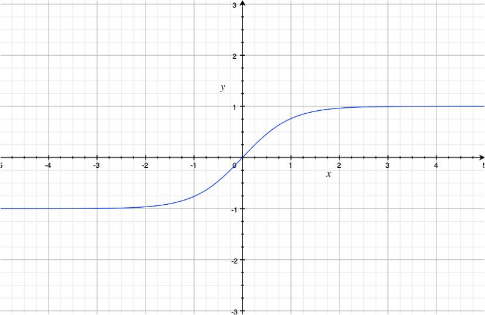

It resembles the sigmoid function, but the range is now $[-1, 1]$. Also, the slope became steeper.

The hyperbolic tangent function is a linear transformation of the sigmoid function:

$$
\tanh(x) = 2\sigma(2x) - 1
$$

The reason we prefer the hyperbolic tangent function instead of the sigmoid function for activation is that its derivative is larger:

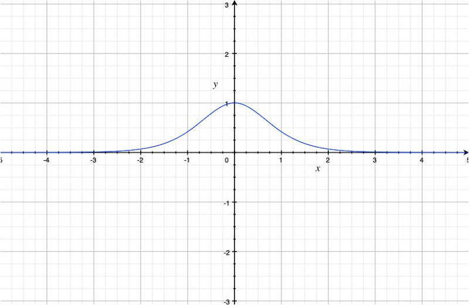

The maximum derivative of the hyperbolic tangent function is 1.0 at x=0.

So, this is better than the sigmoid function to deal with the vanishing gradient problem.

However, suppose a network has multiple layers with the hyperbolic tangent function as activation. In that case, it can still cause the vanishing gradient problem because the derivative is less than $1$ other than at $x=0$ and is very small. It is better than the sigmoid function as activation, but it’s not great, either.

We want a different activation function for hidden layers to produce large derivative values other than just at x = 0.

## ReLU (Rectified Linear Unit)

In 2010, Geoffrey Hinton et al. introduced the ReLU activation to improve learning with the restricted Boltzmann machines.

The ReLU function is defined as follows:

$$
\text{relu}(x) = \max(0, x)
$$

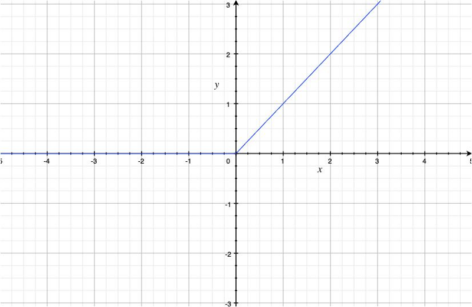

As we can see, the ReLU function is non-linear, and the derivative is $1$ where $x \gt 0$.

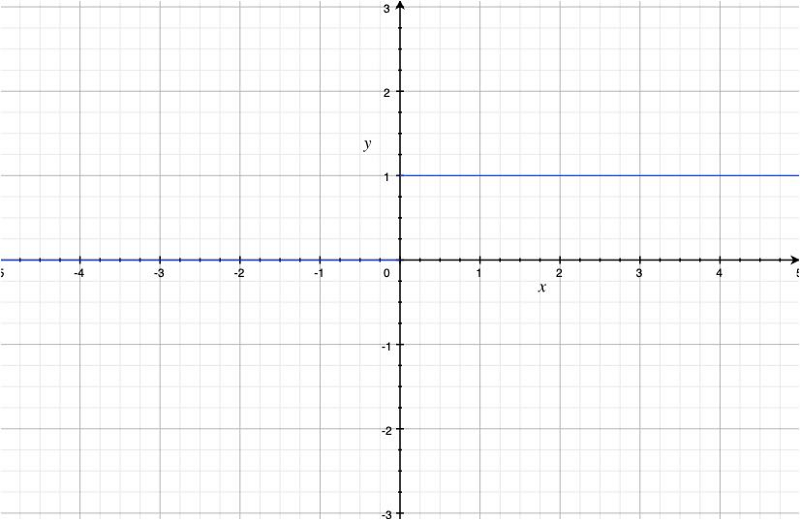

Mathematically, the derivative of the ReLU function is not defined at x = 0 because the left-derivative is 0 at $x=0$, but the right-derivative is $1$ at $x=0$.

But an undefined derivative would cause a problem if it happens during training. So, in practice, the derivative of the ReLU function is either 0 or 1 at x = 0.

The ReLU function is excellent in solving the vanishing gradient problem, and it became a standard practice to use it as activation in deep learning layers.

In 2012, AlexNet used the ReLU activation and won the ILSVRC 2012 competition.

The ReLU activation introduces sparsity because it kills some of the neuron outputs. So, only necessary signals go through the ReLU activation, making it easier for later layers to pick up relevant features and discard noises.

However, it introduces another problem because some neurons may never output non-negative values.

We call it the dying ReLU problem when neurons with the ReLU activation constantly become inactive, producing only 0 for any input. If there are so many zeros from a layer, it becomes useless.

To solve this issue, we must carefully initialize network weights (i.e., He initialization) and use batch normalization to keep values within a specific range.

Apart from the initialization and batch normalization, there are additional ways to avoid the vanishing gradient problem by modifying the ReLU activation function to avoid the shortcoming of the original ReLU activation.

## LReLU (Leaky ReLU)

In 2013, Andrew Y. Ng et al. introduced the Leaky ReLU function.

The Leaky ReLU function is defined as follows:

$$
\text{leaky-relu}(x) = \begin{cases}
x & \text{if } x > 0 \\
\alpha x & \text{otherwise, where } 0 < \alpha < 1
\end{cases}
$$

For example, with alpha = 0.1, the function looks like the below:

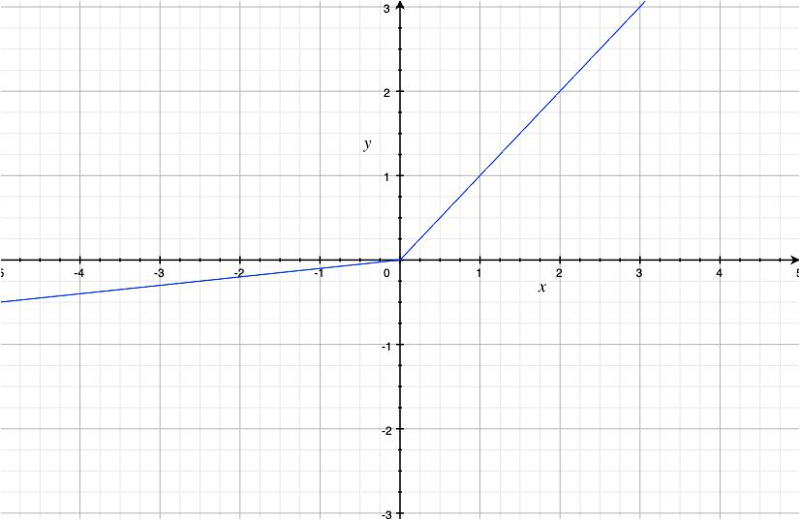

It avoids the dying ReLU problem by using a coefficient alpha for negative values.

The derivative now looks as below:

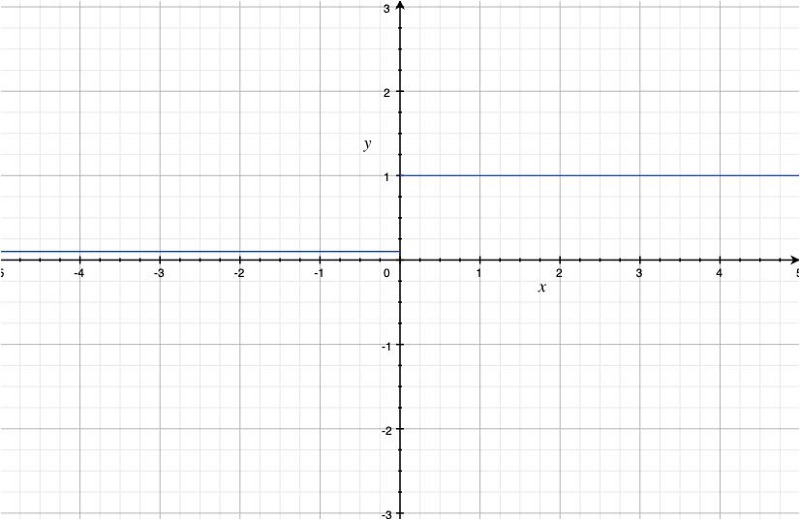

We solved the dying ReLU problem but also introduced a new hyper-parameter which we must manually decide. As this affects how a neural network learns, it becomes a new problem.

## PReLU (Parametric ReLU)

The parametric ReLU function has the same formula as the Leaky ReLU function except that the alpha is a learning parameter, not a hyperparameter.

$$
\text{prelu}(x) = \begin{cases}
x & \text{if } x > 0 \\
\alpha x & \text{otherwise, where } 0 < \alpha < 1
\end{cases}
$$

The network learns the alpha with the backpropagation, so we don’t have to search for the best value.

## RReLU (Randomized ReLU)

In early 2015, the Microsoft research team published a paper on randomized ReLU activation.

The randomized ReLU function has the same formula as the Leaky ReLU function, except that the alpha is randomized by sampling uniformly from a given range. For example, $[\frac{1}{8}, \frac{1}{3}]$.

$$
\text{rrelu}(x) = \begin{cases}
x & \text{if } x > 0 \\
\alpha x & \text{otherwise, where } \alpha \sim U[l, u], \ l < u, \ l, u \in [0, 1)
\end{cases}
$$

The reason to introduce the randomness is that the researchers found that using a constant value for the alpha causes overfitting.

Once the training is over, they use a deterministic value for the alpha, the lower and upper bound average. For example, $(\frac{1}{8} + \frac{1}{3})/2$.

## ELU (Exponential Linear Unit)

In late 2015, Sepp Hochreiter et al. introduced the Exponential Linear Unit activation.

$$
\text{elu}(x) = \begin{cases}
x & \text{if } x > 0 \\
\alpha (e^x - 1) & \text{otherwise, where } \alpha > 0
\end{cases}
$$

They found that the ReLU activation adds positive bias because it is a non-negative function. The bias shift accumulates through multiple layers with the ReLU activation, making it difficult for neural networks to learn.

The LReLU, PReLU, and RReLU allow negative values, which means large negative values may significantly impact activation. In contrast, the original ReLU discards negative values and creates more sparsity.

The ELU function reduces positive bias and keeps the mean value closer to zero. It also saturates negative values, which are more robust against negative (noisy) values like the original ReLU.

With the alpha = 1 (it seems that practitioners often use that value), the function looks like the below:

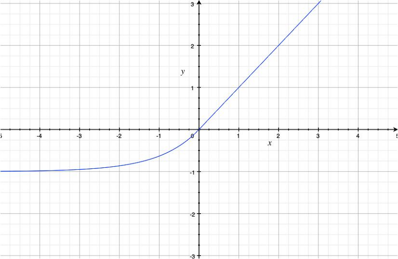

As you can see, it is less biased towards positive values than the ReLU function, and it saturates negative values.

The derivative of the ELU function looks as below:

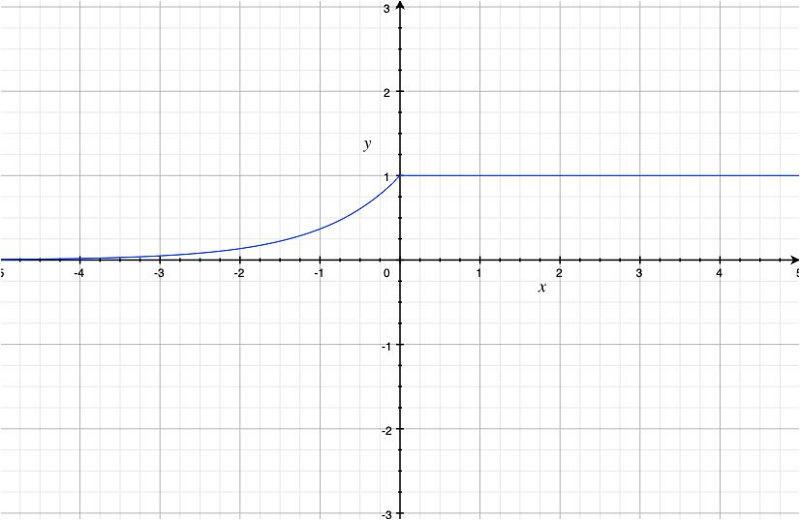

According to the authors, the ELU activation makes the training (the convergence of the loss curve) faster.

## RNN and LSTM

Recurrent Neural Networks (RNNs) also suffer from the vanishing gradient problem. Early RNNs use the hyperbolic tangent function as their activation function in an RNN cell.

In 1997, Sepp Hochreiter and Jürgen Schmidhuber introduced Long Short-Term Memory (LSTM) to solve this problem.

They used the sigmoid functions as a gating mechanism (forget, input, and output gates).

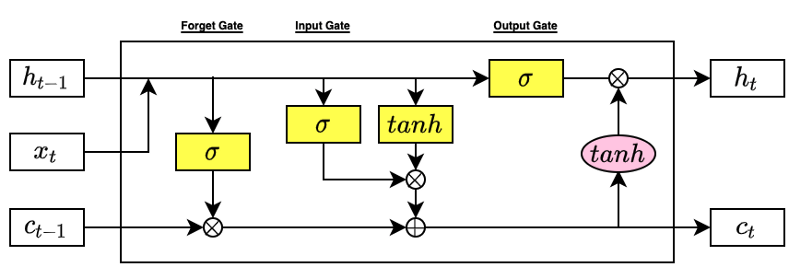

---

As you can see, researchers have been fighting against the vanishing gradient problem and improving the effectiveness of deep neural network training over the years.

There are other activation functions like ReLU6, Swish, hard Swish, etc., and they have specific purposes like low-precision computing.

However, many of them are variations of the core activation functions.

## References

- [Gradient Descent Optimizers](/blog/2021-08-29-gradient-descent-optimizers/)
- [Eigenvalues of covariance matrices: Application to neural-network learning](http://yann.lecun.com/exdb/publis/pdf/lecun-kanter-solla-91.pdf) \
  Yann Le Cunn, Ido Kanter, Sara A. Solla
- [Rectified Linear Units Improve Restricted Boltzmann Machines](https://www.cs.toronto.edu/~fritz/absps/reluICML.pdf) \
  Vinod Nair, Geoffrey E. Hinton
- [ImageNet Classification with Deep Convolutional Neural Networks](https://papers.nips.cc/paper/2012/hash/c399862d3b9d6b76c8436e924a68c45b-Abstract.html) \
  Alex Krizhevsky, Ilya Sutskever, Geoffrey E. Hinton
- [Dying ReLU and Initialization: Theory and Numerical Examples](https://arxiv.org/abs/1903.06733) \
  Lu Lu, Yeonjong Shin, Yanhui Su, George Em Karniadakis
- [Delving Deep into Rectifiers: Surpassing Human-Level Performance on ImageNet Classification](https://arxiv.org/abs/1502.01852v1) \
  Kaiming He, Xiangyu Zhang, Shaoqing Ren, Jian Sun
- [Rectifier Nonlinearities Improve Neural Network Acoustic Models](https://ai.stanford.edu/~amaas/papers/relu_hybrid_icml2013_final.pdf) \
  Andrew L. Maas, Awni Y. Hannun, Andrew Y. Ng
- [ImageNet Large Scale Visual Recognition Challenge 2012 (ILSVRC2012)](https://image-net.org/challenges/LSVRC/2012/index.php) \
  ImageNet
- [Empirical Evaluation of Rectified Activations in Convolutional Network](https://arxiv.org/abs/1505.00853) \
  Bing Xu, Naiyan Wang, Tianqi Chen, Mu Li
- [Fast and Accurate Deep Network Learning by Exponential Linear Units (ELUs)](https://arxiv.org/abs/1511.07289) \
  Djork-Arne ́ Clevert, Thomas Unterthiner &amp; Sepp Hochreiter
- [Long Short-Term Memory](https://www.researchgate.net/publication/13853244_Long_Short-term_Memory) \
  Sepp Hochreiter, Jürgen Schmidhuber
