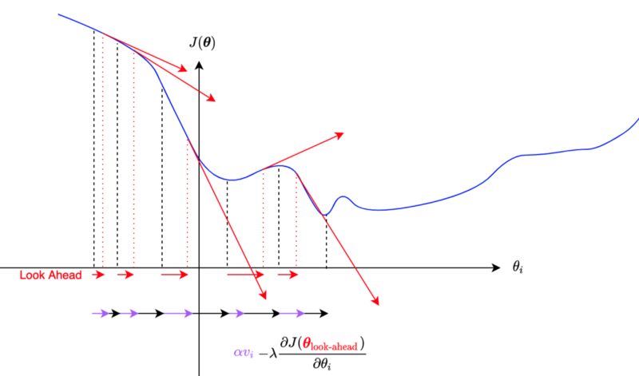
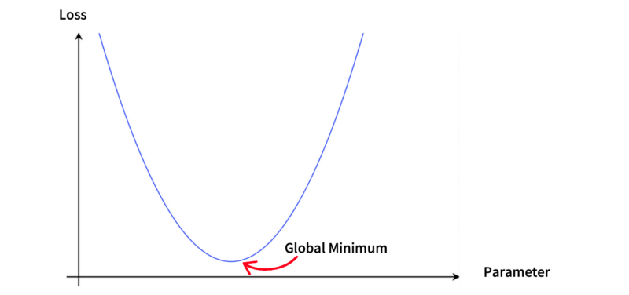
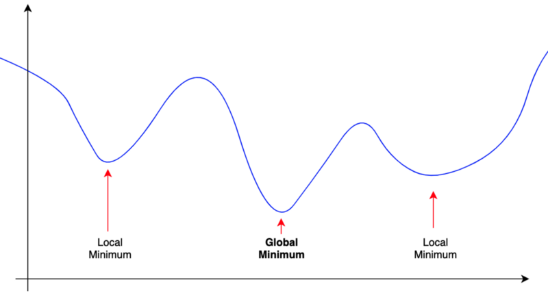
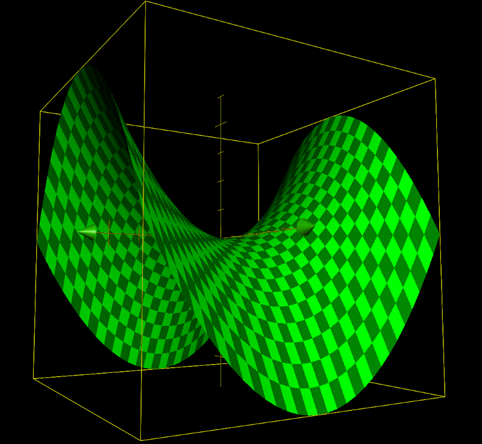
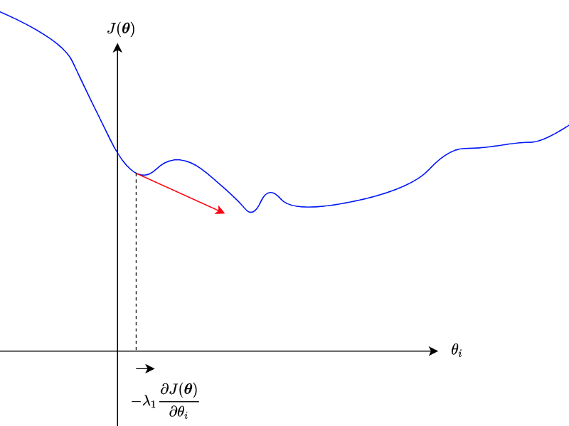
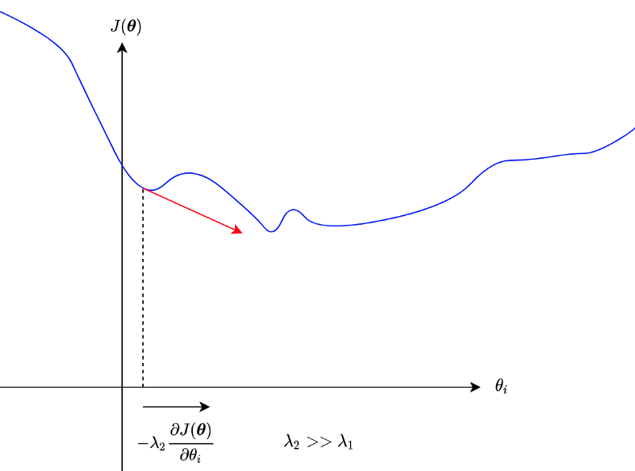
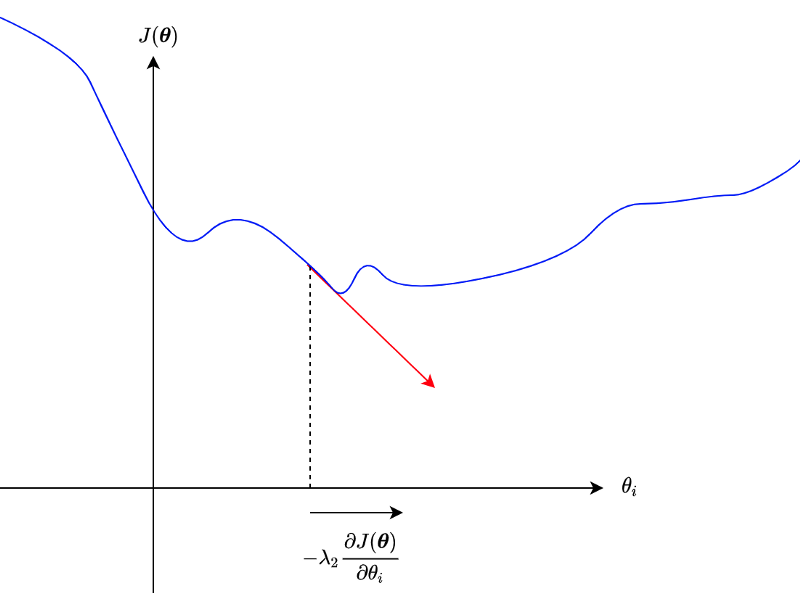
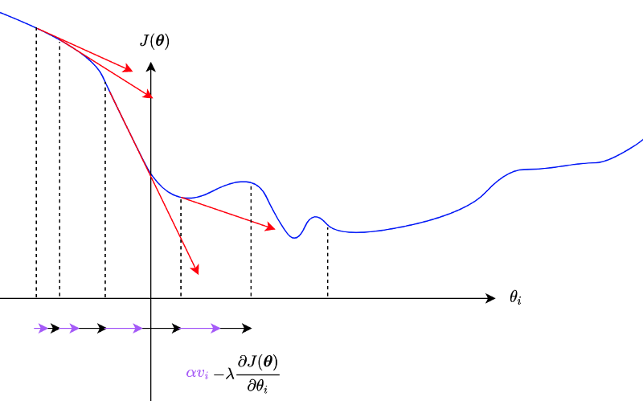
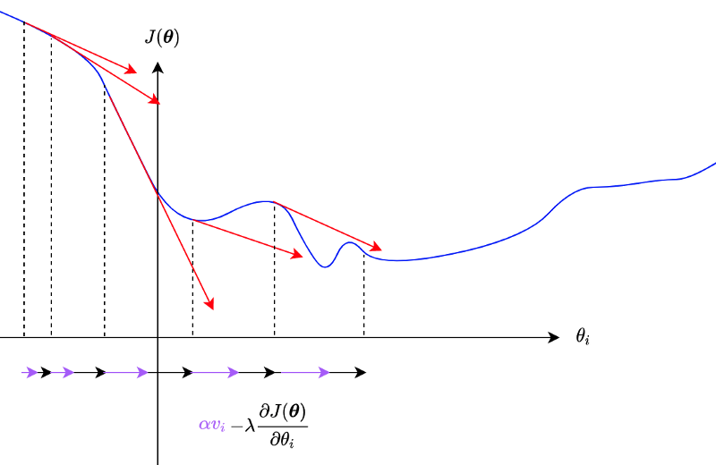

## Gradient Descent Optimizers

Why do we need Gradient Descent Optimizers? In machine learning, we aim to minimize the difference between predicted and label values. In other words, we want to minimize loss functions. If a loss function is a simple parabola with one parameter, it has one minimum, and we can even solve it with a pen and paper.

But an actual loss function typically has multiple minima, hopefully with only one global minimum.

We don't want to get stuck with local minima. We want to climb mountains and continue to explore until we find the global minimum.

In deep learning, we treat a deep neural network as a function with many parameters like weights and biases. As there are multiple dimensions, there could be saddle points that are both minimum and maximum, like the one below.

In a high-dimensional world, a saddle point may be minimum for some parameters and maximum for others. If the slopes around the saddle point are very shallow, it may not be easy to get out of the saddle point.

Analytically solving the minimization problem with a complex loss function with multiple local minima and saddle points is impractical.

As such, we use a numerical solution like the stochastic gradient descent algorithm by iteratively adjusting parameters to reduce the loss value.

Researchers invented optimizers to avoid getting stuck with local minima and saddle points and find the global minimum as efficiently as possible.

In this article, we discuss the following:

- SGD
- Momentum
- Nesterov Momentum
- AdaGrad
- RMSprop
- AdaDelta
- ADAM

## Loss Function and the Gradient

Let's define some terminology first.

A neural network $f$ takes an input $\boldsymbol{x}$ and makes a prediction.

$$
\hat{\boldsymbol{y}} = f(\boldsymbol{x}; \boldsymbol{\theta})
$$

$\boldsymbol{\theta}$ is a collection of network parameters. Suppose we have N parameters like weights and biases in a network, $\boldsymbol{\theta}$ would be a vector with $N$ parameters.

$$
\boldsymbol{\theta} = (\theta_1, \theta_2, \dots, \theta_N)
$$

For example, $\boldsymbol{x}$ may be an image from MNIST with 28x28 pixels, and the prediction is a vector of probability for each of 10 digit numbers.

A loss function $L$ compares label values and predicted values and returns a scalar loss value:

$$
L(\boldsymbol{y}, \hat{\boldsymbol{y}})
$$

The smaller the loss value is, the better the quality of the prediction.

In deep learning, we deal with a massive amount of data and often use a batch of input data to adjust network parameters, and a loss value would be an average of loss values from a batch.

$$
J(\boldsymbol{\theta}) = \frac{1}{m} \sum\limits_{i=1}^m L(\boldsymbol{y}^{(i)}, \hat{\boldsymbol{y}}^{(i)})
$$

The value $m$ is the batch size.

In this article, when discussing a loss function, we mean $J(\boldsymbol{\theta})$  —  a function of network parameters where the label values and predicted values are all fixed. As such, we only adjust the network parameters to minimize the loss function by updating parameters to the opposite direction of the loss gradient.

A gradient is a vector of partial derivatives like the one below:

$$
\boldsymbol{g} = \nabla J(\boldsymbol{\theta}) = \left( \frac{\partial J(\boldsymbol{\theta})}{\partial \theta_1}, \frac{\partial J(\boldsymbol{\theta})}{\partial \theta_2}, \dots, \frac{\partial J(\boldsymbol{\theta})}{\partial \theta_N},\right)
$$

Each component of a gradient $\boldsymbol{g}$ is a partial derivative of $J(\boldsymbol{\theta})$ by an element of $\boldsymbol{\theta}$. I use $\boldsymbol{g}$ and $\nabla J(\boldsymbol{\theta})$ interchangeably. I mostly use $\nabla J(\boldsymbol{\theta})$, but I also use $\boldsymbol{g}$ for conciseness in some cases.

### SGD

The name SGD came from the stochastic gradient descent algorithm itself, and as such, it is the most straightforward optimizer in this article.

We update each parameter to the opposite direction of the partial derivative.

$$
\theta_i \leftarrow \theta_i - \lambda \frac{\partial J(\boldsymbol{\theta})}{\partial \theta_i}
$$

λ is a learning rate that controls how much to update. It is a hyper-parameter that we must decide for training.

So, we do this for all $N$ parameters.

$$
\begin{aligned}
\theta_1 &\leftarrow \theta_1 - \lambda \frac{\partial J(\boldsymbol{\theta})}{\partial \theta_1} \\\\
\theta_2 &\leftarrow \theta_2 - \lambda \frac{\partial J(\boldsymbol{\theta})}{\partial \theta_2} \\\\
&\quad\vdots \\\\
\theta_N &\leftarrow \theta_N - \lambda \frac{\partial J(\boldsymbol{\theta})}{\partial \theta_N}
\end{aligned}
$$

We can write the above in one line like below:

$$
\boldsymbol{\theta} \ \leftarrow \ \boldsymbol{\theta} - \lambda \nabla J(\boldsymbol{\theta})
$$

As mentioned, we don't want to get stuck at a local minimum or a saddle point. But if partial derivatives are small, those parameters may not move much.

We could potentially use a large enough learning rate to go beyond hills.

However, we don't want to skip the global minimum, either.

As we can see, controlling how much to update parameters is not a trivial task.

### Momentum

Using momentum is another way to escape from local minima and saddle points.

$$
\begin{aligned}
v_i &\leftarrow \alpha v_i - \lambda \frac{\partial J(\boldsymbol{\theta})}{\partial \theta_i} \\\\
\theta_i &\leftarrow \theta_i + v_i
\end{aligned}
$$

For each parameter, $v$ accumulates the partial derivative, and $\alpha$ is a momentum factor (i.e., 0.9), which gradually decays the effect of past partial derivatives.

A steep slope would add more and more momentum.

We can write it as below for all parameters:

$$
\begin{aligned}
\boldsymbol{v} &\leftarrow \alpha \boldsymbol{v} - \lambda \nabla J(\boldsymbol{\theta}) \\\\
\boldsymbol{\theta} &\leftarrow \boldsymbol{\theta} + \boldsymbol{v}
\end{aligned}
$$

$\boldsymbol{v}$ accumulates gradients element-wise.

When $\alpha$ is zero, the above update method is the same as SGD. As such, SGD optimizer implementation usually accepts a momentum factor as input.

The problem with the momentum is that it may overshoot the global minimum due to accumulated gradients.

### Nesterov Momentum

In Nesterov momentum, we calculate gradients at the parameters' approximated future (look-ahead) position.

$$
\boldsymbol{\theta}_{\text{look-ahead}} \leftarrow \boldsymbol{\theta} + \alpha \boldsymbol{v}
$$

We update the momentum by using the partial derivative at an approximate future position of a parameter.

$$
v_i \leftarrow \alpha v_i + \lambda \frac{\partial J(\boldsymbol{\theta}_\text{look-ahead})}{\partial \theta_i}
$$

So, the momentum is updated with the gradient at a look-ahead position, incorporating future gradient values into the current parameter update.

If the gradients are getting smaller, the Nesterov momentum will react to that faster than the original momentum algorithm.

Other than using the look-ahead gradient, it is the same as SGD with the original momentum algorithm.

$$
\begin{aligned}
&\boldsymbol{\theta}_\text{look-ahead} \leftarrow \boldsymbol{\theta} + \alpha \boldsymbol{v} \\\\
&\boldsymbol{v} \leftarrow \alpha \boldsymbol{v} - \lambda \nabla J(\boldsymbol{\theta}_\text{look-ahead}) \\\\
&\boldsymbol{\theta} \leftarrow \boldsymbol{\theta} + \boldsymbol{v}
\end{aligned}
$$

The difference between the original and the Nesterov momentum algorithms is more apparent if we write the loss calculation explicitly:

__The original momentum update formula__:

$$
\boldsymbol{v} \leftarrow \alpha \boldsymbol{v} - \lambda \nabla_\boldsymbol{\theta} \Biggl[ \frac{1}{m} \sum\limits_{i=1}^m L\left(f(\boldsymbol{x}^{(i)}; \boldsymbol{\theta}), \ \boldsymbol{y}^{(i)}\right) \Biggr]
$$

__The Nesterov momentum update formula__:

$$
\boldsymbol{v} \leftarrow \alpha \boldsymbol{v} - \lambda \nabla_\boldsymbol{\theta} \Biggl[ \frac{1}{m} \sum\limits_{i=1}^m L\left(f(\boldsymbol{x}^{(i)}; \boldsymbol{\theta} + \alpha \boldsymbol{v}), \ \boldsymbol{y}^{(i)}\right) \Biggr]
$$

So, we are calculating the gradient using look-ahead parameters. Suppose the gradient is going to be smaller at the look-ahead position; the momentum will become less even before the parameter moves to the location, which reduces the overshooting problem.

It is like walking down a hill. You can walk fast when the slope continues to be steep, but when you look ahead and see the slope getting shallow, you can start slowing down.

Notes on Learning Rate Scheduler: as an aside, there is another way to control the learning rate using a learning rate scheduler. Deep learning frameworks like TensorFlow and PyTorch provide learning rate schedulers to adjust learning rates. You can gradually reduce (or even increase in some schedulers) the learning rate over the batches/epochs.

### AdaGrad

SGD applies the same learning rate to all parameters. With momentum, parameters may update faster or slower individually.

However, if a parameter has a small partial derivative, it updates very slowly, and the momentum may not help much. Also, we don't want a parameter with a substantial partial derivative to update too fast.

In 2011, John Duchi et al. published [a paper](https://jmlr.org/papers/v12/duchi11a.html) on the AdaGrad (Adaptive Gradient) algorithm.

AdaGrad adjusts the learning rate for each parameter depending on the squared sum of past partial derivatives.

$$
\begin{aligned}
&r_i \leftarrow r_i + \left( \frac{\partial J(\boldsymbol{\theta})}{\partial \theta_i} \right)^2 \\\\
&\theta_i \leftarrow \theta_i - \frac{\lambda}{\sqrt{r_i} + \epsilon} \frac{\partial J(\boldsymbol{\theta})}{\partial \theta_i}
\end{aligned}
$$

$\epsilon$ is there to avoid the divide-by-zero problem. PyTorch implementation of AdaGrad uses 1e-10 for $\epsilon$.

We can write the above for all parameters as follows:

$$
\begin{aligned}
&\boldsymbol{r} \leftarrow \boldsymbol{r} + \boldsymbol{g} \odot \boldsymbol{g} \\\\
&\boldsymbol{\theta} \leftarrow \boldsymbol{\theta} - \frac{\lambda}{\sqrt{\boldsymbol{r}} + \epsilon} \odot \boldsymbol{g}
\end{aligned}
$$

The circle dot symbol means element-wise multiplication. In other words, we square each element of the gradient. The square root on the ___r___ is also an element-wise operation.

So, if a parameter has a steep partial derivative, the effective learning rate becomes smaller. For a shallow slope, the effective learning rate becomes relatively more significant.

The algorithm works effectively in some cases, but it has a problem in that it keeps accumulating the squared gradients from the beginning. Depending on where parameters are at initialization, it may be too aggressive to reduce the effective learning rate for some of the parameters.

Geoffrey Hinton solved AdaDelta's problem with RMSprop.

### RMSprop

In 2012, Geoffrey Hinton proposed RMSprop while teaching online in Coursera. He didn't publish a paper on this. However, there is [a presentation pdf](http://www.cs.toronto.edu/~tijmen/csc321/slides/lecture_slides_lec6.pdf), which we can see. RMSprop became well-known, and both PyTorch and TensorFlow support it.

RMSprop calculates an exponentially decaying average of squared gradients. It's probably easier to understand by seeing the formula:

$$
\begin{aligned}
&r_i \leftarrow \rho \, r_i + (1 - \rho) \left( \frac{\partial J(\boldsymbol{\theta})}{\partial \theta_i} \right)^2 \\\\
&\theta_i \leftarrow \theta_i - \frac{\lambda}{\sqrt{r_i} + \epsilon} \frac{\partial J(\boldsymbol{\theta})}{\partial \theta_i}
\end{aligned}
$$

$\rho$ controls the decay of the exponentially decaying average of squared gradients. Hinton suggested 0.9, whereas PyTorch's default is 0.99.

So, the effect of older gradients diminishes over the training cycles, which avoids the problem of AdaGrad's diminishing effective learning rates.

The same thing can be written for all parameters as follows:

$$
\begin{aligned}
&\boldsymbol{r} \leftarrow \rho \, \boldsymbol{r} + (1 - \rho) \boldsymbol{g} \odot \boldsymbol{g} \\\\
&\boldsymbol{\theta} \leftarrow \boldsymbol{\theta} - \frac{\lambda}{\sqrt{\boldsymbol{r}} + \epsilon} \odot \boldsymbol{g}
\end{aligned}
$$

We can combine RMSprop with momentum.

There is another variation of AdaGrad, which solves the same problem. It is called AdaDelta.

### AdaDelta

In 2021, Matthew D. Zeiler published [a paper](https://arxiv.org/abs/1212.5701) on AdaDelta. He developed AdaDelta independently from Hinton, but it has the same idea of using the exponentially decaying average of squared gradients — with a few more tweaks.

$$
r_i \leftarrow \rho \, r_i + (1 - \rho) \left( \frac{\partial J(\boldsymbol{\theta})}{\partial \theta_i} \right)^2
$$

AdaDelta calculates a parameter-specific learning rate $\lambda_i$ as follows:

$$
\lambda_i = \frac{\sqrt{d_i} + \epsilon}{\sqrt{r_i} + \epsilon}
$$

The value of $d_i$ is the exponential decaying average of the squared parameter delta (more on this soon). Initially, the value of $d_i$ is zero since we haven't had any parameter updates yet.

One benefit of the algorithm is that AdaDelta adapts the learning rate for each parameter, and we do not specify a global learning rate as in other optimizers.

Using the adaptable learning rate for a parameter, we can express a parameter delta as follows:

$$
\Delta \theta_i = \lambda_i \frac{\partial J(\boldsymbol{\theta})}{\partial \theta_i}
$$

And we update the parameter like the one below:

$$
\theta_i \leftarrow \theta_i - \Delta \theta_i
$$

As for the exponentially decaying average of squared parameter deltas, we calculate like below:

$$
d_i \leftarrow \rho \, d_i + (1 - \rho) (\Delta \theta_i)^2
$$

It works like the momentum algorithm maintaining the learning rate to the recent level (provided _v_ stays more or less the same) until the decay kicks in significantly.

We can write the above for all parameters as follows:

$$
\begin{aligned}
&\boldsymbol{r} \leftarrow \rho \, \boldsymbol{r} + (1 - \rho) \boldsymbol{g} \odot \boldsymbol{g} \\\\
&\boldsymbol{\lambda} = \frac{\sqrt{\boldsymbol{d}} + \epsilon}{\sqrt{\boldsymbol{r}} + \epsilon} \\\\
&\Delta \boldsymbol{\theta} = \boldsymbol{\lambda} \odot \boldsymbol{g} \\\\
& \boldsymbol{d} \leftarrow \rho \, \boldsymbol{d} + (1-\rho) (\Delta \boldsymbol{\theta})^2 \\\\
& \boldsymbol{\theta} \leftarrow \boldsymbol{\theta} - \Delta \boldsymbol{\theta}
\end{aligned}
$$

However, PyTorch supports a global learning rate for AdaDelta. So, the parameter update of AdaDelta in PyTorch works like the one below:

$$
\boldsymbol{\theta} \leftarrow \boldsymbol{\theta} + \text{lr}\, \Delta \boldsymbol{\theta}
$$

The default value of lr in PyTorch is 1.0, which works like the original AdaDelta algorithm. Additionally, we can control the global learning rate through a learning rate scheduler when it makes sense.

### ADAM

In 2015, Durk Kingma et al. published a paper on ADAM (Adaptive Moment Estimation) algorithm.

Like RMSprop and AdaDelta, ADAM uses the exponentially decaying average of squared gradients.

$$
r_i \leftarrow \beta_2 r_i + (1 - \beta_2) \left( \frac{\partial J(\boldsymbol{\theta})}{\partial \theta_i} \right)^2
$$

I used the _β_ symbol as the coefficient name instead of _ρ_ used in the RMSprop section. The reason for that is ADAM also uses the exponentially decaying average of gradients.

$$
v_i \leftarrow \beta_1 v_i + (1 - \beta_1) \frac{\partial J(\boldsymbol{\theta})}{\partial \theta_i}
$$

So, $v$ works like momentum, accumulating recent gradients while decaying past gradients.

ADAM initializes the exponentially decaying averages $r$ and $v$ as zeros. As betas are typically close to 1 (for example, in PyTorch, beta1 is 0.9, beta2 is 0.999), $r$ and $v$ tend to stay close to zero for possibly a long time if we don't have some way to mitigate the problem.

So, ADAM uses the following adjustment:

$$
\begin{aligned}
\hat{r}_i &= \frac{r_i}{1 - \beta_2^t} \\\\
\hat{v}_i &= \frac{v_i}{1 - \beta_1^t}
\end{aligned}
$$

Since betas are close to 1, the denominators are close to zero, making $r$ and $v$ bigger than without such adjustment.

The effect of the beta adjustments will eventually diminish as the value of $t$ increments as an update occurs.

All in all, the parameter update formula becomes as below:

$$
\theta_i \leftarrow \theta_i - \frac{\lambda}{\sqrt{\hat{r}_i} + \epsilon} \hat{v}_i
$$

So, ADAM works like a combination of RMSprop and momentum.

We can write the above for all parameters:

$$
\begin{aligned}
&\boldsymbol{v} \leftarrow \beta_1 \boldsymbol{v} + (1 - \beta_1) \boldsymbol{g} \\\\
&\boldsymbol{r} \leftarrow \beta_2 \boldsymbol{r} + (1 - \beta_2) \boldsymbol{g} \odot \boldsymbol{g} \\\\\\
&\hat{\boldsymbol{v}} = \frac{\boldsymbol{v}}{1 - \beta_1} \\\\
&\hat{\boldsymbol{r}} = \frac{\boldsymbol{r}}{1 - \beta_2} \\\\\\
&\boldsymbol{\theta} \leftarrow \boldsymbol{\theta} - \frac{\lambda}{\sqrt{\hat{\boldsymbol{r}}} + \epsilon} \hat{\boldsymbol{v}}
\end{aligned}
$$

## References

- [Vanishing Gradient Problem](/blog/2021-08-15-vanishing-gradient-problem/)
- [Adaptive Subgradient Methods for Online Learning and Stochastic Optimization (2011)](https://jmlr.org/papers/v12/duchi11a.html) \
  John Duchi, Elad Hazan, Yoram Singer
- [Neural Networks for Machine Learning: Lecture 6a Overview of mini-batch gradient descent (2012)](http://www.cs.toronto.edu/~tijmen/csc321/slides/lecture_slides_lec6.pdf) \
  Geoffrey Hinton, Nitish Srivastava, Kevin Swersky
- [ADADELTA: An Adaptive Learning Rate Method (2012)](https://arxiv.org/abs/1212.5701) \
  Matthew D. Zeiler
- [Adam: A Method for Stochastic Optimization (2015)](https://arxiv.org/abs/1412.6980) \
  Diederik P. Kingma, Jimmy Ba
