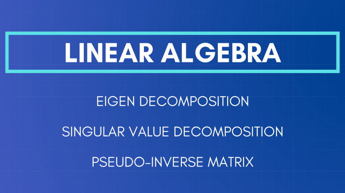
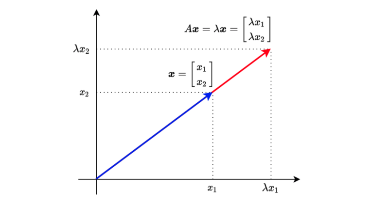
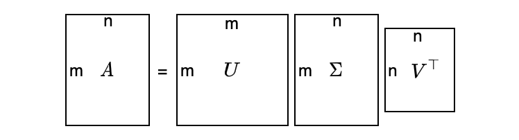
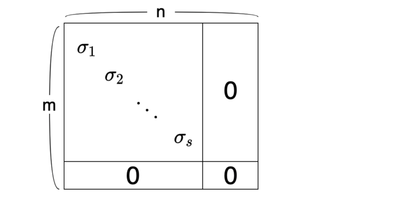

## Matrix Decomposition

In this article, we discuss the following Matrix Decomposition topics:

- Square Matrix
- Eigenvalue and Eigenvector
- Symmetric Matrix
- Eigen Decomposition
- Orthogonal Matrix
- Singular Value Decomposition
- PSeudo-inverse Matrix

## Square Matrix


Eigen Decomposition works only with square matrices.

As a quick reminder, let's look at a square matrix. In square matrices, the number of rows and columns are the same.

For example,

$$
A = \begin{bmatrix}
4 & 1 \\
3 & 2
\end{bmatrix}
$$

That was easy. Let's continue with Eigenvalue and Eigenvector concepts.

## Eigenvalue and Eigenvector

When a square matrix A and a vector $x$ have the following relationship:

$$
A \mathbf{x} = \lambda \mathbf{x}
$$

, we call λ __eigenvalue__ and the vector x __eigenvector__. λ is a scalar.

The above means that multiplying vector $x$ with matrix $A$ produces the same result as multiplying vector $x$ with scalar value $\lambda$.



Let's move everything to the left side of the equation to find the condition for having eigenvalues and eigenvectors.

$$
(A - \lambda I) \mathbf{x} = \mathbf{0}
$$

For vector $x$ to be non-zero, no inverse matrix of $(A— \lambda I)$ should exist. In other words, $(A — \lambda I) $'s determinant must be zero.

$$
\det(A - \lambda I) = 0
$$

Let's use the 2x2 square matrix as an example to calculate the determinant:

$$
A = \begin{bmatrix}
4 & 1 \\
3 & 2
\end{bmatrix}
$$

So, $(A — \lambda I)$ is:

$$
A - \lambda I = \begin{bmatrix}
4 - \lambda & 1 \\
3 & 2 - \lambda
\end{bmatrix}
$$

And we calculate the determinant (and we want it to be zero):

$$
\begin{aligned}
\det(A - \lambda I) &= \begin{vmatrix}
4 - \lambda & 1 \\
3 & 2 - \lambda
\end{vmatrix} \\\\
&= (4 - \lambda)(2 - \lambda) - 3 \\\\
&= 8 - 6\lambda + \lambda^2 - 3 \\\\
&= \lambda^2 - 6\lambda + 5 \\\\
&= (\lambda - 1)(\lambda - 5) \\\\
&= 0
\end{aligned}
$$

Therefore, $\lambda$ is either 1 or 5.

Let's define the eigenvector as follows:

$$
\mathbf{x} = \begin{bmatrix}
x_1 \\
x_2
\end{bmatrix}
$$

As a reminder, we have the following equation for eigenvalue and eigenvector:

$$
(A - \lambda I) = 0
$$

We can calculate the eigenvector $x$ for $\lambda=1$ as follows:

$$
\begin{aligned}
A &= \begin{bmatrix}
4 - 1 & 1 \\
3 & 2 - 1
\end{bmatrix} \begin{bmatrix}
x_1 \\
x_2
\end{bmatrix} = \begin{bmatrix}
0 \\
0
\end{bmatrix} \\\\
&\therefore 3 x_1 + x_2 = 0
\end{aligned}
$$

To satisfy the above conditions, $x_1$ and $x_2$ are:

$$
\begin{aligned}
x_1 &= -\frac{1}{3} t \\
x_2 &= t
\end{aligned}
$$

Although <em>t</em> can be any value, we often make the L2 norm to be a size of 1 since, otherwise, we have an infinite number of possible solutions:

$$
x_1^2 + x_2^2 = 1
$$

The eigenvector for the eigenvalue $\lambda=1$ is:

$$
\mathbf{x} = \begin{bmatrix}
-\frac{1}{\sqrt{10}} \\
\frac{3}{\sqrt{10}}
\end{bmatrix}
$$

or

$$
\mathbf{x} = \begin{bmatrix}
\frac{1}{\sqrt{10}} \\
-\frac{3}{\sqrt{10}}
\end{bmatrix}
$$

They are the same, except that one vector direction is the opposite. So, I'll choose the first one as the eigenvector for $\lambda=1$.

Let's make sure this works as intended:

$$
\begin{aligned}
A\mathbf{x} &= \begin{bmatrix}
4 & 1 \\
3 & 2 
\end{bmatrix} \begin{bmatrix}
-\frac{1}{\sqrt{10}} \\
\frac{3}{\sqrt{10}}
\end{bmatrix} \\\\
&= \begin{bmatrix}
4 \cdot -\frac{1}{\sqrt{10}} + 1 \cdot \frac{3}{\sqrt{10}} \\
3 \cdot -\frac{1}{\sqrt{10}} + 2 \cdot \frac{3}{\sqrt{10}}
\end{bmatrix} \\\\
& = \begin{bmatrix}
-\frac{1}{\sqrt{10}} \\
\frac{3}{\sqrt{10}}
\end{bmatrix} \\\\
&= 1 \mathbf{x}
\end{aligned}
$$

We can solve for $\lambda=5$ using the same process:

$$
\mathbf{x} = \begin{bmatrix}
\frac{1}{sqrt{2}} \\
\frac{1}{sqrt{2}}
\end{bmatrix}
$$

For 3×3 or larger matrices, it becomes too tedious to calculate all that manually. We can write a Python script with NumPy to do the same:

```python
import numpy as np

A = np.array([
    [1, 2, 3],
    [4, 5, 6],
    [7, 8, 9]])

print('A=')
print(A)
print()

values, vectors = np.linalg.eig(A)

print('eigenvalues')
print(values)
print()

print('eigenvectors')
print(vectors)
```

Below is the output:

```
A=
[[1 2 3]
 [4 5 6]
 [7 8 9]]

eigenvalues
[ 1.61168440e+01 -1.11684397e+00 -1.30367773e-15]

eigenvectors
[[-0.23197069 -0.78583024 0.40824829]
 [-0.52532209 -0.08675134 -0.81649658]
 [-0.8186735 0.61232756 0.40824829]]
 ```

We can confirm they work as expected:

```python
λ = values[0]
x = vectors[:, 0]

print('λ * x')
print(λ * x)
print()
print('A @ x')
print(A @ x)
```

Below is the output:

```
λ * x
[ -3.73863537 -8.46653421 -13.19443305]

A @ x
[ -3.73863537 -8.46653421 -13.19443305]
```

This works fine but if you want to keep the vectors in column format, you can do the following:

```python
λ = values[0]
x = vectors[:, 0:1]

print('λ * x')
print(λ * x)
print()
print('A @ x')
print(A @ x)
```

Below is the output:

```
λ * x
[[ -3.73863537]
 [ -8.46653421]
 [-13.19443305]]

A @ x
[[ -3.73863537]
 [ -8.46653421]
 [-13.19443305]]
```

## Symmetric Matrix

Eigenvectors of a symmetric matrix are orthogonal to each other. This fact will become helpful later on. So, let's prove it here.

Suppose $\lambda_1$ and $\lambda_2$ ($\lambda_1 \ne \lambda_2$) are eigenvalues, and $\mathbf{x}_1$ and $\mathbf{x}_2$ are the corresponding eigenvectors:

$$
\begin{aligned}
\lambda_1 \mathbf{x}_1 \cdot \mathbf{x}_2 &= (\lambda_1 \mathbf{x}_1)^\top \mathbf{x}_2 \\
&= (A \mathbf{x}_1)^\top \mathbf{x}_2 \\
&= \mathbf{x}_1^\top A^\top \mathbf{x}_2 \\
&= \mathbf{x}_1^\top A \mathbf{x}_2 \qquad \text{A is symmetric} \\
&= \mathbf{x}_1^\top \lambda_2 \mathbf{x}_2 \\
&= \lambda_2 \mathbf{x}_1^\top \mathbf{x}_2 \\
&= \lambda_2 \mathbf{x}_1 \cdot \mathbf{x}_2 \\
\end{aligned}
$$

Therefore,

$$
\lambda_1 \mathbf{x}_1 \cdot \mathbf{x}_2 = \lambda_2 \mathbf{x}_1 \cdot \mathbf{x}_2
$$

However, $\lambda_1 \ne \lambda_2$. As such, the following must be true:

$$
\mathbf{x}_1 \cdot \mathbf{x}_2 = \mathbf{0}
$$

Therefore, eigenvectors of a symmetric matrix are orthogonal to each other.

Now we are ready to discuss how Eigen Decomposition works.

## Eigen Decomposition

Using eigenvalues and eigenvectors, we can decompose a square matrix A as follows:

$$
A = Q \Lambda Q^{-1}
$$

Q is a matrix that has eigenvectors in the columns.

$$
Q = [ \mathbf{x}_1 \ \mathbf{x}_2 \ \dots \ \mathbf{x}_n]
$$

$\Lambda$ (uppercase lambda) is a diagonal matrix that has eigenvalues as the diagonal elements:

$$
\Lambda = \begin{bmatrix}
\lambda_1 & 0 & \dots & 0 \\
0 & \lambda_2 & \dots & 0 \\
\vdots & \vdots & \ddots & \vdots \\
0 & 0 & \dots & \lambda_n
\end{bmatrix}
$$

We put eigenvalues in descending order to make the diagonal matrix $\Lambda$ unique:

$$
\lambda_1 \gt \lambda_2 \gt \dots \gt \lambda_n
$$

To prove that such Eigen Decomposition is possible, we adjust the equation slightly:

$$
\begin{aligned}
A &= Q \Lambda Q^{-1} \\
AQ &= Q \Lambda
\end{aligned}
$$

And we will show that $AQ = Q \Lambda$ is true.

$$
\begin{aligned}
AQ &= A [ \mathbf{x}_1 \ \mathbf{x}_2 \ \dots \ \mathbf{x}_n ] \\
&= [ A\mathbf{x}_1 \ A\mathbf{x}_2 \ \dots \ A\mathbf{x}_n] \\
&= [ \lambda_1 \mathbf{x}_1 \ \lambda_2 \mathbf{x}_2 \ \dots \ \lambda_n \mathbf{x}_n] \\
&= [ \mathbf{x}_1 \ \mathbf{x}_2 \ \dots \ \mathbf{x}_n ] \begin{bmatrix}
\lambda_1 & 0 & \dots & 0 \\
0 & \lambda_2 & \dots & 0 \\
\vdots & \vdots & \ddots & \vdots \\
0 & 0 & \dots & \lambda_n
\end{bmatrix} \\
&= Q \Lambda
\end{aligned}
$$

In other words, AQ is equivalent to each eigenvector inside matrix Q multiplied by the corresponding eigenvalue.

So, we have proved that Eigen Decomposition is possible.

Let's try Eigen Decomposition with Numpy:

```python
import numpy as np

A = np.array([
    [1, 2, 3],
    [4, 5, 6],
    [7, 8, 9]], dtype=np.float64)

print('A=')
print(A)
print()

# Eigenvalue and Eigenvector
values, vectors = np.linalg.eig(A)

Λ = np.diag(values)
Q = vectors

QΛQinv = Q @ Λ @ np.linalg.inv(Q)

print('QΛQinv=')
print(QΛQinv)
```

Below is the output:

```
A=
[[1. 2. 3.]
 [4. 5. 6.]
 [7. 8. 9.]]

QΛQinv=
[[1. 2. 3.]
 [4. 5. 6.]
 [7. 8. 9.]]
```

## Orthogonal Matrix

As mentioned before, when matrix A is symmetric, eigenvectors in matrix Q are orthogonal to each other.

When we also make the L2 norm of all eigenvectors 1 (orthonormal), we call Q an orthogonal matrix.

When Q is an orthogonal matrix,

$$
Q Q^\top = I
$$

As such,

$$
Q^\top = Q^{-1}
$$

Therefore,

$$
A = Q \Lambda Q^{-1} = Q \Lambda Q^\top
$$

The above fact will be helpful when we discuss the singular value decomposition.

Let's do QΛQ^T with Numpy:

```python
import numpy as np

# Asymmetric Matrix
A = np.array([
    [1, 2, 3],
    [2, 5, 6],
    [3, 6, 9]], dtype=np.float64)

print('A=')
print(A)
print()

# Eigenvalue and Eigenvector
values, vectors = np.linalg.eig(A)

Λ = np.diag(values)
Q = vectors

QΛQT = Q @ Λ @ Q.T

print('QΛQT=')
print(QΛQT)
```

Below is the output:

```
A=
[[1. 2. 3.]
 [2. 5. 6.]
 [3. 6. 9.]]

QΛQT=
[[1. 2. 3.]
 [2. 5. 6.]
 [3. 6. 9.]]
```

It's fun to see the theory works precisely as expected.

Also, let's check Q is an orthogonal matrix:

```python
QQT = Q @ Q.T

print('QQT=')
print(QQT)
```

Below is the output:

```
QQT=
[[ 1.00000000e+00 5.55111512e-17 -1.80411242e-16]
 [ 5.55111512e-17 1.00000000e+00 0.00000000e+00]
 [-1.80411242e-16 0.00000000e+00 1.00000000e+00]]
```

Here we see the limitation of numerical computing. Non-diagonal elements should be 0; instead, some are very small values.

So far, we are dealing with square matrices as Eigen Decomposition works only with square matrices. Next, we'll see SVD that works with non-square matrices.

## Singular Value Decomposition

SVD exists for any matrix, even for non-square matrices.

Suppose matrix A is m×n (m ≠ n), we can still decompose matrix A as follows:

$$
A = U \Sigma V^\top
$$

- $U$ is an orthogonal matrix (m×m).
- $\Sigma$ is a diagonal matrix (m×n).
- $V$ is an orthogonal matrix (n×n).

It looks too abstract — a visualization may help:



$\Sigma$ has the following structure. The top-left part is a diagonal matrix with singular values (more on this later) in the diagonal elements. Other elements of $\Sigma$ are all zeros.



As a convention, we sort the singular values in descending order:

$$
\sigma_1 \ \ge \ \sigma_2 \ \ge \ \dots \ \ge \ \sigma_s \ \ge \ 0
$$

The number of singular values is the same as the rank of matrix A, which is the number of independent column vectors.

So, how can we create such a decomposition?

The main idea is that we make a square matrix like the one below:

$$
A A^\top
$$

or

$$
A^\top A
$$

We can choose either, but using the one with fewer elements is easier.

For example, if matrix A is 100×10,000. $AA^T$ is 100×100, and $A^TA$ is 10,000×10,000. So, I would choose $AA^T$. How about you?

Suppose we perform SVD on matrix A using $AA^T$:

$$
\begin{aligned}
AA^\top &= U \Sigma V^\top (U \Sigma V^\top)^\top \\
&= U \Sigma V^\top V \Sigma^\top U^\top \qquad \text{V is an orthogonal matrix} \\
&= U \Sigma \Sigma^\top U^\top \\
&= U \Sigma_m^2 U^\top
\end{aligned}
$$

where

$$
\Sigma_m^2 = \Sigma \Sigma^\top
$$

is a diagonal matrix (m×m) with squared sigmas as the top-left diagonal elements. These values are eigenvalues of AA^T since we have eigen-decomposed $AA^T$ as follows:

$$
AA^\top = U \Sigma_m^2 U^\top
$$

The column vectors in matrix U are eigenvectors because:

$$
A A^\top U = U \Sigma_m^2 \qquad \text{U is an orthogonal matrix}
$$

In other words, if we can eigen-decompose $AA^T$, we can calculate U and diagonal sigmas, and then we can calculate V.

We can consider the same calculation with $A^TA$:

$$
\begin{aligned}
A^\top A &= (U \Sigma V^\top)^\top U \Sigma V^\top \\
&= V \Sigma^\top U^\top U \Sigma V^\top \qquad \text{U is an orthogonal matrix} \\
&= V \Sigma^\top \Sigma V^\top \\
&= V \Sigma_n^2 V^\top
\end{aligned}
$$

where

$$
\Sigma_n^2 = \Sigma^\top \Sigma
$$

is a diagonal matrix (n×n) with squared sigmas as the top-left diagonal elements. These values are eigenvalues since we eigen-decompose $A^TA$ as follows:

$$
A^\top A = V \Sigma_n^2 V^\top
$$

The column vectors in matrix V are eigenvectors because:

$$
A^\top AV = V \Sigma_n^2
$$

In other words, if we can eigen-decompose A^TA, we can calculate V and diagonal sigmas, and then we can calculate U.

So, if we eigen-decompose either $AA^T$ or $A^TA$, we can perform singular value decomposition.

Again, we should choose a smaller one of $AA^T$ or $A^TA$ to make our life easier.

Let's try SVD with Numpy:

```python
import numpy as np

A = np.array([
    [1, 2],
    [3, 4],
    [5, 6]], dtype=np.float64)

print('A=')
print(A)
print()

U, S, VT = np.linalg.svd(A)

print('U=')
print(U)
print()

print('S=')
print(S)
print()

print('VT=')
print(VT)
print()
```

Below is the output:

```
A=
[[1. 2.]
 [3. 4.]
 [5. 6.]]

U=
[[-0.2298477 0.88346102 0.40824829]
 [-0.52474482 0.24078249 -0.81649658]
 [-0.81964194 -0.40189603 0.40824829]]

S=
[9.52551809 0.51430058]

VT=
[[-0.61962948 -0.78489445]
 [-0.78489445 0.61962948]]
```

Let's set up matrix Σ as follows:

```python
Σ = np.zeros_like(A, dtype=np.float64)
Σ[:2] = np.diag(S)

print('Σ=')
print(Σ)
print()
```

Below is the output:

```
Σ=
[[9.52551809 0. ]
 [0. 0.51430058]
 [0. 0. ]]
```

Now, we can confirm $A = U\Sigma V^\top$.

```python
print('UΣVT=')
print(U @ Σ @ VT)
print()
```

Below is the output:

```
UΣVT=
[[1. 2.]
 [3. 4.]
 [5. 6.]]
```

Now that we know how SVD works, we are ready to work on pseudo-inverse matrices.

## Pseudo-inverse Matrix

An inverse matrix does not always exist, even for a square matrix. However, a pseudo-inverse — also called Moore Penrose inverse — matrix exists for non-square matrices.

For example, matrix A is m×n.

$$
A \mathbf{x} = \mathbf{y}
$$

Using a pseudo-inverse matrix $A^+$, we can perform the following conversion:

$$
\mathbf{x} = A^+ \mathbf{y}
$$

We define a pseudo-inverse matrix $A^+$ as:

$$
A+ = VD^+U^\top
$$

V and U are from SVD:

$$
A = U\Sigma V^\top
$$

We make $D^+$ by transposing $\Sigma$ and inverse all the diagonal elements. Suppose $\Sigma$ is defined as follows:

$$
\Sigma = \begin{bmatrix}
\sigma_1 & & & & & \\
& \sigma_2 & & & & \\
& & \ddots & & & & \\
& & & \sigma_s & & & \\
& & & & 0 & & \\
& & & & & \ddots & \\
& & & & & & 0
\end{bmatrix}
$$

Then $D^+$ is defined as follows:

$$
D^+ = \begin{bmatrix}
\frac{1}{\sigma_1} & & & & & \\
& \frac{1}{\sigma_2} & & & & \\
& & \ddots & & & & \\
& & & \frac{1}{\sigma_s} & & & \\
& & & & 0 & & \\
& & & & & \ddots & \\
& & & & & & 0
\end{bmatrix}
$$

Now, we can see how $A^+A$ works:

$$
\begin{aligned}
A^+ A &= (VD^+U^\top)(U\Sigma V^\top) \\
&= VD^+\Sigma V^\top \qquad\qquad \text{Note: } D^+\Sigma = I \\
&= VV^\top \\
&= I
\end{aligned}
$$

In the same way, $AA^+ = I$.

In summary, if we can perform SVD on matrix A, we can calculate A^+ by VD^+UT, which is a pseudo-inverse matrix of A.

Let's try Pseudo-inverse with Numpy:

```python
import numpy as np

A = np.array([
    [1, 2],
    [3, 4],
    [5, 6]], dtype=np.float64)

AP = np.linalg.pinv(A)

print(‘AP @ A’)
print(AP @ A)
```

The below is the output:

```
AP @ A
[[ 1.0000000000000004e+00 0.0000000000000000e+00]
 [-4.4408920985006262e-16 9.9999999999999956e-01]]
```

Congratulations! You've made it this far. I hope you've enjoyed it!

## References

- [Eigendecomposition of a matrix](https://en.wikipedia.org/wiki/Eigendecomposition_of_a_matrix) \
  Wikipedia
- [Singular Value Decomposition](https://en.wikipedia.org/wiki/Singular_value_decomposition) \
  Wikipedia
- [Moore Penrose inverse](https://en.wikipedia.org/wiki/Moore%E2%80%93Penrose_inverse) \
  Wikipedia
- [Up-sampling with Transposed Convolution](/blog/2017/2017-11-14-up-sampling-with-transposed-convolution/)
