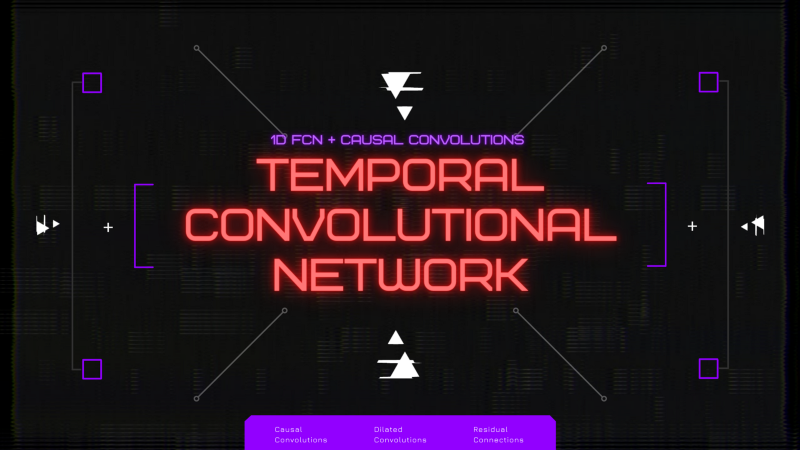

This article reviews a paper titled [An Empirical Evaluation of Generic Convolutional and Recurrent Networks for Sequence Modeling](https://arxiv.org/pdf/1803.01271.pdf) by Shaojie Bai, J. Zico Kolter, and Vladlen Koltun.

Before TCNs, we often associated RNNs like LSTMs and GRUs with a new sequence modeling task. However, the paper shows that TCNs (Temporal Convolutional Networks) can efficiently handle sequence modeling tasks and outperform other models. The authors also demonstrated that TCNs maintain more extended memory than LSTMs.

We discuss the architecture of TCNs with the following topics:

- Sequence Modeling
- Causal Convolutions
- Dilated Convolutions
- Residual Connections
- Advantages and Disadvantages
- Performance Comparisons

## Sequence Modeling

Although the paper is not the first to use the term TCN, it means a family of architectures that uses convolutions to process sequential data.

So, let’s define sequence modeling tasks.

Given an input sequence:

$$
x_0,\ x_1,\ \dots,\ x_{T-1},\ x_T
$$

, we wish to predict corresponding outputs at each time:

$$
y_0,\ y_1,\ \dots,\ y_{T-1},\ y_T
$$

So, a sequence modeling network in the paper is a function $f$ that maps a vector of $T+1$ elements to another vector of $T+1$ elements:

$$
\hat{y}_0,\ \hat{y}_1,\ \dots,\ \hat{y}_{T-1},\ \hat{y}_T = f(x_0,\ x_1,\ \dots,\ x_{T-1},\ x_T)
$$

There is a constraint (the causal constraint): when predicting an output for time $t \le T$, we can only use inputs from the same time point and earlier time points like:

$$
x_0,\ x_1,\ \dots,\ x_{t-1},\ x_t
$$

And we must not use inputs from the later time points than $t$:

$$
x_{t+1},\ x_{t+2},\ \dots,\ x_{T-1},\ x_T
$$

The objective of the above sequence modeling setting is to find a network $f$ that minimizes a loss between the label outputs and predictions:

$$
L(y_0,\ y_1,\ \dots,\ y_{T-1},\ y_T, f(x_0,\ x_1,\ \dots,\ x_{T-1},\ x_T))
$$

This setup is more restricted than general sequence-to-sequence models, such as machine translation which can use the whole sequence to perform predictions.

So, the TCN is causal (no information leakage from the future to the past) and can map any sequence to an output sequence of the same length.

Moreover, it can use a very-deep network with the help of residual connections, and it can look very far into the past to predict with the help of dilated convolutions.

The following will discuss the characteristics mentioned above (casual, dilated, and residual).

## Causal Convolutions

The TCN uses 1D FCN (1-dimensional fully-convolutional network) architecture.

](images/figure-1a.png)

Each hidden layer has the same length as the input layer, with zero paddings to ensure the subsequent layer has the same length.

For an output at time $t$, the causal convolution (a convolution with the causal constraint) uses inputs from time $t$ and earlier in the previous layer (See the blue line connections at the bottom of the above diagram).

The causal convolution is not new, but the paper incorporates very-deep networks to allow a long history.

## Dilated Convolutions

If we look back at consecutive time steps, we can only look back up to the number of layers in the network.

To overcome the problem, they adapted dilated convolutions which take inputs from every $d$ steps away from $t$:

$$
x_{t-(k-1)d},\ \dots,\ x_{t-2d},\ x_{t-d},\ x_t
$$

where $k$ is the kernel size.

The idea of the causal convolution and the dilated convolution originated from the [WaveNet](https://arxiv.org/abs/1609.03499) paper, which has a very similar architecture as the TCN.

](images/WaveNet-figure-3.png)

Dilated convolution lets the network look back up to $(k-1)d$ time steps, enabling exponentially large receptive fields per the number of layers.

The authors of the TCN paper increased $d$ exponentially with the depth of the network:

$$
d = O(2^i)
$$

where $i$ means the level $i$ of the network ($i$ starts with 0).

Below is the same diagram for convenience. The dilated convolution on the first hidden layer applies every two steps where $i=1$.

](images/figure-1a.png)

The arrangement of the dilated convolutions ensures that some filter hits each input within the history and allows a long history using deep networks.

You can follow the blue lines from the top to the bottom layers to see if they reach all the inputs at the bottom, meaning the prediction at time $T$ uses all the inputs within the history covered by the dilated convolutions.

## Residual Connections

A residual block (originally from ResNet) allows each layer to learn modifications to identity mapping and works well with very-deep networks.

](images/ResNet-figure-2.png)

The residual connection is essential to enable a long history. For example, if a prediction depends on a history length of 2 to the power of 12, we need 12 layers to handle such a large receptive field.

Below is the residual block of the baseline TCN.

](images/figure-1b.png)

The residual block has two layers of dilated causal convolution, weight normalization, ReLU activation, and dropout.

There is an optional 1x1 convolution if the number of input channels differs from the number of output channels from the dilated causal convolution (the number of filters of the second dilated convolution).

It is for ensuring the residual connection (element-wise addition of the convolution output and input) works.

](images/figure-1c.png)

## Advantages and Disadvantages

In summary,

__TCN = 1D FCN + Dilated Causal Convolutions__

, which is a straightforward structure and easier to understand than other sequence models like LSTM.

Apart from the simplicity, there are the following advantages of using TCNs over RNNs (LSTMs and GRUs):

1.   Unlike RNNs, TCNs can take advantage of parallelism as they can perform convolutions in parallel.
2.   We can adjust the receptive field sizes by the number of layers, dilation factors, and filter sizes, which allows us to control the model’s memory size for different domain requirements.
3.   Unlike RNNs, the gradients are not in the temporal direction but in the direction of the network depth, which makes a big difference, especially when the input length is very long. As such, the gradients in TCNs are more stable (also thanks to the residual connections).
4.   The memory requirement is lower than LSTMs and GRUs because each layer has only one kernel. In other words, the total number of kernels depends on the number of layers (not the input length).

There are two notable disadvantages:

1.   During an evaluation, TCNs take the raw sequence up to the required history length, whereas RNNs can discard a fixed-length chunk (a part of the input) as it consumes them and keep only the summary as a hidden state. Therefore, TCNs may require more data storage than RNNs during evaluation.
2.   Domain transfer may not work well with TCNs, especially when moving from a domain requiring a short history to another domain needing a long history.

## Performance Comparisons

The authors compared the performance of LSTM, GRU, RNN, and TCN using various sequence modeling tasks:

](images/table-1.png)

As you can see, TCN performs better than other models in most tasks.

One interesting experiment is the copy memory task, which examines a model’s ability to retain information for different lengths of time.

](images/figure-5.png)

TCN achieved 100% accuracy on the copy memory task, whereas LSTM and GRU degenerate to random guessing as the time length T grows. It may be obvious considering the network structure of TCN, which has a straightforward convolutional architecture.

Overall, TCNs perform very well over LSTMs. The confidence of the authors shows in the following quote from the paper:

<blockquote>
The preeminence enjoyed by recurrent networks in sequence modeling may be largely a vestige of history. Until recently, before the introduction of architectural elements such as dilated convolutions and residual connections, convolutional architectures were indeed weaker. Our results indicate that with these elements, a simple convolutional architecture is more effective across diverse sequence modeling tasks than recurrent architectures such as LSTMs. Due to the comparable clarity and simplicity of TCNs, we conclude that convolutional networks should be regarded as a natural starting point and a powerful toolkit for sequence modeling.
<cite>Source: [the paper](https://arxiv.org/abs/1803.01271)</cite>
</blockquote>

They provided the source code in their <a href="https://github.com/locuslab/TCN" rel="noopener" target="_blank">GitHub repo</a> so you can try and see it for yourself.

## References

- [Long Short Term Memory](/blog/2021-09-26-long-short-term-memory/)
- [An Empirical Evaluation of Generic Convolutional and Recurrent Networks for Sequence Modeling](https://arxiv.org/abs/1803.01271) \
  Shaojie Bai, J. Zico Kolter, Vladlen Koltun \
  [GitHub](https://github.com/locuslab/TCN)
- [WaveNet: A Generative Model for Raw Audio](https://arxiv.org/abs/1609.03499) \
  Aaron van den Oord, Sander Dieleman, Heiga Zen, Karen Simonyan, Oriol Vinyals, Alex Graves, Nal Kalchbrenner, Andrew Senior, Koray Kavukcuoglu
- [Deep Residual Learning for Image Recognition](https://arxiv.org/abs/1512.03385) \
  Kaiming He, Xiangyu Zhang, Shaoqing Ren, Jian Sun
