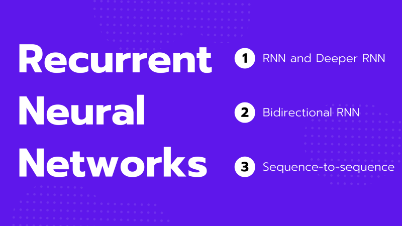

RNNs (recurrent neural networks) handle sequential data where the order of sequence matters. For example, RNNs deal with time-series data, languages (sequence of words), etc.

Explanations of RNNs usually include a lot of boxes and arrows, which may be confusing. The reason for many diagrams is because RNNs come in many different shapes and forms. So, this article aims to describe the core concepts in RNNs and show various diagrams in a step-by-step manner for better understanding.

We discuss the following topics:

- Sequential Data
- Simple RNN
- Deeper RNN
- Bidirectional RNN
- RNN Encoder-Decoder

## Sequential Data

Before discussing sequential data, let’s first discuss non-sequential data and then compare it against sequential data to understand the crucial features.

For example, we typically deal with images randomly sampled from a dataset in an image classification task.

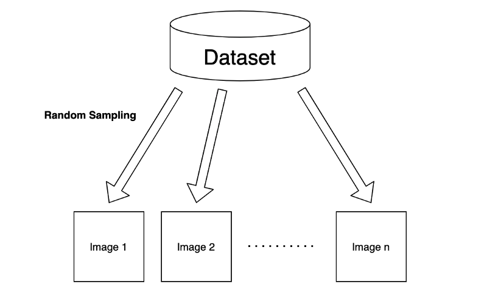

Although we may use a batch of input images to train a machine-learning model, we assume no correlation exists between selected images. So, the order of input images should not matter. As a result, we train our model to extract the features of each image independently.

Let’s think of a feedforward neural network (NN) for processing sampled images. For simplicity, we assume that the neural network takes one input at a time.

So, the first layer takes one image as a vector $\mathbf{x}$ and outputs a hidden state $\mathbf{h}$ like below:

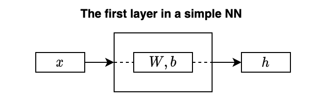

$W$ is a weight matrix, and $\mathbf{b}$ is a bias. The hidden state $\mathbf{h}$ represents features extracted from the input data (image).

I didn’t draw any activation function for not cluttering the diagram. But let’s say we use a $\tanh$ for activation. We can mathematically write the layer as follows:

$$
\mathbf{h} = \tanh(W \mathbf{x} + \mathbf{b})
$$

Note: all vectors are column vectors.

As mentioned, the above operation applies to each input image independently, even when using a batch of input images, as the model learns features from each image separately.

In other words, the order of images does not matter. For example, the first image may be a cat, and the next is a dog. Or the first image may be a dog, and the next is a cat. It does not affect the model’s inference result on each image.

---

Now, let’s talk about sequential data. Suppose we have a video camera that produces a sequence of images.

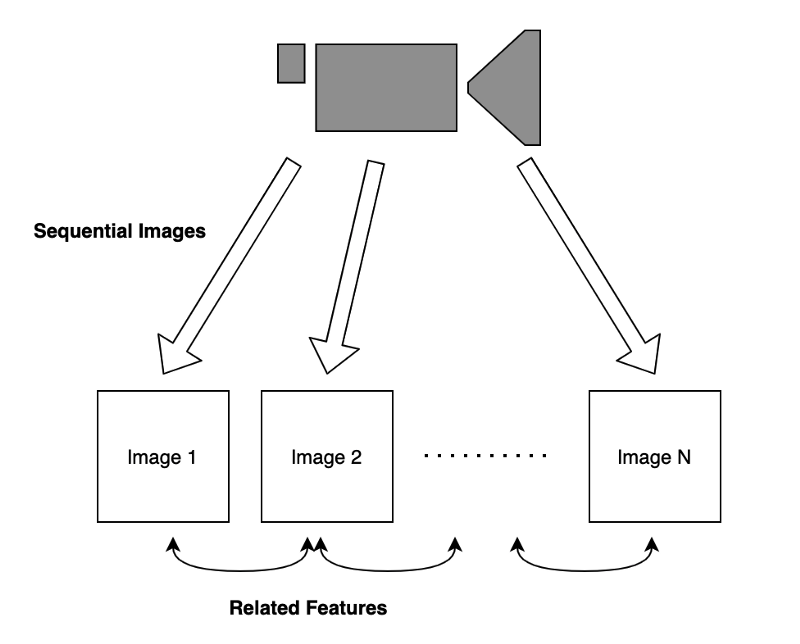

Images in time proximity have related features. For example, if the video shows a dog walking in a park. Knowing the current pose of the dog helps predict the subsequent image as they have related features.

Another example of how ordering is critical in handling sequential data is when dealing with a language sentence to find meaning from an ordered sequence of words. A change in the word order makes a considerable difference in the intention of the statement. Comparing the phrase “A dog bit Tom” with another one, “Tom bit a dog”, the two expressions have very different meanings.

By now, it should be evident that the simple NN is unsuitable for handling sequential data as it ignores the order of inputs and hence the correlation among inputs.

Suppose we want to extract features from a sequence of video frames to predict the next frame. We would need to extract information from each frame while incorporating what has already happened in the past.

The question is: how can we do that?

## Simple RNN

Our model should incorporate the present and past information when dealing with sequential data where inputs correlate. In other words, we need a memory to carry forward. We call it a hidden state as we can not observe such memory directly. Our model should use memory to store essential features while processing sequential data.

Let’s think about a simple model to process sequential data:

$$
\mathbf{x}_1, \mathbf{x}_2, \dots, \mathbf{x}_{n-1}, \mathbf{x}_n
$$

The model processes the first input from the sequential data and produces a hidden state:

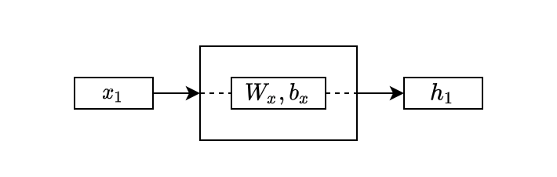

The above looks the same as the simple NN layer, except I used a small $x$ as a subscript to differentiate the parameter names.

In the second step, the model takes the second input from the sequential data and also the hidden state from the first layer:

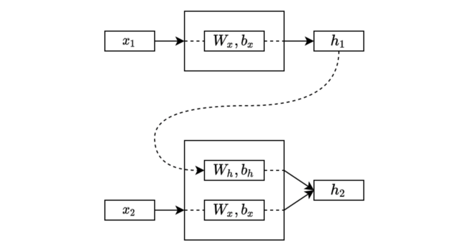

The second step processes the input and the previous hidden state and combines the outcomes into the new one that carries the present and past information.

Note: although not shown in the diagram, we typically initialize the initial hidden state with zeros, and the first step takes it along with the first input. Therefore, the hidden state of the first step contains only information from the first input.

The exact process continues to the third step, following the order, an essential characteristic of sequential data.

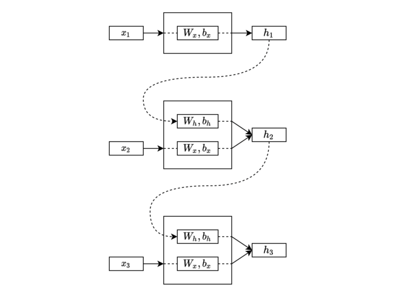

The process continues in the same manner through the sequential data. Eventually, the final hidden state will have combined features from the entire sequence.

As you can see, the same parameters (weights and biases) process each input and hidden state. Therefore, the process can handle sequential data of various lengths.

Often, we draw the same diagram horizontally like below:

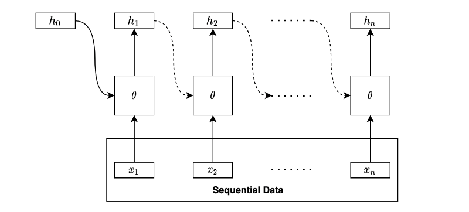

The square box with $\theta$ (the parameters) performs linear operation and non-linear activation.

Although we haven’t discussed what to do with the hidden states, the above is the essential idea of recurrent neural networks (RNNs). An RNN extracts the hidden states by going through the sequential data in order. In other words, it takes sequential data and outputs a series of hidden states.

We can draw the same diagram in the folded form like below:

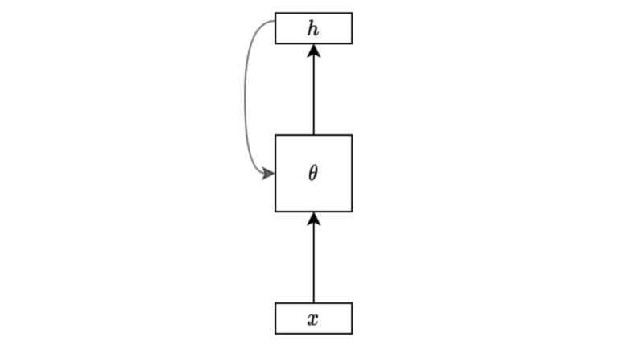

It is very compact and makes sense for those who already know what it means. However, these notations may confuse us occasionally because we can not see the details, especially for those who haven’t seen the unfolded version.

Also, it helps to see the mathematical expression of an RNN. So, let’s write a formula for a simple RNN’s hidden state calculation for clarity.

Given sequential data:

$$
\mathbf{x}_1, \mathbf{x}_2, \dots, \mathbf{x}_{n-1}, \mathbf{x}_n
$$

, a hidden state calculation with a tanh activation is:

$$
\begin{aligned}
\mathbf{h}_i &= f_\theta(\mathbf{h}_{i-1}, \mathbf{x}_i) \\
&= \tanh(W_h \mathbf{h}_{i-1} + \mathbf{b}_h + W_x \mathbf{x}_i + \mathbf{b}_x)
\end{aligned}
$$

Note: we can also combine the biases into one vector, but I wrote them separately following the diagrams.

Comparing the RNN formula with the simple NN layer:

$$
\mathbf{h} = \tanh(W \mathbf{x} + \mathbf{b})
$$

, the only difference is that the RNN formula has the addition of the previous hidden state.

So, why do we call it a “recurrent” neural network?

It becomes apparent if we expand the formula:

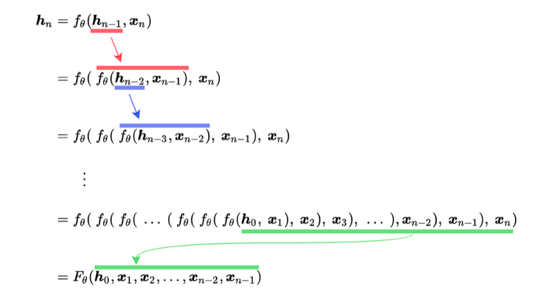

As you can see, the hidden state function calls itself recursively until reaching the first input and the initial hidden state (usually zeros). The function uses the same sets of parameters θ at every step.

The final hidden state is a function of all the inputs and the initial hidden state. We can apply backpropagation to adjust parameters since the function contains only differentiable operations.

Note: [recursive neural networks](https://en.wikipedia.org/wiki/Recursive_neural_network) are more general and handle hierarchical tree structure data, whereas **recurrent** neural networks operate on a linear sequence.

## Deeper RNN

So far, we only talk about extracting features into hidden states since that’s the most crucial aspect while understanding the core functionality of RNNs.

Now that’s gone out of the way, let’s discuss what we can do with the hidden states.

Depending on the purpose, we use hidden states differently. For example, we may use the final hidden state for linear regression to predict a future stock price from the price history where there would likely be some correlation between prices.

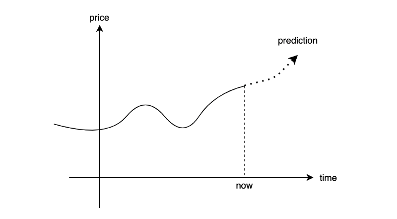

The below diagram shows a simple one-layer linear regression to produce an output from the final hidden state.

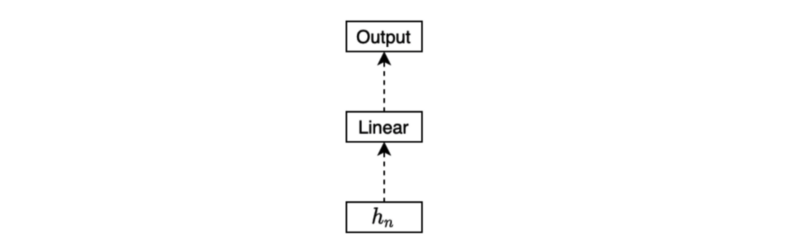

Another example is to predict a sentiment type (positive, neutral, or negative) from a movie review. We may use the final hidden state for the classification task (softmax) like below:

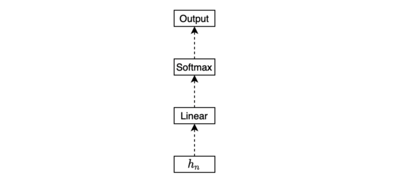

Or we may be interested in generating a sequence of outputs. In that case, we would be processing each hidden state to produce an outcome for the respective step for regression or classification.

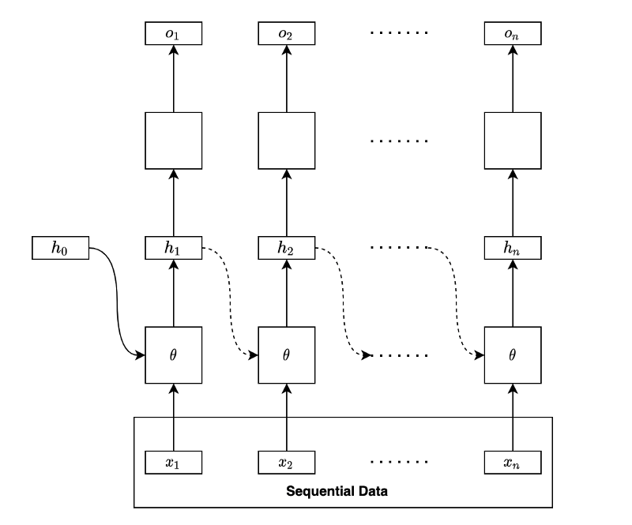

Note: the empty boxes are either regression or classification layers. It may be one layer or multi-layer network by itself.

The below diagram is a folded version of the above diagram:

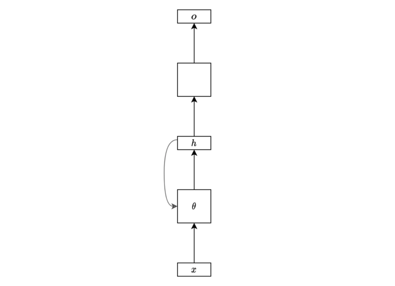

I hope this simplified diagram is no longer alien to anyone who has read this article up until this point.

But is having only one hidden layer enough? It may not be sufficient for complex problems. We may want to use more hidden layers.

We can stack another hidden layer to make the network deeper.

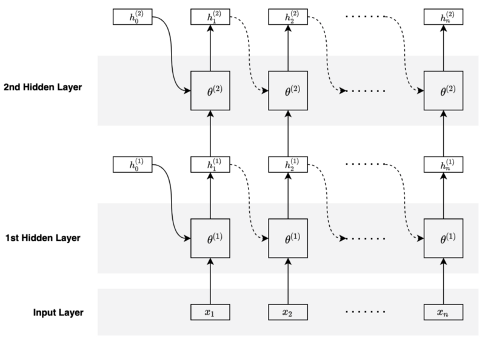

The second hidden layer takes the hidden states from the first hidden layer as inputs and keeps track of history using its hidden states.

The parameters of the second hidden layer differ from that of the first. In other words, each hidden layer has its own set of parameters.

The below diagram is a folded version of the above diagram:

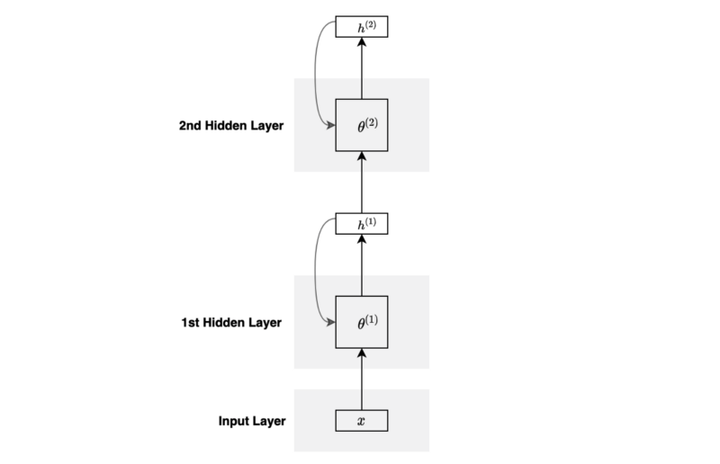

You can stack more layers and go deeper if required.

We can use the hidden states from the last hidden layer to perform regression or classification, depending on the type of the problem.

## Bidirectional RNN

So far, we have only talked about processing in the forward sequence. However, obtaining some contextual information from the future may be beneficial. For example, processing a language sentence (a sequence of words) may benefit from words from the later part of the sentence.

In short, we may want our model to process sequential data in forward and reverse orders. We call it Bidirectional RNN (BiRNN).

BiRNN processes sequential data in the forward direction, just as we discussed so far.

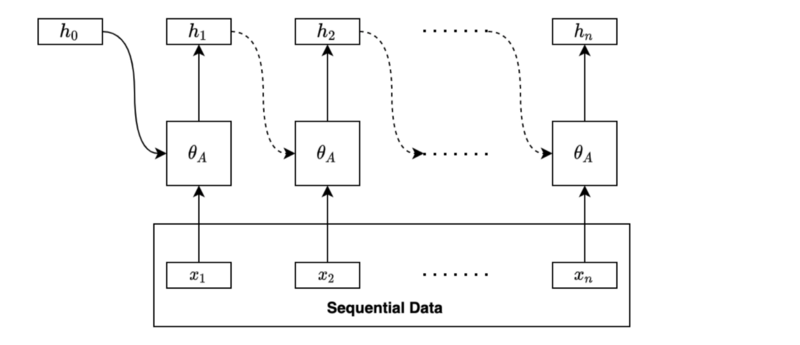

BiRNN processes sequential data in the backward direction using another set of parameters.

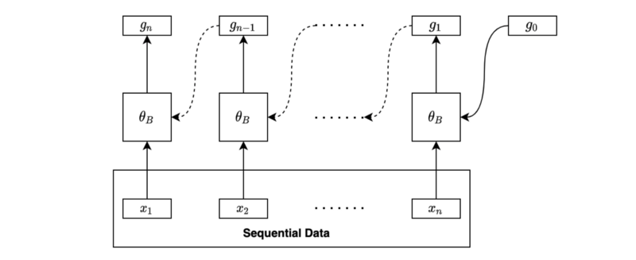

We may combine the final forward hidden state and the final backward hidden state for further processing, such as regression and classification.

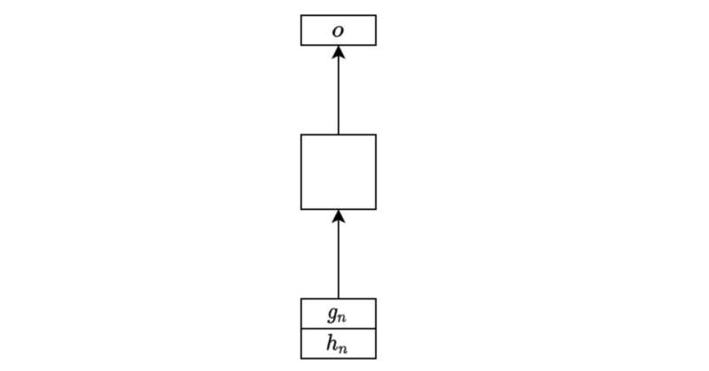

If we want to produce sequential output, we can combine the two sets of hidden states at each step and use them as inputs for further processing, such as regression and classification.

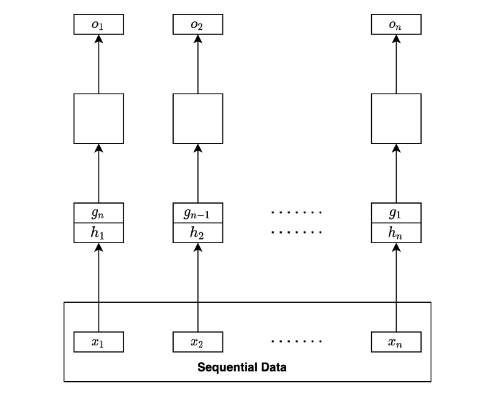

It may sound challenging to implement a bidirectional RNN. Still, it is easy to do so if we use a deep learning library like PyTorch that provides a parameter for such purpose [(bidirection=True)](https://pytorch.org/docs/stable/generated/torch.nn.RNN.html) to make RNN bidirectional.

## RNN Encoder-Decoder

When translating an English sentence to a French sentence, the number of words in the translation would likely differ from that of the original.

RNN Encoder-Decoder combines two RNNs to handle variations in input and output lengths. The encoder processes an input sequence to generate the final hidden state, which the decoder takes to produce the output sequence. We also call this type of RNN seq2seq (sequence-to-sequence).

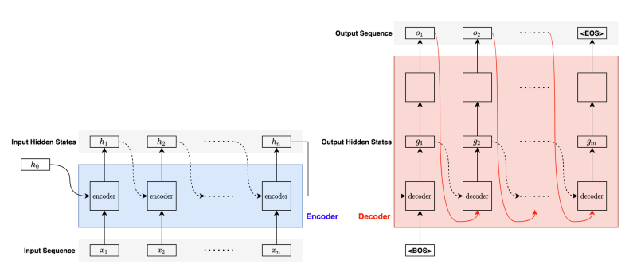

For the first step in the decoder, we pass the `<BOS>` (the beginning of the sentence) marker to let the decoder know the arrival of a new sentence.

Given the `<BOS>` marker, the decoder processes the final hidden state from the encoder to produce the first hidden state and converts it into the first output.

Then, the decoder passes the output (the red curved line) and the hidden state (black dotted curved line) as inputs to the next step. It repeats the process until completion, for which the decoder outputs the `<EOS>` (the end of the sentence) marker.

Note: we pass the label output (instead of the predicted output) to the next step during training. We call it **teacher forcing**. It stabilizes the learning process.

One issue with seq2seq models is that the encoder must push all information into one hidden state vector for the decoder to start generating quality outputs. But the decoder may want to focus on different hidden states from the encoder to generate each output.

The [attention mechanism](/blog/2021/2021-09-29-neural-machine-translation-with-attention-mechanism/) solves the problem by allowing the decoder to access any hidden states from the encoder based on what it needs to pay attention to.

To be continued.

## References

- [Long Short-Term Memory](/blog/2021/2021-09-26-long-short-term-memory/)
- [Sequence to Sequence Learning with Neural Networks](https://arxiv.org/abs/1409.3215) \
  Ilya Sutskever, Oriol Vinyals, Quoc V. Le
- [Recurrent neural network](https://en.wikipedia.org/wiki/Recurrent_neural_network) \
  Wikipedia
- [Recursive neural network](https://en.wikipedia.org/wiki/Recursive_neural_network) \
  Wikipedia
- [Machine Translation](https://en.wikipedia.org/wiki/Machine_translation) \
  Wikipedia