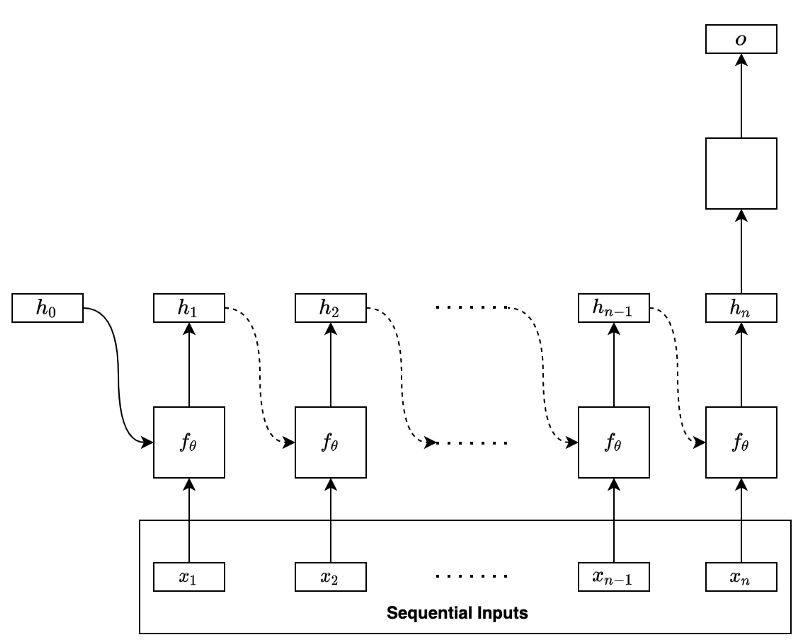
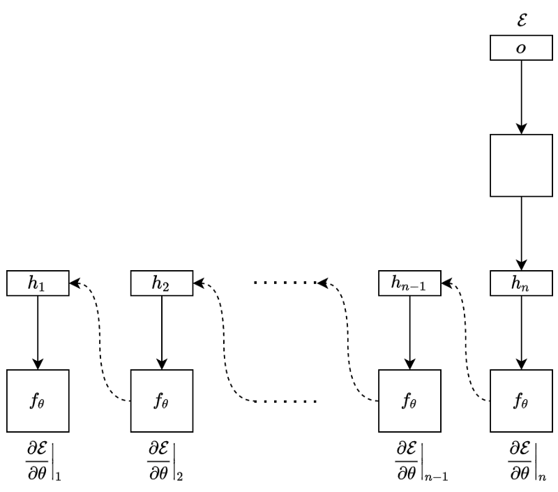
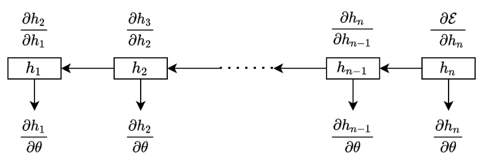
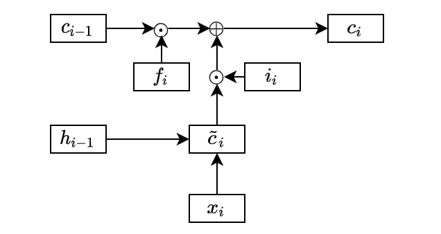
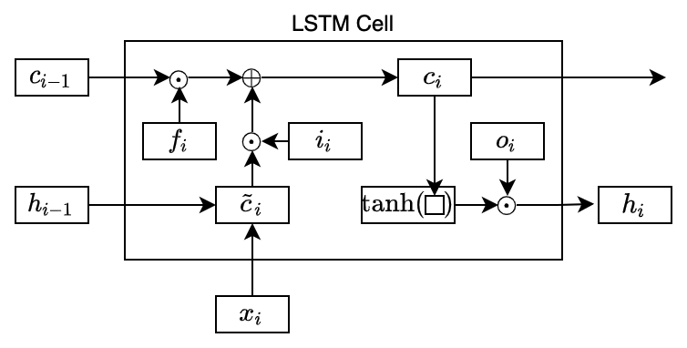
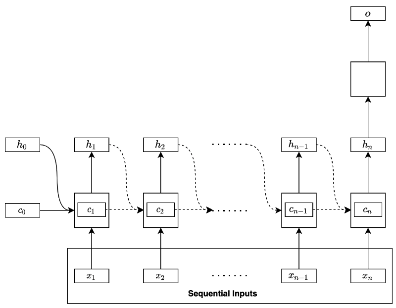

In theory, RNNs (Recurrent Neural Networks) should extract features (hidden states) from long sequential data. Researchers had difficulty training the basic RNNs using BPTT (Back-Propagation Through Time).

The main reasons are the vanishing and exploding gradient problems, which LSTM (Long Short-Term Memory) mitigated enough to be more trainable but did not entirely solve the problem. Then, what are the remaining issues with LSTM?

To understand the issue, we need to know how BPTT works. Then, it will be clearer how the vanishing and exploding gradients occur. After that, we can appreciate why LSTM works better than the basic RNN, especially for long sequential data. Finally, we will understand why LSTM does not entirely solving the problems.

In this article, we discuss the following topics:

- BPTT (Back-Propagation Through Time)
- Vanishing and Exploding Gradients
- LSTM (Long Short-Term Memory)
- BPTT Through LSTM Cells

## BPTT (Back-Propagation Through Time)

Let’s use a basic RNN to discuss how BPTT works. Suppose the RNN uses the final hidden state to predict (i.e., regression or classification) as shown below:

The model processes the input data sequentially:

$$
x_1, x_2, \dots, x_{n-1}, x_n
$$

In the first step, the RNN takes in the initial hidden state containing zeros and the input data’s first element to produce the hidden state of the first step. At the second step, the network takes in the first step’s hidden state and the input data’s second element to produce the hidden state of the second step. At each step, the network takes in the previous hidden state and the input data’s current element to produce the hidden state of that step.

We can mathematically summarize the process as follows:

$$
\mathbf{h}_i = f_\theta(\mathbf{h}_{i-1}, \mathbf{x}_i)
$$

Note: the parameters θ include all weights and biases from the network except for the layers that produce the final output.

We can unfold the final hidden state like below:

$$
\begin{aligned}
\mathbf{h}_n &= f_\theta(\mathbf{h}_{n-1}, \mathbf{x}_n) \\
&= f_\theta(f_\theta(\mathbf{h}_{n-2}, \mathbf{x}_{n-1}), \mathbf{x}_n) \\
&= f_\theta(f_\theta(f_\theta(\mathbf{h}_{n-3}, \mathbf{x}_{n-2}), \mathbf{x}_{n-1}), \mathbf{x}_n) \\
&\dots \\
&= f_\theta(f_\theta(f_\theta(\dots(f_\theta(f_\theta(f_\theta(\mathbf{h}_{0}, \mathbf{x}_{1}), \mathbf{x}_2), \mathbf{x}_3), \dots), \mathbf{x}_{n-2}), \mathbf{x}_{n-1}), \mathbf{x}_n) \\
&= F_\theta(\mathbf{h}_0, \mathbf{x}_1,  \mathbf{x}_2, \mathbf{x}_3, \dots, \mathbf{x}_{n-2}, \mathbf{x}_{n-1}, \mathbf{x}_{n})
\end{aligned}
$$

As we can see, the same function with the same parameters recurs to form a function $F$ that takes in the initial hidden state (zeros) and the whole input data sequence to produce the final hidden state.

Therefore, the final hidden state contains features from the entire input sequence. The above model uses the final hidden state to perform regression or classification (in the empty square) to produce an output of the network.

When training the RNN, we calculate the error (loss) by comparing the model's output and the label value from the training dataset. For example, we may use RMSE for regression and cross-entropy for classification. After that, we back-propagate the error through the network in reverse order.

We call this operation BPTT (Back-Propagation Through Time). It is the same process as the back-propagation in plain neural networks, except that every backward step uses the same parameters to calculate the gradients.

At the step $n$, the gradient is:

$$
\frac{\partial \mathcal{E}}{\partial \theta}\Biggr|_n = \frac{\partial \mathcal{E}}{\partial \mathbf{h}_n} \frac{\partial \mathbf{h}_n}{\partial \theta}
$$

At the step $n-1$, the gradient is:

$$
\frac{\partial \mathcal{E}}{\partial \theta}\Biggr|_{n-1} = \frac{\partial \mathcal{E}}{\partial \mathbf{h}_n} \frac{\partial \mathbf{h}_n}{\partial \mathbf{h}_{n-1}} \frac{\partial \mathbf{h}_{n-1}}{\partial \theta}
$$

In the step $n-2$, the gradient is:

$$
\frac{\partial \mathcal{E}}{\partial \theta}\Biggr|_{n-2} = \frac{\partial \mathcal{E}}{\partial \mathbf{h}_n} \frac{\partial \mathbf{h}_n}{\partial \mathbf{h}_{n-1}} \frac{\partial \mathbf{h}_{n-1}}{\partial \mathbf{h}_{n-2}} \frac{\partial \mathbf{h}_{n-2}}{\partial \theta}
$$

And so forth.

We see the pattern clearly in the below diagram:

The total gradient is a sum of all the temporal contributions:

$$
\begin{aligned}
\frac{\partial \mathcal{E}}{\partial \theta} &= \frac{\partial \mathcal{E}}{\partial \theta}\Biggr|_n + \frac{\partial \mathcal{E}}{\partial \theta}\Biggr|_{n-1} + \frac{\partial \mathcal{E}}{\partial \theta}\Biggr|_{n-2} + \dots \\
&= \frac{\partial \mathcal{E}}{\partial \mathbf{h}_n} \frac{\partial \mathbf{h}_n}{\partial \theta} + \\
&\quad\ \frac{\partial \mathcal{E}}{\partial \mathbf{h}_n} \frac{\partial \mathbf{h}_n}{\partial \mathbf{h}_{n-1}} \frac{\partial \mathbf{h}_{n-1}}{\partial \theta} + \\
&\quad\ \frac{\partial \mathcal{E}}{\partial \mathbf{h}_n} \frac{\partial \mathbf{h}_n}{\partial \mathbf{h}_{n-1}} \frac{\partial \mathbf{h}_{n-1}}{\partial \mathbf{h}_{n-2}} \frac{\partial \mathbf{h}_{n-2}}{\partial \theta} + \\
&\quad\ \dots
\end{aligned}
$$

We can compactly express the above using the summation and product symbols:

$$
\frac{\partial \mathcal{E}}{\partial \theta} = \frac{\partial \mathcal{E}}{\partial \mathbf{h}_n} \sum\limits_{k=1}^n \left(\left( \prod\limits_{i=k+1}^n \frac{\partial \mathbf{h}_i}{\partial \mathbf{h}_{i-1}} \right) \frac{\partial \mathbf{h}_k}{\partial \theta} \right)
$$

Note: when $k=n$, we treat the value of the product ($\prod$) notation as 1 since $i = k+1 = n+1 > n$ means that there is nothing to multiply:

$$
\prod\limits_{i=n+1}^n \frac{\partial \mathbf{h}_i}{\partial \mathbf{h}_{i-1}} = 1
$$

Also, when calculating a temporal contribution at $k$, we treat the hidden state at $k-1$ as constant. Otherwise, changing the parameters θ at $k$ would affect the whole sequence, which should not be the case.

Now that we know how BPTT works, let’s look at how the vanishing and exploding gradients occur.

## Vanishing and Exploding Gradients

If the sequential data is long (having many steps), there are a lot of multiplications of the partial derivatives while calculating the gradients.

For example, the gradient at the first step of a long sequential data is:

$$
\begin{aligned}
\frac{\partial \mathcal{E}}{\partial \theta}\Biggr|_1 &= \frac{\partial \mathcal{E}}{\partial \mathbf{h}_n} \left( \prod\limits_{i=2}^n \frac{\partial \mathbf{h}_i}{\partial \mathbf{h}_{i-1}} \right) \frac{\partial \mathbf{h}_1}{\partial \theta} \\
&= \frac{\partial \mathcal{E}}{\partial \mathbf{h}_n} \frac{\partial \mathbf{h}_{n}}{\partial \mathbf{h}_{n-1}} \frac{\partial \mathbf{h}_{n-1}}{\partial \mathbf{h}_{n-2}} \frac{\partial \mathbf{h}_{n-2}}{\partial \mathbf{h}_{n-3}} \dots \frac{\partial \mathbf{h}_{3}}{\partial \mathbf{h}_{2}} \frac{\partial \mathbf{h}_{2}}{\partial \mathbf{h}_{1}} \frac{\partial \mathbf{h}_{1}}{\partial \theta} 
\end{aligned}
$$

The intuition for vanishing gradients is as follows: if the magnitudes of multiplication by the partial derivatives are less than 1, the gradients will vanish when $n$ is large:

$$
\left\| \frac{\partial \mathbf{h}_i}{\partial \mathbf{h}_{i-1}} \right\| < 1 \qquad\rightarrow\qquad \prod\limits_{i=2}^n \frac{\partial \mathbf{h}_i}{\partial \mathbf{h}_{i-1}} \quad\dots\quad \text{Vanish!}
$$

The intuition for exploding gradients is as follows: if the magnitudes of multiplication by the partial derivatives are greater than 1, the gradients will explode when _n_ is large:

$$
\left\| \frac{\partial \mathbf{h}_i}{\partial \mathbf{h}_{i-1}} \right\| > 1 \qquad\rightarrow\qquad \prod\limits_{i=2}^n \frac{\partial \mathbf{h}_i}{\partial \mathbf{h}_{i-1}} \quad\dots\quad \text{Explode!}
$$

To see how the above conditions happen, let’s look at the partial derivatives more closely by expanding the hidden state calculation (assuming the activation is $tanh$) as follows:

$$
\mathbf{h}_i = f_\theta(\mathbf{h}_{i-1}, \mathbf{x}_i) = \tanh(W_h \mathbf{h}_{i-1} + W_x \mathbf{x}_i + \mathbf{b})
$$

So, the gradient of a hidden state with respect to its immediate predecessor is:

$$
\begin{aligned}
\frac{\partial \mathbf{h}_i}{\partial \mathbf{h}_{i-1}} &= \frac{\partial \tanh\left(W_h \mathbf{h}_{i-1} + W_x \mathbf{x}_i + \mathbf{b} \right)}{\partial \mathbf{h}_{i-1}} \\
&= \text{diag}\Biggl( \tanh'\left(W_h \mathbf{h}_{i-1} + W_x \mathbf{x}_i + \mathbf{b} \right)\Biggr) W_h
\end{aligned}
$$

The above equation may not be obvious. The following explains the calculation details (You can skip it if it’s not interesting).

---

We use the below substitution:

$$
\mathbf{z}_{i} = W_h \mathbf{h}_{i-1} + W_x \mathbf{x}_i + \mathbf{b}
$$

Now, the partial derivative is:

$$
\frac{\partial \mathbf{h}_i}{\partial \mathbf{h}_{i-1}} = \frac{\partial \tanh(\mathbf{z}_i)}{\partial \mathbf{z}_i} \frac{\partial \mathbf{z}_i}{\partial \mathbf{h}_{i-1}}
$$

The second term becomes:

$$
\frac{\partial \mathbf{z}_i}{\partial \mathbf{h}_{i-1}} = W_h
$$

The first term is a bit more involved.

Let’s assume the vector $\mathbf{z}$ has $m$ elements:

$$
\mathbf{z}_i = \begin{bmatrix}
z_{i,1} \\
z_{i,2} \\
\vdots \\
z_{i,m} \\
\end{bmatrix}
$$

The hyperbolic tangent applies element-wise on the vector $\mathbf{z}$:

$$
\tanh(\mathbf{z}_i) = \begin{bmatrix}
\tanh(z_{i,1}) \\
\tanh(z_{i,2}) \\
\vdots \\
\tanh(z_{i,m}) \\
\end{bmatrix}
$$

Now we want to calculate the following:

$$
\frac{\partial \tanh{\mathbf{z}_i}}{\partial \mathbf{z}_i}
$$

This will be a Jacobian matrix in that we calculate all first-order partial derivatives of the vector-valued function $\tanh(\mathbf{z})$. It is probably easier to just see what it looks like:

$$
\frac{\partial \tanh(\mathbf{z}_i)}{\partial \mathbf{z}_i} = \begin{bmatrix}
\frac{\partial \tanh(z_{i,1})}{\partial z_{i,1}} & \frac{\partial \tanh(z_{i,1})}{\partial z_{i,2}} & \dots & \frac{\partial \tanh(z_{i,1})}{\partial z_{i,m}} \\
\frac{\partial \tanh(z_{i,2})}{\partial z_{i,1}} & \frac{\partial \tanh(z_{i,2})}{\partial z_{i,2}} & \dots & \frac{\partial \tanh(z_{i,2})}{\partial z_{i,m}} \\
\vdots & \vdots & \ddots & \vdots \\
\frac{\partial \tanh(z_{i,m})}{\partial z_{i,1}} & \frac{\partial \tanh(z_{i,m})}{\partial z_{i,2}} & \dots & \frac{\partial \tanh(z_{i,m})}{\partial z_{i,m}}
\end{bmatrix}
$$

The first row contains all the first-order partial derivatives of the first element of $\tanh(\mathbf{z})$. The second row contains all the first-order partial derivatives of the second element of $\tanh(\mathbf{z})$. And so forth.

The diagonal elements are all ordinary derivatives, whereas non-diagonal elements all are zeros:

$$
\begin{aligned}
\frac{\partial \tanh(\mathbf{z}_i)}{\partial \mathbf{z}_i} &= \begin{bmatrix}
\frac{d(\tanh(z_{i,1}))}{d z_{i,1}} & 0 & \dots & 0 \\
0 & \frac{d(\tanh(z_{i,2}))}{d z_{i,2}} & \dots & 0 \\
\vdots & \vdots & \ddots & \vdots \\
0 & 0 & \dots & \frac{d(\tanh(z_{i,m}))}{d z_{i,m}}\\
\end{bmatrix} \\\\
&= \text{diag}\Biggl( \begin{bmatrix}
\frac{d(\tanh(z_{i,1}))}{d z_{i,1}} \\
\frac{d(\tanh(z_{i,2}))}{d z_{i,2}} \\
\vdots \\
\frac{d(\tanh(z_{i,m}))}{d z_{i,m}} \\
\end{bmatrix} \Biggr) \\\\
&= \text{diag}\left(\tanh'(\mathbf{z}_i)\right)
\end{aligned}
$$

The dash in $\tanh’$ means the ordinary derivatives of $\tanh$ (applied element-wise).

Therefore,

$$
\begin{aligned}
\frac{\partial \mathbf{h}_i}{\partial \mathbf{h}_{i-1}} &= \frac{\partial \tanh(\mathbf{z}_i)}{\partial \mathbf{z}_i} \frac{\partial \mathbf{z}_i}{\partial \mathbf{h}_{i-1}} \\
&= \text{diag} \Biggl( \tanh'(\mathbf{z}_i) \Biggr) W_h
\end{aligned}
$$

Replacing the substitution ___z___ with the original definition:

$$
\begin{aligned}
\frac{\partial \mathbf{h}_i}{\partial \mathbf{h}_{i-1}} &= \frac{\partial \tanh\left(W_h \mathbf{h}_{i-1} + W_x \mathbf{x}_i + \mathbf{b} \right)}{\partial \mathbf{h}_{i-1}} \\
&= \text{diag}\Biggl( \tanh'\left(W_h \mathbf{h}_{i-1} + W_x \mathbf{x}_i + \mathbf{b} \right)\Biggr) W_h
\end{aligned}
$$

---

In the above partial derivatives, we have the derivative of the hyperbolic tangent, the magnitude of which is less than one except when the input is zero. So, it could contribute to the vanishing gradient problem.

How about using a different activation like ReLU instead of $\tanh$? As the derivative of ReLU is 1 for positive inputs, would it eliminate the vanishing gradient problem?

Unfortunately, the derivative of an activation function is just one side of the story. The whole partial derivative also depends on the weights $W_h$. If the weights are small, the gradients may still vanish. Or, if the weights are large, the gradients may explode. So, ReLU or any other activation function may not always help after all.

We now know that the problem depends on both the activation function and the weights applied to the hidden state. But we don’t know precisely under what conditions the vanishing or exploding gradients occur.

Let’s mathematically formalize the conditions for vanishing and exploding gradients. For any activation function $a$, suppose the absolute values of $a’$ are bounded:

$$
\Biggl\| \text{diag} \Biggl( a'(W_h \mathbf{h}_{i-1} + W_x \mathbf{x}_i + \mathbf{b}) \Biggr) \Biggr\| \le \gamma
$$

Note: for $\tanh$, $\gamma$ is 1. For $\text{sigmoid}$, $\gamma$ is $\frac{1}{4}$. For ReLU, $\gamma$ is 1.

Let’s also define the absolute value of the largest [eigenvalue](/blog/2021-08-31-matrix-decomposition-demystified/) of the weight matrix $W_h$ as $\lambda$ to see the conditions for the vanishing and exploding gradients based on how $\gamma$ and $\lambda$ affect the following Jacobian matrix:

$$
\frac{\partial \mathbf{h}_i}{\partial \mathbf{h}_{i-1}} = \text{diag}\Biggl( a'\left(W_h \mathbf{h}_{i-1} + W_x \mathbf{x}_i + \mathbf{b} \right)\Biggr) W_h
$$

For the vanishing gradient problem, _the sufficient condition_ is:

$$
\lambda \lt \frac{1}{\gamma}
$$

, because the norms of the matrices have the following inequality:

$$
\begin{aligned}
\forall i, \ \Biggl\| \frac{\partial \mathbf{h}_i}{\partial \mathbf{h}_{i-1}} \Biggr\| &\le \Biggl\| \text{diag}\Biggl( a'\left(W_h \mathbf{h}_{i-1} + W_x \mathbf{x}_i + \mathbf{b} \right)\Biggr) \Biggr\| \Biggl\| W_h \Biggr\| \\
& \lt \gamma \lambda \\
& \lt \gamma \frac{1}{\gamma} \\
&= 1
\end{aligned}
$$

Note: the norm of matrix A gives the largest singular value of A. For a real-valued square matrix A, ||A|| returns the largest eigenvalue of matrix A. If the eigenvalues of matrix A are all less than 1, multiplying a vector by matrix A will make the output magnitude smaller than the original vector.

Similarly, for the exploding gradient problem, _the necessary condition_ (not sufficient condition) is:

$$
\lambda \gt \frac{1}{\gamma}
$$

, because the bounding value of the partial derivatives becomes more than 1.

As we can see, the problem is fundamental to the recurrent architecture of RNNs. It would be very challenging to eliminate the vanishing and exploding gradient problems.

If so, what problem did LSTM mitigate, and how?

## Long Short-Term Memory

LSTM introduced a new state called cell state that works as a long-lasting memory for useful features. To calculate the cell state, LSTM first calculates an intermediate cell state:

$$
\tilde{\mathbf{c}}_i = \tanh(W_h^{(c)} \mathbf{h}_{i-1} + W_x^{(c)} \mathbf{x}_i + \mathbf{b}^{(c)})
$$

The superscript $c$ distinguishes between different weight matrices, which should make more sense soon.

The basic RNN would use the intermediate cell state as the hidden state. On the contrary, LSTM may not take everything from the intermediate cell state and calculates the cell state as below:

$$
\mathbf{c}_i = \mathbf{f}_i \odot \mathbf{c}_{i-1} + \mathbf{i}_i \odot \tilde{\mathbf{c}}_i
$$

The circle dot means element-wise multiplication. We call $\mathbf{f}$ as the forget gate and $\mathbf{i}$ as the input gate. We compute the forget and input gates using sigmoid activation:

$$
\begin{aligned}
\mathbf{f}_i &= \sigma(W_h^{(f)} \mathbf{h}_{i-1} + W_x^{(f)} \mathbf{x}_i + \mathbf{b}^{f}) \\
\mathbf{i}_i &= \sigma(W_h^{(i)} \mathbf{h}_{i-1} + W_x^{(i)} \mathbf{x}_i + \mathbf{b}^{i}) 
\end{aligned}
$$

Therefore, the element values in the forget and input gates are between 0 and 1 inclusive. So, the forget gate determines how much to keep from the previous cell state, and the input gate determines how much to take from the intermediate cell state.

In the above diagram, I omitted the lines from the previous hidden state and the current input data into the forget and input gates for simplicity.

The usefulness of the forget gate is that it can reset some of the cell states. For example, the cell state may contain some details required for a while that it no longer needs. Without the forget gate, we have no way to erase unwanted information. As we are adding more information from the intermediate cell state to the cell state, it would be challenging to manage the information necessary in the cell state.

So, we know how LSTM updates the cell state. It can store long-lasting dependencies and also reset whatever and whenever required.

But what does it do with the cell state?

The cell state does not replace the hidden state — instead, it acts as a memory, storing dependencies that may or may not last long. As such, the cell state contains relevant information for the current hidden state as well, which LSTM extracts like below:

$$
\mathbf{h}_i = \mathbf{o}_i \odot \tanh(\mathbf{c}_i)
$$

The output gate $\mathbf{o}$ controls how much to use from the activated current cell state, which LSTM learns from data:

$$
\mathbf{o}_i = \sigma( W_h^{(o)} \mathbf{h}_{i-1} + W_x^{(o)} \mathbf{x}_i + \mathbf{b}^{(o)})
$$

In this way, the network may keep crucial information in the cell state for a long time while selecting immediately required information for the current hidden state.

All the gates are neural networks with learnable parameters. So, LSTM learns what to forget/keep from the previous cell states and add from the intermediate cell state. The activated ($\tanh$) cell state filters the output gate values. In other words, it knows what to use in the hidden state based on the cell state.

So, the complete formulas are:

$$
\begin{aligned}
\mathbf{f}_i &= \sigma(W_h^{(f)} \mathbf{h}_{i-1} + W_x^{(f)} \mathbf{x}_i + \mathbf{b}^{f}) \\
\mathbf{i}_i &= \sigma(W_h^{(i)} \mathbf{h}_{i-1} + W_x^{(i)} \mathbf{x}_i + \mathbf{b}^{i})  \\
\mathbf{o}_i &= \sigma( W_h^{(o)} \mathbf{h}_{i-1} + W_x^{(o)} \mathbf{x}_i + \mathbf{b}^{(o)}) \\
\tilde{\mathbf{c}}_i &= \tanh(W_h^{(c)} \mathbf{h}_{i-1} + W_x^{(c)} \mathbf{x}_i + \mathbf{b}^{(c)}) \\
\mathbf{c}_i &= \mathbf{f}_i \odot \mathbf{c}_{i-1} + \mathbf{i}_i \odot \tilde{\mathbf{c}}_i \\
\mathbf{h}_i &= \mathbf{o}_i \odot \tanh(\mathbf{c}_i)
\end{aligned}
$$

We call the whole thing an LSTM cell (or block). We can replace the basic RNN hidden state calculation with an LSTM cell to form a complete recurrent neural network. Some RNN patterns are explained in [the previous article](/blog/2021-09-20-recurrent-neural-networks/), where we can drop the LSTM cell in.

Now that we understand how LSTM works, we want to examine BPTT to see how gradients flow through the cell states.

Will the vanishing and exploding gradient problems go away?

## BPTT Through LSTM Cells

Let’s use the same architecture as previously discussed with the basic RNN. The network uses the last hidden state to predict an outcome, as shown below:

<figure class="wp-block-image size-full"></figure>

We calculate the gradient at each step:

$$
\begin{aligned}
\frac{\partial \mathcal{E}}{\partial \theta}\Biggr|_{n\quad} &= \frac{\partial \mathcal{E}}{\partial \mathbb{c}_n} \frac{{\partial \mathbb{c}_n}}{\partial \theta} \\
\\
\frac{\partial \mathcal{E}}{\partial \theta}\Biggr|_{n-1} &= \frac{\partial \mathcal{E}}{\partial \mathbb{c}_n} \frac{\partial \mathbb{c}_n}{{\partial \mathbb{c}_{n-1}}} \frac{{\partial \mathbb{c}_{n-1}}}{\partial \theta} \\
\\
\frac{\partial \mathcal{E}}{\partial \theta}\Biggr|_{n-2} &= \frac{\partial \mathcal{E}}{\partial \mathbb{c}_n} \frac{\partial \mathbb{c}_n}{{\partial \mathbb{c}_{n-1}}} \frac{\partial \mathbb{c}_{n-1}}{{\partial \mathbb{c}_{n-2}}}\frac{{\partial \mathbb{c}_{n-2}}}{\partial \theta} \\
\end{aligned}
$$

And so forth. We add all the temporal contributions to have the whole gradient:

$$
\frac{\partial \mathcal{E}}{\partial \theta} = \frac{\partial \mathcal{E}}{\partial \mathbf{c}_n} \sum\limits_{k=1}^n \Biggl( \left( \prod\limits_{i=k+1}^n \frac{\partial \mathbf{c}_i}{\partial \mathbf{c}_{i-1}} \right) \frac{\partial \mathbf{c}_k}{\partial \theta} \Biggr)
$$

So, the following Jacobian matrix determines if the gradient vanishes or explodes:

$$
\begin{aligned}
\frac{\partial \mathbf{c}_i}{\partial \mathbf{c}_{i-1}} &= \frac{\partial \mathbf{f}_i \odot \mathbf{c}_{i-1} + \mathbf{i}_i \odot \tilde{\mathbf{c}_i}}{\partial \mathbf{c}_{i-1}} \\
&= \text{diag}(\mathbf{f}_i) + \frac{\partial (\mathbf{i}_i \odot \tilde{\mathbf{c}_i})}{\partial \mathbf{c}_{i-1}}
\end{aligned}
$$

Let’s look at the first term while ignoring the second term now. If the above Jacobian matrix depends only on the first term, how would it affect the vanishing and exploding gradient problems?

The elements of the forget gate are between 0 and 1 inclusive. So, we may still have the vanishing gradient problem. However, it occurs slower than the basic RNN because it does not involve the recurrent weight matrix, which, in the case of the basic RNN, rapidly drives the derivative to zero for long sequential data.

Moreover, the elements of the forget gate should have some values of approximately 1 to keep information forward. Overall, the gradients should be more resistant to vanishing gradients than the basic RNN.

The first term alone should not trigger the exploding gradients as the forget gate values are no more than 1.

However, the whole gradient could still explode because of the addition of the second term.

In practice, we may forcibly clip the norm of gradients to mitigate exploding gradient problems, even though it adds one more hyper-parameter (the max norm) that we need to calibrate.

For example, PyTorch has [torch.nn.utils.clip\_grad\_norm\_](https://pytorch.org/docs/stable/generated/torch.nn.utils.clip_grad_norm_.html).

## References

- [Recurrent Neural Networks](/blog/2021-09-20-recurrent-neural-networks/)
- [Learning Long-Term Dependencies with Gradient Descent is Difficult](https://ieeexplore.ieee.org/document/279181) \
  Yoshua Bengio, Patrice Simard, Paolo Frasconi
- [On the difficulty of training recurrent neural networks](https://arxiv.org/abs/1211.5063) \
  Razvan Pascanu, Tomas Mikolov, Yoshua Bengio
- [Learning Sequence Representations](https://d-nb.info/1082034037/34) \
  Justin Bayer
- [Matrix Norm](https://en.wikipedia.org/wiki/Matrix_norm) \
  Wikipedia
