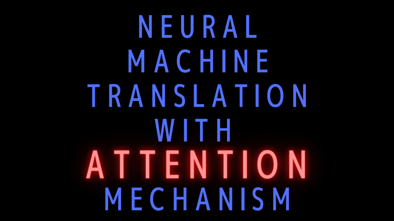
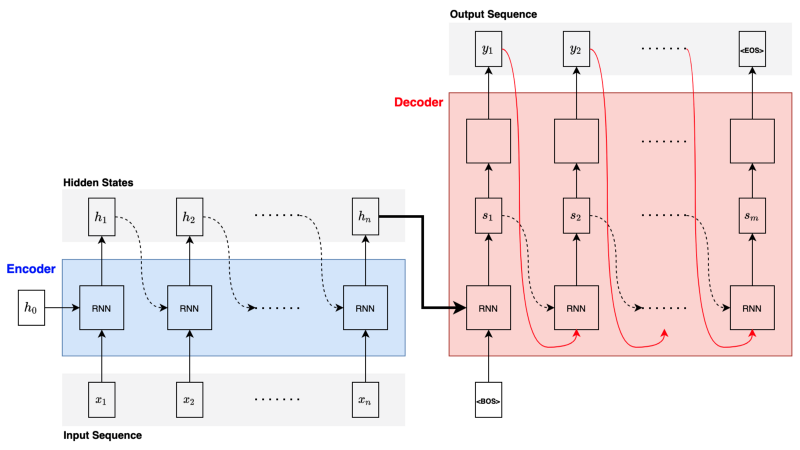
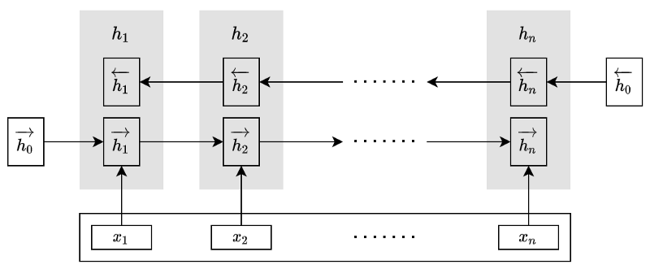
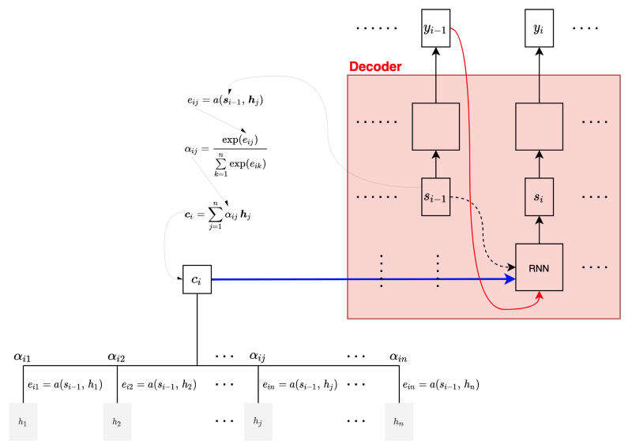

This article reviews a paper titled [Neural Machine Translation By Jointly Learning To Align And Translate](https://arxiv.org/abs/1409.0473) by Dzmitry Bahdanau, KyungHyun Cho, and Yoshua Bengio.

In 2014, machine translation using neural networks emerged. Researchers adapted encoder-decoder (or sequence-to-sequence) architectures that encode a sentence in one language into a fixed-length vector and then decode it to another language.

However, the approach requires the encoder to compress all required information into a fixed-length vector, no matter how long the source sentence is, making it difficult for the model to handle long sentences. The performance of such an encoder-decoder model goes down sharply as the length of an input sentence increases.

The paper proposed an extension to overcome the limitation of the encoder-decoder architecture by letting the decoder access all hidden states, not just the final one from the encoder. Moreover, the author introduced the attention mechanism so the decoder can learn how to use appropriate context to translate the source sentence into the target language.

The approach frees the encoder from compressing all required information into a fixed-length vector. As such, the length of the sentence becomes no longer a significant issue.

This article discusses the following topics:

- Encoder-Decoder Bottleneck
- Attention Mechanism
- Experimental Results

## Encoder-Decoder Bottleneck

In RNN encoder-decoder architecture, an RNN encoder processes an input sentence (a sequence of word vectors) to generate a fixed-length vector representing the input sentence. Then, an RNN decoder consumes the vector to produce a translation in the target language.

In general, an RNN encoder-decoder architecture looks like the following:

The RNN block can be any RNN, such as LSTM and GRU. For example, the paper uses GRU. Yet another paper [Sutskever et al. 2014](https://arxiv.org/abs/1409.3215) uses deep LSTMs (with four layers) for the encoder and decoder. From now on, we’ll call it RNN as it does not affect how the attention mechanism works.

As shown in the above diagram, the decoder receives the final hidden state from the encoder and the `<BOS>` (the beginning of sentence marker) to generate the first hidden state and then the first output (translated word vector). The decoder uses the first output and the previous hidden state to generate the second hidden state and the second output. The decoding continues until the decoder outputs an `<EOS>` (the end of sentence marker) to end the translation.

So, the encoder must squash all the relevant information from an input sentence (no matter how long) into a fixed-length vector. This arrangement creates a bottleneck in improving the performance of the encoder-decoder architecture. As such, it does not work well for long sentences.

## Attention Mechanism

The decoder implements an attention mechanism by soft-searching through annotations generated by the encoder. So, let’s first look at how the encoder generates those annotations.

The encoder uses a BiRNN (Bidirectional RNN) to capture richer context from the input sentence by producing annotations that are concatenations of the forward and backward hidden states at each step.

The right arrows indicate the hidden states in the forward RNN, whereas the left arrows indicate the hidden states in the backward RNN. The authors call the concatenated hidden states annotations.

Note: all vectors in this article are column vectors. An annotation is nothing but a vertical concatenation of two hidden states.

So, the encoder produces a sequence of annotations.

$$
\mathbf{h}_1, \mathbf{h}_2, \dots, \mathbf{h}_n
$$

Each annotation contains information from the whole input sentence thanks to the bidirectional RNN. Yet, each annotation has a strong focus on the parts surrounding it.

The question is how the decoder learns to pay attention to relevant annotations. It uses an alignment model with a trainable feedforward network to score how relevant each annotation is for the decoder’s hidden state.

$$
e_{ij} = a(\mathbf{s}_{i-1}, \mathbf{h}_j)
$$

Note: the decoder’s hidden state $\mathbf{s}$ is from the previous step, as we will see the reason soon.

We calculate the weights α of each annotation using the alignment scores:

$$
\alpha_{ij} = \dfrac{\exp(e_{ij})}{\sum\limits_{k=1}^n \exp(e_{ik})}
$$

The decoder computes a context vector that is a weighted sum of the annotations (aka soft-search):

$$
\mathbf{c}_{i} = \sum\limits_{j=1}^n \alpha_{ij} \mathbf{h}_j
$$

The following diagram shows that the decoder at step $i$ takes the previous state $\mathbf{s}_{i-1}$ and the current context $\mathbf{c}_i$ to generate the currently hidden state $\mathbf{s}_i$, which is why we use the previous state $\mathbf{s}_{i-1}$ to calculate the alignment scores.

As the whole architecture is trainable, including the alignment model, the decoder learns to pay attention to the relevant context from the input sentence.

The paper defines the alignment model as below:

$$
\begin{aligned}
a(\mathbf{s}_{i-1}, \mathbf{h}_j) &= \mathbf{v}_a^\top \tanh\left(W_a \mathbf{s}_{i-1} + U_a \mathbf{h}_j\right), \\
&\text{where } W_a \in \mathbb{R}^{n \times n}, U_a \in \mathbb{R}^{n \times 2n}, \mathbf{v}_a \in \mathbb{R}^n
\end{aligned}
$$

Now that the decoder knows how to pay attention to which annotations, the encoder does not have to encode all information into a fixed-length vector. This new approach should remove the performance bottleneck from the encoder-decoder architecture.

## Experimental Results

Using English-French translation datasets, the authors trained and tested four models:

- RNNenc-50
- RNNenc-30
- RNNsearch-50
- RNNserach-30

RNNenc models are RNN encoder-decoder models without the attention mechanism. RNNsearch models are RNN encoder-decoder models with the attention mechanism.

"50" means they trained the model with sentences of lengths up to 50. "30" means sentences of length up to 30.

For example, RNNenc-50 is a basic RNN encoder-decoder trained with sentences of lengths up to 50.

As you can see in the below graph, RNNsearch-50 outperforms other models for sentences of length longer than 20.

](images/figure-2.png)

Interestingly, RNNsearch-30 performs better than RNNenc-50, showing the power of the attention mechanism.

The below shows four sample alignments detected by RNNsearch-50. The rows are French words, and the columns are English words. The pixel intensity indicates the weight _α_(_ij_) of the annotation of the $j$-th source (English) word for the $i$-th target (French) word.

](images/figure-3.png)

In Figure 3 (d), the source phrase [the man]'s translation is [l' homme]. In French, [the] could be translated into [le], [la], [les], or [l'], depending on the word following [the]. The attention mechanism can solve such cases.

## References

- [Sequence to Sequence Learning with Neural Networks (2014)](https://arxiv.org/abs/1409.3215) \
  Ilya Sutskever, Oriol Vinyals, Quoc V. Le
- [Learning Phrase Representations using RNN Encoder-Decoder for Statistical Machine Translation (2014)](https://arxiv.org/abs/1406.1078) \
  Kyunghyun Cho, Bart van Merrienboer, Caglar Gulcehre, Dzmitry Bahdanau, Fethi Bougares, Holger Schwenk, Yoshua Bengio
- [Neural Machine Translation by Jointly Learning to Align and Translate (2014)](https://arxiv.org/abs/1409.0473) \
  Dzmitry Bahdanau, Kyunghyun Cho, Yoshua Bengio
- [Show, Attend and Tell: Neural Image Caption Generation with Visual Attention (2015)](https://arxiv.org/abs/1502.03044) \
  Kelvin Xu, Jimmy Ba, Ryan Kiros, Kyunghyun Cho, Aaron Courville, Ruslan Salakhutdinov, Richard Zemel, Yoshua Bengio
