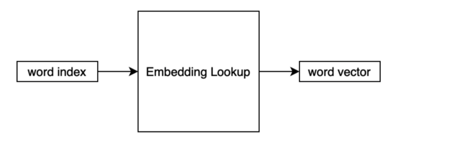
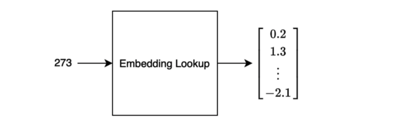

This article reviews [A Neural Probabilistic Language Model (2003)](https://www.jmlr.org/papers/volume3/bengio03a/bengio03a.pdf) by Yoshua Bengio et al. In the paper, the authors proposed to train a neural language model end-to-end, including a learnable word embedding layer. Their neural language model significantly outperformed the best n-grams model at that time, thanks to the embedding layer solving the curse of dimensionality problem.

We discuss the following topics:

- A Probabilistic Language Model
- Curse of Dimensionality
- Distributed Representation
- Embedded Lookup
- Word Similarity and Probability
- Neural Language Model

## A Probabilistic Language&nbsp;Model

A probabilistic language model predicts the next word given a sequence of words before that.

For example, what would be the next word given the following sequence?

```{.information}
I saw her standing ...
```

There is only one answer if it’s the Beatles’ song. Otherwise, there would be more than one possible next word:

```{.information}
I saw her standing there.

I saw her standing over there.

I saw her standing here.

I saw her standing quietly.

...
```

So, the model estimates the probability for each case.

$$
\begin{aligned}
P(\text{there} | \text{I saw her standing}) \\
P(\text{over there} | \text{I saw her standing}) \\
P(\text{here} | \text{I saw her standing}) \\
P(\text{quietly} | \text{I saw her standing}) \\
\dots
\end{aligned}
$$

If our model can predict well, we can use the model to predict the probability for a sequence of words.

## Curse of Dimensionality

A probabilistic language model can predict the joint probability of sequences of words in a natural language.

$$
P(\text{I saw her standing}) = P(\text{standing}|\text{I saw her}) P(\text{her}|\text{I saw}) P(\text{saw}|\text{I})P(\text{I})
$$

However, there is a fundamental difficulty because combinations of word sequences can be huge, causing the curse of dimensionality.

Suppose our vocabulary contains 100,000 words, and we want to calculate the joint distribution of 10 consecutive words. The number of free parameters is:

$$
100,000^{10} - 1 = 10^{50} - 1
$$

A free parameter means the probability of a particular sequence. The minus one in the equation is because the probability must sum up to 1.

For example, if we have only two words in a vocabulary and want to predict the joint probability of two consecutive words, there are 4 (=2x2) patterns. Each of the four combinations has a probability associated with them. However, if we know the probabilities for three patterns, we can calculate the probability for the last pattern. As such, the number of free parameters is three.

Since a natural language usually has an extensive vocabulary, the curse of dimensionality is a fundamental problem in language modeling.

Note: a vocabulary includes words, punctuation, and special characters. But, in this article, we call them “words” for simplicity.

## Distributed Representation

Another difficulty in a language model is that there are words that convey similar meanings. Similar words should have a similar probability when a model predicts the next word.

Using a one-hot vector to represent each word makes every word independent. However, we would need the vector size to be the same as the number of words in the vocabulary, which would be huge.

For now, let’s assume we represent each word using one-hot encoding. The number of elements in the vector is the same as the vocabulary size. The j-th word has 1 in the j-th element in the vector.

$$
w_j = \begin{bmatrix}
0 \\
0 \\
\vdots \\
1 \\
\vdots \\
0
\end{bmatrix}
$$

Let’s define an embedding matrix that converts the one-hot vector to a lower-dimensional vector.

$$
W_e = \begin{bmatrix}
w_{11} & w_{12} & \dots & w_{1j} & \dots & w_{1m} \\
w_{21} & w_{22} & \dots & w_{2j} & \dots & w_{2m} \\
\vdots & \vdots & \dots & \vdots & \dots & \vdots \\
w_{n1} & w_{n2} & \dots & w_{nj} & \dots & w_{nm} 
\end{bmatrix}
$$

The number of columns ($m$) is the vocabulary size. The number of rows ($n$) is the lower-dimensional vector size (the embedded vector size).

So, we are projecting the one-hot vector to a lower-dimensional vector as follows:

$$
\begin{aligned}
e_j &= W_e w_j \\
&= \begin{bmatrix}
w_{11} & w_{12} & \dots & w_{1j} & \dots & w_{1m} \\
w_{21} & w_{22} & \dots & w_{2j} & \dots & w_{2m} \\
\vdots & \vdots & \dots & \vdots & \dots & \vdots \\
w_{n1} & w_{n2} & \dots & w_{nj} & \dots & w_{nm} 
\end{bmatrix} \begin{bmatrix}
0 \\
0 \\
\vdots \\
1 \\
\vdots \\
0
\end{bmatrix} \\
&= \begin{bmatrix}
w_{1j} \\
w_{2j} \\
\vdots \\
w_{nj}
\end{bmatrix}
\end{aligned}
$$

This operation is nothing but a linear operation (with no bias and no activation). So, we can incorporate this into a neural network and back-propagate errors to update the weights in the embedding matrix.

Unlike sparse one-hot encoding, this representation uses continuous values and is dense. As such, it requires much fewer dimensions than the one-hot encoded vector.

Moreover, similar words would have higher similarity (cosine similarity), which we can calculate by the dot product between two-word vectors. Similar words should have similar weights because they should impact the joint probability calculation similarly.

We call this way of word representation “**distributed representation**” as opposed to the local representation (i.e., one-hot representation).

## Word Embedding Lookup

Using one-hot vectors to represent words would be pretty wasteful regarding memory usage. Also, performing an entire matrix operation would be inefficient.

In implementing the embedding matrix (layer), we look up a vector inside the matrix based on the word index. As such, we sometimes call such an operation “**embedding lookup**”.



A word index is a unique integer representing the word inside the vocabulary. The output is a vector of continuous values.



A sentence would be a list of word indices. For training, a batch of sentences would go through the lookup, which we can process in parallel.

As we train a model on a task in an end-to-end fashion, including the embedding layer, we optimize the distributed representations to perform well for the task.

## Word Similarity and Probability Distribution

In the paper, there is an intuitive example of word similarity. Let’s say we have the following sentence in the training corpus:

<blockquote>
“The cat is walking in the bedroom”
</blockquote>

Having seen such a sentence should help the model generalize to make a sentence like the one below:

<blockquote>
“A dog was running in a room”
</blockquote>

The reason is that “dog” and “cat” have similar semantic and grammatical roles. The same goes for “the” and “a”, “room” and “bedroom”, etc.

If the model can compose the first sentence, it should be able to make the second sentence since the words in both sentences have similarities.

Likewise, the following should all have similar probabilities. I highlighted the altered word in each sentence, comparing each with the previous sentence.

<blockquote>
“The cat is walking in the bedroom”

“The __dog__ is walking in the bedroom”

“__A__ dog is walking in the bedroom”

“A dog __was__ walking in the bedroom”

“A dog was __running__ in the bedroom”

“A dog was running in __a__ bedroom”

“A dog was running in a __room__”
</blockquote>

In summary, words with similar semantic, meaning, and grammatical roles have similar feature vectors. Since the probability function is a function of these feature values, a small change in the features will only induce a small change in the probability.

## Neural Language&nbsp;Model

Using the embedded lookup, the number of free parameters (matrix weights) only scales linearly with the number of words in the vocabulary. The same embedding vector is used for the same word regardless of where they are in a sentence.

As such, we do not have the curse of dimensionality problem.

The authors experimented with their neural language model, which performed significantly better than the best of the n-grams model.

Interestingly (looking from 2021’s standpoint), the paper spent a few pages discussing how to efficiently compute on CPU, which we are certainly not interested in now — remember, it was still 2003.

## References

- [Neural Machine Translation with Attention Mechanism](/blog/2021-09-29-neural-machine-translation-with-attention-mechanism/)
- [A Neural Probabilistic Language Model (2013)](https://www.jmlr.org/papers/volume3/bengio03a/bengio03a.pdf) \
  Yoshua Bengio, Réjean Ducharme, Pascal Vincent, Christian Jauvin