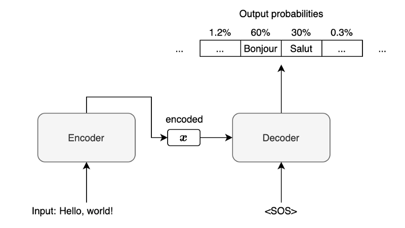
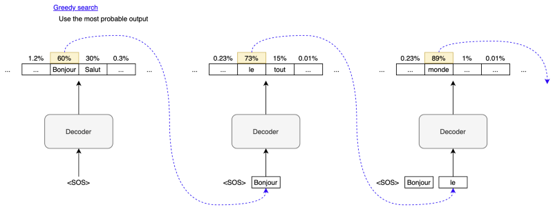
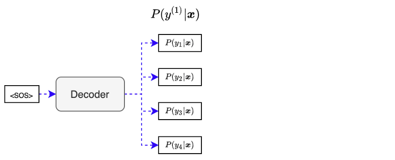
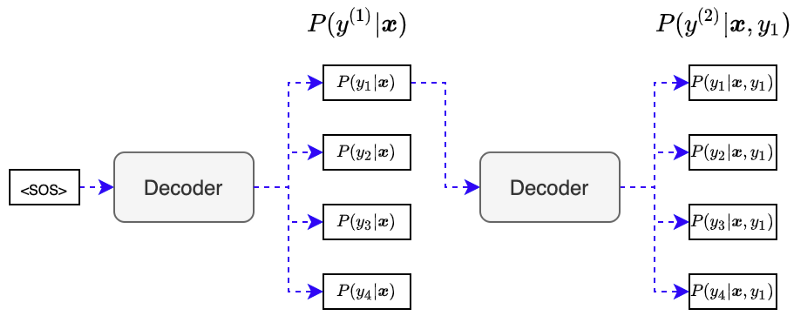
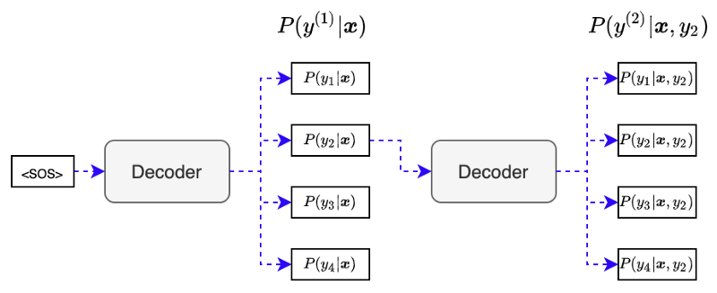
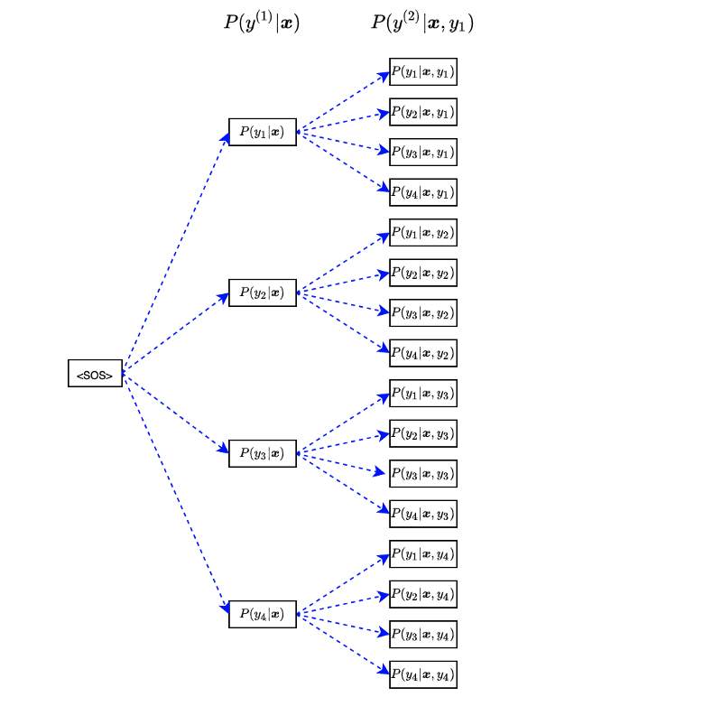
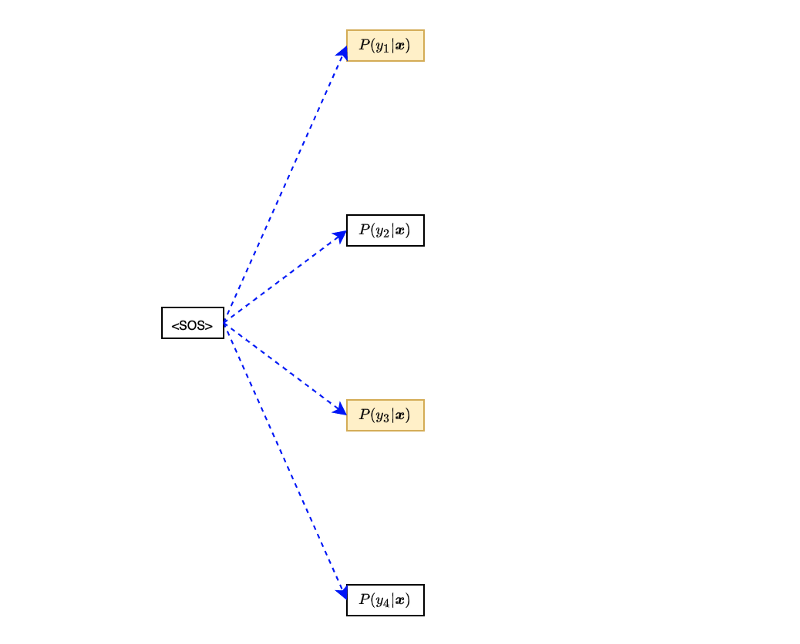
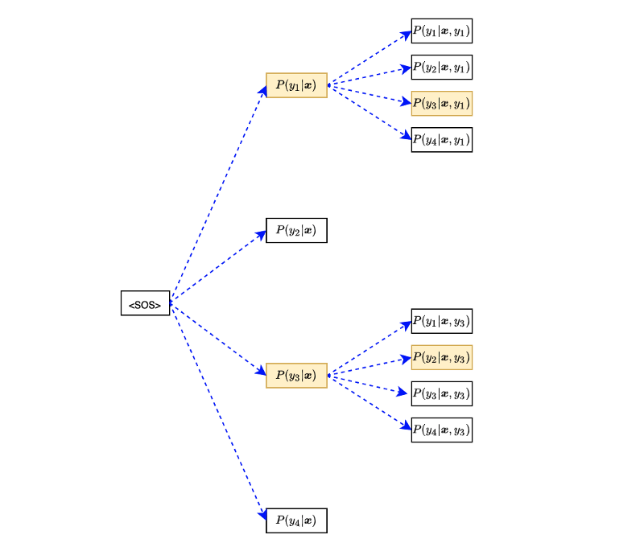

Beam search is a heuristic technique for choosing the most likely output used by probabilistic sequence models like [neural machine translation](/blog/2021/2021-09-29-neural-machine-translation-with-attention-mechanism/).

Machine translation is fundamentally multi-label learning where we have multiple plausible answers, yet the model must pick the best possible translation.

We often use greedy search while explaining machine translation models, focusing on core concepts such as the RNN encoder-decoder structure and attention mechanisms. So, we do not talk much about actual output generation.

However, it is a common assumption that we should already know what beam search is. As such, people new to the field might get stuck with the so-called minor detail before reaching the main subject in a paper.

This article discusses how beam search works with the following topics:

- Greedy Search
- Exhaustive Search
- Beam Search

## Greedy Search

In machine translation, the decoder produces a list of output probabilities.

For example, in an English-to-French machine translation, the encoder processes an input English sentence to produce encoded information (vector $\boldsymbol{x}$). Then, the decoder processes vector $\boldsymbol{x}$ to produce a list of output probabilities for the first step.

Note: `<SOS>` is a special character indicating the start of a sentence. The decoder receives it as the first input along with the vector $\boldsymbol{x}$.

For simplicity, we are not showing any attention mechanism or other details like [word embedding](/blog/2021/2021-10-12-word-embedding-lookup/). Such details won’t change anything about how beam search works. Our discussion focuses on the method of choosing an output given the list of output probabilities.

In the above diagram, given the input English sentence “Hello, world!”, the output probabilities for the first French word are 60% for “Bonjour”, 30% for “Salut”, and so on. If the output vocabulary includes 100,000 items (words and special characters), there will be 100,000 output probabilities.

In greedy search, we choose “Bonjour” as the model predicts it with the highest probability and use it as the second input to the decoder.

The decoder processes “Bonjour” as the second input and predicts “le” as the most probable second output, which we use as the third input to the decoder. The process continues until the decoder returns `<EOS>` (the end-of-sentence marker) as the most probable output.

The greedy search might work well if there was always one output with a very high probability. We can not always guarantee that because the more complex sentences would have multiple feasible translation outputs.

So, in general, the greedy search is not the best way and may not work well except for simple translations. Using the greedy search can lead us to the wrong path.

## Exhaustive Search

With an exhaustive search, we consider searching for all possible outputs.

Suppose we have only four items in the output vocabulary. We give `<SOS>` to the decoder to produce output probabilities:

The first step output probabilities depend on the encoded vector $\mathbf{x}$, which contains features from the input sentence. So, we can write the first step output as the conditional probability like below:

$$
P(y^{(1)}|\mathbf{x})
$$

Each output would have a different probability, but we use each for the next input to the decoder. For example, we give output $y_1$ to the decoder to produce output probabilities for the second step:

The second step output probabilities depend on the encoded vector $\mathbf{x}$ and the previous output $y_1$.

$$
P(y^{(2)}|\mathbf{x}, y_1)
$$

We combine the first-step and second-step probabilities to have the following joint probabilities:

$$
\begin{aligned}
P(y_1, y_1|\mathbf{x}) &= P(y_1|\mathbf{x})P(y_1|\mathbf{x},y_1) \\
P(y_1, y_2|\mathbf{x}) &= P(y_1|\mathbf{x})P(y_2|\mathbf{x},y_1) \\
P(y_1, y_3|\mathbf{x}) &= P(y_1|\mathbf{x})P(y_3|\mathbf{x},y_1) \\
P(y_1, y_4|\mathbf{x}) &= P(y_1|\mathbf{x})P(y_4|\mathbf{x},y_1)
\end{aligned}
$$

Although it has only two words, we can evaluate which output sequence has the highest probability using the above joint probabilities.

Note: for simplicity, I’m ignoring that one of the possible outputs is `<EOS>`, so we don’t need to talk about the termination condition. However, we should stop following a path when `<EOS>` happens.

We repeat the same procedure using output $y_2$ from the first step:

We combine the first-step and second-step probabilities to have the following joint probabilities:

$$
\begin{aligned}
P(y_2, y_1|\mathbf{x}) &= P(y_2|\mathbf{x})P(y_1|\mathbf{x},y_2) \\
P(y_2, y_2|\mathbf{x}) &= P(y_2|\mathbf{x})P(y_2|\mathbf{x},y_2) \\
P(y_2, y_3|\mathbf{x}) &= P(y_2|\mathbf{x})P(y_3|\mathbf{x},y_2) \\
P(y_2, y_4|\mathbf{x}) &= P(y_2|\mathbf{x})P(y_4|\mathbf{x},y_2)
\end{aligned}
$$

After processing all of the first outputs, we have 16 joint probabilities.

We can summarize the 16 joint probabilities in the following equation:

$$
P(y^{(1)}, y^{(2)}| \mathbf{x}) = P(y^{(1)}| \mathbf{x}) P(y^{(2)} | \mathbf{x}, y^{(1)})
$$

Next, we use each of 16 sequences to calculate the joint probabilities for 64 (=16x4) output sentences (containing three words). We can write the joint probabilities in the following equation:

$$
P(y^{(1)}, y^{(2)}, y^{(3)} | \mathbf{x}) = P(y^{(1)}| \mathbf{x}) P(y^{(2)} | \mathbf{x}, y^{(1)}) P(y^{(3)} | \mathbf{x}, y^{(1)}, y^{(2)})
$$

We continue this procedure for four-word, five-word, and so on. Our job is to find a vector $\mathbf{y}$ that gives the highest joint probability:

$$
\begin{aligned}
\arg\max\limits_{\mathbf{y}} \ &P(y^{(1)}, y^{(2)}, y^{(3)}, \dots | \mathbf{x}) \\
&P(y^{(1)}| \mathbf{x}) P(y^{(2)} | \mathbf{x}, y^{(1)}) P(y^{(3)} | \mathbf{x}, y^{(1)}, y^{(2)}) \dots \\
\\
\text{where } \mathbf{y} &= [y^{(1)}, y^{(2)}, y^{(3)}, \dots]
\end{aligned}
$$

However, the exhaustive search will cause the curse of dimensionality when dealing with many items in vocabulary and long output sentences. If we have 100,000 items in vocabulary and we search for output sentences with ten words, the number of permutations becomes:

$$
100,000^{10} = 10^{50}
$$

So, the exhaustive search becomes very exhausting (pun intended). But seriously, it consumes a lot of memory and computation time. We need something less complete than an exhaustive search, which works better than the greedy search.

## Beam Search

The beam search strikes a balance between the greedy search and the exhaustive search at the expense of introducing one hyper-parameter $\beta$, the number of paths (beams) we keep while running a beam search.

For instance, with β = 2, we only keep the first and the second probable sequence at each step. Let’s go through an example where we have only four items in the output vocabulary:

Suppose outputs $y_1$ and $y_3$ are the first and second probable outputs. Then, we continue only with them to the second step:

We use only the top two sequences: $(y_1, y_3)$ and $(y_3, y_2)$. So, we always keep the two most probable beams, avoiding the curse of the dimensionality problem.

When $\beta = 1$, the beam search becomes the greedy search. When $\beta$ is not limited, it becomes an exhaustive search.

## References

- [Beam Search, Wikipedia](https://en.wikipedia.org/wiki/Beam_search)
- [Beam Search, Dive Into Deep Learning, 9.8 Beam Search](https://d2l.ai/chapter_recurrent-modern/beam-search.html)
- [Beam Search, DeepLearning.AI, Sequence to sequence models](https://www.youtube.com/watch?v=RLWuzLLSIgw)
