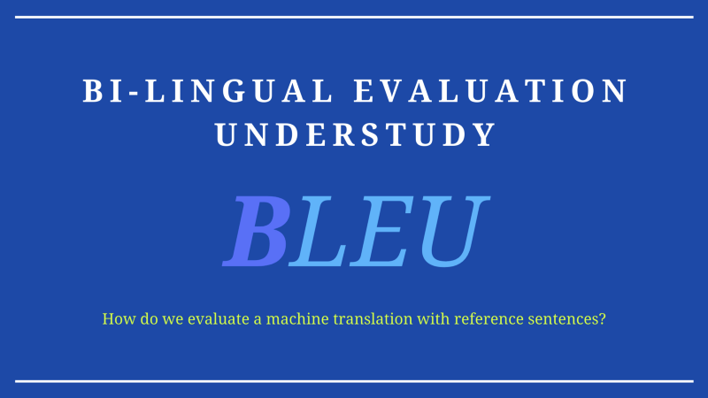

The article reviews the paper [BLEU: a Method for Automatic Evaluation of Machine Translation](https://aclanthology.org/P02-1040.pdf).

Human evaluations of machine translation (MT) requires skilled specialist and can take months to finish. It is an expensive and lengthy process.

The paper proposed an automatic MT evaluation that correlates well with human assessment. It is inexpensive and quick. They call it BLEU (Bi-Lingual Evaluation Understudy).

The main idea is that a quality machine translation should be closer to reference human translations. So, they prepared a corpus of reference translations and defined how to calculate the closeness metric to make quality judgments.

We discuss the following topics:

- Modified n-gram Precision
- Brevity Penalty
- The BLEU Metric
- A Python Example using NLTK
- Word of Caution

## Modified n-gram Precision

We, humans, can make many plausible translations of a given source sentence. Translated sentences may vary in word choices as there could be various synonyms with subtle nuance differences. We could change the ordering of words yet convey the same meaning.

How can we distinguish between good and lousy machine translations when we have many valid answers?

A good translation shares many words and phrases with reference translations. So, we can write a program that finds n-gram matches between an MT sentence and the reference translations.

Suppose an MT translates from a German source sentence to the following English sentence:

<blockquote>
MT output 1: A cat sat on the mat.
</blockquote>

Also, suppose we have the following reference translations (I’m taking the example references from the paper):

<blockquote>
Reference 1: The cat is on the mat.<br/>Reference 2: There is a cat on the mat.
</blockquote>

MT output 1 matches “A cat” (bigram) with reference 2 (we are ignoring the cases). It also matches “on the mat” (trigram) with both references 1 and 2.

Further, suppose another MT produces the following output:

<blockquote>
MT output 2: Cats stay in the living room.
</blockquote>

We can easily say MT output 2 is a worse translation than MT output 1 by counting the number of n-gram matches. MT output 1 has more matching n-grams with reference sentences than MT output 2. So, it seems we can calculate a precision based on n-gram matches.

However, this simple metric is flawed because MT can over-generate “reasonable” words.

<blockquote>
MT output 3: The cat the cat the cat the the cat cat.
</blockquote>

MT output 3 has many matching unigrams and bigrams. Yet, the translation makes no sense because it over-generates the matching words.

So, we need to ensure that a referenced n-gram is exhausted once matched. In other words, we clip the matching count for an n-gram by the largest count observed in any single reference.

$$
\text{Count}_{\text{clip}} = \min(\text{Count}, \text{Max\_Ref\_Count})
$$

To evaluate an MT system on a corpus of many source sentences, we compare each translated sentence (candidate) to the corresponding reference sentences, generating clipped and not-clipped n-gram counts.

Then, we can calculate the modified n-gram precision as follows:

$$
p_n = \dfrac{\sum\limits_{C \in \{\text{Candidates}\}} \sum\limits_{\text{n-gram} \in C} \text{Count}_{\text{clip}}(\text{n-gram})}{\sum\limits_{C' \in \{\text{Candidates}\}} \sum\limits_{\text{n-gram'} \in C'} \text{Count}(\text{n-gram'})}
$$

The formula looks complicated. So, let’s look at unigram precision examples. We’re going to ignore the ending period for simplicity.

<blockquote>
MT output 1: A cat sat on the mat.
<br/><br/>
Reference 1: __The__ __cat__ is __on__ the __mat__.

Reference 2: There is __a__ cat on the mat.
</blockquote>

MT output 1 has six unigrams, and the clipped unigram matching count is five. We matched “__the__” from MT output 1 with the first “__The__” from reference 1 as we are simply counting the first matching unigrams (also ignoring the cases).

So, the modified unigram precision of MT output 1 is:

$$
p_1 = \frac{5}{6}
$$

MT output 3 has ten unigrams.

<blockquote>
MT output 3: The cat the cat the cat the the cat cat.
<br/><br/>
Reference 1: __The__ __cat__ is on __the__ mat.

Reference 2: There is a cat on the mat.
</blockquote>

MT output 3 has five “__the__” and five “__cat__” unigrams. The clipped unigram matching counts of “__the__” is two because reference 1 has two “__the__” unigrams and reference 2 has one “__the__” unigram, so we clip the matching count by two. The clipped unigram count of “cat” is one.

Hence, the modified unigram precision of MT output 3 is:

$$
p_1 = \frac{3}{10}
$$

So, MT output 1 is better than MT output 3 in terms of modified unigram precision.

We can calculate the bigram precision as easily but just a bit more tedious. For example, bigrams in MT output 1 are “A cat”, “cat sat”, “sat on”, “on the”, and “the mat”. We can list all the bigrams in references 1 and 2 and compute the modified bigram precision.

The paper compared an excellent human translator and a standard (poor) machine translation system using 127 source sentences, each with four reference translations. Below is the average precision results:

](images/figure-1.png)

The blue indicates the human translator, and light purple indicates the machine translation. Clearly, the human translator achieves higher n-gram precision scores than the poor MT system. The difference becomes more apparent as we go from unigram to 4-gram precisions.

## Brevity Penalty

However, the modified n-gram precision fails when an MT system outputs a short sentence like the one below:

<blockquote>
MT output 4: The cat
</blockquote>

The modified unigram precision for the above is 2/2 = 1, and the modified bigram precision is 1/1 = 1. This result does not properly reflect the translation quality.

They introduced a _brevity penalty_ factor to overcome the issue with short MT outputs.

Let c be the length of an MT output, and r be the closest reference length. The brevity penalty BP is:

$$
\text{BP} = \begin{cases}
1                   & \text{if } c > r \\
e^{(1-\frac{r}{c})} & \text{if } c \le r
\end{cases}
$$

So, if the MT output is shorter than the closest reference sentence, the brevity penalty becomes less than 1. We use this penalty to reduce the modified n-gram precision as we will see next.

## The BLEU Metric

We define the BLEU score as follows:

$$
\text{BLEU} = \text{BP} \cdot \exp \left( \sum\limits_{n=1}^N w_n \log p_n \right)
$$

We calculate the geometric average of the modified n-gram precisions by calculating the sum of n-gram precisions from n=1 to N.

The baseline BLEU metric uses uniform weights and N=4:

$$
w_n = \frac{1}{N} = \frac{1}{4}
$$

The ranking behavior of the metric is more apparent in the log domain:

$$
\begin{aligned}
\log \text{BLEU} &= \log \text{BP} \cdot \exp \left( \sum\limits_{n=1}^N w_n \log p_n \right) \\
&= \log \text{BP} + \log \exp \left( \sum\limits_{n=1}^N w_n \log p_n \right) \\
&= \min(1 - \frac{r}{c}, \, 0) + \sum\limits_{n=1}^N w_n \log p_n
\end{aligned}
$$

So, if the MT sentence is too short, the penalty from the first term will reduce the score. If the MT sentence is too long, the n-gram precision from the second term will reduce the score. Otherwise, the modified n-gram precisions will be the primary source of the score.

When using the BLEU metric, it is essential to acknowledge that the score tends to be higher when there are more reference translations per source sentence. So, we must not compare two BLEU scores based on different numbers of reference translations.

## A Python Example using NLTK

We can use the NLTK Python library to calculate BLEU scores:

```python
from nltk.translate.bleu_score import sentence_bleu

references = [
    “The cat is on the mat.”,
    “There is a cat on the mat.”,
]

MT_outputs = [
    “A cat sat on the mat.”,
    “Cats stay in the living room.”,
    “The cat the cat the cat the the cat cat.”,
    “The cat”,
]

# weights are by default [0.25, 0.25, 0.25, 0.25] 
# but we set it explicitly below for demonstration purpose.
for MT_output in MT_outputs:
    bleu = sentence_bleu(references, MT_output, weights=[1/4]*4)
    print(f’{bleu:.04f}’)
```

I got the following outputs:

```
0.7391
0.2378
0.3018
0.1173
```

## Word of Caution

The authors tested BLEU scores and confirmed high score correlates well with human evaluations. The metric was proposed in 2002, but it is often used to this date.

However, we should also note that comparing n-grams may not always reflect the quality of translation. For example, if a translated sentence is actually better than the reference sentences but uses different n-grams, it will have a low BLEU score.

## References

- [BLEU: a Method for Automatic Evaluation of Machine Translation](https://aclanthology.org/P02-1040.pdf) \
  Kishore Papineni, Salim Roukos, Todd Ward, Wei-Jing Zhu
- [BLEU, Wikipedia](https://en.wikipedia.org/wiki/BLEU)
- [Bleu Score, DeepLearning.AI, Sequence to sequence models](https://www.youtube.com/watch?v=DejHQYAGb7Q) \
  Andrew Ng
- [NLTK, Natural Language Toolkit](https://www.nltk.org)
