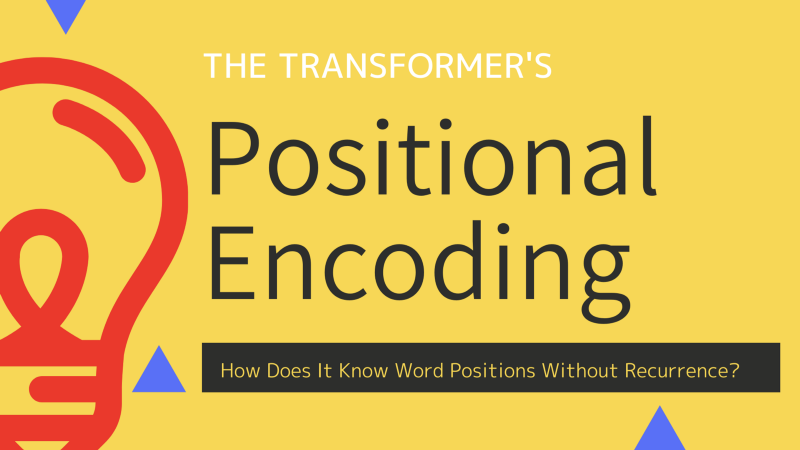
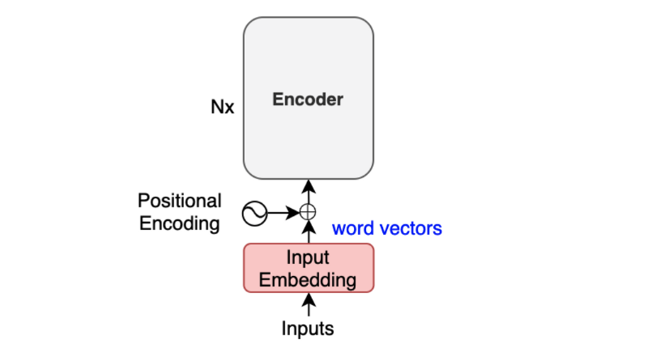
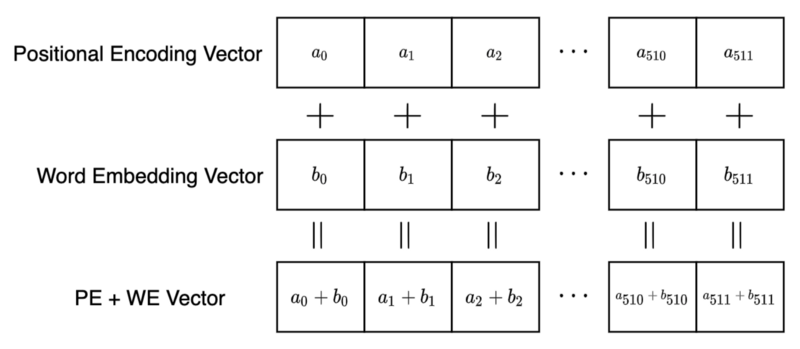
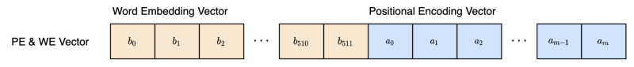
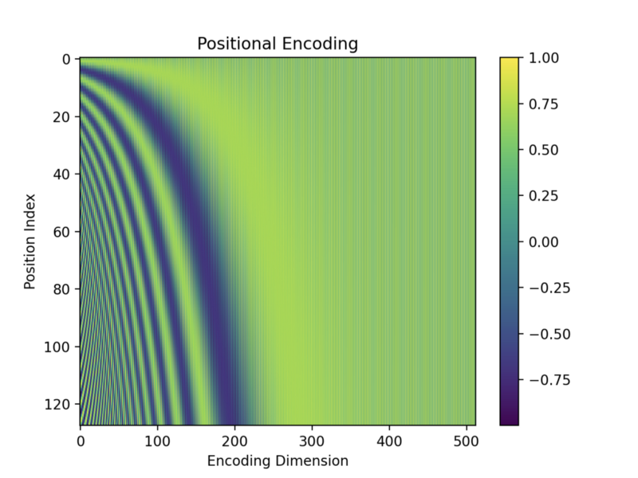
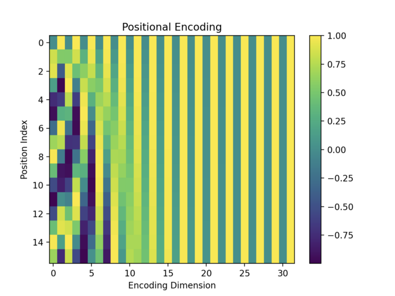
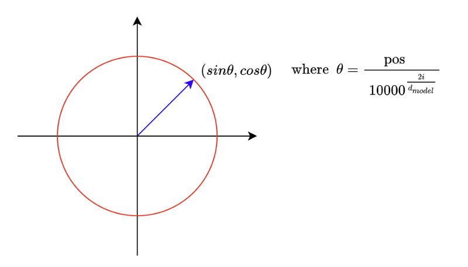
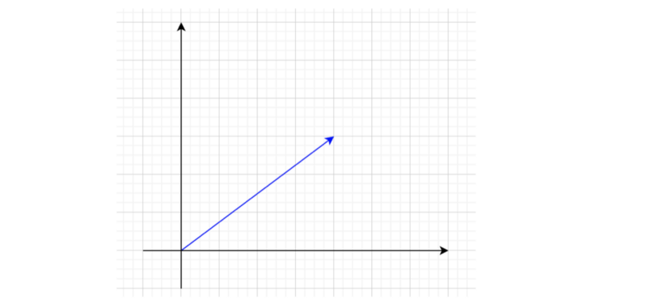
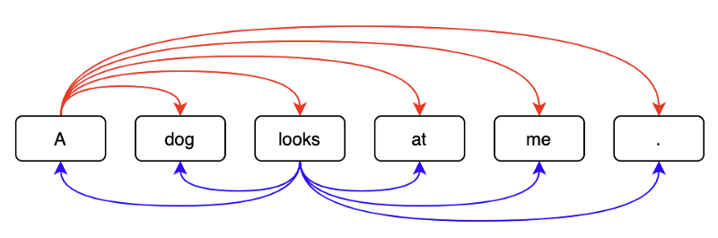
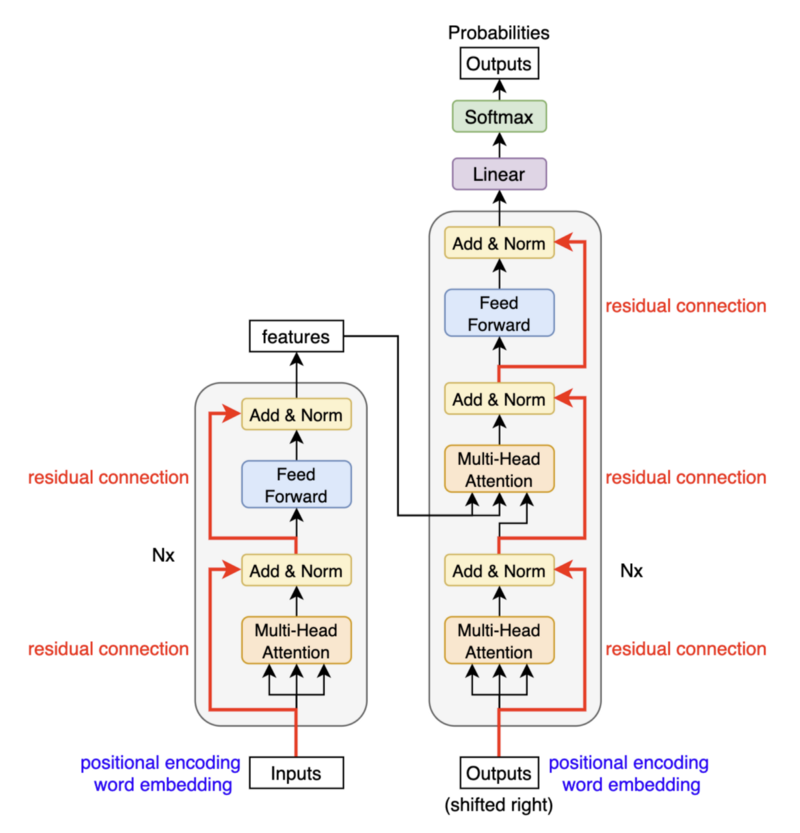

In 2017, Vaswani et al. published a paper titled [Attention Is All You Need](https://arxiv.org/abs/1706.03762) for the NeurIPS conference. They introduced the original transformer architecture for machine translation, performing better and faster than [RNN encoder-decoder](/blog/2021-09-29-neural-machine-translation-with-attention-mechanism/) models, which were mainstream at that time.

Then, the big transformer model achieved SOTA (state-of-the-art) performance on NLP tasks. 

- On the WMT 2014 English-to-German translation task, it reached a BLEU score of 28.4.
- On the WMT 2014 English-to-French translation task, it reached a BLEU score of 41.0.

The transformer is more performant and straightforward than other models that it superseded. The author says:

<blockquote>
We propose a new simple network architecture, the Transformer, based solely on attention mechanisms, dispensing with recurrence and convolutions entirely.
<cite>Source: [the paper](https://arxiv.org/abs/1706.03762)</cite>
</blockquote>

However, “simple” is probably not how most readers feel when looking at the architecture diagram for the first time.

](images/figure-1.png)

Reading the paper is inspirational but provokes many questions, and searching for the answers does not always yield a satisfactory explanation.

Detail-oriented readers might have many doubts about __positional encoding__, which we discuss in this article with the following questions:

- Why Positional Encoding?
- Why Add Positional Encoding To Word Embeddings?
- How To Encode Word Positions?
- How To Visualize Positional Encoding?
- How To Interpret Positional Encoding?
- Why Sine and Cosine Functions?
- How Positions Survive Through Multiple Layers?

## Why Positional Encoding?


In __3.5 Positional Encoding__ of [the paper](https://arxiv.org/abs/1706.03762), the author explains why they need to encode the position of each token (word, special character, or whatever distinct unit):

<blockquote>
Since our model contains no recurrence and no convolution, in order for the model to make use of the order of the sequence, we must inject some information about the relative or absolute position of the tokens in the sequence.
<cite>Source: [the paper](https://arxiv.org/abs/1706.03762)</cite>
</blockquote>

Historically, researchers used RNNs (Recurrent Neural Networks) to keep track of ordinal dependencies in sequential data. Later, researchers incorporated [attention mechanism](/blog/2021-09-29-neural-machine-translation-with-attention-mechanism/) into RNN encoder-decoder architectures to better extract contextual information for each word.

On the contrary, the transformer’s encoder-decoder architecture uses attention mechanisms without recurrence and convolution. That’s what the paper title “Attention Is All You Need” means.

However, without positional information, an attention-only model might believe the following two sentences have the same semantics:

<blockquote>
Tom bit a dog.
<br><br>
A dog bit Tom.
</blockquote>

That’d be a bad thing for machine translation models. So, yes, we need to encode word positions (note: I’m using ‘token’ and ‘word’ interchangeably).

The question is: how?

## Why Add Positional Encoding To Word Embeddings?


Vaswani et al. explain how they put positional encoding (PE):

<blockquote>
we add “positional encodings” to the input embeddings at the bottoms of the encoder and decoder stacks.
<cite>Source: [the paper](https://arxiv.org/abs/1706.03762)</cite>
</blockquote>

Let’s look at where inputs feed to the encoder.



The positional encoding happens after input word embedding and before the encoder.

The author explains further:

<blockquote>
The positional encodings have the same dimension d_model as the embeddings, so that the two can be summed.
<cite>Source: [the paper](https://arxiv.org/abs/1706.03762)</cite>
</blockquote>

The base transformer uses word embeddings of 512 dimensions (elements). Therefore, the positional encoding also has 512 elements so that we can sum a word embedding vector and a positional encoding vector by element-wise addition.

{width="75%"}

But why element-wise addition?

Why do we mix two different concepts into the same multi-dimensional space? How can a model distinguish between word embeddings and positional encodings?

Why don’t we use vector concatenation like the one below?



Using a concatenation of two vectors, the model sees a positional encoding vector independent from word embedding, which might make learning (optimization) easier.

However, there are some drawbacks. It increases the memory footprint, and training will likely take longer as the optimization process needs to adjust more parameters due to the extra dimensions.

How about reducing the number of elements in positional encoding? Concatenation does not require two vectors to have equal dimensions. So, we can adjust the size of the encoding vector to just big enough to support positional encoding, can’t we? One problem with this approach is that the number of dimensions in the positional encoding will become another hyper-parameter to tune.

Granted that we can think of various alternative approaches to positional encoding, the truth is they pushed positional encoding vectors into the same space as the word embedding vectors, and it worked.

The model can learn to use the positional information without confusing the embedding (semantic) information. It’s hard to imagine what’s happening inside the network, yet it works.

Moreover, it benefits from requiring less memory and potentially less training time than the hypothetical concatenation approach. Also, we don’t need an additional hyperparameter. So, let’s accept this as a viable method and continue reading the paper.

## How To Encode Word Positions?

How do we calculate positional encoding? The author explains it as follows:

<blockquote>
In this work, we use sine and cosine functions of different frequencies:

$$
{\Large
\begin{aligned}
\text{PE}(pos, 2i) = \sin(pos/10000^{2i/d_\text{model}}) \\
\text{PE}(pos, 2i+1) = \cos(pos/10000^{2i/d_\text{model}}) \\
\end{aligned}
}
$$

where pos is the position and i is the dimension. That is, each dimension of the positional encoding corresponds to a sinusoid. The wavelengths form a geometric progression from 2π to 10000 · 2π.

<cite>3.5 Positional Encoding of [the paper](https://arxiv.org/pdf/1706.03762.pdf)</cite>
</blockquote>

The above formulas look complex. So, let’s expand it, assuming the model uses 512 dimensions for positional encoding (and word embedding).

$$
d_\text{model} = 512
$$

We represent each token as a vector of 512 dimensions (from element 0 to element 511).

A position (pos) is an integer from 0 to a pre-defined maximum number of tokens in a sentence (a.k.a. max length) minus 1. For example, if the max length is 128, positions are 0 to 127.

For every pair of elements, we calculate the angle (in radian) as follows:

$$
\dfrac{\text{pos}}{10000^{\frac{2i}{512}}}
$$

Since we have 512 dimensions, we have 256 pairs of sine and cosine values. As such, the value of i goes from 0 to 255.

Considering everything, we calculate each element of the positional encoding vector for a position (pos) as follows:

$$
\begin{aligned}
\text{PE}(\text{pos}, 0) &= \sin\left( \dfrac{\text{pos}}{10000^{\frac{0}{512}}} \right) \\
\text{PE}(\text{pos}, 1) &= \cos\left( \dfrac{\text{pos}}{10000^{\frac{0}{512}}} \right) \\
\text{PE}(\text{pos}, 2) &= \sin\left( \dfrac{\text{pos}}{10000^{\frac{2}{512}}} \right) \\
\text{PE}(\text{pos}, 3) &= \cos\left( \dfrac{\text{pos}}{10000^{\frac{2}{512}}} \right) \\
\text{PE}(\text{pos}, 4) &= \sin\left( \dfrac{\text{pos}}{10000^{\frac{4}{512}}} \right) \\
\text{PE}(\text{pos}, 5) &= \cos\left( \dfrac{\text{pos}}{10000^{\frac{4}{512}}} \right) \\
\vdots \\
\text{PE}(\text{pos}, 510) &= \sin\left( \dfrac{\text{pos}}{10000^{\frac{510}{512}}} \right) \\
\text{PE}(\text{pos}, 511) &= \cos\left( \dfrac{\text{pos}}{10000^{\frac{510}{512}}} \right) \\
\end{aligned}
$$

So, the encoding for word position 0 is:

$$
\begin{aligned}
\text{PE}(0) &= {\tiny \left(
    \sin\left( \dfrac{0}{10000^{\frac{0}{512}}} \right), \cos\left( \dfrac{0}{10000^{\frac{0}{512}}} \right),
    \sin\left( \dfrac{0}{10000^{\frac{2}{512}}} \right), \cos\left( \dfrac{0}{10000^{\frac{2}{512}}} \right),
    \dots,
    \sin\left( \dfrac{0}{10000^{\frac{510}{512}}} \right), \cos\left( \dfrac{0}{10000^{\frac{510}{512}}} \right)
\right)} \\
&= (\sin(0), \cos(0), \sin(0), \cos(0), \dots, \sin(0), \cos(0)) \\
&= (0, 1, 0, 1, \dots, 0, 1)
\end{aligned}
$$

Therefore, position 0 is a vector with alternatively repeating 0s and 1s.

Position 1 is as follows:

$$
\begin{aligned}
\text{PE}(1) &= {\tiny \left(
    \sin\left( \dfrac{1}{10000^{\frac{0}{512}}} \right), \cos\left( \dfrac{1}{10000^{\frac{0}{512}}} \right),
    \sin\left( \dfrac{1}{10000^{\frac{2}{512}}} \right), \cos\left( \dfrac{1}{10000^{\frac{2}{512}}} \right),
    \dots,
    \sin\left( \dfrac{1}{10000^{\frac{510}{512}}} \right), \cos\left( \dfrac{1}{10000^{\frac{510}{512}}} \right)
\right)} \\
&= (0.8414, 0.5403, 0.8218, 0.5696, \dots, 0.0001, 0.9999)
\end{aligned}
$$

Note: I truncated element values to the fourth decimal place.

We can see that the sine and cosine pair at the end is close to 0 and 1, which makes sense since the denominator inside the sine and cosine functions becomes very big, that the angle is pretty much zero.

Looking at these numbers makes not much sense. Let’s visualize them and see if we can find any patterns.

## How To Visualize Positional Encoding?

We can write a short Python script to generate all the positional encoding values:

```python
import math
import numpy as np

MAX_SEQ_LEN = 128 # maximum length of a sentence
d_model = 512 # word embedding (and positional encoding) dimensions

# pre-allocates vectors with zeros
PE = np.zeros((MAX_SEQ_LEN, d_model))

# for each position, and for each dimension
for pos in range(MAX_SEQ_LEN):
    for i in range(d_model//2):
        theta = pos / (10000 ** ((2*i)/d_model))
        PE[pos, 2*i ] = math.sin(theta)
        PE[pos, 2*i + 1] = math.cos(theta)
```

Instead of using for-loop, we can take advantage of NumPy’s parallelizable operations (inspired by [the PyTorch tutorial](https://pytorch.org/tutorials/beginner/transformer_tutorial.html)):

```python
# replace the above for loop
pos = np.arange(MAX_SEQ_LEN)[:, np.newaxis]
div_term = np.exp(np.arange(0, d_model, 2) * (-math.log(10000.0) / d_model))

PE[:, 0::2] = np.sin(pos * div_term)
PE[:, 1::2] = np.cos(pos * div_term)
```

`np.arange(0, d_model, 2)` generates integers from `0` to `d_model - 2`. Below is an example where `d_model = 10`.

```
>>> np.arange(0, 10, 2)
array([0, 2, 4, 6, 8])
```

So, we are calculating the below for each `2i` from the `np.arange` term:


$$
\begin{aligned}
\exp \left( \dfrac{ 2i \times (-\log 10000) }{ d_{model} } \right) 
&= \exp \left( \log 10000^{ -\dfrac{2i}{ d_{model} } } \right) \\
&= 10000 ^{- \dfrac{ 2i }{ d_{model} } } \\\\
&= \dfrac{1}{10000 ^{\dfrac{ 2i }{ d_{model} } } }
\end{aligned}
$$

We use this as the division term in the positional encoding formula:

$$
{\Large
\begin{aligned}
\text{PE}_{(pos, 2i)} = \sin(pos/10000^{2i/d_\text{model}}) \\
\text{PE}_{(pos, 2i+1)} = \cos(pos/10000^{2i/d_\text{model}}) \\
\end{aligned}
}
$$

Both codes produce the same values. I like the one with for-loops better because it’s easy to understand and runs fast enough to experiment with a small MAX_SEQ_LEN. For actual implementations, it’d be better to use the faster version. In either case, we only need to generate positional encoding values once.

```python
import matplotlib.pyplot as plt

im = plt.imshow(PE, aspect=’auto’)

plt.title(“Positional Encoding”)
plt.xlabel(“Encoding Dimension”)
plt.ylabel(“Position Index”)
plt.colorbar(im)
plt.show()
```



The top row is position 0, and the bottom is position 127, as I used the max length of a sentence = 128. The x-axis is for the vector dimension index from 0 to 511.

The values are between -1 and 1 since they are from sine and cosine functions. Darker colors indicate values closer to -1, and brighter (yellow) colors are closer to 1. Green colors indicate values in between. For example, dark green colors indicate values around 0.

As expected, the values towards the right (the end of vector elements) seem to have alternating 0s (dark green) and 1s (yellow). But it’s hard to see due to the fine pixels.

So, I created a smaller version of the encoding matrix with the max length = 16 and the d_model = 32.



Encoding vectors with bigger position indices have fewer alternating 0s and 1s. Each row has a unique pattern, so I imagine the model could somehow distinguish between them. We’ll see more details of positional encoding calculation later on.

Next, let’s interpret what positional encoding represents.

## How To Interpret Positional Encoding?

Let’s look at it differently to have more intuition about positional encoding. As we know, positional encoding has pairs of sine and cosine functions. If we take any pair and plot positions on a 2D plane, they are all on a unit circle.



When we increase the pos value, the point moves clockwise. It’s like a clock hand that moves as word position increases. In a positional encoding vector with 512 dimensions, we have 256 hands.

Looking at the first two pairs in positional encoding, the second-hand moves slower than the first because the denominator increases as the dimensional index increases.

$$
\begin{aligned}
\text{PE}(\text{pos}, 0) &= \sin\left( \dfrac{\text{pos}}{10000^{\frac{0}{512}}} \right) \\
\text{PE}(\text{pos}, 1) &= \cos\left( \dfrac{\text{pos}}{10000^{\frac{0}{512}}} \right) \\
\text{PE}(\text{pos}, 2) &= \sin\left( \dfrac{\text{pos}}{10000^{\frac{2}{512}}} \right) \\
\text{PE}(\text{pos}, 3) &= \cos\left( \dfrac{\text{pos}}{10000^{\frac{2}{512}}} \right) \\
\end{aligned}
$$

So, we can interpret positional encoding as a clock with many hands at different speeds. Toward the end of a positional encoding vector, hands move slower and slower when increasing the position index (pos).

The hands near the end of the dimensions are slow because the denominator is large. The angles are approximately zeros there unless the position index is significant enough.

We can confirm that by looking at the positional encoding image again. Below is the smaller version of the positional encoding image.


So, we can think of each position having a clock with many hands pointing to a unique time.

Now, let’s try interpreting the combination of positional encoding and word embedding. If we take the first two dimensions of a word embedding vector, we can draw it in a 2D plane.



Adding the first two dimensions of a positional encoding to this will point somewhere on a unit circle around the word embedding.

{width="75%"}

So, points on the unit circle represent the same word with different positions.

{width="75%"}

For higher dimensions, it’s hard to imagine visually. As such, we won’t go into that.

However, there is one question: if word embedding vectors and positional encoding vectors are in similar magnitudes, the model could get confused about which are which. So, how does the model distinguish between word embeddings and positional encodings?

The word embedding layer has learnable parameters, so the optimization process can adjust the magnitudes of word embedding vectors if necessary. I’m not saying that is indeed happening, but it is capable of that. Amazingly, the model somehow learns to use the word embeddings and the positional encodings without mixing them up.

The power of optimization is incredible.

## Why Sine and Cosine Functions?

We can identify each word position uniquely using positional encoding. But how does the model know the relative positions of words in a sentence?



The author explains their thought process:

<blockquote>
We chose this function because we hypothesized it would allow the model to easily learn to attend by relative positions, since for any fixed offset k, PE pos+k can be represented as a linear function of PE pos.
<cite>Source: [the paper](https://arxiv.org/abs/1706.03762)</cite>
</blockquote>

We can rotate each hand in a clock to represent another time. In other words, we can manipulate one-word position to another using a rotation matrix which is a linear operation. Hence, a neural network can learn to understand relative word positions. As the author mentions, it was a hypothesis but sounds quite reasonable.

The author further explains why they chose sine and cosine functions:

<blockquote>
We chose the sinusoidal version because it may allow the model to extrapolate to sequence lengths longer than the ones encountered during training.
<cite>Source: [the paper](https://arxiv.org/abs/1706.03762)</cite>
</blockquote>

If a model can identify the relative positions of words by rotations, it should be able to detect any relative positions.

So, these are the reasons why they chose sine and cosine functions. They also tested the transformer with positional __embedding__, which encodes positional information using a network layer with learnable parameters.

<blockquote>
We also experimented with using learned positional embeddings [9] instead, and found that the two versions produced nearly identical results (see Table 3 row (E)).
<cite>Source: [the paper](https://arxiv.org/abs/1706.03762)</cite>
</blockquote>

So, they went for the simpler (fixed) encoding method.

## How Positions Survive through Multiple Layers?

The encoder in the transformer takes input word embeddings containing positional encodings and applies further operations. If so, why doesn’t the model lose the word positions in the process?

The transformer circumvents this problem by residual connections:



The positional encodings carry over through multiple layers in the encoder and decoder.

## References

- [Attention Is All You Need](https://arxiv.org/abs/1706.03762) \
  Ashish Vaswani, Noam Shazeer, Niki Parmar, Jakob Uszkoreit, Llion Jones, Aidan N. Gomez, Lukasz Kaiser, Illia Polosukhin
- [Transformer Architecture: The Positional Encoding](https://kazemnejad.com/blog/transformer_architecture_positional_encoding/) \
  Amirhossein Kazemnejad’s Blog
- [The Illustrated Transformer](http://jalammar.github.io/illustrated-transformer/) \
  Jay Alammar
- [Language modeling with nn.Transformer and torchtext](https://pytorch.org/tutorials/beginner/transformer_tutorial.html) \
  PyTorch Tutorial
