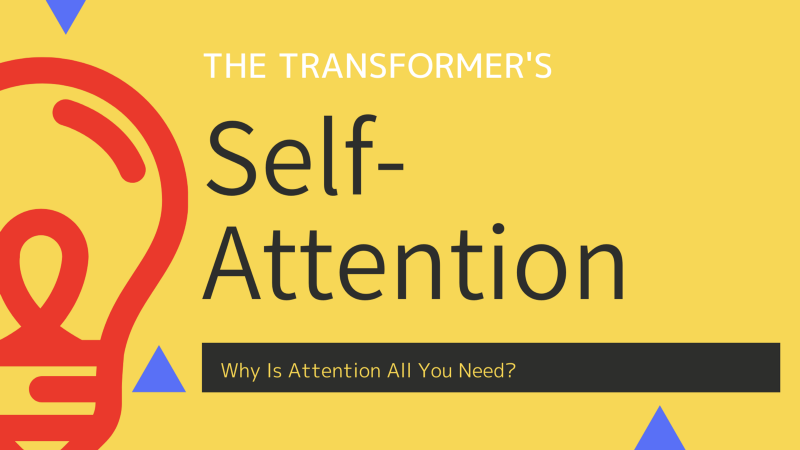
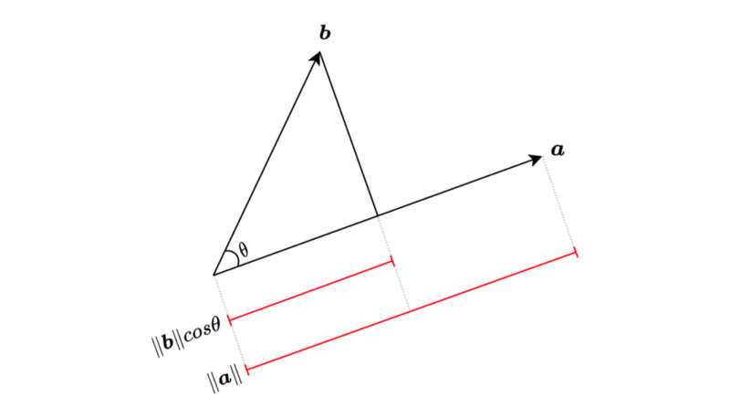
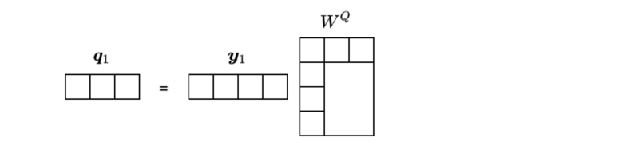
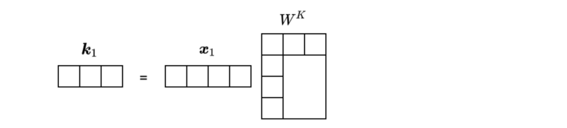

In 2017, Vaswani et al. published a paper titled [Attention Is All You Need](https://arxiv.org/abs/1706.03762) for the NeurIPS conference. [The transformer architecture](/blog/2021-12-13-transformers-encoder-decoder/) does not use recurrence or convolution. It solely relies on attention mechanisms.

In this article, we discuss the attention mechanisms in the transformer:

- Dot-Product And Word Embedding
- Scaled Dot-Product Attention
- Multi-Head Attention
- Self-Attention

## Dot-Product And Word Embedding

The dot-product takes two equal-length vectors and returns a single number.

$$
\begin{aligned}
\boldsymbol{a} &= [ a_1, a_2, \dots, a_n] \\
\boldsymbol{b} &= [ b_1, b_2, \dots, b_n] \\
 \\
\boldsymbol{a} \cdot \boldsymbol{b} & = [a_1 b_1 + a_2 b_2 + \dots + a_n b_n] \\
&= \sum\limits_{i=1}^n a_i b_i
\end{aligned}
$$

We use the dot operator to express the dot-product operation. We also call it the inner product as we calculate element-wise multiplication (that is, “inner product”) and sum those products together.

The geometric definition of the dot product is as follows:

$$
\boldsymbol{a} \cdot \boldsymbol{b} = \|\boldsymbol{a}\| \|\boldsymbol{b}\| \cos \theta
$$

$\|\boldsymbol{a}\|$ is the magnitude of vector $\boldsymbol{a}$, and $\|\boldsymbol{b}\|$ is the magnitude of vector $\boldsymbol{a}$. $\theta$ is the angle between vector $\boldsymbol{a}$ and vector $\boldsymbol{b}$.



We can also project vector $\boldsymbol{a}$ onto vector $\boldsymbol{b}$ and visualize the product of $\|\boldsymbol{a}\| cosθ$ and $\|\boldsymbol{b}\|$. The calculated value is the same either way.

The dot-product $\|\boldsymbol{a}\| \|\boldsymbol{b}\| \cos \theta$ is at maximum when $\theta$ is 0 ($\cos 0 = 1$), and at minimum when is $\theta$ is $2\pi$ ($\cos 2\pi = -1$). In other words, the dot-product is bigger when two vectors have similar directions than otherwise.

Before discussing dot-product attention, we should talk about word embeddings as it gives us some intuition on how dot-product attention works.

Word embeddings use distributed representations of words (tokens), which is more efficient than one-hot vector representation. The word2vec and GloVe (Global Vectors for Word Representation) are well-known pre-trained word embeddings. Those word embedding vectors allow us to decompose a word into analogies.

The following diagram shows how we can decompose king and queen using word embedding vectors.

](images/king-queen.png)

In other words, a word vector may contain multiple semantics. Hypothetically, we could query if a word vector has “royal” by projecting the vector with some matrix operation.

The question is: can a language model automatically learn to query different meanings and functions of each word in a sentence?

The transformer learns word embeddings from scratch, learns matrix weights for word vector projections, and calculates the dot-products for attention mechanisms. In the next section, we discuss how those vector mathematics work together.

## Scaled Dot-Product Attention

Say we have a model that translates an English sentence $X$ into a French sentence $Y$. In the output sentence, the first-word vector would be a BOS (beginning-of-sentence) marker which is just another word vector (albeit fixed), and we call it vector $\boldsymbol{y}_1$. The model needs to extract a context from the input sentence $X$ for the first-word vector $\boldsymbol{y}_1$ in the output sentence $Y$.

For simplicity, we express a word vector as a row vector with four dimensions.


We use a 4x3 matrix $W^Q$ to project word vector $\boldsymbol{y}_1$:


It’s a simple matrix multiplication on the word vector $\boldsymbol{y}_1$.

$$
\boldsymbol{q}_1 = \boldsymbol{y}_1 W^Q
$$

As you can see, the dimension of $\boldsymbol{q}_1$ does not have to be the same as that of $\boldsymbol{y}_1$.



In this example, the dimension of the resulting vector became three.

We also project word vectors in $X$ using another matrix $W^K$. For example, we project word vector $\boldsymbol{x}_1$ in $X$ as follows:

$$
\boldsymbol{k}_1 = \boldsymbol{x}_1 W^K
$$

Again, the dimension of $\boldsymbol{k}_1$ does not have to be the same as the dimension of $\boldsymbol{x}_1$.



However, the dimension of $\boldsymbol{k}_1$ must be the same as the dimension of $\boldsymbol{q}_1$. Only then can we apply the dot-product to them.

$$
\dim(\boldsymbol{q}_1) = \dim(\boldsymbol{k}_1)
$$

We apply the dot-product to see how strong these projected features (we call them query $\boldsymbol{q}_1$ and key $\boldsymbol{k}_1$) relate to each other:

$$
s_{11} = \boldsymbol{q}_1 \cdot \boldsymbol{k}_1
$$

We can calculate the dot-product by transposing vector $\boldsymbol{k}_1$ and performing matrix multiplication:


The result is a scalar value. Let’s call it “score”. As noted above, we also call vector $\boldsymbol{q}_1$ “query” and vector $\boldsymbol{k}_1$ “key”. In other words, we extract a query from vector $\boldsymbol{y}_1$, extract a key from vector $\boldsymbol{x}_1$, and check how well the query matches with the key by the score $s_{11}$. So, we are finding out how two-word vectors relate in terms of extracted features (the query and the key).

Since we are using a linear transformation, we can calculate scores between multiple word-vectors by a simple matrix operation.

Sentence $X$ consists of $n$ word vectors (in reality, an input sentence has a pre-defined number of tokens, and unused word positions filled with a filler are effectively ignored):

$$
X = \begin{bmatrix}
\boldsymbol{x}_1 \\
\boldsymbol{x}_2 \\
\vdots \\
\boldsymbol{x}_n \\
\end{bmatrix}
$$

We can apply the following matrix operation to extract keys from sentence $X$:

$$
XW^K = \begin{bmatrix}
\boldsymbol{x}_1 \\
\boldsymbol{x}_2 \\
\vdots \\
\boldsymbol{x}_n \\
\end{bmatrix} W^K = \begin{bmatrix}
\boldsymbol{x}_1 W^K \\
\boldsymbol{x}_2 W^K \\
\vdots \\
\boldsymbol{x}_n W^K \\
\end{bmatrix} = \begin{bmatrix}
\boldsymbol{k}_1 \\
\boldsymbol{k}_2 \\
\vdots \\
\boldsymbol{k}_n \\
\end{bmatrix} = K
$$

We can apply the dot-product between the query $\boldsymbol{q}_1$ and all of the keys in $K$:

$$
\begin{aligned}
\boldsymbol{q}_1 K^\top &= \boldsymbol{q}_1 \begin{bmatrix}
\boldsymbol{k}_1 \\
\boldsymbol{k}_2 \\
\vdots \\
\boldsymbol{k}_n \\
\end{bmatrix}^\top \\
&= \boldsymbol{q}_1 \begin{bmatrix}
\boldsymbol{k}_1^\top & \boldsymbol{k}_2^\top & \dots & \boldsymbol{k}_n^\top
\end{bmatrix} \\
&= \begin{bmatrix}
\boldsymbol{q}_1 \boldsymbol{k}_1^\top & \boldsymbol{q}_1 \boldsymbol{k}_2^\top & \dots & \boldsymbol{q}_1 \boldsymbol{k}_n^\top
\end{bmatrix} \\
&= \begin{bmatrix}
s_{11} & s_{12} & \dots & s_{1n}
\end{bmatrix}
\end{aligned}
$$

We now have a list of scores that tells us how the query $\boldsymbol{q}_1$ relates to each key in sentence $X$. We can apply the softmax function to convert the scores into weights:

$$
\begin{aligned}
\\
\text{softmax}(\boldsymbol{q}_1 K^\top) &= \text{softmax}(\begin{bmatrix}
s_{11} & s_{12} & \dots & s_{1n}
\end{bmatrix}) \\
&= \begin{bmatrix}
w_{11} & w_{12} & \dots & w_{1n}
\end{bmatrix}
\end{aligned}
$$

The weights indicate how much the model should pay attention to each word in sentence $X$ regarding the query $\boldsymbol{q}_1$. So, let’s call the weights “attention weights”.

We use the attention weights to extract a context from sentence $X$, but we need to handle one more step. Since we are dealing with a specific query, we should also extract particular values from sentence $X$. We use another matrix $W^V$ to project sentence $X$ to extract values.

$$
XW^V = \begin{bmatrix}
\boldsymbol{x}_1 \\
\boldsymbol{x}_2 \\
\vdots \\
\boldsymbol{x}_n
\end{bmatrix} W^V = \begin{bmatrix}
\boldsymbol{x}_1 W^V \\
\boldsymbol{x}_2 W^V \\
\vdots \\
\boldsymbol{x}_n W^V
\end{bmatrix} = \begin{bmatrix}
 \boldsymbol{v}_1 \\
 \boldsymbol{v}_2 \\
 \vdots \\
 \boldsymbol{v}_n
 \end{bmatrix} = V
$$

The dimension of vectors in $V$ may be different from the dimension of vectors in $X$.

We calculate the weighted sum of value vectors using the attention weights:

$$
\begin{aligned}
\\
\text{softmax}(\boldsymbol{q}_1^\top K) V &= \begin{bmatrix}
w_{11} & w_{12} & \dots & w_{1n}
\end{bmatrix} \, V \\
&= \begin{bmatrix}
w_{11} & w_{12} & \dots & w_{1n}
\end{bmatrix} \begin{bmatrix}
\boldsymbol{v}_1 \\
\boldsymbol{v}_2 \\
\vdots \\
\boldsymbol{v}_n
\end{bmatrix} \\
&= \sum\limits_{i=1}^n w_{1i} \boldsymbol{v}_i
\end{aligned}
$$

The weighted sum of value vectors represents a context from sentence $X$ regarding the query $\boldsymbol{q}_1$ from word vector $\boldsymbol{y}_1$.

We can extend the logic to multiple words $(\boldsymbol{y}_1, \boldsymbol{y}_2, \dots, \boldsymbol{y}_m)$ in sentence $Y$ (in reality, an output sentence has a pre-defined number of tokens and unpredicted word positions are masked and won’t affect the attention mechanism):

$$
Y = \begin{bmatrix}
\boldsymbol{y}_1 \\
\boldsymbol{y}_2 \\
\vdots \\
\boldsymbol{y}_m
\end{bmatrix}
$$

We represent all queries in a matrix:

$$
Q = \begin{bmatrix}
\boldsymbol{q}_1 \\
\boldsymbol{q}_2 \\
\vdots \\
\boldsymbol{q}_n \\
\end{bmatrix} = \begin{bmatrix}
\boldsymbol{y}_1 W^Q \\
\boldsymbol{y}_2 W^Q \\
\vdots \\
\boldsymbol{y}_n W^Q
\end{bmatrix} = \begin{bmatrix}
\boldsymbol{y}_1 \\
\boldsymbol{y}_2 \\
\vdots \\
\boldsymbol{y}_n \\
\end{bmatrix} W^Q = YW^Q
$$

So, we can calculate the attention vectors for all tokens in sentence $Y$:

$$
\begin{aligned}
\\
\text{Attention}(Q, K, V) &= \text{softmax} \left( \dfrac{QK^\top}{\sqrt{d_k}} \right) V \\\\
\text{where } Q = YW^Q, \, &K = XW^K, V = XW^V
\end{aligned}
$$

The scaling $\frac{1}{\sqrt{d_k}}$ deserves some explanation. $d_k$ is the dimension of query and key vectors. When $d_k$ is large, the dot-product tends to be large in magnitude.

The paper explains the reason, assuming a scenario where the elements of the query and key vectors are independent random variables with mean 0 and variance 1. The dot-product of vectors $\boldsymbol{q}$ and $\boldsymbol{k}$ has mean 0 and variance $d_k$ due to [the distribution of the product of two random variables](https://en.wikipedia.org/wiki/Distribution_of_the_product_of_two_random_variables):

$$
\begin{aligned}
\boldsymbol{q} \cdot \boldsymbol{k} &= \sum\limits_{i=1}^{d_k} q_i k_i \\\\
\mathbb{E}[\boldsymbol{q} \cdot \boldsymbol{k}] &= \mathbb{E} \left[\sum\limits_{i=1}^{d_k} q_i k_i \right] \\
&= \sum\limits_{i=1}^{d_k} \mathbb{E}[q_i k_i] \\
&= \sum\limits_{i=1}^{d_k} \mathbb{E}[q_i] \mathbb{E}[k_i] \\
&= 0 \\\\
\text{Var}(\boldsymbol{q}\cdot\boldsymbol{k}) &= \text{Var} \left( \sum\limits_{i=1}^{d_k} q_i k_i \right) \\
&= \sum\limits_{i=1}^{d_k} \text{Var}(q_i k_i) \\
&= \sum\limits_{i=1}^{d_k} (\sigma^2_{q_i} + \mu^2_{q_i}) (\sigma^2_{k_i} + \mu^2_{k_i}) - \mu^2_{q_i} \mu^2_{k_i} \\
&= \sum\limits_{i=1}^{d_k} (1 + 0)(1 + 0) - 0 \cdot 0 \\
&= d_k
\end{aligned}
$$

In short, more dimensions tend to produce larger scores, which is problematic because the softmax function uses the exponential function, pushing large values even larger.

The following example Python script should clarify the reason:

```python
import numpy as np

def softmax(x):
    return np.exp(x)/np.exp(x).sum()

s1 = np.array([1.0, 2.0, 3.0, 4.0])
s2 = s1 * 10

print(f’s1: {softmax(s1)}’)
print(f’s2: {softmax(s2)}’)
```

The output is as follows:

```
s1: [0.0320586 0.08714432 0.23688282 0.64391426]
s2: [9.35719813e-14 2.06106005e-09 4.53978686e-05 9.99954600e-01]
```

The weights in `s2` except the last element are almost zero, which makes the gradients very small.

Let me explain the reason why the gradients become small. 

Suppose the softmax probability of class $i \in \{1, 2, \dots, N\}$ be:

$$
p_i = \text{softmax}(z_i) = \frac{e^{z_i}}{\sum\limits^N_{k=1} e^{z_k}}
$$

Then, the partial derivatives of the softmax with respect to the variable $z_j$ are as follows:

$$
\frac{ \partial p_i }{\partial z_j } = p_i (\delta_{ij} \ – \ p_j), \quad \delta_{ij} =
\begin{cases}
    1 & \text{if i=j} \\
    0 & \text{otherwise}
\end{cases}
$$

So, it's like $p_i$ and $p_j$ are close to 0 or 1. Therefore, any of the partial derivatives will be almost 0.

As such, Vaswani et al. introduced the scaling factor, and they call the attention mechanism “scaled dot-product attention”.

## Multi-Head Attention

A word could have a different meaning or function depending on the context. So, we should use multiple queries per word rather than just one.

In the paper, they use eight parallel attention calculations. They call each attention function “head”. In other words, they used eight heads (h=8).

The base transformer uses 512-dimensional word vectors projected into eight vectors of 64 (=512/8) dimensions — yielding eight representation subspaces. The scaled product-dot attention processes each of the eight representations using a different set of projection matrices:

$$
\begin{aligned}
\text{head}_i &= \text{Attention}(Q_i, K_i, V_i) \qquad (i = 1 \dots h) \\\\
&\quad \text{where } Q_i = YW_i^Q,\ K_i = XW_i^K,\ V_i = XW_i^V
\end{aligned}
$$

Even though we have eight sets of matrix operations, we can perform them in parallel. So, it’s very fast.

The next step of the multi-head attention is to concatenate all eight heads and apply one more matrix operation $W^O$.

$$
\begin{aligned}
\\
\text{MultiHead}(Y, X) = \text{Concat}(\text{head}_1, \dots, \text{head}_h) W^O
\end{aligned}
$$

Note: I’m using a slightly different notation than the paper to keep similar usage of Q, K, and V from the scaled dot-product attention section.

Since we use the same number of dimensions (=64) for value vectors, the concatenated vectors restore the original dimension (=64x8=512). But they could also use a different number of dimensions for value vectors because _W_O can adjust the final vector dimension.

The transformer uses multi-head attention in multiple ways. One is for encoder-decoder (source-target) attention where Y and X are different language sentences. Another use of multi-head attention is for self-attention, where Y and X are the same sentences.

## Self-Attention

A word can have a different meaning or function depending on the word itself and the words around it.

For example, in the below two sentences, the word “second” has different meanings:

<blockquote>
Give me a __second__, please.

I came __second__ in the exam.
</blockquote>

But there is only one-word embedding for the word “second”. However, the meaning of “second” depends on its context. So, we must treat the word “second” with its context.

Let’s look at another example.

<blockquote>
My dog chases after the thief.
</blockquote>

The above sentence shows a functional relationship between “dog” and “chases”. We also see another relationship between “after” and “thief”.

In summary, we need to extract word contexts and relationships within a sentence, where self-attention comes into play.

With self-attention, all queries, keys, and values originate from the same sentence. So, we use multi-head attention like `MultiHead(X, X)` to extract contexts for each word in a sentence.

Self-attention handles long-range dependencies well compared with RNN and CNN. For RNN, we have diminishing gradients that even LSTMs can not eliminate. CNN can only associate data within the kernel size. Self-attention has none of those issues. Moreover, self-attention operations can run parallel and much faster than sequential processing like RNN cells.

Also, we can visually inspect self-attention, making it more interpretable. The paper has a few visualizations of the attention mechanism. For example, the following is a self-attention visualization for the word “making” in layer 5 of the encoder.

](images/figure-3.png)

There are eight different colors with various intensities, representing the eight attention heads.

It is clear there is a strong relationship between “making” and “more difficult”.

The below image shows the word “its” and the referred words in layer 5 of the encoder (isolating only attention head 5 and attention head 6).

](images/figure-4-bottom.png)

The word “its” has strong attention to “Law” and “application”.

The below shows two heads separately (green and red). Each head seems to have learned to perform different tasks based on the structure of the sentence.

](images/figure-5.png)

## References

- [Attention Is All You Need](https://arxiv.org/abs/1706.03762) \
  Ashish Vaswani, Noam Shazeer, Niki Parmar, Jakob Uszkoreit, Llion Jones, Aidan N. Gomez, Lukasz Kaiser, Illia Polosukhin
- [The Annotated Transformer](http://nlp.seas.harvard.edu/2018/04/03/attention.html) \
  Harvard NLP
- [The Illustrated Transformer](http://jalammar.github.io/illustrated-transformer/) \
  Jay Alammar
