In 2017, Vaswani et al. published a paper titled [Attention Is All You Need](https://arxiv.org/abs/1706.03762) for the NeurIPS conference. They introduced the original transformer architecture for machine translation, performing better and faster than [RNN encoder-decoder](/blog/2021-09-29-neural-machine-translation-with-attention-mechanism/) models, which were mainstream.

The transformer architecture is the basis for recent well-known models like [BERT](https://arxiv.org/abs/1810.04805) and [GPT-3](https://openai.com/blog/gpt-3-apps/). Researchers have already applied the transformer architecture in [Computer Vision](https://arxiv.org/abs/2010.11929) and [Reinforcement Learning](https://arxiv.org/abs/2106.01345). So, understanding the transformer architecture is crucial if you want to know where machine learning is heading.

However, the transformer architecture may look complicated to those without much background.

](images/figure-1.png)

The paper’s author says the architecture is simple because it has no recurrence and convolutions. In other words, it uses other common concepts like an encoder-decoder architecture, word embeddings, attention mechanisms, softmax, and so on without the complication introduced by recurrent neural networks or convolutional neural networks.

The transformer is an encoder-decoder network at a high level, which is very easy to understand. So, this article starts with a bird-view of the architecture and aims to introduce essential components and give an overview of the entire model architecture.

## Encoder-Decoder Architecture

The original transformer published in the paper is a neural machine translation model. For example, we can train it to translate English into French sentences.


The transformer uses an encoder-decoder architecture. The encoder extracts features from an input sentence, and the decoder uses the features to produce an output sentence (translation).

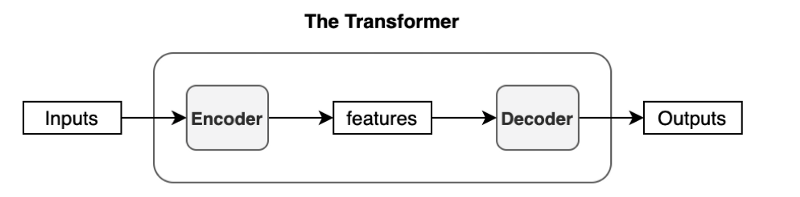

The encoder in the transformer consists of multiple encoder blocks. An input sentence goes through the encoder blocks, and the output of the last encoder block becomes the input features to the decoder.

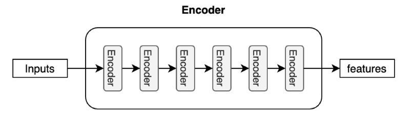

The decoder also consists of multiple decoder blocks.

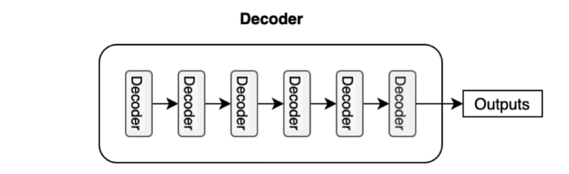

Each decoder block receives the features from the encoder. If we draw the encoder and the decoder vertically, the whole picture looks like the diagram from the paper.

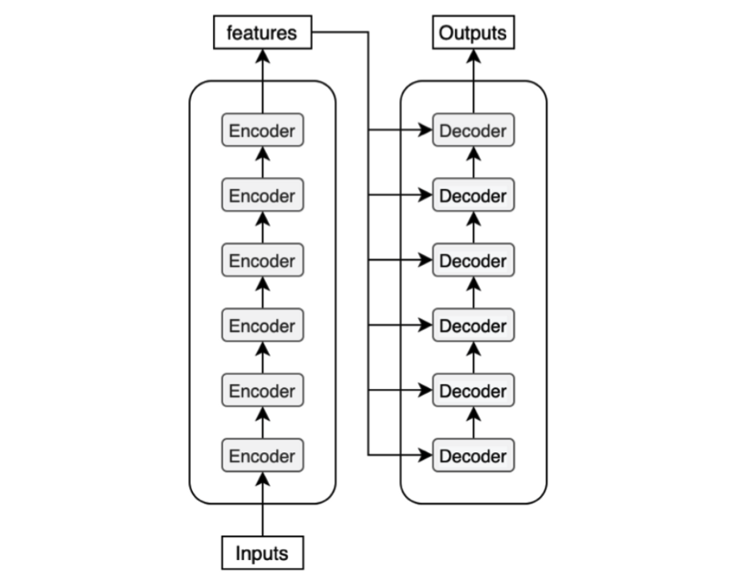

The paper uses “__Nx__” (N-times) to indicate multiple blocks. So we can draw the same diagram in a concise format.

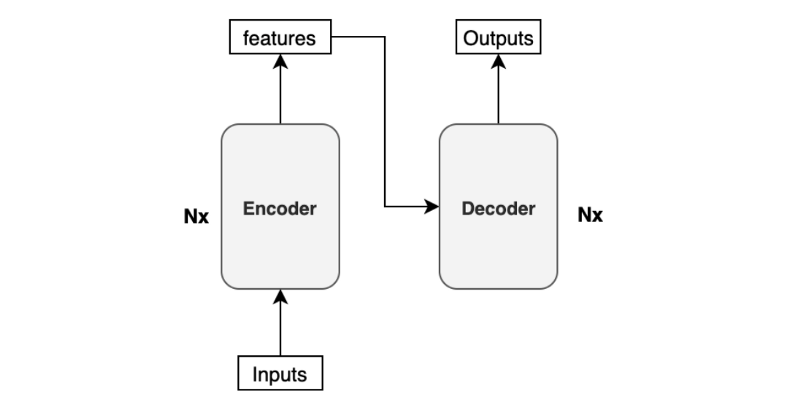

Before discussing the encoder/decoder block internals, let’s discuss the inputs and outputs of the transformer.

## Input Embedding and Positional Encoding

Like any neural translation model, we often tokenize an input sentence into distinct elements (tokens). A tokenized sentence is a fixed-length sequence. For instance, if the maximum length is 200, every sentence will have 200 tokens with trailing paddings, which, if intuitively denoted, would look like below:

```
(‘Hello’, ‘world’, ‘!’, <pad>, <pad>, …, <pad>)
```

These tokens are typically integer indices in a vocabulary dataset. So, it may be a sequence of numbers like the below:

```
(8667, 1362, 106, 0, 0, …, 0)
```

The number 8667 corresponds to the token `Hello` in this example. It may also contain special characters like `<EOS>` (end-of-sentence marker). It depends on your tokenizer and vocabulary dataset. If you use a model from [Hugging Face](https://huggingface.co), there is a specific tokenizer for the model handling such details. If you build a model from scratch, you’d need to decide how to tokenize a sentence, set up a vocabulary dataset, and assign an index to each token.

To feed those tokens into the neural network, we convert each token into an embedding vector, a common practice in neural machine translation and other natural language models. In the paper, they use a 512-dimensional vector for such embedding. So, if the maximum length of a sentence is 200, the shape of every sentence will be (200, 512). The transformer learns those embeddings from scratch during training. If you are unfamiliar with word embeddings, please look at [this article](/blog/2021-10-12-word-embedding-lookup/).

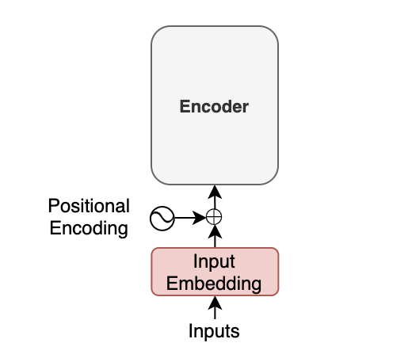

Moreover, with the transformer, we inject __positional encoding__ into each embedding so that the model can know word positions without recurrence. For the details of the positional encoding, please look at [this article](/blog/2021-10-31-transformers-positional-encoding/).

The point here is that an input to the transformer is not the characters of the input text but a sequence of embedding vectors. Each vector represents the semantics and position of a token. The encoder performs linear algebra operations on those vectors to extract the contexts for each token from the entire sentence and enrich the embedding vectors with helpful information for the target task through the multiple encoder blocks.

## Softmax and Output Probabilities

The decoder uses input features from the encoder to generate an output sentence. The input features are nothing but enriched embedding vectors.

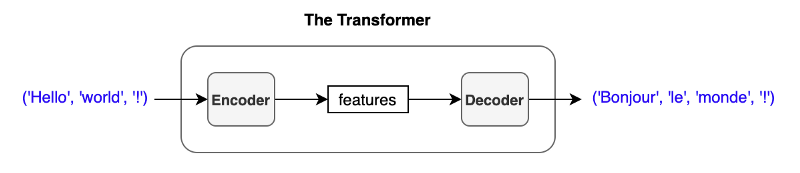

For simplicity, I express a sentence like `('Hello', 'world', '!')`, but the actual inputs to the encoder are input embeddings with positional encodings.

The decoder outputs one token at a time. An output token becomes the subsequent input to the decoder. In other words, a previous output from the decoder becomes the last part of the next input to the decoder. This kind of processing is called “__auto-regressive__” — a typical pattern for generating sequential outputs and not specific to the transformer. It allows a model to generate an output sentence of different lengths than the input.

However, we have no previous output at the beginning of a translation. So, we pass the start-of-sentence marker `<SOS>` (as known as the beginning-of-sentence marker `<BOS>`) to the decoder to initiate the translation.

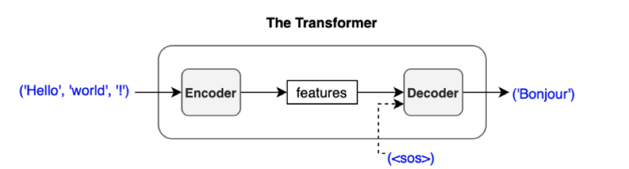

The decoder uses multiple decoder blocks to enrich `<SOS>` with the contextual information from the input features. In other words, the decoder transforms the embedding vector `<SOS>` into a vector containing information helpful to generating the first translated word (token).

Then, the output vector from the decoder goes through a linear transformation that changes the dimension of the vector from the embedding vector size (512) into the size of vocabulary (say, 10,000). The softmax layer further converts the vector into 10,000 probabilities.

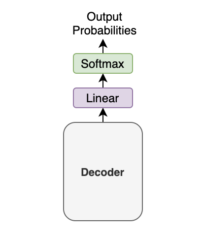

Let’s use a simple example with a tiny vocabulary dataset. It only has three words: `'like', 'cat', 'I'`. The model predicts the probabilities for the first output token as `[0.01, 0.01, 0.98]`. In this case, the word `'I'` is most probable. So, we should choose the word `'I'`. Or should we?

It depends. Granted, we must choose one word (token) from the calculated probabilities. This article assumes the greedy method, which selects the most probable word (i.e., the word with the highest probability).

However, another approach, called __beam search__, may produce better performance in the BLUE score. The beam search looks for the best combination of the tokens rather than selecting the most probable token at a time. The paper also uses the beam search with a beam size of 4.

In any case, we feed the predicted word back to the decoder to produce the next token. As shown below, we provide the chosen token to the decoder as the last part of the next decoder input.

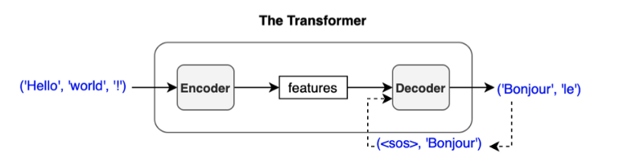

If we choose ‘Bonjour’ as the first output token, the next input to the decoder will be `(<SOS>, 'Bonjour')`. Then, we may get `('Bonjour', 'le')` as output.

The process repeats until the model predicts the end-of-sentence `<EOS>` as the most probable output.

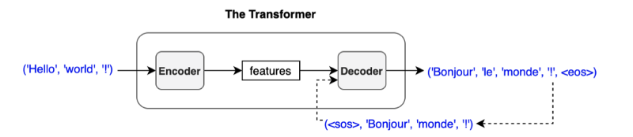

I write sequences like `(<SOS>, 'Bonjour'), (<SOS>, 'Bonjour', 'le')`, and so on, but they are not in variable length. Like the encoder input, an input to the decoder is a sequence of tokens in a fixed length. Also, we convert each token to an embedding vector through the embedding layer. So, we are not passing characters or integer indices to the decoder (again, the same as the encoder).

We add an output token to the next input to the decoder. So, the first output token becomes the second input token because the first input is `<SOS>`. Hence, the diagram says ‘__Outputs (shifted right)__’.

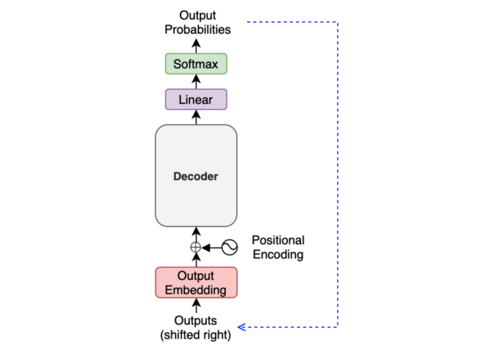

It may look like a slow process as we must generate one output at a time, especially for training. However, during training, we typically use the __teacher-forcing__ method, which feeds label tokens (rather than predicted ones), making learning more stable. It also makes the training run faster as we can prepare an attention mask, allowing parallel processing.

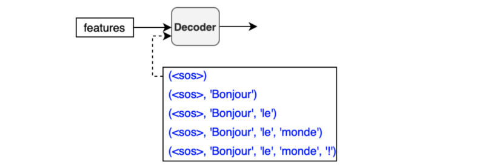

The below diagram shows what we have discussed so far:

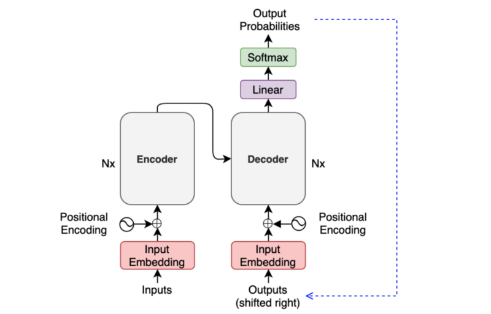

So, we only need to discuss the internals of the encoder and the decoder to understand the overall architecture.

## Encoder Block Internals

The encoder block uses the __self-attention mechanism__ to enrich each token (embedding vector) with contextual information from the whole sentence.

Depending on the surrounding tokens, each token may have more than one semantic and/or function. Hence, the self-attention mechanism employs multiple heads (eight parallel attention calculations) so that the model can tap into different embedding subspaces. For details on the self-attention mechanism, please refer to [this article](/blog/2021-11-15-transformers-self-attention/).

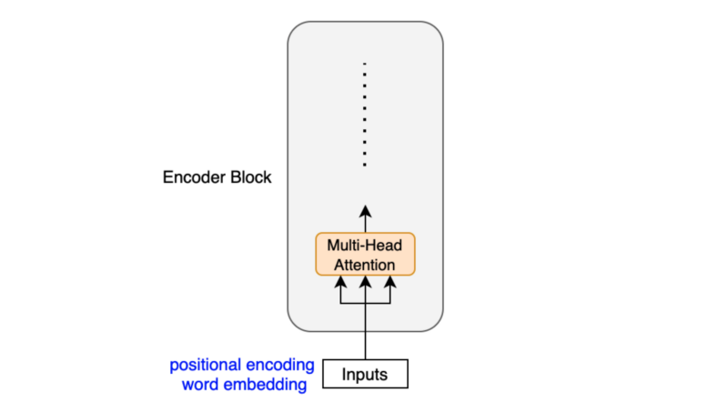

The __position-wise feed-forward network__ (FFN) has a linear layer, ReLU, and another linear layer, which processes each embedding vector independently with identical weights. So, each embedding vector (with contextual information from the multi-head attention) goes through the position-wise feed-forward layer for further transformation.

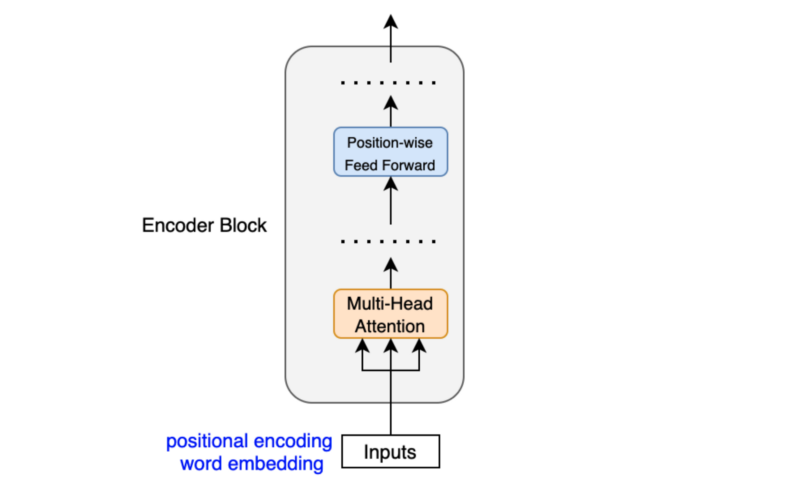

Let ___x___ be an embedding vector. The position-wise feed-forward network is:

$$
\text{FFN}(\boldsymbol{x}) = \text{ReLU}(\boldsymbol{x} W_1 + b_1)W_2 + b_2
$$

The dimension of ___x___ increases from 512 to 2048 by _W1_ and reduces from 2048 to 512 by _W2_. The weights in FFN are the same across all positions within the same layer. The paper says:

<blockquote>
While the linear transformations are the same across different positions, they use different parameters from layer to layer. Another way of describing this is as two convolutions with kernel size 1.
<cite>Section 3.3 of [Attention Is All You Need](https://arxiv.org/abs/1706.03762)</cite>
</blockquote>

The paper does not explicitly explain the reason for dimensionality expansion. But it reminds me of the inverted residual block in [MobileNetV2](https://arxiv.org/abs/1801.04381), which uses 1x1 convolution to expand dimensionality. Since ReLU discards negative values, it is inevitable to lose information. However, if we increase the dimensionality and then apply ReLU, it is more likely to preserve information better. Therefore, we can introduce non-linearity (ReLU) without losing much information, thanks to the intermediate dimensionality expansion.

Another point is that the encoder block uses __residual connections__, which is simply an element-wise addition:

$$
\boldsymbol{x} + \text{Sublayer}(\boldsymbol{x})
$$

Note: Sublayer is either multi-head attention or point-wise feed-forward network.

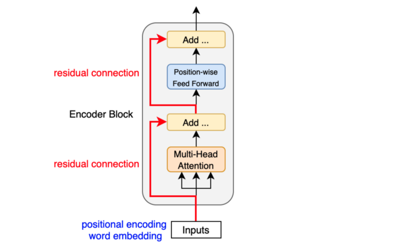

Residual connections carry over the previous embeddings to the subsequent layers. As such, the encoder blocks enrich the embedding vectors with additional information obtained from the multi-head self-attention calculations and position-wise feed-forward networks.

After each residual connection, there is a __layer normalization__:

$$
\text{LayerNorm}(\boldsymbol{x} + \text{Sublayer}(\boldsymbol{x}))
$$

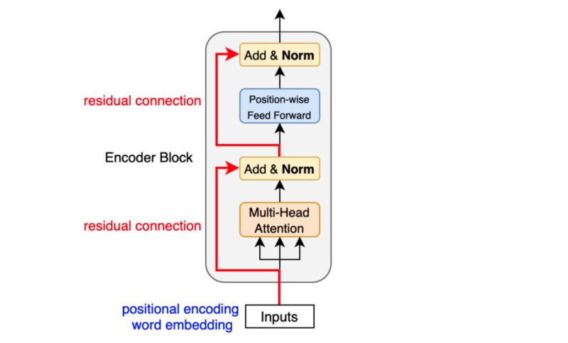

Like batch normalization, layer normalization aims to reduce the effect of covariant shift. In other words, it prevents the mean and standard deviation of embedding vector elements from moving around, which makes training unstable and slow (i.e., we can’t make the learning rate big enough). Unlike batch normalization, layer normalization works at each embedding vector (not at the batch level). Geoffrey Hinton’s team originally introduced [layer normalization](https://arxiv.org/abs/1607.06450) as applying batch normalization to recurrent neural networks was impractical.

The transformer uses six stacked encoder blocks. The outputs from the last encoder block become the input features for the decoder.

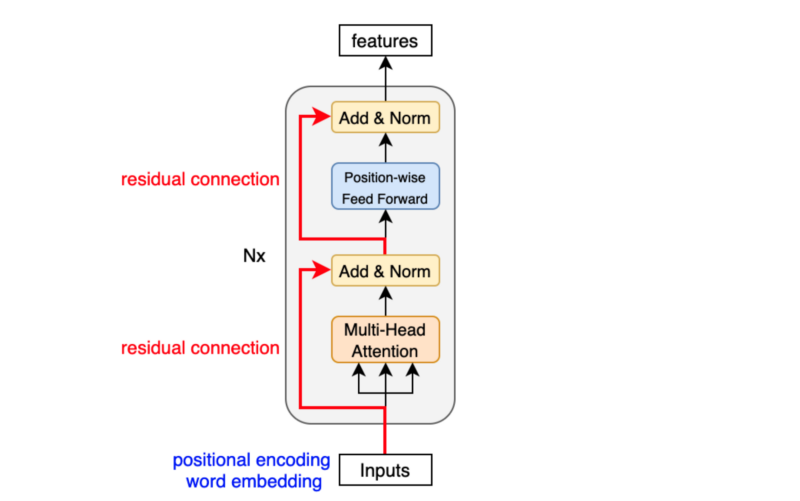

As we have seen, the input features are nothing but a sequence of enriched embeddings through the multi-head attention mechanisms and position-wise feed-forward networks with residual connections and layer normalizations.

Let’s look at how the decoder uses the input features.

## Decoder Block Internals

The decoder block is similar to the encoder block, except it calculates the source-target attention.

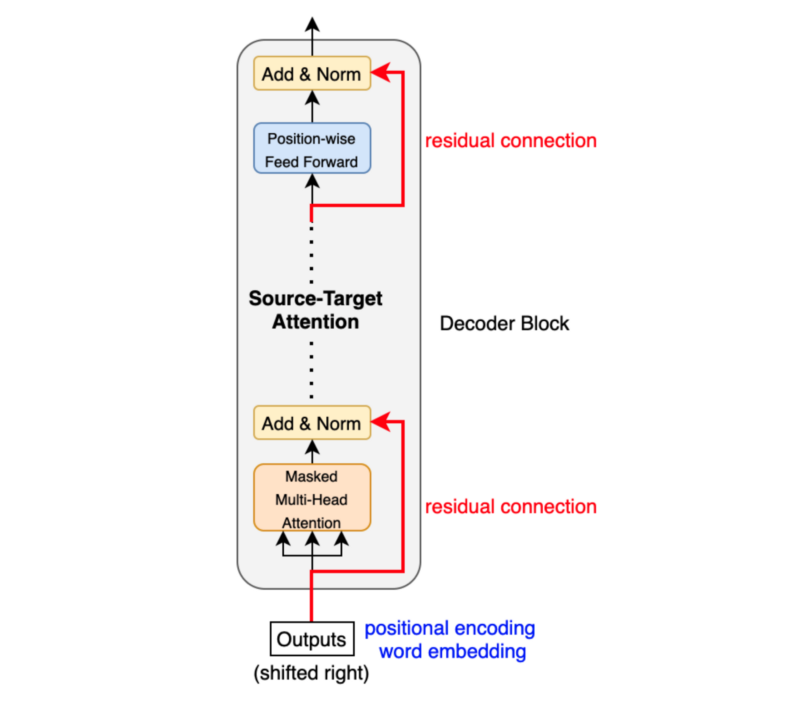

As mentioned before, an input to the decoder is an output shifted right, which becomes a sequence of embeddings with positional encoding. So, we can think of the decoder block as another encoder generating enriched embeddings useful for translation outputs.

__Masked multi-head attention__ means the multi-head attention receives inputs with masks so that the attention mechanism does not use information from the hidden (masked) positions. The paper mentions that they used the mask inside the attention calculation by setting attention scores to negative infinity (or a very large negative number). The softmax within the attention mechanisms effectively assigns zero probability to masked positions.

Intuitively, it is as if we were gradually increasing the visibility of input sentences by the masks:

```
(1, 0, 0, 0, 0, …, 0) => (<SOS>)
(1, 1, 0, 0, 0, …, 0) => (<SOS>, ‘Bonjour’)
(1, 1, 1, 0, 0, …, 0) => (<SOS>, ‘Bonjour’, ‘le’)
(1, 1, 1, 1, 0, …, 0) => (<SOS>, ‘Bonjour’, ‘le’, ‘monde’)
(1, 1, 1, 1, 1, …, 0) => (<SOS>, ‘Bonjour’, ‘le’, ‘monde’, ‘!’)
```

The source-target attention is another multi-head attention that calculates the attention values between the features (embeddings) from the input sentence and the features from the output (yet partial) sentence.

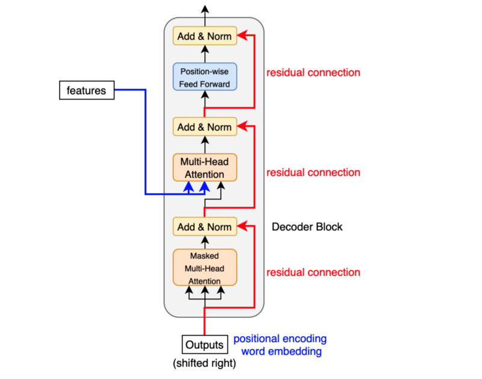

So, the decoder block enriches the embeddings using features from the input and partial output sentences.

## Conclusion

The transformer architecture assumes no recurrence or convolution pattern when processing input data. As such, the transformer architecture is suitable for any sequence data. As long as we can express our input as sequence data, we can apply the same approach, including computer vision (sequences of image patches) and reinforcement learning (sequences of states, actions, and rewards).

In the case of the original transformer, the mission is to translate, and it uses the architecture to learn to enrich embedding vectors with relevant information for translation.

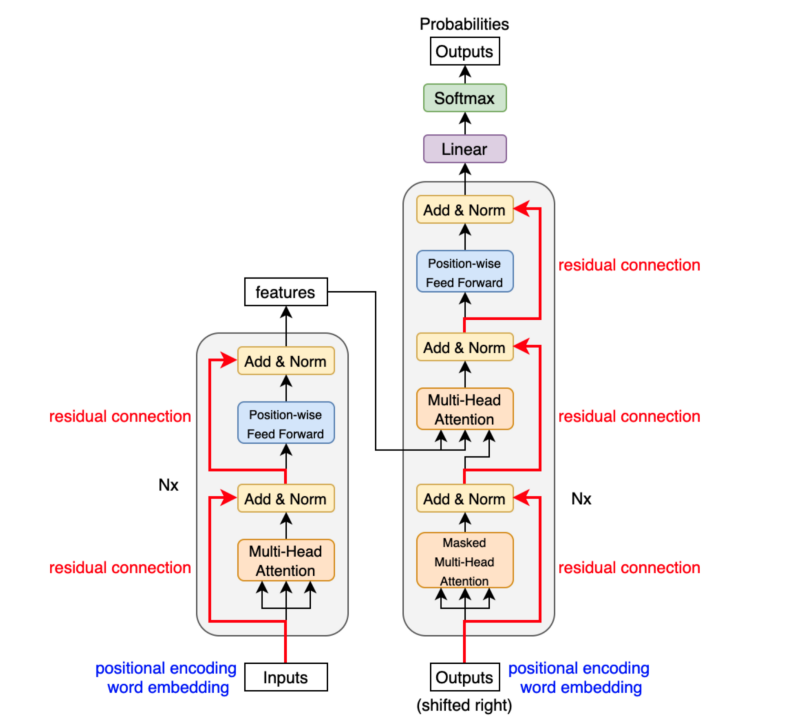

I hope the transformer architecture looks as simple to you by now as the paper author believes it is.

## References

- [Attention Is All You Need](https://arxiv.org/abs/1706.03762) \
  Ashish Vaswani, Noam Shazeer, Niki Parmar, Jakob Uszkoreit, Llion Jones, Aidan N. Gomez, Lukasz Kaiser, Illia Polosukhin
- [The Annotated Transformer](http://nlp.seas.harvard.edu/2018/04/03/attention.html) \
  Harvard NLP
- [The Illustrated Transformer](http://jalammar.github.io/illustrated-transformer/) \
  Jay Alammar