In this article, I’d like to discuss the Transformer coding details of my implementation based on the Transformer architecture from [Attention Is All You Need](https://arxiv.org/abs/1706.03762) by Ashish Vaswani et al. There are some implementations already out there. I have listed some of them in the references section. There are tricks not written in the paper that I came to learn while reading those source codes.

](images/figure-1.png)

In what follows, I summarized the coding details for each component using PyTorch. Ultimately, I assembled all the modules into a model based on the Transformer architecture.

## Embedding Layer

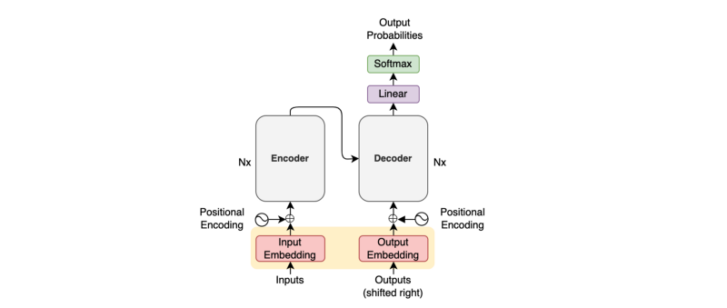

An embedding layer converts token indices into embedding vectors. Once tokens are in vector format, we can perform dot-product and other linear algebra operations.

Since PyTorch has `nn.Embedding` for this exact purpose, we can use that.

```python
import math
import torch.nn as nn
from torch import Tensor

class Embedding(nn.Module):
    def __init__(self, vocab_size: int, dim_embed: int) -> None:
        super().__init__()
        
        self.embedding = nn.Embedding(vocab_size, dim_embed)        
        self.sqrt_dim_embed = math.sqrt(dim_embed)

    def forward(self, x: Tensor) -> Tensor:
        x = self.embedding(x.long())    
        x = x * self.sqrt_dim_embed
        return x
```

The paper mentions that they multiply embedding values by the square root of the embedding dimension `dim_embed`.

The embedding layer will transform the shape of an input batch from `(batch_size, max_sequence_length)` to `(batch_size, max_sequence_length, dim_embed)`.

Note: we calculate `max_sequence_length` per batch. Then, we add padding to shorter sentences. The attention mechanism will ignore padded positions using a mask on this later.

I’ve written [an article on word embedding](/blog/2021-10-12-word-embedding-lookup/), which you can read here to learn more about.

## Positional Encoding

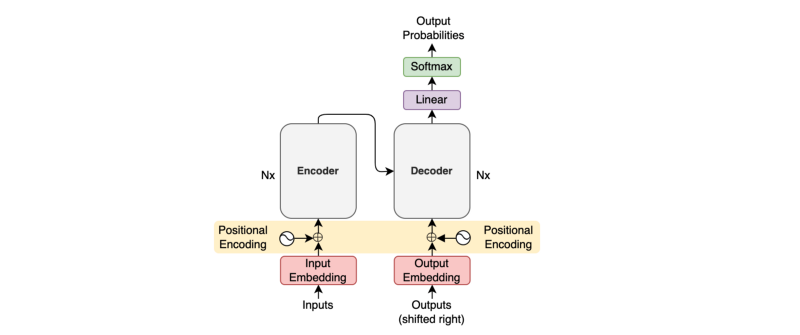

The idea of positional encoding is to encode token position information into embedding vectors so that we don’t need recurrence to handle sequences.

We calculate positional encoding values according to the below formula for each position `pos` and embedding vector dimensions `2i` and `2i+1` for `i=0...d_model//2-1`.

$$
\begin{aligned}
\text{PE}(\text{pos}, 2i) &= \sin\left(\dfrac{\text{pos}}{10000^{\frac{2i}{d_\text{model}}}}\right) \\
\text{PE}(\text{pos}, 2i+1) &= \cos\left(\dfrac{\text{pos}}{10000^{\frac{2i}{d_\text{model}}}}\right)
\end{aligned}
$$

An example code to calculate positional encoding values is as follows:

```python
import math
import torch

pe = torch.zeros(max_positions, dim_embed)

for pos in range(max_positions):
    for i in range(0, dim_embed, 2):
        theta = pos / (10000 ** (i / dim_embed))
        pe[pos, i    ] = math.sin(theta)
        pe[pos, i + 1] = math.cos(theta)
```

However, the double-loops run pretty slow when the maximum number of positions is large. So, we should take advantage of parallelized vector operations. [PyTorch’s tutorial article](https://pytorch.org/tutorials/beginner/transformer_tutorial.html) inspires the below code:

```python
import math
import torch
import torch.nn as nn
from torch import Tensor

class PositionalEncoding(nn.Module):
    def __init__(self, max_positions: int, dim_embed: int, drop_prob: float) -> None:
        super().__init__()

        assert dim_embed % 2 == 0

        # Inspired by https://pytorch.org/tutorials/beginner/transformer_tutorial.html
        position = torch.arange(max_positions).unsqueeze(1)
        dim_pair = torch.arange(0, dim_embed, 2)
        div_term = torch.exp(dim_pair * (-math.log(10000.0) / dim_embed))

        pe = torch.zeros(max_positions, dim_embed)
        pe[:, 0::2] = torch.sin(position * div_term)
        pe[:, 1::2] = torch.cos(position * div_term)
        
        # Add a batch dimension: (1, max_positions, dim_embed)
        pe = pe.unsqueeze(0)
        
        # Register as non-learnable parameters
        self.register_buffer('pe', pe)
        
        self.dropout = nn.Dropout(p=drop_prob)
        
    def forward(self, x: Tensor) -> Tensor:
        # Max sequence length within the current batch
        max_sequence_length = x.size(1)
        
        # Add positional encoding up to the max sequence length
        x = x + self.pe[:, :max_sequence_length]
        x = self.dropout(x)
        return x
```

Line 15: `div_term = torch.exp(dim_pair * (-math.log(10000.0) / dim_embed))` might look complicated. We can spell it out mathematically:

$$
\begin{aligned}
\exp\left(-2i \log(10000) / d_{\text{model}} \right) &= \exp\left(-2i / d_\text{model} \log(10000) \right) \\
&= \exp(\log(10000)^{-2i/d_\text{model}}) \\
&= \dfrac{1}{10000^\frac{2i}{d_\text{model}}}
\end{aligned}
$$

In the end, we apply `dropout` as the paper says:

<blockquote>
we apply dropout to the sums of the embeddings and the positional encodings in both the encoder and decoder stacks.
<cite>Section 5.4 Regularization from [the paper](https://arxiv.org/abs/1706.03762)</cite>
</blockquote>

I’ve written an article on positional encoding, which you can read [here](/blog/2021-10-31-transformers-positional-encoding/) for more details.

## Scaled Dot-Product Attention

](images/figure-2-left.png)

Scaled dot-product attention uses the dot-product of two embedding vectors to see how related they are. “Scaled” indicates the part where we divide the dot-product results by the square root of the number of embedding vector dimensions, which they did to reduce the magnitude of dot-products. Please see section 3.2.1 of [the paper](https://arxiv.org/abs/1706.03762) for details.

We use matrix multiplication to handle dot-product calculation.

```python
import torch
import torch.nn as nn
import torch.nn.functional as F
from torch import Tensor

def attention(query: Tensor, key: Tensor, value: Tensor, mask: Tensor=None) -> Tensor:
    sqrt_dim_head = query.shape[-1]**0.5

    scores = torch.matmul(query, key.transpose(-2, -1))
    scores = scores / sqrt_dim_head
    
    if mask is not None:
        scores = scores.masked_fill(mask==0, -1e9)
    
    weight = F.softmax(scores, dim=-1)    
    return torch.matmul(weight, value)
```

## Self-Attention and Padding Mask

Conceptually, self-attention produces an attention matrix, as shown below.

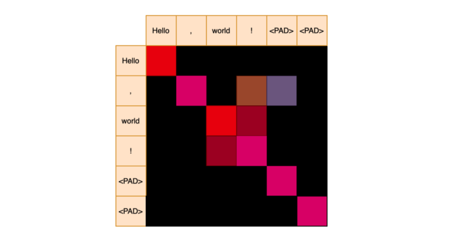

We apply softmax for each row to get attention weights. The red color indicates strong relevance. 

We deal with a batch of sequences during training and need to add padding to shorter sequences. However, we do not want them for attention calculation.

An attention mask has zeros for padding positions after the end of a sequence.

```
['Hello', ',','world', '!'] => [1, 1, 1, 1, 0, 0]
```

We give a large negative value to masked positions so that the softmax will assign zero probability to them. So, it would look like the below.

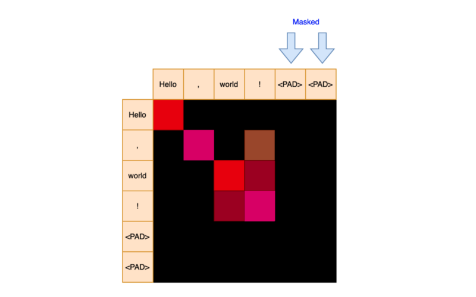

The masked positions will not contribute to the final attention values.

## Target-Source Attention and Padding Mask

Similarly, target-source attention produces attention weights with a padding mask.

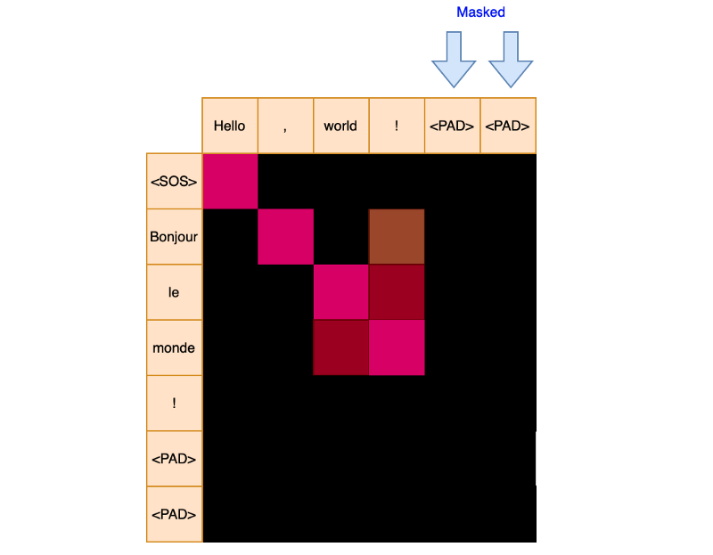

Note: the attention weight matrix may or may not be a square depending on the maximum sequence lengths of query `Q` and key `K`.

## Subsequent Mask for Decoder Input

We also use a mask to hide subsequent positions in the decoder input.

```
[<SOS>, 'Bonjour', 'le', 'monde', '!']
```

```
<SOS>     => [1, 0, 0, 0, 0]
'Bonjour' => [1, 1, 0, 0, 0]
'le'      => [1, 1, 1, 0, 0]
'monde'   => [1, 1, 1, 1, 0]
'!'       => [1, 1, 1, 1, 1]
```

For example, attention calculation for the position of `'Bonjour'` should not use scores from the positions of `'le', 'monde', '!'`. Hence, the subsequent attention mask is `[1, 1, 0, 0, 0]`.

So a mask for the decoder is a combination of both a padding mask and a subsequent mask. A subsequent mask hides the upper triangle, excluding the diagonals.

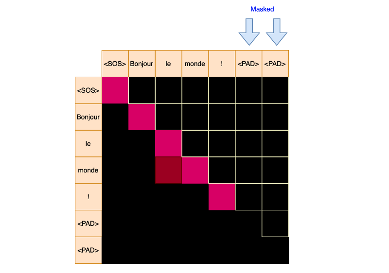

It creates an effect as though the part of inputs to the decoder is invisible.

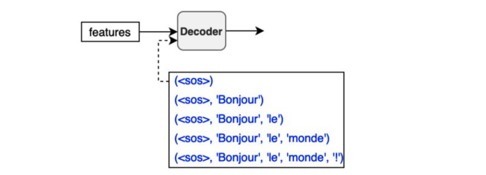

When calculating attention values for the first position, we ignore the second position and after. When calculating attention values for the second position, we ignore the third position and the rest. And so on.

```python
def create_masks(src_batch: Tensor, tgt_batch: Tensor) -> Tuple[Tensor, Tensor]:
    # ----------------------------------------------------------------------
    # [1] padding mask
    # ----------------------------------------------------------------------
    
    # (batch_size, 1, max_tgt_seq_len)
    src_pad_mask = (src_batch != PAD_IDX).unsqueeze(1)
    
    # (batch_size, 1, max_src_seq_len)
    tgt_pad_mask = (tgt_batch != PAD_IDX).unsqueeze(1)

    # ----------------------------------------------------------------------
    # [2] subsequent mask for decoder inputs
    # ----------------------------------------------------------------------
    max_tgt_sequence_length = tgt_batch.shape[1]
    tgt_attention_square = (max_tgt_sequence_length, max_tgt_sequence_length)

    # full attention
    full_mask = torch.full(tgt_attention_square, 1)
    
    # subsequent sequence should be invisible to each token position
    subsequent_mask = torch.tril(full_mask)
    
    # add a batch dim (1, max_tgt_seq_len, max_tgt_seq_len)
    subsequent_mask = subsequent_mask.unsqueeze(0)

    return src_pad_mask, tgt_pad_mask & subsequent_mask
```

I have written an article on the self-attention mechanism, which you can read [this article](/blog/2021-11-15-transformers-self-attention/) for more details.

## Multi-Head Attention

Multi-head attention employs multiple scaled-dot attention calculations to capture various relationships between words.

The below figure from the paper visualizes outputs from two attention heads:

](images/figure-4.png)

The encoder uses it for the self-attention mechanism. The decoder uses it for self-attention mechanism and target-source attention, where it calculates attention scores between encoder outputs (features) and decoder embedding vectors, which are inputs (shifted-right outputs) after going through the masked multi-head attention.

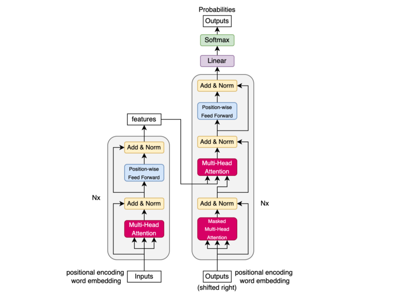

We use the term **masked** multi-head attention because the decoder input comes with subsequent masks that effectively hide the future positions (subsequent sequence of each token). So, for the decoder, `mask` combines padding and subsequent masks.

Three arrows go into multi-head attention for value `V`, key `K`, and query `Q`, respectively.

](images/figure-2-right.png)

Regarding self-attention, `V, K, Q` are all the same embedding vectors. However, `V` and `K` are the encoder outputs (features) for target-source attention, and `Q` is the decoder embedding vectors.

Conceptually, we independently perform multiple scaled dot-product attention calculations, one for each head. For that, we first apply eight separate linear operations on `V, K, Q` so that attention values will capture different relationships for each attention head.

In actual implementation, we can perform one linear operation for each of `V, K, Q` and reshape them into multiple heads as shown in the code below:

```python
# continuation of attention.py

class MultiHeadAttention(nn.Module):
    def __init__(self, num_heads: int, dim_embed: int, drop_prob: float) -> None:
        super().__init__()
        assert dim_embed % num_heads == 0

        self.num_heads = num_heads
        self.dim_embed = dim_embed
        self.dim_head = dim_embed // num_heads

        self.query  = nn.Linear(dim_embed, dim_embed)
        self.key    = nn.Linear(dim_embed, dim_embed)
        self.value  = nn.Linear(dim_embed, dim_embed)
        self.output = nn.Linear(dim_embed, dim_embed)
        self.dropout = nn.Dropout(drop_prob)

    def forward(self, x: Tensor, y: Tensor, mask: Tensor=None) -> Tensor:
        query = self.query(x)
        key   = self.key  (y)
        value = self.value(y)

        batch_size = x.size(0)
        query = query.view(batch_size, -1, self.num_heads, self.dim_head)
        key   = key  .view(batch_size, -1, self.num_heads, self.dim_head)
        value = value.view(batch_size, -1, self.num_heads, self.dim_head)

        # Into the number of heads (batch_size, num_heads, -1, dim_head)
        query = query.transpose(1, 2)
        key   = key  .transpose(1, 2)
        value = value.transpose(1, 2)
        
        if mask is not None:
            mask = mask.unsqueeze(1)

        attn = attention(query, key, value, mask)
        attn = attn.transpose(1, 2).contiguous().view(batch_size, -1, self.dim_embed)
        
        out = self.dropout(self.output(attn))

        return out
```

The shape of `Q, K, V` is changed from `(batch_size, max_sequence_length, dim_embed)` to `(batch_size, num_heads, max_sequence_length, dim_head)` where `dim_head = dim_embed // num_head`.

For example, if `dim_embed = 512` and `num_heads = 8`, `dim_head = 64`.

Also, note that we determine `max_sequence_length` per batch.

We restore the original shape by reshaping the outputs from the scaled dot-product attention to `(batch_size, max_sequence_length, dim_embed)`. So, the embedding vectors keep the same number of dimensions throughout the process.

We give the mask one extra dimension to be broadcastable across multiple heads. Then, `masked_fill` in the scaled dot-product attention will perform the attention calculation independently for each head using the same mask.

In the end, we apply `dropout` as the paper says:

<blockquote>
We apply dropout [33] to the output of each sub-layer, before it is added to the sub-layer input and normalized.
<cite>Section 5.4 Regularization from [the paper](https://arxiv.org/abs/1706.03762)</cite>
</blockquote>

## Position-wise Feed-Forward

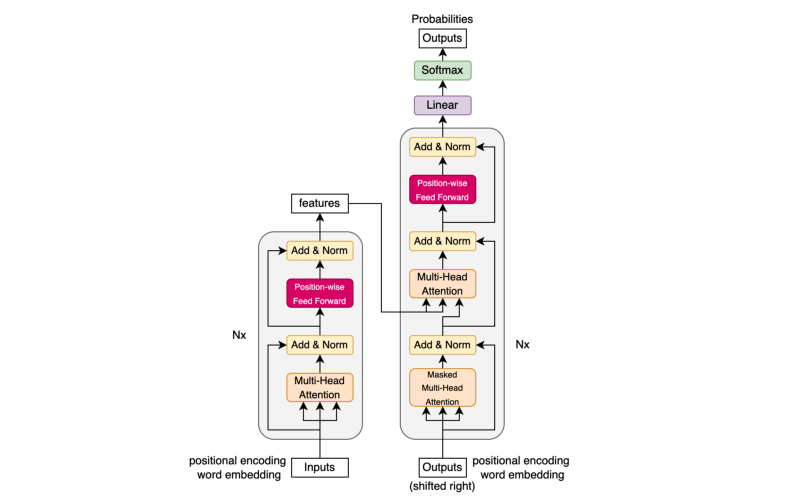

The position-wise feed-forward layers inject non-linearity into embedding vectors.

Embedding vectors have the shape of `(batch_size, max_sequence_length, dim_embed)`. As we do not flatten embedding vectors, the linear operations are applied to each position independently and identically, which is why it is called position-wise feed-forward.

```python
import torch.nn as nn
from torch import Tensor

class PositionwiseFeedForward(nn.Module):
    def __init__(self, dim_embed: int, dim_pffn: int, drop_prob: float) -> None:
        super().__init__()
        self.pffn = nn.Sequential(
            nn.Linear(dim_embed, dim_pffn),
            nn.ReLU(inplace=True),
            nn.Dropout(drop_prob),
            nn.Linear(dim_pffn, dim_embed),
            nn.Dropout(drop_prob),
        )

    def forward(self, x: Tensor) -> Tensor:
        return self.pffn(x)
```

The first linear operation expands the dimensions. I understand that doing so means that ReLU will not lose too much information.

The second linear operation restores the original dimensions. So, we can continue with the same embedding vector shape to perform the remaining process.

For example, in the base Transformer model, the embedding vector dimensions are increased from 512 to 2048 and restored from 2048 to 512.

In the end, we apply `dropout` as the paper says:

<blockquote>
We apply dropout [33] to the output of each sub-layer, before it is added to the sub-layer input and normalized.
<cite>Section 5.4 Regularization from [the paper](https://arxiv.org/abs/1706.03762)</cite>
</blockquote>

The paper does not mention `dropout` between two linear layers. However, the reference implementations have it, which makes sense to me, so I decided to do the same.

## Encoder

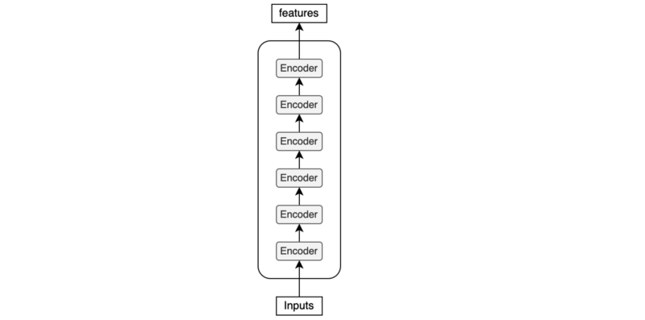

The encoder uses multiple encoder blocks.

```python
import torch.nn as nn
from torch import Tensor
from .attention import MultiHeadAttention
from .feed_forward import PositionwiseFeedForward

class Encoder(nn.Module):
    def __init__(self,
                 num_blocks: int,
                 num_heads:  int,
                 dim_embed:  int,
                 dim_pffn:   int,
                 drop_prob:  float) -> None:
        super().__init__()

        self.blocks = nn.ModuleList(
            [EncoderBlock(num_heads, dim_embed, dim_pffn, drop_prob)
             for _ in range(num_blocks)]
        )
        self.layer_norm = nn.LayerNorm(dim_embed)
        
    def forward(self, x: Tensor, x_mask: Tensor):
        for block in self.blocks:
            x = block(x, x_mask)
        x = self.layer_norm(x)
        return x
```

Ultimately, it applies layer normalization before passing features to the decoder.

## Encoder Block

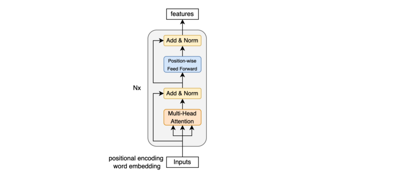

An encoder block uses:

- Multi-head attention for self-attention
- Position-wise feed-forward to inject non-linearity

We have a residual connection and a layer normalization between those sub-layers.

```python
# continuation of encoder.py

class EncoderBlock(nn.Module):
    def __init__(self,
                 num_heads: int,
                 dim_embed: int,
                 dim_pwff:  int,
                 drop_prob: float) -> None:
        super().__init__()

        # Self-attention
        self.self_atten = MultiHeadAttention(num_heads, dim_embed, drop_prob)
        self.layer_norm1 = nn.LayerNorm(dim_embed)

        # Point-wise feed-forward
        self.feed_forward = PositionwiseFeedForward(dim_embed, dim_pwff, drop_prob)
        self.layer_norm2 = nn.LayerNorm(dim_embed)

    def forward(self, x: Tensor, x_mask: Tensor) -> Tensor:
        x = x + self.sub_layer1(x, x_mask)
        x = x + self.sub_layer2(x)
        return x

    def sub_layer1(self, x: Tensor, x_mask: Tensor) -> Tensor:
        x = self.layer_norm1(x)
        x = self.self_atten(x, x, x_mask)
        return x
    
    def sub_layer2(self, x: Tensor) -> Tensor:
        x = self.layer_norm2(x)
        x = self.feed_forward(x)
        return x
```

In the paper, they add a residual connection to a sub-layer (multi-head attention or position-wise feed-forward) and then followed by a layer normalization: `LayerNorm(x + Sublayer(x))`.

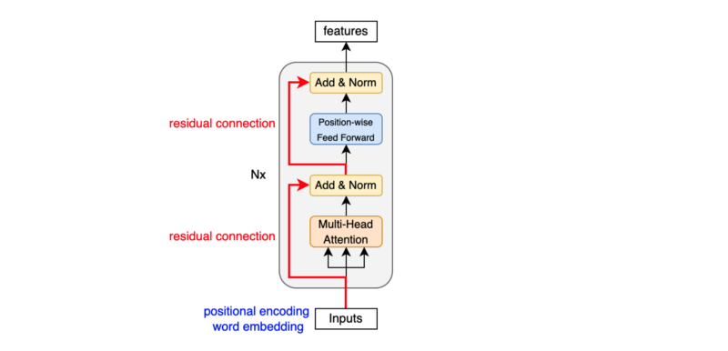

However, the reference implementations apply layer normalization before a sub-layer: `x + Sublayer(LayerNorm(x))`.

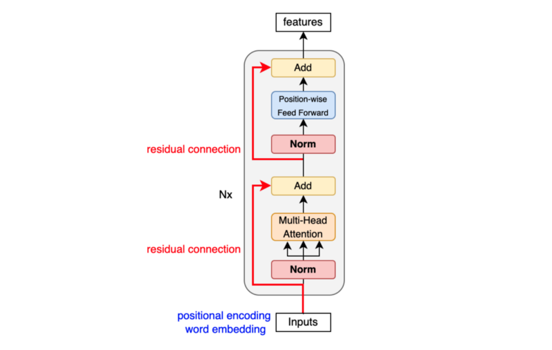

According to [this paper](https://arxiv.org/abs/2002.04745) and [this paper](https://arxiv.org/abs/1910.05895), layer normalization before a sub-layer is more stable. So, I took the same approach.

 presentation](images/pre-vs-post-norm.png)

## Decoder

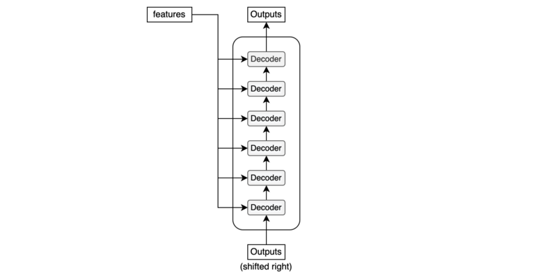

The decoder uses multiple decoder blocks.

```python
import torch.nn as nn
from torch import Tensor
from .attention import MultiHeadAttention
from .feed_forward import PositionwiseFeedForward


class Decoder(nn.Module):
    def __init__(self,
                 num_blocks: int,
                 num_heads:  int,
                 dim_embed:  int,
                 dim_pffn:   int,
                 drop_prob:  float) -> None:
        super().__init__()

        self.blocks = nn.ModuleList(
            [DecoderBlock(num_heads, dim_embed, dim_pffn, drop_prob)
             for _ in range(num_blocks)]
        )
        self.layer_norm = nn.LayerNorm(dim_embed)

    def forward(self, x: Tensor, x_mask: Tensor, y: Tensor, y_mask: Tensor) -> Tensor:
        for block in self.blocks:
            y = block(y, y_mask, x, x_mask)
        y = self.layer_norm(y)
        return y
```

Ultimately, it applies layer normalization before giving outputs to the final linear (projection) layer.

## Decoder Block

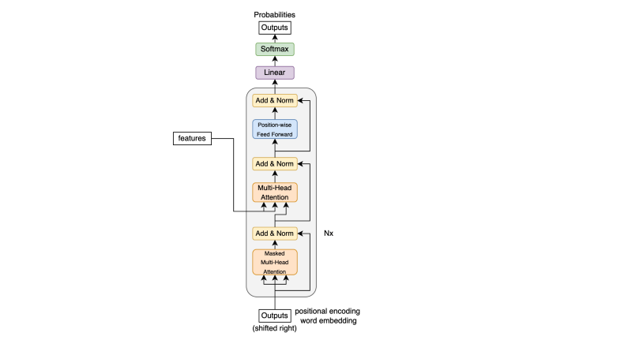

A decoder block uses:

- Masked multi-head attention for self-attention
- Multi-head attention for target-source attention
- Position-wise feed-forward to inject non-linearity

In between those sub-layers, we have a residual connection and layer normalization.

Like the encoder, the reference implementations apply layer normalization: `x + Sublayer(LayerNorm(x))`. So, I did the same here, too.

```python
# continuation of decoder.py

class DecoderBlock(nn.Module):
    def __init__(self,
                 num_heads: int,
                 dim_embed: int,
                 dim_pwff:  int,
                 drop_prob: float) -> None:
        super().__init__()

        # Self-attention
        self.self_attn = MultiHeadAttention(num_heads, dim_embed, drop_prob)
        self.layer_norm1 = nn.LayerNorm(dim_embed)

        # Target-source
        self.tgt_src_attn = MultiHeadAttention(num_heads, dim_embed, drop_prob)
        self.layer_norm2 = nn.LayerNorm(dim_embed)

        # Position-wise
        self.feed_forward = PositionwiseFeedForward(dim_embed, dim_pwff, drop_prob)
        self.layer_norm3 = nn.LayerNorm(dim_embed)

    def forward(self, y, y_mask, x, x_mask) -> Tensor:
        y = y + self.sub_layer1(y, y_mask)
        y = y + self.sub_layer2(y, x, x_mask)
        y = y + self.sub_layer3(y)
        return y

    def sub_layer1(self, y: Tensor, y_mask: Tensor) -> Tensor:
        y = self.layer_norm1(y)
        y = self.self_attn(y, y, y_mask)
        return y

    def sub_layer2(self, y: Tensor, x: Tensor, x_mask: Tensor) -> Tensor:
        y = self.layer_norm2(y)
        y = self.tgt_src_attn(y, x, x_mask)
        return y

    def sub_layer3(self, y: Tensor) -> Tensor:
        y = self.layer_norm3(y)
        y = self.feed_forward(y)
        return y
```

## Transformer

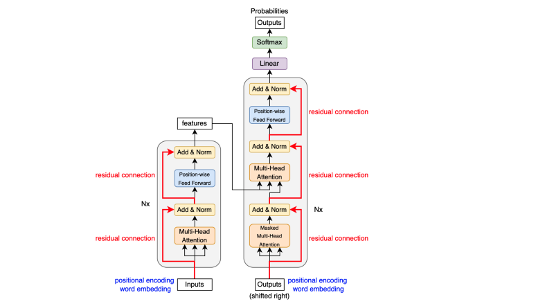

The Transformer glues all modules together into one model. Unlike the above diagram, the implementation applies layer normalization before each sub-layer.

```python
import torch.nn as nn
from torch import Tensor
from ..modules import Embedding, PositionalEncoding, Encoder, Decoder

class Transformer(nn.Module):
    def __init__(self,
                 input_vocab_size:  int,
                 output_vocab_size: int,
                 max_positions:     int,
                 num_blocks:        int,
                 num_heads:         int,
                 dim_embed:         int,
                 dim_pffn:          int,
                 drop_prob:         float) -> None:
        super().__init__()

        # Input embeddings, positional encoding, and encoder
        self.input_embedding = Embedding(input_vocab_size, dim_embed)
        self.input_pos_encoding = PositionalEncoding(
                                      max_positions, dim_embed, drop_prob)
        self.encoder = Encoder(num_blocks, num_heads, dim_embed, dim_pffn, drop_prob)

        # Output embeddings, positional encoding, decoder, and projection 
        # to vocab size dimension
        self.output_embedding = Embedding(output_vocab_size, dim_embed)
        self.output_pos_encoding = PositionalEncoding(
                                       max_positions, dim_embed, drop_prob)
        self.decoder = Decoder(num_blocks, num_heads, dim_embed, dim_pffn, drop_prob)
        self.projection = nn.Linear(dim_embed, output_vocab_size)

        # Initialize parameters
        for param in self.parameters():
            if param.dim() > 1:
                nn.init.xavier_uniform_(param)

    def forward(self, x: Tensor, y: Tensor,
                      x_mask: Tensor=None, y_mask: Tensor=None) -> Tensor:
        x = self.encode(x, x_mask)
        y = self.decode(x, y, x_mask, y_mask)
        return y

    def encode(self, x: Tensor, x_mask: Tensor=None) -> Tensor:
        x = self.input_embedding(x)
        x = self.input_pos_encoding(x)
        x = self.encoder(x, x_mask)
        return x

    def decode(self, x: Tensor, y: Tensor,
                     x_mask: Tensor=None, y_mask: Tensor=None) -> Tensor:
        y = self.output_embedding(y)
        y = self.output_pos_encoding(y)
        y = self.decoder(x, x_mask, y, y_mask)
        return self.projection(y)
```

The last linear layer projects the embedding dimensions to the number of vocabulary. We can apply softmax on the projected values to assign a probability to each token index.

Please look at [this article](/blog/2021-12-13-transformers-encoder-decoder/) for more details of the encoder-decoder architecture.

## Greedy Translator

We don’t always need to use Softmax. If all we want to know is the most probable token, we can use `argmax` instead, as shown in the diagram below.

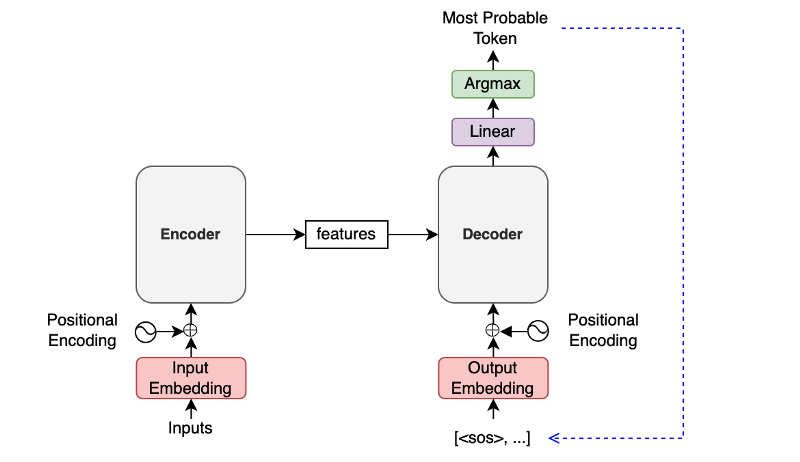

A Greedy Translator would do the following:

1. The encoder extracts features from an input language sentence.
2. The first decoder input is the `SOS` (the start-of-sentence token).
3. The decoder outputs the last projection.
4. The most probable token joins the decoder input sequence at the end.
5. Steps 3 and 4 repeat.
6. Finish when the most probable next token is `EOS` (end-of-sentence).

```python
# Greedy Translator Pseudo Code

# Input sentence
input_text = "Zwei junge weiße Männer sind im Freien in der Nähe vieler Büsche."

# Convert input text tokens into token indices
encoder_input = ...tokenize input_text into token indices...

# Encoder output
features = model.encode(encoder_input)

# The first input
decoder_input = torch.LongTensor([[SOS_IDX]])

for _ in range(max_output_length):
    # Projection (1, current_sequence_length, vocab_size)
    projections = model.decode(features, decoder_inputs)

    # Greedy selection of the last token
    token_index = torch.argmax(projections[:, -1], keepdim=True)

    # Exit if EOS
    if token_index.item()==EOS_IDX:
        break

    # Add the most probable token to the decoder input
    decoder_input = torch.cat([decoder_input, token_index], dim=1)

# Remove SOS from the token indices
decoder_output = decoder_input[0, 1:]

# Convert token indices to text tokens
output_text = ...text indices => text tokens => a sentence text...
print(output_text)

# Expected: Two young, White males are outside near many bushes.
```

## References

- [The Annotated Transformer](http://nlp.seas.harvard.edu/2018/04/03/attention.html) \
  Harvard NLP
- [How to code The Transformer in Pytorch](https://towardsdatascience.com/how-to-code-the-transformer-in-pytorch-24db27c8f9ec) \
  Samuel Lynn-Evans
- [The Illustrated Transformer](http://jalammar.github.io/illustrated-transformer) \
  Jay Alammar
- [Transformer Architecture: The Positional Encoding](https://kazemnejad.com/blog/transformer_architecture_positional_encoding/) \
  Amirhossein Kazemnejad
- [Tensor2Tensor](https://github.com/tensorflow/tensor2tensor) \
  TensorFlow
- [PyTorch Transformer](https://pytorch.org/docs/stable/generated/torch.nn.Transformer.html) \
  PyTorch
- [Language Modeling with nn.Transformer and Torchtext](https://pytorch.org/tutorials/beginner/transformer_tutorial.html) \
  PyTorch
- [On Layer Normalization in the Transformer Architecture](https://arxiv.org/abs/2002.04745) \
  Ruibin Xiong, Yunchang Yang, Di He, Kai Zheng, Shuxin Zheng, Chen Xing, Huishuai Zhang, Yanyan Lan, Liwei Wang, Tie-Yan Liu
- [Transformers without Tears: Improving the Normalization of Self-Attention](https://arxiv.org/abs/1910.05895) \
  Toan Q. Nguyen, Julian Salazar \
  [GitHub](https://github.com/tnq177/transformers_without_tears) \
  [Presentation](https://tnq177.github.io/data/transformers_without_tears.pdf)
