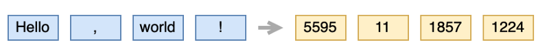
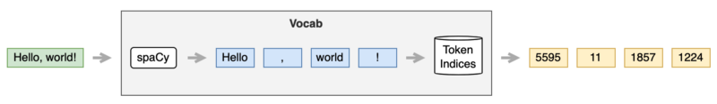

[The previous article](/blog/2022-01-17-transformers-coding-details/) discussed my simple implementation of the transformer architecture from [Attention Is All You Need](https://arxiv.org/abs/1706.03762) by Ashish Vaswani et al.

This article discusses the implementation of a data loader in detail:

- Where to get text data
- How to tokenize text data
- How to assign a unique integer for each token text
- How to set up `DataLoader`

Ultimately, we will have a data loader that simplifies writing a training loop.

## Where To Get Text Data


We need pairs of sentences in two languages to perform translation tasks — for example, German and corresponding English texts.

The paper mentions the below two datasets:

- WMT 2014 English-to-German translation
- WMT 2014 English-to-French translation

But I wanted to use something much smaller to train my model for less than a day without requiring massive GPU power.

Yet, I don’t want to write a web scraping script to collect such paired texts as it will take a lot of time and defeat the purpose.

So, I decided to use PyTorch’s [torchtext.datasets](https://pytorch.org/text/stable/datasets.html), specifically to use [Multi30k](https://pytorch.org/text/stable/datasets.html#multi30k)’s training dataset. Also, I decided to do German-to-English translation so that I could understand translated sentences generated by the model.

However, the torchtext.datasets library has [other machine translation datasets](https://torchtext.readthedocs.io/en/latest/datasets.html#machine-translation), too. So, I wrote a utility function to load a dataset:

```python
from torch.utils.data import IterableDataset
from torchtext import datasets
from typing import Tuple

def load_dataset(name: str, split: str, language_pair: Tuple[str, str]) -> IterableDataset:
    dataset_class = eval(f'datasets.{name}')
    dataset = dataset_class(split=split, language_pair=language_pair)
    return dataset
```

For example, I can load the training dataset from Multi30k German-English translation as follows:

```python
dataset = load_dataset('Multi30k', 'train', ('de', 'en'))
```

The dataset has 29K pairs of German and English sentences.

Note: `de` is from Deutsch (German language). `en` is from English. So, `('de', 'en')` means that we are loading a dataset for German-English text pairs.

The returned dataset is `torch.utils.data.IterableDataset`, which is iterable and we can use in a for loop:

```python
for de_text, en_text in dataset:
    print(de_text, en_text)
```

The first sentence pair is:

```
Zwei junge weiße Männer sind im Freien in der Nähe vieler Büsche.
Two young, White males are outside near many bushes.
```

One thing to note is that we need to reload `IterableDataset` once the loop reaches the end. So, if you do the `for` loop again, you will get an `StopIteration` exception.

We can use `DataLoader` to generate sentence batches for each language:

```python
from torch.utils.data import DataLoader

dataset = load_dataset('Multi30k', 'train', ('de', 'en'))
loader = DataLoader(dataset, batch_size=32)

for de_text_batch, en_text_batch in loader:
      ...still texts...
```

However, we can not directly feed text data into neural networks. So, we need to tokenize text data and convert them into PyTorch tensors.

## How To Tokenize Text Data


We need to tokenize each sentence text into token texts. We call this process tokenization. Tokenization is language-specific, and it’s not a simple business to implement it from scratch.


So, I used [spaCy](https://spacy.io) in my code.

It’s easy to install spaCy provided you already have a Python environment.

```bash
# Install spacy in your conda or virtual environment
pip install spacy
```

To use spaCy’s language tokenizer, we must obtain the respective language modules.

For example, we can download the English language module as follows:

```bash
# Download English language module
python -m spacy download en_core_web_sm
```

In case of `venv` environment, we can locate the download module at:

```
./venv/lib/python3.8/site-packages/en_core_web_sm
```

We can load the English language module as follows:

```python
import spacy

tokenizer = spacy.load('en_core_web_sm') # sm means small
```

As a side note, we can also import `en_core_web_sm` as a Python module:

```python
import en_core_web_sm

tokenizer = en_core_web_sm.load()
```

I like the first method because it specifies which language to load as a string that we can store in a config file.

Either way, it’s simple to tokenize an English sentence as follows:

```python
import spacy

tokenizer = spacy.load('en_core_web_sm')
tokens = tokenizer('Hello, world!')

print([token.text for token in tokens])

# Output: ['Hello', ',', 'world', '!']
```

Similarly, we can download `de_core_news_sm` for German text tokenization.

Now, we can tokenize German and English sentences from the Multi30k dataset.

```python
import spacy

de_tokenizer = spacy.load('de_core_news_sm')
en_tokenizer = spacy.load('en_core_web_sm')

dataset = load_dataset('Multi30k', 'train', ('de', 'en'))

for de_text, en_text in dataset:
    de_tokens = de_tokenizer( de_text )
    en_tokens = en_tokenizer( en_text )
```

... now what?

## How To Assign Unique Integer For Each Token Text


We want to convert each token text into a unique integer (token ID). We use token IDs to look up an embedding vector.

{width="75%"}

You can read more about word-embedding look-up in [this article](/blog/2021-10-12-word-embedding-lookup/).

So, we need to build a map between token texts and token IDs.

Torchtext has [Vocab](https://pytorch.org/text/stable/vocab.html) class for such purpose, but I decided to write my own implementation so my codes do not depend too much on the Torchtext framework.

---

Suppose I have a list of English or German texts. I can make a list of unique token texts as follows:

```python
from collections import Counter

counter = Counter()
for doc in tokenizer.pipe(texts):
    token_texts = []
    for token in doc:
        token_text = token.text.strip()
        if len(token_text) > 0: # not a white space
            token_texts.append(token_text)
    counter.update(token_texts)

# unique tokens
tokens = [token for token, count in counter.most_common()]
```

I used `Counter` to make a list of unique token texts. We can also use `set` to do the same.

One advantage of `Counter` is that it is in the frequency order. When dealing with many, you can limit the number of tokens to the most frequent `N` tokens, eliminating infrequently used ones.

```python
counter.most_common(10000) # up to most frequent 10,000 tokens
```

I’m using it to generate a list of unique tokens for my implementation.

The below shows the top 20 tokens from the English sentences of `Multi30k` dataset.

```
a
.
A
in
the
on
is
and
man
of
with
,
woman
are
to
Two
at
wearing
people
shirt
```

I save all the tokens in a file. So, the next time we need a list of the unique tokens, we can load it from the file.

```python
path = '<where we want to save tokens>'
os.makedirs(os.path.dirname(path), exist_ok=True)

with open(path, 'w') as f:
    f.writelines('\n'.join(tokens))
```

Now that we have a list of unique token texts, all we need to do is:

```python
index_lookup = { tokens[i] : i for i in range(len(tokens)) }
```

Voilà! We have a map between token texts and unique token IDs.

That’s not it yet. We need to deal with four special tokens. So, we reserve indices 0–4 for them:

```python
# special token indices
UNK_IDX = 0
PAD_IDX = 1
SOS_IDX = 2
EOS_IDX = 3

UNK = '<unk>' # Unknown
PAD = '<pad>' # Padding
SOS = '<sos>' # Start of sentence
EOS = '<eos>' # End of sentence

SPECIAL_TOKENS = [UNK, PAD, SOS, EOS]
```

You can read more details about the special characters in [this article](/blog/2021-12-13-transformers-encoder-decoder/).

So, we combine the special tokens with the list of unique token texts and build a map of token texts and token IDs:

```python
tokens = SPECIAL_TOKENS + tokens
index_lookup = { tokens[i] : i for i in range(len(tokens)) }
```

We can look up a token index by a token text as follows:

```python
if token in index_lookup:
    token_index = index_lookup[token]
else:
    token_index = UNK_IDX
```

So, I put everything together into my `Vocab` class:

```python
import spacy
from typing import List

# special token indices
UNK_IDX = 0
PAD_IDX = 1
SOS_IDX = 2
EOS_IDX = 3

UNK = '<unk>' # Unknown
PAD = '<pad>' # Padding
SOS = '<sos>' # Start of sentence
EOS = '<eos>' # End of sentence

SPECIAL_TOKENS = [UNK, PAD, SOS, EOS]

class Vocab:
    def __init__(self, tokenizer: spacy.language.Language, tokens: List[str]=[]) -> None:
        self.tokenizer = tokenizer
        self.tokens = SPECIAL_TOKENS + tokens
        self.index_lookup = {self.tokens[i]:i for i in range(len(self.tokens))}
        
    def __len__(self) -> int:
        return len(self.tokens) # vocab size
        
    def __call__(self, text: str) -> List[int]:
        text = text.strip()
        return [self.to_index(token.text) for token in self.tokenizer(text)]

    def to_index(self, token: str) -> int:
        return self.index_lookup[token] if token in self.index_lookup else UNK_IDX
```

Now, we can convert a sentence text into a list of integers as follows:

```python
vocab = Vocab(tokenizer, tokens)
token_indices = vocab('Hello, world!')
print(token_indices)

# output: [5599, 15, 1861, 1228]
```



## How To Set Up A DataLoader


I used PyTorch’s `DataLoader` and `collate_fn` to encapsulate tokenization and token index processing details, so it’s easy to use for training.

The idea of `collate_fn` is simple. It’s a function that converts a batch of raw data into tensors. A batch is a list of source (German) and target (English) sentence pairs:

```python
def collate_fn(batch: List[Tuple[str, str]]):
    .... convert text data into tensors ...
    return ... tensors ...
```

Once we have `collate_fn` defined, we can give it to `DataLoader` as follows:

```python
loader = DataLoader(dataset, batch_size=32, collate_fn=collate_fn)
```

Inside the `collate_fn` function, we tokenize sentence pairs from `batch`. We prepend `SOS_IDX` and append `EOS_IDX` for target sentences. Finally, we convert token indices into `Tensor` and keep them in a list.

```python
from torch import Tensor

source_tokens_list = []
target_tokens_list = []
for i, (source_sentence, target_sentence) in enumerate(batch):
    # Tokenization
    source_tokens = source_vocab(source_sentence)
    target_tokens = target_vocab(target_sentence)

    target_tokens = [SOS_IDX] + target_tokens + [EOS_IDX]

    source_tokens_list.append( Tensor(source_tokens) )
    target_tokens_list.append( Tensor(target_tokens) )
```

Each sentence comes in a different number of tokens. So, we use `pad_sequence` to append paddings to each token sequence up to the max sequence length (the longest sequence length within the current batch):

```python
from torch.nn.utils.rnn import pad_sequence

source_batch = pad_sequence(source_tokens_list, 
                            padding_value=PAD_IDX,
                            batch_first=True)
target_batch = pad_sequence(target_tokens_list,
                            padding_value=PAD_IDX,
                            batch_first=True)
```

`padding_value = PAD_IDX` means we use `PAD_IDX` to pad shorter token ID sequences. As `PAD_IDX` is 1, we are appending 1s to them.

`batch_first = True` means we want the shape to have the batch dimension first: `(batch_size, max_sequence_length)` instead of the default shape `(max_sequence_length, batch_size)`, which I feel is unintuitive.

For details of `pad_sequence`, please refer to [the PyTorch documentation](https://pytorch.org/docs/1.9.1/generated/torch.nn.utils.rnn.pad_sequence.html).

---

We split the target batch into two batches:

- Inputs to the decoder (Each input starts with `` SOS_IDX ``)
- Labels for loss calculation (Each label ends with `` EOS_IDX ``)

```python
label_batch  = target_batch[:, 1:]  # SOS_IDX, ...
target_batch = target_batch[:, :-1] #          ..., EOS_IDX
```

Then, we create a source mask and target mask:

```python
source_mask, target_mask = create_masks(source_batch, target_batch)
```

For the details of `create_masks`, please look at [this article](/blog/2022-01-17-transformers-coding-details/).

At the end of `collate_fn`, we move all batches and masks to the target device:

```python
....
    all_batchs = [ source_batch,
                   target_batch, 
                   label_batch,
                   source_mask,
                   target_mask ]

    # move everything to the target device
    return [x.to(device) for x in all_batches]
```

I created a `make_dataloader` function to build a `DataLoader` given a dataset and a pair of `Vocab` objects.

The `collate_fn` is defined within the `make_dataloader` so that it can access all the input parameters:

```python
def make_dataloader(
    dataset      : IterableDataset,
    source_vocab : Vocab,
    target_vocab : Vocab,
    batch_size   : int,
    device       : torch.device) -> DataLoader:

    def collate_fn(batch: List[Tuple[str, str]]):
        ... all the above details ...

    return DataLoader( dataset, 
                       batch_size = batch_size,
                       collate_fn = collate_fn )
```

At the end of the `make_dataloader`, it returns a `DataLoader` with `collate_fn` specified.

The data loader makes it easy to write a training loop as follows:

```python
# Training parameters
epochs = 10
batch_size = 32
device = torch.device('cuda:0')

# Vocab pair
source_vocab = Vocab(de_tokenizer, de_tokens)
target_vocab = Vocab(en_tokenizer, en_tokens)

# Transformer
model = Transformer(....)

# Loss function
loss_func = ...

for epoch in range(epochs):
    dataset = load_dataset('Multi30k', 'train', ('de', 'en'))
    loader = make_dataloader(dataset, 
                             source_vocab,
                             target_vocab,
                             batch_size,
                             device)

    for source, target, label, source_mask, target_mask in loader:
        logits = model(source, target, source_mask, target_mask)
        loss = loss_func(logits, label)

        ... back-prop etc...
```

## References

- [The Annotated Transformer](http://nlp.seas.harvard.edu/2018/04/03/attention.html) \
  Harvard NLP
- [Language Modeling with nn.Transformer and Torchtext](https://pytorch.org/tutorials/beginner/transformer_tutorial.html) \
  PyTorch
