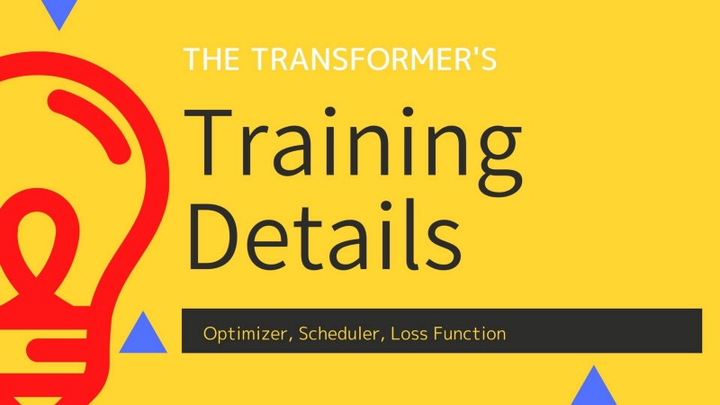
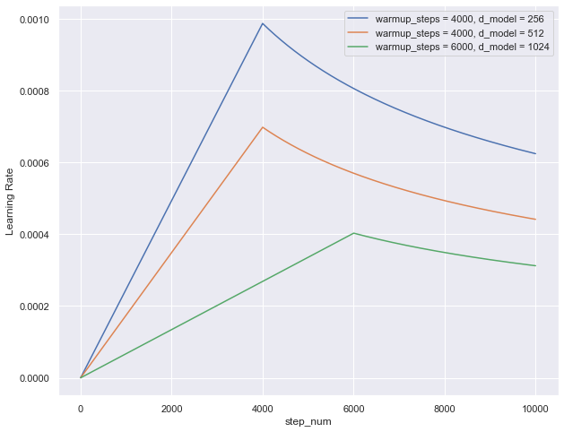
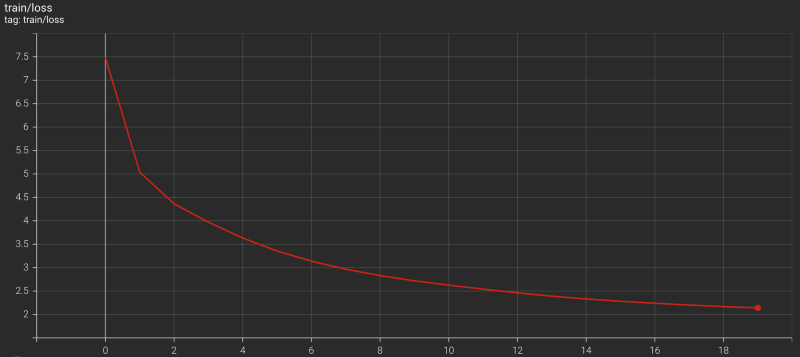
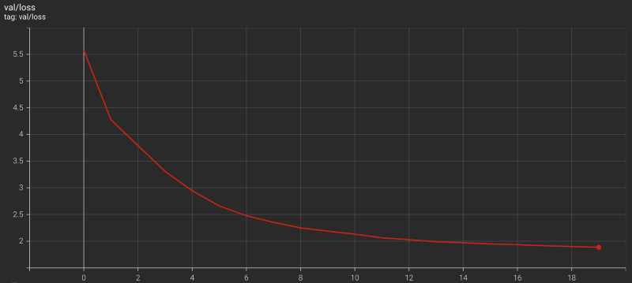

[The previous article](/blog/2022-01-23-transformers-data-loader/) discussed the implementation of a data loader for training a model based on the transformer architecture from [Attention Is All You Need](https://arxiv.org/abs/1706.03762) by Ashish Vaswani et al.

This article discusses Transformer training details with the following details:

- Adam Optimizer
- Learning Rate Scheduler
- Cross-Entropy Loss With Label Smoothing
- Transformer Training Loop &amp; Results

## Adam Optimizer

In section 5.3 of the paper, they mentioned that they used the Adam optimizer with the following parameters:

$$
\begin{aligned}
\beta_1 &= 0.9 \\
\beta_2 &= 0.98 \\
\epsilon &= 10^{-9}
\end{aligned}
$$

```python
from torch.optim import Adam

optimizer = Adam(model.parameters(),
                 betas = (0.9, 0.98),
                 eps = 1.0e-9)
```

There is no surprise here except that we didn’t explicitly specify the learning rate (the default is 0.001).

## Learning Rate Scheduler

In section 5.3 of the paper, they explained how to vary the learning rate throughout training:

$$
\text{learning\_rate} = \dfrac{1}{\sqrt{d_\text{model}}} \cdot \min \left( \dfrac{1}{\sqrt{\text{step\_num}}},\ \text{step\_num} \cdot \dfrac{1}{\text{warmup\_steps}^{\frac{3}{2}}} \right)
$$

The first observation is that the learning rate is lower as the number of embedding vector dimensions is larger. It makes sense to reduce the learning rate when adjusting more parameters.

The second observation is that two terms within the brackets become the same value when the training step number `step_num` reaches the warmup steps `warmup_steps`.

$$
\begin{aligned}
\text{step\_num} &\rightarrow \text{warmup\_steps} \\
\dfrac{1}{\sqrt{\text{step\_num}}} &\rightarrow \dfrac{1}{\sqrt{\text{warmup\_steps}}} \\
\text{step\_num} \cdot \dfrac{1}{\text{warmup\_steps}^\frac{3}{2}} &\rightarrow \dfrac{\text{warmup\_steps}}{\text{warmup\_steps}^\frac{3}{2}} = \dfrac{1}{\sqrt{\text{warmup\_steps}}}
\end{aligned}
$$

So, the learning rate linearly increases until the training step hits the warmup steps (the second term). Then, it decreases due to the inverse square root of the step number (the first term).

We can use a Python function to calculate the learning rate:

```python
# Learning rate caculation: step_num starts with 1
def calc_lr(step, dim_embed, warmup_steps):
    return dim_embed**(-0.5) * min(step**(-0.5), \
                                   step * warmup_steps**(-1.5))
```



As we can see, the learning rate is lower as the number of embedding vector dimensions `dim_embed` is larger. As expected, the learning rate peaks when the `step_num` is at `warmup_steps`, and the larger `warmup_steps` is, the lower the learning rate at the peak.

The learning rate starts very small during the warmup period and increases linearly. The paper doesn’t mention the reason for this learning rate schedule. Still, I guess they found the training unstable during the initial steps and empirically decided to use `warmup_steps=4000` for the base transformer training.

I implemented a learning rate scheduler as follows:

```python
from torch.optim import Optimizer
from torch.optim.lr_scheduler import _LRScheduler

class Scheduler(_LRScheduler):
    def __init__(self, 
                 optimizer: Optimizer,
                 dim_embed: int,
                 warmup_steps: int,
                 last_epoch: int=-1,
                 verbose: bool=False) -> None:

        self.dim_embed = dim_embed
        self.warmup_steps = warmup_steps
        self.num_param_groups = len(optimizer.param_groups)

        super().__init__(optimizer, last_epoch, verbose)
        
    def get_lr(self) -> float:
        lr = calc_lr(self._step_count, self.dim_embed, self.warmup_steps)
        return [lr] * self.num_param_groups


def calc_lr(step, dim_embed, warmup_steps):
    return dim_embed**(-0.5) * min(step**(-0.5), step * warmup_steps**(-1.5))
```

## Cross-Entropy Loss With Label Smoothing

We use the cross-entropy loss to calculate the loss value since predicting the next token ID is a classification problem.

```python
import torch.nn as nn

loss_func = nn.CrossEntropyLoss( ignore_index = PAD_IDX,
                                 label_smoothing = 0.1 )
```

- `ignore_index = PAD_IDX` means the loss calculation ignores where label token indices are for padding, regardless of what the model predicts.
- `label_smoothing = 0.1` means we are using label smoothing, which is a way to prevent a model from being too confident about its prediction:
    
    - Cross-entropy loss without label smoothing assumes there is only one correct choice of the token. The loss is negative-log-likelihood `nll`, where the label token index has 100% weight like one-hot encoding.
    - However, there could be multiple token choices with different probabilities. So, instead of 100% weight, we assign the weight `1.0 — label_smoothig` to the label token index and distribute the remaining weight `label_smoothing` across all the token indices: `distribution = label_smoothing / vocab_size`. In other words, we add a small possibility (of being a correct label) to all token indices.
    - We calculate the sum of negative-log-softmax across all the token indices `-log_softmax` and multiply it by the distribution.
    
So, we calculate a loss with label smoothing as follows:

```python
distribution = label_smoothing / vocab_size

loss = (1.0 - label_smoothing) * nll - distribution * log_softmax
```

For `label_smoothing = 0.1`, the loss becomes:

```python
loss = 0.9 * nll - 0.1 / vocab_size * log_softmax
```

Note: for both `nll` and `log_softmax` we ignore loss where the label is `PAD_IDX`.

Thankfully, PyTorch `nn.CrossEntropyLoss` supports both ignoring padding and handling label smoothing.

When we use the `nn.CrossEntropyLoss`, we need to flatten the model outputs and label token indices. So, I wrote the following wrapper module:

```python
import torch
import torch.nn as nn
from torch import Tensor

class TranslationLoss(nn.Module):
    def __init__(self, label_smoothing: float=0.0) -> None:
        super().__init__()
        self.loss_func = nn.CrossEntropyLoss(ignore_index    = PAD_IDX,
                                             label_smoothing = label_smoothing)

    def forward(self, logits: Tensor, labels: Tensor) -> Tensor:
        vocab_size = logits.shape[-1]
        logits = logits.reshape(-1, vocab_size)
        labels = labels.reshape(-1).long()
        return self.loss_func(logits, labels)
```

According to the paper, the use of label smoothing improved the BLEU score:

<blockquote>
During training, we employed label smoothing of value ls = 0.1 [36]. This hurts perplexity, as the model learns to be more unsure, but improves accuracy and BLEU score.
<cite>[Attention is All You Need]()
</blockquote>

For details of the BLEU score, please look at [this article](/blog/2021-10-20-bleu-bi-lingual-evaluation-understudy/).

## Transformer Training Loop

The following code handles one epoch during training:

```python
def train(model: nn.Module,
          loader: DataLoader,
          loss_func: torch.nn.Module,
          optimizer: torch.optim.Optimizer,
          scheduler: torch.optim.lr_scheduler._LRScheduler) -> float:

    model.train() # train mode
    
    total_loss = 0
    num_batches = len(loader)

    for source, target, labels, source_mask, target_mask in loader:
        # feed forward
        logits = model(source, target, source_mask, target_mask)

        # loss calculation
        loss = loss_func(logits, labels)
        total_loss += loss.item()

        # back-prop
        optimizer.zero_grad()
        loss.backward()
        optimizer.step()

        # learning rate scheduler
        if scheduler is not None:
            scheduler.step()

    # average training loss
    avg_loss = total_loss / num_batches
    return avg_loss
```

We load the training dataset with `split = 'train'` and pass it to the train function. Please look at [this article](/blog/2022-01-23-transformers-data-loader/) for the details of the data loader.

For evaluation, we set the model to the eval mode by `model.eval()`, and also, we don’t need gradients as we have no optimization step.

We load the validation dataset with `split = 'valid'` and pass it to the validate function.

```python
def validate(model: nn.Module,
             loader: DataLoader,
             loss_func: torch.nn.Module) -> float:

    model.eval() # eval mode

    total_loss = 0
    num_batches = len(loader)

    for source, target, labels, source_mask, target_mask in loader:
        with torch.no_grad():
            # feed forward
            logits = model(source, target, source_mask, target_mask)

            # loss calculation
            loss = loss_func(logits, labels)
            total_loss += loss.item()

    # average validation loss
    avg_loss = total_loss / num_batches
    return avg_loss
```

## Transformer Training Results

I set up a smaller version of the Transformer than the original base model.

```yaml
model:
  name: Transformer
  max_positions: 5000   # Positional encoding
  num_blocks:    2      # Encoder and decoder layers
  num_heads:     8      # Multi-head attention
  dim_embed:     128    # Embedding vector dimensions
  dim_pffn:      512    # Position-wise feed-forward
  drop_prob:     0.3    # Drop out
```

Since the dataset (`Multi30k` for German-to-English translation) is relatively small, I reduced the network parameters and used a higher drop probability to prevent over-fitting from happening.

And I did a Transformer training with the following setup:

```python
epochs: 20
batch_size: 32

optimizer:
  name: torch.optim.Adam
  betas:
   - 0.9
   - 0.98
  eps: 1.0e-9

scheduler:
  name: Scheduler
  dim_embed: 128
  warmup_steps: 10000

loss:
  name: TranslationLoss
  label_smoothing: 0.1

val_loss:
  name: TranslationLoss
  label_smoothing: 0.0   # no label smoothing for validation
```

I used relatively large warmup steps to keep the learning rate lower.

The Transformer training finished less than 6 hours on a Linux machine with 4 CPUs (Intel Core i7–7700K @ 4.20GHz) and two GPUs (NVIDIA GeForce GTX 1080 Ti).





I could’ve run it longer, but it was enough to prove the model is learning.

---

I implemented a translator class and tested with the test dataset from `Multi30k`. Some good examples are shown below (Input, Label, and the model’s prediction):

<pre class="information">
German     : Die Person im gestreiften Hemd klettert auf einen Berg.
English    : The person in the striped shirt is mountain climbing.
Translation: The person in the striped shirt is climbing a mountain.
</pre>

<pre class="information">
German     : Ein junges Mädchen schwimmt in einem Pool
English    : A young girl swimming in a pool
Translation: A young girl swimming in a pool.
</pre>

<pre class="information">
German     : Eine Frau, die in einer Küche eine Schale mit Essen hält.
English    : A woman holding a bowl of food in a kitchen.
Translation: A woman holding a bowl of food in a kitchen.
</pre>

Below are some examples of bad Translations:

<pre class="information">
German     : Drei Leute sitzen in einer Höhle.
English    : Three people sit in a cave.
Translation: Three people are sitting in an indoor pool.
</pre>

<pre class="information">
German     : Leute Reparieren das Dach eines Hauses.
English    : People are fixing the roof of a house.
Translation: People riding the roof of a house.
</pre>

<pre class="information">
German     : Ein Boston Terrier läuft über saftig-grünes Gras vor einem weißen Zaun.
English    : A Boston Terrier is running on lush green grass in front of a white fence.
Translation: A rodeo athlete runs across the grass.
</pre>

I’ll write about the translator in [the next article](/blog/2022-01-31-transformers-evaluation-details/)

## References

- [The Annotated Transformer](http://nlp.seas.harvard.edu/2018/04/03/attention.html) \
  Harvard NLP
- [Rethinking the inception architecture for computer vision](https://arxiv.org/abs/1512.00567) \
  Christian Szegedy, Vincent Vanhoucke, Sergey Ioffe, Jonathon Shlens, Zbigniew Wojna
- [Training Tips for the Transformer Model](https://ufal.mff.cuni.cz/pbml/110/art-popel-bojar.pdf) \
  Martin Popel, Ondřej Bojar
- [Attention Is All You Need](https://arxiv.org/abs/1706.03762) \
  Ashish Vaswani, Noam Shazeer, Niki Parmar, Jakob Uszkoreit, Llion Jones, Aidan N. Gomez, Łukasz Kaiser, Illia Polosukhin
