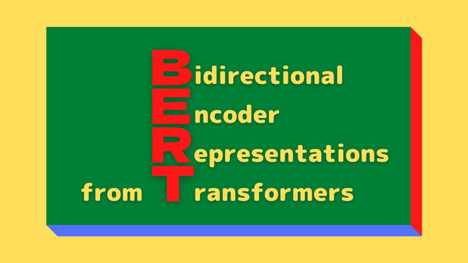

BERT stands for **B**idirectional **E**ncoder **R**epresentations from **T**ransformers. As the name suggests, it generates representations using an encoder from Vaswani et al.’s [Transformer Architecture](/blog/2021/2021-12-13-transformers-encoder-decoder/). However, there are notable differences between BERT and the original Transformer, especially in how they train those models.

This article discusses the following:

- Why unsupervised pre-training?
- Masked language model (MLM)
- Next Sentence Prediction (NSP)
- Supervised fine-tuning

## Why Unsupervised Pre-Training?

Vaswani et al. employed supervised learning to train the original Transformer models for language translation tasks requiring source and target language sentence pairs. For example, a German-to-English translation model needs a training dataset with many German sentences and corresponding English translations. Collecting such text data may involve much work, but we require them to ensure machine translation quality. There is not much else we can do about it, or can we?

We can use unsupervised learning to tap into many unlabelled corpora. However, before discussing unsupervised learning, let’s look at another problem with supervised representation learning.

The original Transformer architecture has an encoder for a source language and a decoder for a target language. The encoder learns task-specific representations, which are helpful for the decoder to perform translation, i.e., from German sentences to English. It sounds reasonable that the model learns representations helpful for the ultimate objective. But there is a catch.

If we wanted the model to perform other tasks like question answering and language inference, we would need to modify its architecture and re-train it from scratch. It is time-consuming, especially with a large corpus.

Would human brains learn different representations for each specific task? It does not seem so. When kids learn a language, they do not aim for a single task in mind. They would somehow understand the use of words in many situations and acquire how to adjust and apply them to multiple activities.

To summarize what we have discussed up until now, the question is whether we can train a model with many unlabeled texts to generate representations and adjust the model for different tasks without from-scratch training.

The answer is a resounding yes, and that's exactly what Jacob Devlin et al. (the Google AI Language team) did with BERT. They pre-trained a model with unsupervised learning to obtain non-task-specific representations helpful for various language model tasks. Then, they added one additional output layer to fine-tune the pre-trained model for each task, achieving state-of-the-art results on eleven natural language processing tasks like GLUE, MultiNLI, and SQuAD v1.1 and v2.0 (question answering).

So, the first step in the BERT framework is to pre-train a model on a large amount of unlabeled data, giving many contexts for the model to learn representations in unsupervised training. The resulting pre-trained BERT model is a non-task-specific feature extractor that we can fine-tune quickly to a specific objective.

The next question is how they pre-trained BERT using text datasets without labeling.

## Masked Language Model (MLM)

Language models (LM) estimate the probability of the next word following a sequence of words in a sentence. One application of LM is to generate texts given a prompt by predicting the most probable word sequence. It is a left-to-right language model.

Note: “left-to-right” may imply languages such as English and German. However, other languages use “right-to-left” or “top-to-bottom” sequences. Therefore, “left-to-right” means the natural flow of language sequences (forward), not aiming for specific languages. Also, “right-to-left” means the reverse order of language sequences (backward).

Unlike left-to-right language models, the masked language models (MLM) estimate the probability of masked words. We randomly hide (mask) some tokens from the input and ask the model to predict the original tokens in the masked positions. It lets us use unlabeled text data since we hide tokens that become labels (as such, we may call it “self-supervised” rather than “unsupervised,” but I’ll keep the same terminology as the paper for consistency's sake).

The model predicts each hidden token solely based on its context, where the self-attention mechanism from the Transformer architecture comes into play. The context of a hidden token originates from both directions since the self-attention mechanism considers all tokens, not just the ones preceding the hidden token. Jacob Devlin et al. call such representation bi-directional, compared with uni-directional representation by left-to-right language models.

Note: IMHO, the term “bi-directional” is a bit misnomer because the self-attention mechanism is not directional at all. However, we should treat the term as the antithesis of “uni-directional”.

In the paper, they have a footnote (4) that says:

<blockquote>
We note that in the literature the bidirectional Transformer is often referred to as a “Transformer encoder” while the left-context-only version is referred to as a “Transformer decoder” since it can be used for text generation.
<cite>[BERT: Pre-training of Deep Bidirectional Transformers for Language Understanding](https://arxiv.org/abs/1810.04805)
</blockquote>

So, Jacob Devlin et al. trained an encoder (including the self-attention layers) to generate bi-directional representations, which can be more prosperous than uni-directional representations from left-to-right language models for some tasks. Also, it is better than simply concatenating independently trained left-to-right and right-to-left language model representations because bi-directional representations simultaneously incorporate contexts from all tokens.

However, many tasks involve understanding the relationship between two sentences, such as Question Answering (QA) and Natural Language Inference (NLI). Language modeling (LM or MLM) does not capture this information.

We need another unsupervised representation learning task for multi-sentence relationships.

## Next Sentence Prediction (NSP)

A next sentence prediction is a task to predict a binary value (i.e., Yes/No, True/False) to learn the relationship between two sentences. For example, there are two sentences A and B, and the model predicts if B is the actual next sentence that follows A. They randomly used the true or false next sentence for B. It is easy to generate such a dataset from any monolingual corpus. Hence, it is unsupervised learning.

But how can we pre-train a model for both MLM and NSP tasks?

To understand how a model can accommodate two pre-training objectives, let’s examine how they tokenize inputs.

They used WordPiece for tokenization, which has a vocabulary of 30,000 tokens based on the most frequent sub-words (combinations of characters and symbols). They also used the following special tokens:

- `[CLS]` — the first token of every sequence. The final hidden state is the aggregate sequence representation used for classification tasks.
- `[SEP]` — a separator token, for example, separating questions and related passages.
- `[MASK]` — a token to hide some of the input tokens

For the MLM task, they randomly choose a token to replace with the `[MASK]` token. They calculate cross-entropy loss between the model’s prediction and the masked token to train the model.

For the NSP task, they separated sentences A and B using `[SEP]` token and used the final hidden state in place of `[CLS]` for binary prediction. Their final model achieved 97%-98% accuracy on this task.

Note: there is one more detail when separating two sentences. They added a learned embedding to every token, indicating whether it belongs to sentence A or B. It’s similar to positional encoding, but it is for sentence level. They call it segmentation embeddings.

](images/figure-2.png)

So, Jacob Devlin et al. pre-trained BERT using the two unsupervised tasks and empirically showed that pre-trained bi-directional representations could help execute various language tasks involving single text or text pairs.

The final step is to conduct supervised fine-tuning to perform specific tasks.

## Supervised Fine-Tuning

Fine-tuning adjusts all pre-trained model parameters for a specific task much faster than from-scratch training. Furthermore, it is more flexible than feature-based training that fixes pre-trained parameters. As a result, we can quickly train a model for each specific task without heavily engineering a task-specific architecture.

The pre-trained BERT model can generate representations for single text or text pairs, thanks to the special tokens and the two unsupervised language modeling pre-training. As such, we can plug task-specific inputs and outputs into BERT for each downstream task.

For classification tasks, we feed the final `[CLS]` representation to an output layer. For multi-sentence tasks, the encoder can process a concatenated text pair (using `[SEP]`) into a bi-directional cross-attention between two sentences. For example, we can use it for question-passage pair in a question-answering task.

By now, it should be clear why and how they repurposed the Transformer architecture, especially the self-attention mechanism, through unsupervised pre-training objectives and downstream task-specific fine-tuning.

They reported results on the following two model sizes.

The base BERT uses 110M parameters in total:

- 12 encoder blocks
- 768-dimensional embedding vectors
- 12 attention heads

The large BERT uses 340M parameters in total:

- 24 encoder blocks
- 1024-dimensional embedding vectors
- 16 attention heads

Below are the GLUE test results from the paper.

](images/table-1.png)

## References

- [BERT: Pre-training of Deep Bidirectional Transformers for Language Understanding](https://arxiv.org/abs/1810.04805) \
  Jacob Devlin, Ming-Wei Chang, Kenton Lee, Kristina Toutanova
- [GLUE (General Language Understanding Evaluation) Benchmark](https://gluebenchmark.com)
- [The Multi-Genre Natural Language Inference](https://cims.nyu.edu/~sbowman/multinli/)
- [BERT GitHub](https://github.com/google-research/bert)
- [WordPiece](https://paperswithcode.com/method/wordpiece)
