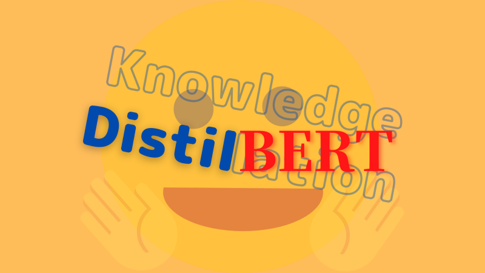

In 2019, the team at Hugging Face released a model based on [BERT](/blog/2022-02-07-bert-bidirectional-encoder-representation-from-transformers/) that was 40% smaller and 60% faster while retaining 97% of the language understanding capability. They called it DistilBERT.

## How Small Is DistilBERT?

So, exactly how small is DistilBERT? The below chart compares the size of DistilBERT with large-scale pre-trained language models from 2018 to 2019.

](images/figure-1)

Although not shown in the chart, the BERT-Base is one-third of the BERT-Large containing 110M parameters, whereas DistilBERT is even 40% smaller than that. Yes, it’s a lot smaller, but why should we care?

There are two reasons: the first is the environmental cost. Exponentially scaling the number of model parameters increases computational requirements proportionally, consuming lots of electric energy. The second is large models won’t work well on small devices like smartphones. Ideally, we want a smaller model that is equivalently performant as larger ones. 

The question is: is it possible to teach a smaller model what larger models can achieve?

## The Tripple Loss

The Hugging Face team answered YES, as they were able to teach the small DistilBERT to learn from larger BERT models, utilizing knowledge distillation with the triple loss:

- Cross-Entropy Loss
- Distillation Loss
- Cosine Embedding Loss

To introduce these losses, let’s start discussing knowledge distillation. In 2006, Caruana and his collaborators compiled the knowledge in an ensemble of models into a single model. In 2015, Geoffrey Hinton’s team applied the same idea to deep learning, transferring the knowledge in a large model into a smaller model. They called it __knowledge distillation__, where we call a smaller model “__student__” and a larger model “__teacher__”.

A student has two objectives. One is the supervised training loss to minimize the cross-entropy between the student’s predicted distribution and the one-hot empirical distribution of training labels. It’s the standard classification loss term. The other is the distillation loss to minimize the KL divergence between the student’s predicted distribution and the teacher’s, which induces the student to produce a similar probability distribution. More intuitively, _the student learns to think as the teacher does_.

The teacher may assign small probabilities to incorrect answers, and these probabilities manifest in how the teacher generalizes. Hinton says in the paper:

<blockquote>
An image of a BMW, for example, may only have a very small chance of being mistaken for a garbage truck, but that mistake is still many times more probable than mistaking it for a carrot.
<cite>[Distiling the Knowledge in a Neural Network](https://arxiv.org/abs/1503.02531)
</blockquote>

Therefore, the student can benefit by learning from all the probabilities the teacher produces. However, minimizing the KL divergence between the student and the teacher has one problem. A well-trained teacher signals so weakly to incorrect answers that the student may not learn much. In other words, a well-trained teacher produces a very sharp distribution with a significant probability of the correct answer, and the rest is near zero, almost the same as a one-hot encoded correct label, making the distillation loss useless.

Hinton used the softmax-temperature T as shown below:

$$
q_i = \dfrac{\exp \left( \dfrac{z_i}{T} \right)}{\sum\limits_j \exp \left( \dfrac{z_j}{T} \right)}
$$
<cite>Equation (1) of [the Distilling the Knowledge in a Neural Network paper](https://arxiv.org/abs/1503.02531)</cite>

When $T=1$, the above is the standard softmax formula. With $T > 1$, the probability distribution becomes softer, giving more weight to incorrect answers.

In DistilBERT, they applied the same temperature $T$ to the student and the teacher at training time. The teacher (already trained and frozen) produced adjusted probability estimates that the student could learn. They set $T=1$ at inference time for the student to produce the standard softmax outputs.

## Performance Results

BERT had 12 encoder blocks that alternate multi-head self-attention and feed-forward layers. DistilBERT reduced the number of layers by half. They kept using 768-dimensional embedding vectors because reducing the vector dimension didn’t significantly impact computation efficiency. Besides, keeping the same dimensionality has multiple benefits.

First, while reducing the number of layers by half, they could still reuse the weights to initialize DistilBERT, which had a significant performance benefit. Next, using the same dimensionality allowed them to use cosine-distance loss between DistilBERT and BERT, another kind of distillation loss that tends to align the directions of the student and teacher's hidden state vectors.

As for training, they followed RoBERTa. DistilBERT trained a lot faster. According to the paper, DistilBERT required 8 (16GB) V100 GPUs for approximately 90 hours, whereas the RoBERTa model required one day of training on 1024 32GB V100.

DistilBERT retains 97% of BERT performance on the GLUE benchmark:

](images/table-1.png)

They tested DistilBERT on iPhone 7 Plus and found it runs 71% faster than BERT.

Finally, they performed an ablation study to see the effect of those three losses. The supervised training loss is the masked language modeling loss: $L_\text{mlm}$ without the subsequent sentence prediction loss. The distillation loss is the cross-entropy loss $L_\text{ce}$ between the student and teacher models, as reducing the cross-entropy reduces the KL divergence between two probability distributions. The cosine-distance loss $L_\text{cos}$.

They trained models with various combinations of the losses:

](images/table-4.png)

From the top, the combinations are:

- $L_\text{cos}$ and $L_\text{mlm}$ weights initialized with copied values
- $L_\text{ce}$ and $L_\text{mlm}$ weights initialized with copied values
- $L_\text{ce}$ and $L_\text{cos}$ weights initialized with copied values
- Triple loss ($L_\text{ce}$, $L_\text{cos}$, and $L_\text{mlm}$) with random weights

As a result, removing the Masked Language Modeling loss has little impact. In other words, the student learns more from the teacher than from the training data.

## References

- [DistilBERT, a distilled version of BERT: smaller, faster, cheaper and lighter](https://arxiv.org/abs/1910.01108) \
  Victor SANH, Lysandre DEBUT, Julien CHAUMOND, Thomas WOLF
- [Distilling the Knowledge in a Neural Network](https://arxiv.org/abs/1503.02531) \
  Geoffrey Hinton, Oriol Vinyals, Jeff Dean
- [Model compression](https://www.cs.cornell.edu/~caruana/compression.kdd06.pdf) \
  C. Buciluǎ, R. Caruana, A. Niculescu-Mizil
