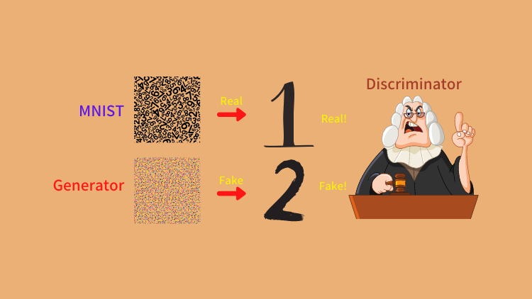
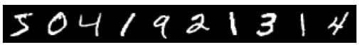
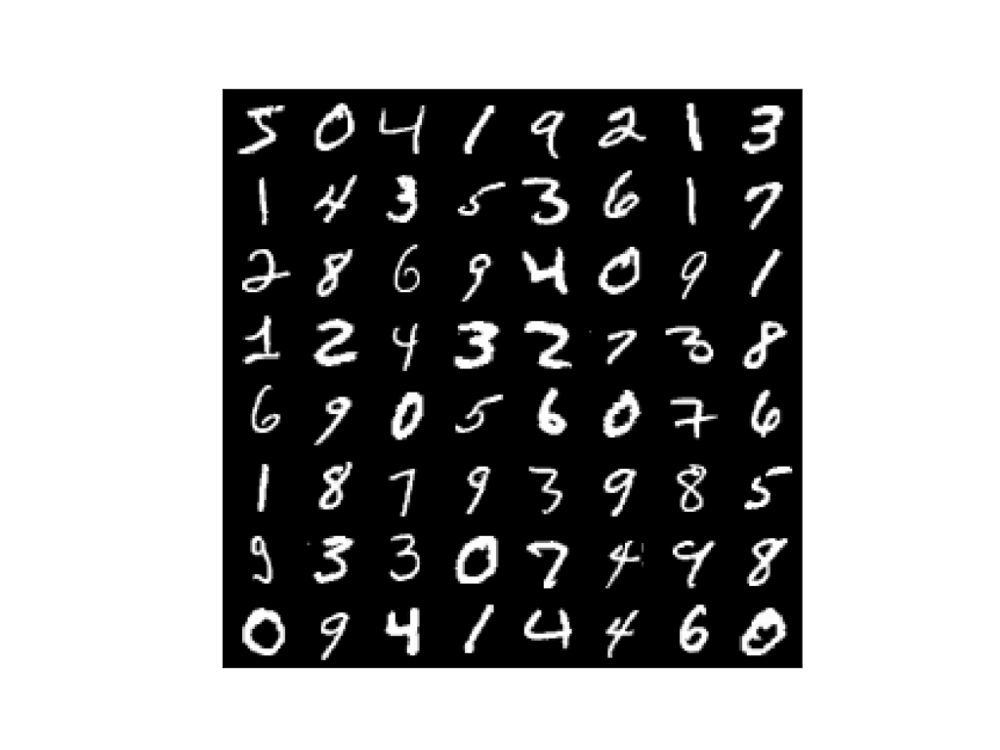
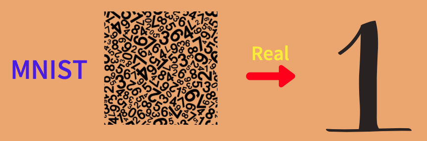
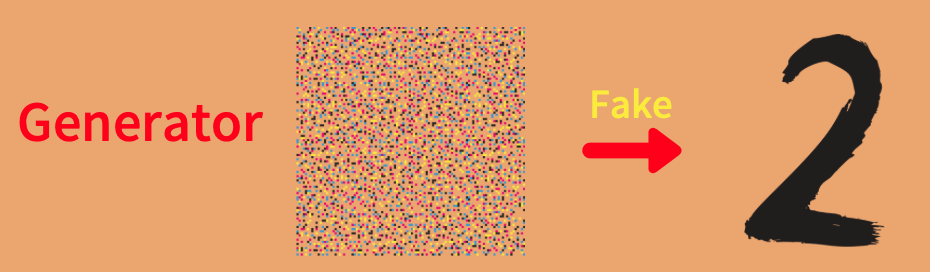
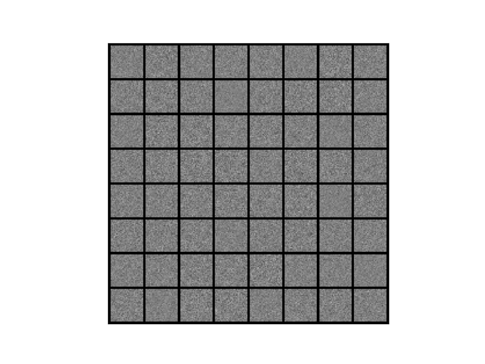
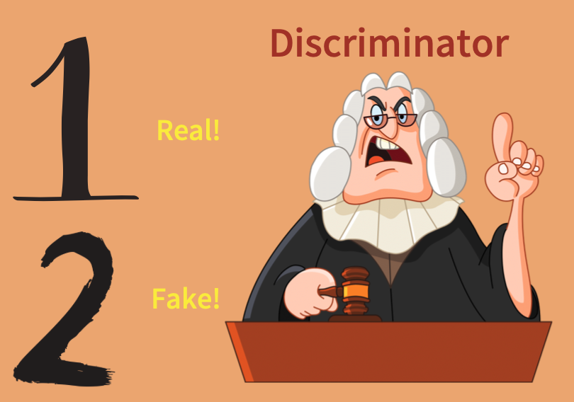
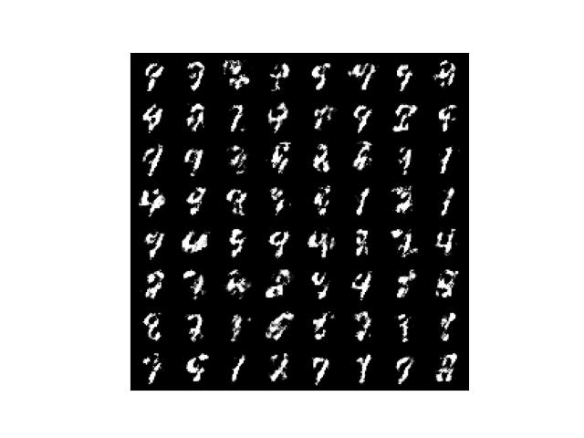
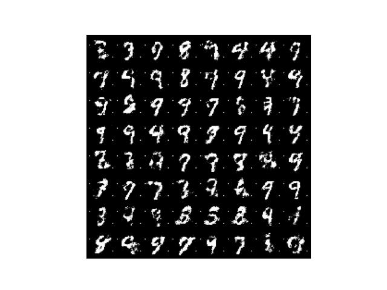

In this article, I'll explain how GAN (Generative Adversarial Network) works while implementing it step-by-step with PyTorch. GAN is a generative model that produces random images given a random input. We will define the model and train it. 

## Introduction

### Ian Goodfellow and GAN

As you probably know, [Ian Goodfellow](https://www.iangoodfellow.com) proposed GAN in 2014. I believe many people think of GAN when they think of Ian Goodfellow. At that time, he was a Ph.D. student in machine learning at the [Université de Montréal](https://en.wikipedia.org/wiki/Universit%C3%A9_de_Montr%C3%A9al) under the supervision of [Yoshua Bengio](https://en.wikipedia.org/wiki/Yoshua_Bengio). After that, he joined Google, moved to OpenAI, and then arrived at Apple as a chief director of AI in 2019. He became a well-known and successful AI researcher, and GAN was one of the reasons.

In 2016, [Yann LeCun](http://yann.lecun.com) (Meta Chief AI Scientist) said the following in praise of GAN:

<blockquote>
The most important one, in my opinion, is adversarial training (also called GAN for Generative Adversarial Networks).
<cite>[Quora: What are some recent and potentially upcoming breakthroughs in deep learning?](https://quorasessionwithyannlecun.quora.com/What-are-some-recent-and-potentially-upcoming-breakthroughs-in-deep-learning-1)</cite>
</blockquote>

So, what is so crucial about GAN? Let's write some codes and find out.

### Python Environment Setup

First of all, we create a Python environment. We'll use `venv` as follows:

```python
# Create a project folder and move there
mkdir gan
cd gan

# Create and activate a Python environment using venv
python3 -m venv venv
source venv/bin/activate

# We should always upgrade pip as it's usually old version
# that has older information about libraries
pip install --upgrade pip

# We install required libraries under the virtual environment
pip install torch torchvision matplotlib tqdm
```

The versions of installed libraries are as follows:

```
matplotlib==3.5.1
torch==1.11.0
torchvision==0.12.0
tqdm==4.64.0
```

If you prefer `conda`, you can create an environment with that. Please make sure to install the required libraries.

### MNIST Dataset

We will use [MNIST](http://yann.lecun.com/exdb/mnist/) as our dataset of choice. It contains greyscale images of 0-9 digit numbers. 



Yann LeCun prepared the MNIST dataset to train his convolutional neural network (LeNet) for hand-written digit classification. We can load the dataset using the torch vision library.

```python
from torchvision import datasets, transforms

transform = transforms.ToTensor()

dataset = datasets.MNIST(root='./data', train=True, download=True, transform=transform)
```

There are a training set and a test set. We use the training set since it has more images than the test set. We will soon see that we ignore the labels as this is not a classification model training. Also, we do not perform preprocessing of images (Numpy data) except for converting them into Torch Tensors by `transforms.ToTensor`, which also converts the value range from byte type data (0-255) to float type data (0.0-1.0).

### Sample Images

Let's look at some of the images. We load a batch of images using the DataLoader class.

```python
from torch.utils.data import DataLoader

dataloader = DataLoader(dataset, batch_size=64, drop_last=True)
```

I used `drop_last=True` to discard the last incomplete batch if the dataset size is not divisible by the batch size to keep the handling simple. Let's retrieve the first batch and examine it as follows:

```python
images, labels = next(iter(dataloader))

print(images.shape)
print(labels)
```

The batch shape `torch.Size([64, 1, 28, 28])` means one image size is 28x28 pixels. As the images are grey-scaled, they have only one channel, unlike RGB images with three channels (Red, Green, and Blue). Although we don't use labels, we can confirm that each image has an associated corresponding number.

```
tensor([5, 0, 4, 1, 9, 2, 1, 3, 1, 4, 3, 5, 3, 6, 1, 7, 2, 8, 6, 9, 4, 0, 9, 1,
        1, 2, 4, 3, 2, 7, 3, 8, 6, 9, 0, 5, 6, 0, 7, 6, 1, 8, 7, 9, 3, 9, 8, 5,
        9, 3, 3, 0, 7, 4, 9, 8, 0, 9, 4, 1, 4, 4, 6, 0])
```

Let's define a function to display images and show images in a grid layout:

```python
import torch
from torchvision.utils import make_grid
import matplotlib.pyplot as plt


def show_image_grid(images: torch.Tensor, ncol: int):
    image_grid = make_grid(images, ncol)     # Make images into a grid
    image_grid = image_grid.permute(1, 2, 0) # Move channel to the last
    image_grid = image_grid.cpu().numpy()    # Convert into Numpy

    plt.imshow(image_grid)
    plt.xticks([])
    plt.yticks([])
    plt.show()


show_image_grid(images, ncol=8)
```

We can see 64 images in a grid layout. Each image corresponds to the number on the labels.

{width="80%"}

So, how do we generate such images using a neural network?

## Generator Network

We use MNIST as the source of real images. In other words, we want to train a model that generates images similar to MNIST images. As such, we don't use the label data.

{width="50%"}

As the model will generate images, we call it a generator, which is nothing but a deep neural network, albeit a simple one. We feed a random value vector into the generator to generate a random digit image.

{width="50%"}

### Random Inputs

We need to decide the size of the random value vector. More random values may potentially add variations to generated images. However, it would take more time and even more difficulty to train the generator as there will be much more network parameters to adjust during the optimization process. Also, MNIST images are not too complex, and we probably do not need too many random values in input vectors. So, let's use 100 random values per input vector, which we generate from the standard normal distribution as follows:

```python
z = torch.randn(1, 100)
print(z)
```

The shape of `z` is (1, 100) that is a batch size = 1, and one input has 100 random values from the standard normal distribution:

```
tensor([[-1.3960,  0.6781, -0.7288, -1.6172,  0.6932, -0.3400,  0.4452,  0.3502,
         -0.7701, -0.9442, -0.5733,  1.2326, -0.6679, -0.6649,  0.3949,  0.1918,
          0.1251, -0.2411, -1.3586,  1.3770,  0.4997, -0.6191, -1.9267,  0.3402,
          1.2111, -0.3573,  1.0328, -0.1675,  0.0841,  0.1866, -0.1482,  0.2603,
         -0.1154, -0.6616, -1.5474, -0.3432, -0.1312,  0.1223,  1.0606,  1.2120,
         -1.3338,  1.1965,  0.0041,  0.6383, -0.1143, -0.8992,  0.6415, -0.6786,
         -0.0174, -1.1782, -0.6206,  1.2067,  0.2221,  0.3988, -0.7581,  1.4411,
         -0.1658,  0.2643,  1.8042,  0.4923,  0.1234, -0.1523,  2.0511,  1.0947,
         -0.9983, -0.7883, -0.1812, -0.1829,  1.4517, -1.2220,  0.3964,  0.0781,
          0.2261,  0.5814,  1.5786, -0.3531,  0.3415,  3.2510, -0.5528, -0.4402,
         -1.9231, -0.3097, -0.0519, -0.8633,  0.6243, -1.4232, -1.7594,  1.2454,
         -0.3119, -0.8461,  0.8073,  1.0772, -1.1928, -1.5024, -0.5267, -0.1670,
          0.5459,  0.0671, -0.4532, -0.8306]])
```

We feed this into the generator (we will define it soon) to generate a greyscale image in the shape of (1, 28, 28).

### Latent Variables

Many papers call those random values latent variables, which indicates there is some hidden important information inside those random values that the generator network can understand to decode into an image. But in this article, I don't use the word latent variables and refer to random value inputs as such. We are simply training the generator network to convert random values into an image, and that is all we need to discuss how GAN works.

### Network Definition

We define our (elementary) generator network as follows:

```python
from torch import nn

generator = nn.Sequential(nn.Linear(100, 128),
                          nn.LeakyReLU(0.01),
                          nn.Linear(128, 784),
                          nn.Sigmoid())
```

The generator network does the following:

- It converts 100 random values into 128 numeric values via the fully-connected linear layer.
- It applies non-linearity via leaky ReLU.
- It converts 128 numeric values into 784 numeric values (784 = 28x28, which is the image size).
- It applies the sigmoid to squeeze output values into the 0 to 1 range (the value range in greyscale images).

We can reshape the final output into (1, 28, 28) to have greyscale image data.

### Generator Output Before Training

Let's create a batch of 64 random value vectors and feed it into the generator (without training).

```python
def generate_images():
    # Random value inputs (batch size 64)
    z = torch.randn(64, 100)

    # Generator network output
    output = generator(z)

    # Reshape the output into 64 images
    generated_images = output.reshape(64, 1, 28, 28)

    return generated_images


# Call the function to generate images
generated_images = generate_images()

# Display images in a grid layout
show_image_grid(generated_images, nrow=8)
```

Generated images are entirely random since we have not trained the generator network, and its parameters (weights and biases) are completely random at this stage.

{width="60%"}

We want to train the generator to generate images as if they come from MNST. We want to generate realistic MNIST images. In GAN, we train another network (discriminator) that learns to tell whether an input image is real. In our case, the discriminator detects whether an input image is real (it looks to come from MNIST). That is what makes GAN unique and innovative, as Yann LeCun pointed out.

But how do we train such a discriminator network?

## Discriminator Network

The discriminator network tells if a given image is real or not. Here, 'real' means that an input image looks like coming from MNIST. If an input image didn't come from MNIST but still looks like one from MNIST, the discriminator will identify it as real.

{width="55%"}

In other words, the discriminator deals with a binary classification problem, and we train it to distinguish between real and fake images. `fake` means an input image does not look like it comes from MNIST.

### Network Definition

We define the discriminator as a simple classification network:

```python
discriminator = nn.Sequential(nn.Linear(784, 128),
                              nn.LeakyReLU(0.01),
                              nn.Linear(128, 1))
```

The discriminator network does the following:

- It converts a flattened input image (28x28 to 784 pixels) into 128 values via the fully-connected linear layer.
- It applies non-linearity via leaky ReLU.
- It converts 128 values into one value.

The larger output value indicates that the discriminator predicts the input image is more "real".

### Discriminator Output Before Training

Let's feed an image generated by the untrained generator network into the discriminator:

```python
discriminator.eval()
with torch.no_grad():
    prediction = discriminator(generated_images.reshape(-1, 784))

print(prediction)
```

The outputs are 64 random values. The shape is (64, 1).

```
tensor([[-0.0296],
        [-0.0224],
        [-0.0331],
        [-0.0320],
        [-0.0255],
        [-0.0354],
        [-0.0127],
        [-0.0371],
        [-0.0386],
        ....
        [-0.0160],
        [-0.0218],
        [-0.0214],
        [-0.0236]])
```

We haven't trained the discriminator, so it has no idea whether an image is real or fake and outputs meaningless values. Even if we use real MNIST images, the discriminator behaves similarly. So the discriminator can not distinguish between real and fake images. So, how do we train it?

## Discriminator Network Training

### Loss Function

We need to train the discriminator as a classifier (supervised learning), which needs labels. We treat MNIST images as real images and generated images as fake images. In other words, when the discriminator classifies an MNIST image, the label is real (1), and when the discriminator classifies a generated image, the label is fake (0). 

We prepare a real label batch and a fake label batch as follows (batch\_size=64):

```python
real_targets = torch.ones(64, 1)
fake_targets = torch.zeros(64, 1)
```

So, when we feed a batch of MNIST images into the discriminator, we use `real_targets`; when we feed a batch of generated images into the discriminator, we use `fake_targets`. Each time, we calculate the cross-entropy loss for optimization.

```python
def calculate_loss(images: torch.Tensor, targets: torch.Tensor):
    prediction = discriminator(images.reshape(-1, 784))
    loss = F.binary_cross_entropy_with_logits(prediction, targets)
    return loss
```

### Training Loop

We use [Adam](/blog/2021-08-29-gradient-descent-optimizers/#adam) optimizer.

```python
from torch.nn import functional as F

d_optimizer = torch.optim.Adam(discriminator.parameters(), lr=1.0e-4)
```

During training, the discriminator predicts whether an input image is real or fake. We calculate the loss value and apply back-propagation so that the optimizer can adjust network parameters (weights and biases).

```python
# On training mode
discriminator.train()

# On eval mode
generator.eval()

# Training loop
for epoch in range(100):
    for images, labels in dataloader:
        # Loss with MNIST image inputs and real_targets as labels
        d_loss = calculate_loss(images, real_targets)
  
        # Loss with generated image inputs and fake_targets as labels
        generated_images = generate_images()
        d_loss += calculate_loss(generated_images, fake_targets)

        # Optimizer updates the discriminator parameters
        d_optimizer.zero_grad()
        d_loss.backward()
        d_optimizer.step()
```

It is a usual supervised training for a classification model. The discriminator will learn to distinguish between real (MNIST) images and fake (generated) images. However, the generator network learns nothing in the above training.

## Generator Network Training

Let's talk about how to train the generator network. We use Adam optimizer to update the generator parameters.

```python
g_optimizer = torch.optim.Adam(generator.parameters(), lr=1.0e-4)
```

When we train the generator, we want it to generate images as if they come from MNIST. As such, we use `` real_targets `` as labels, and use the discriminator to calculate the loss.

```python
# On training mode
generator.train()

# On eval mode
discriminator.eval()

for epoch in range(100):
    for images, labels in dataloader:
        # Loss with generated image inputs and real_targets as labels
        generated_images = generate_images()
        g_loss = calculate_loss(generated_images, real_targets)

        # Optimizer updates the generator parameters
        g_optimizer.zero_grad()
        g_loss.backward()
        g_optimizer.step()
```

Although the discriminator calculates loss, the generator network parameters also contribute to it. When we back-propagate the loss, the gradients will reach the generator parameters. Hence, we can use the optimizer to update the generator's parameters.

## GAN Training

We don't train the discriminator and the generator separately. In GAN training, we train the discriminator and generator networks in turn __in the same training loop__. If we train only the generator network first, the discriminator couldn't distinguish between real and fake images well, and the loss value is not very useful. GAN training is tricky because we must train both to ensure both are learning harmoniously. We need to carefully balance and adjust learning rates for the discriminator and generator. If one network learns too fast, the other network may not learn very effectively. We want to achieve a win-win situation where both networks improve side-by-side. 

### The Entire Source Code

The following code contains everything we have discussed in this article. I only use the CPU to train the discriminator and generator networks. To use GPU, you'll need to move the networks and batch data to GPU before calling them to produce outputs.

```python
import numpy as np
import matplotlib.pyplot as plt
import torch
from torch import nn
from torch.nn import functional as F
from torch.utils.data import DataLoader
from torchvision import datasets, transforms
from torchvision.utils import make_grid
from tqdm import tqdm


# Configuration
epochs      = 100
batch_size  = 64
sample_size = 100    # Number of random values to sample
g_lr        = 1.0e-4 # Generator's learning rate
d_lr        = 1.0e-4 # Discriminator's learning rate


# DataLoader for MNIST
transform = transforms.ToTensor()
dataset = datasets.MNIST(root='./data', train=True, download=True, transform=transform)
dataloader = DataLoader(dataset, batch_size=batch_size, drop_last=True)


# Generator Network
class Generator(nn.Sequential):
    def __init__(self, sample_size: int):
        super().__init__(
            nn.Linear(sample_size, 128),
            nn.LeakyReLU(0.01),
            nn.Linear(128, 784),
            nn.Sigmoid())

        # Random value vector size
        self.sample_size = sample_size

    def forward(self, batch_size: int):
        # Generate randon values
        z = torch.randn(batch_size, self.sample_size)

        # Generator output
        output = super().forward(z)

        # Convert the output into a greyscale image (1x28x28)
        generated_images = output.reshape(batch_size, 1, 28, 28)
        return generated_images


# Discriminator Network
class Discriminator(nn.Sequential):
    def __init__(self):
        super().__init__(
            nn.Linear(784, 128),
            nn.LeakyReLU(0.01),
            nn.Linear(128, 1))

    def forward(self, images: torch.Tensor, targets: torch.Tensor):
        prediction = super().forward(images.reshape(-1, 784))
        loss = F.binary_cross_entropy_with_logits(prediction, targets)
        return loss


# To save images in grid layout
def save_image_grid(epoch: int, images: torch.Tensor, ncol: int):
    image_grid = make_grid(images, ncol)     # Images in a grid
    image_grid = image_grid.permute(1, 2, 0) # Move channel last
    image_grid = image_grid.cpu().numpy()    # To Numpy

    plt.imshow(image_grid)
    plt.xticks([])
    plt.yticks([])
    plt.savefig(f'generated_{epoch:03d}.jpg')
    plt.close()


# Real and fake labels
real_targets = torch.ones(batch_size, 1)
fake_targets = torch.zeros(batch_size, 1)


# Generator and Discriminator networks
generator = Generator(sample_size)
discriminator = Discriminator()


# Optimizers
d_optimizer = torch.optim.Adam(discriminator.parameters(), lr=d_lr)
g_optimizer = torch.optim.Adam(generator.parameters(), lr=g_lr)


# Training loop
for epoch in range(epochs):

    d_losses = []
    g_losses = []

    for images, labels in tqdm(dataloader):
        #===============================
        # Discriminator Network Training
        #===============================

        # Loss with MNIST image inputs and real_targets as labels
        discriminator.train()
        d_loss = discriminator(images, real_targets)

        # Generate images in eval mode
        generator.eval()
        with torch.no_grad():
            generated_images = generator(batch_size)

        # Loss with generated image inputs and fake_targets as labels
        d_loss += discriminator(generated_images, fake_targets)

        # Optimizer updates the discriminator parameters
        d_optimizer.zero_grad()
        d_loss.backward()
        d_optimizer.step()

        #===============================
        # Generator Network Training
        #===============================

        # Generate images in train mode
        generator.train()
        generated_images = generator(batch_size)

        # Loss with generated image inputs and real_targets as labels
        discriminator.eval() # eval but we still need gradients
        g_loss = discriminator(generated_images, real_targets)

        # Optimizer updates the generator parameters
        g_optimizer.zero_grad()
        g_loss.backward()
        g_optimizer.step()

        # Keep losses for logging
        d_losses.append(d_loss.item())
        g_losses.append(g_loss.item())

    # Print average losses
    print(epoch, np.mean(d_losses), np.mean(g_losses))

    # Save images
    save_image_grid(epoch, generator(batch_size), ncol=8)
```

During GAN training, the generator network and the discriminator network are like competing with each other. The generator tries to deceive the discriminator, while the discriminator tries to determine whether images are real or fake. GAN stands for Generative Adversarial Network, and now you should know why.

## Results

### Epoch 1

After the first epoch, the generator produced the below images. It looks like a bunch of silkworms. At least, they are not complete noise.


### Epoch 50

After the 50th epoch, the generator produces more variations. Some of them already look like numbers.



### Epoch 100

After the 100th epoch, some images look like real numbers, but others still look rough.



I'd say it's heading in the right direction.

<iframe width="560" height="315" src="https://www.youtube.com/embed/bOd-DAFmLos" title="YouTube video player" frameborder="0" allow="accelerometer; autoplay; clipboard-write; encrypted-media; gyroscope; picture-in-picture; web-share" allowfullscreen></iframe>

### How To Improve

We only used simple networks so we could add more layers to make the networks more complex, which may improve the quality of the generated images. Another idea is to introduce convolutional layers since we deal with images like DCGAN (Deep Convolutional GAN).

We might (perhaps) be able to adjust learning rates to make the networks learn faster. Changing learning rates can significantly impact how the networks learn, for better or worse. We can also try other optimizers to see how they work. If so, we could draw loss curves and compare how different optimizer affects learning progresses.

Or try the updated version in [this article](/blog/2022-04-22-dcgan-deep-convolutional-gan-generates-mnist-like-images-with-dramatically-better-quality/).

## References

- [Generative Adversarial Networks](https://arxiv.org/abs/1406.2661) \
  Ian J. Goodfellow, Jean Pouget-Abadie, Mehdi Mirza, Bing Xu, David Warde-Farley, Sherjil Ozair, Aaron Courville, Yoshua Bengio
- [How to Train a GAN: Tips and tricks to make GANs work](https://github.com/soumith/ganhacks) \
  Facebook AI Research: Soumith Chintala, Emily Denton, Martin Arjovsky, Michael Mathieu
