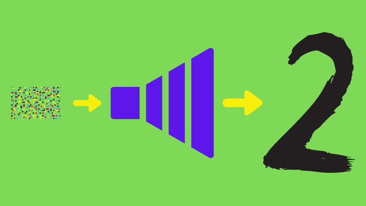
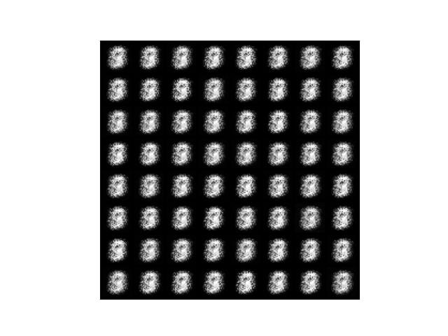
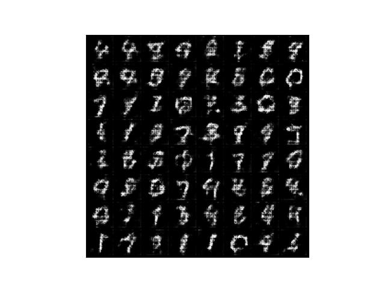
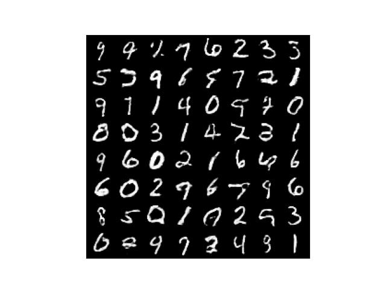
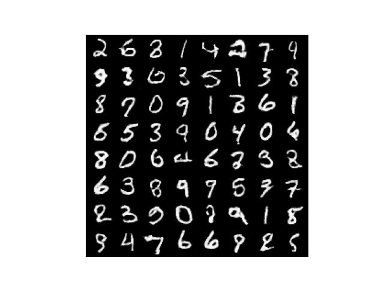
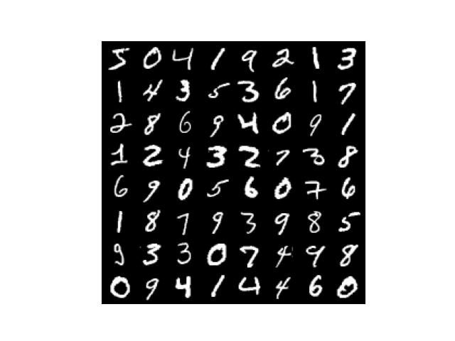

In this article, we incorporate the idea from DCGAN to improve the simple GAN model that we trained in [the previous article](/blog/2022-04-21-gangenerative-adversarial-network-simple-implementation-with-pytorch/). Just like before, we will implement DCGAN step by step.

## DCGAN - Our Reference Model

We refer to [PyTorch's DCGAN tutorial](https://pytorch.org/tutorials/beginner/dcgan_faces_tutorial.html) for DCGAN model implementation. We are especially interested in the convolutional (Conv2d) layers as we believe they will improve how the discriminator extracts features. DCGAN also uses transposed convolution (TransposeConv2d) layers to improve how the generator generates images.

](images/dcgan_generator.png)

DCGAN generates RGB-color images, and the image size (64x64) is much bigger than MNIST images. We must adjust these to generate in grayscale (1 channel) with MNIST image size (28x28).

## Generator Network with Transposed Convolutions

The generator network from <a href="gangenerative-adversarial-network-simple-implementation-with-pytorch/" rel="noreferrer noopener" target="_blank" title="the previous article">the previous article</a> was very simple.

```python
# Generator network
class Generator(nn.Sequential):
    def __init__(self, sample_size: int):
        super().__init__(
            nn.Linear(sample_size, 128),
            nn.LeakyReLU(0.01),
            nn.Linear(128, 784),
            nn.Sigmoid())

        # Random value vector size
        self.sample_size = sample_size

    def forward(self, batch_size: int):
        # Generate random values
        z = torch.randn(batch_size, self.sample_size)

        # Generator output
        output = super().forward(z)

        # Convert the output into a greyscale image (1x28x28)
        generated_images = output.reshape(batch_size, 1, 28, 28)
        return generated_images
```

In the above model, we reshape the generator output into the MNIST image shape. In the updated model (below), the DCGAN generator architecture includes transposed convolution after image reshaping since `ConvTranspose2d` deals with image data rather than flattened data.

```python
# Generator network with transposed convolutions
class Generator(nn.Module):
    def __init__(self, sample_size: int, alpha: float):
        super().__init__()

        # sample_size => 784 
        self.fc = nn.Sequential(
            nn.Linear(sample_size, 784),
            nn.BatchNorm1d(784),
            nn.LeakyReLU(alpha))

        # 784 => 16 x 7 x 7
        self.reshape = Reshape(16, 7, 7)

        # 16 x 7 x 7 => 32 x 14 x 14
        self.conv1 = nn.Sequential(
            nn.ConvTranspose2d(16, 32, 
                               kernel_size=5, stride=2, padding=2,
                               output_padding=1, bias=False),
            nn.BatchNorm2d(32),
            nn.LeakyReLU(alpha))

        # 32 x 14 x 14 => 1 x 28 x 28
        self.conv2 = nn.Sequential(
            nn.ConvTranspose2d(32, 1,
                               kernel_size=5, stride=2, padding=2,
                               output_padding=1, bias=False),
            nn.Sigmoid())
            
        # Random value vector size
        self.sample_size = sample_size

    def forward(self, batch_size: int):
        # Random value generation
        z = torch.randn(batch_size, self.sample_size)

        x = self.fc(z)      # => 784 
        x = self.reshape(x) # => 16 x 7 x 7
        x = self.conv1(x)   # => 32 x 14 x 14
        x = self.conv2(x)   # => 1 x 28 x 28
        return x
```

Like DCGAN, we are using [ConvTranspose2d](/blog/2017-11-14-up-sampling-with-transposed-convolution/) to expand image size from 7x7 to 28x28. `ConvTranspose2d` layers have learnable parameters we train through GAN training. As such, the transposed convolution layers help expand image size and generate better-quality images. We have Batch Normalization to speed up the learning process. For reshaping, we prepare the following helper class.

```python
# Reshape helper
class Reshape(nn.Module):
    def __init__(self, *shape):
        super().__init__()
        self.shape = shape

    def forward(self, x):
        return x.reshape(-1, *self.shape)
```

The data shape changes as follows, starting with the random value vector size of 100:

```
100 
=> 784
=> 16 x 7 x 7    # Reshape
=> 32 x 14 x 14  # nn.ConvTranspose2d
=> 1 x 28 x 28   # nn.ConvTranspose2d
```

With these arrangements, the updated generator generates greyscale images of 28x28 size.

## Discriminator Network with Convolutions

The discriminator network from [the previous article](/blog/2022-04-21-gangenerative-adversarial-network-simple-implementation-with-pytorch/) was very simple.

```python
# Discriminator network
class Discriminator(nn.Sequential):
    def __init__(self):
        super().__init__(
            nn.Linear(784, 128),
            nn.LeakyReLU(0.01),
            nn.Linear(128, 1))

    def forward(self, images: torch.Tensor, targets: torch.Tensor):
        prediction = super().forward(images.reshape(-1, 784))
        loss = F.binary_cross_entropy_with_logits(prediction, targets)
        return loss
```

We feed flattened image data through fully-connected linear layers to output one value per image which scores how likely input images are real (as if they come from MNIST). Finally, the discriminator network outputs loss values.

The updated discriminator network incorporates convolutional layers.

```python
# Discriminator network with convolutions
class Discriminator(nn.Module):
    def __init__(self, alpha: float):
        super().__init__()
        
        # 1 x 28 x 28 => 32 x 14 x 14
        self.conv1 = nn.Sequential(
            nn.Conv2d(1, 32,
                      kernel_size=5, stride=2, padding=2, bias=False),
            nn.LeakyReLU(alpha))

        # 32 x 14 x 14 => 16 x 7 x 7
        self.conv2 = nn.Sequential(
            nn.Conv2d(32, 16,
                      kernel_size=5, stride=2, padding=2, bias=False),
            nn.BatchNorm2d(16),
            nn.LeakyReLU(alpha))

        # 16 x 7 x 7 => 784
        self.fc = nn.Sequential(
            nn.Flatten(),
            nn.Linear(784, 784),
            nn.BatchNorm1d(784),
            nn.LeakyReLU(alpha),
            nn.Linear(784, 1))

    def forward(self, images: torch.Tensor, targets: torch.Tensor):
        x = self.conv1(images)  # => 32 x 14 x 14
        x = self.conv2(x)       # => 16 x 7 x 7
        prediction = self.fc(x) # => 1

        loss = F.binary_cross_entropy_with_logits(prediction, targets)
        return loss
```

We use `Conv2d` to shrink image size from 1x28x28 to 16x7x7, extracting features (channels). After that, we feed flattened data into fully-connected linear layers for classification, just like the previous version of the discriminator. As in the updated generator, the update discriminatory incorporates `Batch Normalization` to make the learning process more efficient.

## The Entire DCGAN Code

The DCGAN implementation is mostly the same as [the previous article](/blog/2022-04-21-gangenerative-adversarial-network-simple-implementation-with-pytorch/) except for `Generator` and `Discriminator` definitions. I also adjusted the learning rate for the generator slightly higher this time which seems to work better. 

```python
import numpy as np
import matplotlib.pyplot as plt
import torch
from torch import nn
from torch.nn import functional as F
from torch.utils.data import DataLoader
from torchvision import datasets, transforms
from torchvision.utils import make_grid
from tqdm import tqdm

# General config
batch_size = 64

# Generator config
sample_size = 100    # Random value sample size
g_alpha     = 0.01   # LeakyReLU alpha
g_lr        = 1.0e-3 # Learning rate (higher than previous version)

# Discriminator config
d_alpha = 0.01       # LeakyReLU alpha
d_lr    = 1.0e-4     # Learning rate

# DataLoader for MNIST
transform = transforms.ToTensor()
dataset = datasets.MNIST(root='./data', train=True, download=True, transform=transform)
dataloader = DataLoader(dataset, batch_size=batch_size, drop_last=True)

# Reshape helper
class Reshape(nn.Module):
    def __init__(self, *shape):
        super().__init__()
        self.shape = shape

    def forward(self, x):
        return x.reshape(-1, *self.shape)


# Generator network
class Generator(nn.Module):
    def __init__(self, sample_size: int, alpha: float):
        super().__init__()

        # sample_size => 784
        self.fc = nn.Sequential(
            nn.Linear(sample_size, 784),
            nn.BatchNorm1d(784),
            nn.LeakyReLU(alpha))

        # 784 => 16 x 7 x 7 
        self.reshape = Reshape(16, 7, 7)

        # 16 x 7 x 7 => 32 x 14 x 14
        self.conv1 = nn.Sequential(
            nn.ConvTranspose2d(16, 32,
                               kernel_size=5, stride=2, padding=2,
                               output_padding=1, bias=False),
            nn.BatchNorm2d(32),
            nn.LeakyReLU(alpha))

        # 32 x 14 x 14 => 1 x 28 x 28
        self.conv2 = nn.Sequential(
            nn.ConvTranspose2d(32, 1,
                               kernel_size=5, stride=2, padding=2,
                               output_padding=1, bias=False),
            nn.Sigmoid())
            
        # Random value sample size
        self.sample_size = sample_size

    def forward(self, batch_size: int):
        # Generate random input values
        z = torch.randn(batch_size, self.sample_size)

        # Use transposed convolutions
        x = self.fc(z)        # => 784 
        x = self.reshape(x)   # => 16 x 7 x 7
        x = self.conv1(x)     # => 32 x 14 x 14
        x = self.conv2(x)     # => 1 x 28 x 28
        return x


# Discriminator network
class Discriminator(nn.Module):
    def __init__(self, alpha: float):
        super().__init__()
        
        # 1 x 28 x 28 => 32 x 14 x 14
        self.conv1 = nn.Sequential(
            nn.Conv2d(1, 32,
                      kernel_size=5, stride=2, padding=2, bias=False),
            nn.LeakyReLU(alpha))

        # 32 x 14 x 14 => 16 x 7 x 7
        self.conv2 = nn.Sequential(
            nn.Conv2d(32, 16,
                      kernel_size=5, stride=2, padding=2, bias=False),
            nn.BatchNorm2d(16),
            nn.LeakyReLU(alpha))

        # 16 x 7 x 7 => 784
        self.fc = nn.Sequential(
            nn.Flatten(),
            nn.Linear(784, 784),
            nn.BatchNorm1d(784),
            nn.LeakyReLU(alpha),
            nn.Linear(784, 1))

    def forward(self, images: torch.Tensor, targets: torch.Tensor):
        # Extract image features using convolutions
        x = self.conv1(images)    # => 32 x 14 x 14
        x = self.conv2(x)         # => 16 x 7 x 7
        prediction = self.fc(x)   # => 1

        loss = F.binary_cross_entropy_with_logits(prediction, targets)
        return loss


# Save image grid
def save_image_grid(epoch: int, images: torch.Tensor, ncol: int):
    image_grid = make_grid(images, ncol)     # Images in a grid
    image_grid = image_grid.permute(1, 2, 0) # Move channel last
    image_grid = image_grid.cpu().numpy()    # To Numpy

    plt.imshow(image_grid)
    plt.xticks([])
    plt.yticks([])
    plt.savefig(f'generated_{epoch:03d}.jpg')
    plt.close()


# Real and fake labels
real_targets = torch.ones(batch_size, 1)
fake_targets = torch.zeros(batch_size, 1)

# Generator and discriminator networks
generator = Generator(sample_size, g_alpha)
discriminator = Discriminator(d_alpha)

# Optimizers
d_optimizer = torch.optim.Adam(discriminator.parameters(), lr=d_lr)
g_optimizer = torch.optim.Adam(generator.parameters(), lr=g_lr)

# Training loop
for epoch in range(100):

    d_losses = []
    g_losses = []

    for images, labels in tqdm(dataloader):

        #===============================
        # Discriminator training
        #===============================

        # Loss with MNIST image inputs and real_targets as labels
        discriminator.train()
        d_loss = discriminator(images, real_targets)
       
        # Generate images in eval mode
        generator.eval()
        with torch.no_grad():
            generated_images = generator(batch_size)

        # Loss with generated image inputs and fake_targets as labels
        d_loss += discriminator(generated_images, fake_targets)

        # Optimizer updates the discriminator parameters
        d_optimizer.zero_grad()
        d_loss.backward()
        d_optimizer.step()

        #===============================
        # Generator Network Training
        #===============================

        # Generate images in train mode
        generator.train()
        generated_images = generator(batch_size)

        # batchnorm is unstable in eval due to generated images
        # change drastically every epoch. We'll not use the eval here.
        # discriminator.eval() 

        # Loss with generated image inputs and real_targets as labels
        g_loss = discriminator(generated_images, real_targets)

        # Optimizer updates the generator parameters
        g_optimizer.zero_grad()
        g_loss.backward()
        g_optimizer.step()

        # Keep losses for logging
        d_losses.append(d_loss.item())
        g_losses.append(g_loss.item())
        
    # Print average losses
    print(epoch, np.mean(d_losses), np.mean(g_losses))

    # Save images
    save_image_grid(epoch, generator(batch_size), ncol=8)
```

It takes longer to train than the previous version. Incorporating GPU support would improve the speed.

### One Caveat about Discriminator's BatchNorm in Eval Mode

In the above source code, I commented out the line that enables the discriminator's `eval` mode. The batch norm's running averages are unstable because generated images change drastically in every batch. We should keep the discriminator in the `train` mode to constantly adjust the batch norm's parameters. In later epochs, we could perhaps enable the `eval` mode for the discriminator, but there is no need. We can keep everything in the `train` mode for the discriminator and generator networks, and the GAN training will work fine. [The DCGAN sample code from Pytorch](https://pytorch.org/tutorials/beginner/dcgan_faces_tutorial.html) does that, too. Also, there is an explanation of the issue by [Soumith Chintala](https://www.linkedin.com/in/soumith/) in [this link](https://discuss.pytorch.org/t/why-dont-we-put-models-in-train-or-eval-modes-in-dcgan-example/7422).

## Before and After

### Epoch 1

[The previous version](/blog/2022-04-21-gangenerative-adversarial-network-simple-implementation-with-pytorch/) generated the below images after the first epoch.



The updated version generated the below images after the first epoch.



It already looks promising.

### Epoch 50

The previous version generated the below images after the 50th epoch.


The updated version generated the below images after the 50th epoch.



They already look a lot better than the final outputs of the previous version.

### Epoch 100

The previous version generated the below images after the 100th epoch.


The updated version generated the below images after the 100th epoch.



The quality of images dramatically improved. I can not tell if the above images are actually from MNIST or generated ones.

<iframe width="560" height="315" src="https://www.youtube.com/embed/iH0KSRntVyA" title="YouTube video player" frameborder="0" allow="accelerometer; autoplay; clipboard-write; encrypted-media; gyroscope; picture-in-picture; web-share" allowfullscreen></iframe>

### Real MNIST images for comparison

 Below are real MNIST images for comparison. Do they look real or fake to you?



## References

- [Fashion GAN: Generating Colorful Fashion Images with DCGAN](/blog/2022-04-22-generating-fashion-images-with-dcgan/)
- [PyTorch - DCGAN TUTORIAL](https://pytorch.org/tutorials/beginner/dcgan\_faces\_tutorial.html) \
  Nathan Inkawhich
- [Why don’t we put models in .train() or .eval() modes in DCGAN example](https://discuss.pytorch.org/t/why-dont-we-put-models-in-train-or-eval-modes-in-dcgan-example/7422)