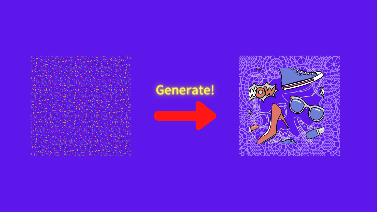
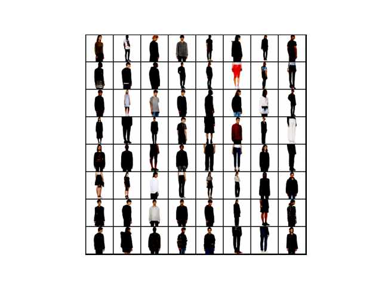
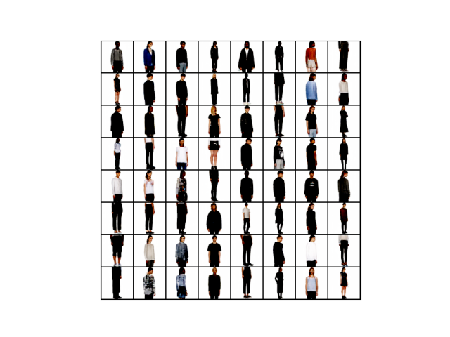

This article is a short follow-up on [DCGAN](../2022-04-22-dcgan-deep-convolutional-gan-generates-mnist-like-images-with-dramatically-better-quality/) (Deep Convolutional Generative Adversarial Network) applied for color fashion images (aka Fashion GAN). We'll download a pre-trained DCGAN model from the Torch Hub and generate fashion images. The paper [Unsupervised Representation Learning with Deep Convolutional Generative Adversarial Networks](https://arxiv.org/abs/1511.06434) introduced the model. One of the authors, [Soumith Chintala](https://soumith.ch), is the main contributor to the PyTorch open-source project.

We can feed random inputs into this DCGAN to generate realistic fashion images. Training GAN may be tricky, but it is straightforward to use it. So, let's do it!

## Python Environment Setup

First of all, we create a Python environment. We’ll use `venv` as follows:

```python
# Create a project folder and move there
mkdir dcgan
cd dcgan

# Create and activate a Python environment using venv
python3 -m venv venv
source venv/bin/activate

# We should always upgrade pip as it's usually old version
# that has older information about libraries
pip install --upgrade pip

# We install required libraries under the virtual environment
pip install torch torchvision matplotlib tqdm
```

The versions of installed libraries are as follows:

```
matplotlib==3.5.1
torch==1.11.0
torchvision==0.12.0
tqdm==4.64.0
```

If you prefer `conda`, you can create an environment with that. Please make sure to install the required libraries.

## Download the Pre-Trained Fashion GAN

We'll download the pre-trained DCGAN model from the Torch Hub.

```python
import torch

use_gpu = True if torch.cuda.is_available() else False

model = torch.hub.load('facebookresearch/pytorch_GAN_zoo:hub',
                       'DCGAN',
                       pretrained=True,
                       useGPU=use_gpu)
```

The model can make use of GPU. If your machine has a GPU, `use_gpu` would be `True`. However, it requires no GPU if you only want to generate fashion images. If you plan to do transfer learning which involves training, you may want to do so on a machine with GPU. But that is not the topic of this article.

The first time invoking the `torch.hub.load` method, it takes a while to download the pre-trained model, and it stores the model under `~/.cache/torch/hub`. After that, it will always load the model from the local cache, and it's fast. If you can not resolve some problems, removing the downloaded model from the cache may be worthwhile. I do not expect anything to happen when we generate images using the downloaded model.

## Generate Fashion Images

As with any GAN model, we need to feed randomly generated inputs. The model provides a convenient noise data-generating method (`buildNoiseData`). The method is part of [BaseGAN](https://github.com/facebookresearch/pytorch_GAN_zoo/blob/b75dee40918caabb4fe7ec561522717bf096a8cb/models/base_GAN.py#L17) class that [DCGAN](https://github.com/facebookresearch/pytorch_GAN_zoo/blob/main/models/DCGAN.py) inherits. The PyTorch GAN Zoo GitHub repository has other GAN models inherited from the BaseGAN class.

Here, we are creating 64 input noise data.

```python
noise, _ = model.buildNoiseData(num_images)

print(noise.shape)
```

The last print statement prints the shape of the noise data (`torch.Size([64, 120])`, meaning there are 64 inputs, each having 120 random values.

Let's generate fashion images.

```python
with torch.no_grad():
    generated_images = model.test(noise)
```

We use `make_grid` from `torchvision.utils` to show images in a grid layout.

```python
import matplotlib.pyplot as plt
from torchvision.utils import make_grid

image_grid = make_grid(generate_images, ncol=8) # Make images into a grid
image_grid = image_grid.permute(1, 2, 0)        # Move channel to the last
image_grid = image_grid.cpu().numpy()           # Convert into Numpy

plt.imshow(image_grid)
plt.xticks([])
plt.yticks([])
plt.show()
```

Below is the result. We fed 64 noise data into the model to generate 64 random fashion images.



Below is the output of another run.



As you can see, different random inputs generate different fashion images.

## Source Code

```python
import torch
from torchvision.utils import make_grid
import matplotlib.pyplot as plt

# Download the model
use_gpu = True if torch.cuda.is_available() else False

model = torch.hub.load('facebookresearch/pytorch_GAN_zoo:hub', 'DCGAN', pretrained=True, useGPU=use_gpu)
 
# Generate random inputs
num_images = 64
noise, _ = model.buildNoiseData(num_images)

print('noise shape', noise.shape)
print('noise data', noise[0])

# Generate fashion images
with torch.no_grad():
    generated_images = model.test(noise)

# Display images
plt.imshow(make_grid(generated_images).permute(1, 2, 0).cpu().numpy())
plt.xticks([])
plt.yticks([])
plt.show()
```

That's it!

## References

- [Unsupervised Representation Learning with Deep Convolutional Generative Adversarial Networks](https://arxiv.org/abs/1511.06434) \
  Alec Radford, Luke Metz, Soumith Chintala
- [DCGAN on FashionGen, PyTorch](https://pytorch.org/hub/facebookresearch_pytorch-gan-zoo_dcgan/)
