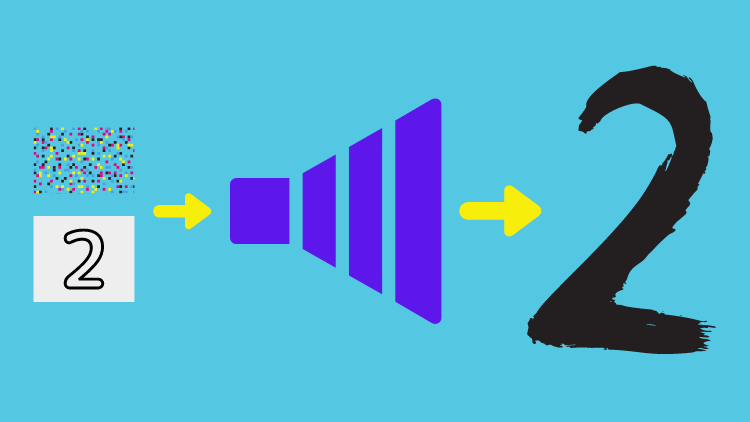
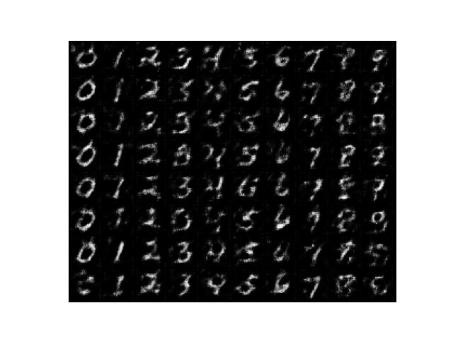
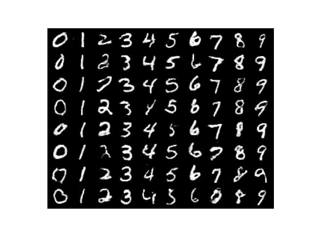
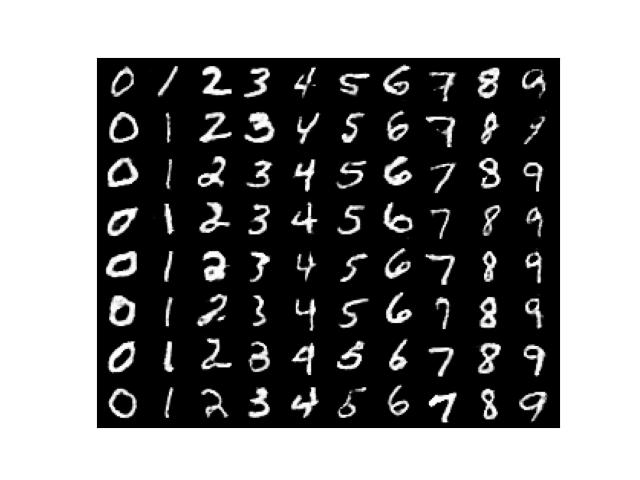

[GAN](/blog/2022-04-21-gangenerative-adversarial-network-simple-implementation-with-pytorch/) and [DCGAN](/blog/2022-04-22-dcgan-deep-convolutional-gan-generates-mnist-like-images-with-dramatically-better-quality/) generate random images. As such, we have almost no control over what images to generate. However, CGAN can let us specify a condition so that we can tell it what images to generate. The trick is to convert label values into feature vectors using a learnable layer so the generator can learn what image to generate. The discriminator also takes advantage of label conditions. It may not be clear to you at this stage but don't worry. This article will teach how the whole thing works in a simple code.

## Python Environment Setup

First of all, we create a Python environment. We’ll use `venv` as follows:

```bash
# Create a project folder and move there
mkdir cgan
cd cgan

# Create and activate a Python environment using venv
python3 -m venv venv
source venv/bin/activate

# We should always upgrade pip as it's usually old version
# that has older information about libraries
pip install --upgrade pip

# We install required libraries under the virtual environment
pip install torch torchvision matplotlib tqdm
```

The versions of installed libraries are as follows:

```
matplotlib==3.5.1
torch==1.11.0
torchvision==0.12.0
tqdm==4.64.0
```

If you prefer `conda`, you can create an environment with that. Please make sure to install the required libraries.

## Conditions as Feature Vectors

### Labels to One-hot Encoded Labels

We'll be using MNIST dataset that contains many digit images. Labels are integers between 0 and 9 inclusive. By converting labels into feature vectors, we can feed target labels (as conditions) into the generator and random value vectors so that the generated images have some variations.

First, we use PyTorch's `F.one_hot` to convert digits into one-hot encodings.

```python
import torch
from torch.nn import functional as F

# Labels (i.e., 1 and 3)
labels = torch.LongTensor([1, 3])

# Create one-hot encoded labels
encoded = F.one_hot(labels, num_classes=10)

print(encoded)
```

The output is:

```
tensor([[0, 1, 0, 0, 0, 0, 0, 0, 0, 0], [0, 0, 0, 1, 0, 0, 0, 0, 0, 0]])
```

So, we have one-hot encoded 1 and 3 into vectors with ten elements. We specified `num_classes=10` since the labels are from 0 to 9 (10 numbers), and we need ten elements to uniquely identify each number in one-hot encoding. We use one-hot encoding because the value of a digit has no meaning like rank or order. It is a class (categorical) value, and using one-hot encoding to represent categorical values is a well-established practice in machine learning.

### One-hot Encoded Labels to Feature Vectors

The generator will learn to extract features (conditions) from the one-hot encoded labels. We'll create a class to convert one-hot encoded labels into feature vectors via a fully-connected layer. Both the generator and the discriminator will use the class.

```python
# Coverts conditions into feature vectors
class Condition(nn.Module):
    def __init__(self, alpha: float):
        super().__init__()

        # From one-hot encoding to features: 10 => 784
        self.fc = nn.Sequential(
            nn.Linear(10, 784),
            nn.BatchNorm1d(784),
            nn.LeakyReLU(alpha))

    def forward(self, labels: torch.Tensor):
        # One-hot encode labels
        x = F.one_hot(labels, num_classes=10)

        # From Long to Float
        x = x.float()

        # To feature vectors
        return self.fc(x)
```

### Reshape Helper

We define a helper class for reshaping encoded condition values in the generator and discriminator.

```python
# Reshape helper
class Reshape(nn.Module):
    def __init__(self, *shape):
        super().__init__()

        self.shape = shape

    def forward(self, x):
        return x.reshape(-1, *self.shape)
```

## Generator Network Definition

The generator is similar to the DCGAN generator we used in [this article](/blog/2022-04-22-dcgan-deep-convolutional-gan-generates-mnist-like-images-with-dramatically-better-quality/). As before, we generate random value vectors and use a fully-connected layer to increase the dimensions to 784. We also use the Conditional layer to convert input labels into feature vectors of 784 dimensions. Then, we sum random vectors and label features. It is an element-wise addition operation. We can do that because the random value and label feature vectors have the same number of elements.

The generator network processes the sum of random value vectors and label feature vectors to generate random images for specified label classes. Let's see how we integrate the `Condition` class into the DCGAN generator class.

```python
# Generator network
class Generator(nn.Module):
    def __init__(self, sample_size: int, alpha: float):
        super().__init__()

        # sample_size => 784
        self.fc = nn.Sequential(
            nn.Linear(sample_size, 784),
            nn.BatchNorm1d(784),
            nn.LeakyReLU(alpha))

        # 784 => 16 x 7 x 7
        self.reshape = Reshape(16, 7, 7)

        # 16 x 7 x 7 => 32 x 14 x 14
        self.conv1 = nn.Sequential(
            nn.ConvTranspose2d(16, 32,
                               kernel_size=5, stride=2, padding=2,
                               output_padding=1, bias=False),
            nn.BatchNorm2d(32),
            nn.LeakyReLU(alpha))

        # 32 x 14 x 14 => 1 x 28 x 28
        self.conv2 = nn.Sequential(
            nn.ConvTranspose2d(32, 1,
                               kernel_size=5, stride=2, padding=2,
                               output_padding=1, bias=False),
            nn.Sigmoid())

        # Random value sample size
        self.sample_size = sample_size

        # To convert labels into feature vectors
        self.cond = Condition(alpha)

    def forward(self, labels: torch.Tensor):
        # Labels as feature vectors
        c = self.cond(labels)

        # Batch size is the number of labels
        batch_size = len(labels)

        # Generate random inputs
        z = torch.randn(batch_size, self.sample_size)

        # Inputs are the sum of random inputs and label features
        x = self.fc(z)        # => 784
        x = self.reshape(x+c) # => 16 x 7 x 7
        x = self.conv1(x)     # => 32 x 14 x 14
        x = self.conv2(x)     # => 1 x 28 x 28
        return x
```

As you can see, the code converts labels into feature vectors of the same dimension as the random value vectors and performs an element-wise addition operation `(x+c)`. In other words, random value and label feature vectors express information required to generate images in the same space.

Let's see the part of the code in detail.

```python
# Label feature vectors (784)
c = self.cond(labels)

# Random value vectors (784)
z = torch.randn(batch_size, self.sample_size)
x = self.fc(z)

# Element-wise addition and reshape from 784 into 16x7x7
x = self.reshape(x+c)
```

If we don't have random value vectors and use only the label feature vectors to train the generator, it would learn to generate one image per label input. Having random value vectors is crucial to adding variations to generated images.

In the above code, we use the element-wise addition operation, but that's not the only way to combine random value vectors and label feature vectors. We could concatenate two vectors into one. In this case, we don't need to make both vectors have the same number of elements. Alternatively, we could concatenate one-hot encoded labels and random value vectors and feed them through a fully-connected layer to generate input features. We would need to adjust the number of parameters in the fully-connected layer to accommodate different input vector sizes.

In this article, we use the element-wise addition operation since it's simple to implement, but you may want to try other methods to see how it works.

## Discriminator Network Definition

We use the `Condition` class inside the discriminator network to predict whether input images are real or fake as per the given condition. For example, when a condition indicates an image is for digit 3, the discriminator classifies whether the image is a real image of digit "3" or not. Like the generator, the discriminator has its condition layer that learns to generate features for each label through training.

```python
# Discriminator network
class Discriminator(nn.Module):
    def __init__(self, alpha: float):
        super().__init__()
        
        # 1 x 28 x 28 => 32 x 14 x 14
        self.conv1 = nn.Sequential(
            nn.Conv2d(1, 32,
                      kernel_size=5, stride=2, padding=2, bias=False),
            nn.LeakyReLU(alpha))

        # 32 x 14 x 14 => 16 x 7 x 7
        self.conv2 = nn.Sequential(
            nn.Conv2d(32, 16, 
                      kernel_size=5, stride=2, padding=2, bias=False),
            nn.BatchNorm2d(16),
            nn.LeakyReLU(alpha))

        # 16 x 7 x 7 => 784
        self.fc = nn.Sequential(
            nn.Flatten(),
            nn.Linear(784, 784),
            nn.BatchNorm1d(784),
            nn.LeakyReLU(alpha),
            nn.Linear(784, 1))

        # Reshape label features: 784 => 16 x 7 x 7 
        self.cond = nn.Sequential(
            Condition(alpha),
            Reshape(16, 7, 7))

    def forward(self, images: torch.Tensor,
                      labels: torch.Tensor,
                      targets: torch.Tensor):
        # Label features
        c = self.cond(labels)

        # Image features + Label features => real or fake?
        x = self.conv1(images)    # => 32 x 14 x 14
        x = self.conv2(x)         # => 16 x 7 x 7
        prediction = self.fc(x+c) # => 1

        loss = F.binary_cross_entropy_with_logits(prediction, targets)
        return loss
```

## CGAN Training

While training, we feed labels to both the discriminator and the generator. Each network generates its features for given labels useful for their objectives. The CGAN training loop trains the discriminator and the generator in turns.

### Discriminator Training

It is the same as DCGAN discriminator training, except we are feeding labels.

```python
# Train loop
for epoch in range(100):

    d_losses = []
    g_losses = []

    for images, labels in tqdm(dataloader):

        #===============================
        # Disciminator Network Training
        #===============================

        # Images from MNIST are considered as real
        d_loss = discriminator(images, labels, real_targets)

        # Images from Generator are considered as fake
        d_loss += discriminator(generator(labels), labels, fake_targets)

        # Discriminator paramter update
        d_optimizer.zero_grad()
        d_loss.backward()
        d_optimizer.step()

        ...
```

### Generator Training

It is the same as DCGAN generator training except that we feed labels.

```python
# Training Loop
for epoch in range(100):

    for images, labels in tqdm(dataloader):

        ...

        #===============================
        # Generator Network Training
        #===============================

        # Images from Generator should be as real as ones from MNIST
        g_loss = discriminator(generator(labels), labels, true_targets)

        ...
```

The entire source code is available at the end of this article. For now, let's look at the results of the training.

## Training Results

### Test Image Generation

After each epoch, we generate eight images for each digit from 0 to 9 using the following code.

```python
# 0 to 9 in a list
labels = list(range(10))

# Convert to long tensor
labels = torch.LongTensor(labels)

# Repeat each digit eight times
labels = labels.repeat(8)

# Flatten (10x8 => 80)
labels = labels.flatten()

# Generate 80 images
generated_images = generator(labels)

# Save the results in a grid layout
save_image_grid(epoch, generated_images, ncol=10)
```

### Epoch 1

After the first epoch, the generated images look like digits per the conditions. It seems to me that adding conditions made it easier for the networks to learn.



### Epoch 50

I'd say the outputs look already satisfactory.



### Epoch 100

Not so different compared with Epoch 50. It may be slightly better looking. Hard to say. In any case, the training succeeded because the generator can produce various images per given conditions.



CGAN would be usefful in generating synthetic training data targeting particular images.

<iframe width="560" height="315" src="https://www.youtube.com/embed/iH0KSRntVyA" title="YouTube video player" frameborder="0" allow="accelerometer; autoplay; clipboard-write; encrypted-media; gyroscope; picture-in-picture; web-share" allowfullscreen></iframe>

## Why CGAN Works

So, CGAN is the same as DCGAN, with label features added to the input vectors. That is all, yet it generates as per given label conditions. Why should that work so well?

The generator and the discriminator do not share their `Condition` layers, so each network learns independently and adversarially. The generator tries to generate as real images as possible so that the loss calculated by the discriminator becomes smaller. In this process, the `Condition` layer must learn to distinguish different label features as much as possible because knowing what to generate to achieve lower loss depends on predicting what digit it should generate. The discriminator's `Condition` layer also learns to distinguish between different digits, making the binary classification (real or fake) decision easier. So, it is crucial to differentiate label inputs for the generator and discriminator.

For example, when the label is digit 1, the generator must generate an image of 1 as real as possible (as MNIST image-like as possible), and the discriminator needs to give a significant loss to the generator if the generated image does not look like digit "1" at all. From the generator's point of view, the discriminator is a loss function that also learns from the inputs.

So, as long as we train both the generator and the discriminator for all 0 to 9 digits equally well, the generator can understand conditions to generate realistic (MNIST-like) images for given labels.

## Source Code

The source code is pretty much the same as [DCGAN](https://kikaben.netlify.app/dcgan-deep-convolutional-gan-generates-mnist-like-images-with-dramatically-better-quality/#the-entire-dcgan-code) except that we now have the condition handling code.

```python
import numpy as np
import matplotlib.pyplot as plt
import torch
from torch import nn
from torch.nn import functional as F
from torch.utils.data import DataLoader
from torchvision import datasets, transforms
from torchvision.utils import make_grid
from tqdm import tqdm

# Common config
batch_size  = 64

# Generator config
sample_size = 100    # Random sample size
g_alpha     = 0.01   # LeakyReLU alpha
g_lr        = 1.0e-4 # Learning rate

# Discriminator config
d_alpha     = 0.01   # LeakyReLU alpha
d_lr        = 1.0e-4 # Learning rate

# Data Loader for MNIST
transform = transforms.ToTensor()
dataset = datasets.MNIST(root='./data', train=True, download=True, transform=transform)
dataloader = DataLoader(dataset, batch_size=batch_size, drop_last=True)

# Coverts conditions into feature vectors
class Condition(nn.Module):
    def __init__(self, alpha: float):
        super().__init__()

        # From one-hot encoding to features: 10 => 784
        self.fc = nn.Sequential(
            nn.Linear(10, 784),
            nn.BatchNorm1d(784),
            nn.LeakyReLU(alpha))
        
    def forward(self, labels: torch.Tensor):
        # One-hot encode labels
        x = F.one_hot(labels, num_classes=10)

        # From Long to Float
        x = x.float()

        # To feature vectors
        return self.fc(x)

# Reshape helper
class Reshape(nn.Module):
    def __init__(self, *shape):
        super().__init__()

        self.shape = shape

    def forward(self, x):
        return x.reshape(-1, *self.shape)

# Generator network
class Generator(nn.Module):
    def __init__(self, sample_size: int, alpha: float):
        super().__init__()

        # sample_size => 784
        self.fc = nn.Sequential(
            nn.Linear(sample_size, 784),
            nn.BatchNorm1d(784),
            nn.LeakyReLU(alpha))

        # 784 => 16 x 7 x 7 
        self.reshape = Reshape(16, 7, 7)

        # 16 x 7 x 7 => 32 x 14 x 14
        self.conv1 = nn.Sequential(
            nn.ConvTranspose2d(16, 32,
                               kernel_size=5, stride=2, padding=2,
                               output_padding=1, bias=False),
            nn.BatchNorm2d(32),
            nn.LeakyReLU(alpha))

        # 32 x 14 x 14 => 1 x 28 x 28
        self.conv2 = nn.Sequential(
            nn.ConvTranspose2d(32, 1,
                               kernel_size=5, stride=2, padding=2,
                               output_padding=1, bias=False),
            nn.Sigmoid())
            
        # Random value sample size
        self.sample_size = sample_size

        # To convert labels into feature vectors
        self.cond = Condition(alpha)

    def forward(self, labels: torch.Tensor):
        # Labels as feature vectors
        c = self.cond(labels)

        # Batch size is the number of labels
        batch_size = len(labels)

        # Generate random inputs
        z = torch.randn(batch_size, self.sample_size)

        # Inputs are the sum of random inputs and label features
        x = self.fc(z)        # => 784
        x = self.reshape(x+c) # => 16 x 7 x 7
        x = self.conv1(x)     # => 32 x 14 x 14
        x = self.conv2(x)     # => 1 x 28 x 28
        return x

# Discriminator network
class Discriminator(nn.Module):
    def __init__(self, alpha: float):
        super().__init__()
        
        # 1 x 28 x 28 => 32 x 14 x 14
        self.conv1 = nn.Sequential(
            nn.Conv2d(1, 32,
                      kernel_size=5, stride=2, padding=2, bias=False),
            nn.LeakyReLU(alpha))

        # 32 x 14 x 14 => 16 x 7 x 7
        self.conv2 = nn.Sequential(
            nn.Conv2d(32, 16, 
                      kernel_size=5, stride=2, padding=2, bias=False),
            nn.BatchNorm2d(16),
            nn.LeakyReLU(alpha))

        # 16 x 7 x 7 => 784
        self.fc = nn.Sequential(
            nn.Flatten(),
            nn.Linear(784, 784),
            nn.BatchNorm1d(784),
            nn.LeakyReLU(alpha),
            nn.Linear(784, 1))

        # Reshape label features: 784 => 16 x 7 x 7 
        self.cond = nn.Sequential(
            Condition(alpha),
            Reshape(16, 7, 7))

    def forward(self, images: torch.Tensor,
                      labels: torch.Tensor,
                      targets: torch.Tensor):
        # Label features
        c = self.cond(labels)

        # Image features + Label features => real or fake?
        x = self.conv1(images)    # => 32 x 14 x 14
        x = self.conv2(x)         # => 16 x 7 x 7
        prediction = self.fc(x+c) # => 1

        loss = F.binary_cross_entropy_with_logits(prediction, targets)
        return loss

# To save grid images
def save_image_grid(epoch: int, images: torch.Tensor, ncol: int):
    image_grid = make_grid(images, ncol)     # Into a grid
    image_grid = image_grid.permute(1, 2, 0) # Channel to last
    image_grid = image_grid.cpu().numpy()    # Into Numpy

    plt.imshow(image_grid)
    plt.xticks([])
    plt.yticks([])
    plt.savefig(f'generated_{epoch:03d}.jpg')
    plt.close()

# Real / Fake targets
real_targets = torch.ones(batch_size, 1)
fake_targets = torch.zeros(batch_size, 1)

# Generator and discriminator
generator = Generator(sample_size, g_alpha)
discriminator = Discriminator(d_alpha)

# Optimizers
d_optimizer = torch.optim.Adam(discriminator.parameters(), lr=d_lr)
g_optimizer = torch.optim.Adam(generator.parameters(), lr=g_lr)

# Train loop
for epoch in range(100):

    d_losses = []
    g_losses = []

    for images, labels in tqdm(dataloader):

        #===============================
        # Disciminator Network Training
        #===============================

        # Images from MNIST are considered as real
        d_loss = discriminator(images, labels, real_targets)
       
        # Images from Generator are considered as fake
        d_loss += discriminator(generator(labels), labels, fake_targets)

        # Discriminator paramter update
        d_optimizer.zero_grad()
        d_loss.backward()
        d_optimizer.step()

        #===============================
        # Generator Network Training
        #===============================

        # Images from Generator should be as real as ones from MNIST
        g_loss = discriminator(generator(labels), labels, real_targets)

        # Generator parameter update
        g_optimizer.zero_grad()
        g_loss.backward()
        g_optimizer.step()

        # Keep losses for logging
        d_losses.append(d_loss.item())
        g_losses.append(g_loss.item())
        
    # Print loss
    print(epoch, np.mean(d_losses), np.mean(g_losses))

    # Save generated images
    labels = torch.LongTensor(list(range(10))).repeat(8).flatten()
    save_image_grid(epoch, generator(labels), ncol=10)
```

## References

- [Conditional Generative Adversarial Nets](https://arxiv.org/pdf/1411.1784.pdf) \
  Mehdi Mirza、Simon Osindero
