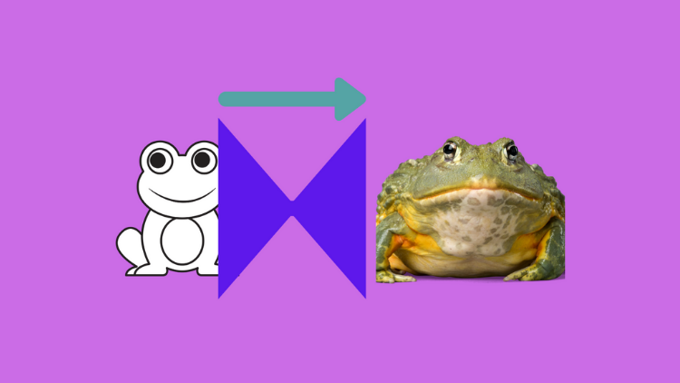

This article explains the mechanism of the pix2pix model, which __translates__ an image to another one with a different look and feel. They use the word "translate" because of what it does, which is hard to explain in words, so I'd like you to watch the following video to see how the model translates images.

<iframe src="https://player.vimeo.com/video/260612034?h=1cf903469e" width="640" height="360" frameborder="0" allow="autoplay; fullscreen; picture-in-picture" allowfullscreen></iframe>

[Memo Akten](https://vimeo.com/memoakten) is the artist who produced the video using pix2pix.

Below is another example of a pix2pix application by [Christopher Hesse](https://github.com/christopherhesse) (Open AI), which attracted people's attention due to the __rough technique__ of translating a sketch into an image with a cat.

](images/image-to-image-demo.png){width="75%"}

The above community-driven applications are eye-catching, but it may not be easy to see what's going on behind the scene. Let's examine what the image-to-image translation does and dive into how it works.

## Image-to-image Translation

In [CVPR2017](https://cvpr2017.thecvf.com), Phillip Isola et al. (University of California, Berkeley) published the paper "[Image-to-Image Translation with Conditional Adversarial Networks](https://arxiv.org/abs/1611.07004)". The word "translation" is in the title. So, the choice of the word is intentional. The model converts one image to another while keeping visual features (especially the shapes) intact. As such, an image-to-image translation changes the feel and look of an input image without altering the structural composition, as shown in the below pairs of input and output images from the paper.

](images/figure-1.png)

For each pair of images, the left is an input image, and the right is a translated image. The input and the output have the same content, but the expressions are different, like a language translation that conveys the same content (meaning) but in different languages.

So, we can imagine an image-to-image translation model is a generative model with a condition to keep the shapes in the input image.

## Conditional Adversarial Networks

The latter half of the paper title is **with Conditional Adversarial Networks**, which indicates the use of a [CGAN (Conditional GAN)](/blog/2022-04-28-conditional-gan/). CGAN is an extension of [GAN](/blog/2022-04-21-gangenerative-adversarial-network-simple-implementation-with-pytorch/) that generates images satisfying conditions given to the generator network. 

In pix2pix, an input image is also a condition. 

As shown below, the generator takes an input image (a sketch of a shoe) as a condition to produce a generated realistic shoe image, and the discriminator also takes the same input image as the condition.

](images/figure-2.png){width="75%"}

|Symbol|Description            |
|:-:   |---                    |
|x     |Input (condition) image|
|G     |Generator network      |
|G(x)  |Generated image        |
|y     |Label (target) image   |
|D     |Discriminator network  |

We train the discriminator by feeding the same condition image x to classify the corresponding target image `y` as real and generated images `G(x)` as `fake`.

We train the generator network `G` by feeding a condition image `x` to produce a generated image `G(x)` while expecting the discriminator to classify it as 'real'. 

In turn, we train the discriminator and the generator so that both will be good at what they are doing. In short, pix2pix is a conditional GAN where input images are the conditions.

However, pix2pix is different from GAN and CGAN in the following:

- Inputs are not random noise, unlike the original GAN or CGAN.
- We need pairs of a condition (input) image and the target (label) image for training. 
- Condition images represent the contents (shapes) of the target (label) images.

So, the generator network needs more than just a simple convolutional network because it needs to maintain the pixel-level details from input images into output images.

## Generator Network

### U-Net

The generator uses the [U-Net](https://arxiv.org/abs/1505.04597) architecture. U-Net is a segmentation model for medical images that uses pixel-level details of an input image to produce an output image.

](images/U-net-figure-1.png){width="80%"}

U-Net is an encoder-decoder model with skip connections between encoders and decoders. The skip connections make features available from each encoder layer to the corresponding decoder layer.

](images/figure-3.png){width="80%"}

So, the generator is a segmentation model, keeping shapes (pixel-level details) from an input to the output. However, U-Net would generate the same output image for the same input image every time because our inputs have no stochasticity. It is a problem because both the generator and the discriminator would see only those images available in the training dataset to learn the distribution of images. The distribution wouldn't be smooth and become like a delta function with zeros everywhere except for images from the training dataset. What can we do here?

Can we add random noise like the original GAN, which has no issue learning the mapping from unlimited noise variations to realistic images?

The paper says this didn't work well because the generator learned to ignore noises. It is probably because the pix2pix model must maintain a strong connection between input (condition) images and the target images.

Then, how can we make the model robust against unseen input image variations?

### Dropout

Phillip Isola et al. decided to use dropouts in several generator layers. It should avoid over-fitting the training dataset by randomly ignoring a certain percentage of network nodes during training, making the network use a different set of nodes every time. For this reason, it has an effect similar to ensemble learning, including multiple networks, making the model robust to input variations. They also kept the dropout during test time, expecting increased output variations. However, this didn't work as much as they had hoped for.

<blockquote>
Despite the dropout noise, we observe only minor stochasticity in the output of our nets. Designing conditional GANs that produce highly stochastic output, and thereby capture the full entropy of the conditional distributions they model, is an important question left open by the present work.
<cite>Source: [pix2pix](https://arxiv.org/abs/1611.07004)</cite>
</blockquote>

That, again, is probably due to the strong connection required between the input and target images. Dropouts should still be valid to make the model robust against input image variations. As a result, the generator is a U-Net with dropouts. However, as it is, the generator network won't be able to generate images with similar shapes to the target images. We need to devise a loss function for that purpose.

### L1 distance

<blockquote>
To be real or not - that is not the only question.
<cite>Source: me</cite>
</blockquote>

The original GAN uses binary cross-entropy as a loss function to train the discriminator to distinguish real and fake images. We use the discriminator (with the same loss function) to train the generator to produce real (in terms of the target domain) images. However, we need more than just classifying real or not because the generator may produce a realistic image with completely different shapes than the input (condition) image.

As such, we need an extra loss to tell how close a generated image is to the target (label) image. For that purpose, the pix2pix training uses the L1 distance between a generated image and the target image.

L1 distance is the mean absolute pixel value differences between two images. If two images are the same, the L1 distance is zero. The total loss for the generator is as follows:

$$
\text{Loss} = \text{Binary-Cross-Entropy} + \lambda \, \text{L1}
$$

$\lambda$ is a hyperparameter to adjust the balance between the binary cross-entropy and the L1 distance.

- $\lambda = 0$ means the loss is simply the binary cross-entropy.
- $\lambda > 0$ means the loss includes L1 distance. If it's too big, the binary cross-entropy loss has less effect.
- $\lambda < 0$ should not be used.

The paper mentions the L2 distance (the root mean squared pixel value differences between two images) makes the generated images blurry. So, they use the L1 distance, which is better. However, there was still a problem. The L1 distance, as an average of all absolute pixel value differences, can still miss local details because the metric applies globally. As such, the generated images did not look real from the target domain point of view.

## Discriminator Network

### PatchGAN

The paper introduced a discriminator network called PatchGAN, a convolutional neural network for binary classification. The below quote from Phillip Isola in a GitHub issue confirms it:

<blockquote>
In fact, a “PatchGAN” is just a convnet! Or you could say all convnets are patchnets: the power of convnets is that they process each image patch identically and independently, which makes things very cheap (# params, time, memory), and, amazingly, turns out to work.

The difference between a PatchGAN and regular GAN discriminator is that rather the regular GAN maps from a 256×256 image to a single scalar output, which signifies “real” or “fake”, whereas the PatchGAN maps from 256×256 to an NxN array of outputs X, where each X_ij signifies whether the patch ij in the image is real or fake. Which is patch ij in the input? Well, output X_ij is just a neuron in a convnet, and we can trace back its receptive field to see which input pixels it is sensitive to. In the CycleGAN architecture, the receptive fields of the discriminator turn out to be 70×70 patches in the input image!

This is all mathematically equivalent to if we had manually chopped up the image into 70×70 overlapping patches, run a regular discriminator over each patch, and averaged the results.

Maybe it would have been better if we called it a “Fully Convolutional GAN” like in FCNs… it’s the same idea :)
<cite>[https://github.com/junyanz/pytorch-CycleGAN-and-pix2pix/issues/39](https://github.com/junyanz/pytorch-CycleGAN-and-pix2pix/issues/39)</cite>
</blockquote>

So, this is nothing new. We've discussed a discriminator with convolutional layers in the [DCGAN](/blog/2022-04-22-dcgan-deep-convolutional-gan-generates-mnist-like-images-with-dramatically-better-quality/) and [CGAN](/blog/2022-04-28-conditional-gan/) articles. Convolutional layers work a lot better than the **fully-connected-layer-only** version to extract features from images.

In the pix2pix paper, the author reasons that the discriminator only needs to penalize structure at the scale of patches (an area covered by a convolution kernel) by classifying each patch as real or fake and averaging all responses to provide the ultimate discriminator output since the L1 distance ensures the overall structural correctness. When the convolution kernel is 1x1, they call it the discriminator PixelGAN, and when the patch size is the same as the image size, they call it ImageGAN. In any case, they are convolutional neural networks and nothing more than that.

The below shows example outputs.

](images/figure-6.png)

In the description of the above figure, the paper mentions the following:

<table class="table">
    <thead>
        <tr class="header">
            <th style="text-align: center;">Discriminator (Patch Size)</th>
            <th>Description</th>
        </tr>
    </thead>
    <tbody style="vertical-align: middle;">
        <tr>
            <td style="text-align: center;">L1 Loss Only (None)</td>
            <td>Uncertain regions become blurry and desaturated</td>
        <tr>
            <td style="text-align: center;">PixelGAN (1 x 1)</td>
            <td>Greater color diversity but has no effect on spatial statistics</td>
        </tr>
        <tr>
            <td style="text-align: center;">PatchGAN (16 x 16)</td>
            <td>Locally sharp results, but also leads to tiling artifacts beyond the scale</td>
        </tr>
        <tr>
            <td style="text-align: center;">PatchGAN (70 x 70)</td>
            <td>Sharp, even if incorrect, in both the spatial and spectral dimensions</td>
        </tr>
        <tr>
            <td style="text-align: center;">ImageGAN (286 x 286)</td>
            <td>Visually similar to the 70x70 PatchGAN, but somewhat lower quality in FCN score</td>
        </tr>
    </tbody>
</table>

Note: the idea of FCN score is that applying the same segmentation model (FCN-8) to a generated image and the target image should produce a similar result when they are look-a-like. They used this method because it is often difficult for the human eye to evaluate generated images quantitatively.

So, the patch size is a hyperparameter that we must tune for the discriminator. Their experiment shows PatchGAN (70x70) works the best.

## One Problem with Pix2Pix

The paper has an example that translates [Cityscapes](https://www.cityscapes-dataset.com) segmentation label images back to photo-realistic images.

](images/figure-13.png)

This example makes use of the cityscape's dataset. However, if we don't have such a dataset, we must collect and make pairs of condition and target images, which takes a lot of time and effort. It is a critical problem with pix2pix. The researchers of pix2pix later published [CycleGAN](https://junyanz.github.io/CycleGAN/), which eliminated the need for such one-to-one pairs of images and ultimately solved the problem.

Lastly, I'd like to mention that even though the output images looked rough at the time of the paper, it was already quite promising and paved the way for the future (now) when we generate a super-photo-realistic synthetic dataset and use it for training AI models.

## References

- [CGAN (Conditional GAN): Specify What Images To Generate With 1 Simple Yet Powerful Change](/blog/2022-04-28-conditional-gan/)
- [CycleGAN: Turn a Horse into a Zebra and vice versa with the Magic of Self-Supervised Learning](/blog/2022-05-04-cyclegan-cycle-consistent-gan/)
- [Image-to-Image Translation with Conditional Adversarial Networks](https://arxiv.org/abs/1611.07004) \
  Phillip Isola, Jun-Yan Zhu, Tinghui Zhou, Alexei A. Efros
- [CycleGAN and pix2pix in PyTorch](https://github.com/junyanz/pytorch-CycleGAN-and-pix2pix) \
  Jun-Yan Zhu, Taesung Park, Tongzhou Wang
- [Image-to-Image Translation with Conditional Adversarial Networks](https://paperswithcode.com/paper/image-to-image-translation-with-conditional) \
  Paper With Code
- [NVIDIA Omniverse Replicator for DRIVE Sim Accelerates AV Development, Improves Perception Results](https://blogs.nvidia.com/blog/2021/11/09/drive-sim-replicator-synthetic-data-generation/)
