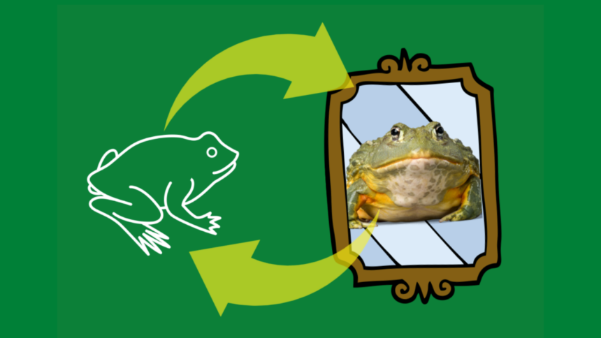
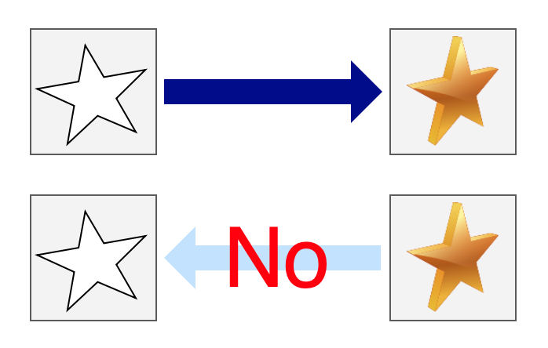

This article explains how CycleGAN (aka Cycle-consistent GAN) works, which is well-known for the demo that translates horse into zebra and vice versa.

<iframe width="560" height="315" src="https://www.youtube.com/embed/9reHvktowLY?controls=0" title="YouTube video player" frameborder="0" allow="accelerometer; autoplay; clipboard-write; encrypted-media; gyroscope; picture-in-picture; web-share" allowfullscreen></iframe>

The previous article discussed [pix2pix](/blog/2022/2022-05-01-pix2pix-cgan/), which does similar image translations. The same people that worked on pix2pix developed CycleGAN to overcome problems in pix2pix. So, let's first see what kind of problems exist in pix2pix, which is valuable knowledge for us to understand CycleGAN better.

## The Inconvenient Truth about Pix2Pix

### It Needs Pairs of Images for Training

In pix2pix, it is possible to convert the contents of an image into a different style, called **image-to-image translation**. For example, you can generate a photo-like image from a sketch image. However, since pix2pix uses supervised learning, we must have a lot of pairs of images for training.

](images/figure-2-left.png){width="25%"}

In the above example paired image sets, $x_1$ is paired with $y_1$, $x_2$ is paired with $y_2$, and so on. An input (condition) image $x_i$ must have a corresponding target (label) image $y_i$. We need many paired images to train a model that can robustly handle unseen input images. However, there aren't many image-to-image translation datasets since preparing them requires much time and effort. Although it is a common issue in supervised learning that we need to collect many labeled data, it is especially troublesome for image-to-image translation cases due to the need for paired images.

### One-way Image Generation Training

In pix2pix, we train one generator network in one-way image generation. For example, suppose a generator translates from a black-and-white sketch into a colored image. If we want to perform a reverse image-to-image translation (from a colored image to a black-and-white image), we must train another generator separately.

{width="50%"}

It means we need to conduct training twice using the same dataset. Instead, it'd be more efficient if we trained two generator networks for both directions simultaneously in one training loop. It should take half the time to train two generator networks independently. It is possible in pix2pix to train two generator networks in one training loop using two discriminator networks. CycleGAN does precisely that and takes it further to eliminate the need for paired images by using unsupervised (self-supervised) learning to train two generator networks for both directions simultaneously.

## How CycleGAN works

### Unpaired Image Sets

CycleGAN uses two sets of images, but there is no need for one-to-one pairs. In the example below, $X$ is a set of photo images, and $Y$ is a set of artistic painting images. However, no relationship exists between any image in $X$ and in $Y$. They are unpaired image sets.

](images/figure-2-right.png){width="25%"}

In the above, each dataset has a unique texture and style. $X$ has photographic images and $Y$ has painting images. And there is no one-to-one image pair. The question is how CycleGAN performs image-to-image translations (keeping the contents of input images) without paired images. In other words, how does CycleGAN guarantee that the shapes in an input image also exist in the generated image?

The answer is that it has cycle-consistency loss and adversarial loss. Let's review the adversarial loss and look at the cycle-consistency loss afterward.

### Adversarial Loss

Let $G$ be a generator network that takes an image from $X$ and produces an image with a $Y$ style. For example, the generator network $G$ converts a mountain photo $x$ from $X$ into a generated image $G(x)$ that should look like a mountain painting from $Y$ even though such a painting does not exist in $Y$.

](images/figure-3b-top-left.png){width="25%"}

Note: In the above diagram, the paper uses $Y# with a hat since generated images $G(x)$ are not from the dataset $Y$.

Here the discriminator network $D_y$ determines if the generated image $G(x)$ is real (as if the painter of $Y$ images drew it). The discriminator network $D_y$ determines if $G(x)$ is real or fake by the __adversarial loss__. It is the binary cross-entropy loss used in [regular GANs](/blog/2022/2022-04-21-gangenerative-adversarial-network-simple-implementation-with-pytorch/).

Since there is no label image corresponding to $G(x)$, there is nothing to guarantee that $G$ maintains the contents (shape, etc.) of the original image $x$ in the generated image $G(x)$. It is where the cycle-consistency loss comes to the rescue. But before discussing the cycle-consistency loss, we need to discuss another generator network for the reverse direction (from $Y$ to $X$).

The generator network $F$ takes an image $y$ from $Y$ to produce an image $x$ with the style and texture of $X$. 

](images/figure-3b-top-right.png){width="25%"}

Note: In the above diagram, the paper uses $X$ with a hat since generated images $F(y)$ are not from the dataset $X$.

The discriminator network $D_x$ determines if the generated image $F(y)$ looks as if it comes from $X$ by the adversarial loss function. Of course, the adversarial loss alone can not ensure $F(y)$ would contain the same content as $y$. 

So far, we have two generators for both directions: $G$ works from $X$ to $Y$, and $F$ works from $Y$ to $X$. However, if we train $G$ and $F$ independently, we are simply training two independent generator networks and spending twice as much time as a training one. Moreover, we don't have a way to ensure input image contents persist into a generated image.

We need the most crucial device in CycleGAN to solve all these pending issues, which we discuss next.

### Cycle-Consistency Loss

Let's think about how to train the generator networks $G$ and $F$ with unpaired image sets (no labels). We also want them to keep the shapes from input images into generated images. In other words, the generator $G$ needs to translate an input image $x$ from $X$ into a generated image $G(x)$, which maintains the shapes from the input image $x$. Similarly, the generator $F$ needs to translate an input image $y$ into a generated image $F(y)$, which maintains the shapes from the input image $y$. If both generators can do that, we should be able to translate back from the generated image $G(x)$ into $F(G(x))$, which should be close to the original input image $x$.

](images/figure-3b-top.png){width="50%"}

$G$ takes an image $x$ to generate an image $G(x)$ as if it comes from $Y$, and $F$ takes the generated image $G(x)$ to generate an image $F(G(x))$ which should approximately be the same as the original input image $x$. As shown in the above image, we make sure $G(x)$ looks like an image from $Y$ by the adversarial loss with the discriminator $D_y$, which only ensures the look and feel but does not guarantee the shapes from the input image $x$. Therefore, we also ensure $F(G(x))$ is close to the original input image $x$ by the __cycle-consistency loss__.

](images/figure-3b-bottom.png){width="50%"}

The cycle-consistency loss is the mean L1 loss between $F(G(x))$ and $x$. 

$$
\text{mean}(\, L1( \, F( \, G(\, x \,) \, )\, - x \, )\,)
$$

For the loss to be lower, $G(x)$ must keep the shapes from the input image $x$. Otherwise, it would be difficult for $F(G(x))$ to have the shapes from the input image $x$. Hence, the cycle-consistency loss helps CycleGAN to maintain the contents of an input image into a generated image.

Note: In pix2pix, we used L1 loss between $G(x)$ and $y$ (a paired target image), but CycleGAN does not require labels because we are using F(G(x)). 

We also apply the cycle consistency from $Y$ to $X$ to $Y$ by ensuring $G(F(y))$ is approximately the same as $y$.

](images/figure-3c-top.png){width="50%"}

As shown in the above image, we make sure $F(y)$ looks like an image from $X$ by the adversarial loss with the discriminator $D_y$. In addition, we make sure $G(F(y))$ is close to the original input image $y$, by the cycle-consistency loss.

](images/figure-3c-bottom.png){width="50%"}

The cycle-consistency loss is the mean L1 loss between $G(F(y))$ and $y$. 

$$
\text{mean}(\, L1( \, G( \, F(\, y \,) \, )\, - y \, )\,)
$$

CycleGAN uses the __total cycle-consistency loss__ (or simply cycle-consistency loss), the sum of the mean L1 losses for both directions. It ensures the generators keep the contents of input images into generated images without paired (labeled) image sets. As a bonus, we can train two generators simultaneously, like killing two birds with one stone.

Below is an example from the paper, and you can see a comparison of the horse image converted to a zebra and further converted back to a horse image.

](images/figure-4-row-2.png){width="75%"}

The complete objective of CylceGAN training is to minimize the following loss, containing two adversarial losses and the cycle-consistency loss, which is the sum of two mean L1 losses.

$$
L = L_{\text{GAN}_{D_x}} + L_{\text{GAN}_{D_y}} + \lambda \ L_{CYC}
$$

𝜆 is a hyperparameter to balance between the adversarial losses and the cycle-consistency loss. Thanks to this loss, we can use unsupervised (or self-supervised) training to train two generator networks, that is, without labeled datasets (paired image datasets).

](images/figure-8-left.png){width="25%"}

However, there is one more trick we need to introduce to cater to an edge case.

### Identity Mapping Loss

Training CycleGAN between Monet's paintings and Flickr's photos resulted in image transformations that looked like a day-night switch. Compare the __Input__ and __CycleGAN__ columns in the figure below. The color is changing as if the time zone has changed.

](images/figure-9.png){width="50%"}

Even if it appears that the day and night have switched, the discriminator network still thinks the image is authentic from the look and feel. Also, the cycle consistency loss (the L1 loss) only looks at the average error and does not recognize the individual colors. As such, the paper introduced identity mapping loss to improve the situation. You can see the effect by looking at the __CycleGAN+L<sub>identity</sub>__ (the rightmost) column in the above figure.

This loss function is for learning not to change the image's style (including colors) when the generator network takes an image from the target dataset. For example, $G$ usually translates from $X$ to $Y$, but instead of feeding an input image $x$ from $X$, we feed an image $y$ from $Y$ and expect it does not change the image because $y$ is already in the target image domain. So, we calculate the identity mapping loss by feeding an image $y$ to $G$ and calculate the L1 loss between $y$ and $G(y)$. In the other direction, we feed an image $x$ from $X$ to $F$ and calculate the L1 loss between $x$ and $F(x)$.

The trick works well enough, but the paper does not justify why it does. In the CycleGAN [Github issue](https://github.com/junyanz/pytorch-CycleGAN-and-pix2pix/issues/322), there is a question about it:

```
Hi

Thank you for posting this wonderful code but I am wondering what is the intuition behind the two losses `loss_idt_A` and `loss_idt_B` mentioned in the `cycle_gan_model.py` file? By reading through the implementation it seems like the loss is supposed to discourage the generator to translate the image in case it is already in the correct domain. Like if the image is in `domain  B` then `G_A` should act as identity and not try to translate it?

Though I understand the intuition behind this loss, I have several questions pertaining to it
[1] why exactly is the loss relevant? since it is a controlled training setup where we know the images are coming from which domain, why would we send `domain B` images through `G_A`?
[2] Is this loss relevant to the testing time when the domain of the image is unknown?
[3] Is the loss mentioned anywhere in the paper?
[4] Is the loss helpful in generating the images? has any benchmarking been done for this?

Thanks again for the code! Hoping to get the doubts cleared soon!
```
<cite>[https://github.com/junyanz/pytorch-CycleGAN-and-pix2pix/issues/322](https://github.com/junyanz/pytorch-CycleGAN-and-pix2pix/issues/322)</cite>

The paper's author mentioned his reasoning by answering the question about why identity mapping loss works.

```
This is a great question. For your questions:

1. You are right. This loss can regularize the generator to be near an identity mapping when real samples of the target domain are provided. If something already looks like from the target domain, you should not map it into a different image.
2. Yes. The model will be more conservative for unknown content.
3. It was described in Sec 5.2 "Photo generation from paintings (Figure 12) " in the CycleGAN paper. The idea was first proposed by Taigman et al's paper. See Eqn (6) in their paper.
4. It depends on your goal and it is quite subjecive. We don't have a benchmark yet. But Fig 9 in the paper illustrate the difference. In general, it can help bette preserve the content if that is your priority.

```
<cite>[https://github.com/junyanz/pytorch-CycleGAN-and-pix2pix/issues/322](https://github.com/junyanz/pytorch-CycleGAN-and-pix2pix/issues/322)</cite>

 In summary, the identity mapping loss prevents the generator network from making significant changes when the input image contains unknown elements. Therefore, minimizing the loss of self-identity ensures CycleGAN does not change its style from night to day. I feel this area requires further research (if not already done).
 
 In any case, CycleGAN works well. Let's look at example outputs.

## Example Outputs

There are a lot of examples at the end of the paper. I highly recommend having a look at them if you are curious.

](images/figure-11-top.png){width="80%"}

It's interesting to see Ukiyo-e (浮世絵) style along with Monet, Van Gogh, and Cezanne. 

There are some failed cases, too.

](images/figure-17-left.png){width="80%"}

More examples are there on [their website](https://junyanz.github.io/CycleGAN/).

## References

- [Unpaired Image-to-Image Translation using Cycle-Consistent Adversarial Networks](https://arxiv.org/abs/1703.10593) \
  Jun-Yan Zhu, Taesung Park, Phillip Isola, Alexei A. Efros \
  [https://junyanz.github.io/CycleGAN/](https://junyanz.github.io/CycleGAN/)