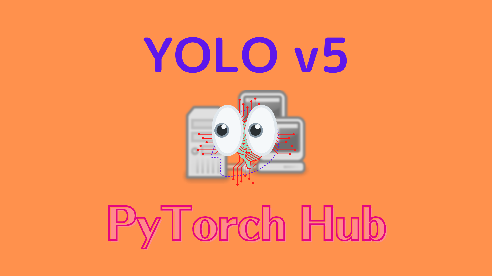
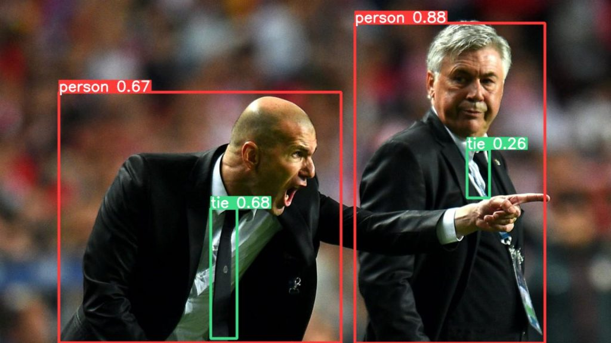
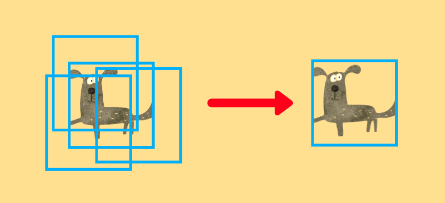
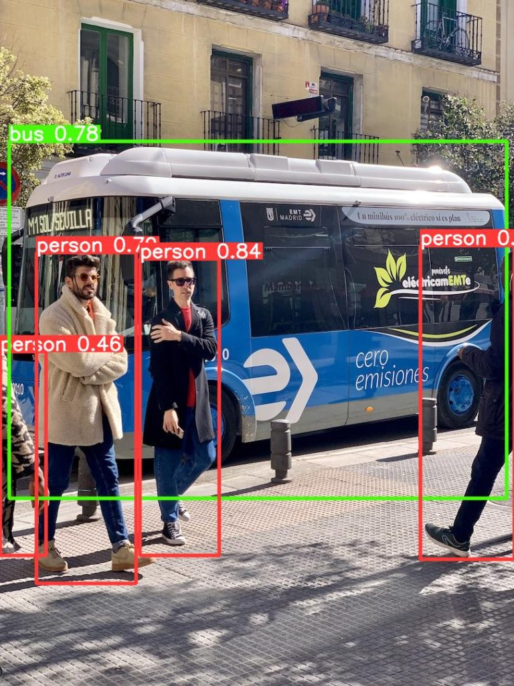

This article is an introductory tutorial where we download the pre-trained YOLOv5 from PyTorch Hub and perform object detection on sample images.

YOLO (You Look Only Once) is a well-known name for object detection. [Joseph Redmon](https://pjreddie.com) from the University of Washington developed the original versions (YOLOv1, v2, and v3) and he stopped working on them. However, other people continue the development of YOLO after that. Alexey Bochkovskiy developed YOLOv4 by forking and improving [Darknet](https://github.com/AlexeyAB/darknet) from Joseph Redmon's GitHub. Independently, <a href="http://www.ultralytics.com/" rel="noreferrer noopener" target="_blank">Ultralytics</a> developed [YOLOv5](https://pytorch.org/hub/ultralytics_yolov5/) using PyTorch, which we use in this article.

## Python Environment Setup

We'll use `venv` to set up a Python environment as below. Alternatively, we can follow [the instruction from PyTorch Hub](https://pytorch.org/hub/ultralytics_yolov5/).

```bash
# Create a project folder and move there
mkdir yolov5
cd yolov5

# Create and activate a Python environment using venv
python3 -m venv venv
source venv/bin/activate

# We should always upgrade pip as it's usually old version
# that has older information about libraries
pip install --upgrade pip

# We install PyTorch and related libraries
pip install torch torchvision matplotlib

# Install the required libraries for YOLOv5
pip install -qr https://raw.githubusercontent.com/ultralytics/yolov5/master/requirements.txt
```

We are ready to download a pre-trained YOLOv5 for object detection on sample images.

## Object Detection with YOLOv5 

Let's download the smallest version of pre-trained YOLOv5. All we need to do is execute the following one line to download the model from PyTorch Hub.

```python
import torch

# Download YOLOv5 from PyTorch Hub
model = torch.hub.load('ultralytics/yolov5', 'yolov5s', pretrained=True)
```

The model's source code will be stored under the folder `~/.cache/torch/hub/ultralytics_yolov5_master/` so that the next time `torch.hub.load` will fetch the model locally, which is fast. If there is a problem due to an outdated model version in the cache folder, we may need to remove it manually. The pre-trained model weights will be under our project folder, the `yolov5` folder we created initially.

Let's use a sample image from the Ultralytics GitHub. We can directly specify the image URL:

```python
# Sample Image URL
BASE_URL = 'https://github.com/ultralytics/yolov5/raw/master/data/images/'
image_url = BASE_URL + 'zidane.jpg'
```

If you have images locally on your computer, you can specify the path to your images.

We create a batch of images (albeit only one image entry) and feed it to the model.

```python
# A batch of images (only one entry here)
imgs = [image_url]

# Inference
results = model(imgs)
```

We can show the result with one line:

```python
# Display the results
results.show()
```

It detected two `person` objects and two `tie` objects.

{width="75%"}

We can save it with one line:

```python
# Save the results
results.save()
```

It creates folders and saves the resulting image: `runs/detect/exp/zidane.jpg`. If we rerun the experiment, it'll add a new folder `exp2`, and save the image there (the result will be the same if we use the same input image).

## Non-Maximum Suppression (NMS)

We can also print results to see which classes the model detected along with other information:

```python
# Print the results
results.print()
```

The printed results are as follows:

```
image 1/1: 720x1280 2 persons, 2 ties
Speed: 317.8ms pre-process, 200.2ms inference, 10.8ms NMS per image at shape (1, 3, 384, 640)
```

We can confirm that it detected two `person` objects and two `tie` objects. It has the breakdown of where the model spent how much time (milliseconds):

- Pre-processing Time: 317.8 ms
- Inference (Model) Time: 200.2 ms
- Post-processing (NMS) Time: 10.8ms

Note: the above timing values don't include the time spent generating result images. If multiple images exist, the above time values will be average for each case.

The pre-processing converts an image from Numpy to PyTorch and normalizes the pixel values from 0-255 to 0.0 - 1.0. The inference time is the time spent within the model. Post-processing is the time spent by NMS (Non-Maximum Suppression). As the model predicts many bounding boxes with different positions, sizes, and confidence levels, and they overlap, NMS chooses the ones the model feels most confident in and eliminates others overlapping with them. The example below shows that NMS eliminates overlapping bounding boxes to leave the most confident prediction.

{width="90%"}

## Bounding Boxes

We can print the bounding box values for the first image in the batch (we only have one image):

```python
print(results.xyxy[0])
```

`xyxy` means bounding box values are x-axis and y-axis values for left-top and x-axis and y-axis values for right-bottom. The model detected four bounding boxes so that we have four rows printed:

```
tensor([[7.43290e+02, 4.83436e+01, 1.14176e+03, 7.20000e+02, 8.79861e-01, 0.00000e+00],
        [4.41990e+02, 4.37337e+02, 4.96585e+02, 7.10036e+02, 6.75119e-01, 2.70000e+01],
        [1.23051e+02, 1.93238e+02, 7.14691e+02, 7.19771e+02, 6.66693e-01, 0.00000e+00],
        [9.78990e+02, 3.13579e+02, 1.02530e+03, 4.15526e+02, 2.61517e-01, 2.70000e+01]])
```

There are six numbers per row. 

- The first four values are for `xyxy`
- The fifth value is the confidence score
- The sixth value is the predicted object class

For better readability, I rounded the values as follows:

```
[743,  48, 1142, 720, 88%,  0], #  0 - person
[442, 437,  497, 710, 68%, 27], # 27 - tie
[123, 193,  716, 720, 67%,  0], #  0 - person
[979, 314, 1025, 416, 26%, 27]  # 27 - tie
```

We can compare the above confidence scores and detected classes in the resulting image to confirm they match:

{width="75%"}

YOLO can detect 80 object classes. We can print all supported classes as follows:

```python
# Supported classes
print(model.names)
```

Below is the output:

```
['person', 'bicycle', 'car', 'motorcycle', 'airplane', 'bus', 'train', 'truck', 'boat', 'traffic light', 'fire hydrant', 'stop sign', 'parking meter', 'bench', 'bird', 'cat', 'dog', 'horse', 'sheep', 'cow', 'elephant', 'bear', 'zebra', 'giraffe', 'backpack', 'umbrella', 'handbag', 'tie', 'suitcase', 'frisbee', 'skis', 'snowboard', 'sports ball', 'kite', 'baseball bat', 'baseball glove', 'skateboard', 'surfboard', 'tennis racket', 'bottle', 'wine glass', 'cup', 'fork', 'knife', 'spoon', 'bowl', 'banana', 'apple', 'sandwich', 'orange', 'broccoli', 'carrot', 'hot dog', 'pizza', 'donut', 'cake', 'chair', 'couch', 'potted plant', 'bed', 'dining table', 'toilet', 'tv', 'laptop', 'mouse', 'remote', 'keyboard', 'cell phone', 'microwave', 'oven', 'toaster', 'sink', 'refrigerator', 'book', 'clock', 'vase', 'scissors', 'teddy bear', 'hair drier', 'toothbrush']
```

We can confirm `model.names[0]` is `person`, and `model.names[27]` is `tie`.

## Source Code

The below source code performs everything we discussed with two images in a batch.

```python
import torch

# Download YOLOv5 from PyTorch Hub
model = torch.hub.load('ultralytics/yolov5', 'yolov5s', pretrained=True)

# Supported classes
print("Supported classes")
print(model.names)
print()

# Sample Image URL
BASE_URL = 'https://github.com/ultralytics/yolov5/raw/master/data/images/'
FILE_NAMES = ['zidane.jpg', 'bus.jpg']

# A batch of images
imgs = [BASE_URL + file_name for file_name in FILE_NAMES]

# Inference
results = model(imgs)

# Display the results
results.show()

# Save the results
results.save()
print()

# Print the results
print("Results")
results.print()
print()

# Print the first bounding box values
print("Bounding box")
for i, file_name in enumerate(FILE_NAMES):
    print(file_name)
    print(results.xyxy[i])
    print()
```

Below is the detection result for the second image.

{width="75%"}

## References

- [YOLOv5 Transfer Learning In Simple Steps Without Losing Your Mind](/blog/2022-05-10-yolov5-transfer-learning-dogs-cats/)
- [You Only Look Once: Unified, Real-Time Object Detection](https://arxiv.org/abs/1506.02640) \
  Joseph Redmon, Santosh Divvala, Ross Girshick, Ali Farhadi
- [YOLO9000: Better, Faster, Stronger](https://arxiv.org/abs/1612.08242) \
  Joseph Redmon, Ali Farhadi
- [YOLOv3: An Incremental Improvement](https://arxiv.org/abs/1804.02767) \
  Joseph Redmon, Ali Farhadi
- [YOLOv4: Optimal Speed and Accuracy of Object Detection](https://arxiv.org/abs/2004.10934) \
  Alexey Bochkovskiy, Chien-Yao Wang, Hong-Yuan Mark Liao
- [YOLOv5](https://github.com/ultralytics/yolov5) \
  Ultralytics
