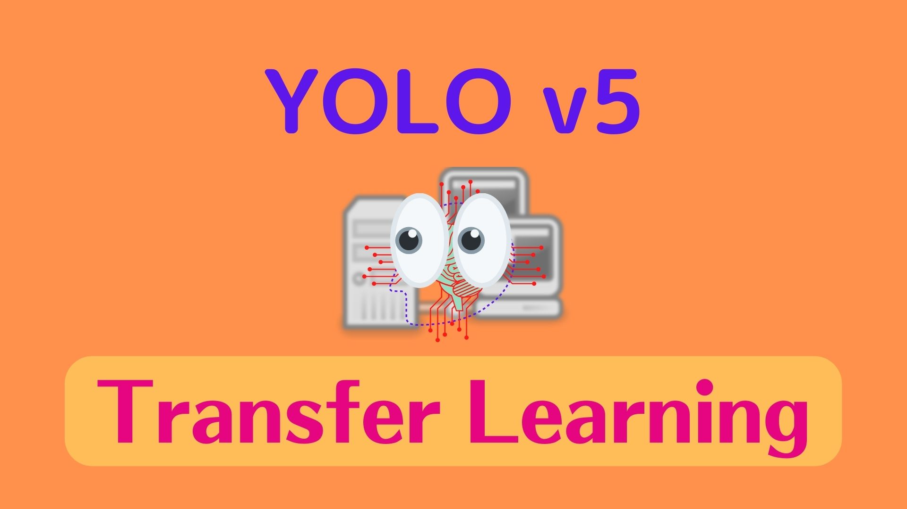
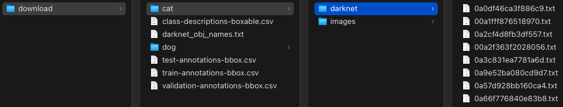
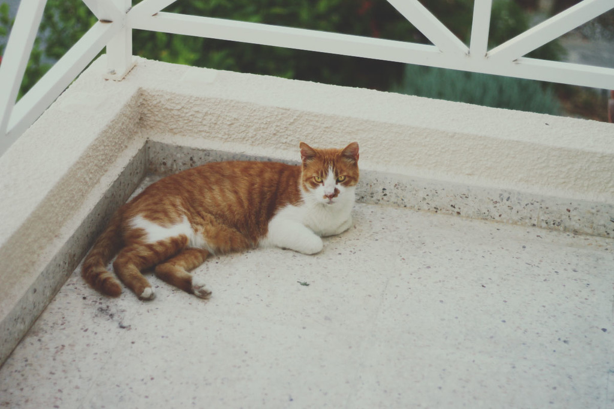
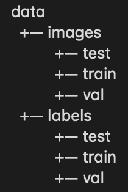
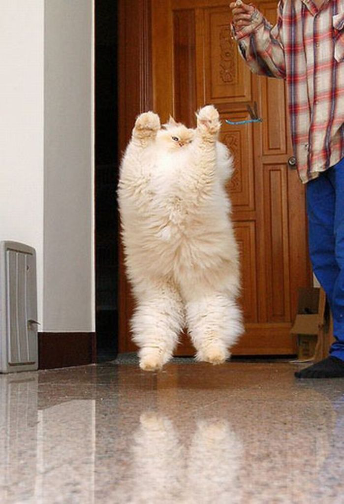
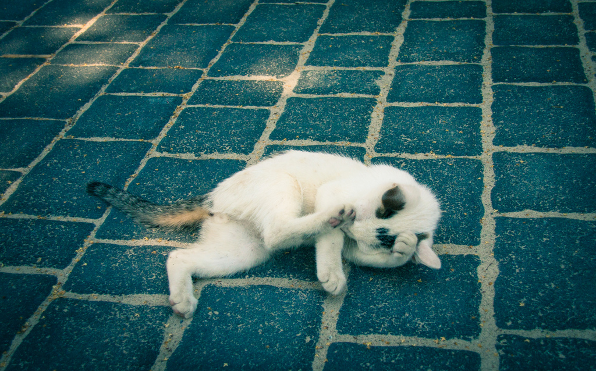
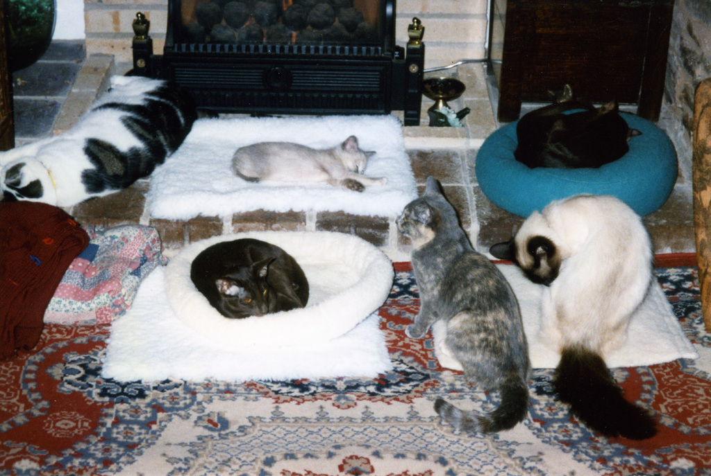
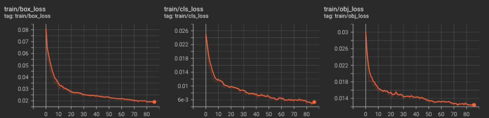
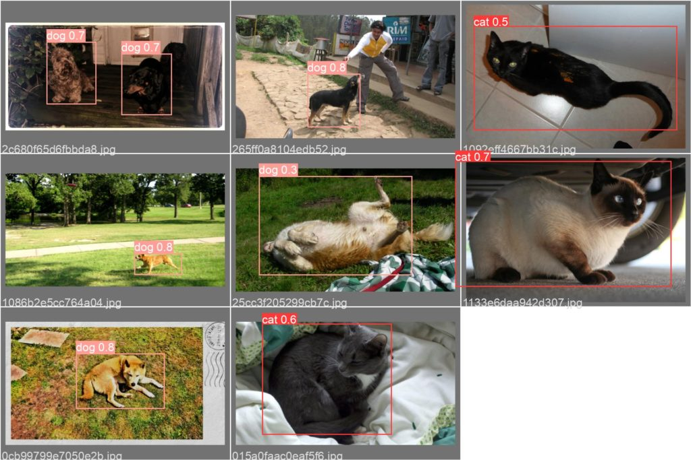

In [the previous article](/blog/2022-05-08-yolov5-pytorch/), we used YOLOv5 to perform object detection on sample images. In this article, we'll perform transfer learning to adjust YOLOv5 to cat and dog images from Google's open images. It is easy to do as transfer learning is well-integrated into [the Ultralytics' implementation](https://github.com/ultralytics/yolov5). The hardest part is preparing image data for YOLOv5 transfer learning, but we'll tackle it step by step.

## Python Environment Setup

We’ll use `venv` to set up a Python environment as below.

```bash
# Create a project folder and move there
mkdir yolov5-transfer-learning
cd yolov5-transfer-learning

# Create and activate a Python environment using venv
python3 -m venv venv
source venv/bin/activate

# We should always upgrade pip as it's usually old version
# that has older information about libraries
pip install --upgrade pip
```

Next, download cat and dog images from Google's open images.

## Open Image Download

First, we install the open images library to download dog and cat images from the open images.

```bash
pip install openimages
```

Next, we download 500 cat images and 500 dog images (a total of 1,000 images):

```bash
oi_download_dataset --base_dir download --csv_dir download --labels Cat Dog --format darknet --limit 500
```

It takes a while to download images, so be patient. It will create a folder structure like the one below:



We specified the darknet format (--format darknet), which YOLO can handle. There are cat and dog folders. For each, we have darknet and image folders. 

- The darknet folder contains label data.
- The images folder contains input images.

For example, below is a cat image from `cat/images/0a0df46ca3f886c9.jpg`.

{width="50%"}

The corresponding label file `cat/darknet/0a0df46ca3f886c9.txt` contains the below data:

```
0 0.35750000000000004 0.53875 0.463334 0.39499999999999996
```

There are five numbers per line. Each line is for one object (class and bounding box). This image contains only one cat image, so there is only one line. The first number indicates the class where `0` means cat and `1` means dog.

We can see the definition of class number in the `darknet_obj_names.txt` file:

```
cat
dog
```

The cat class is 0, and the dog class is 1, by row index.

The following four numbers in the label file are for the bounding box for the cat (x-center, y-center, width, height). It scales from 0 to 1 relative to the image size. We can draw the bounding box using the following code. 

We convert the coordinates from the center position with width and height into top-left and bottom-right positions.

```python
from PIL import Image, ImageDraw

def show_bbox(image_path):
    # convert image path to label path
    label_path = image_path.replace('/images/', '/darknet/')
    label_path = label_path.replace('.jpg', '.txt')

    # Open the image and create ImageDraw object for drawing
    image = Image.open(image_path)
    draw = ImageDraw.Draw(image)

    with open(label_path, 'r') as f:
        for line in f.readlines():
            # Split the line into five values
            label, x, y, w, h = line.split(' ')

            # Convert string into float
            x = float(x)
            y = float(y)
            w = float(w)
            h = float(h)

            # Convert center position, width, height into
            # top-left and bottom-right coordinates
            W, H = image.size
            x1 = (x - w/2) * W
            y1 = (y - h/2) * H
            x2 = (x + w/2) * W
            y2 = (y + h/2) * H

            # Draw the bounding box with red lines
            draw.rectangle((x1, y1, x2, y2),
                           outline=(255, 0, 0), # Red in RGB
                           width=5)             # Line width
    image.show()
    

show_bbox('data/images/train/0a0df46ca3f886c9.jpg')
```

Below is the resulting image.

{width="50%"}

Next, we'll reorganize images and label files into a new folder structure to train YOLOv5.

## YOLOv5 Transfer Learning Folder Setup

YOLOv5 assumes images and labels are available in the following folder structure:

{width="25%"}

We'll use the following code to create such folders.

```python
import os

# Create a folder structure for YOLOv5 training
if not os.path.exists('data'):
    for folder in ['images', 'labels']:
        for split in ['train', 'val', 'test']:
            os.makedirs(f'data/{folder}/{split}')
```

Before copying the files into this folder structure, we will check for duplicated image/label file names.

### Duplicated Image and Label File Names

Since we will copy dog and cat files into the same folders (`train`, `val`, `test`), we should check for duplicate file names.

```python
import glob

def get_filenames(folder):
    filenames = set()
    
    for path in glob.glob(os.path.join(folder, '*.jpg')):
        # Extract the filename
        filename = os.path.split(path)[-1]        
        filenames.add(filename)

    return filenames


# Dog and cat image filename sets
dog_images = get_filenames('download/dog/images')
cat_images = get_filenames('download/cat/images')
```

We can check the intersection of the two image filename sets.

```python
# Check for duplicates
duplicates = dog_images & cat_images

print(duplicates)
```

The output shows three files having the same filename between the dog and cat folders.

```
{'0dcd8cc4b35a93b4.jpg', '0838125199f2caa7.jpg', '1417eccd5854e04a.jpg'}
```

Let's take a look at them.

```python
from PIL import Image

# Show the images from the duplicated filenames
for file in duplicates:
    for animal in ['cat', 'dog']:
        Image.open(f'download/{animal}/images/{file}').show()
```

We can see the below images in the dog folder are the same images from the cat folder.

{width="25%"}

{width="35%"}

{width="35%"}

So, the dog folder contains three cats for an unknown reason. Let's eliminate them.

```python
dog_images -= duplicates

print(len(dog_images))
```

It says 497. So, we eliminated the three cat images from the dog image filename set. We can copy image/label files into the new folder structure.

### Split Image and Label Files into Train, Val, and Test Sets

We will split images and label files into `train`, `val`, and `test` sets by copying them into respective folders. We'll shuffle them first.

```python
import numpy as np

dog_images = np.array(list(dog_images))
cat_images = np.array(list(cat_images))

# Use the same random seed for reproducability
np.random.seed(42)
np.random.shuffle(dog_images)
np.random.shuffle(cat_images)
```

The below code is a bit lengthy, but all it does is copy images and label files to the respective folders given `train_size` and `val_size`.

```python
import shutil

def split_dataset(animal, image_names, train_size, val_size):
    for i, image_name in enumerate(image_names):
        # Label filename
        label_name = image_name.replace('.jpg', '.txt')
        
        # Split into train, val, or test
        if i < train_size:
            split = 'train'
        elif i < train_size + val_size:
            split = 'val'
        else:
            split = 'test'
        
        # Source paths
        source_image_path = f'download/{animal}/images/{image_name}'
        source_label_path = f'download/{animal}/darknet/{label_name}'

        # Destination paths
        target_image_folder = f'data/images/{split}'
        target_label_folder = f'data/labels/{split}'

        # Copy files
        shutil.copy(source_image_path, target_image_folder)
        shutil.copy(source_label_path, target_label_folder)

# Cat data
split_dataset('cat', cat_images, train_size=400, val_size=50)

# Dog data (reduce the number by 1 for each set due to three duplicates)
split_dataset('dog', dog_images, train_size=399, val_size=49)
```

We have prepared datasets for YOLOv5 training. Next, we'll prepare a config file and other things for YOLOv5 transfer learning.

## YOLOv5 Transfer Learning Preparation

First, we clone the YOLOv5 repository and install the required library. Make sure you are still in the activated `venv` environment. Under the `yolov5-transfer-learning` folder, execute the following:

```bash
git clone https://github.com/ultralytics/yolov5

pip install -U -r yolov5/requirements.txt
```

Note: at the time of this writing, the latest PyTorch causes an error when the YOLOv5 training finishes. The error says:

```
AttributeError: 'NoneType' object has no attribute '_free_weak_ref'
```

The details are available [here](https://github.com/ultralytics/yolov5/issues/7127). If you encounter the error, a workaround is to downgrade PyTorch as below:

```bash
# If you need to downgrade, you can try this after installing YOLOv5
pip install torch==1.10.1 torchvision==0.11.2
```

We create a YAML file to specify the paths to datasets and class definitions for YOLOv5 under the `yolov5-transfer-learning` folder and save it as `cats_and_dogs.yaml`.

```yaml
# Dataset paths relative to the yolov5 folder
train: ../data/images/train
val:   ../data/images/val
test:  ../data/images/test

# Number of classes
nc: 2

# Class names 0 - cat, 1 - dog
names: ['cat', 'dog']
```

We are almost ready to train YOLOv5. Next, we need to freeze the backbone.

### Freeze the YOLOv5 Backbone

The backbone means the layers that extract input image features. We will freeze the backbone so the weights in the backbone layers will not change during YOLOv5 transfer learning. We will only train the last layers (i.e., head layers). As we will use the smallest model (yolov5s), we need to find out which layers are the backbone. Let's open `yolov5/models/yolov5s.yaml` to see the model structure:

```yaml
# YOLOv5 🚀 by Ultralytics, GPL-3.0 license

# Parameters
nc: 80  # number of classes
depth_multiple: 0.33  # model depth multiple
width_multiple: 0.50  # layer channel multiple
anchors:
  - [10,13, 16,30, 33,23]  # P3/8
  - [30,61, 62,45, 59,119]  # P4/16
  - [116,90, 156,198, 373,326]  # P5/32

# YOLOv5 v6.0 backbone
backbone:
  # [from, number, module, args]
  [[-1, 1, Conv, [64, 6, 2, 2]],  # 0-P1/2
   [-1, 1, Conv, [128, 3, 2]],  # 1-P2/4
   [-1, 3, C3, [128]],
   [-1, 1, Conv, [256, 3, 2]],  # 3-P3/8
   [-1, 6, C3, [256]],
   [-1, 1, Conv, [512, 3, 2]],  # 5-P4/16
   [-1, 9, C3, [512]],
   [-1, 1, Conv, [1024, 3, 2]],  # 7-P5/32
   [-1, 3, C3, [1024]],
   [-1, 1, SPPF, [1024, 5]],  # 9
  ]

# YOLOv5 v6.0 head
head:
  [[-1, 1, Conv, [512, 1, 1]],
   [-1, 1, nn.Upsample, [None, 2, 'nearest']],
   [[-1, 6], 1, Concat, [1]],  # cat backbone P4
   [-1, 3, C3, [512, False]],  # 13

   [-1, 1, Conv, [256, 1, 1]],
   [-1, 1, nn.Upsample, [None, 2, 'nearest']],
   [[-1, 4], 1, Concat, [1]],  # cat backbone P3
   [-1, 3, C3, [256, False]],  # 17 (P3/8-small)

   [-1, 1, Conv, [256, 3, 2]],
   [[-1, 14], 1, Concat, [1]],  # cat head P4
   [-1, 3, C3, [512, False]],  # 20 (P4/16-medium)

   [-1, 1, Conv, [512, 3, 2]],
   [[-1, 10], 1, Concat, [1]],  # cat head P5
   [-1, 3, C3, [1024, False]],  # 23 (P5/32-large)

   [[17, 20, 23], 1, Detect, [nc, anchors]],  # Detect(P3, P4, P5)
  ]
```

If you see the backbone section, there are ten layers. So, we need to freeze the first ten layers.

## YOLOv5 Transfer Learning Execution

All you need to do is execute the following under the `yolov5-transfer-learning` folder.

```bash
python yolov5/train.py --data cats_and_dogs.yaml --weights yolov5s.pt --epochs 100 --batch 4 --freeze 10
```

- --data the dataset definition YAML file
- --weights the pre-trained YOLOv5 model weights (We use the smallest model)
- --epochs the number of epochs (100 may be more than enough for just two classes)
- --batch the batch size (Please adjust it as per your machine spec)
- --freeze the number of layers to freeze

The minimum set of parameters above is probably not the best. The `train.py` script has many more parameters to tweak, so I encourage anyone to look at the script and play with the parameters.

### Monitor Training with Tensorboard

We can open another terminal and source the `venv` environment to open the Tensorboard as follows:

```bash
tensorboard --logdir yolov5/runs/
```

Open `localhost:6006` in your web browser to see the loss curves and other charts.



- box_loss: location loss based on IoU
- cls_loss: classification loss based on binary cross-entropy for each class (dog and cat)
- obj_loss: objectness loss based on how confident there is an object in each bounding box

IoU means __Intersection over Union__ between predicted and true bounding boxes. The location loss is an average (1 - IoU) where small intersections mean a larger loss value.

### Model Performance Evaluation

The training process saves images in `runs/train/exp/weights` folder.



Also, two model weight files will be under the `runs/train/exp/weights` folder.

- `best.pt`　the best-performing model
- `last.pt`　the last epoch model

The `exp` in `runs/train/exp/weights` stands for `experiment`. If you run more experiments, there will be new folders like exp2, exp3, etc. The `train.py` automatically evaluates the best model and prints the results:

```
Class     Images     Labels          P          R     mAP@.5 mAP@.5:.95:
  all         99        113      0.714      0.814      0.811      0.584
  cat         99         56      0.746      0.839      0.845      0.613
  dog         99         57      0.682      0.789      0.777      0.555
Speed: 3.3ms pre-process, 303.2ms inference, 0.4ms NMS per image at shape (32, 3, 640, 640)
```

- P - Precision
- R - Recall
- mAP - mean Average Precision

We can also manually evaluate the model performance with the following command:

```bash
python yolov5/val.py --data cats_and_dogs.yaml --weights yolov5/runs/train/exp/weights/best.pt
```

## Source Code For Data Preparation

```python
import glob
import os
import numpy as np
import shutil
from PIL import Image

#------------------------------------------------------------
# Create a folder structure for YOLOv5 training
#------------------------------------------------------------
if not os.path.exists('data'):
    for folder in ['images', 'labels']:
        for split in ['train', 'val', 'test']:
            os.makedirs(f'data/{folder}/{split}')


#------------------------------------------------------------
# Get filenames from a folder
#------------------------------------------------------------
def get_filenames(folder):
    filenames = set()
    
    for path in glob.glob(os.path.join(folder, '*.jpg')):
        # Extract the filename
        filename = os.path.split(path)[-1]        
        filenames.add(filename)
        
    return filenames


#------------------------------------------------------------
# Dog and cat image filename sets
#------------------------------------------------------------
dog_images = get_filenames('download/dog/images')
cat_images = get_filenames('download/cat/images')


#------------------------------------------------------------
# Check for duplicates
#------------------------------------------------------------
duplicates = dog_images & cat_images

print("Duplicates")
print(duplicates)


#------------------------------------------------------------
# Show the images from the duplicated filenames
#------------------------------------------------------------
for file in duplicates:
    for animal in ['cat', 'dog']:
        Image.open(f'download/{animal}/images/{file}').show()


#------------------------------------------------------------
# Eliminate the duplicates
#------------------------------------------------------------
dog_images -= duplicates

print("# of dog images")
print(len(dog_images))


#------------------------------------------------------------
# Convert the filename sets into Numpy
#------------------------------------------------------------
dog_images = np.array(list(dog_images))
cat_images = np.array(list(cat_images))


#------------------------------------------------------------
# Use the same random seed for reproducability
#------------------------------------------------------------
np.random.seed(42)
np.random.shuffle(dog_images)
np.random.shuffle(cat_images)


#------------------------------------------------------------
# Split data into train, val, and test
#------------------------------------------------------------
def split_dataset(animal, image_names, train_size, val_size):
    for i, image_name in enumerate(image_names):
        # Label filename
        label_name = image_name.replace('.jpg', '.txt')

        # Split into train, val, or test
        if i < train_size:
            split = 'train'
        elif i < train_size + val_size:
            split = 'val'
        else:
            split = 'test'

        # Source paths
        source_image_path = f'download/{animal}/images/{image_name}'
        source_label_path = f'download/{animal}/darknet/{label_name}'

        # Destination paths
        target_image_folder = f'data/images/{split}'
        target_label_folder = f'data/labels/{split}'

        # Copy files
        shutil.copy(source_image_path, target_image_folder)
        shutil.copy(source_label_path, target_label_folder)


# Cat data
split_dataset('cat', cat_images, train_size=400, val_size=50)

# Dog data (reduce the number by 1 for each set due to three duplicates)
split_dataset('dog', dog_images, train_size=399, val_size=49)
```

Enjoy YOLOv5 Transfer Learning!

## References

- [YOLOv5: Object Detection Made Easy with PyTorch Hub](/blog/2022/2022-05-08-yolov5-pytorch/)
- [YOLOv5: Transfer Learning with Frozen Layers](https://docs.ultralytics.com/tutorials/transfer-learning-froze-layers/)
- [YOLOv5: Tips for Best Training Results](https://docs.ultralytics.com/tutorials/training-tips-best-results/)
