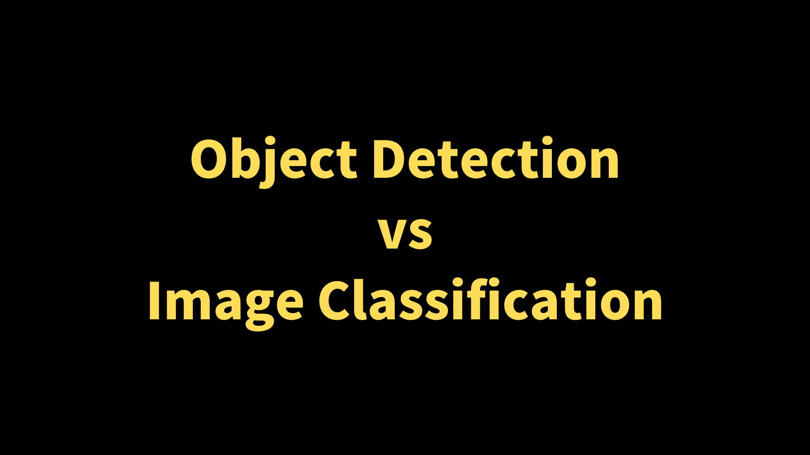
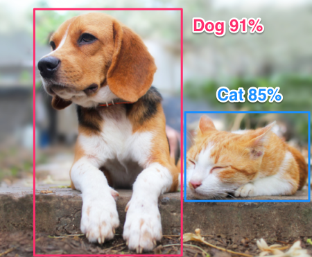

This article explains the difference between object detection vs. image classification (i.e., ResNet).

## Image Classification

Image Classification aims to answer what object exists in an image. For example, what is a representative object in the below image?

There are sunflowers, but the main object in the image should be the dog. As such, the correct answer is "dog".

What about the below image?

The answer should be "cat". So, image classification predicts one class (i.e., "dog", "cat", etc.) that is most likely to represent a given image. 

Depending on an image dataset, the number of classes is pre-determined. For example, ImageNet image classification uses 1,000 classes. As such, a model would predict 1,000 confidence scores (probabilities) for each class. Typically, one class dominates others, so we say the model predicts "cat" with 95% confidence. But actually, it may allocate small probabilities for all other 999 classes.

Another aspect of image classification is that we do not care about the position of a predicted object. So, the object may be at the center, left or right, top or bottom, and so on. We do not expect an image classification model to say anything about object positions.

How about the below image?

A good image classification model would predict the most likely class in this image: "dog". It may predict confidence scores like 70% for "dog" and 30% for "cat" and choose "dog" as the best prediction.

However, it is not entirely wrong if the model predicts "cat" as the answer because the image has a sizeable "cat". As such, this image is not suitable for image classification. In general, if an image has multiple objects of relatively large size, it is not suitable for image classification because allowing only one representation may not make much sense.

It is where knowing the difference between object detection vs. image classification comes in handy.

## Object Detection

A good object detector would predict something like the following:

Object detection aims to locate each object by a rectangular box (bounding box) and classify what is inside each bounding box. As such, there may be more than one object in one image. In the above image, our hypothetical object detector located "dog" and "cat" in red and blue bounding boxes. 

Intuitively, the model predicts bounding boxes for objects and gives image classification scores for each bounding box. For example, the model gives a confidence score of 91% for "dog" in the red box. If ten dogs are in an image, the model should predict ten bounding boxes with high confidence for "dog". 

Typically, a model predicts a bounding box with top-left $(x_1, y_1)$ and right-bottom $(x_2, y_2)$ coordinates. As such, it is a regression problem.

Well-known object detectors are YOLO (i.e., [YOLOv5](/blog/2022-05-08-yolov5-pytorch/)), [SSD](/blog/2022-07-31-ssd-single-shot-multibox-detector/), and [R-CNN](/blog/2022-06-11-r-cnn-original/), to name a few. Compared with image classification models, object detectors are more complex since they need to deal with concepts like:

- [Anchors](/blog/2022-07-11-faster-r-cnn-rpn/#anchor-boxes)
- [IoU (Intersection over Union)](/blog/2022-05-24-object-detection-intersection-over-union/)
- [NMS (Non-Maximum Suppression)](/blog/2022-06-01-object-detection-non-maximum-suppression/)
- [mAP (mean Average Precision)](/blog/2022-05-27-object-detection-mean-average-precision/)

I hope the article helps you understand the difference between object detection and image classification.

## References

- [IoU (Intersection over Union)](/blog/2022-05-24-object-detection-intersection-over-union/)
- [NMS (Non-Maximum Suppression)](/blog/2022-06-01-object-detection-non-maximum-suppression/)
- [mAP (mean Average Precision)](/blog/2022-05-27-object-detection-mean-average-precision/)
- [SSD: Single Shot MultiBox Detector](/blog/2022-07-31-ssd-single-shot-multibox-detector/)
- [R-CNN: Region-based Convolutional Neural Network](/blog/2022-06-11-r-cnn-original/)
