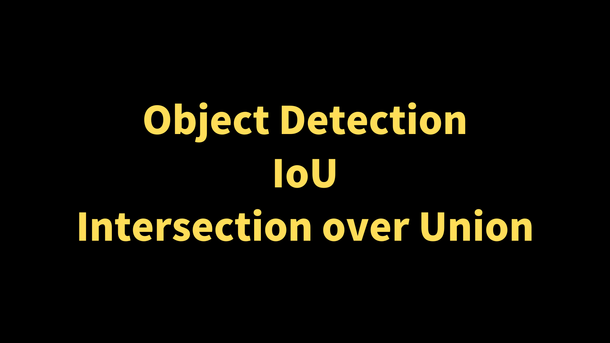
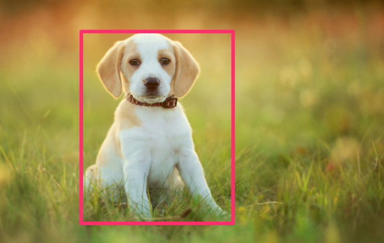
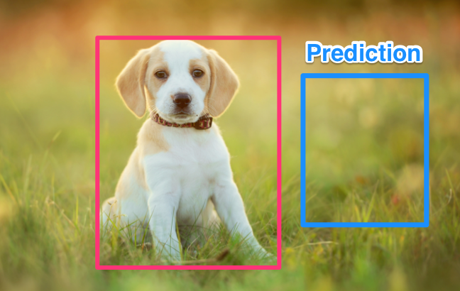
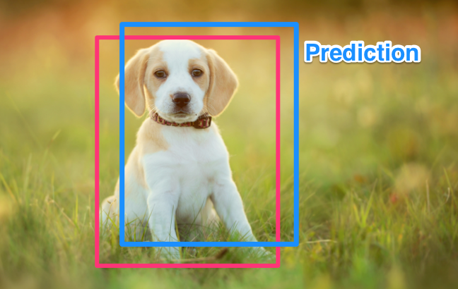
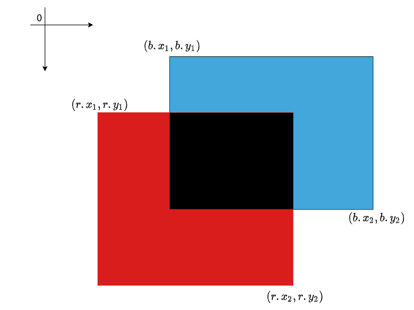
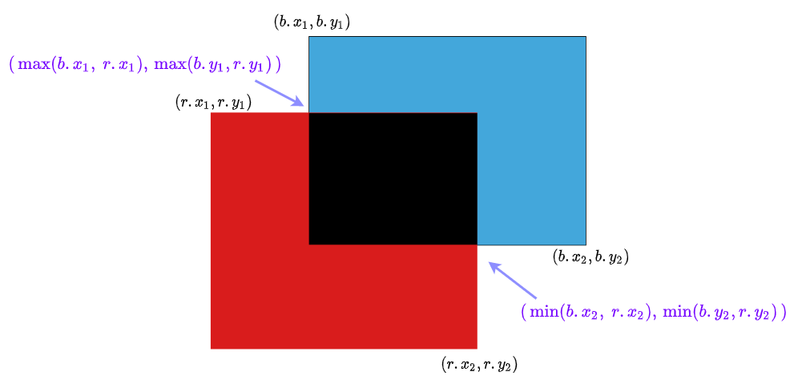

The previous article discussed the difference between object detection and image classification. We briefly mentioned __Intersection over Union (IoU)__. This article explains more details about IoU and how to calculate it.

## Intersection over Union - Intuition

The below image shows a ground truth bounding box (red color) for a dog.

{width="50%"}

Suppose an object detection model predicts a bounding box like the one below (blue color). There is no overlapping between the ground truth and the predicted bounding box. In this case, IoU is 0.

{width="50%"}

Below is another prediction bounding box that overlaps with the ground truth. In this case, IoU is greater than 0. If a prediction completely matched the ground truth, IoU would be 1.

{width="50%"}

So, IoU is a value between 0 and 1, which indicates how much a prediction and the ground truth overlap. In other words, if the intersection between a prediction and the ground truth is closer to the union area of two bounding boxes, IoU becomes closer to 1. In the below picture, the black area is the intersection, and the area covered by both boxes is the union.

{width="50%"}

## Intersection over Union - Calculation

We calculate IoU as follows:

$$
\text{IoU} = \dfrac{\text{intersection}}{\text{union}}
$$

PyTorch's Torchvision provides [torchvision.ops.boxes.box_iou](https://pytorch.org/vision/main/generated/torchvision.ops.box_iou.html) so we can easily calculate it. However, here let's manually calculate IoU to understand it properly.

As shown below, we specify a bounding box with a top-left and a bottom-right.

The picture below shows a red box (`r`) and a blue box (`b`).

- The bounding box `r` has `(r.x1, r.y1)` and `(r.x2, r.y2)`
- The bounding box `b` has `(b.x1, b.y1)` and `(b.x2, b.y2)`

{width="60%"}

Therefore, we calculate the red area (and blue area) by multiplying the width with the height as follows:

$$
\begin{aligned}  
r_\text{area} &= (r.x_2 \ - \ r.x_1) \times (r.y_2 \ - \ r.y_1) \\
b_\text{area} &= (b.x_2 \ - \ b.x_1) \times (b.y_2 \ - \ b.y_1)  
\end{aligned}
$$

To calculate the intersection (black) area, we need to know two points where the edges of two boxes are crossing:

{width="90%"}

$$
\begin{aligned}
\text{width}  &= \min( b.x_2, \ r.x_2 ) \ - \ \max( b.x_1, r.x_1 ) \\
\text{height} &= \min( b.y_2, \ r.y_2 ) \ - \ \max( b.y_1, r.y_1 )  
\end{aligned}
$$

Therefore, the intersection is:

$$
\text{intersection} = \text{width} \times \text{height}
$$

And the union area of the two boxes is:

$$
\text{union} = r_\text{area} + b_\text{area} \ - \ \text{intersection}
$$

We need to subtract the intersection. Otherwise, it would include the black area twice.

Finally, we can calculate IoU as follows:

$$
\text{IoU} = \dfrac{\text{intersection}}{\text{union}}
$$

## References

- [Object Detection vs. Image Classification](/blog/2022-05-23-object-detection-vs-image-classification/)
- [mAP (mean Average Precision)](/blog/2022-05-27-object-detection-mean-average-precision/)
- [NMS (Non-Maximum Suppression)](/blog/2022-06-01-object-detection-non-maximum-suppression/)
- [PyTorch - BOX_IOU](https://pytorch.org/vision/main/generated/torchvision.ops.box_iou.html)
