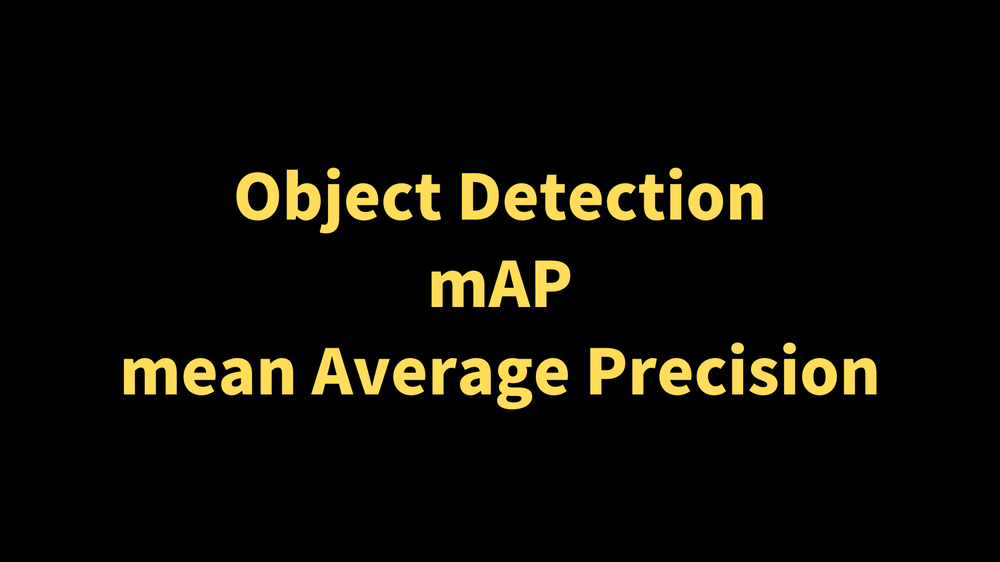
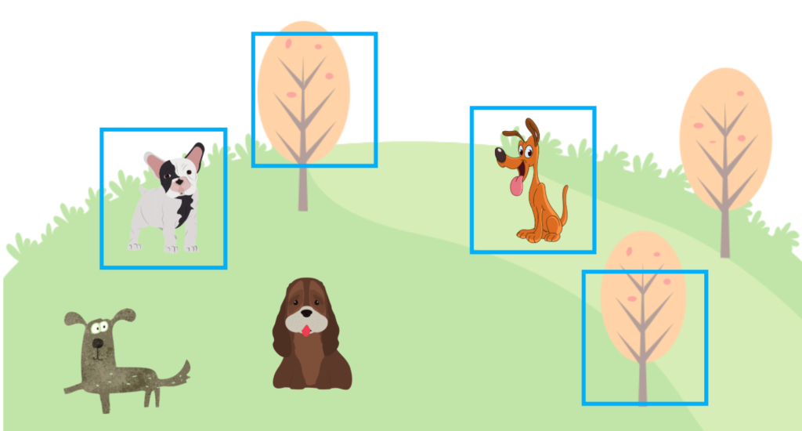
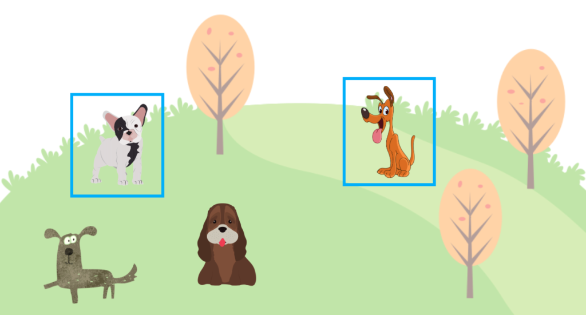
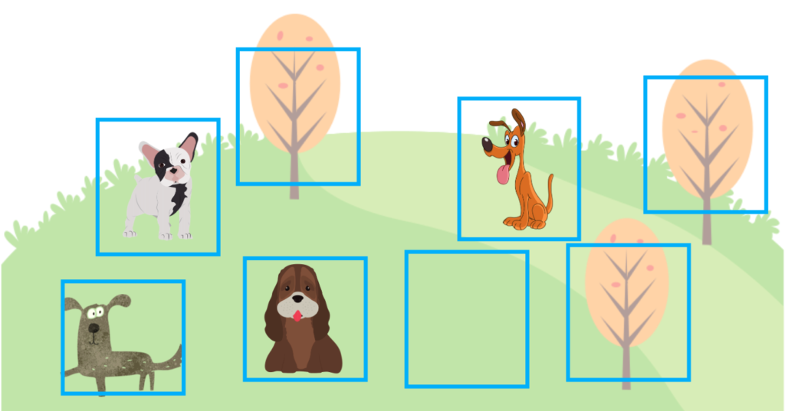
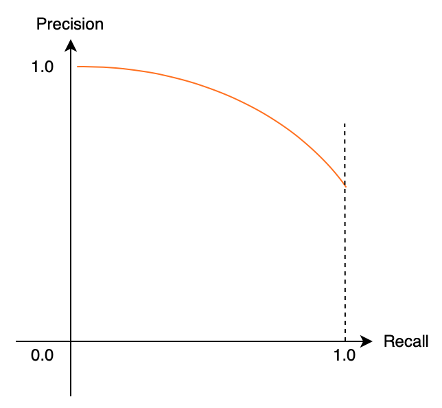
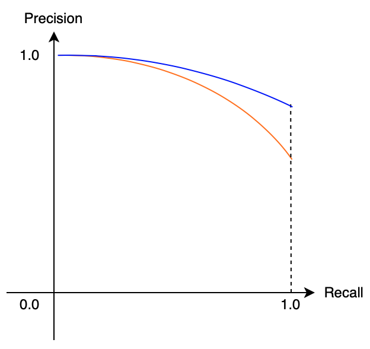
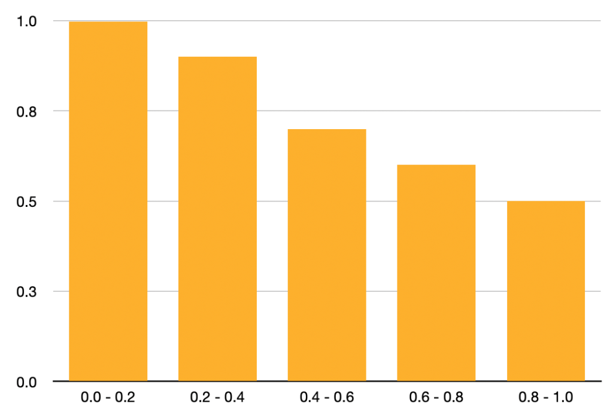
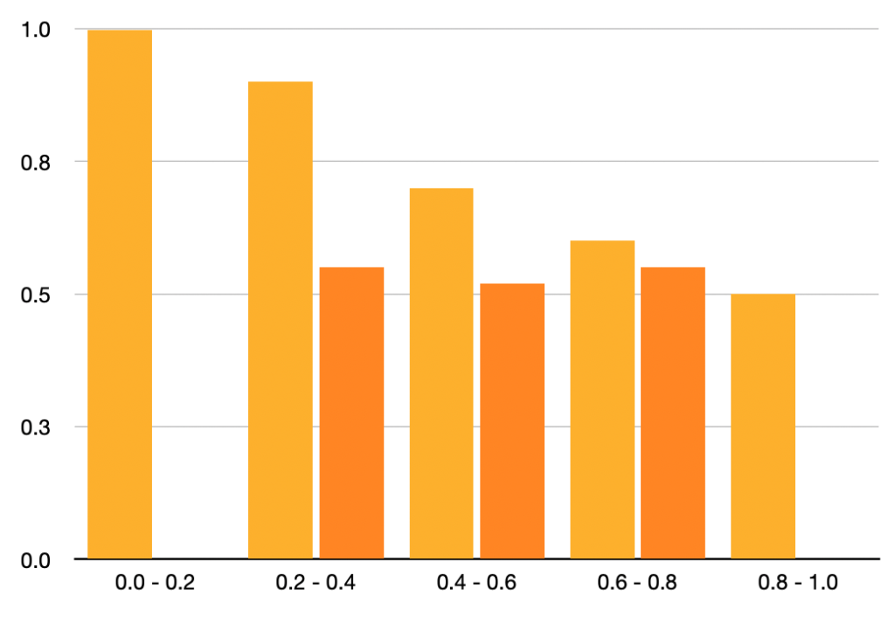

We use __mean Average Precision (mAP)__ when evaluating object detection models like [YOLO](/blog/2022-05-08-yolov5-pytorch/) and [SSD](/blog/2022-07-31-ssd-single-shot-multibox-detector/). This article explains the objective of mAP and how to calculate it.

In object detection, a model predicts the locations of objects and their classes (i.e., dog, cat, human, vehicle, etc.), where we need to judge whether or not the model has good accuracy across all classes. In other words, we don't want our model to predict well only for dogs.

If the training dataset supports 100 classes, we want our model to perform well for all 100 classes. We use mAP because it's a single value representing how well a model performs across all classes, which explains the objective of the metric.

As for how to calculate mAP, we can say (without going into details for now) that we calculate an AP (Average Precision) for each class and take the mean of AP values across all classes. To fully understand the metric, we need to understand [IoU](/blog/2022-05-24-object-detection-intersection-over-union/), Precision, and Recall as we use them to calculate an AP for each class.

Hopefully, it's evident by now that AP is not an average of precisions. It's a lot more involved. Furthermore, there are variants of mAP, making understanding mAP even harder. So, this article explains mainly the version that [COCO](https://cocodataset.org/#detection-eval) uses but also touches upon why there are variants.

We'll go over the following details step by step.

- IoU (Intersection over Union)
- Precision
- Recall
- Average Precision (AUC-PR)
- mAP (mean Average Precision by COCO)

Ultimately, we'll discuss problems with mAP that have spawned different mAP versions.

## IoU (Intersection over Union)

We'll talk about only one class briefly to keep our discussion simple. For example, we assume our model detects one or more dog locations in an image—no cats or else. Like YOLO or SSD, we use a bounding box to specify a dog's location. Any object detection training dataset provides ground truth bounding boxes. 

The below image shows a ground truth bounding box in red. A model would make predictions that may or may not have an overlap with the ground truth. For example, the blue bounding box in the below image represents a model's prediction.

{width="50%"}

It is rare to have a perfect match between a prediction bounding box and the ground truth bounding box. So, an overlap like the above image should be pretty good. Quantitatively, we calculate IoU to measure the overlap.

{width="40%"}

IoU is a value ranging from 0 to 1. If IoU is 1, the prediction perfectly matches the ground truth. If IoU is 0, there is no overlap. If you're curious, you may want to refer to [another article](/blog/2022-05-24-object-detection-intersection-over-union/) in that I explain how to calculate IoU.

As I said, IoU rarely becomes 1, so we set a threshold for IoU. If IoU satisfies the threshold, we assume the prediction is correct. For example, if the IoU threshold is 0.5, any prediction with an IoU of 0.5 or more is correct.

So, this IoU threshold is a hyperparameter that affects how many correct and incorrect predictions the model produces. If we used a too-low threshold, it would not produce meaningful evaluation results. Also, we should note that variations in thresholds (like 0.5, 06, 0.7, etc.) would impact benchmarks differently, which is one of the reasons why we have various versions of mAP.

Once we have the number of correct and incorrect predictions, we need to summarize it to see how good/bad the model is on average for the class ("dog" in our example). It is the same concept in image classification, where we calculate precision and recall using the number of correct and incorrect predictions.

## Precision

Precision tells how many correct predictions over how many a model has predicted. For example, a model predicted four dog locations, but only two were correct. Therefore, the prediction is 2/4 = 50%.

{width="60%"}

Once again, __correct__ means a prediction overlaps with the ground truth by the IoU threshold (say 0.5) or more. We call the number of correct predictions __TP__ (True Positive) and the number of incorrect predictions __FP__ (False Positive).

For example, if a model predicts a dog's location and it's correct, we add 1 to the TP count. If a model predicts a dog's location but is incorrect, we add 1 to the FP count. In the above, we count TP=2 and FP=2. Therefore, the prediction is defined as follows:

$$
\text{precision} = \frac{\text{TP}}{\text{TP} + \text{FP}}
$$

However, there is a problem if we only use a precision score to train a model. The model may predict bounding boxes with a high confidence score for fewer locations as we ignore predictions with low confidence scores. Let's assume the model produces two highly confident predictions, and both are correct. In such a case, we have TP=2 and FP=0, and the precision becomes 100%.

{width="60%"}

But there are four dogs in the ground truth data. So, the model didn't guess all dogs in the image. We need another metric (recall) to avoid the issue.

## Recall

Precision tells how many correct predictions over how many the ground truth gives. For example, a model predicted two dog locations, and both were correct. However, there are four dogs as per the ground truth. As such, the recall is 2/4 = 50%.

{width="60%"}

The locations a model has missed are where the model thought there was no dog. In other words, the model predicted "no dog" (negative), but there is a dog (positive). So, we call such cased FN (False Negative). If a model missed a dog from the ground truth, we would add 1 to FN.

In the above image, there are two dogs that the model didn't detect, so FN=2 even though the model detected two other dogs that account for TP=2. Using TP and FN, the recall is defined as follows:

$$
\text{recall} = \frac{\text{TP}}{\text{TP}＋\text{FN}}
$$

However, there is a problem if we only use a recall score to train a model. The model may predict a lot of bounding boxes with a high confidence score as the recall doesn't care about FP (False Positive). If the model can reduce FN (False Negative) count, it can achieve a high recall score. The below image shows where a model predicted many bounding boxes, and the recall score becomes 100%.

{width="60%"}

However, there are many FP (False Positives), meaning the precision is low. We don't want that. In the above case, the precision is 50% (TP=4 and FP=4), while the recall is 100% (TP=4 and FN=0).

So, we need to train a model using both the precision and recall metrics, keeping both reasonably high. It is where Average Precision comes to play.

## Average Precision (AUC-PR)

AP (Average Precision) is a metric that combines precision and recall. The name "Average Precision" does not mean an average of precisions. It uses both precision and recall, and they are related to each other (as seen in the previous section).

Conceptually, the relationship is as shown below:

{width="40%"}

A model that produces fewer high-confidence bounding boxes tends to have high precision but low recall. A model that produces many high-confidence bounding boxes tends to have high recall but low precision. The relationship between precision and recall draws a curve downward towards the right.

A well-balanced (precision and recall are high) model has a less steep slope, shown in blue below.

{width="40%"}

In other words, when the area under the curve is larger, precision and recall are both high, which means the model is robust. We use the term __AUC__ for the __Area Under the Curve__. AUC for Precision and Recall is AUC-PR, ranging from 0 (worst) to 1 (best), indicating how robust a model is.

However, AUC-PR has a problem because the actual curve is not smooth like the above images. Also, we don't have infinite data points of precision-recall combinations. So, we need to use discrete intervals to calculate the area. Let's look at an example of precision-recall data.

|Recall Interval|Precision|
|:-:            |:-:      |
|0.0 ~ 0.2      |1.0      |
|0.2 ~ 0.4      |0.9      |
|0.4 ~ 0.6      |0.7      |
|0.6 ~ 0.8      |0.6      |
|0.8 ~ 1.0      |0.5      |

The above data has only one data point (precision score) per recall interval (for simplicity). The below table shows the same data in a bar graph.

{width="60%"}

We calculate AUC-AP (Average Precision) as follows:

$$
\text{AP} = 0.2 \times (1.0 + 0.9 + 0.7 + 0.6 + 0.5) = 0.74
$$

In other words, we are calculating the average of precisions from recall intervals, which is why we also call it Average Precision. In real scenarios, there would be multiple precisions within each recall interval. So, the graph would be more complicated.

Let's take a look at another example of precision-recall data.

|Recall Interval|Precision|
|:-:            |:-:      |
|0.0 ~ 0.2      |1.0      |
|0.2 ~ 0.4      |0.9, 0.55|
|0.4 ~ 0.6      |0.7, 0.52|
|0.6 ~ 0.8      |0.6, 0.55|
|0.8 ~ 1.0      |0.5      |

The graph has become zigzag.

{width="60%"}

Since the precision-recall relationship should ideally yield a downward slope toward the right, we assume that precision must never go up toward the right. So, we determine the maximum precision value for each recall section using the recall section and the sections to its right and use the maximum precision value for that recall section. That way, it keeps the graph slope going down to the right.

Now, the table changes as follows:

|Recall Interval|Precision             |
|:-:            |:-:                   |
|0.0 ~ 0.2      |1.0                   |
|0.2 ~ 0.4      |<s>0.9, 0.55</s> → 0.9|
|0.4 ~ 0.6      |<s>0.7, 0.52</s> → 0.7|
|0.6 ~ 0.8      |<s>0.6, 0.55</s> → 0.6|
|0.8 ~ 1.0      |0.5                   |

The table becomes the same as the previous one (because I set it up that way), so the AP value is the same (0.74). This method ensures that the graph always goes down to the right and has the characteristic that it is not easily affected by the precision variation within each recall section.

So far, we have used precision and recall scores for each recall interval, but we didn't discuss how to calculate them. Next, we'll discuss exactly that.

## Calculating Precision and Recall with Confidence (Pun intended)

I want to explain how to calculate precision and recall in more detail using the example given in Jonathan Hui's article. We use a dataset with only five apples across all images. When a model predicts a location of an apple, it outputs a confidence score, ranging from 0 (least confident) and 1 (most confident). We sort the model's predictions by the confidence score.

|Order by Confidence|True / False (Correct / Incorrect)|
|:-:                |:-:                               |
|1                  |T                                 |
|2                  |T                                 |
|3                  |F                                 |
|4                  |F                                 |
|5                  |F                                 |
|6                  |T                                 |
|7                  |T                                 |
|8                  |F                                 |
|9                  |F                                 |
|10                 |T                                 |

Now, we'll calculate precision from top to bottom. We add 1 to TP when we see True and 1 to FP when we see False.

|Order by Confidence|True / False|Precision (＝TP/(TP+FP))|
|:-:                |:-:         |:-:                     |
|1                  |T           |1/1 = 1.00              |
|2                  |T           |2/2 = 1.00              |
|3                  |F           |2/3 = 0.67              |
|4                  |F           |2/4 = 0.50              |
|5                  |F           |2/5 = 0.40              |
|6                  |T           |3/6 = 0.50              |
|7                  |T           |4/7 = 0.57              |
|8                  |F           |4/8 = 0.50              |
|9                  |F           |4/9 = 0.44              |
|10                 |T           |5/10 = 0.50             |

Because we scored by confidence score, the precision tends to slope down to the right with some zigzag moves, which is not easily avoidable. Next, we'll calculate recall from top to bottom because there are five apples in the entire dataset.

|Order by Confidence|True / False|Precision|Recall (=TP/5)|
|:-:                |:-:         |:-:      |:-:           |
|1                  |T           |1.00     |1/5 = 0.2     |
|2                  |T           |1.00     |2/5 = 0.4     |
|3                  |F           |0.67     |2/5 = 0.4     |
|4                  |F           |0.50     |2/5 = 0.4     |
|5                  |F           |0.40     |2/5 = 0.4     |
|6                  |T           |0.50     |3/5 = 0.6     |
|7                  |T           |0.57     |4/5 = 0.8     |
|8                  |F           |0.50     |4/5 = 0.8     |
|9                  |F           |0.44     |4/5 = 0.8     |
|10                 |T           |0.50     |5/5 = 1.0     |

Now, we know which precisions go to which recall interval. So, this is how to calculate precision and recall for one class.

## mAP (mean Average Precision)

So far, when thinking about AP, we talked only to one class (dog or apple). However, object detection usually deals with multiple (often many) classes. So, we need to calculate AP for each class and take an average (mean), which becomes mAP (mean Average Precision).

### COCO（Common Objects in Context）

COCO provides an object detection dataset and defines its version of mAP, which many researchers use to evaluate their models. 

Note: COCO calls mAP simply "AP", and they believe people should be able to tell whether it is for multiple classes or a single class from the context. When reading texts from the COCO website, please be careful not to get confused.

COCO uses 100 recall intervals to calculate mAP. As such, each recall interval is 0.01. Also, they use multiple IoU thresholds. For example, the two examples below show mAP with IoU Threshold=0.50 and 0.75, respectively.

$$
\text{AP}^{\text{IoU}=.50} \quad \text{or} \quad \text{AP@}.50
$$

$$
\text{AP}^{\text{IoU}=.75} \quad \text{or} \quad \text{AP@}.75
$$

COCO defines the main mAP as follows:

$$
\text{AP@}[.50:.05:.95]
$$

It means an average of the mAP results with the IoU Thresholds from 0.50 to 0.95 increased by 0.05. In other words, we calculate the following mAP values and take an average to yield the mAP score.

- $\text{AP}^{\text{IoU}=.50}$
- $\text{AP}^{\text{IoU}=.55}$
- $\text{AP}^{\text{IoU}=.60}$
- $\text{AP}^{\text{IoU}=.65}$
- $\text{AP}^{\text{IoU}=.70}$
- $\text{AP}^{\text{IoU}=.75}$
- $\text{AP}^{\text{IoU}=.80}$
- $\text{AP}^{\text{IoU}=.85}$
- $\text{AP}^{\text{IoU}=.90}$
- $\text{AP}^{\text{IoU}=.95}$

They also define different mAP scores based on the object sizes.

- $\text{AP}^{\text{small}}$ (32 square pixels)
- $\text{AP}^{\text{medium}}$ (32 to 96 square pixels)
- $\text{AP}^{\text{large}}$ (more than 96 square pixels)

Although the objective is the same, there are different versions of mAP by other datasets like PASCAL VOC. It can get confusing when using multiple datasets with different mAP definitions. Now that we understand how mAP works, it also manifests some issues. 

For example, deciding which IoU Thresholds to use is arbitrary. It's not clear what using a different IoU Threshold means. For example, even if the IoU threshold = 0.50 gives a high mAP score but 0.75 gives a bad mAP score, it does not mean the model is entirely inaccurate. It would take various comparisons by measuring more IoU Thresholds like 0.6, 0.7, etc. It's never-ending. Such hyperparameter tuning could depend on the class imbalance in a dataset. 

Another example is that when a minority class hurts the overall mAP, it may not mean the model is that bad. So, we may want to evaluate AP per class to see how the model performs for each class, especially when evaluating various model designs.

So, mAP gives a convenient single metric value incorporating precision and recall. It sounds great in theory, but we should realize that mAP depends on how we define thresholds and other hyperparameters (like reflecting image size) and what kind of class imbalance each dataset has.

## References

- [Object Detection vs Image Classification](/blog/2022-05-23-object-detection-vs-image-classification/)
- [IoU (Intersection over Union)](/blog/2022-05-24-object-detection-intersection-over-union/)
- [NMS (Non-Maximum Suppression)](/blog/2022-06-01-object-detection-non-maximum-suppression/)
- [COCO (Common Objects in Context)](https://cocodataset.org/#detection-eval)
- [mAP (mean Average Precision) for Object Detection](https://jonathan-hui.medium.com/map-mean-average-precision-for-object-detection-45c121a31173) \
  [Jonathan Hui](https://jonathan-hui.medium.com/)
- [Breaking Down Mean Average Precision (mAP)](https://towardsdatascience.com/breaking-down-mean-average-precision-map-ae462f623a52) \
  [Ren Jie Tan](https://medium.com/@renjietan)
